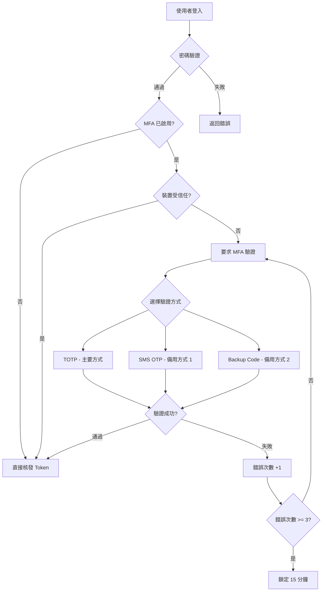
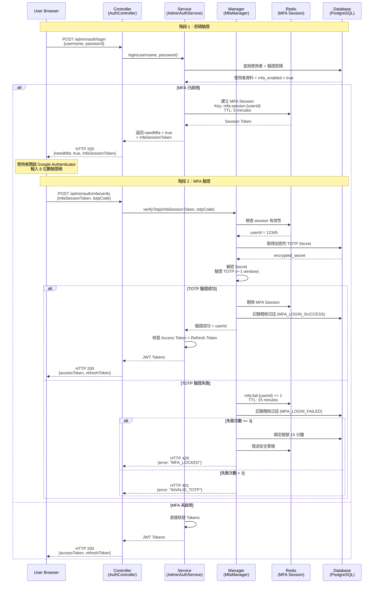
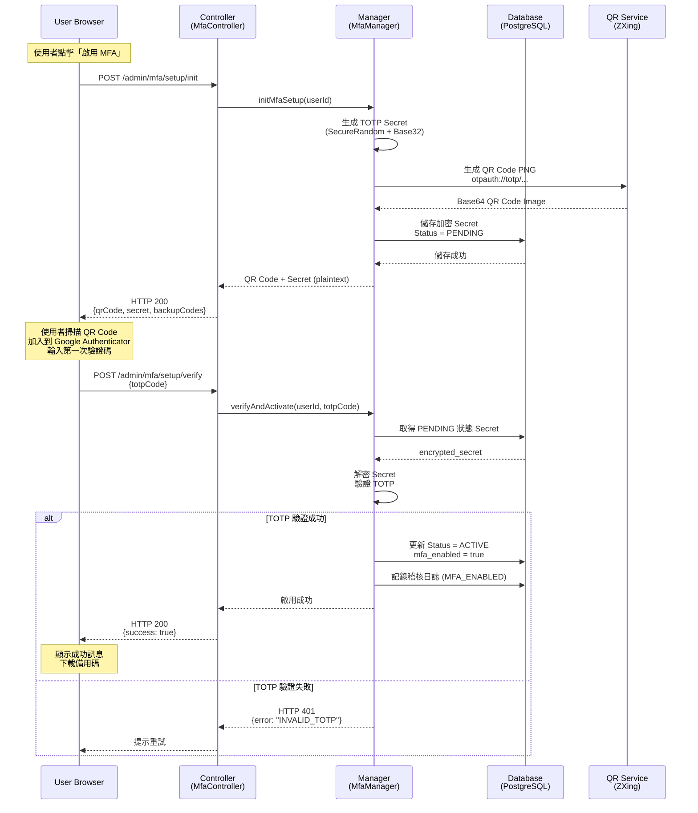
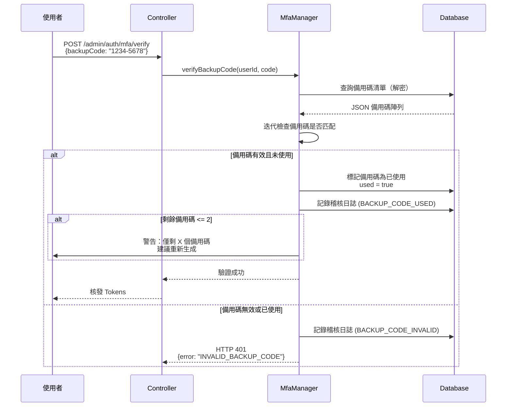
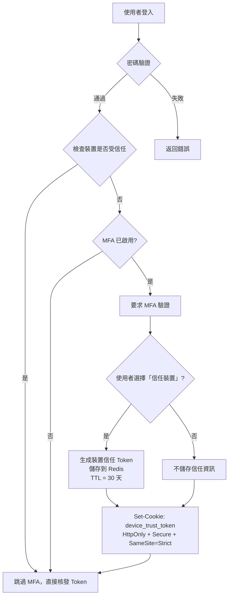

# MFA 技術架構（MFA Technical Architecture）

> **業務需求**: [MFA_Requirements.md](../../requirements/06_Governance_Licensing/04_MFA_Requirements.md)
> **規範來源**: [06-06 MFA Implementation](../../source-archive/06_Platform_Governance/06-06_MFA_Implementation.md)
> **視角**: Technical Architecture (Development & DevOps)
> **目標讀者**: Backend Developers, Security Engineers, Compliance Officers

**相關來源文件**:
- [06-06-02 TOTP & WebAuthn Implementation](../../source-archive/06_Platform_Governance/06-06-02_TOTP_WebAuthn.md)
- [06-06-03 Login & Recovery Flow](../../source-archive/06_Platform_Governance/06-06-03_Recovery_Flow.md)

---

## 1. 架構概覽（Architecture Overview）

### 1.1 系統流程（System Flow）



### 1.2 SmartAdmin 層級映射（SmartAdmin Layer Mapping）

| 層級 | 元件 | 職責 |
|-------|-----------|----------------|
| **Controller** | `MfaController` | HTTP endpoints, request validation |
| **Service** | `AdminAuthService` | Login orchestration, token issuance |
| **Manager** | `MfaManager` | TOTP verification, backup codes (contains `@Transactional`) |
| **Dao** | `MfaDao` | MFA record persistence |
| **Entity** | `MfaEntity` | Database mapping |

---

## 2. TOTP 實作（TOTP Implementation）

### 2.1 RFC 6238 演算法（RFC 6238 Algorithm）

**TOTP (Time-based One-Time Password)** 基於 [RFC 6238](https://tools.ietf.org/html/rfc6238) 標準。

**核心演算法**:

```
TOTP = HOTP(K, T)

Where:
- K = Shared Secret (Base32 encoded)
- T = Floor(Current Unix Time / Time Step)
- Time Step = 30 seconds (standard value)
- HOTP = HMAC-based One-Time Password (RFC 4226)
```

**Python 實作參考**:

```python
import hmac
import hashlib
import time
import base64

def generate_totp(secret_key: str, time_step: int = 30) -> str:
    """
    Generate 6-digit TOTP verification code

    Args:
        secret_key: Base32 encoded shared secret (e.g., JBSWY3DPEHPK3PXP)
        time_step: Time step in seconds, default 30

    Returns:
        6-digit verification code (e.g., 123456)
    """
    # Step 1: Calculate time counter (T)
    current_time = int(time.time())
    time_counter = current_time // time_step

    # Step 2: Convert counter to 8-byte big-endian
    time_bytes = time_counter.to_bytes(8, byteorder='big')

    # Step 3: Decode Base32 secret
    key_bytes = base64.b32decode(secret_key)

    # Step 4: Calculate HMAC-SHA1
    hmac_hash = hmac.new(key_bytes, time_bytes, hashlib.sha1).digest()

    # Step 5: Dynamic Truncation
    offset = hmac_hash[-1] & 0x0F
    truncated_hash = hmac_hash[offset:offset+4]

    # Step 6: Convert to integer and modulo
    code = int.from_bytes(truncated_hash, byteorder='big') & 0x7FFFFFFF
    otp = code % 1000000  # 6 digits

    return f"{otp:06d}"  # Pad leading zeros
```

**演算法安全性分析**:

| 特性 | 說明 | 安全評級 |
|----------|-------------|-----------------|
| **單向性** | HMAC-SHA1 不可逆，無法從驗證碼推導出密鑰 | 5/5 |
| **時效性** | 驗證碼每 30 秒變更一次 | 5/5 |
| **抗暴力破解** | 6 位數字 (1M 種可能) x 30 秒視窗 = 極低成功率 | 4/5 |
| **離線驗證** | 伺服器與客戶端獨立計算，無需網路 | 5/5 |

### 2.2 密鑰生成與共享（Secret Key Generation & Sharing）

**Java 實作**:

```java
import java.security.SecureRandom;
import java.util.Base64;

public class TotpSecretGenerator {

    /**
     * Generate TOTP shared secret (Base32 encoded)
     *
     * @return 20-byte random secret (e.g., JBSWY3DPEHPK3PXP)
     */
    public static String generateSecret() {
        SecureRandom random = new SecureRandom();
        byte[] bytes = new byte[20];  // 160 bits (RFC 6238 recommended)
        random.nextBytes(bytes);

        // Use Base32 encoding (A-Z and 2-7, 32 characters)
        return Base32.encode(bytes);
    }

    /**
     * Generate QR Code URL (for Google Authenticator scanning)
     *
     * @param username User name
     * @param secret Base32 encoded secret
     * @param issuer Issuer name (displayed in app)
     * @return otpauth:// protocol URL
     */
    public static String generateQrCodeUrl(String username, String secret, String issuer) {
        return String.format(
            "otpauth://totp/%s:%s?secret=%s&issuer=%s&algorithm=SHA1&digits=6&period=30",
            issuer,
            username,
            secret,
            issuer
        );
    }
}
```

**密鑰加密（Secret Encryption）（AES-256-GCM）**:

```java
import javax.crypto.Cipher;
import javax.crypto.SecretKey;
import javax.crypto.spec.GCMParameterSpec;
import java.nio.charset.StandardCharsets;
import java.util.Base64;

public class TotpSecretEncryption {
    private static final String ALGORITHM = "AES/GCM/NoPadding";
    private static final int GCM_TAG_LENGTH = 128;

    /**
     * Encrypt TOTP Secret using AES-256-GCM
     *
     * @param plainSecret Plain text secret (e.g., JBSWY3DPEHPK3PXP)
     * @param masterKey Master key (from KMS, e.g., AWS KMS / HashiCorp Vault)
     * @return Base64 encoded ciphertext
     */
    public static String encryptSecret(String plainSecret, SecretKey masterKey) throws Exception {
        Cipher cipher = Cipher.getInstance(ALGORITHM);
        cipher.init(Cipher.ENCRYPT_MODE, masterKey);

        byte[] iv = cipher.getIV();  // Initialization Vector
        byte[] ciphertext = cipher.doFinal(plainSecret.getBytes(StandardCharsets.UTF_8));

        // Format: IV + Ciphertext (Base64 encoded)
        byte[] combined = new byte[iv.length + ciphertext.length];
        System.arraycopy(iv, 0, combined, 0, iv.length);
        System.arraycopy(ciphertext, 0, combined, iv.length, ciphertext.length);

        return Base64.getEncoder().encodeToString(combined);
    }

    /**
     * Decrypt TOTP Secret
     */
    public static String decryptSecret(String encryptedSecret, SecretKey masterKey) throws Exception {
        byte[] combined = Base64.getDecoder().decode(encryptedSecret);

        // Extract IV (first 12 bytes)
        byte[] iv = new byte[12];
        System.arraycopy(combined, 0, iv, 0, 12);

        // Extract ciphertext
        byte[] ciphertext = new byte[combined.length - 12];
        System.arraycopy(combined, 12, ciphertext, 0, ciphertext.length);

        Cipher cipher = Cipher.getInstance(ALGORITHM);
        cipher.init(Cipher.DECRYPT_MODE, masterKey, new GCMParameterSpec(GCM_TAG_LENGTH, iv));

        byte[] plaintext = cipher.doFinal(ciphertext);
        return new String(plaintext, StandardCharsets.UTF_8);
    }
}
```

**密鑰管理最佳實踐**:

| 階段 | 最佳實踐 | SmartAdmin 實作 |
|-------|---------------|---------------------------|
| **生成** | 使用 `SecureRandom` (不使用 `Random`) | `SecureRandom` + 160 bits entropy |
| **傳輸** | 透過 QR Code (HTTPS + 一次性顯示) | QR Code 僅顯示一次 |
| **儲存** | AES-256-GCM 加密 + KMS 管理主密鑰 | 整合 AWS KMS / Vault |
| **使用** | 使用前立即解密，不留記憶體痕跡 | `try-finally` 清除變數 |
| **銷毀** | 使用者停用 MFA 時刪除密鑰 | `CASCADE DELETE` |

### 2.3 時間同步（Time Synchronization）

**問題**: 伺服器時間可能與使用者裝置時間不一致（+-5 分鐘）。

**解決方案**: 允許 +-1 時間視窗（驗證前一個、當前、下一個 30 秒視窗的驗證碼）。

**Java 實作**:

```java
import java.time.Instant;

public class TotpValidator {
    private static final int TIME_STEP = 30;  // 30 seconds
    private static final int WINDOW = 1;      // Allow +-1 window

    /**
     * Validate TOTP code (with time drift tolerance)
     *
     * @param userCode User-entered 6-digit code
     * @param secret Base32 encoded shared secret
     * @return true if valid, false otherwise
     */
    public static boolean validate(String userCode, String secret) {
        long currentTime = Instant.now().getEpochSecond();

        // Check current window + previous and next windows (3 total)
        for (int i = -WINDOW; i <= WINDOW; i++) {
            long timeCounter = (currentTime / TIME_STEP) + i;
            String generatedCode = generateTotp(secret, timeCounter);

            if (userCode.equals(generatedCode)) {
                return true;
            }
        }

        return false;  // No window matches
    }

    private static String generateTotp(String secret, long timeCounter) {
        // Use HMAC-SHA1 algorithm from Section 2.1
        // ... (implementation omitted)
    }
}
```

**時間同步測試矩陣**:

| 伺服器時間 | 裝置時間 | 時間差 | 結果 | 備註 |
|-------------|-------------|-------|--------|-------|
| 10:00:00 | 10:00:00 | 0s | 成功 | 完全同步 |
| 10:00:00 | 10:00:25 | +25s | 成功 | 在當前視窗內 |
| 10:00:00 | 10:00:35 | +35s | 成功 | 下一個視窗（允許 +1） |
| 10:00:00 | 10:01:05 | +65s | 失敗 | 超出 +-1 視窗範圍 |
| 10:00:00 | 09:59:25 | -35s | 成功 | 前一個視窗（允許 -1） |

**NTP 配置**:

```bash
# Server-side NTP auto-sync
sudo apt-get install ntp
sudo systemctl enable ntp
sudo systemctl start ntp

# Verify sync status
ntpq -p
```

---

## 3. API 規格（API Specifications）

### 3.1 密碼登入（Password Login）（階段 1）

```http
POST /admin/auth/login
Content-Type: application/json

{
  "username": "admin@smartadmin.com",
  "password": "SecurePassword123!",
  "deviceFingerprint": "e3b0c44298fc1c149afbf4c8996fb92427ae41e4649b934ca495991b7852b855"
}
```

**回應（Response）（MFA 已啟用）**:

```json
{
  "code": 200,
  "msg": "Password verified. MFA required.",
  "data": {
    "needMfa": true,
    "mfaSessionToken": "mfa_sess_abc123xyz...",
    "expiresAt": "2026-02-05T10:05:00Z",
    "availableMethods": ["totp", "sms", "backup_code"]
  }
}
```

**回應（Response）（MFA 未啟用）**:

```json
{
  "code": 200,
  "msg": "Login successful.",
  "data": {
    "needMfa": false,
    "accessToken": "eyJhbGciOiJIUzI1NiIsInR5cCI6IkpXVCJ9...",
    "refreshToken": "rt_abc123xyz...",
    "user": {
      "userId": 12345,
      "username": "admin@smartadmin.com",
      "roles": ["SUPER_ADMIN"]
    }
  }
}
```

### 3.2 MFA 驗證（MFA Verification）（階段 2）

```http
POST /admin/auth/mfa/verify
Content-Type: application/json

{
  "mfaSessionToken": "mfa_sess_abc123xyz...",
  "totpCode": "123456",
  "trustDevice": true
}
```

**回應（Response）（成功）**:

```json
{
  "code": 200,
  "msg": "MFA verification successful.",
  "data": {
    "accessToken": "eyJhbGciOiJIUzI1NiIsInR5cCI6IkpXVCJ9...",
    "refreshToken": "rt_abc123xyz...",
    "user": {
      "userId": 12345,
      "username": "admin@smartadmin.com",
      "roles": ["SUPER_ADMIN"]
    }
  }
}
```

**回應（Response）（失敗）**:

```json
{
  "code": 401,
  "msg": "Invalid TOTP code.",
  "data": {
    "remainingAttempts": 2,
    "lockoutDuration": null
  }
}
```

**回應（Response）（帳號鎖定）**:

```json
{
  "code": 429,
  "msg": "Too many failed MFA attempts. Account locked.",
  "data": {
    "remainingAttempts": 0,
    "lockoutDuration": 900,
    "unlockAt": "2026-02-05T10:15:00Z"
  }
}
```

### 3.3 MFA 設定端點（MFA Setup Endpoints）

| 端點 | 方法 | 說明 |
|----------|--------|-------------|
| `/admin/mfa/setup/init` | POST | 初始化 MFA 設定（生成密鑰 + QR Code） |
| `/admin/mfa/setup/verify` | POST | 驗證並啟用 MFA |
| `/admin/mfa/backup-codes/status` | GET | 檢查剩餘備用碼 |
| `/admin/mfa/backup-codes/regenerate` | POST | 重新生成備用碼（需要 TOTP） |

---

## 4. 資料庫結構（Database Schema）

### 4.1 MFA 使用者表（MFA User Table）

```sql
CREATE TABLE t_admin_user_mfa (
    user_id             BIGINT PRIMARY KEY REFERENCES t_admin_user(user_id),
    mfa_enabled         BOOLEAN NOT NULL DEFAULT FALSE,
    totp_secret         VARCHAR(255) NOT NULL,          -- AES-256-GCM encrypted
    backup_codes        TEXT,                           -- JSON array (AES encrypted)
    status              VARCHAR(20) NOT NULL,           -- PENDING / ACTIVE / DISABLED
    activated_at        TIMESTAMP,                      -- Activation time
    created_at          TIMESTAMP DEFAULT NOW(),
    updated_at          TIMESTAMP DEFAULT NOW()
);

-- Indexes
CREATE INDEX idx_mfa_status ON t_admin_user_mfa(status);
CREATE INDEX idx_mfa_activated_at ON t_admin_user_mfa(activated_at);
```

### 4.2 MFA 稽核日誌表（MFA Audit Log Table）

```sql
CREATE TABLE t_audit_log_mfa (
    log_id              BIGSERIAL PRIMARY KEY,
    user_id             BIGINT NOT NULL REFERENCES t_admin_user(user_id),
    event_type          VARCHAR(50) NOT NULL,
    event_level         VARCHAR(20) NOT NULL,           -- INFO / WARNING / CRITICAL
    ip_address          INET,
    user_agent          TEXT,
    device_fingerprint  VARCHAR(64),
    details             JSONB,                          -- Additional details (JSON)
    created_at          TIMESTAMP DEFAULT NOW()
);

-- Indexes
CREATE INDEX idx_mfa_log_user_id ON t_audit_log_mfa(user_id);
CREATE INDEX idx_mfa_log_event_type ON t_audit_log_mfa(event_type);
CREATE INDEX idx_mfa_log_event_level ON t_audit_log_mfa(event_level);
CREATE INDEX idx_mfa_log_created_at ON t_audit_log_mfa(created_at);
```

### 4.3 MFA 恢復請求表（MFA Recovery Request Table）

```sql
CREATE TABLE t_mfa_recovery_request (
    request_id      BIGSERIAL PRIMARY KEY,
    user_id         BIGINT NOT NULL REFERENCES t_admin_user(user_id),
    id_card_photo   TEXT,                               -- ID card photo URL
    reason          TEXT,
    status          VARCHAR(20) NOT NULL,               -- PENDING / APPROVED / REJECTED
    reviewed_by     BIGINT REFERENCES t_admin_user(user_id),
    reviewed_at     TIMESTAMP,
    created_at      TIMESTAMP DEFAULT NOW()
);
```

### 4.4 緊急聯絡人表（Emergency Contacts Table）

```sql
CREATE TABLE t_mfa_emergency_contact (
    user_id             BIGINT NOT NULL REFERENCES t_admin_user(user_id),
    contact_user_id     BIGINT NOT NULL REFERENCES t_admin_user(user_id),
    contact_type        VARCHAR(20) NOT NULL,           -- COLLEAGUE / MANAGER
    verified            BOOLEAN DEFAULT FALSE,
    created_at          TIMESTAMP DEFAULT NOW(),
    PRIMARY KEY (user_id, contact_user_id)
);
```

### 4.5 Redis 資料結構（Redis Structures）

**MFA Session**:

```
Key:   mfa:session:{userId}
Value: {
  "userId": 12345,
  "createdAt": "2026-02-05T10:00:00Z"
}
TTL:   300 seconds (5 minutes)
```

**信任裝置（Trusted Device）**:

```
Key:   trusted_device:{userId}:{deviceFingerprint}
Value: {
  "userId": 12345,
  "deviceFingerprint": "e3b0c442...",
  "trustedAt": "2026-02-05T10:00:00Z",
  "expiresAt": "2026-03-07T10:00:00Z",
  "ipAddress": "203.0.113.42",
  "userAgent": "Mozilla/5.0..."
}
TTL:   2592000 seconds (30 days)
```

**MFA 失敗計數器（MFA Failure Counter）**:

```
Key:   mfa:fail:{userId}
Value: 3
TTL:   900 seconds (15 minutes)
```

---

## 5. 序列圖（Sequence Diagrams）

### 5.1 兩階段認證流程（Two-Phase Authentication Flow）



### 5.2 MFA 註冊流程（MFA Registration Flow）



### 5.3 備用碼登入流程（Backup Code Login Flow）



### 5.4 信任裝置流程（Trust Device Flow）



---

## 6. 程式碼範例（Code Examples）

### 6.1 QR Code 生成（QR Code Generation）（ZXing）

```java
import com.google.zxing.BarcodeFormat;
import com.google.zxing.client.j2se.MatrixToImageWriter;
import com.google.zxing.common.BitMatrix;
import com.google.zxing.qrcode.QRCodeWriter;

import javax.imageio.ImageIO;
import java.awt.image.BufferedImage;
import java.io.ByteArrayOutputStream;
import java.util.Base64;

public class QrCodeGenerator {

    /**
     * Generate TOTP QR Code (Base64 PNG image)
     *
     * @param username User name
     * @param secret Base32 encoded TOTP Secret
     * @param issuer Issuer name (displayed in App)
     * @return Base64 encoded PNG image
     */
    public static String generateQrCode(String username, String secret, String issuer) throws Exception {
        // Step 1: Construct otpauth:// URL
        String otpauthUrl = String.format(
            "otpauth://totp/%s:%s?secret=%s&issuer=%s&algorithm=SHA1&digits=6&period=30",
            issuer,
            username,
            secret,
            issuer
        );

        // Step 2: Use ZXing to generate QR Code
        QRCodeWriter qrCodeWriter = new QRCodeWriter();
        BitMatrix bitMatrix = qrCodeWriter.encode(otpauthUrl, BarcodeFormat.QR_CODE, 300, 300);

        // Step 3: Convert to BufferedImage
        BufferedImage qrImage = MatrixToImageWriter.toBufferedImage(bitMatrix);

        // Step 4: Convert to Base64 PNG
        ByteArrayOutputStream baos = new ByteArrayOutputStream();
        ImageIO.write(qrImage, "PNG", baos);
        byte[] imageBytes = baos.toByteArray();

        return "data:image/png;base64," + Base64.getEncoder().encodeToString(imageBytes);
    }
}
```

### 6.2 備用碼生成器（Backup Code Generator）

```java
import java.security.SecureRandom;
import java.util.ArrayList;
import java.util.List;

public class BackupCodeGenerator {

    private static final SecureRandom RANDOM = new SecureRandom();

    /**
     * Generate backup codes (8 digits, format: 1234-5678)
     *
     * @param count Number to generate (recommend 10)
     * @return List of backup codes
     */
    public static List<String> generate(int count) {
        List<String> codes = new ArrayList<>(count);

        for (int i = 0; i < count; i++) {
            // Generate 8-digit number (10000000 ~ 99999999)
            int code = RANDOM.nextInt(90000000) + 10000000;

            // Format as 1234-5678 (easier to read)
            String formatted = String.format("%04d-%04d",
                code / 10000,
                code % 10000
            );

            codes.add(formatted);
        }

        return codes;
    }
}
```

### 6.3 MFA 設定服務（MFA Setup Service）

```java
import org.springframework.stereotype.Component;
import org.springframework.stereotype.Service;
import org.springframework.transaction.annotation.Transactional;

/**
 * Manager class for MFA setup persistence operations.
 * SmartAdmin Pattern: @Transactional only in Manager layer with @Component.
 */
@Component
@RequiredArgsConstructor
public class MfaSetupManager {

    private final MfaRepository mfaRepository;
    private final AuditLogService auditLogService;

    /**
     * Persist MFA setup record (transactional).
     */
    @Transactional(rollbackFor = Throwable.class)
    public void savePendingMfaSetup(Long userId, String encryptedSecret, String encryptedBackupCodes) {
        MfaEntity mfa = MfaEntity.builder()
            .userId(userId)
            .totpSecret(encryptedSecret)
            .backupCodes(encryptedBackupCodes)
            .status(MfaStatus.PENDING)
            .build();
        mfaRepository.save(mfa);
        auditLogService.log(userId, "MFA_SETUP_INIT", "User started MFA setup");
    }

    /**
     * Activate MFA record (transactional).
     */
    @Transactional(rollbackFor = Throwable.class)
    public void activateMfa(MfaEntity mfa, Long userId) {
        mfa.setStatus(MfaStatus.ACTIVE);
        mfa.setActivatedAt(Instant.now());
        mfaRepository.save(mfa);
        auditLogService.log(userId, "MFA_ENABLED", "MFA successfully activated");
    }
}

/**
 * Service class for MFA setup orchestration.
 * Delegates transactional operations to MfaSetupManager.
 */
@Service
@RequiredArgsConstructor
public class MfaSetupService {

    private final MfaRepository mfaRepository;
    private final MfaSetupManager mfaSetupManager;
    private final TotpValidator totpValidator;
    private final AuditLogService auditLogService;

    /**
     * Initialize MFA setup (generate Secret + QR Code).
     * Delegates persistence to MfaSetupManager.
     *
     * @param userId User ID
     * @return MFA setup info (QR Code + Secret + Backup Codes)
     */
    public MfaSetupVO initMfaSetup(Long userId) {
        // Step 1: Check if user already has MFA enabled
        if (mfaRepository.isMfaEnabled(userId)) {
            throw new BusinessException("MFA already enabled, cannot setup again");
        }

        // Step 2: Generate TOTP Secret (Base32 encoded)
        String totpSecret = TotpSecretGenerator.generateSecret();

        // Step 3: Generate QR Code
        String username = getUserEmail(userId);
        String qrCodeBase64 = QrCodeGenerator.generateQrCode(
            username,
            totpSecret,
            "SmartAdmin iGaming"
        );

        // Step 4: Generate 10 backup codes (8-digit)
        List<String> backupCodes = BackupCodeGenerator.generate(10);

        // Step 5: Encrypt and save to database (delegate to Manager)
        String encryptedSecret = encryptSecret(totpSecret);
        String encryptedBackupCodes = encryptBackupCodes(backupCodes);

        mfaSetupManager.savePendingMfaSetup(userId, encryptedSecret, encryptedBackupCodes);

        // Step 7: Return to frontend (plaintext secret shown only once)
        return MfaSetupVO.builder()
            .qrCode(qrCodeBase64)
            .secret(totpSecret)  // Plaintext (only once)
            .backupCodes(backupCodes)
            .build();
    }

    /**
     * Verify and activate MFA.
     * Delegates transactional operation to MfaSetupManager.
     *
     * @param userId User ID
     * @param totpCode User-entered 6-digit code
     * @return Activation result
     */
    public ResponseDTO<Void> verifyAndActivate(Long userId, String totpCode) {
        // Step 1: Get PENDING status MFA record
        MfaEntity mfa = mfaRepository.findByUserIdAndStatus(userId, MfaStatus.PENDING)
            .orElseThrow(() -> new BusinessException("No pending MFA setup found"));

        // Step 2: Decrypt TOTP Secret
        String decryptedSecret = decryptSecret(mfa.getTotpSecret());

        // Step 3: Validate TOTP code
        boolean isValid = totpValidator.validate(totpCode, decryptedSecret);

        if (!isValid) {
            auditLogService.log(userId, "MFA_SETUP_VERIFY_FAILED", "TOTP verification failed");
            return ResponseDTO.error(ErrorCode.INVALID_TOTP);
        }

        // Step 4: Activate MFA (delegate to Manager)
        mfaSetupManager.activateMfa(mfa, userId);

        return ResponseDTO.ok();
    }
}
```

### 6.4 MFA 策略服務（MFA Policy Service）

```java
@Service
@RequiredArgsConstructor
public class MfaPolicyService {

    private final AdminUserService adminUserService;
    private final MfaRepository mfaRepository;

    /**
     * Check if user requires mandatory MFA
     *
     * @param userId User ID
     * @return true if mandatory, false if optional
     */
    public boolean requiresMandatoryMfa(Long userId) {
        List<String> roles = adminUserService.getUserRoles(userId);

        // Mandatory MFA roles list
        Set<String> mandatoryMfaRoles = Set.of(
            "SUPER_ADMIN",
            "FINANCE_MANAGER",
            "RISK_CONTROL",
            "DATABASE_ADMIN",
            "DEVOPS"
        );

        // Check if user belongs to mandatory MFA role
        return roles.stream().anyMatch(mandatoryMfaRoles::contains);
    }

    /**
     * Validate MFA status before login
     *
     * @param userId User ID
     * @throws MfaNotEnabledException If user requires MFA but hasn't enabled
     */
    public void validateMfaStatusBeforeLogin(Long userId) {
        if (requiresMandatoryMfa(userId)) {
            boolean mfaEnabled = mfaRepository.isMfaEnabled(userId);

            if (!mfaEnabled) {
                throw new MfaNotEnabledException(
                    "Your role requires MFA to be enabled before login. Please contact administrator."
                );
            }
        }
    }
}
```

### 6.5 裝置指紋（Device Fingerprint）（JavaScript）

```javascript
import FingerprintJS from '@fingerprintjs/fingerprintjs';

async function getDeviceFingerprint() {
  // Initialize FingerprintJS
  const fp = await FingerprintJS.load();
  const result = await fp.get();

  // Return device unique identifier (99.5% accuracy)
  return result.visitorId;
}

// Attach Device Fingerprint during login
const deviceFingerprint = await getDeviceFingerprint();
const response = await fetch('/admin/auth/login', {
  method: 'POST',
  headers: { 'Content-Type': 'application/json' },
  body: JSON.stringify({
    username: 'admin@smartadmin.com',
    password: 'SecurePassword123!',
    deviceFingerprint: deviceFingerprint
  })
});
```

---

## 7. 異常偵測規則（Anomaly Detection Rules）（SQL）

### 7.1 短時間內多次 MFA 失敗（Multiple MFA Failures in Short Time）

```sql
-- Detection: >= 3 MFA failures in 5 minutes
SELECT
    user_id,
    COUNT(*) AS fail_count,
    ARRAY_AGG(ip_address) AS ip_list
FROM t_audit_log_mfa
WHERE event_type = 'MFA_LOGIN_FAILED'
  AND created_at >= NOW() - INTERVAL '5 minutes'
GROUP BY user_id
HAVING COUNT(*) >= 3;
```

### 7.2 地理位置異常偵測（Geographic Anomaly Detection）

```sql
-- Detection: Login from different countries within 1 hour
SELECT
    a.user_id,
    a.ip_address AS ip_1,
    b.ip_address AS ip_2,
    a.created_at AS time_1,
    b.created_at AS time_2
FROM t_audit_log_mfa a
JOIN t_audit_log_mfa b ON a.user_id = b.user_id
WHERE a.event_type = 'MFA_LOGIN_SUCCESS'
  AND b.event_type = 'MFA_LOGIN_SUCCESS'
  AND a.created_at < b.created_at
  AND b.created_at - a.created_at <= INTERVAL '1 hour'
  AND get_country(a.ip_address) != get_country(b.ip_address);
```

### 7.3 頻繁使用備用碼（Frequent Backup Code Usage）

```sql
-- Detection: >= 3 backup code uses in 7 days
SELECT
    user_id,
    COUNT(*) AS backup_code_usage
FROM t_audit_log_mfa
WHERE event_type = 'BACKUP_CODE_USED'
  AND created_at >= NOW() - INTERVAL '7 days'
GROUP BY user_id
HAVING COUNT(*) >= 3;
```

### 7.4 高風險 MFA 停用（High-Risk MFA Disabled）

```sql
-- Detection: MFA disabled for high-risk roles
SELECT
    l.user_id,
    u.username,
    l.created_at,
    l.details->>'disabledBy' AS disabled_by
FROM t_audit_log_mfa l
JOIN t_admin_user u ON l.user_id = u.user_id
WHERE l.event_type = 'MFA_DISABLED'
  AND u.role_code IN ('SUPER_ADMIN', 'FINANCE_MANAGER', 'RISK_CONTROL');
```

---

## 8. 整合測試（Integration Tests）

```java
@SpringBootTest
@AutoConfigureMockMvc
@RequiredArgsConstructor
class MfaIntegrationTest {

    private final MockMvc mockMvc;

    private final MfaRepository mfaRepository;

    @Test
    @DisplayName("TC-MFA-001: User first time TOTP setup")
    void testInitMfaSetup() throws Exception {
        // Given
        Long userId = 12345L;

        // When
        MvcResult result = mockMvc.perform(post("/admin/mfa/setup/init")
                .header("X-User-Id", userId))
            .andExpect(status().isOk())
            .andReturn();

        // Then
        String responseBody = result.getResponse().getContentAsString();
        JsonNode json = objectMapper.readTree(responseBody);

        assertThat(json.get("data").get("qrCode").asText()).startsWith("data:image/png;base64,");
        assertThat(json.get("data").get("secret").asText()).hasSize(32);  // Base32 = 32 chars

        // Verify database
        MfaEntity mfa = mfaRepository.findByUserId(userId).orElseThrow();
        assertThat(mfa.getStatus()).isEqualTo(MfaStatus.PENDING);
        assertThat(mfa.getTotpSecret()).isNotBlank();  // Encrypted secret
    }

    @Test
    @DisplayName("TC-MFA-004: Account locked after 3 consecutive TOTP failures")
    void testMfaLockAfterThreeFailures() throws Exception {
        // Given
        Long userId = 12345L;
        String mfaSessionToken = "mfa_sess_test123";

        // When: 3 failed attempts
        for (int i = 0; i < 3; i++) {
            mockMvc.perform(post("/admin/auth/mfa/verify")
                    .contentType(MediaType.APPLICATION_JSON)
                    .content("{\"mfaSessionToken\":\"" + mfaSessionToken + "\",\"totpCode\":\"000000\"}"))
                .andExpect(status().isUnauthorized());
        }

        // Then: 4th attempt should return 429
        mockMvc.perform(post("/admin/auth/mfa/verify")
                .contentType(MediaType.APPLICATION_JSON)
                .content("{\"mfaSessionToken\":\"" + mfaSessionToken + "\",\"totpCode\":\"000000\"}"))
            .andExpect(status().isTooManyRequests())
            .andExpect(jsonPath("$.msg").value(containsString("locked")));
    }
}
```

---

## 9. 錯誤碼（Error Codes）

| 錯誤碼 | HTTP 狀態 | 說明 | 解決方案 |
|------------|-------------|-------------|------------|
| `INVALID_MFA_SESSION` | 401 | MFA Session Token 過期或無效 | 重新執行階段 1（密碼登入） |
| `INVALID_TOTP` | 401 | TOTP 驗證碼錯誤 | 提示使用者重試（顯示剩餘嘗試次數） |
| `MFA_LOCKED` | 429 | 3 次失敗後帳號鎖定 | 顯示解鎖倒數計時（15 分鐘） |
| `MFA_NOT_ENABLED` | 400 | 使用者未啟用 MFA 卻呼叫驗證 | 引導使用者啟用 MFA |
| `TIME_SYNC_ERROR` | 500 | 伺服器時間未與 NTP 同步 | 觸發維運警報，重啟 NTP 服務 |

---

## 10. 技術堆疊（Technology Stack）

| 元件 | 技術 | 版本 |
|-----------|------------|---------|
| TOTP 演算法 | RFC 6238 (HMAC-SHA1) | - |
| QR Code 生成 | ZXing | 3.5.x |
| 密鑰加密 | AES-256-GCM | - |
| 密鑰管理 | AWS KMS / HashiCorp Vault | - |
| 裝置指紋 | FingerprintJS | 4.x |
| Session 儲存 | Redis | 7.x |
| 資料庫 | PostgreSQL | 16.x |

---

**文件結束**
