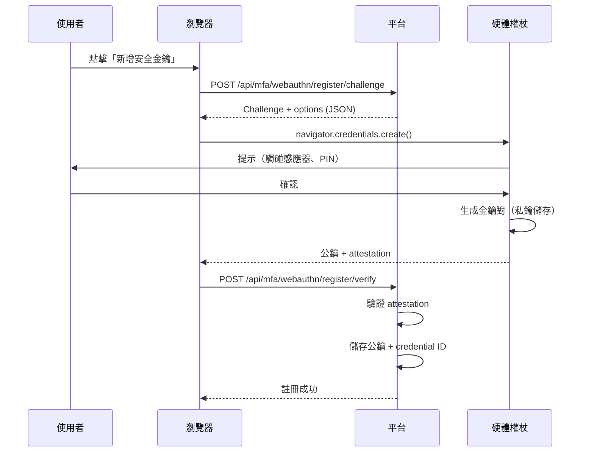
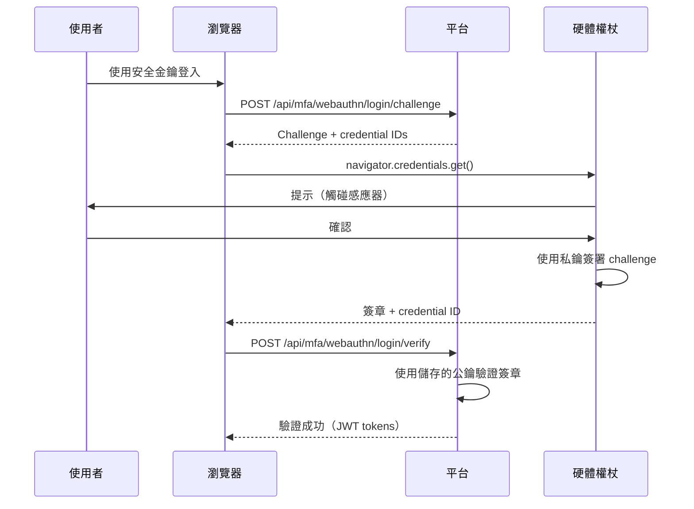

# MFA 技術評估（MFA Technical Evaluation）— TOTP、SMS 與 WebAuthn

> **業務需求**: [MFA_Architecture_Spec.md](../../requirements/06_Governance_Licensing/03_MFA_Architecture_Spec.md)
> **目標讀者**: Security Engineers、Backend Developers、Compliance Officers
> **最後同步**: 2026-02-09

---

## 1. TOTP（Time-Based One-Time Password）RFC 6238

### 1.1 技術規格（Technical Specification）

**標準**: RFC 6238（TOTP: Time-Based One-Time Password Algorithm）
**發布時間**: 2011年5月
**IETF 狀態**: Informational

**演算法組件**:
1. **共享密鑰（Shared Secret）**: Base32 編碼的密鑰（最小 160 位元）
2. **時間步長（Time Step）**: 30 秒（X = 30）
3. **雜湊函數（Hash Function）**: HMAC-SHA1（預設）、HMAC-SHA256 或 HMAC-SHA512
4. **驗證碼長度（Code Length）**: 6 位數（建議）或 8 位數
5. **時間窗口（Time Window）**: ±1 時間步長（允許時鐘偏移）

### 1.2 TOTP 演算法實作（TOTP Algorithm Implementation）

**公式**:
```
TOTP(K, T) = HOTP(K, (T - T0) / X)

Where:
- K: Shared secret key
- T: Current Unix timestamp
- T0: Unix epoch (0)
- X: Time step (30 seconds)
- HOTP: HMAC-based One-Time Password Algorithm (RFC 4226)
```

### 1.3 Java 實作（Java Implementation）

**TOTPGenerator.java**:

```java
@Component
public class TOTPGenerator {

    private static final int TIME_STEP = 30; // 30 seconds
    private static final int CODE_DIGITS = 6;
    private static final String HMAC_ALGORITHM = "HmacSHA1";

    /**
     * Generate TOTP code for a given secret
     *
     * @param secret Base32-encoded secret key
     * @return 6-digit TOTP code
     */
    public String generateTOTP(String secret) {
        try {
            // Step 1: Decode Base32 secret
            byte[] keyBytes = new Base32().decode(secret);

            // Step 2: Get current time counter
            long currentTime = System.currentTimeMillis() / 1000L;
            long counter = currentTime / TIME_STEP;

            // Step 3: Convert counter to byte array (big-endian)
            byte[] counterBytes = ByteBuffer.allocate(8).putLong(counter).array();

            // Step 4: Compute HMAC-SHA1
            Mac mac = Mac.getInstance(HMAC_ALGORITHM);
            SecretKeySpec secretKey = new SecretKeySpec(keyBytes, HMAC_ALGORITHM);
            mac.init(secretKey);
            byte[] hash = mac.doFinal(counterBytes);

            // Step 5: Dynamic truncation (RFC 4226 Section 5.3)
            int offset = hash[hash.length - 1] & 0x0F;
            int binary = ((hash[offset] & 0x7F) << 24)
                | ((hash[offset + 1] & 0xFF) << 16)
                | ((hash[offset + 2] & 0xFF) << 8)
                | (hash[offset + 3] & 0xFF);

            // Step 6: Generate 6-digit code
            int otp = binary % (int) Math.pow(10, CODE_DIGITS);

            return String.format("%0" + CODE_DIGITS + "d", otp);

        } catch (NoSuchAlgorithmException | InvalidKeyException e) {
            throw new TOTPGenerationException("Failed to generate TOTP", e);
        }
    }

    /**
     * Verify TOTP code with time window tolerance
     *
     * @param secret Base32-encoded secret key
     * @param code 6-digit code from user
     * @param windowSize Number of time steps to check (±windowSize)
     * @return true if code is valid
     */
    public boolean verifyTOTP(String secret, String code, int windowSize) {
        long currentTime = System.currentTimeMillis() / 1000L;
        long currentCounter = currentTime / TIME_STEP;

        // Check current time step and ±windowSize steps (default ±1)
        for (int i = -windowSize; i <= windowSize; i++) {
            long testCounter = currentCounter + i;
            String testCode = generateTOTPForCounter(secret, testCounter);

            if (MessageDigest.isEqual(testCode.getBytes(), code.getBytes())) {
                return true;
            }
        }

        return false;
    }

    private String generateTOTPForCounter(String secret, long counter) {
        try {
            byte[] keyBytes = new Base32().decode(secret);
            byte[] counterBytes = ByteBuffer.allocate(8).putLong(counter).array();

            Mac mac = Mac.getInstance(HMAC_ALGORITHM);
            SecretKeySpec secretKey = new SecretKeySpec(keyBytes, HMAC_ALGORITHM);
            mac.init(secretKey);
            byte[] hash = mac.doFinal(counterBytes);

            int offset = hash[hash.length - 1] & 0x0F;
            int binary = ((hash[offset] & 0x7F) << 24)
                | ((hash[offset + 1] & 0xFF) << 16)
                | ((hash[offset + 2] & 0xFF) << 8)
                | (hash[offset + 3] & 0xFF);

            int otp = binary % (int) Math.pow(10, CODE_DIGITS);

            return String.format("%0" + CODE_DIGITS + "d", otp);

        } catch (NoSuchAlgorithmException | InvalidKeyException e) {
            throw new TOTPGenerationException("Failed to generate TOTP for counter", e);
        }
    }
}
```

### 1.4 密鑰生成（Secret Generation）

**SecretGenerator.java**:

```java
@Component
public class MFASecretGenerator {

    private static final int SECRET_SIZE = 20; // 160 bits

    /**
     * Generate cryptographically secure random secret
     *
     * @return Base32-encoded secret (e.g., JBSWY3DPEHPK3PXP)
     */
    public String generateSecret() {
        SecureRandom random = new SecureRandom();
        byte[] bytes = new byte[SECRET_SIZE];
        random.nextBytes(bytes);

        // Encode to Base32 for compatibility with Google Authenticator
        Base32 base32 = new Base32();
        return base32.encodeToString(bytes).replaceAll("=", ""); // Remove padding
    }

    /**
     * Generate QR code URI for TOTP setup
     *
     * @param secret Base32-encoded secret
     * @param issuer Platform name (e.g., "SmartAdmin")
     * @param accountName User identifier (e.g., email)
     * @return otpauth URI
     */
    public String generateQRCodeURI(String secret, String issuer, String accountName) {
        try {
            String encodedIssuer = URLEncoder.encode(issuer, StandardCharsets.UTF_8);
            String encodedAccountName = URLEncoder.encode(accountName, StandardCharsets.UTF_8);

            return String.format(
                "otpauth://totp/%s:%s?secret=%s&issuer=%s&algorithm=SHA1&digits=6&period=30",
                encodedIssuer,
                encodedAccountName,
                secret,
                encodedIssuer
            );
        } catch (Exception e) {
            throw new QRCodeGenerationException("Failed to generate QR code URI", e);
        }
    }
}
```

---

## 2. TOTP 密鑰加密（TOTP Secret Encryption）

### 2.1 加密標準（Encryption Standard）: AES-256-GCM

**演算法**: AES（Advanced Encryption Standard）
**模式**: GCM（Galois/Counter Mode）- AEAD（Authenticated Encryption with Associated Data）
**金鑰大小**: 256 位元
**IV 大小**: 96 位元（12 位元組）- GCM 建議值
**標籤大小**: 128 位元（16 位元組）- 用於驗證

**為何使用 GCM 模式**:
- ✅ 同時提供機密性與真實性
- ✅ 抵抗位元翻轉攻擊
- ✅ 高效能（硬體加速）
- ✅ NIST 建議（SP 800-38D）

### 2.2 密鑰加密實作（Secret Encryption Implementation）

**MFASecretEncryptor.java**:

```java
@Component
@RequiredArgsConstructor
public class MFASecretEncryptor {

    private final VaultKeyManager vaultKeyManager;

    private static final String ALGORITHM = "AES/GCM/NoPadding";
    private static final int IV_SIZE = 12; // 96 bits
    private static final int TAG_SIZE = 128; // 128 bits

    /**
     * Encrypt TOTP secret using AES-256-GCM
     *
     * @param plainSecret Base32-encoded TOTP secret
     * @param userId User identifier (for key derivation)
     * @return Encrypted secret (IV + ciphertext + tag, Base64-encoded)
     */
    public String encryptSecret(String plainSecret, String userId) {
        try {
            // Step 1: Retrieve master encryption key from Vault
            byte[] masterKey = vaultKeyManager.getMasterEncryptionKey();

            // Step 2: Derive user-specific key using HKDF
            byte[] userKey = deriveUserKey(masterKey, userId);

            // Step 3: Generate random IV
            byte[] iv = new byte[IV_SIZE];
            new SecureRandom().nextBytes(iv);

            // Step 4: Initialize cipher
            Cipher cipher = Cipher.getInstance(ALGORITHM);
            GCMParameterSpec gcmSpec = new GCMParameterSpec(TAG_SIZE, iv);
            SecretKeySpec keySpec = new SecretKeySpec(userKey, "AES");
            cipher.init(Cipher.ENCRYPT_MODE, keySpec, gcmSpec);

            // Step 5: Encrypt secret
            byte[] plainBytes = plainSecret.getBytes(StandardCharsets.UTF_8);
            byte[] cipherBytes = cipher.doFinal(plainBytes);

            // Step 6: Combine IV + ciphertext + tag
            byte[] combined = new byte[IV_SIZE + cipherBytes.length];
            System.arraycopy(iv, 0, combined, 0, IV_SIZE);
            System.arraycopy(cipherBytes, 0, combined, IV_SIZE, cipherBytes.length);

            // Step 7: Base64 encode for storage
            return Base64.getEncoder().encodeToString(combined);

        } catch (Exception e) {
            throw new EncryptionException("Failed to encrypt TOTP secret", e);
        }
    }

    /**
     * Decrypt TOTP secret using AES-256-GCM
     *
     * @param encryptedSecret Base64-encoded encrypted secret
     * @param userId User identifier
     * @return Plain TOTP secret
     */
    public String decryptSecret(String encryptedSecret, String userId) {
        try {
            // Step 1: Base64 decode
            byte[] combined = Base64.getDecoder().decode(encryptedSecret);

            // Step 2: Extract IV and ciphertext
            byte[] iv = Arrays.copyOfRange(combined, 0, IV_SIZE);
            byte[] cipherBytes = Arrays.copyOfRange(combined, IV_SIZE, combined.length);

            // Step 3: Retrieve and derive key
            byte[] masterKey = vaultKeyManager.getMasterEncryptionKey();
            byte[] userKey = deriveUserKey(masterKey, userId);

            // Step 4: Initialize cipher
            Cipher cipher = Cipher.getInstance(ALGORITHM);
            GCMParameterSpec gcmSpec = new GCMParameterSpec(TAG_SIZE, iv);
            SecretKeySpec keySpec = new SecretKeySpec(userKey, "AES");
            cipher.init(Cipher.DECRYPT_MODE, keySpec, gcmSpec);

            // Step 5: Decrypt and verify authentication tag
            byte[] plainBytes = cipher.doFinal(cipherBytes);

            return new String(plainBytes, StandardCharsets.UTF_8);

        } catch (AEADBadTagException e) {
            throw new DecryptionException("Secret authentication failed (possible tampering)", e);
        } catch (Exception e) {
            throw new DecryptionException("Failed to decrypt TOTP secret", e);
        }
    }

    /**
     * Derive user-specific encryption key using HKDF (HMAC-based Key Derivation Function)
     *
     * @param masterKey Master encryption key (256 bits)
     * @param userId User identifier
     * @return Derived key (256 bits)
     */
    private byte[] deriveUserKey(byte[] masterKey, String userId) {
        try {
            // HKDF-Expand using HMAC-SHA256
            Mac mac = Mac.getInstance("HmacSHA256");
            SecretKeySpec keySpec = new SecretKeySpec(masterKey, "HmacSHA256");
            mac.init(keySpec);

            byte[] info = ("totp-secret-" + userId).getBytes(StandardCharsets.UTF_8);
            byte[] hash = mac.doFinal(info);

            // Return first 256 bits (32 bytes)
            return Arrays.copyOf(hash, 32);

        } catch (Exception e) {
            throw new KeyDerivationException("Failed to derive user key", e);
        }
    }
}
```

### 2.3 資料庫儲存（Database Storage）

**MFA 密鑰儲存架構**:

```sql
CREATE TABLE t_user_mfa (
    id BIGSERIAL PRIMARY KEY,
    user_id BIGINT NOT NULL,
    encrypted_secret VARCHAR(500) NOT NULL,  -- Base64-encoded (IV + ciphertext + tag)
    encryption_algorithm VARCHAR(50) NOT NULL DEFAULT 'AES-256-GCM',
    secret_version INT NOT NULL DEFAULT 1,   -- For key rotation
    backup_codes_encrypted TEXT,             -- JSON array of encrypted backup codes
    enabled BOOLEAN NOT NULL DEFAULT FALSE,
    verified_at TIMESTAMP,
    created_at TIMESTAMP NOT NULL DEFAULT NOW(),
    updated_at TIMESTAMP NOT NULL DEFAULT NOW(),
    CONSTRAINT uk_user_mfa UNIQUE (user_id)
);

-- Index for quick lookup
CREATE INDEX idx_user_mfa_user_id ON t_user_mfa(user_id) WHERE enabled = TRUE;
```

---

## 3. SMS 安全威脅分析（SMS Security Threat Analysis）

### 3.1 SIM 卡交換攻擊（SIM Swap Attack）

**攻擊機制**:
1. 攻擊者獲取受害者個人資訊（社交工程）
2. 攻擊者聯繫電信業者，冒充受害者
3. 業者將受害者電話號碼轉移至攻擊者的 SIM 卡
4. 攻擊者接收所有簡訊，包含 OTP 驗證碼

**技術流程**:
```
攻擊者 → 社交工程 → 電信業者
                        ↓
                SIM 卡交換授權
                        ↓
        受害者號碼 → 攻擊者 SIM 卡
                        ↓
                SMS OTP 傳送至攻擊者
```

**緩解策略**:
- ✅ SIM 卡交換請求需額外驗證（PIN、安全問題）
- ✅ 偵測到 SIM 卡交換時透過電子郵件通知使用者
- ✅ 鎖定 MFA 設定，停用時需現有 MFA 驗證
- ⚠️ 淘汰 SMS OTP，改用 TOTP

**真實案例**:
- 2019: Twitter CEO Jack Dorsey 帳號透過 SIM 卡交換被駭
- 2020: 超過 1 億美元加密貨幣帳戶透過 SIM 卡交換被盜

### 3.2 SS7 協議漏洞（SS7 Protocol Vulnerability）

**SS7（Signaling System 7）**: 用於路由簡訊和通話的傳統電信協議。

**漏洞**:
- SS7 允許受信任網路節點查詢用戶位置
- 擁有 SS7 網路存取權的攻擊者可攔截簡訊
- 部分 SS7 指令不需驗證

**攻擊流程**:
```
攻擊者 → SS7 網路存取（暗網購買）
              ↓
        發送位置更新（HLR 查詢）
              ↓
        攔截 SMS OTP（無需 SIM 卡交換）
```

**緩解措施**:
- 電信業者必須實施 SS7 防火牆
- 平台無法直接緩解（業者層級問題）
- **解決方案**: 完全淘汰 SMS OTP，改用高安全性操作

### 3.3 SMS OTP 淘汰時間表（SMS OTP Deprecation Timeline）（NIST）

**NIST SP 800-63B（數位身分指南）**:

> "由於 SMS 訊息可能被攔截或重新導向的風險，新系統的實作者應仔細考慮替代驗證器。"
> - **NIST SP 800-63B**（2017年6月，第 5.1.3.2 節）

**產業淘汰時間表**:
- **2017**: NIST 建議新系統不使用 SMS OTP
- **2020**: Google 淘汰 Workspace 管理員的 SMS OTP
- **2021**: Microsoft 淘汰 Azure AD 的 SMS OTP（需使用 TOTP 或硬體權杖）
- **2023**: Apple 淘汰 Apple ID 的 SMS（需使用 TOTP 或硬體金鑰）
- **2025**: 歐盟 PSD2 SCA 法規逐步淘汰 SMS OTP

**建議**: 僅將 SMS OTP 作為低風險操作的備用方案；管理員強制使用 TOTP。

---

## 4. FIDO2 / WebAuthn 標準（FIDO2 / WebAuthn Standards）

### 4.1 FIDO2 概述（FIDO2 Overview）

**FIDO2 = CTAP + WebAuthn**:
- **CTAP（Client-to-Authenticator Protocol）**: 瀏覽器與硬體權杖（如 YubiKey）之間的通訊
- **WebAuthn（Web Authentication API）**: 用於無密碼驗證的瀏覽器 API

**主要優勢**:
- ✅ 抗網路釣魚（私鑰永不離開硬體）
- ✅ 無共享密鑰（非對稱加密）
- ✅ 硬體支援的安全性（TPM、Secure Enclave）
- ✅ 產業標準（W3C + FIDO Alliance）

### 4.2 WebAuthn 註冊流程（WebAuthn Registration Flow）



### 4.3 WebAuthn 驗證流程（WebAuthn Authentication Flow）



### 4.4 WebAuthn Java 實作（WebAuthn Java Implementation）（Spring Boot）

**WebAuthnService.java**（使用 Yubico java-webauthn-server 函式庫）:

```java
@Service
@RequiredArgsConstructor
public class WebAuthnService {

    private final RelyingParty relyingParty;
    private final CredentialRepository credentialRepository;

    /**
     * Generate registration challenge
     *
     * @param userId User identifier
     * @param username Display name
     * @return PublicKeyCredentialCreationOptions (JSON)
     */
    public PublicKeyCredentialCreationOptions startRegistration(Long userId, String username) {
        UserIdentity userIdentity = UserIdentity.builder()
            .name(username)
            .displayName(username)
            .id(ByteArray.fromLong(userId))
            .build();

        StartRegistrationOptions options = StartRegistrationOptions.builder()
            .user(userIdentity)
            .authenticatorSelection(AuthenticatorSelectionCriteria.builder()
                .userVerification(UserVerificationRequirement.REQUIRED) // PIN or biometric
                .residentKey(ResidentKeyRequirement.REQUIRED)           // Store credential on device
                .build())
            .build();

        return relyingParty.startRegistration(options);
    }

    /**
     * Verify registration response
     *
     * @param userId User identifier
     * @param response PublicKeyCredential from browser
     * @return RegistrationResult (contains credential ID and public key)
     */
    public RegistrationResult finishRegistration(Long userId, String response) {
        PublicKeyCredential<AuthenticatorAttestationResponse, ClientRegistrationExtensionOutputs> pkc =
            PublicKeyCredential.parseRegistrationResponseJson(response);

        FinishRegistrationOptions options = FinishRegistrationOptions.builder()
            .request(/* cached from startRegistration */)
            .response(pkc)
            .build();

        try {
            RegistrationResult result = relyingParty.finishRegistration(options);

            // Store credential
            credentialRepository.save(WebAuthnCredential.builder()
                .userId(userId)
                .credentialId(result.getKeyId().getId().getBase64())
                .publicKeyCose(result.getPublicKeyCose().getBase64())
                .signatureCount(result.getSignatureCount())
                .createdAt(LocalDateTime.now())
                .build());

            return result;

        } catch (RegistrationFailedException e) {
            throw new WebAuthnException("Registration verification failed", e);
        }
    }
}
```

---

## 5. 安全性比較矩陣（Security Comparison Matrix）

### 5.1 技術比較（Technical Comparison）

| 特性 | TOTP | SMS OTP | Email OTP | 硬體權杖（Hardware Token, FIDO2） |
|---------|------|---------|-----------|------------------------|
| **演算法** | HMAC-SHA1（RFC 6238） | N/A（電信） | N/A | ECDSA P-256 / RSA 2048 |
| **離線能力** | ✅ 是 | ❌ 否（需網路） | ❌ 否 | ✅ 是 |
| **抗網路釣魚** | ⚠️ 部分（驗證碼可能被釣魚） | ❌ 否 | ❌ 否 | ✅ 是（網域綁定） |
| **SIM 卡交換漏洞** | ✅ 否 | ❌ 是 | ✅ 否 | ✅ 否 |
| **SS7 攻擊漏洞** | ✅ 否 | ❌ 是 | ✅ 否 | ✅ 否 |
| **裝置依賴性** | ⚠️ 手機/應用程式 | ⚠️ 手機 | ⚠️ 電子郵件存取 | ⚠️ 硬體權杖 |
| **每位使用者成本** | $0 | $0.05-$0.10 每則簡訊 | $0 | $50-$70（一次性） |
| **設定複雜度** | 中（QR Code 掃描） | 低（自動） | 低（自動） | 高（USB/NFC 配對） |
| **NIST 建議** | ✅ 建議 | ⚠️ 已淘汰 | ⚠️ 不建議 | ✅ 建議（AAL3） |

### 5.2 攻擊面分析（Attack Surface Analysis）

**TOTP 攻擊向量**:
- ⚠️ 網路釣魚: 使用者在假登入頁面輸入驗證碼
  - 緩解: 短有效期（30秒）、使用者教育
- ⚠️ 裝置失竊: 實體存取手機
  - 緩解: 需裝置 PIN/生物辨識才能存取應用程式
- ⚠️ 備份碼失竊: 儲存不安全
  - 緩解: 加密備份碼，需 MFA 才能查看

**SMS OTP 攻擊向量**:
- ❌ **SIM 卡交換**（高風險）: 攻擊者取得電話號碼
- ❌ **SS7 劫持**（中風險）: 電信層級攔截
- ❌ **網路釣魚**（高風險）: 驗證碼可被攔截
- ❌ **惡意軟體**（中風險）: 手機上的簡訊讀取惡意軟體

**硬體權杖（FIDO2）攻擊向量**:
- ⚠️ 實體失竊: 攻擊者竊取權杖
  - 緩解: 需 PIN/生物辨識才能使用權杖
- ⚠️ 供應鏈: 受損硬體（罕見）
  - 緩解: 從可信供應商購買（Yubico、Google Titan）

### 5.3 合規性對齊（Compliance Alignment）

| 法規 | TOTP | SMS OTP | 硬體權杖（Hardware Token, FIDO2） |
|-----------|------|---------|------------------------|
| **NIST AAL2**（中度保證） | ✅ 核准 | ⚠️ 受限（有條件） | ✅ 核准 |
| **NIST AAL3**（高度保證） | ❌ 不足 | ❌ 禁止 | ✅ 必要 |
| **PSD2 SCA**（歐盟支付） | ✅ 合規 | ⚠️ 2025年前允許 | ✅ 合規 |
| **GDPR Art. 32**（資料保護） | ✅ 充足 | ⚠️ 可疑（SMS 風險） | ✅ 強 |
| **UKGC LCCP**（博彩執照） | ✅ 可接受 | ⚠️ 可接受但有警告 | ✅ 首選 |
| **MGA B2C/183/2010** | ✅ 管理員強制 | ❌ 單獨使用不足 | ✅ 建議 |

### 5.4 成本效益分析（Cost-Benefit Analysis）

**情境: 200 位管理員使用者**

| 方法 | 設定成本 | 年度成本 | 安全等級 | 建議 |
|--------|-----------|-------------|----------------|----------------|
| **僅 TOTP** | $0 | $0 | 高（5/5） | ✅ **符合成本效益的基準** |
| **TOTP + SMS 備用** | $500（整合） | $3,600（簡訊費） | 高（5/5） | ✅ 良好平衡 |
| **TOTP + 硬體權杖** | $10,000（權杖） | $0 | 極高（5/5） | ⚠️ 僅適用 AAL3 合規 |
| **僅 SMS** | $500 | $3,600 | 低（2/5） | ❌ **不建議** |

**ROI 計算**:
- **風險降低**: TOTP 將帳號入侵風險從 8.1 CVSS（高）降至 4.3（中）
- **資料外洩成本**: 平均 iGaming 平台資料外洩成本 $500K-$2M
- **預期損失降低**: TOTP（$0/年）vs. 潛在外洩（$1M）= ∞% ROI

---

## 6. 實作建議（Implementation Recommendations）

### 6.1 高風險角色強制 TOTP（Mandatory TOTP for High-Risk Roles）

```java
@Component
public class MFAEnforcementPolicy {

    /**
     * Determine if MFA is mandatory for user role
     *
     * @param role User role
     * @return true if MFA required
     */
    public boolean isMFAMandatory(Role role) {
        return role == Role.SUPER_ADMIN
            || role == Role.FINANCE_MANAGER
            || role == Role.RISK_CONTROL
            || role == Role.DEVELOPER;
    }

    /**
     * Determine allowed MFA methods for role
     *
     * @param role User role
     * @return List of allowed methods
     */
    public List<MFAMethod> getAllowedMethods(Role role) {
        if (role == Role.SUPER_ADMIN || role == Role.FINANCE_MANAGER) {
            // AAL3: Only hardware token or TOTP
            return Arrays.asList(MFAMethod.TOTP, MFAMethod.HARDWARE_TOKEN);
        }

        // AAL2: TOTP or SMS fallback
        return Arrays.asList(MFAMethod.TOTP, MFAMethod.SMS, MFAMethod.BACKUP_CODES);
    }
}
```

### 6.2 從 SMS 逐步遷移至 TOTP（Gradual Migration from SMS to TOTP）

**階段 1**（第 1-3 個月）: 鼓勵採用 TOTP
- 發送電子郵件鼓勵使用者從 SMS 切換至 TOTP
- 強調安全優勢

**階段 2**（第 4-6 個月）: 新帳號淘汰 SMS
- 新管理員帳號必須使用 TOTP
- 現有 SMS 使用者可繼續（既有權利）

**階段 3**（第 7-12 個月）: 強制遷移
- 所有使用者必須在期限前遷移至 TOTP
- 提供遷移指南和支援

**階段 4**（第 13 個月+）: 完全移除 SMS
- 平台全面停用 SMS OTP

---

## 7. 相關文件（Related Documents）

### 業務需求（Business Requirements）
- [MFA_Architecture_Spec.md](../../requirements/06_Governance_Licensing/03_MFA_Architecture_Spec.md) - MFA 方法選擇、風險分析、決策矩陣

### 技術實作（Technical Implementation）
- [MFA_Login_Recovery_Technical.md](10_MFA_Login_Recovery_Technical.md) - 兩階段登入、信任裝置權杖
- [MFA_Compliance_Technical.md](07_MFA_Compliance_Technical.md) - 稽核日誌、備份碼、合規驗證

### 安全標準（Security Standards）
- **NIST SP 800-63B**: 數位身分指南（AAL2/AAL3）
- **RFC 6238**: TOTP 規格
- **RFC 4226**: HOTP 規格
- **W3C WebAuthn Level 2**: Web Authentication API

---

**文件版本**: 1.0.0
**最後更新**: 2026-02-09
**維護者**: Security Team
