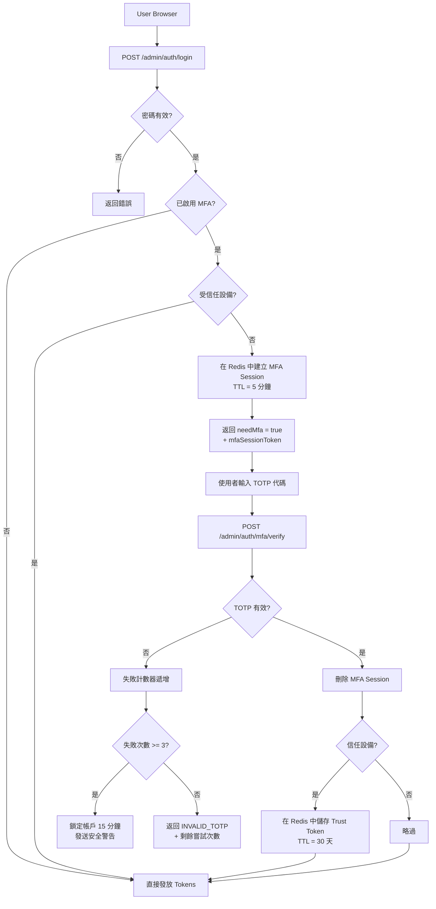
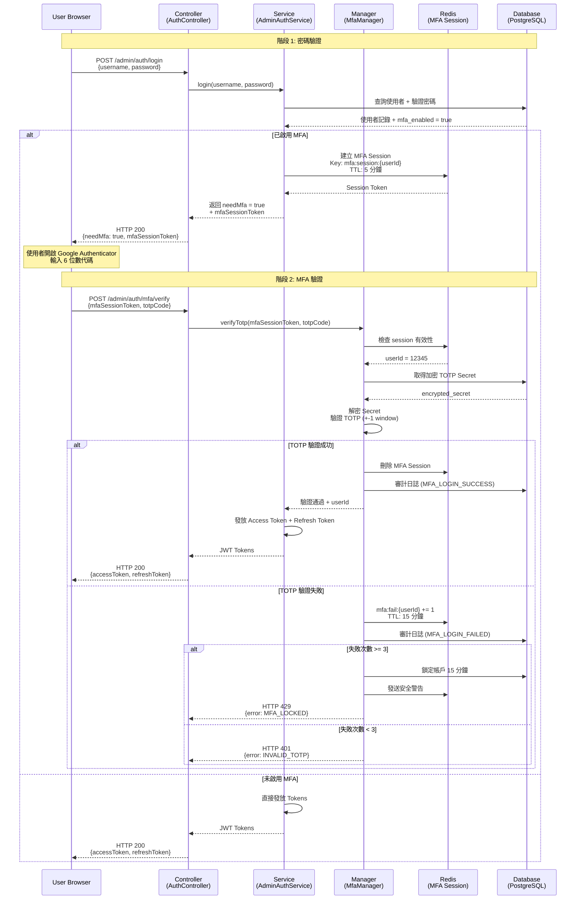
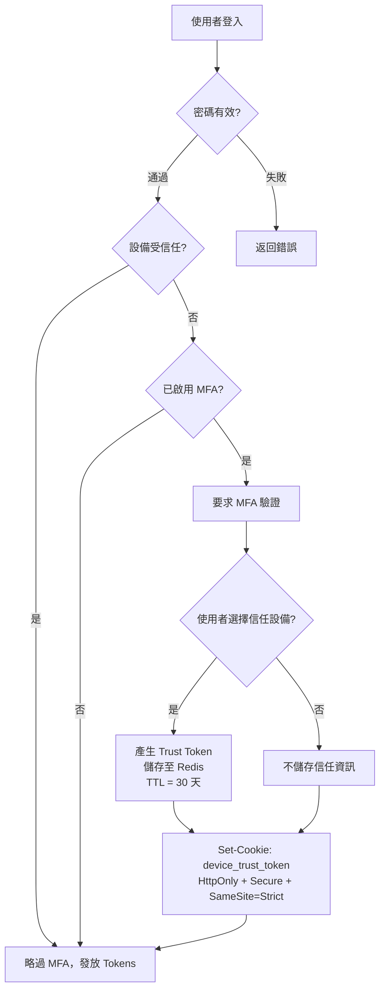
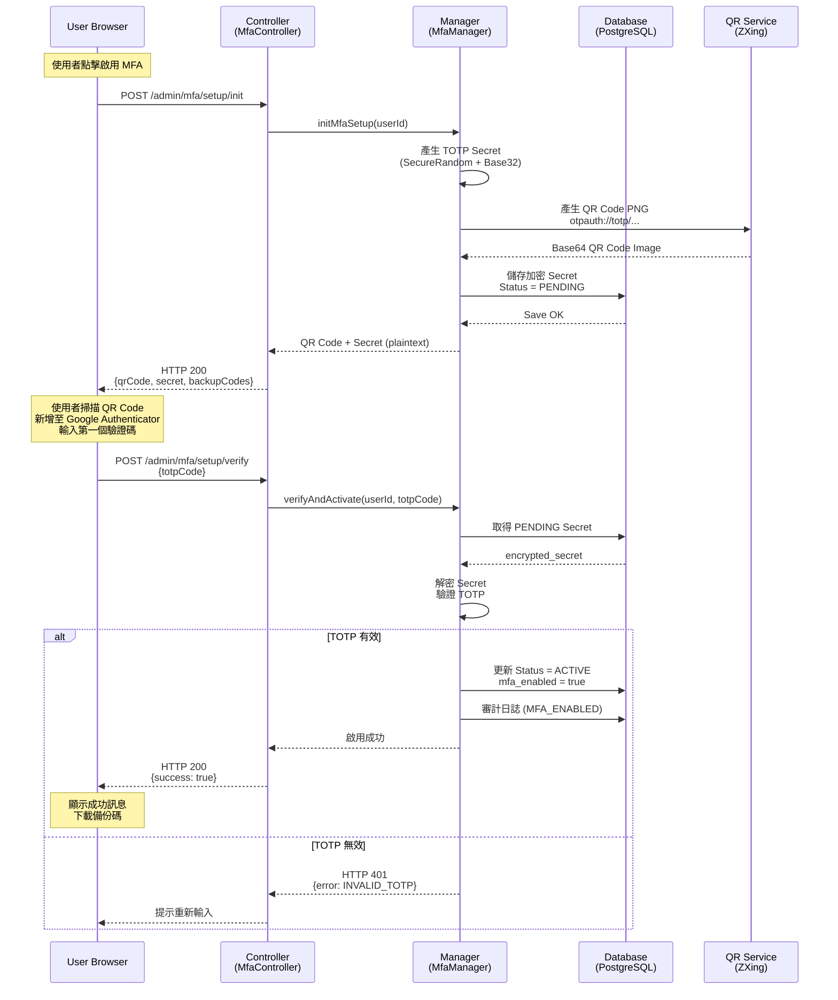

# MFA 恢復流程技術（MFA Recovery Technical）

> **目標讀者**: Backend Developers, Security Engineers
> **業務需求**: [MFA 恢復需求](../../requirements/06_Governance_Licensing/06_MFA_Recovery_Requirements.md)
> **XREF**: [05_MFA_Compliance.md](05_MFA_Compliance.md) — 備份碼加密、設備遺失恢復
> **最後更新**: 2026-03-31（合併自 09_MFA_Recovery_Implementation.md + 10_MFA_Login_Recovery_Technical.md）

---

## 1. 架構概覽（Architecture Overview）



---

## 2. 兩階段登入序列（Two-Phase Login Sequence）



---

## 3. API 端點規格（API Endpoint Specifications）

### 3.1 階段 1: 密碼登入（Phase 1: Password Login）

```http
POST /admin/auth/login
Content-Type: application/json

{
  "username": "admin@smartadmin.com",
  "password": "SecurePassword123!",
  "deviceFingerprint": "e3b0c44298fc1c149afbf4c8996fb92427ae41e4649b934ca495991b7852b855"
}
```

**回應（已啟用 MFA）**:

```json
{
  "code": 200,
  "msg": "Password verified. MFA required.",
  "data": {
    "needMfa": true,
    "mfaSessionToken": "mfa_sess_abc123xyz...",
    "expiresAt": "2026-02-05T10:05:00Z",
    "availableMethods": ["totp", "sms", "backup_code"]
  }
}
```

**回應（未啟用 MFA）**:

```json
{
  "code": 200,
  "msg": "Login successful.",
  "data": {
    "needMfa": false,
    "accessToken": "eyJhbGciOiJIUzI1NiIsInR5cCI6IkpXVCJ9...",
    "refreshToken": "rt_abc123xyz...",
    "user": {
      "userId": 12345,
      "username": "admin@smartadmin.com",
      "roles": ["SUPER_ADMIN"]
    }
  }
}
```

### 3.2 階段 2: MFA 驗證（Phase 2: MFA Verification）

```http
POST /admin/auth/mfa/verify
Content-Type: application/json

{
  "mfaSessionToken": "mfa_sess_abc123xyz...",
  "totpCode": "123456",
  "trustDevice": true
}
```

**回應（成功）**:

```json
{
  "code": 200,
  "msg": "MFA verification successful.",
  "data": {
    "accessToken": "eyJhbGciOiJIUzI1NiIsInR5cCI6IkpXVCJ9...",
    "refreshToken": "rt_abc123xyz...",
    "user": {
      "userId": 12345,
      "username": "admin@smartadmin.com",
      "roles": ["SUPER_ADMIN"]
    }
  }
}
```

**回應（失敗）**:

```json
{
  "code": 401,
  "msg": "Invalid TOTP code.",
  "data": {
    "remainingAttempts": 2,
    "lockoutDuration": null
  }
}
```

**回應（已鎖定）**:

```json
{
  "code": 429,
  "msg": "Too many failed MFA attempts. Account locked.",
  "data": {
    "remainingAttempts": 0,
    "lockoutDuration": 900,
    "unlockAt": "2026-02-05T10:15:00Z"
  }
}
```

### 3.3 錯誤代碼參考（Error Code Reference）

| 錯誤代碼 | HTTP 狀態 | 描述 | 客戶端操作 |
|---------|----------|------|----------|
| `INVALID_MFA_SESSION` | 401 | Session token 已過期或遺失 | 從階段 1 重新開始 |
| `INVALID_TOTP` | 401 | TOTP 代碼不正確 | 顯示剩餘嘗試次數；提示重新輸入 |
| `MFA_LOCKED` | 429 | 3 次失敗；帳戶已鎖定 | 顯示 15 分鐘倒數計時 |
| `MFA_NOT_ENABLED` | 400 | 呼叫 MFA 驗證但使用者未啟用 MFA | 引導至 MFA 設定 |
| `TIME_SYNC_ERROR` | 500 | 伺服器 NTP 不同步 | 觸發維運警報；向使用者顯示通用錯誤 |

---

## 4. 受信任設備實現（Trusted Device Implementation）

### 4.1 流程圖（Flow Diagram）



### 4.2 Redis 資料結構（Redis Data Structure）

```
Key:   trusted_device:{userId}:{deviceFingerprint}
Value: {
  "userId": 12345,
  "deviceFingerprint": "e3b0c442...",
  "trustedAt": "2026-02-05T10:00:00Z",
  "expiresAt": "2026-03-07T10:00:00Z",
  "ipAddress": "203.0.113.42",
  "userAgent": "Mozilla/5.0..."
}
TTL:   2592000 seconds (30 天)
```

### 4.3 設備指紋產生（客戶端）（Device Fingerprint Generation - Client-Side）

```javascript
import FingerprintJS from '@fingerprintjs/fingerprintjs';

async function getDeviceFingerprint() {
  const fp = await FingerprintJS.load();
  const result = await fp.get();
  // Returns unique device identifier (99.5% accuracy)
  return result.visitorId;
}

// Attach fingerprint to login request
const deviceFingerprint = await getDeviceFingerprint();
const response = await fetch('/admin/auth/login', {
  method: 'POST',
  headers: { 'Content-Type': 'application/json' },
  body: JSON.stringify({
    username: 'admin@smartadmin.com',
    password: 'SecurePassword123!',
    deviceFingerprint: deviceFingerprint
  })
});
```

---

## 5. MFA 註冊流程（MFA Registration Flow）

### 5.1 序列圖（Sequence Diagram）



### 5.2 QR Code 產生（Java）

```java
import com.google.zxing.BarcodeFormat;
import com.google.zxing.client.j2se.MatrixToImageWriter;
import com.google.zxing.common.BitMatrix;
import com.google.zxing.qrcode.QRCodeWriter;

import javax.imageio.ImageIO;
import java.awt.image.BufferedImage;
import java.io.ByteArrayOutputStream;
import java.util.Base64;

public class QrCodeGenerator {

    /**
     * Generate TOTP QR Code as Base64 PNG.
     *
     * @param username  User email (displayed in authenticator app)
     * @param secret    Base32-encoded TOTP secret
     * @param issuer    Issuer name (displayed in authenticator app)
     * @return Base64-encoded PNG image string
     */
    public static String generateQrCode(String username, String secret, String issuer) throws Exception {
        // Construct otpauth:// URI
        String otpauthUrl = String.format(
            "otpauth://totp/%s:%s?secret=%s&issuer=%s&algorithm=SHA1&digits=6&period=30",
            issuer, username, secret, issuer
        );

        // Generate QR Code via ZXing
        QRCodeWriter qrCodeWriter = new QRCodeWriter();
        BitMatrix bitMatrix = qrCodeWriter.encode(otpauthUrl, BarcodeFormat.QR_CODE, 300, 300);

        // Convert to BufferedImage
        BufferedImage qrImage = MatrixToImageWriter.toBufferedImage(bitMatrix);

        // Encode as Base64 PNG
        ByteArrayOutputStream baos = new ByteArrayOutputStream();
        ImageIO.write(qrImage, "PNG", baos);
        byte[] imageBytes = baos.toByteArray();

        return "data:image/png;base64," + Base64.getEncoder().encodeToString(imageBytes);
    }
}
```

### 5.3 MFA 設定 Service

```java
/**
 * Manager class for MFA setup persistence operations.
 * SmartAdmin Pattern: @Transactional only in Manager layer with @Component.
 */
@Component
@RequiredArgsConstructor
public class MfaSetupManager {

    private final MfaRepository mfaRepository;
    private final AuditLogService auditLogService;

    /**
     * Persist new MFA setup record (transactional).
     */
    @Transactional(rollbackFor = Throwable.class)
    public void savePendingMfaSetup(Long userId, String encryptedSecret, String encryptedBackupCodes) {
        MfaEntity mfa = MfaEntity.builder()
            .userId(userId)
            .totpSecret(encryptedSecret)
            .backupCodes(encryptedBackupCodes)
            .status(MfaStatus.PENDING)
            .build();

        mfaRepository.save(mfa);
        auditLogService.log(userId, "MFA_SETUP_INIT", "User initiated MFA setup");
    }

    /**
     * Activate MFA after TOTP verification (transactional).
     */
    @Transactional(rollbackFor = Throwable.class)
    public void activateMfa(Long userId, MfaEntity mfa) {
        mfa.setStatus(MfaStatus.ACTIVE);
        mfa.setActivatedAt(Instant.now());
        mfaRepository.save(mfa);
        auditLogService.log(userId, "MFA_ENABLED", "MFA successfully activated");
    }
}

/**
 * Service class for MFA setup orchestration.
 * Delegates transactional operations to MfaSetupManager.
 */
@Service
@RequiredArgsConstructor
public class MfaSetupService {

    private final MfaRepository mfaRepository;
    private final MfaSetupManager mfaSetupManager;
    private final TotpValidator totpValidator;
    private final AuditLogService auditLogService;

    /**
     * Initialize MFA setup: generate Secret + QR Code + backup codes.
     * Delegates persistence to MfaSetupManager.
     */
    public MfaSetupVO initMfaSetup(Long userId) {
        // Check if already enabled
        if (mfaRepository.isMfaEnabled(userId)) {
            throw new BusinessException("MFA is already enabled");
        }

        // Generate TOTP Secret (Base32)
        String totpSecret = TotpSecretGenerator.generateSecret();

        // Generate QR Code
        String username = getUserEmail(userId);
        String qrCodeBase64 = QrCodeGenerator.generateQrCode(
            username, totpSecret, "SmartAdmin iGaming"
        );

        // Generate 10 backup codes (8-digit)
        List<String> backupCodes = BackupCodeGenerator.generate(10);

        // Encrypt and persist (Status = PENDING) - delegate to Manager
        String encryptedSecret = encryptSecret(totpSecret);
        String encryptedBackupCodes = encryptBackupCodes(backupCodes);

        mfaSetupManager.savePendingMfaSetup(userId, encryptedSecret, encryptedBackupCodes);

        // Return plaintext secret (shown only once)
        return MfaSetupVO.builder()
            .qrCode(qrCodeBase64)
            .secret(totpSecret)
            .backupCodes(backupCodes)
            .build();
    }

    /**
     * Verify TOTP code and activate MFA.
     * Delegates transactional operation to MfaSetupManager.
     */
    public ResponseDTO<Void> verifyAndActivate(Long userId, String totpCode) {
        MfaEntity mfa = mfaRepository.findByUserIdAndStatus(userId, MfaStatus.PENDING)
            .orElseThrow(() -> new BusinessException("No pending MFA setup found"));

        String decryptedSecret = decryptSecret(mfa.getTotpSecret());

        boolean isValid = totpValidator.validate(totpCode, decryptedSecret);

        if (!isValid) {
            auditLogService.log(userId, "MFA_SETUP_VERIFY_FAILED", "TOTP verification failed");
            return ResponseDTO.error(ErrorCode.INVALID_TOTP);
        }

        // Delegate transactional operation to Manager
        mfaSetupManager.activateMfa(userId, mfa);

        return ResponseDTO.ok();
    }
}
```

---

## 6. 資料庫結構（Database Schema）

```sql
CREATE TABLE t_admin_user_mfa (
    user_id             BIGINT PRIMARY KEY REFERENCES t_admin_user(user_id),
    totp_secret         VARCHAR(255) NOT NULL,          -- AES-256-GCM encrypted
    backup_codes        TEXT,                           -- JSON array (AES encrypted)
    status              VARCHAR(20) NOT NULL,           -- PENDING / ACTIVE / DISABLED
    activated_at        TIMESTAMP,                      -- Activation timestamp
    created_at          TIMESTAMP DEFAULT NOW(),
    updated_at          TIMESTAMP DEFAULT NOW()
);

-- Indexes
CREATE INDEX idx_mfa_status ON t_admin_user_mfa(status);
CREATE INDEX idx_mfa_activated_at ON t_admin_user_mfa(activated_at);
```

---

## 7. 前端元件（Vue 3）

### 7.1 MFA 驗證表單（MFA Verification Form）

```vue
<template>
  <div class="mfa-verify-form">
    <a-input
      v-model:value="totpCode"
      placeholder="Enter 6-digit code"
      maxlength="6"
      :status="errorStatus"
    />

    <a-alert
      v-if="errorMessage"
      :type="alertType"
      :message="errorMessage"
      show-icon
      closable
    />

    <a-button type="primary" @click="verifyMfa" :loading="loading">
      Verify
    </a-button>
  </div>
</template>

<script setup>
import { ref } from 'vue';
import { message } from 'ant-design-vue';

const totpCode = ref('');
const errorMessage = ref('');
const errorStatus = ref('');
const alertType = ref('error');
const loading = ref(false);

async function verifyMfa() {
  loading.value = true;
  errorMessage.value = '';

  try {
    const response = await fetch('/admin/auth/mfa/verify', {
      method: 'POST',
      headers: { 'Content-Type': 'application/json' },
      body: JSON.stringify({
        mfaSessionToken: sessionStorage.getItem('mfaSessionToken'),
        totpCode: totpCode.value
      })
    });

    const result = await response.json();

    if (response.ok) {
      message.success('Login successful!');
      localStorage.setItem('accessToken', result.data.accessToken);
      window.location.href = '/admin/dashboard';
    } else {
      handleMfaError(result);
    }
  } catch (error) {
    message.error('Network error. Please try again.');
  } finally {
    loading.value = false;
  }
}

function handleMfaError(result) {
  errorStatus.value = 'error';

  switch (result.code) {
    case 401:
      if (result.msg.includes('INVALID_TOTP')) {
        errorMessage.value = `Incorrect code. Remaining attempts: ${result.data.remainingAttempts}`;
        alertType.value = 'warning';
      } else if (result.msg.includes('INVALID_MFA_SESSION')) {
        errorMessage.value = 'Session expired. Please log in again.';
        alertType.value = 'error';
        setTimeout(() => window.location.href = '/admin/login', 2000);
      }
      break;

    case 429:
      errorMessage.value = `Account locked. Please try again in ${result.data.lockoutDuration / 60} minutes.`;
      alertType.value = 'error';
      break;

    default:
      errorMessage.value = result.msg || 'Unknown error';
      alertType.value = 'error';
  }
}
</script>
```

### 7.2 MFA 設定精靈（MFA Setup Wizard）

```vue
<template>
  <div class="mfa-setup">
    <a-steps :current="currentStep">
      <a-step title="Generate Secret" />
      <a-step title="Scan QR Code" />
      <a-step title="Verify & Activate" />
    </a-steps>

    <!-- Step 2: Scan QR Code -->
    <div v-if="currentStep === 1" class="qr-code-section">
      <h3>Scan this QR Code with Google Authenticator</h3>
      

      <a-alert type="info" show-icon>
        <template #message>
          Cannot scan? Manually enter this secret key:<br/>
          <code>{{ totpSecret }}</code>
        </template>
      </a-alert>

      <h4>Backup Codes (save securely)</h4>
      <a-textarea :value="backupCodesText" :rows="5" readonly />
      <a-button @click="downloadBackupCodes">Download Backup Codes</a-button>
    </div>

    <!-- Step 3: Verify & Activate -->
    <div v-if="currentStep === 2" class="verify-section">
      <h3>Enter the 6-digit code from Google Authenticator</h3>
      <a-input
        v-model:value="totpCode"
        placeholder="123456"
        maxlength="6"
        size="large"
      />
      <a-button type="primary" @click="verifyAndActivate">
        Activate MFA
      </a-button>
    </div>
  </div>
</template>

<script setup>
import { ref } from 'vue';
import { message } from 'ant-design-vue';

const currentStep = ref(1);
const qrCodeImage = ref('');
const totpSecret = ref('');
const backupCodes = ref([]);
const totpCode = ref('');

async function initMfaSetup() {
  const response = await fetch('/admin/mfa/setup/init', { method: 'POST' });
  const result = await response.json();

  if (response.ok) {
    qrCodeImage.value = result.data.qrCode;
    totpSecret.value = result.data.secret;
    backupCodes.value = result.data.backupCodes;
    currentStep.value = 1;
  }
}

function downloadBackupCodes() {
  const text = backupCodes.value.join('\n');
  const blob = new Blob([text], { type: 'text/plain' });
  const url = URL.createObjectURL(blob);

  const a = document.createElement('a');
  a.href = url;
  a.download = 'smartadmin-mfa-backup-codes.txt';
  a.click();

  message.success('Backup codes downloaded');
}

async function verifyAndActivate() {
  const response = await fetch('/admin/mfa/setup/verify', {
    method: 'POST',
    headers: { 'Content-Type': 'application/json' },
    body: JSON.stringify({ totpCode: totpCode.value })
  });

  const result = await response.json();

  if (response.ok) {
    message.success('MFA has been successfully enabled!');
    currentStep.value = 3;
  } else {
    message.error('Incorrect code. Please try again.');
  }
}

initMfaSetup();
</script>
```

---

## 8. 安全性考量（Security Considerations）

| 關注點 | 實現方式 |
|--------|---------|
| TOTP secret 儲存 | 資料庫中使用 AES-256-GCM 加密 |
| TOTP secret 傳輸 | 僅在設定時顯示一次明文；強制使用 HTTPS |
| 備份碼儲存 | AES-256-GCM 加密；以雜湊方式查找 |
| MFA session 劫持 | 5 分鐘 TTL；單次使用；僅存於伺服器端 |
| TOTP 暴力破解 | 3 次嘗試鎖定，15 分鐘冷卻期 |
| 設備信任 token 竊取 | HttpOnly + Secure + SameSite=Strict cookie |
| 時間基準 TOTP window | +-1 期間容錯（30 秒視窗） |

---

## 9. 相關技術文件（Related Technical Documents）

| 文件 | 關聯性 |
|------|--------|
| MFA Architecture (06-06-01) | 高階設計、方法選擇理由 |
| TOTP and WebAuthn (06-06-02) | TOTP 演算法細節、HMAC-SHA1 實現 |
| Compliance and Audit (06-06-04) | 審計日誌結構、基於角色的 MFA 政策 |
| RBAC Permissions (06-02) | 驅動 MFA 強制執行的角色定義 |

---

**Navigation**: [Platform Core Architecture](../06_Platform_Core/) | [iGaming Home](../../README.md)

---

## 附錄 C：MFA Session 儲存與信任裝置 Token 詳細實作

> 本節包含 Redis MFA Session 儲存、信任裝置 Token 生成的詳細實作代碼。

## 2. MFA Session 儲存（MFA Session Storage）（Redis）

### 2.1 Session 資料結構（Session Data Structure）

**Redis Key 格式**:
```
mfa:session:{sessionToken}
```

**值 (JSON)**:
```json
{
  "userId": 12345,
  "username": "john.doe@example.com",
  "createdAt": 1612345678000,
  "ipAddress": "192.168.1.100",
  "userAgent": "Mozilla/5.0 (Windows NT 10.0; Win64; x64) AppleWebKit/537.36"
}
```

**TTL**: 300 秒 (5 分鐘)

### 2.2 MFASessionService 實現（MFASessionService Implementation）

```java
@Service
@RequiredArgsConstructor
public class MFASessionService {

    private final StringRedisTemplate redisTemplate;
    private static final int SESSION_TTL_SECONDS = 300; // 5 minutes
    private static final String SESSION_KEY_PREFIX = "mfa:session:";

    /**
     * Create MFA session after successful password verification
     *
     * @param userId User identifier
     * @param ipAddress Client IP address
     * @param userAgent Client User-Agent
     * @return MFA session token (UUID)
     */
    public String createMFASession(Long userId, String ipAddress, String userAgent) {
        String sessionToken = UUID.randomUUID().toString();

        MFASessionData sessionData = MFASessionData.builder()
            .userId(userId)
            .createdAt(System.currentTimeMillis())
            .ipAddress(ipAddress)
            .userAgent(userAgent)
            .build();

        String key = SESSION_KEY_PREFIX + sessionToken;
        String value = JsonUtil.toJson(sessionData);

        redisTemplate.opsForValue().set(key, value, SESSION_TTL_SECONDS, TimeUnit.SECONDS);

        log.info("[MFASession] Created session {} for user {}", sessionToken, userId);

        return sessionToken;
    }

    /**
     * Verify MFA session token is valid
     *
     * @param sessionToken MFA session token
     * @return MFASessionData if valid
     * @throws MFASessionExpiredException if session expired or invalid
     */
    public MFASessionData verifySession(String sessionToken) {
        String key = SESSION_KEY_PREFIX + sessionToken;
        String value = redisTemplate.opsForValue().get(key);

        if (value == null) {
            throw new MFASessionExpiredException("MFA session expired or invalid");
        }

        return JsonUtil.fromJson(value, MFASessionData.class);
    }

    /**
     * Consume MFA session (delete after successful verification)
     *
     * @param sessionToken MFA session token
     */
    public void consumeSession(String sessionToken) {
        String key = SESSION_KEY_PREFIX + sessionToken;
        Boolean deleted = redisTemplate.delete(key);

        if (Boolean.TRUE.equals(deleted)) {
            log.info("[MFASession] Consumed session {}", sessionToken);
        }
    }

    /**
     * Extend session TTL (e.g., for slow networks)
     *
     * @param sessionToken MFA session token
     * @param additionalSeconds Additional TTL in seconds
     */
    public void extendSession(String sessionToken, int additionalSeconds) {
        String key = SESSION_KEY_PREFIX + sessionToken;
        Long ttl = redisTemplate.getExpire(key, TimeUnit.SECONDS);

        if (ttl != null && ttl > 0) {
            redisTemplate.expire(key, ttl + additionalSeconds, TimeUnit.SECONDS);
        }
    }
}
```

### 2.3 失敗嘗試追蹤（Failed Attempt Tracking）

**Redis Key 格式**:
```
mfa:failed:{userId}
```

**值**: Integer (失敗嘗試次數)
**TTL**: 15 分鐘 (自動解鎖)

```java
@Service
@RequiredArgsConstructor
public class MFALockoutService {

    private final StringRedisTemplate redisTemplate;
    private static final String FAILED_KEY_PREFIX = "mfa:failed:";
    private static final int MAX_ATTEMPTS = 3;
    private static final int LOCKOUT_DURATION_SECONDS = 900; // 15 minutes

    public void recordFailedAttempt(Long userId) {
        String key = FAILED_KEY_PREFIX + userId;

        Long failedCount = redisTemplate.opsForValue().increment(key);

        if (failedCount == 1) {
            // Set TTL on first failure
            redisTemplate.expire(key, LOCKOUT_DURATION_SECONDS, TimeUnit.SECONDS);
        }

        if (failedCount >= MAX_ATTEMPTS) {
            lockAccount(userId);
        }
    }

    public int getRemainingAttempts(Long userId) {
        String key = FAILED_KEY_PREFIX + userId;
        String value = redisTemplate.opsForValue().get(key);

        int failedCount = value != null ? Integer.parseInt(value) : 0;
        return Math.max(0, MAX_ATTEMPTS - failedCount);
    }

    public void resetFailedAttempts(Long userId) {
        String key = FAILED_KEY_PREFIX + userId;
        redisTemplate.delete(key);
    }

    private void lockAccount(Long userId) {
        // Update database to lock account for 15 minutes
        // (This ensures lock persists even if Redis is flushed)
        userDao.updateLockedUntil(userId, LocalDateTime.now().plusMinutes(15));

        log.warn("[MFALockout] Account {} locked for 15 minutes", userId);
    }
}
```

---

## 3. 信任裝置 Token（Trusted Device Token）

### 3.1 Token 產生（Token Generation）（SHA256）

**Token 組成**:
```
TrustedDeviceToken = SHA256(userId + deviceFingerprint + ipAddress + userAgent + secret)
```

**Cookie 名稱**: `trusted_device`
**屬性**:
- `HttpOnly`: true (防止 JavaScript 存取)
- `Secure`: true (僅 HTTPS)
- `SameSite`: Strict (CSRF 防護)
- `Max-Age`: 2592000 秒 (30 天)

### 3.2 TrustedDeviceService 實現（TrustedDeviceService Implementation）

```java
@Service
@RequiredArgsConstructor
public class TrustedDeviceService {

    private final VaultKeyManager vaultKeyManager;

    private static final String COOKIE_NAME = "trusted_device";
    private static final int COOKIE_MAX_AGE_SECONDS = 2592000; // 30 days

    /**
     * Generate trusted device token
     *
     * @param userId User identifier
     * @param deviceFingerprint Browser fingerprint (from FingerprintJS)
     * @param ipAddress Client IP address
     * @param userAgent Client User-Agent
     * @return Base64-encoded SHA256 token
     */
    public String generateToken(Long userId, String deviceFingerprint, String ipAddress, String userAgent) {
        try {
            // Step 1: Retrieve secret from Vault
            String secret = vaultKeyManager.getTrustedDeviceSecret();

            // Step 2: Compose data string
            String data = String.format("%d|%s|%s|%s|%s",
                userId,
                deviceFingerprint,
                ipAddress,
                userAgent,
                secret
            );

            // Step 3: Compute SHA256 hash
            MessageDigest digest = MessageDigest.getInstance("SHA-256");
            byte[] hash = digest.digest(data.getBytes(StandardCharsets.UTF_8));

            // Step 4: Base64 encode
            String token = Base64.getEncoder().encodeToString(hash);

            // Step 5: Store metadata in database
            saveTrustedDevice(userId, deviceFingerprint, ipAddress, token);

            return token;

        } catch (NoSuchAlgorithmException e) {
            throw new TrustedDeviceException("Failed to generate trusted device token", e);
        }
    }

    /**
     * Verify trusted device token
     *
     * @param token Token from cookie
     * @param userId User identifier
     * @param deviceFingerprint Browser fingerprint
     * @param ipAddress Client IP address
     * @param userAgent Client User-Agent
     * @return true if token is valid
     */
    public boolean verifyToken(String token, Long userId, String deviceFingerprint, String ipAddress, String userAgent) {
        // Step 1: Re-generate expected token
        String expectedToken = generateToken(userId, deviceFingerprint, ipAddress, userAgent);

        // Step 2: Constant-time comparison
        boolean valid = MessageDigest.isEqual(
            token.getBytes(StandardCharsets.UTF_8),
            expectedToken.getBytes(StandardCharsets.UTF_8)
        );

        // Step 3: Additional validation: Check database record exists and not expired
        if (valid) {
            TrustedDeviceEntity device = trustedDeviceDao.findByToken(token);
            if (device == null || device.isExpired()) {
                return false;
            }
        }

        return valid;
    }

    /**
     * Create HTTP cookie for trusted device
     *
     * @param token Trusted device token
     * @param response HttpServletResponse
     */
    public void setCookie(String token, HttpServletResponse response) {
        Cookie cookie = new Cookie(COOKIE_NAME, token);
        cookie.setHttpOnly(true);
        cookie.setSecure(true); // HTTPS only
        cookie.setPath("/");
        cookie.setMaxAge(COOKIE_MAX_AGE_SECONDS);
        cookie.setAttribute("SameSite", "Strict");

        response.addCookie(cookie);
    }

    /**
     * Remove trusted device cookie (logout)
     *
     * @param response HttpServletResponse
     */
    public void clearCookie(HttpServletResponse response) {
        Cookie cookie = new Cookie(COOKIE_NAME, "");
        cookie.setHttpOnly(true);
        cookie.setSecure(true);
        cookie.setPath("/");
        cookie.setMaxAge(0); // Immediate expiry

        response.addCookie(cookie);
    }

    private void saveTrustedDevice(Long userId, String deviceFingerprint, String ipAddress, String token) {
        TrustedDeviceEntity device = TrustedDeviceEntity.builder()
            .userId(userId)
            .deviceFingerprint(deviceFingerprint)
            .ipAddress(ipAddress)
            .token(token)
            .createdAt(LocalDateTime.now())
            .expiresAt(LocalDateTime.now().plusDays(30))
            .build();

        trustedDeviceDao.insert(device);
    }
}
```

### 3.3 資料庫架構（Database Schema）

```sql
CREATE TABLE t_trusted_device (
    id BIGSERIAL PRIMARY KEY,
    user_id BIGINT NOT NULL,
    device_fingerprint VARCHAR(255) NOT NULL,
    ip_address VARCHAR(50) NOT NULL,
    user_agent TEXT,
    token VARCHAR(500) NOT NULL UNIQUE,
    created_at TIMESTAMP NOT NULL DEFAULT NOW(),
    expires_at TIMESTAMP NOT NULL,
    last_used_at TIMESTAMP,
    deleted BOOLEAN NOT NULL DEFAULT FALSE,
    CONSTRAINT fk_user FOREIGN KEY (user_id) REFERENCES t_user(id)
);

-- Index for lookup by user
CREATE INDEX idx_trusted_device_user_id ON t_trusted_device(user_id) WHERE deleted = FALSE;

-- Index for token verification
CREATE INDEX idx_trusted_device_token ON t_trusted_device(token) WHERE deleted = FALSE;
```

---

## 4. TOTP QR Code 產生（TOTP QR Code Generation）

### 4.1 QR Code 編碼（QR Code Encoding）

**QR Code 內容** (otpauth URI 格式):
```
otpauth://totp/SmartAdmin:john.doe@example.com?secret=JBSWY3DPEHPK3PXP&issuer=SmartAdmin&algorithm=SHA1&digits=6&period=30
```

**URI 組成**:
- `totp`: TOTP 協議
- `SmartAdmin`: 發行者名稱
- `john.doe@example.com`: 帳號名稱 (電子郵件或使用者名稱)
- `secret`: Base32 編碼的 TOTP 密鑰
- `algorithm`: 雜湊演算法 (SHA1, SHA256, 或 SHA512)
- `digits`: 驗證碼長度 (6 或 8)
- `period`: 時間步長（秒） (30)

### 4.2 QRCodeService 實現（QRCodeService Implementation）

```java
@Service
public class MFAQRCodeService {

    /**
     * Generate QR code image for TOTP setup
     *
     * @param secret Base32-encoded TOTP secret
     * @param issuer Platform name
     * @param accountName User email or username
     * @return Base64-encoded PNG image
     */
    public String generateQRCodeImage(String secret, String issuer, String accountName) {
        try {
            // Step 1: Generate otpauth URI
            String uri = generateOtpauthURI(secret, issuer, accountName);

            // Step 2: Generate QR code using ZXing library
            QRCodeWriter qrCodeWriter = new QRCodeWriter();
            BitMatrix bitMatrix = qrCodeWriter.encode(
                uri,
                BarcodeFormat.QR_CODE,
                300, // width
                300  // height
            );

            // Step 3: Convert BitMatrix to BufferedImage
            BufferedImage image = new BufferedImage(300, 300, BufferedImage.TYPE_INT_RGB);
            for (int x = 0; x < 300; x++) {
                for (int y = 0; y < 300; y++) {
                    image.setRGB(x, y, bitMatrix.get(x, y) ? 0x000000 : 0xFFFFFF);
                }
            }

            // Step 4: Convert BufferedImage to Base64 PNG
            ByteArrayOutputStream baos = new ByteArrayOutputStream();
            ImageIO.write(image, "PNG", baos);
            byte[] imageBytes = baos.toByteArray();

            return Base64.getEncoder().encodeToString(imageBytes);

        } catch (WriterException | IOException e) {
            throw new QRCodeGenerationException("Failed to generate QR code", e);
        }
    }

    /**
     * Generate otpauth URI for TOTP
     *
     * @param secret Base32-encoded TOTP secret
     * @param issuer Platform name
     * @param accountName User email or username
     * @return otpauth URI
     */
    public String generateOtpauthURI(String secret, String issuer, String accountName) {
        try {
            String encodedIssuer = URLEncoder.encode(issuer, StandardCharsets.UTF_8);
            String encodedAccountName = URLEncoder.encode(accountName, StandardCharsets.UTF_8);

            return String.format(
                "otpauth://totp/%s:%s?secret=%s&issuer=%s&algorithm=SHA1&digits=6&period=30",
                encodedIssuer,
                encodedAccountName,
                secret,
                encodedIssuer
            );
        } catch (Exception e) {
            throw new QRCodeGenerationException("Failed to generate otpauth URI", e);
        }
    }
}
```

### 4.3 MFA 設定流程（MFA Setup Flow）

```java
/**
 * Manager class for MFA setup persistence operations.
 * SmartAdmin Pattern: @Transactional only in Manager layer with @Component.
 */
@Component
@RequiredArgsConstructor
public class MFASetupManager {

    private final UserMFADao userMFADao;
    private final MFABackupCodeDao backupCodeDao;

    /**
     * Persist MFA activation record and generate backup codes (transactional).
     */
    @Transactional(rollbackFor = Throwable.class)
    public List<String> activateMFA(Long userId, String encryptedSecret) {
        // Insert MFA record
        UserMFAEntity mfa = UserMFAEntity.builder()
            .userId(userId)
            .encryptedSecret(encryptedSecret)
            .enabled(true)
            .verifiedAt(LocalDateTime.now())
            .build();
        userMFADao.insert(mfa);

        // Generate and store backup codes
        return generateAndStoreBackupCodes(userId);
    }

    private List<String> generateAndStoreBackupCodes(Long userId) {
        List<String> plainCodes = new ArrayList<>();
        List<MFABackupCodeEntity> entities = new ArrayList<>();
        SecureRandom random = new SecureRandom();

        for (int i = 0; i < 10; i++) {
            String code = String.format("%08d", random.nextInt(100000000));
            plainCodes.add(code);
            entities.add(MFABackupCodeEntity.builder()
                .userId(userId)
                .codeHash(hashCode(code))
                .used(false)
                .build());
        }
        backupCodeDao.insertBatch(entities);
        return plainCodes;
    }

    private String hashCode(String code) {
        return DigestUtils.sha256Hex(code);
    }
}

/**
 * Service class for MFA setup orchestration.
 * Delegates transactional operations to MFASetupManager.
 */
@Service
@RequiredArgsConstructor
public class MFASetupService {

    private final MFASetupManager setupManager;
    private final MFASecretEncryptor secretEncryptor;
    private final StringRedisTemplate redisTemplate;
    private final TOTPGenerator totpGenerator;

    /**
     * Verify TOTP code and activate MFA.
     */
    public MFAActivationResponse verifyAndActivate(Long userId, String code) {
        // Retrieve temporary secret from Redis
        String tempKey = "mfa:setup:temp:" + userId;
        String secret = redisTemplate.opsForValue().get(tempKey);

        if (secret == null) {
            throw new BusinessException("MFA setup expired, please restart");
        }

        // Verify TOTP code
        boolean valid = totpGenerator.verifyTOTP(secret, code, 1);
        if (!valid) {
            throw new BusinessException("Invalid TOTP code, please try again");
        }

        // Encrypt secret
        String encryptedSecret = secretEncryptor.encryptSecret(secret, userId.toString());

        // Delegate transactional operation to Manager
        List<String> backupCodes = setupManager.activateMFA(userId, encryptedSecret);

        // Delete temporary secret
        redisTemplate.delete(tempKey);

        return MFAActivationResponse.builder()
            .success(true)
            .backupCodes(backupCodes)
            .build();
    }
}

/**
 * Controller for MFA setup endpoints.
 * Delegates business logic to MFASetupService.
 */
@RestController
@RequestMapping("/api/mfa")
@RequiredArgsConstructor
public class MFASetupController {

    private final MFASecretGenerator secretGenerator;
    private final MFAQRCodeService qrCodeService;
    private final MFASetupService setupService;

    /**
     * Step 1: Initiate MFA setup (generate secret and QR code)
     *
     * GET /api/mfa/setup/init
     *
     * @return MFASetupResponse (QR code image, secret backup)
     */
    @GetMapping("/setup/init")
    public ResponseDTO<MFASetupResponse> initSetup(@LoginUser UserDTO user) {
        // Step 1: Generate secret
        String secret = secretGenerator.generateSecret();

        // Step 2: Generate QR code
        String qrCodeImage = qrCodeService.generateQRCodeImage(
            secret,
            "SmartAdmin iGaming",
            user.getUsername()
        );

        // Step 3: Temporarily store secret in Redis (10-minute TTL)
        String tempKey = "mfa:setup:temp:" + user.getUserId();
        redisTemplate.opsForValue().set(tempKey, secret, 600, TimeUnit.SECONDS);

        // Step 4: Return QR code and secret (for manual entry)
        return ResponseDTO.ok(MFASetupResponse.builder()
            .qrCodeImage(qrCodeImage)
            .secretBackup(secret)
            .build());
    }

    /**
     * Step 2: Verify TOTP code and activate MFA.
     * Delegates to MFASetupService (SmartAdmin Pattern: no @Transactional in Controller).
     *
     * POST /api/mfa/setup/verify
     *
     * @param request VerifyTOTPRequest (code)
     * @return Success response with backup codes
     */
    @PostMapping("/setup/verify")
    public ResponseDTO<MFAActivationResponse> verifySetup(
            @LoginUser UserDTO user,
            @RequestBody VerifyTOTPRequest request) {

        // Delegate to Service layer
        MFAActivationResponse response = setupService.verifyAndActivate(
            user.getUserId(),
            request.getCode()
        );

        log.info("[MFASetup] User {} successfully enabled MFA", user.getUserId());

        return ResponseDTO.ok(response);
    }

    private List<String> generateBackupCodes(Long userId) {
        // Generate 10 backup codes (8-digit numeric)
        List<String> codes = new ArrayList<>();
        SecureRandom random = new SecureRandom();

        for (int i = 0; i < 10; i++) {
            int code = 10000000 + random.nextInt(90000000); // 8-digit
            codes.add(String.valueOf(code));
        }

        // Store encrypted backup codes in database
        // (Implementation in next section)

        return codes;
    }
}
```

---

## 5. 備用碼實現（Backup Code Implementation）

### 5.1 備用碼儲存（Backup Code Storage）

**資料庫架構**:

```sql
CREATE TABLE t_mfa_backup_code (
    id BIGSERIAL PRIMARY KEY,
    user_id BIGINT NOT NULL,
    code_hash VARCHAR(255) NOT NULL,  -- SHA256 hash of code
    used BOOLEAN NOT NULL DEFAULT FALSE,
    used_at TIMESTAMP,
    created_at TIMESTAMP NOT NULL DEFAULT NOW(),
    CONSTRAINT fk_user FOREIGN KEY (user_id) REFERENCES t_user(id)
);

CREATE INDEX idx_backup_code_user_id ON t_mfa_backup_code(user_id);
```

### 5.2 BackupCodeService 實現（BackupCodeService Implementation）

```java
/**
 * Manager class for backup code persistence operations.
 * SmartAdmin Pattern: @Transactional only in Manager layer with @Component.
 */
@Component
@RequiredArgsConstructor
public class MFABackupCodeManager {

    private final MFABackupCodeDao backupCodeDao;

    /**
     * Verify and consume backup code (transactional).
     */
    @Transactional(rollbackFor = Throwable.class)
    public boolean verifyAndConsumeBackupCode(Long userId, String codeHash) {
        MFABackupCodeEntity backupCode = backupCodeDao.findByUserIdAndHash(userId, codeHash);

        if (backupCode == null || backupCode.isUsed()) {
            return false;
        }

        // Mark as used (single-use)
        backupCode.setUsed(true);
        backupCode.setUsedAt(LocalDateTime.now());
        backupCodeDao.updateById(backupCode);

        return true;
    }
}

/**
 * Service class for backup code operations.
 * Delegates transactional operations to MFABackupCodeManager.
 */
@Service
@RequiredArgsConstructor
public class MFABackupCodeService {

    private final MFABackupCodeDao backupCodeDao;
    private final MFABackupCodeManager backupCodeManager;

    /**
     * Generate and store backup codes
     *
     * @param userId User identifier
     * @return List of plain backup codes (show to user ONCE)
     */
    public List<String> generateBackupCodes(Long userId) {
        List<String> plainCodes = new ArrayList<>();
        List<MFABackupCodeEntity> entities = new ArrayList<>();

        SecureRandom random = new SecureRandom();

        for (int i = 0; i < 10; i++) {
            // Generate 8-digit code
            String code = String.format("%08d", random.nextInt(100000000));
            plainCodes.add(code);

            // Hash code with SHA256
            String codeHash = hashCode(code);

            entities.add(MFABackupCodeEntity.builder()
                .userId(userId)
                .codeHash(codeHash)
                .used(false)
                .createdAt(LocalDateTime.now())
                .build());
        }

        // Batch insert
        backupCodeDao.insertBatch(entities);

        return plainCodes;
    }

    /**
     * Verify backup code (single-use).
     * Delegates transactional operation to MFABackupCodeManager.
     *
     * @param userId User identifier
     * @param code Plain backup code from user
     * @return true if code is valid and unused
     */
    public boolean verifyBackupCode(Long userId, String code) {
        String codeHash = hashCode(code);

        // Delegate transactional operation to Manager
        boolean verified = backupCodeManager.verifyAndConsumeBackupCode(userId, codeHash);

        if (verified) {
            log.info("[BackupCode] User {} used backup code", userId);
        }

        return verified;
    }

    /**
     * Count remaining backup codes
     *
     * @param userId User identifier
     * @return Number of unused codes
     */
    public int getRemainingCount(Long userId) {
        return backupCodeDao.countUnusedCodes(userId);
    }

    /**
     * Hash backup code with SHA256
     *
     * @param code Plain backup code
     * @return SHA256 hash (hex string)
     */
    private String hashCode(String code) {
        try {
            MessageDigest digest = MessageDigest.getInstance("SHA-256");
            byte[] hash = digest.digest(code.getBytes(StandardCharsets.UTF_8));
            return Hex.encodeHexString(hash);
        } catch (NoSuchAlgorithmException e) {
            throw new HashingException("Failed to hash backup code", e);
        }
    }
}
```

---

## 6. 裝置指紋（Device Fingerprinting）

### 6.1 FingerprintJS 整合（FingerprintJS Integration）

**前端實現** (使用 FingerprintJS):

```javascript
// Install: npm install @fingerprintjs/fingerprintjs

import FingerprintJS from '@fingerprintjs/fingerprintjs';

async function getDeviceFingerprint() {
  const fp = await FingerprintJS.load();
  const result = await fp.get();

  return result.visitorId; // Unique device identifier
}

// Usage during login
async function handleLogin(username, password, trustDevice) {
  const deviceFingerprint = await getDeviceFingerprint();

  const response = await axios.post('/api/auth/login', {
    username,
    password,
    deviceFingerprint,
    trustDevice
  });

  return response.data;
}
```

### 6.2 裝置指紋驗證（Device Fingerprint Validation）

```java
@Service
public class DeviceFingerprintValidator {

    /**
     * Validate device fingerprint consistency
     *
     * @param storedFingerprint Fingerprint from trusted device record
     * @param currentFingerprint Fingerprint from current request
     * @return true if fingerprints match
     */
    public boolean validate(String storedFingerprint, String currentFingerprint) {
        // Exact match required
        return MessageDigest.isEqual(
            storedFingerprint.getBytes(StandardCharsets.UTF_8),
            currentFingerprint.getBytes(StandardCharsets.UTF_8)
        );
    }
}
```

---

## 7. 配置參考（Configuration Reference）

### 7.1 Redis 配置（Redis Configuration）

**application.yml**:

```yaml
spring:
  redis:
    host: localhost
    port: 6379
    password: ${REDIS_PASSWORD}
    timeout: 2000ms
    lettuce:
      pool:
        max-active: 16
        max-idle: 8
        min-idle: 2
        max-wait: 3000ms

mfa:
  session:
    ttl-seconds: 300  # 5 minutes
  lockout:
    max-attempts: 3
    duration-seconds: 900  # 15 minutes
  trusted-device:
    max-age-days: 30
```

### 7.2 Cookie 安全配置（Cookie Security Configuration）

**Spring Security Cookie Configuration**:

```java
@Configuration
public class CookieSecurityConfig {

    @Bean
    public CookieSerializer cookieSerializer() {
        DefaultCookieSerializer serializer = new DefaultCookieSerializer();
        serializer.setCookieName("trusted_device");
        serializer.setUseHttpOnlyCookie(true);
        serializer.setUseSecureCookie(true); // HTTPS only
        serializer.setSameSite("Strict");    // CSRF protection
        serializer.setCookieMaxAge(2592000); // 30 days
        return serializer;
    }
}
```

---

## 8. 相關文件（Related Documents）

### 業務需求（Business Requirements）
- [MFA_Recovery_Requirements.md](../../requirements/06_Governance_Licensing/06_MFA_Recovery_Requirements.md) - MFA session 規則、信任裝置政策、鎖定規則

### 技術實現（Technical Implementation）
- [MFA_Technical_Evaluation.md](05_MFA_Technical_Evaluation.md) - TOTP 演算法、密鑰加密、安全分析
- [MFA_Compliance_Technical.md](07_MFA_Compliance_Technical.md) - 審計日誌、合規驗證

### 安全標準（Security Standards）
- **RFC 6238**: TOTP 規範
- **OWASP Session Management Cheat Sheet**
- **SameSite Cookie Specification**

---

**文件版本**: 1.0.0
**最後更新**: 2026-02-09
**維護者**: Security Team, Backend Team
