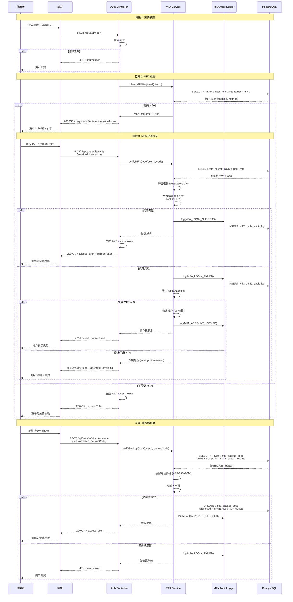

# MFA 合規與審計技術實現（MFA Compliance and Audit Technical Implementation）

> **業務需求**: [MFA_Compliance_Requirements.md](../../requirements/06_Governance_Licensing/05_MFA_Compliance_Requirements.md)
> **目標讀者**: 合規官、安全工程師、後端開發人員
> **最後同步**: 2026-02-09

---

## 1. 備份碼儲存與加密（Backup Code Storage and Encryption）

### 1.1 AES-256-GCM 加密（AES-256-GCM Encryption）

**演算法**: AES-256-GCM (Galois/Counter Mode)
**金鑰大小**: 256 bits
**初始向量大小**: 96 bits (12 bytes)
**標籤大小**: 128 bits (16 bytes)

**為何需要加密備份碼**:
- 備份碼與密碼同等敏感
- 若被竊取,攻擊者可繞過 MFA
- 加密可防止資料庫被入侵時備份碼洩露

### 1.2 備份碼加密器實現（Backup Code Encryptor Implementation）

```java
@Component
@RequiredArgsConstructor
public class BackupCodeEncryptor {

    private final VaultKeyManager vaultKeyManager;

    private static final String ALGORITHM = "AES/GCM/NoPadding";
    private static final int IV_SIZE = 12;
    private static final int TAG_SIZE = 128;

    /**
     * Encrypt backup code using AES-256-GCM
     *
     * @param plainCode Plain backup code (8-digit numeric)
     * @param userId User identifier (for key derivation)
     * @return Encrypted code (Base64-encoded: IV + ciphertext + tag)
     */
    public String encryptCode(String plainCode, String userId) {
        try {
            // Step 1: Retrieve master encryption key from Vault
            byte[] masterKey = vaultKeyManager.getMasterEncryptionKey();

            // Step 2: Derive user-specific key using HKDF
            byte[] userKey = deriveUserKey(masterKey, userId);

            // Step 3: Generate random IV
            byte[] iv = new byte[IV_SIZE];
            new SecureRandom().nextBytes(iv);

            // Step 4: Initialize cipher
            Cipher cipher = Cipher.getInstance(ALGORITHM);
            GCMParameterSpec gcmSpec = new GCMParameterSpec(TAG_SIZE, iv);
            SecretKeySpec keySpec = new SecretKeySpec(userKey, "AES");
            cipher.init(Cipher.ENCRYPT_MODE, keySpec, gcmSpec);

            // Step 5: Encrypt code
            byte[] plainBytes = plainCode.getBytes(StandardCharsets.UTF_8);
            byte[] cipherBytes = cipher.doFinal(plainBytes);

            // Step 6: Combine IV + ciphertext + tag
            byte[] combined = new byte[IV_SIZE + cipherBytes.length];
            System.arraycopy(iv, 0, combined, 0, IV_SIZE);
            System.arraycopy(cipherBytes, 0, combined, IV_SIZE, cipherBytes.length);

            // Step 7: Base64 encode for storage
            return Base64.getEncoder().encodeToString(combined);

        } catch (Exception e) {
            throw new EncryptionException("Failed to encrypt backup code", e);
        }
    }

    /**
     * Decrypt backup code using AES-256-GCM
     *
     * @param encryptedCode Base64-encoded encrypted code
     * @param userId User identifier
     * @return Plain backup code
     */
    public String decryptCode(String encryptedCode, String userId) {
        try {
            // Step 1: Base64 decode
            byte[] combined = Base64.getDecoder().decode(encryptedCode);

            // Step 2: Extract IV and ciphertext
            byte[] iv = Arrays.copyOfRange(combined, 0, IV_SIZE);
            byte[] cipherBytes = Arrays.copyOfRange(combined, IV_SIZE, combined.length);

            // Step 3: Retrieve and derive key
            byte[] masterKey = vaultKeyManager.getMasterEncryptionKey();
            byte[] userKey = deriveUserKey(masterKey, userId);

            // Step 4: Initialize cipher
            Cipher cipher = Cipher.getInstance(ALGORITHM);
            GCMParameterSpec gcmSpec = new GCMParameterSpec(TAG_SIZE, iv);
            SecretKeySpec keySpec = new SecretKeySpec(userKey, "AES");
            cipher.init(Cipher.DECRYPT_MODE, keySpec, gcmSpec);

            // Step 5: Decrypt and verify authentication tag
            byte[] plainBytes = cipher.doFinal(cipherBytes);

            return new String(plainBytes, StandardCharsets.UTF_8);

        } catch (AEADBadTagException e) {
            throw new DecryptionException("Backup code authentication failed (possible tampering)", e);
        } catch (Exception e) {
            throw new DecryptionException("Failed to decrypt backup code", e);
        }
    }

    private byte[] deriveUserKey(byte[] masterKey, String userId) {
        try {
            Mac mac = Mac.getInstance("HmacSHA256");
            SecretKeySpec keySpec = new SecretKeySpec(masterKey, "HmacSHA256");
            mac.init(keySpec);

            byte[] info = ("backup-code-" + userId).getBytes(StandardCharsets.UTF_8);
            byte[] hash = mac.doFinal(info);

            return Arrays.copyOf(hash, 32); // 256 bits
        } catch (Exception e) {
            throw new KeyDerivationException("Failed to derive user key", e);
        }
    }
}
```

### 1.3 資料庫儲存架構（Database Storage Schema）

```sql
CREATE TABLE t_mfa_backup_code (
    id BIGSERIAL PRIMARY KEY,
    user_id BIGINT NOT NULL,
    code_encrypted VARCHAR(500) NOT NULL,  -- Base64-encoded (IV + ciphertext + tag)
    encryption_algorithm VARCHAR(50) NOT NULL DEFAULT 'AES-256-GCM',
    encryption_version INT NOT NULL DEFAULT 1,  -- For key rotation
    used BOOLEAN NOT NULL DEFAULT FALSE,
    used_at TIMESTAMP,
    created_at TIMESTAMP NOT NULL DEFAULT NOW(),
    CONSTRAINT fk_user FOREIGN KEY (user_id) REFERENCES t_user(id)
);

CREATE INDEX idx_backup_code_user_id ON t_mfa_backup_code(user_id) WHERE used = FALSE;
```

---

## 2. 身份證件上傳（帳戶恢復）（Identity Document Upload - Account Recovery）

### 2.1 證件上傳流程（Document Upload Flow）

**支援的證件類型**:
- 護照（Passport）
- 駕照（Driver's License）
- 國民身份證（National ID Card）
- 水電帳單（地址證明）（Utility Bill - proof of address）

**檔案格式**:
- 接受格式: JPG, PNG, PDF
- 最大大小: 10 MB
- 解析度: 最小 1200 x 900 像素

### 2.2 S3 上傳實現（S3 Upload Implementation）

```java
/**
 * Manager class for identity document persistence operations.
 * SmartAdmin Pattern: @Transactional only in Manager layer.
 */
@Component
@RequiredArgsConstructor
public class IdentityDocumentManager {

    private final IdentityDocumentDao documentDao;

    /**
     * Persist document reference in database (transactional).
     */
    @Transactional(rollbackFor = Throwable.class)
    public void saveDocumentReference(IdentityDocumentEntity doc) {
        documentDao.insert(doc);
    }
}

/**
 * Service class for identity document orchestration.
 * Delegates transactional operations to IdentityDocumentManager.
 */
@Service
@RequiredArgsConstructor
public class IdentityDocumentService {

    private final AmazonS3 s3Client;
    private final UserMFADao userMFADao;
    private final IdentityDocumentManager documentManager;

    private static final String BUCKET_NAME = "smartadmin-mfa-recovery";
    private static final long MAX_FILE_SIZE = 10 * 1024 * 1024; // 10 MB

    /**
     * Upload identity document to S3 (for account recovery).
     * Delegates persistence to IdentityDocumentManager.
     *
     * @param userId User identifier
     * @param file Uploaded file
     * @param documentType Document type (passport, license, etc.)
     * @return S3 object key
     */
    public String uploadDocument(Long userId, MultipartFile file, DocumentType documentType) {
        // Step 1: Validate file
        validateFile(file);

        // Step 2: Generate unique S3 key
        String fileExtension = FilenameUtils.getExtension(file.getOriginalFilename());
        String s3Key = String.format(
            "identity-docs/%d/%s_%s.%s",
            userId,
            documentType.name().toLowerCase(),
            UUID.randomUUID().toString(),
            fileExtension
        );

        try {
            // Step 3: Upload to S3 with encryption
            ObjectMetadata metadata = new ObjectMetadata();
            metadata.setContentLength(file.getSize());
            metadata.setContentType(file.getContentType());
            metadata.setSSEAlgorithm(ObjectMetadata.AES_256_SERVER_SIDE_ENCRYPTION);

            s3Client.putObject(
                BUCKET_NAME,
                s3Key,
                file.getInputStream(),
                metadata
            );

            // Step 4: Store reference in database (delegate to Manager)
            IdentityDocumentEntity doc = IdentityDocumentEntity.builder()
                .userId(userId)
                .documentType(documentType)
                .s3Bucket(BUCKET_NAME)
                .s3Key(s3Key)
                .fileSize(file.getSize())
                .fileName(file.getOriginalFilename())
                .uploadedAt(LocalDateTime.now())
                .verificationStatus(VerificationStatus.PENDING)
                .build();

            documentManager.saveDocumentReference(doc);

            log.info("[IdentityDoc] User {} uploaded {} document: {}",
                userId, documentType, s3Key);

            return s3Key;

        } catch (IOException e) {
            throw new DocumentUploadException("Failed to upload identity document", e);
        }
    }

    /**
     * Retrieve document URL (pre-signed URL with 5-minute expiry)
     *
     * @param userId User identifier
     * @param documentId Document identifier
     * @return Pre-signed S3 URL
     */
    public String getDocumentURL(Long userId, Long documentId) {
        IdentityDocumentEntity doc = identityDocumentDao.selectById(documentId);

        if (doc == null || !doc.getUserId().equals(userId)) {
            throw new BusinessException("Document not found or access denied");
        }

        // Generate pre-signed URL (expires in 5 minutes)
        Date expiration = new Date();
        long expTimeMillis = expiration.getTime() + (5 * 60 * 1000); // 5 minutes
        expiration.setTime(expTimeMillis);

        GeneratePresignedUrlRequest request = new GeneratePresignedUrlRequest(
            doc.getS3Bucket(),
            doc.getS3Key()
        ).withMethod(HttpMethod.GET)
         .withExpiration(expiration);

        URL url = s3Client.generatePresignedUrl(request);

        return url.toString();
    }

    private void validateFile(MultipartFile file) {
        // Validate size
        if (file.getSize() > MAX_FILE_SIZE) {
            throw new BusinessException("File size exceeds 10 MB limit");
        }

        // Validate content type
        String contentType = file.getContentType();
        if (!Arrays.asList("image/jpeg", "image/png", "application/pdf").contains(contentType)) {
            throw new BusinessException("Invalid file type (accepted: JPG, PNG, PDF)");
        }

        // Validate file extension
        String extension = FilenameUtils.getExtension(file.getOriginalFilename());
        if (!Arrays.asList("jpg", "jpeg", "png", "pdf").contains(extension.toLowerCase())) {
            throw new BusinessException("Invalid file extension");
        }
    }
}
```

### 2.3 證件驗證工作流程（Document Verification Workflow）

```java
/**
 * Manager class for document verification persistence.
 * SmartAdmin Pattern: @Transactional only in Manager layer.
 */
@Component
@RequiredArgsConstructor
public class DocumentVerificationManager {

    private final IdentityDocumentDao documentDao;

    /**
     * Update document verification status (transactional).
     */
    @Transactional(rollbackFor = Throwable.class)
    public IdentityDocumentEntity updateVerificationStatus(
            Long documentId,
            VerificationStatus status,
            String reviewNote) {
        IdentityDocumentEntity doc = documentDao.selectById(documentId);

        if (doc == null) {
            throw new BusinessException("Document not found");
        }

        doc.setVerificationStatus(status);
        doc.setReviewedAt(LocalDateTime.now());
        doc.setReviewNote(reviewNote);

        documentDao.updateById(doc);
        return doc;
    }
}

/**
 * Service class for document verification orchestration.
 * Delegates transactional operations to DocumentVerificationManager.
 */
@Service
@RequiredArgsConstructor
public class DocumentVerificationService {

    private final DocumentVerificationManager verificationManager;
    private final NotificationService notificationService;

    /**
     * Admin review and approve/reject identity document.
     * Delegates persistence to DocumentVerificationManager.
     *
     * @param documentId Document identifier
     * @param status APPROVED or REJECTED
     * @param reviewNote Admin review note
     */
    public void reviewDocument(Long documentId, VerificationStatus status, String reviewNote) {
        // Delegate transactional operation to Manager
        IdentityDocumentEntity doc = verificationManager.updateVerificationStatus(
            documentId, status, reviewNote);

        // Send notification to user
        if (status == VerificationStatus.APPROVED) {
            notificationService.sendDocumentApproved(doc.getUserId());
        } else {
            notificationService.sendDocumentRejected(doc.getUserId(), reviewNote);
        }

        log.info("[DocumentVerification] Document {} reviewed: {}", documentId, status);
    }
}
```

---

## 3. 審計日誌實現（Audit Log Implementation）

### 3.1 JSONB 儲存（PostgreSQL）

**資料庫架構**:

```sql
CREATE TABLE t_mfa_audit_log (
    id BIGSERIAL PRIMARY KEY,
    user_id BIGINT NOT NULL,
    event_type VARCHAR(50) NOT NULL,  -- MFA_ENABLED, MFA_LOGIN_SUCCESS, MFA_LOGIN_FAILED, etc.
    event_data JSONB NOT NULL,        -- Flexible event-specific data
    ip_address VARCHAR(50),
    user_agent TEXT,
    created_at TIMESTAMP NOT NULL DEFAULT NOW(),
    CONSTRAINT fk_user FOREIGN KEY (user_id) REFERENCES t_user(id)
);

-- Index for user lookup
CREATE INDEX idx_mfa_audit_log_user_id ON t_mfa_audit_log(user_id);

-- Index for event type filtering
CREATE INDEX idx_mfa_audit_log_event_type ON t_mfa_audit_log(event_type);

-- Index for time-based queries
CREATE INDEX idx_mfa_audit_log_created_at ON t_mfa_audit_log(created_at DESC);

-- GIN index for JSONB queries
CREATE INDEX idx_mfa_audit_log_event_data ON t_mfa_audit_log USING GIN (event_data);
```

### 3.2 審計事件類型（Audit Event Types）

| 事件類型 | 描述 | 保留期限 |
|---------|------|---------|
| MFA_ENABLED | 使用者啟用 MFA | 永久保留 |
| MFA_DISABLED | 使用者停用 MFA | 永久保留 |
| MFA_LOGIN_SUCCESS | MFA 驗證成功 | 90 天 |
| MFA_LOGIN_FAILED | MFA 驗證失敗 | 90 天 |
| MFA_ACCOUNT_LOCKED | 3 次失敗後帳戶鎖定 | 365 天 |
| MFA_BACKUP_CODE_USED | 使用備份碼登入 | 365 天 |
| MFA_TRUSTED_DEVICE_ADDED | 新增受信任裝置 | 90 天 |
| MFA_RECOVERY_INITIATED | 啟動帳戶恢復 | 365 天 |
| MFA_SECURITY_ALERT | 偵測到可疑活動 | 365 天 |

### 3.3 審計記錄器實現（Audit Logger Implementation）

```java
@Service
@RequiredArgsConstructor
public class MFAAuditLogger {

    private final MFAAuditLogDao auditLogDao;
    private final KafkaTemplate<String, String> kafkaTemplate;

    private static final String KAFKA_TOPIC = "mfa-audit-events";

    /**
     * Log MFA event to PostgreSQL + Kafka
     *
     * @param event MFAAuditEvent
     */
    public void log(MFAAuditEvent event) {
        // Step 1: Store in PostgreSQL (immediate persistence)
        MFAAuditLogEntity logEntity = MFAAuditLogEntity.builder()
            .userId(event.getUserId())
            .eventType(event.getEventType())
            .eventData(JsonUtil.toJson(event.getData())) // Convert to JSONB
            .ipAddress(event.getIpAddress())
            .userAgent(event.getUserAgent())
            .createdAt(LocalDateTime.now())
            .build();

        auditLogDao.insert(logEntity);

        // Step 2: Send to Kafka (for real-time monitoring and SIEM integration)
        try {
            String kafkaMessage = JsonUtil.toJson(event);
            kafkaTemplate.send(KAFKA_TOPIC, event.getUserId().toString(), kafkaMessage);
        } catch (Exception e) {
            log.error("[AuditLog] Failed to send Kafka message for event {}", event.getEventType(), e);
            // Continue execution (Kafka failure should not break audit logging)
        }

        log.info("[AuditLog] Logged event {} for user {}", event.getEventType(), event.getUserId());
    }

    /**
     * Query audit logs for a user
     *
     * @param userId User identifier
     * @param startDate Start date (inclusive)
     * @param endDate End date (inclusive)
     * @return List of audit logs
     */
    public List<MFAAuditLogEntity> getUserAuditLogs(Long userId, LocalDate startDate, LocalDate endDate) {
        return auditLogDao.findByUserIdAndDateRange(
            userId,
            startDate.atStartOfDay(),
            endDate.plusDays(1).atStartOfDay()
        );
    }

    /**
     * Query audit logs with JSONB filtering
     *
     * @param eventType Event type
     * @param jsonQuery JSONB query (e.g., "event_data @> '{\"failureReason\": \"INVALID_TOTP\"}'")
     * @return List of audit logs
     */
    public List<MFAAuditLogEntity> queryByEventData(String eventType, String jsonQuery) {
        return auditLogDao.findByEventTypeAndJsonQuery(eventType, jsonQuery);
    }
}
```

### 3.4 Kafka 配置（Kafka Configuration）

**application.yml**:

```yaml
spring:
  kafka:
    bootstrap-servers: localhost:9092
    producer:
      key-serializer: org.apache.kafka.common.serialization.StringSerializer
      value-serializer: org.apache.kafka.common.serialization.StringSerializer
      acks: all  # Ensure message is replicated before returning
      retries: 3
    consumer:
      group-id: mfa-audit-consumer
      key-deserializer: org.apache.kafka.common.serialization.StringDeserializer
      value-deserializer: org.apache.kafka.common.serialization.StringDeserializer
```

### 3.5 審計日誌條目範例（Example Audit Log Entries）

**MFA 登入成功**:
```json
{
  "userId": 12345,
  "eventType": "MFA_LOGIN_SUCCESS",
  "eventData": {
    "method": "TOTP",
    "deviceFingerprint": "abc123xyz",
    "trustedDevice": true,
    "loginTimestamp": "2026-02-09T10:30:15Z"
  },
  "ipAddress": "192.168.1.100",
  "userAgent": "Mozilla/5.0 (Windows NT 10.0; Win64; x64) AppleWebKit/537.36",
  "createdAt": "2026-02-09T10:30:15Z"
}
```

**MFA 帳戶鎖定**:
```json
{
  "userId": 12345,
  "eventType": "MFA_ACCOUNT_LOCKED",
  "eventData": {
    "reason": "MAX_ATTEMPTS_EXCEEDED",
    "failedAttempts": 3,
    "lockedUntil": "2026-02-09T10:45:00Z",
    "failureDetails": [
      {"timestamp": "2026-02-09T10:28:00Z", "code": "123456", "result": "INVALID"},
      {"timestamp": "2026-02-09T10:29:00Z", "code": "789012", "result": "INVALID"},
      {"timestamp": "2026-02-09T10:30:00Z", "code": "345678", "result": "INVALID"}
    ]
  },
  "ipAddress": "192.168.1.100",
  "userAgent": "Mozilla/5.0",
  "createdAt": "2026-02-09T10:30:15Z"
}
```

---

## 4. 異常偵測實現（Anomaly Detection Implementation）

### 4.1 偵測規則（Detection Rules）

**規則 1: 新 IP 地址多次失敗嘗試**
- 觸發條件: 從未見過的 IP 地址進行 ≥ 2 次 MFA 失敗嘗試
- 處理動作: 發送安全警報 + 要求電子郵件驗證

**規則 2: 地理位置異常**
- 觸發條件: 從與使用者慣用地點不同的國家成功 MFA 登入
- 處理動作: 發送安全警報 + 可選帳戶凍結

**規則 3: 備份碼過度使用**
- 觸發條件: 7 天內使用 > 3 個備份碼
- 處理動作: 強制 MFA 裝置重新註冊

**規則 4: 受信任裝置權杖重複使用**
- 觸發條件: 同一受信任裝置權杖從不同 IP 地址使用
- 處理動作: 撤銷受信任裝置權杖 + 發送安全警報

### 4.2 異常偵測器實現（Anomaly Detector Implementation）

```java
@Service
@RequiredArgsConstructor
public class MFAAnomalyDetector {

    private final MFAAuditLogDao auditLogDao;
    private final SecurityAlertService alertService;

    /**
     * Rule 1: Multiple failed attempts from new IP
     *
     * @param userId User identifier
     * @param ipAddress Client IP address
     */
    public void detectFailedAttemptsFromNewIP(Long userId, String ipAddress) {
        // Step 1: Check if IP address is known
        boolean isKnownIP = auditLogDao.existsByUserIdAndIP(userId, ipAddress);

        if (!isKnownIP) {
            // Step 2: Count failed attempts from this IP in last 10 minutes
            long failedCount = auditLogDao.countFailedAttempts(
                userId,
                ipAddress,
                LocalDateTime.now().minusMinutes(10)
            );

            if (failedCount >= 2) {
                // Step 3: Trigger security alert
                alertService.sendAlert(SecurityAlert.builder()
                    .userId(userId)
                    .alertType(AlertType.MFA_ANOMALY)
                    .severity(AlertSeverity.HIGH)
                    .title("Multiple MFA failures from unknown IP")
                    .message(String.format(
                        "User %d had %d failed MFA attempts from new IP %s",
                        userId, failedCount, ipAddress
                    ))
                    .build());

                log.warn("[AnomalyDetection] Rule 1 triggered for user {}: {} failed attempts from new IP {}",
                    userId, failedCount, ipAddress);
            }
        }
    }

    /**
     * Rule 2: Geographic anomaly
     *
     * @param userId User identifier
     * @param ipAddress Client IP address
     */
    public void detectGeographicAnomaly(Long userId, String ipAddress) {
        // Step 1: Get user's typical country from historical logins
        String typicalCountry = getUserTypicalCountry(userId);

        // Step 2: Resolve current IP to country
        String currentCountry = geoIPService.resolveCountry(ipAddress);

        if (!currentCountry.equals(typicalCountry)) {
            // Step 3: Check if this is a high-risk country
            boolean isHighRisk = SecurityConfig.HIGH_RISK_COUNTRIES.contains(currentCountry);

            alertService.sendAlert(SecurityAlert.builder()
                .userId(userId)
                .alertType(AlertType.GEOGRAPHIC_ANOMALY)
                .severity(isHighRisk ? AlertSeverity.CRITICAL : AlertSeverity.MEDIUM)
                .title("Login from unusual location")
                .message(String.format(
                    "User %d logged in from %s (typical: %s)",
                    userId, currentCountry, typicalCountry
                ))
                .build());

            log.warn("[AnomalyDetection] Rule 2 triggered for user {}: login from {} (typical: {})",
                userId, currentCountry, typicalCountry);
        }
    }

    /**
     * Rule 3: Excessive backup code usage
     *
     * @param userId User identifier
     */
    public void detectExcessiveBackupCodeUsage(Long userId) {
        // Count backup codes used in last 7 days
        long usedCount = auditLogDao.countBackupCodeUsage(
            userId,
            LocalDateTime.now().minusDays(7)
        );

        if (usedCount > 3) {
            alertService.sendAlert(SecurityAlert.builder()
                .userId(userId)
                .alertType(AlertType.EXCESSIVE_BACKUP_CODE_USAGE)
                .severity(AlertSeverity.HIGH)
                .title("Excessive backup code usage")
                .message(String.format(
                    "User %d used %d backup codes in 7 days (threshold: 3)",
                    userId, usedCount
                ))
                .build());

            // Force MFA device re-registration
            mfaService.disableMFA(userId, "Excessive backup code usage detected");

            log.warn("[AnomalyDetection] Rule 3 triggered for user {}: {} backup codes used in 7 days",
                userId, usedCount);
        }
    }

    /**
     * Rule 4: Trusted device token reuse
     *
     * @param userId User identifier
     * @param deviceToken Trusted device token
     * @param ipAddress Client IP address
     */
    public void detectTrustedDeviceTokenReuse(Long userId, String deviceToken, String ipAddress) {
        // Find all recent uses of this device token
        List<MFAAuditLogEntity> recentUses = auditLogDao.findRecentTrustedDeviceUses(
            userId,
            deviceToken,
            LocalDateTime.now().minusHours(24)
        );

        // Extract distinct IP addresses
        Set<String> ipAddresses = recentUses.stream()
            .map(MFAAuditLogEntity::getIpAddress)
            .collect(Collectors.toSet());

        if (ipAddresses.size() > 1) {
            // Same device token used from multiple IPs
            alertService.sendAlert(SecurityAlert.builder()
                .userId(userId)
                .alertType(AlertType.TRUSTED_DEVICE_TOKEN_REUSE)
                .severity(AlertSeverity.CRITICAL)
                .title("Trusted device token reused from multiple IPs")
                .message(String.format(
                    "User %d's trusted device token was used from %d different IPs: %s",
                    userId, ipAddresses.size(), ipAddresses
                ))
                .build());

            // Invalidate trusted device token
            trustedDeviceService.revokeToken(userId, deviceToken);

            log.error("[AnomalyDetection] Rule 4 triggered for user {}: device token reused from {} IPs",
                userId, ipAddresses.size());
        }
    }

    private String getUserTypicalCountry(Long userId) {
        // Get most frequent country from last 30 days of logins
        return auditLogDao.getMostFrequentCountry(userId, LocalDateTime.now().minusDays(30));
    }
}
```

---

## 5. MFA 強制執行策略（MFA Enforcement Policy）

### 5.1 基於角色的配置（Role-Based Configuration）

**資料庫架構**:

```sql
CREATE TABLE t_role_mfa_config (
    id BIGSERIAL PRIMARY KEY,
    role_code VARCHAR(50) NOT NULL UNIQUE,
    mfa_mandatory BOOLEAN NOT NULL DEFAULT FALSE,
    allowed_methods TEXT[] NOT NULL,  -- Array: TOTP, SMS, BACKUP_CODES, HARDWARE_TOKEN
    grace_period_days INT NOT NULL DEFAULT 0,
    created_at TIMESTAMP NOT NULL DEFAULT NOW(),
    updated_at TIMESTAMP NOT NULL DEFAULT NOW()
);

-- Example data
INSERT INTO t_role_mfa_config (role_code, mfa_mandatory, allowed_methods, grace_period_days) VALUES
('SUPER_ADMIN', TRUE, ARRAY['TOTP', 'HARDWARE_TOKEN'], 0),
('FINANCE_MANAGER', TRUE, ARRAY['TOTP', 'HARDWARE_TOKEN'], 7),
('RISK_CONTROL', TRUE, ARRAY['TOTP', 'SMS', 'BACKUP_CODES'], 14),
('DEVELOPER', TRUE, ARRAY['TOTP', 'SMS'], 14),
('CS_AGENT', FALSE, ARRAY['TOTP', 'SMS', 'BACKUP_CODES'], 0),
('MARKETING', FALSE, ARRAY['TOTP', 'SMS'], 0);
```

### 5.2 MFAEnforcementService 實現（MFAEnforcementService Implementation）

```java
@Service
@RequiredArgsConstructor
public class MFAEnforcementService {

    private final RoleMFAConfigDao roleMFAConfigDao;
    private final UserMFADao userMFADao;

    /**
     * Check if MFA is mandatory for user's role
     *
     * @param role User role
     * @return true if MFA is mandatory
     */
    public boolean isMFAMandatory(Role role) {
        RoleMFAConfig config = roleMFAConfigDao.findByRoleCode(role.getCode());

        return config != null && config.isMfaMandatory();
    }

    /**
     * Get allowed MFA methods for user's role
     *
     * @param role User role
     * @return List of allowed MFA methods
     */
    public List<MFAMethod> getAllowedMethods(Role role) {
        RoleMFAConfig config = roleMFAConfigDao.findByRoleCode(role.getCode());

        if (config == null) {
            return List.of(MFAMethod.TOTP, MFAMethod.SMS); // Default
        }

        return Arrays.stream(config.getAllowedMethods())
            .map(MFAMethod::valueOf)
            .collect(Collectors.toList());
    }

    /**
     * Enforce MFA at login (block if required but not enabled)
     *
     * @param userId User identifier
     * @param role User role
     * @throws MFARequiredException if MFA is mandatory but not enabled
     */
    public void enforceAtLogin(Long userId, Role role) {
        if (isMFAMandatory(role)) {
            UserMFAEntity mfa = userMFADao.findByUserId(userId);

            if (mfa == null || !mfa.isEnabled()) {
                // Check grace period
                RoleMFAConfig config = roleMFAConfigDao.findByRoleCode(role.getCode());
                LocalDateTime gracePeriodEnd = calculateGracePeriodEnd(userId, config.getGracePeriodDays());

                if (LocalDateTime.now().isAfter(gracePeriodEnd)) {
                    throw new MFARequiredException(
                        "MFA is mandatory for your role. Please enable MFA to continue."
                    );
                }
            }
        }
    }

    private LocalDateTime calculateGracePeriodEnd(Long userId, int gracePeriodDays) {
        // Grace period starts from user's role assignment date
        UserRoleEntity userRole = userRoleDao.findByUserId(userId);
        return userRole.getAssignedAt().plusDays(gracePeriodDays);
    }
}
```

---

## 6. MFA 挑戰-回應流程（MFA Challenge-Response Flow）

### 6.1 端到端 MFA 驗證序列（End-to-End MFA Verification Sequence）

以下圖表說明從初始登入到成功驗證的完整 MFA 挑戰-回應流程:



### 6.2 關鍵安全措施（Key Security Measures）

**基於時間的窗口（TOTP）**:
- 接受 T-30s 到 T+30s 的代碼（±1 時間步驟）
- 透過基於時間的失效防止重放攻擊
- 30 秒窗口 = 任何時間有 3 個有效代碼（T-1, T, T+1）

**帳戶鎖定**:
- 3 次失敗嘗試 → 15 分鐘鎖定
- 鎖定時長儲存在 Redis（自動過期）
- 防止暴力破解攻擊

**備份碼一次性使用**:
- 每個備份碼僅能使用一次
- 驗證後在資料庫中將 `used` 標記設為 TRUE
- 使用備份碼時向使用者發送通知

**審計軌跡**:
- 每次 MFA 嘗試都記錄到 PostgreSQL + Kafka
- JSONB 儲存提供靈活的事件資料
- 登入事件保留 90 天，安全警報保留 365 天

---

## 7. 相關文件（Related Documents）

### 業務需求（Business Requirements）
- [MFA_Compliance_Requirements.md](../../requirements/06_Governance_Licensing/05_MFA_Compliance_Requirements.md) - 備份碼規格、恢復流程、審計需求

### 技術實現（Technical Implementation）
- [MFA_Technical_Evaluation.md](05_MFA_Technical_Evaluation.md) - TOTP 演算法、AES-256-GCM 加密
- [MFA_Login_Recovery_Technical.md](10_MFA_Login_Recovery_Technical.md) - 兩階段登入、會話儲存

### 安全標準（Security Standards）
- **NIST SP 800-63B**: 數位身份指南（備份驗證器、審計需求）
- **GDPR Article 32**: 加密、日誌記錄和安全措施
- **ISO 27001 A.12.4**: 日誌記錄與監控

---

**文件版本**: 1.0.0
**最後更新**: 2026-02-09
**維護者**: 合規團隊、安全團隊
