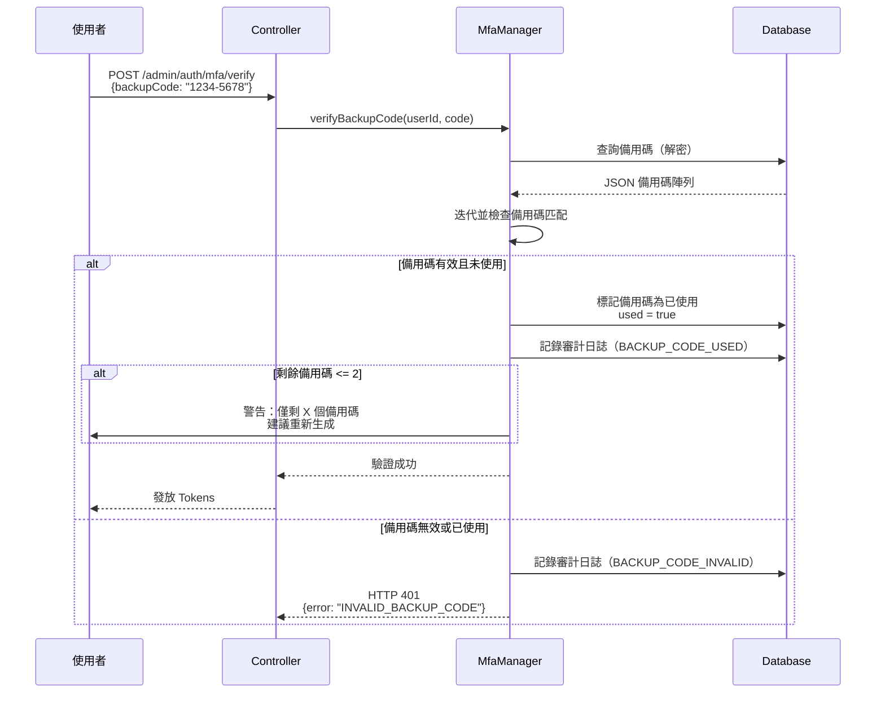
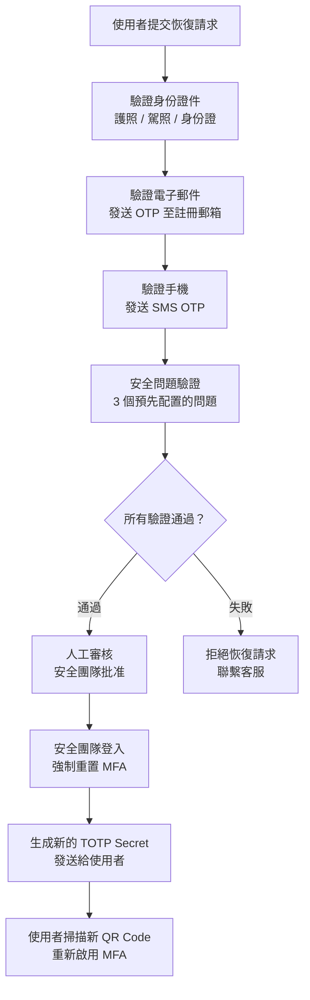
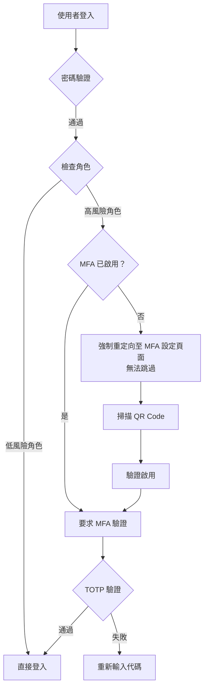
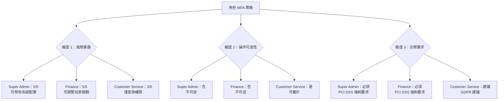

# MFA 合規驗證（MFA Compliance Validation）- 技術架構（Technical Architecture）

> **規範來源**: [06-06-04_Compliance_Audit.md](../../source-archive/06_Platform_Governance/06-06-04_Compliance_Audit.md)
> **目標讀者**: Architects, Backend Developers, DevOps
> **業務需求**: [MFA Compliance Requirements](../../requirements/06_Governance_Licensing/05_MFA_Compliance_Requirements.md)
> **最後同步**: 2026-02-08

---

## 1. 概述（Overview）

本文檔涵蓋 MFA 合規驗證的技術實現，包括備用碼生成算法、審計日誌數據庫架構、自動化異常檢測查詢、API 規範，以及 SmartAdmin iGaming 平台的集成測試模式。

---

## 2. 備用碼實現（Backup Code Implementation）

### 2.1 生成算法（Generation Algorithm）

```java
import java.security.SecureRandom;
import java.util.ArrayList;
import java.util.List;

public class BackupCodeGenerator {

    private static final SecureRandom RANDOM = new SecureRandom();

    /**
     * Generate backup codes (8-digit, format: 1234-5678)
     *
     * @param count Number of codes to generate (recommended: 10)
     * @return List of backup codes
     */
    public static List<String> generate(int count) {
        List<String> codes = new ArrayList<>(count);

        for (int i = 0; i < count; i++) {
            // Generate 8-digit number (10000000 ~ 99999999)
            int code = RANDOM.nextInt(90000000) + 10000000;

            // Format as 1234-5678 (human-readable)
            String formatted = String.format("%04d-%04d",
                code / 10000,
                code % 10000
            );

            codes.add(formatted);
        }

        return codes;
    }
}

// Example output
// List<String> backupCodes = BackupCodeGenerator.generate(10);
// [1234-5678, 9012-3456, 7890-1234, ...]
```

### 2.2 儲存架構（Storage Schema）（JSON）

```json
{
  "codes": [
    {
      "code": "1234-5678",
      "used": false,
      "usedAt": null
    },
    {
      "code": "9012-3456",
      "used": false,
      "usedAt": null
    },
    {
      "code": "7890-1234",
      "used": true,
      "usedAt": "2026-02-05T10:30:00Z"
    }
  ],
  "generatedAt": "2026-02-01T10:00:00Z"
}
```

### 2.3 備用碼驗證序列（Backup Code Verification Sequence）



---

## 3. 備用碼管理 API（Backup Code Management API）

### 3.1 查看剩餘備用碼狀態（View Remaining Backup Code Status）

```http
GET /admin/mfa/backup-codes/status
Authorization: Bearer {accessToken}
```

**回應（Response）**：

```json
{
  "code": 200,
  "msg": "Success",
  "data": {
    "totalCodes": 10,
    "usedCodes": 3,
    "remainingCodes": 7,
    "lastUsedAt": "2026-02-05T10:30:00Z"
  }
}
```

### 3.2 重新生成備用碼（Regenerate Backup Codes）

```http
POST /admin/mfa/backup-codes/regenerate
Authorization: Bearer {accessToken}
Content-Type: application/json

{
  "totpCode": "123456"
}
```

**回應（Response）**：

```json
{
  "code": 200,
  "msg": "Backup codes regenerated successfully.",
  "data": {
    "backupCodes": [
      "1111-2222",
      "3333-4444",
      "5555-6666"
    ]
  }
}
```

---

## 4. 設備遺失恢復實現（Device Loss Recovery Implementation）

### 4.1 恢復請求流程（Recovery Request Flow）



### 4.2 恢復請求 API（Recovery Request API）

```http
POST /admin/mfa/recovery/request
Content-Type: multipart/form-data

{
  "userId": 12345,
  "idCardPhoto": <File>,
  "reason": "Phone lost, cannot use Google Authenticator"
}
```

### 4.3 恢復請求數據庫架構（Recovery Request Database Schema）

```sql
-- t_mfa_recovery_request table
CREATE TABLE t_mfa_recovery_request (
    request_id      BIGSERIAL PRIMARY KEY,
    user_id         BIGINT NOT NULL REFERENCES t_admin_user(user_id),
    id_card_photo   TEXT,                       -- ID document photo URL
    reason          TEXT,
    status          VARCHAR(20) NOT NULL,       -- PENDING / APPROVED / REJECTED
    reviewed_by     BIGINT REFERENCES t_admin_user(user_id),
    reviewed_at     TIMESTAMP,
    created_at      TIMESTAMP DEFAULT NOW()
);
```

### 4.4 安全團隊審核介面（Security Team Review Interface）

```vue
<template>
  <a-table :dataSource="recoveryRequests" :columns="columns">
    <template #bodyCell="{ column, record }">
      <template v-if="column.key === 'action'">
        <a-space>
          <a-button type="primary" @click="approveRequest(record)">
            Approve
          </a-button>
          <a-button danger @click="rejectRequest(record)">
            Reject
          </a-button>
        </a-space>
      </template>
    </template>
  </a-table>
</template>

<script setup>
const recoveryRequests = ref([]);

async function approveRequest(record) {
  await fetch(`/admin/mfa/recovery/${record.requestId}/approve`, {
    method: 'POST'
  });

  message.success('Recovery request approved');
  loadRequests();
}
</script>
```

### 4.5 強制重置 MFA 實現（Force Reset MFA Implementation）

```java
/**
 * Manager class for MFA force reset operations.
 * SmartAdmin Pattern: @Transactional only in Manager layer with @Component.
 */
@Component
@RequiredArgsConstructor
public class MfaResetManager {

    private final MfaRepository mfaRepository;
    private final AuditLogService auditLogService;

    /**
     * Force reset MFA for a user (transactional).
     * Deletes old MFA records and prepares for re-enrollment.
     */
    @Transactional(rollbackFor = Throwable.class)
    public void forceResetMfaRecords(Long userId, Long reviewerUserId) {
        // Step 1: Delete old MFA records
        mfaRepository.deleteByUserId(userId);

        // Step 2: Record audit log (CRITICAL level)
        auditLogService.log(userId, "MFA_FORCE_RESET", String.format(
            "Security Team force reset MFA (reviewer: %d)", reviewerUserId
        ));
    }
}

/**
 * Service class for MFA reset orchestration.
 * Delegates transactional operations to MfaResetManager.
 */
@Service
@RequiredArgsConstructor
public class MfaResetService {

    private final MfaResetManager mfaResetManager;
    private final EmailService emailService;

    /**
     * Force reset MFA for a user.
     * Orchestrates the reset flow and email notification.
     */
    public ResponseDTO<Void> forceResetMfa(Long userId, Long reviewerUserId) {
        // Delegate transactional operation to Manager
        mfaResetManager.forceResetMfaRecords(userId, reviewerUserId);

        // Generate new TOTP Secret
        String newSecret = TotpSecretGenerator.generateSecret();
        String qrCode = QrCodeGenerator.generateQrCode(
            getUserEmail(userId),
            newSecret,
            "SmartAdmin iGaming"
        );

        // Send email to user
        emailService.sendMfaResetEmail(userId, qrCode, newSecret);

        return ResponseDTO.ok();
    }
}
```

---

## 5. 緊急聯絡人數據庫架構（Emergency Contact Database Schema）

```sql
-- t_mfa_emergency_contact table
CREATE TABLE t_mfa_emergency_contact (
    user_id             BIGINT NOT NULL REFERENCES t_admin_user(user_id),
    contact_user_id     BIGINT NOT NULL REFERENCES t_admin_user(user_id),
    contact_type        VARCHAR(20) NOT NULL,   -- COLLEAGUE / MANAGER
    verified            BOOLEAN DEFAULT FALSE,
    created_at          TIMESTAMP DEFAULT NOW(),
    PRIMARY KEY (user_id, contact_user_id)
);
```

### 5.1 驗證電子郵件範本（Verification Email Template）

```html
<p>Hello {{contactName}},</p>

<p>{{userName}} ({{userEmail}}) has submitted an MFA recovery request, claiming phone loss.</p>

<p>Please click the link below to confirm this is a legitimate request:</p>

<a href="https://admin.smartadmin.com/mfa/recovery/verify?token={{verificationToken}}">
  Confirm Recovery Request
</a>

<p>If this is not a legitimate request, please contact Security Team immediately.</p>
```

---

## 6. 基於角色的 MFA 策略實現（Role-Based MFA Policy Implementation）

### 6.1 MFA 策略服務（MFA Policy Service）

```java
@Service
@RequiredArgsConstructor
public class MfaPolicyService {

    private final AdminUserService adminUserService;
    private final MfaRepository mfaRepository;

    /**
     * Check if user requires mandatory MFA
     *
     * @param userId User ID
     * @return true if mandatory MFA required, false if optional
     */
    public boolean requiresMandatoryMfa(Long userId) {
        List<String> roles = adminUserService.getUserRoles(userId);

        // Mandatory MFA role list
        Set<String> mandatoryMfaRoles = Set.of(
            "SUPER_ADMIN",
            "FINANCE_MANAGER",
            "RISK_CONTROL",
            "DATABASE_ADMIN",
            "DEVOPS"
        );

        // Check if user belongs to a mandatory MFA role
        return roles.stream().anyMatch(mandatoryMfaRoles::contains);
    }

    /**
     * Pre-login MFA status validation
     *
     * @param userId User ID
     * @throws MfaNotEnabledException if user requires MFA but has not enabled it
     */
    public void validateMfaStatusBeforeLogin(Long userId) {
        if (requiresMandatoryMfa(userId)) {
            boolean mfaEnabled = mfaRepository.isMfaEnabled(userId);

            if (!mfaEnabled) {
                throw new MfaNotEnabledException(
                    "Your role requires MFA to be enabled before login. Please contact an administrator."
                );
            }
        }
    }
}
```

### 6.2 首次登入強制設定流程（First Login Mandatory Setup Flow）



### 6.3 可選 MFA 建議（Optional MFA Recommendation）（低風險角色）

```java
/**
 * Post-login MFA recommendation prompt
 */
public void showMfaRecommendation(Long userId) {
    List<String> roles = adminUserService.getUserRoles(userId);
    boolean mfaEnabled = mfaRepository.isMfaEnabled(userId);

    if (!mfaEnabled && roles.contains("CUSTOMER_SERVICE")) {
        // Display recommendation banner (non-blocking)
        return ResponseDTO.ok().withWarning(
            "We recommend enabling MFA to enhance account security. Click to set up."
        );
    }
}
```

### 6.4 前端 MFA 建議橫幅（Frontend MFA Recommendation Banner）

```vue
<template>
  <a-alert
    v-if="showMfaBanner"
    type="warning"
    message="Enable Multi-Factor Authentication (MFA)"
    description="Your role has access to player privacy data. Enabling MFA effectively prevents account compromise."
    closable
    @close="dismissBanner"
  >
    <template #action>
      <a-button type="primary" @click="navigateToMfaSetup">
        Set Up Now
      </a-button>
    </template>
  </a-alert>
</template>
```

### 6.5 決策框架圖（Decision Framework Diagram）



---

## 7. 審計日誌數據庫架構（Audit Log Database Schema）

### 7.1 MFA 審計日誌表（MFA Audit Log Table）

```sql
CREATE TABLE t_audit_log_mfa (
    log_id              BIGSERIAL PRIMARY KEY,
    user_id             BIGINT NOT NULL REFERENCES t_admin_user(user_id),
    event_type          VARCHAR(50) NOT NULL,
    event_level         VARCHAR(20) NOT NULL,   -- INFO / WARNING / CRITICAL
    ip_address          INET,
    user_agent          TEXT,
    device_fingerprint  VARCHAR(64),
    details             JSONB,                   -- Additional details (JSON format)
    created_at          TIMESTAMP DEFAULT NOW()
);

-- Indexes
CREATE INDEX idx_mfa_log_user_id ON t_audit_log_mfa(user_id);
CREATE INDEX idx_mfa_log_event_type ON t_audit_log_mfa(event_type);
CREATE INDEX idx_mfa_log_event_level ON t_audit_log_mfa(event_level);
CREATE INDEX idx_mfa_log_created_at ON t_audit_log_mfa(created_at);
```

### 7.2 審計日誌條目範例（Audit Log Entry Example）

```json
{
  "logId": 12345,
  "userId": 67890,
  "eventType": "MFA_LOGIN_FAILED",
  "eventLevel": "WARNING",
  "ipAddress": "203.0.113.42",
  "userAgent": "Mozilla/5.0 (Windows NT 10.0; Win64; x64) AppleWebKit/537.36...",
  "deviceFingerprint": "e3b0c44298fc1c149afbf4c8996fb92427ae41e4649b934ca495991b7852b855",
  "details": {
    "reason": "INVALID_TOTP",
    "attemptCount": 2,
    "remainingAttempts": 1
  },
  "createdAt": "2026-02-05T10:30:15Z"
}
```

---

## 8. 自動化異常檢測查詢（Automated Anomaly Detection Queries）

### 8.1 規則 1（Rule 1）：短時間內多次 MFA 失敗（Multiple MFA Failures in Short Period）

```sql
-- Detection: >= 3 MFA failures within 5 minutes
SELECT
    user_id,
    COUNT(*) AS fail_count,
    ARRAY_AGG(ip_address) AS ip_list
FROM t_audit_log_mfa
WHERE event_type = 'MFA_LOGIN_FAILED'
  AND created_at >= NOW() - INTERVAL '5 minutes'
GROUP BY user_id
HAVING COUNT(*) >= 3;
```

**觸發動作（Triggered actions）**：
- 鎖定帳戶 15 分鐘
- 向安全團隊發送警報
- 向使用者發送電子郵件通知

### 8.2 規則 2（Rule 2）：異常地理位置登入（Abnormal Geographic Location Login）

```sql
-- Detection: Logins from different countries within 1 hour
SELECT
    a.user_id,
    a.ip_address AS ip_1,
    b.ip_address AS ip_2,
    a.created_at AS time_1,
    b.created_at AS time_2
FROM t_audit_log_mfa a
JOIN t_audit_log_mfa b ON a.user_id = b.user_id
WHERE a.event_type = 'MFA_LOGIN_SUCCESS'
  AND b.event_type = 'MFA_LOGIN_SUCCESS'
  AND a.created_at < b.created_at
  AND b.created_at - a.created_at <= INTERVAL '1 hour'
  AND get_country(a.ip_address) != get_country(b.ip_address);
```

**觸發動作（Triggered actions）**：
- 警報安全團隊進行人工審核
- 停用受信任設備，下次登入要求完整 MFA

### 8.3 規則 3（Rule 3）：頻繁使用備用碼（Frequent Backup Code Usage）

```sql
-- Detection: >= 3 backup code uses within 7 days
SELECT
    user_id,
    COUNT(*) AS backup_code_usage
FROM t_audit_log_mfa
WHERE event_type = 'BACKUP_CODE_USED'
  AND created_at >= NOW() - INTERVAL '7 days'
GROUP BY user_id
HAVING COUNT(*) >= 3;
```

**觸發動作（Triggered actions）**：
- 警告使用者重新配置 TOTP
- 提示使用者可能設備遺失

### 8.4 規則 4（Rule 4）：高風險角色停用 MFA（MFA Disabled for High-Risk Role）

```sql
-- Detection: MFA disabled for mandatory MFA roles
SELECT
    l.user_id,
    u.username,
    l.created_at,
    l.details->>'disabledBy' AS disabled_by
FROM t_audit_log_mfa l
JOIN t_admin_user u ON l.user_id = u.user_id
WHERE l.event_type = 'MFA_DISABLED'
  AND u.role_code IN ('SUPER_ADMIN', 'FINANCE_MANAGER', 'RISK_CONTROL');
```

**觸發動作（Triggered actions）**：
- 立即警報 CTO / CISO
- 需要人工審核
- 如果未經授權，作為安全事件鎖定帳戶

---

## 9. 集成測試範例（Integration Test Examples）

```java
@SpringBootTest
@AutoConfigureMockMvc
@RequiredArgsConstructor
class MfaIntegrationTest {

    private final MockMvc mockMvc;

    private final MfaRepository mfaRepository;

    @Test
    @DisplayName("TC-MFA-001: User first-time TOTP setup")
    void testInitMfaSetup() throws Exception {
        // Given
        Long userId = 12345L;

        // When
        MvcResult result = mockMvc.perform(post("/admin/mfa/setup/init")
                .header("X-User-Id", userId))
            .andExpect(status().isOk())
            .andReturn();

        // Then
        String responseBody = result.getResponse().getContentAsString();
        JsonNode json = objectMapper.readTree(responseBody);

        assertThat(json.get("data").get("qrCode").asText()).startsWith("data:image/png;base64,");
        assertThat(json.get("data").get("secret").asText()).hasSize(32);  // Base32 = 32 chars

        // Verify database
        MfaEntity mfa = mfaRepository.findByUserId(userId).orElseThrow();
        assertThat(mfa.getStatus()).isEqualTo(MfaStatus.PENDING);
        assertThat(mfa.getTotpSecret()).isNotBlank();  // Encrypted Secret
    }

    @Test
    @DisplayName("TC-MFA-004: Account locked after 3 consecutive TOTP failures")
    void testMfaLockAfterThreeFailures() throws Exception {
        // Given
        Long userId = 12345L;
        String mfaSessionToken = "mfa_sess_test123";

        // When: 3 incorrect attempts
        for (int i = 0; i < 3; i++) {
            mockMvc.perform(post("/admin/auth/mfa/verify")
                    .contentType(MediaType.APPLICATION_JSON)
                    .content("{\"mfaSessionToken\":\"" + mfaSessionToken + "\",\"totpCode\":\"000000\"}"))
                .andExpect(status().isUnauthorized());
        }

        // Then: 4th attempt should return 429
        mockMvc.perform(post("/admin/auth/mfa/verify")
                .contentType(MediaType.APPLICATION_JSON)
                .content("{\"mfaSessionToken\":\"" + mfaSessionToken + "\",\"totpCode\":\"000000\"}"))
            .andExpect(status().isTooManyRequests())
            .andExpect(jsonPath("$.msg").value(containsString("locked")));
    }
}
```

---

## 10. 相關文檔（Related Documents）

- [06-06-01 MFA Architecture Design](../../source-archive/06_Platform_Governance/06-06-01_MFA_Architecture.md) - 業務需求和方法選擇
- [06-06-02 TOTP & WebAuthn Implementation](../../source-archive/06_Platform_Governance/06-06-02_TOTP_WebAuthn.md) - TOTP 算法細節
- [06-06-03 Login & Recovery Flow](../../source-archive/06_Platform_Governance/06-06-03_Recovery_Flow.md) - 認證流程設計
