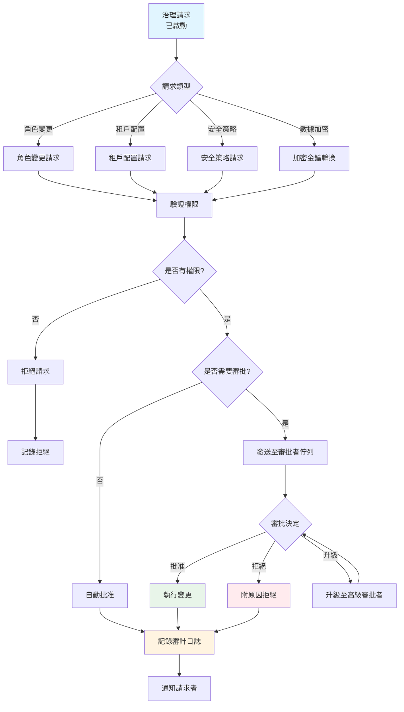

# 治理實施（Governance Implementation）

> **規範來源**: [00-15_Governance_Implementation.md](../../source-archive/00_Foundation/guides/00-15_Governance_Implementation.md)
> **目標讀者**: Architects, Backend Engineers, Security Engineers
> **業務需求**: [Governance_Requirements.md](../../requirements/06_Governance_Licensing/Governance_Requirements.md)
> **最後同步**: 2026-02-08

---

## 1. 概述（Overview）

本文件涵蓋 iGaming 平台治理系統的技術實施,包括多租戶架構（Multi-Tenant Architecture）、RBAC 權限系統、審計日誌（Audit Log）和數據加密策略。所有實施均遵循 SmartAdmin 分層架構模式。

### 1.1 治理審批工作流（Governance Approval Workflow）

治理系統對關鍵操作強制執行審批工作流,例如角色變更、租戶配置更新和安全策略修改。



**工作流特性**:
- **權限控管（Permission-gated）**: 所有請求均針對 RBAC 權限進行驗證
- **基於審批（Approval-based）**: 關鍵操作需要高級審批者同意
- **審計強制（Audit-enforced）**: 所有審批決定記錄至 compliance_audit_trail
- **升級支援（Escalation support）**: 審批者可升級複雜決定

**審批矩陣**（範例）:
- 角色權限變更: 需要 "governance:role:approve" 權限
- 租戶配置更新: 需要 "governance:tenant:approve" 權限
- 加密金鑰輪換: 需要 "governance:security:approve" 權限

### 1.2 Java 實現（Java Implementation）

#### 1.2.1 Service 層 — 治理審批服務

```java
package net.lab1024.sa.business.governance;

import io.vavr.control.Option;
import lombok.RequiredArgsConstructor;
import lombok.extern.slf4j.Slf4j;
import org.springframework.stereotype.Service;

import java.util.List;

/**
 * 治理審批服務
 * 負責審批工作流邏輯、權限驗證與決策路由
 */
@Slf4j
@Service
@RequiredArgsConstructor
public class GovernanceApprovalService {

    private final GovernancePolicyDao governancePolicyDao;
    private final ComplianceAuditTrailDao complianceAuditTrailDao;
    private final GovernanceApprovalManager governanceApprovalManager;
    private final PermissionService permissionService;
    private final NotificationService notificationService;

    /**
     * 提交治理請求
     *
     * @param requestType 請求類型（ROLE_CHANGE, TENANT_CONFIG, SECURITY_POLICY, ENCRYPTION_KEY）
     * @param requestDetails 請求詳情 JSON
     * @param requesterId 請求者 ID
     * @param requesterIp 請求者 IP
     * @return 審計追蹤記錄
     */
    public GovernanceRequestVO submitRequest(
        String requestType, String requestDetails, Long requesterId, String requesterIp
    ) {
        // 1. 查詢適用的治理策略
        Option<GovernancePolicyEntity> policyOpt = governancePolicyDao.findByRequestType(requestType);

        if (policyOpt.isEmpty()) {
            throw new RuntimeException("No governance policy found for request type: " + requestType);
        }

        GovernancePolicyEntity policy = policyOpt.get();

        // 2. 驗證請求者權限
        boolean hasPermission = permissionService.checkPermission(
            requesterId, policy.getRequiredPermission()
        );

        if (!hasPermission) {
            // 拒絕請求 - 無權限
            return governanceApprovalManager.rejectRequestDueToPermission(
                requestType, requestDetails, requesterId, requesterIp, policy.getPolicyId()
            );
        }

        // 3. 檢查自動批准條件
        if (policy.getRequiresApproval() && checkAutoApproveConditions(requestDetails, policy)) {
            // 自動批准
            return governanceApprovalManager.autoApproveRequest(
                requestType, requestDetails, requesterId, requesterIp, policy.getPolicyId()
            );
        }

        // 4. 需要人工審批 - 建立待處理請求
        if (policy.getRequiresApproval()) {
            return governanceApprovalManager.createPendingRequest(
                requestType, requestDetails, requesterId, requesterIp, policy.getPolicyId()
            );
        }

        // 5. 無需審批 - 直接執行
        return governanceApprovalManager.autoApproveRequest(
            requestType, requestDetails, requesterId, requesterIp, policy.getPolicyId()
        );
    }

    /**
     * 審批者處理待處理請求
     *
     * @param auditId 審計追蹤 ID
     * @param decision 決策（APPROVED, REJECTED, ESCALATED）
     * @param approverId 審批者 ID
     * @param approvalReason 審批原因
     */
    public void processApproval(
        Long auditId, String decision, Long approverId, String approvalReason
    ) {
        // 查詢待處理的審計記錄
        ComplianceAuditTrailEntity audit = complianceAuditTrailDao.selectById(auditId)
            .getOrElseThrow(() -> new RuntimeException("Audit record not found: " + auditId));

        // 驗證審批者權限
        GovernancePolicyEntity policy = governancePolicyDao.selectById(audit.getPolicyId())
            .getOrElseThrow(() -> new RuntimeException("Policy not found: " + audit.getPolicyId()));

        boolean isAuthorizedApprover = permissionService.checkPermission(
            approverId, policy.getRequiredPermission()
        );

        if (!isAuthorizedApprover) {
            throw new RuntimeException("User is not authorized to approve this request");
        }

        // 根據決策執行操作
        switch (decision) {
            case "APPROVED" -> governanceApprovalManager.approveRequest(auditId, approverId, approvalReason);
            case "REJECTED" -> governanceApprovalManager.rejectRequest(auditId, approverId, approvalReason);
            case "ESCALATED" -> governanceApprovalManager.escalateRequest(auditId, approverId, approvalReason);
            default -> throw new IllegalArgumentException("Invalid decision: " + decision);
        }
    }

    /**
     * 查詢待處理的治理請求（分頁）
     *
     * @param approverRoleIds 審批者角色 ID 列表
     * @param pageNum 頁碼
     * @param pageSize 每頁大小
     * @return 分頁結果
     */
    public PageResult<GovernanceRequestVO> listPendingRequests(
        List<Long> approverRoleIds, int pageNum, int pageSize
    ) {
        return complianceAuditTrailDao.selectPendingByRoles(approverRoleIds, pageNum, pageSize)
            .map(page -> SmartPageUtil.convert2PageResult(page, GovernanceRequestVO.class));
    }

    /**
     * 檢查自動批准條件
     */
    private boolean checkAutoApproveConditions(String requestDetails, GovernancePolicyEntity policy) {
        if (policy.getAutoApproveConditions() == null) {
            return false;
        }

        // 解析自動批准條件（簡化示例 - 實際應使用規則引擎）
        Map<String, Object> conditions = JsonUtil.parseObject(
            policy.getAutoApproveConditions(), new TypeReference<Map<String, Object>>() {}
        );

        Map<String, Object> details = JsonUtil.parseObject(
            requestDetails, new TypeReference<Map<String, Object>>() {}
        );

        // 示例：金額小於閾值自動批准
        if (conditions.containsKey("amount_less_than")) {
            BigDecimal threshold = new BigDecimal(conditions.get("amount_less_than").toString());
            BigDecimal requestAmount = new BigDecimal(details.getOrDefault("amount", "0").toString());
            return requestAmount.compareTo(threshold) < 0;
        }

        return false;
    }
}
```

#### 1.2.2 Manager 層 — 治理審批管理器

```java
package net.lab1024.sa.business.governance;

import lombok.RequiredArgsConstructor;
import lombok.extern.slf4j.Slf4j;
import org.springframework.stereotype.Component;
import org.springframework.transaction.annotation.Transactional;

import java.time.LocalDateTime;
import java.util.UUID;

/**
 * 治理審批管理器
 * 負責審批狀態變更、審計日誌寫入與通知發送
 */
@Slf4j
@Component
@RequiredArgsConstructor
public class GovernanceApprovalManager {

    private final ComplianceAuditTrailDao complianceAuditTrailDao;
    private final GovernanceExecutor governanceExecutor;
    private final NotificationService notificationService;

    /**
     * 建立待處理的治理請求
     */
    @Transactional(rollbackFor = Throwable.class)
    public GovernanceRequestVO createPendingRequest(
        String requestType, String requestDetails, Long requesterId,
        String requesterIp, Long policyId
    ) {
        String auditNo = generateAuditNo();

        ComplianceAuditTrailEntity audit = ComplianceAuditTrailEntity.builder()
            .auditNo(auditNo)
            .policyId(policyId)
            .requestType(requestType)
            .requestDetails(requestDetails)
            .requesterId(requesterId)
            .requesterIp(requesterIp)
            .approvalStatus("PENDING")
            .executionStatus("NOT_STARTED")
            .createdAt(LocalDateTime.now())
            .build();

        complianceAuditTrailDao.insert(audit);

        // 通知審批者佇列
        notificationService.notifyApprovers(policyId, audit.getAuditId());

        log.info("Governance request created: auditNo={}, requestType={}, requesterId={}",
            auditNo, requestType, requesterId);

        return SmartBeanUtil.copy(audit, GovernanceRequestVO.class);
    }

    /**
     * 自動批准請求（無需人工審批）
     */
    @Transactional(rollbackFor = Throwable.class)
    public GovernanceRequestVO autoApproveRequest(
        String requestType, String requestDetails, Long requesterId,
        String requesterIp, Long policyId
    ) {
        String auditNo = generateAuditNo();

        ComplianceAuditTrailEntity audit = ComplianceAuditTrailEntity.builder()
            .auditNo(auditNo)
            .policyId(policyId)
            .requestType(requestType)
            .requestDetails(requestDetails)
            .requesterId(requesterId)
            .requesterIp(requesterIp)
            .approvalStatus("AUTO_APPROVED")
            .executionStatus("NOT_STARTED")
            .approvedAt(LocalDateTime.now())
            .createdAt(LocalDateTime.now())
            .build();

        complianceAuditTrailDao.insert(audit);

        // 立即執行治理操作
        executeGovernanceAction(audit);

        log.info("Governance request auto-approved: auditNo={}, requestType={}",
            auditNo, requestType);

        return SmartBeanUtil.copy(audit, GovernanceRequestVO.class);
    }

    /**
     * 拒絕請求（權限不足）
     */
    @Transactional(rollbackFor = Throwable.class)
    public GovernanceRequestVO rejectRequestDueToPermission(
        String requestType, String requestDetails, Long requesterId,
        String requesterIp, Long policyId
    ) {
        String auditNo = generateAuditNo();

        ComplianceAuditTrailEntity audit = ComplianceAuditTrailEntity.builder()
            .auditNo(auditNo)
            .policyId(policyId)
            .requestType(requestType)
            .requestDetails(requestDetails)
            .requesterId(requesterId)
            .requesterIp(requesterIp)
            .approvalStatus("REJECTED")
            .approvalDecision("Insufficient permissions")
            .executionStatus("NOT_STARTED")
            .approvedAt(LocalDateTime.now())
            .createdAt(LocalDateTime.now())
            .build();

        complianceAuditTrailDao.insert(audit);

        log.warn("Governance request rejected (permission denied): auditNo={}, requesterId={}",
            auditNo, requesterId);

        return SmartBeanUtil.copy(audit, GovernanceRequestVO.class);
    }

    /**
     * 審批者批准請求
     */
    @Transactional(rollbackFor = Throwable.class)
    public void approveRequest(Long auditId, Long approverId, String approvalReason) {
        complianceAuditTrailDao.updateApprovalStatus(
            auditId, "APPROVED", approverId, approvalReason, LocalDateTime.now()
        );

        // 執行治理操作
        ComplianceAuditTrailEntity audit = complianceAuditTrailDao.selectById(auditId)
            .getOrElseThrow(() -> new RuntimeException("Audit not found: " + auditId));

        executeGovernanceAction(audit);

        // 通知請求者
        notificationService.notifyRequester(audit.getRequesterId(), "請求已批准", approvalReason);

        log.info("Governance request approved: auditId={}, approverId={}", auditId, approverId);
    }

    /**
     * 審批者拒絕請求
     */
    @Transactional(rollbackFor = Throwable.class)
    public void rejectRequest(Long auditId, Long approverId, String approvalReason) {
        complianceAuditTrailDao.updateApprovalStatus(
            auditId, "REJECTED", approverId, approvalReason, LocalDateTime.now()
        );

        ComplianceAuditTrailEntity audit = complianceAuditTrailDao.selectById(auditId)
            .getOrElseThrow(() -> new RuntimeException("Audit not found: " + auditId));

        // 通知請求者
        notificationService.notifyRequester(audit.getRequesterId(), "請求已拒絕", approvalReason);

        log.info("Governance request rejected: auditId={}, approverId={}", auditId, approverId);
    }

    /**
     * 升級請求至高級審批者
     */
    @Transactional(rollbackFor = Throwable.class)
    public void escalateRequest(Long auditId, Long approverId, String escalationReason) {
        complianceAuditTrailDao.updateApprovalStatus(
            auditId, "ESCALATED", approverId, escalationReason, LocalDateTime.now()
        );

        ComplianceAuditTrailEntity audit = complianceAuditTrailDao.selectById(auditId)
            .getOrElseThrow(() -> new RuntimeException("Audit not found: " + auditId));

        // 通知高級審批者
        notificationService.notifySeniorApprovers(audit.getPolicyId(), auditId, escalationReason);

        log.info("Governance request escalated: auditId={}, approverId={}", auditId, approverId);
    }

    /**
     * 執行治理操作（基於請求類型）
     */
    private void executeGovernanceAction(ComplianceAuditTrailEntity audit) {
        try {
            // 更新執行狀態為進行中
            complianceAuditTrailDao.updateExecutionStatus(audit.getAuditId(), "IN_PROGRESS");

            // 根據請求類型路由到不同執行器
            String resultDetails = governanceExecutor.execute(audit.getRequestType(), audit.getRequestDetails());

            // 更新執行狀態為成功
            complianceAuditTrailDao.updateExecutionResult(
                audit.getAuditId(), "SUCCESS", resultDetails, null
            );

            log.info("Governance action executed successfully: auditId={}, requestType={}",
                audit.getAuditId(), audit.getRequestType());

        } catch (Exception e) {
            // 更新執行狀態為失敗
            complianceAuditTrailDao.updateExecutionResult(
                audit.getAuditId(), "FAILED", null, e.getMessage()
            );

            log.error("Governance action execution failed: auditId={}", audit.getAuditId(), e);
        }
    }

    /**
     * 生成審計編號（格式：AUDIT-YYYYMMDD-HHMMSS-UUID）
     */
    private String generateAuditNo() {
        String timestamp = LocalDateTime.now().format(DateTimeFormatter.ofPattern("yyyyMMdd-HHmmss"));
        String uuid = UUID.randomUUID().toString().substring(0, 8);
        return "AUDIT-" + timestamp + "-" + uuid;
    }
}
```

---

## 2. 多租戶架構（Multi-Tenant Architecture）

**狀態**: PLANNED（階段 5+）
**模組**: 10_Platform_Management, 所有業務模組

### 實施目標（Implementation Goal）

使用基於 schema 的分離、數據分片和租戶配置管理來設計和實施租戶隔離。

### 實施閱讀順序（Implementation Reading Order）

| 順序 | 文件 | 章節 | 重點 |
|------|------|------|------|
| 1 | [06-01 Multi-Tenant](../../source-archive/06_Platform_Governance/06-01_Multi_Tenant.md) | S2 Tenant Model | Schema 隔離 |
| 2 | [06-01 Multi-Tenant](../../source-archive/06_Platform_Governance/06-01_Multi_Tenant.md) | S3 Data Isolation | 分片策略 |
| 3 | [02-05 Billing](../../source-archive/02_Finance_Center/02-05_Billing_and_Invoicing.md) | S2 Tenant Billing | 商戶管理 |

### SmartAdmin 分層映射（SmartAdmin Layer Mapping）

| 層級 | 職責 |
|------|------|
| Controller | 從請求標頭提取租戶上下文 |
| Service | 具有租戶範圍查詢的業務邏輯（Vavr Option） |
| Manager | @Transactional 租戶數據操作、@Cacheable 租戶配置 |
| Dao | 透過 MyBatis 攔截器在所有查詢上進行 tenant_id 過濾 |

### 驗證清單（Verification Checklist）

- [ ] 租戶數據完全隔離
- [ ] 跨租戶查詢被阻止
- [ ] 租戶配置正確載入
- [ ] 租戶計費準確

### 常見陷阱（Common Pitfalls）

1. **數據洩漏（Data Leakage）**: 缺少 `tenant_id` 過濾器允許跨租戶存取 -- 透過 MyBatis 攔截器強制執行
2. **效能（Performance）**: 多租戶查詢未使用分片鍵 -- 在所有 Dao 查詢中強制使用分片鍵
3. **配置錯誤（Configuration Error）**: 租戶特定配置未隔離 -- 在 Manager 中使用帶有 @Cacheable 的獨立配置存儲

---

## 3. RBAC 權限系統（RBAC Permission System）

**狀態**: PLANNED（階段 5+）
**模組**: 12_System_Security, 10_Platform_Management

### 實施目標（Implementation Goal）

構建與 Sa-Token 整合的角色定義、權限矩陣和動態授權。

### 實施閱讀順序（Implementation Reading Order）

| 順序 | 文件 | 章節 | 重點 |
|------|------|------|------|
| 1 | [06-02 RBAC](../../source-archive/06_Platform_Governance/06-02_RBAC_Permissions.md) | S2 Permission Model | RBAC 設計 |
| 2 | [06-02 RBAC](../../source-archive/06_Platform_Governance/06-02_RBAC_Permissions.md) | S3 Role Management | 角色繼承 |
| 3 | [06-02 RBAC](../../source-archive/06_Platform_Governance/06-02_RBAC_Permissions.md) | S4 Permission Verification | Sa-Token 整合 |

### SmartAdmin 分層映射（SmartAdmin Layer Mapping）

| 層級 | 職責 |
|------|------|
| Controller | `@SaCheckPermission` 註解用於端點授權 |
| Service | 權限邏輯、角色解析（Vavr Option 用於查找） |
| Manager | @Cacheable 權限快取、@Transactional 角色變更 |
| Dao | 透過 MyBatis Plus 進行角色/權限 CRUD |

### 關鍵整合點（Key Integration Points）

- **Sa-Token**: 透過 `@SaCheckPermission` 註解進行權限驗證
- **Redis Cache**: 權限數據透過 Redisson 快取,在角色變更時失效
- **Manager Layer**: 所有權限快取操作在 Manager 中使用 `@Cacheable`（絕不在 Service 中）

### 驗證清單（Verification Checklist）

- [ ] 角色權限配置正確
- [ ] 權限驗證準確
- [ ] 動態授權生效
- [ ] 權限繼承正確

### 常見陷阱（Common Pitfalls）

1. **權限爆炸（Permission Explosion）**: 權限過多 -- 使用分層結構分組為類別
2. **循環依賴（Circular Dependency）**: 角色繼承循環 -- 在保存時驗證 DAG 結構
3. **快取不一致（Cache Inconsistency）**: 權限變更未反映 -- 在 Manager 層實施快取失效

---

## 4. 審計日誌系統（Audit Log System）

**狀態**: PLANNED（階段 5+）
**模組**: 12_System_Security, 所有業務模組

### 實施目標（Implementation Goal）

使用基於 AOP 的攔截構建操作日誌記錄、變更追蹤和合規報告。

### 實施閱讀順序（Implementation Reading Order）

| 順序 | 文件 | 章節 | 重點 |
|------|------|------|------|
| 1 | [06-03 Audit Log](../../source-archive/06_Platform_Governance/06-03_Audit_Log.md) | S2 Log Model | 事件定義 |
| 2 | [06-03 Audit Log](../../source-archive/06_Platform_Governance/06-03_Audit_Log.md) | S3 AOP Interception | 自動記錄 |
| 3 | [06-03 Audit Log](../../source-archive/06_Platform_Governance/06-03_Audit_Log.md) | S4 Query & Analysis | 審計報告 |

### SmartAdmin 分層映射（SmartAdmin Layer Mapping）

| 層級 | 職責 |
|------|------|
| Controller | `@AuditLog` 註解標記可審計端點 |
| AOP Aspect | 攔截已註解的方法,捕獲前/後狀態 |
| Service | 審計查詢邏輯（Vavr Option 用於可選審計欄位） |
| Manager | @Transactional 非同步審計日誌寫入 |
| Dao | 僅附加審計日誌表（無 UPDATE/DELETE） |

### 技術考量（Technical Considerations）

- **非同步寫入（Async Writing）**: 使用帶有虛擬執行緒（Java 21）的 `@Async` 進行非阻塞審計寫入
- **不可變性（Immutability）**: 審計日誌表必須僅附加 -- 無 UPDATE 或 DELETE 操作
- **歸檔（Archival）**: 透過 Snail-Job 對超過保留期限的日誌實施定期歸檔
- **效能（Performance）**: 非同步寫入防止審計開銷影響請求延遲

### 驗證清單（Verification Checklist）

- [ ] 關鍵操作已記錄
- [ ] 前/後比較準確
- [ ] 審計日誌防篡改
- [ ] 合規報告完整

### 常見陷阱（Common Pitfalls）

1. **缺少關鍵操作（Missing Critical Operations）**: 未涵蓋所有敏感操作 -- 維護操作註冊表
2. **效能影響（Performance Impact）**: 同步寫入降低效能 -- 使用帶有虛擬執行緒的非同步
3. **儲存膨脹（Storage Bloat）**: 日誌未歸檔 -- 使用保留策略安排定期歸檔

---

## 5. 數據加密策略（Data Encryption Strategy）

**狀態**: PLANNED（階段 5+）
**模組**: 12_System_Security, 所有業務模組

### 實施目標（Implementation Goal）

使用 MyBatis 攔截器實施欄位級加密、KMS 整合和金鑰輪換。

### 實施閱讀順序（Implementation Reading Order）

| 順序 | 文件 | 章節 | 重點 |
|------|------|------|------|
| 1 | [12-03 Data Security](../../source-archive/12_System_Security/12-03_Data_Security_Standard.md) | S2 Encryption Standard | AES-256-GCM |
| 2 | [12-03-01 Encryption](../../source-archive/12_System_Security/12-03-01_Encryption_Strategy.md) | S3 Field Encryption | MyBatis 攔截器 |
| 3 | [12-03-02 Blind Index](../../source-archive/12_System_Security/12-03-02_Blind_Index_Architecture.md) | S2 Blind Index | 可搜尋加密 |

### SmartAdmin 分層映射（SmartAdmin Layer Mapping）

| 層級 | 職責 |
|------|------|
| Controller | 無加密意識（對 API 使用者透明） |
| Service | 業務邏輯操作明文（由攔截器解密） |
| Manager | @Cacheable 用於加密欄位快取、@Transactional 用於金鑰輪換 |
| Dao/Interceptor | MyBatis 攔截器處理寫入時加密、讀取時解密 |
| KMS | 外部金鑰管理服務用於金鑰存儲和輪換 |

### 加密架構（Encryption Architecture）

| 元件 | 技術 | 用途 |
|------|------|------|
| Field Encryption | AES-256-GCM | 在欄位級別加密 PII 和財務數據 |
| Blind Index | HMAC-SHA256 | 啟用對加密欄位的搜尋 |
| Key Management | External KMS | 具有存取控制的集中式金鑰存儲 |
| Key Rotation | Scheduled task | 無停機的定期重新加密 |
| MyBatis Interceptor | Custom plugin | 持久層的透明加密/解密 |

### 驗證清單（Verification Checklist）

- [ ] 敏感欄位已加密
- [ ] KMS 整合成功
- [ ] 金鑰輪換機制運作
- [ ] 加密效能可接受

### 常見陷阱（Common Pitfalls）

1. **金鑰管理混亂（Key Management Chaos）**: 硬編碼金鑰或洩漏 -- 使用集中式 KMS,絕不在代碼中嵌入金鑰
2. **弱演算法（Weak Algorithms）**: 過時的加密 -- 強制執行 AES-256-GCM 最低標準
3. **盲索引（Blind Index）衝突**: 雜湊衝突導致查詢錯誤 -- 使用具有足夠輸出長度的高熵雜湊

---

## 6. 參考文件（Reference Documents）

| 領域 | 文件 |
|------|------|
| Multi-Tenant | [06-01 Multi-Tenant](../../source-archive/06_Platform_Governance/06-01_Multi_Tenant.md) |
| RBAC | [06-02 RBAC Permissions](../../source-archive/06_Platform_Governance/06-02_RBAC_Permissions.md) |
| Audit Log | [06-03 Audit Log](../../source-archive/06_Platform_Governance/06-03_Audit_Log.md) |
| Data Security | [12-03 Data Security Standard](../../source-archive/12_System_Security/12-03_Data_Security_Standard.md) |
| Encryption | [12-03-01 Encryption Strategy](../../source-archive/12_System_Security/12-03-01_Encryption_Strategy.md) |
| Blind Index | [12-03-02 Blind Index Architecture](../../source-archive/12_System_Security/12-03-02_Blind_Index_Architecture.md) |

---

## 7. 資料庫結構（Database Schema）

### 7.1 治理策略表（Governance Policies Table）

`governance_policies` 表存儲審批工作流配置和治理操作的權限要求。

```sql
CREATE TABLE governance_policies (
    policy_id BIGSERIAL PRIMARY KEY,
    policy_name VARCHAR(100) NOT NULL UNIQUE,
    policy_category VARCHAR(50) NOT NULL CHECK (policy_category IN ('ROLE_CHANGE', 'TENANT_CONFIG', 'SECURITY_POLICY', 'ENCRYPTION_KEY')),
    requires_approval BOOLEAN NOT NULL DEFAULT true,
    required_permission VARCHAR(100) NOT NULL, -- Sa-Token permission code (e.g., governance:role:approve)
    approver_role_ids BIGINT[] NOT NULL, -- Array of role IDs authorized to approve
    escalation_role_id BIGINT, -- Role ID for escalation (nullable)
    approval_threshold INT NOT NULL DEFAULT 1, -- Number of approvals required (1 for single, >1 for multi-approval)
    auto_approve_conditions JSONB, -- JSON conditions for auto-approval (e.g., amount < $1000)
    description TEXT,
    is_active BOOLEAN NOT NULL DEFAULT true,
    created_at TIMESTAMP NOT NULL DEFAULT CURRENT_TIMESTAMP,
    updated_at TIMESTAMP NOT NULL DEFAULT CURRENT_TIMESTAMP,
    created_by BIGINT NOT NULL,
    updated_by BIGINT NOT NULL,
    deleted BOOLEAN NOT NULL DEFAULT false,
    CONSTRAINT fk_governance_policies_creator FOREIGN KEY (created_by) REFERENCES admin_users(user_id)
);

CREATE INDEX idx_governance_policies_policy_category ON governance_policies(policy_category);
CREATE INDEX idx_governance_policies_is_active ON governance_policies(is_active) WHERE deleted = false;
CREATE INDEX idx_governance_policies_created_at ON governance_policies(created_at DESC);

COMMENT ON TABLE governance_policies IS '治理審批工作流策略,具有權限控管的存取控制';
COMMENT ON COLUMN governance_policies.approver_role_ids IS '有權在此策略下批准請求的角色 ID 陣列';
COMMENT ON COLUMN governance_policies.approval_threshold IS '所需的批准數量（1=單一審批者,2+=多重審批）';
COMMENT ON COLUMN governance_policies.auto_approve_conditions IS '自動批准的 JSON 條件,無需人工審查（例如 {"amount_less_than": 1000}）';
```

### 7.2 合規審計追蹤表（Compliance Audit Trail Table）

`compliance_audit_trail` 表存儲所有治理審批決定和操作,用於監管合規。

```sql
CREATE TABLE compliance_audit_trail (
    audit_id BIGSERIAL PRIMARY KEY,
    audit_no VARCHAR(50) NOT NULL UNIQUE, -- Human-readable audit number (e.g., AUDIT-20260210-123456)
    policy_id BIGINT REFERENCES governance_policies(policy_id),
    request_type VARCHAR(50) NOT NULL CHECK (request_type IN ('ROLE_CHANGE', 'TENANT_CONFIG', 'SECURITY_POLICY', 'ENCRYPTION_KEY', 'USER_ACCESS', 'DATA_EXPORT')),
    request_details JSONB NOT NULL, -- JSON payload of the request (before state)
    requester_id BIGINT NOT NULL REFERENCES admin_users(user_id),
    requester_ip VARCHAR(45) NOT NULL, -- IPv4 or IPv6
    approval_status VARCHAR(30) NOT NULL CHECK (approval_status IN ('PENDING', 'APPROVED', 'REJECTED', 'ESCALATED', 'AUTO_APPROVED', 'CANCELLED')),
    approver_id BIGINT REFERENCES admin_users(user_id), -- Nullable if not yet reviewed
    approval_decision TEXT, -- Approval reason or rejection reason
    approved_at TIMESTAMP, -- Nullable until approved/rejected
    escalation_reason TEXT, -- Nullable unless escalated
    result_details JSONB, -- JSON payload of the action result (after state)
    execution_status VARCHAR(30) CHECK (execution_status IN ('NOT_STARTED', 'IN_PROGRESS', 'SUCCESS', 'FAILED', 'ROLLED_BACK')),
    execution_error TEXT, -- Nullable unless execution_status = FAILED
    created_at TIMESTAMP NOT NULL DEFAULT CURRENT_TIMESTAMP,
    updated_at TIMESTAMP NOT NULL DEFAULT CURRENT_TIMESTAMP,
    deleted BOOLEAN NOT NULL DEFAULT false,
    CONSTRAINT fk_compliance_audit_trail_requester FOREIGN KEY (requester_id) REFERENCES admin_users(user_id),
    CONSTRAINT fk_compliance_audit_trail_approver FOREIGN KEY (approver_id) REFERENCES admin_users(user_id)
);

CREATE INDEX idx_compliance_audit_trail_policy_id ON compliance_audit_trail(policy_id);
CREATE INDEX idx_compliance_audit_trail_request_type ON compliance_audit_trail(request_type);
CREATE INDEX idx_compliance_audit_trail_approval_status ON compliance_audit_trail(approval_status);
CREATE INDEX idx_compliance_audit_trail_requester_id ON compliance_audit_trail(requester_id);
CREATE INDEX idx_compliance_audit_trail_approver_id ON compliance_audit_trail(approver_id) WHERE approver_id IS NOT NULL;
CREATE INDEX idx_compliance_audit_trail_created_at ON compliance_audit_trail(created_at DESC);
CREATE INDEX idx_compliance_audit_trail_approved_at ON compliance_audit_trail(approved_at DESC) WHERE approved_at IS NOT NULL;

COMMENT ON TABLE compliance_audit_trail IS '所有治理審批決定和執行結果的不可變審計追蹤（僅附加,無 DELETE）';
COMMENT ON COLUMN compliance_audit_trail.request_details IS '請求負載的 JSON 快照（變更追蹤的前狀態）';
COMMENT ON COLUMN compliance_audit_trail.result_details IS '操作結果的 JSON 快照（合規驗證的後狀態）';
COMMENT ON COLUMN compliance_audit_trail.execution_status IS '已批准操作執行的狀態（NOT_STARTED → IN_PROGRESS → SUCCESS/FAILED/ROLLED_BACK）';
```

### 7.3 範例查詢（Example Queries）

**查詢待處理的治理請求**:
```sql
SELECT
    cat.audit_id,
    cat.audit_no,
    cat.request_type,
    cat.request_details,
    au_req.username AS requester_name,
    cat.requester_ip,
    cat.created_at,
    gp.policy_name,
    gp.required_permission,
    EXTRACT(EPOCH FROM (NOW() - cat.created_at)) / 3600 AS pending_hours
FROM compliance_audit_trail cat
JOIN admin_users au_req ON cat.requester_id = au_req.user_id
LEFT JOIN governance_policies gp ON cat.policy_id = gp.policy_id
WHERE cat.approval_status = 'PENDING'
  AND cat.deleted = false
ORDER BY cat.created_at ASC;
```

**按審批者查詢審批決定**:
```sql
SELECT
    au_app.username AS approver_name,
    cat.request_type,
    COUNT(*) FILTER (WHERE cat.approval_status = 'APPROVED') AS approved_count,
    COUNT(*) FILTER (WHERE cat.approval_status = 'REJECTED') AS rejected_count,
    COUNT(*) FILTER (WHERE cat.approval_status = 'ESCALATED') AS escalated_count,
    ROUND(AVG(EXTRACT(EPOCH FROM (cat.approved_at - cat.created_at)) / 3600), 2) AS avg_approval_hours
FROM compliance_audit_trail cat
JOIN admin_users au_app ON cat.approver_id = au_app.user_id
WHERE cat.approved_at > NOW() - INTERVAL '30 days'
  AND cat.approval_status IN ('APPROVED', 'REJECTED', 'ESCALATED')
GROUP BY au_app.username, cat.request_type
ORDER BY approved_count DESC;
```

**查詢監管審計的合規報告**:
```sql
SELECT
    cat.audit_no,
    cat.request_type,
    cat.request_details->>'description' AS description,
    au_req.username AS requester,
    au_app.username AS approver,
    cat.approval_status,
    cat.approval_decision,
    cat.execution_status,
    cat.created_at AS request_time,
    cat.approved_at AS decision_time,
    EXTRACT(EPOCH FROM (cat.approved_at - cat.created_at)) / 3600 AS decision_duration_hours
FROM compliance_audit_trail cat
JOIN admin_users au_req ON cat.requester_id = au_req.user_id
LEFT JOIN admin_users au_app ON cat.approver_id = au_app.user_id
WHERE cat.created_at BETWEEN '2026-01-01' AND '2026-12-31'
  AND cat.request_type IN ('SECURITY_POLICY', 'ENCRYPTION_KEY', 'DATA_EXPORT')
ORDER BY cat.created_at DESC;
```

---

**文件版本**: 1.0.0
**最後更新**: 2026-02-08
**來源版本**: 4.0.0
