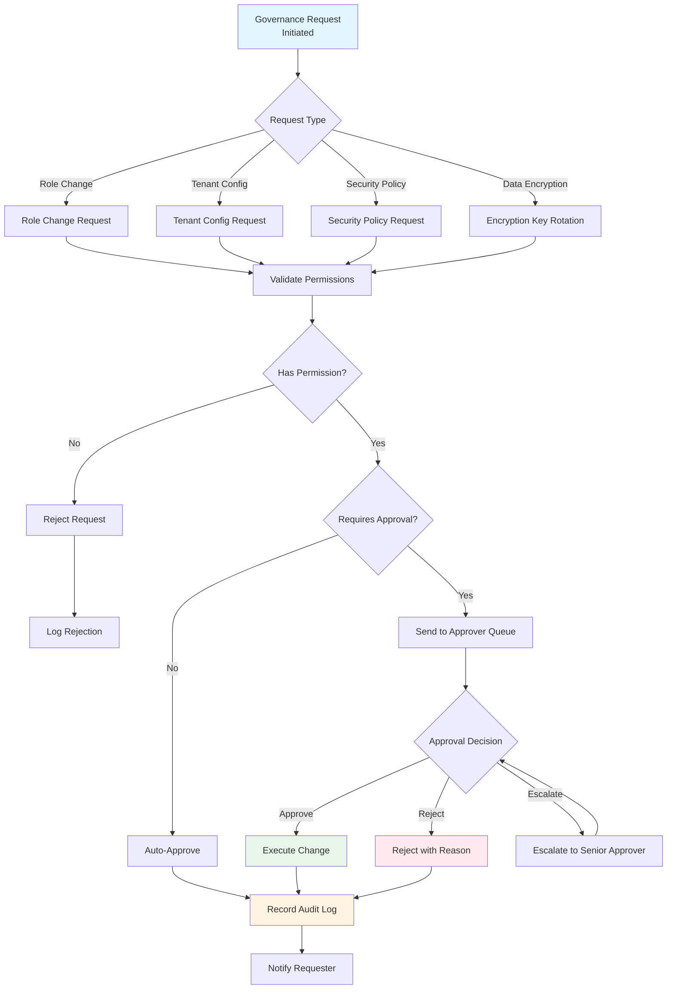

# Governance Implementation

> **Canonical Source**: [00-15_Governance_Implementation.md](../../source-archive/00_Foundation/guides/00-15_Governance_Implementation.md)
> **Audience**: Architects, Backend Engineers, Security Engineers
> **Business Requirements**: [Governance_Requirements.md](../../requirements/06_Governance_Licensing/Governance_Requirements.md)
> **Last Synced**: 2026-02-08

---

## 1. Overview

This document covers the technical implementation of the iGaming platform governance system, including multi-tenant architecture, RBAC permission system, audit logging, and data encryption strategy. All implementations follow SmartAdmin layered architecture patterns.

### 1.1 Governance Approval Workflow

The governance system enforces approval workflows for critical operations such as role changes, tenant configuration updates, and security policy modifications.



**Workflow Characteristics**:
- **Permission-gated**: All requests validated against RBAC permissions
- **Approval-based**: Critical operations require senior approver consent
- **Audit-enforced**: All approval decisions logged to compliance_audit_trail
- **Escalation support**: Approvers can escalate complex decisions

**Approval Matrix** (examples):
- Role Permission Change: Requires "governance:role:approve" permission
- Tenant Config Update: Requires "governance:tenant:approve" permission
- Encryption Key Rotation: Requires "governance:security:approve" permission

---

## 2. Multi-Tenant Architecture

**Status**: PLANNED (Phase 5+)
**Modules**: 10_Platform_Management, all business modules

### Implementation Goal

Design and implement tenant isolation using schema-based separation, data sharding, and tenant configuration management.

### Implementation Reading Order

| Order | Document | Section | Focus |
|-------|----------|---------|-------|
| 1 | [06-01 Multi-Tenant](../../source-archive/06_Platform_Governance/06-01_Multi_Tenant.md) | S2 Tenant Model | Schema isolation |
| 2 | [06-01 Multi-Tenant](../../source-archive/06_Platform_Governance/06-01_Multi_Tenant.md) | S3 Data Isolation | Sharding strategy |
| 3 | [02-05 Billing](../../source-archive/02_Finance_Center/02-05_Billing_and_Invoicing.md) | S2 Tenant Billing | Merchant management |

### SmartAdmin Layer Mapping

| Layer | Responsibility |
|-------|---------------|
| Controller | Tenant context extraction from request headers |
| Service | Business logic with tenant-scoped queries (Vavr Option) |
| Manager | @Transactional tenant data operations, @Cacheable tenant config |
| Dao | tenant_id filtering on all queries via MyBatis interceptor |

### Verification Checklist

- [ ] Tenant data is fully isolated
- [ ] Cross-tenant queries are blocked
- [ ] Tenant configurations load correctly
- [ ] Tenant billing is accurate

### Common Pitfalls

1. **Data Leakage**: Missing `tenant_id` filter allows cross-tenant access -- enforce via MyBatis interceptor
2. **Performance**: Multi-tenant queries not using shard keys -- mandate shard-key in all Dao queries
3. **Configuration Error**: Tenant-specific config not isolated -- use separate config stores with @Cacheable in Manager

---

## 3. RBAC Permission System

**Status**: PLANNED (Phase 5+)
**Modules**: 12_System_Security, 10_Platform_Management

### Implementation Goal

Build role definitions, permission matrices, and dynamic authorization integrated with Sa-Token.

### Implementation Reading Order

| Order | Document | Section | Focus |
|-------|----------|---------|-------|
| 1 | [06-02 RBAC](../../source-archive/06_Platform_Governance/06-02_RBAC_Permissions.md) | S2 Permission Model | RBAC design |
| 2 | [06-02 RBAC](../../source-archive/06_Platform_Governance/06-02_RBAC_Permissions.md) | S3 Role Management | Role inheritance |
| 3 | [06-02 RBAC](../../source-archive/06_Platform_Governance/06-02_RBAC_Permissions.md) | S4 Permission Verification | Sa-Token integration |

### SmartAdmin Layer Mapping

| Layer | Responsibility |
|-------|---------------|
| Controller | `@SaCheckPermission` annotation for endpoint authorization |
| Service | Permission logic, role resolution (Vavr Option for lookups) |
| Manager | @Cacheable permission cache, @Transactional role mutations |
| Dao | Role/permission CRUD via MyBatis Plus |

### Key Integration Points

- **Sa-Token**: Permission verification via `@SaCheckPermission` annotations
- **Redis Cache**: Permission data cached via Redisson, invalidated on role change
- **Manager Layer**: All permission cache operations use `@Cacheable` in Manager (never in Service)

### Verification Checklist

- [ ] Role permissions are correctly configured
- [ ] Permission verification is accurate
- [ ] Dynamic authorization takes effect
- [ ] Permission inheritance is correct

### Common Pitfalls

1. **Permission Explosion**: Too many permissions -- group into categories with hierarchical structure
2. **Circular Dependency**: Role inheritance cycles -- validate DAG structure on save
3. **Cache Inconsistency**: Permission changes not reflected -- implement cache eviction in Manager layer

---

## 4. Audit Log System

**Status**: PLANNED (Phase 5+)
**Modules**: 12_System_Security, all business modules

### Implementation Goal

Build operation logging, change tracking, and compliance reporting using AOP-based interception.

### Implementation Reading Order

| Order | Document | Section | Focus |
|-------|----------|---------|-------|
| 1 | [06-03 Audit Log](../../source-archive/06_Platform_Governance/06-03_Audit_Log.md) | S2 Log Model | Event definition |
| 2 | [06-03 Audit Log](../../source-archive/06_Platform_Governance/06-03_Audit_Log.md) | S3 AOP Interception | Automatic recording |
| 3 | [06-03 Audit Log](../../source-archive/06_Platform_Governance/06-03_Audit_Log.md) | S4 Query & Analysis | Audit reporting |

### SmartAdmin Layer Mapping

| Layer | Responsibility |
|-------|---------------|
| Controller | `@AuditLog` annotation marks auditable endpoints |
| AOP Aspect | Intercepts annotated methods, captures before/after state |
| Service | Audit query logic (Vavr Option for optional audit fields) |
| Manager | @Transactional async audit log writes |
| Dao | Append-only audit log table (no UPDATE/DELETE) |

### Technical Considerations

- **Async Writing**: Use `@Async` with virtual threads (Java 21) for non-blocking audit writes
- **Immutability**: Audit log table must be append-only -- no UPDATE or DELETE operations
- **Archival**: Implement scheduled archival via Snail-Job for logs older than retention period
- **Performance**: Asynchronous writing prevents audit overhead from impacting request latency

### Verification Checklist

- [ ] Critical operations are logged
- [ ] Before/after comparisons are accurate
- [ ] Audit logs are tamper-proof
- [ ] Compliance reports are complete

### Common Pitfalls

1. **Missing Critical Operations**: Not all sensitive operations covered -- maintain operation registry
2. **Performance Impact**: Synchronous writes degrade performance -- use async with virtual threads
3. **Storage Bloat**: Logs not archived -- schedule periodic archival with retention policies

---

## 5. Data Encryption Strategy

**Status**: PLANNED (Phase 5+)
**Modules**: 12_System_Security, all business modules

### Implementation Goal

Implement field-level encryption, KMS integration, and key rotation using MyBatis interceptors.

### Implementation Reading Order

| Order | Document | Section | Focus |
|-------|----------|---------|-------|
| 1 | [12-03 Data Security](../../source-archive/12_System_Security/12-03_Data_Security_Standard.md) | S2 Encryption Standard | AES-256-GCM |
| 2 | [12-03-01 Encryption](../../source-archive/12_System_Security/12-03-01_Encryption_Strategy.md) | S3 Field Encryption | MyBatis interceptor |
| 3 | [12-03-02 Blind Index](../../source-archive/12_System_Security/12-03-02_Blind_Index_Architecture.md) | S2 Blind Index | Searchable encryption |

### SmartAdmin Layer Mapping

| Layer | Responsibility |
|-------|---------------|
| Controller | No encryption awareness (transparent to API consumers) |
| Service | Business logic operates on plaintext (decrypted by interceptor) |
| Manager | @Cacheable for encrypted field cache, @Transactional for key rotation |
| Dao/Interceptor | MyBatis interceptor handles encrypt-on-write, decrypt-on-read |
| KMS | External key management service for key storage and rotation |

### Encryption Architecture

| Component | Technology | Purpose |
|-----------|-----------|---------|
| Field Encryption | AES-256-GCM | Encrypt PII and financial data at column level |
| Blind Index | HMAC-SHA256 | Enable searching on encrypted fields |
| Key Management | External KMS | Centralized key storage with access controls |
| Key Rotation | Scheduled task | Periodic re-encryption without downtime |
| MyBatis Interceptor | Custom plugin | Transparent encrypt/decrypt at persistence layer |

### Verification Checklist

- [ ] Sensitive fields are encrypted
- [ ] KMS integration is successful
- [ ] Key rotation mechanism works
- [ ] Encryption performance is acceptable

### Common Pitfalls

1. **Key Management Chaos**: Hardcoded keys or leakage -- use centralized KMS, never embed keys in code
2. **Weak Algorithms**: Outdated encryption -- enforce AES-256-GCM minimum
3. **Blind Index Collision**: Hash collisions cause query errors -- use high-entropy hash with sufficient output length

---

## 6. Reference Documents

| Area | Document |
|------|----------|
| Multi-Tenant | [06-01 Multi-Tenant](../../source-archive/06_Platform_Governance/06-01_Multi_Tenant.md) |
| RBAC | [06-02 RBAC Permissions](../../source-archive/06_Platform_Governance/06-02_RBAC_Permissions.md) |
| Audit Log | [06-03 Audit Log](../../source-archive/06_Platform_Governance/06-03_Audit_Log.md) |
| Data Security | [12-03 Data Security Standard](../../source-archive/12_System_Security/12-03_Data_Security_Standard.md) |
| Encryption | [12-03-01 Encryption Strategy](../../source-archive/12_System_Security/12-03-01_Encryption_Strategy.md) |
| Blind Index | [12-03-02 Blind Index Architecture](../../source-archive/12_System_Security/12-03-02_Blind_Index_Architecture.md) |

---

## 7. Database Schema

### 7.1 Governance Policies Table

The `governance_policies` table stores approval workflow configurations and permission requirements for governance operations.

```sql
CREATE TABLE governance_policies (
    policy_id BIGSERIAL PRIMARY KEY,
    policy_name VARCHAR(100) NOT NULL UNIQUE,
    policy_category VARCHAR(50) NOT NULL CHECK (policy_category IN ('ROLE_CHANGE', 'TENANT_CONFIG', 'SECURITY_POLICY', 'ENCRYPTION_KEY')),
    requires_approval BOOLEAN NOT NULL DEFAULT true,
    required_permission VARCHAR(100) NOT NULL, -- Sa-Token permission code (e.g., governance:role:approve)
    approver_role_ids BIGINT[] NOT NULL, -- Array of role IDs authorized to approve
    escalation_role_id BIGINT, -- Role ID for escalation (nullable)
    approval_threshold INT NOT NULL DEFAULT 1, -- Number of approvals required (1 for single, >1 for multi-approval)
    auto_approve_conditions JSONB, -- JSON conditions for auto-approval (e.g., amount < $1000)
    description TEXT,
    is_active BOOLEAN NOT NULL DEFAULT true,
    created_at TIMESTAMP NOT NULL DEFAULT CURRENT_TIMESTAMP,
    updated_at TIMESTAMP NOT NULL DEFAULT CURRENT_TIMESTAMP,
    created_by BIGINT NOT NULL,
    updated_by BIGINT NOT NULL,
    deleted BOOLEAN NOT NULL DEFAULT false,
    CONSTRAINT fk_governance_policies_creator FOREIGN KEY (created_by) REFERENCES admin_users(user_id)
);

CREATE INDEX idx_governance_policies_policy_category ON governance_policies(policy_category);
CREATE INDEX idx_governance_policies_is_active ON governance_policies(is_active) WHERE deleted = false;
CREATE INDEX idx_governance_policies_created_at ON governance_policies(created_at DESC);

COMMENT ON TABLE governance_policies IS 'Governance approval workflow policies with permission-gated access control';
COMMENT ON COLUMN governance_policies.approver_role_ids IS 'Array of role IDs authorized to approve requests under this policy';
COMMENT ON COLUMN governance_policies.approval_threshold IS 'Number of approvals required (1=single approver, 2+=multi-approval)';
COMMENT ON COLUMN governance_policies.auto_approve_conditions IS 'JSON conditions for automatic approval without human review (e.g., {"amount_less_than": 1000})';
```

### 7.2 Compliance Audit Trail Table

The `compliance_audit_trail` table stores all governance approval decisions and actions for regulatory compliance.

```sql
CREATE TABLE compliance_audit_trail (
    audit_id BIGSERIAL PRIMARY KEY,
    audit_no VARCHAR(50) NOT NULL UNIQUE, -- Human-readable audit number (e.g., AUDIT-20260210-123456)
    policy_id BIGINT REFERENCES governance_policies(policy_id),
    request_type VARCHAR(50) NOT NULL CHECK (request_type IN ('ROLE_CHANGE', 'TENANT_CONFIG', 'SECURITY_POLICY', 'ENCRYPTION_KEY', 'USER_ACCESS', 'DATA_EXPORT')),
    request_details JSONB NOT NULL, -- JSON payload of the request (before state)
    requester_id BIGINT NOT NULL REFERENCES admin_users(user_id),
    requester_ip VARCHAR(45) NOT NULL, -- IPv4 or IPv6
    approval_status VARCHAR(30) NOT NULL CHECK (approval_status IN ('PENDING', 'APPROVED', 'REJECTED', 'ESCALATED', 'AUTO_APPROVED', 'CANCELLED')),
    approver_id BIGINT REFERENCES admin_users(user_id), -- Nullable if not yet reviewed
    approval_decision TEXT, -- Approval reason or rejection reason
    approved_at TIMESTAMP, -- Nullable until approved/rejected
    escalation_reason TEXT, -- Nullable unless escalated
    result_details JSONB, -- JSON payload of the action result (after state)
    execution_status VARCHAR(30) CHECK (execution_status IN ('NOT_STARTED', 'IN_PROGRESS', 'SUCCESS', 'FAILED', 'ROLLED_BACK')),
    execution_error TEXT, -- Nullable unless execution_status = FAILED
    created_at TIMESTAMP NOT NULL DEFAULT CURRENT_TIMESTAMP,
    updated_at TIMESTAMP NOT NULL DEFAULT CURRENT_TIMESTAMP,
    deleted BOOLEAN NOT NULL DEFAULT false,
    CONSTRAINT fk_compliance_audit_trail_requester FOREIGN KEY (requester_id) REFERENCES admin_users(user_id),
    CONSTRAINT fk_compliance_audit_trail_approver FOREIGN KEY (approver_id) REFERENCES admin_users(user_id)
);

CREATE INDEX idx_compliance_audit_trail_policy_id ON compliance_audit_trail(policy_id);
CREATE INDEX idx_compliance_audit_trail_request_type ON compliance_audit_trail(request_type);
CREATE INDEX idx_compliance_audit_trail_approval_status ON compliance_audit_trail(approval_status);
CREATE INDEX idx_compliance_audit_trail_requester_id ON compliance_audit_trail(requester_id);
CREATE INDEX idx_compliance_audit_trail_approver_id ON compliance_audit_trail(approver_id) WHERE approver_id IS NOT NULL;
CREATE INDEX idx_compliance_audit_trail_created_at ON compliance_audit_trail(created_at DESC);
CREATE INDEX idx_compliance_audit_trail_approved_at ON compliance_audit_trail(approved_at DESC) WHERE approved_at IS NOT NULL;

COMMENT ON TABLE compliance_audit_trail IS 'Immutable audit trail for all governance approval decisions and execution results (append-only, no DELETE)';
COMMENT ON COLUMN compliance_audit_trail.request_details IS 'JSON snapshot of the request payload (before state) for change tracking';
COMMENT ON COLUMN compliance_audit_trail.result_details IS 'JSON snapshot of the action result (after state) for compliance verification';
COMMENT ON COLUMN compliance_audit_trail.execution_status IS 'Status of the approved action execution (NOT_STARTED → IN_PROGRESS → SUCCESS/FAILED/ROLLED_BACK)';
```

### 7.3 Example Queries

**Query pending governance requests**:
```sql
SELECT
    cat.audit_id,
    cat.audit_no,
    cat.request_type,
    cat.request_details,
    au_req.username AS requester_name,
    cat.requester_ip,
    cat.created_at,
    gp.policy_name,
    gp.required_permission,
    EXTRACT(EPOCH FROM (NOW() - cat.created_at)) / 3600 AS pending_hours
FROM compliance_audit_trail cat
JOIN admin_users au_req ON cat.requester_id = au_req.user_id
LEFT JOIN governance_policies gp ON cat.policy_id = gp.policy_id
WHERE cat.approval_status = 'PENDING'
  AND cat.deleted = false
ORDER BY cat.created_at ASC;
```

**Query approval decisions by approver**:
```sql
SELECT
    au_app.username AS approver_name,
    cat.request_type,
    COUNT(*) FILTER (WHERE cat.approval_status = 'APPROVED') AS approved_count,
    COUNT(*) FILTER (WHERE cat.approval_status = 'REJECTED') AS rejected_count,
    COUNT(*) FILTER (WHERE cat.approval_status = 'ESCALATED') AS escalated_count,
    ROUND(AVG(EXTRACT(EPOCH FROM (cat.approved_at - cat.created_at)) / 3600), 2) AS avg_approval_hours
FROM compliance_audit_trail cat
JOIN admin_users au_app ON cat.approver_id = au_app.user_id
WHERE cat.approved_at > NOW() - INTERVAL '30 days'
  AND cat.approval_status IN ('APPROVED', 'REJECTED', 'ESCALATED')
GROUP BY au_app.username, cat.request_type
ORDER BY approved_count DESC;
```

**Query compliance report for regulation audit**:
```sql
SELECT
    cat.audit_no,
    cat.request_type,
    cat.request_details->>'description' AS description,
    au_req.username AS requester,
    au_app.username AS approver,
    cat.approval_status,
    cat.approval_decision,
    cat.execution_status,
    cat.created_at AS request_time,
    cat.approved_at AS decision_time,
    EXTRACT(EPOCH FROM (cat.approved_at - cat.created_at)) / 3600 AS decision_duration_hours
FROM compliance_audit_trail cat
JOIN admin_users au_req ON cat.requester_id = au_req.user_id
LEFT JOIN admin_users au_app ON cat.approver_id = au_app.user_id
WHERE cat.created_at BETWEEN '2026-01-01' AND '2026-12-31'
  AND cat.request_type IN ('SECURITY_POLICY', 'ENCRYPTION_KEY', 'DATA_EXPORT')
ORDER BY cat.created_at DESC;
```

---

**Document Version**: 1.0.0
**Last Updated**: 2026-02-08
**Source Version**: 4.0.0
