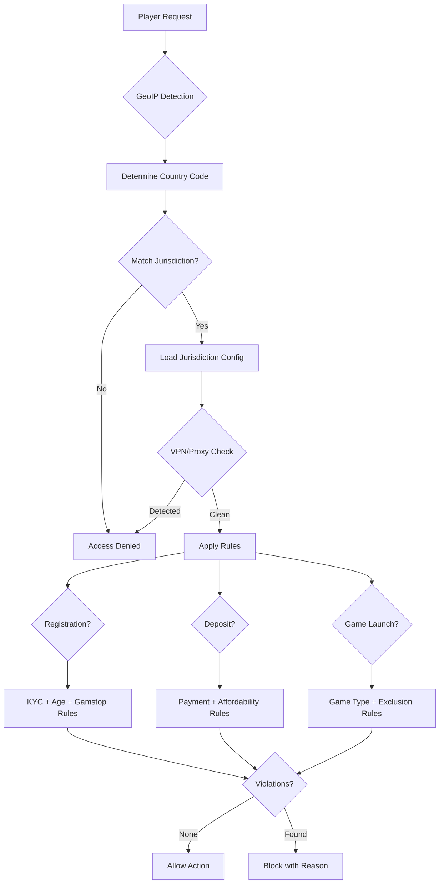

# Jurisdiction Routing Architecture (牌照路由技術架構)

> **Canonical Source**: [06-07_Multi_Jurisdiction_Framework.md](../../source-archive/06_Platform_Governance/06-07_Multi_Jurisdiction_Framework.md)
> **Audience**: Architects, Backend Developers
> **Business Requirements**: [Jurisdiction_Framework_Requirements.md](../../requirements/05_Risk_Compliance/Jurisdiction_Framework_Requirements.md)
> **Last Synced**: 2026-02-08

---

## 1. Overview

This document describes the technical architecture of the Multi-Jurisdiction routing system, including the GeoIP detection layer, licence routing service, rule engine integration, geo-fencing enforcement, and the compliance dashboard frontend.

---

## 2. System Architecture

```
+-------------------------------------------------------------------+
|                 Multi-Jurisdiction Gateway                          |
+-------------------------------------------------------------------+
|                                                                     |
|  +-------------+    +-------------+    +-------------+              |
|  | GeoIP       |    | License     |    | Rule        |              |
|  | Detection   |--->| Router      |--->| Engine      |              |
|  +-------------+    +-------------+    +-------------+              |
|         |                  |                  |                      |
|         v                  v                  v                      |
|  +--------------------------------------------------------------+  |
|  |                  Jurisdiction Config Store                     |  |
|  |  +---------+  +---------+  +---------+  +---------+           |  |
|  |  | UKGC    |  | MGA     |  | PAGCOR  |  | Brazil  |           |  |
|  |  | Rules   |  | Rules   |  | Rules   |  | Rules   |           |  |
|  |  +---------+  +---------+  +---------+  +---------+           |  |
|  +--------------------------------------------------------------+  |
|                                                                     |
+-------------------------------------------------------------------+
```

---

## 3. Data Model

### 3.1 Jurisdiction Configuration Entity

```java
@Data
@Entity
@Table(name = "t_jurisdiction_config")
public class JurisdictionConfig {

    @Id
    private String jurisdictionCode;  // UKGC, MGA, PAGCOR, etc.

    private String displayName;
    private String regulatorName;
    private String website;

    // Geo-fencing
    @Type(type = "json")
    private List<String> allowedCountries;

    @Type(type = "json")
    private List<String> blockedCountries;

    // KYC Requirements
    private Boolean immediateKycRequired;
    private Integer kycGracePeriodHours;
    private Boolean enhancedDueDiligenceRequired;

    // Responsible Gambling
    private Boolean selfExclusionRequired;
    private Boolean depositLimitsRequired;
    private Boolean mandatoryCoolingOff;
    private Integer realityCheckMinutes;
    private Boolean affordabilityCheckRequired;

    // Game Restrictions
    @Type(type = "json")
    private List<String> allowedGameTypes;

    @Type(type = "json")
    private List<String> blockedGameTypes;

    private BigDecimal maxBetAmount;
    private BigDecimal maxWinAmount;

    // Payment Restrictions
    private Boolean creditCardsAllowed;
    private Boolean cryptoAllowed;

    @Type(type = "json")
    private List<String> allowedPaymentMethods;

    // Taxation
    private BigDecimal ggrTaxRate;
    private Boolean withholdingTaxRequired;
    private BigDecimal withholdingTaxRate;

    // Reporting
    private Integer reportingFrequencyDays;

    @Type(type = "json")
    private ReportingConfig reportingConfig;

    // External Systems
    private String exclusionDatabaseUrl;  // Gamstop, etc.

    private Boolean active;
    private LocalDateTime effectiveFrom;
    private LocalDateTime effectiveTo;
}
```

---

## 4. Licence Routing Service

```java
@Service
@RequiredArgsConstructor
@Slf4j
public class JurisdictionRouterService {

    private final JurisdictionConfigDao configDao;
    private final GeoIPService geoIPService;
    private final CacheManager cacheManager;

    /**
     * Resolve jurisdiction from player IP address
     */
    public JurisdictionConfig resolveJurisdiction(String clientIp) {
        // 1. GeoIP lookup
        GeoIPResult geoResult = geoIPService.lookup(clientIp);
        String countryCode = geoResult.getCountryCode();

        // 2. Find matching licence
        List<JurisdictionConfig> configs = configDao.findActiveConfigs();

        for (JurisdictionConfig config : configs) {
            if (isCountryAllowed(countryCode, config)) {
                return config;
            }
        }

        // 3. Fall back to default or reject
        JurisdictionConfig defaultConfig = configDao.findDefault();
        if (defaultConfig != null
                && isCountryAllowed(countryCode, defaultConfig)) {
            return defaultConfig;
        }

        throw new JurisdictionBlockedException(countryCode);
    }

    /**
     * Get jurisdiction config for a registered player (cached)
     */
    @Cacheable(value = "jurisdiction", key = "#playerId")
    public JurisdictionConfig getPlayerJurisdiction(Long playerId) {
        Player player = playerDao.selectById(playerId);
        return configDao.findByCode(player.getJurisdictionCode());
    }

    /**
     * Check if a feature is enabled under the player's jurisdiction
     */
    public boolean isFeatureEnabled(Long playerId, String featureName) {
        JurisdictionConfig config = getPlayerJurisdiction(playerId);
        return switch (featureName) {
            case "CREDIT_CARD_DEPOSIT" -> config.getCreditCardsAllowed();
            case "CRYPTO_DEPOSIT" -> config.getCryptoAllowed();
            case "LIVE_CASINO" ->
                config.getAllowedGameTypes().contains("LIVE_CASINO");
            case "SPORTS_BETTING" ->
                config.getAllowedGameTypes().contains("SPORTS");
            default -> true;
        };
    }

    /**
     * Build player limits from jurisdiction config
     */
    public PlayerLimitsConfig getPlayerLimits(Long playerId) {
        JurisdictionConfig config = getPlayerJurisdiction(playerId);
        return PlayerLimitsConfig.builder()
            .maxBetAmount(config.getMaxBetAmount())
            .maxWinAmount(config.getMaxWinAmount())
            .realityCheckMinutes(config.getRealityCheckMinutes())
            .depositLimitsRequired(config.getDepositLimitsRequired())
            .affordabilityCheckRequired(
                config.getAffordabilityCheckRequired())
            .build();
    }

    private boolean isCountryAllowed(
            String countryCode, JurisdictionConfig config) {
        if (config.getBlockedCountries().contains(countryCode)) {
            return false;
        }
        if (!config.getAllowedCountries().isEmpty()) {
            return config.getAllowedCountries().contains(countryCode);
        }
        return true;
    }
}
```

---

## 5. Jurisdiction Rule Engine

```java
@Service
@RequiredArgsConstructor
public class JurisdictionRuleEngine {

    private final JurisdictionRouterService routerService;
    private final SelfExclusionService selfExclusionService;
    private final DepositLimitService depositLimitService;
    private final AffordabilityService affordabilityService;
    private final GamstopClient gamstopClient;

    /**
     * Execute jurisdiction-specific rules at registration
     */
    @Transactional(rollbackFor = Throwable.class)
    public RegistrationRuleResult executeRegistrationRules(
            PlayerRegistrationForm form,
            JurisdictionConfig config) {

        List<RuleViolation> violations = new ArrayList<>();

        // UKGC: Immediate KYC
        if (config.getImmediateKycRequired()) {
            if (!form.isKycVerified()) {
                violations.add(RuleViolation.of("UKGC_IMMEDIATE_KYC",
                    "UK licence requires identity verification "
                    + "before deposit"));
            }
        }

        // UKGC: Gamstop check
        if ("UKGC".equals(config.getJurisdictionCode())) {
            GamstopCheckResult gamstopResult =
                gamstopClient.checkExclusion(
                    form.getFirstName(),
                    form.getLastName(),
                    form.getDateOfBirth(),
                    form.getPostcode()
                );
            if (gamstopResult.isExcluded()) {
                violations.add(RuleViolation.of("GAMSTOP_EXCLUDED",
                    "Player is on the Gamstop exclusion list"));
            }
        }

        // Age verification
        int age = Period.between(
            form.getDateOfBirth(), LocalDate.now()).getYears();
        int minAge = getMinimumAge(config);
        if (age < minAge) {
            violations.add(RuleViolation.of("UNDERAGE",
                "Must be at least " + minAge + " years old"));
        }

        return RegistrationRuleResult.builder()
            .passed(violations.isEmpty())
            .violations(violations)
            .build();
    }

    /**
     * Execute jurisdiction-specific rules at deposit
     */
    public DepositRuleResult executeDepositRules(
            Long playerId,
            DepositForm form,
            JurisdictionConfig config) {

        List<RuleViolation> violations = new ArrayList<>();

        // Credit card check
        if ("CREDIT_CARD".equals(form.getPaymentMethod())
                && !config.getCreditCardsAllowed()) {
            violations.add(RuleViolation.of(
                "CREDIT_CARD_NOT_ALLOWED",
                "Credit card deposits not permitted "
                + "under this licence"));
        }

        // Affordability check (UK)
        if (config.getAffordabilityCheckRequired()) {
            Option<AssessmentRequirement> assessmentOpt =
                affordabilityService
                    .checkAssessmentRequired(playerId);

            if (assessmentOpt.isDefined()) {
                violations.add(RuleViolation.of(
                    "AFFORDABILITY_CHECK_REQUIRED",
                    "Financial assessment required "
                    + "before continuing deposit"));
            }
        }

        return DepositRuleResult.builder()
            .passed(violations.isEmpty())
            .violations(violations)
            .build();
    }

    /**
     * Execute jurisdiction-specific rules at game launch
     */
    public GameLaunchRuleResult executeGameLaunchRules(
            Long playerId,
            String gameId,
            JurisdictionConfig config) {

        List<RuleViolation> violations = new ArrayList<>();

        // Game type check
        String gameType = gameService.getGameType(gameId);
        if (config.getBlockedGameTypes().contains(gameType)) {
            violations.add(RuleViolation.of("GAME_TYPE_BLOCKED",
                "This game type is not available "
                + "in your region"));
        }

        // Self-exclusion check
        if (selfExclusionService.isExcluded(playerId)) {
            violations.add(RuleViolation.of("SELF_EXCLUDED",
                "Self-exclusion is active; "
                + "gaming is not permitted"));
        }

        // Cooling-off check
        if (coolingOffService.isInCoolingOff(playerId)) {
            violations.add(RuleViolation.of("COOLING_OFF_ACTIVE",
                "Cooling-off period is active; "
                + "gaming is not permitted"));
        }

        return GameLaunchRuleResult.builder()
            .passed(violations.isEmpty())
            .violations(violations)
            .gameConfig(buildGameConfig(config))
            .build();
    }

    private int getMinimumAge(JurisdictionConfig config) {
        return switch (config.getJurisdictionCode()) {
            case "UKGC", "MGA" -> 18;
            case "PAGCOR" -> 21;
            default -> 18;
        };
    }
}
```

---

## 6. Geo-Fencing Service

```java
@Service
@RequiredArgsConstructor
@Slf4j
public class GeoFenceService {

    private final GeoIPService geoIPService;
    private final JurisdictionConfigDao configDao;

    /**
     * Validate IP against jurisdiction geo-fence
     */
    public GeoFenceResult validateAccess(
            String clientIp, String jurisdictionCode) {
        GeoIPResult geoResult = geoIPService.lookup(clientIp);
        JurisdictionConfig config =
            configDao.findByCode(jurisdictionCode);

        // VPN/Proxy detection
        if (geoResult.isVpn() || geoResult.isProxy()) {
            return GeoFenceResult.blocked("PROXY_DETECTED",
                "VPN/Proxy detected; please disable and retry");
        }

        // Country check
        String countryCode = geoResult.getCountryCode();
        if (config.getBlockedCountries().contains(countryCode)) {
            return GeoFenceResult.blocked("COUNTRY_BLOCKED",
                "Service not available in your region");
        }

        // State/Province check (e.g., US states)
        if ("US".equals(countryCode)) {
            String stateCode = geoResult.getStateCode();
            if (!isStateAllowed(stateCode, config)) {
                return GeoFenceResult.blocked("STATE_BLOCKED",
                    "Service not available in your state");
            }
        }

        return GeoFenceResult.allowed(geoResult);
    }

    /**
     * Periodic validation of active player locations (every 5 min)
     */
    @Scheduled(fixedRate = 300000)
    public void validateActivePlayerLocations() {
        List<ActiveSession> sessions =
            sessionService.getActiveSessions();

        for (ActiveSession session : sessions) {
            String currentIp = session.getLastKnownIp();
            String registeredJurisdiction =
                session.getJurisdictionCode();

            GeoFenceResult result = validateAccess(
                currentIp, registeredJurisdiction);

            if (!result.isAllowed()) {
                log.warn(
                    "Player location violation: "
                    + "playerId={}, ip={}, reason={}",
                    session.getPlayerId(),
                    currentIp,
                    result.getReason());

                // Terminate session
                sessionService.terminateSession(
                    session.getPlayerId(),
                    "GEO_FENCE_VIOLATION: "
                    + result.getReason());

                // Notify player
                notificationService.sendGeoFenceAlert(
                    session.getPlayerId());
            }
        }
    }
}
```

---

## 7. Compliance Dashboard (Frontend)

```vue
<template>
  <div class="compliance-dashboard">
    <a-row :gutter="16">
      <!-- Licence Status Cards -->
      <a-col :span="6" v-for="license in licenses" :key="license.code">
        <a-card :class="getCardClass(license)">
          <template #title>
            <div class="license-header">
              
              <span>{{ license.displayName }}</span>
            </div>
          </template>

          <a-descriptions :column="1" size="small">
            <a-descriptions-item label="Active Players">
              {{ license.activePlayers.toLocaleString() }}
            </a-descriptions-item>
            <a-descriptions-item label="Compliance Status">
              <a-tag :color="getStatusColor(
                  license.complianceStatus)">
                {{ license.complianceStatus }}
              </a-tag>
            </a-descriptions-item>
            <a-descriptions-item label="Next Report Due">
              {{ formatDate(license.nextReportDue) }}
            </a-descriptions-item>
          </a-descriptions>

          <template #actions>
            <a-button type="link"
                       @click="viewDetails(license)">
              View Details
            </a-button>
          </template>
        </a-card>
      </a-col>
    </a-row>

    <!-- Compliance Alerts -->
    <a-card title="Compliance Alerts" class="mt-4">
      <a-list :data-source="alerts" :loading="loading">
        <template #renderItem="{ item }">
          <a-list-item>
            <a-list-item-meta>
              <template #title>
                <a-tag :color="item.severity === 'CRITICAL'
                    ? 'red' : 'orange'">
                  {{ item.jurisdiction }}
                </a-tag>
                {{ item.title }}
              </template>
              <template #description>
                {{ item.description }}
                | {{ formatTime(item.createdAt) }}
              </template>
            </a-list-item-meta>
            <template #actions>
              <a-button type="link"
                         @click="handleAlert(item)">
                Handle
              </a-button>
            </template>
          </a-list-item>
        </template>
      </a-list>
    </a-card>
  </div>
</template>
```

---

## 8. Integration Flow



---

## 9. Database Schema

```sql
-- Jurisdiction configuration table
CREATE TABLE t_jurisdiction_config (
    id              BIGSERIAL PRIMARY KEY,
    jurisdiction_code VARCHAR(20) NOT NULL UNIQUE,
    display_name    VARCHAR(100) NOT NULL,
    regulator_name  VARCHAR(200),
    website         VARCHAR(500),
    allowed_countries JSONB NOT NULL DEFAULT '[]',
    blocked_countries JSONB NOT NULL DEFAULT '[]',
    immediate_kyc_required BOOLEAN NOT NULL DEFAULT FALSE,
    kyc_grace_period_hours INTEGER,
    enhanced_due_diligence_required BOOLEAN NOT NULL DEFAULT FALSE,
    self_exclusion_required BOOLEAN NOT NULL DEFAULT TRUE,
    deposit_limits_required BOOLEAN NOT NULL DEFAULT TRUE,
    mandatory_cooling_off BOOLEAN NOT NULL DEFAULT FALSE,
    reality_check_minutes INTEGER,
    affordability_check_required BOOLEAN NOT NULL DEFAULT FALSE,
    allowed_game_types JSONB NOT NULL DEFAULT '[]',
    blocked_game_types JSONB NOT NULL DEFAULT '[]',
    max_bet_amount DECIMAL(15, 2),
    max_win_amount DECIMAL(15, 2),
    credit_cards_allowed BOOLEAN NOT NULL DEFAULT TRUE,
    crypto_allowed BOOLEAN NOT NULL DEFAULT FALSE,
    allowed_payment_methods JSONB NOT NULL DEFAULT '[]',
    ggr_tax_rate DECIMAL(5, 4),
    withholding_tax_required BOOLEAN NOT NULL DEFAULT FALSE,
    withholding_tax_rate DECIMAL(5, 4),
    reporting_frequency_days INTEGER NOT NULL DEFAULT 30,
    reporting_config JSONB,
    exclusion_database_url VARCHAR(500),
    active BOOLEAN NOT NULL DEFAULT TRUE,
    effective_from TIMESTAMP,
    effective_to TIMESTAMP,
    created_at TIMESTAMP NOT NULL DEFAULT NOW(),
    updated_at TIMESTAMP NOT NULL DEFAULT NOW()
);

CREATE INDEX idx_jurisdiction_active ON t_jurisdiction_config(active, jurisdiction_code);

-- GeoIP lookup cache
CREATE TABLE t_geoip_cache (
    id              BIGSERIAL PRIMARY KEY,
    ip_address      VARCHAR(45) NOT NULL,
    country_code    VARCHAR(2) NOT NULL,
    state_code      VARCHAR(10),
    city            VARCHAR(100),
    is_vpn          BOOLEAN NOT NULL DEFAULT FALSE,
    is_proxy        BOOLEAN NOT NULL DEFAULT FALSE,
    lookup_provider VARCHAR(50) NOT NULL,
    cached_at       TIMESTAMP NOT NULL DEFAULT NOW(),
    expires_at      TIMESTAMP NOT NULL,
    CONSTRAINT uk_geoip_ip UNIQUE (ip_address)
);

CREATE INDEX idx_geoip_expires ON t_geoip_cache(expires_at);

-- Geo-fence violation log
CREATE TABLE t_geofence_violation_log (
    id              BIGSERIAL PRIMARY KEY,
    player_id       BIGINT NOT NULL,
    session_id      VARCHAR(100),
    ip_address      VARCHAR(45) NOT NULL,
    detected_country VARCHAR(2) NOT NULL,
    registered_jurisdiction VARCHAR(20) NOT NULL,
    violation_reason VARCHAR(50) NOT NULL,
    action_taken    VARCHAR(50) NOT NULL,
    created_at      TIMESTAMP NOT NULL DEFAULT NOW()
);

CREATE INDEX idx_geofence_player ON t_geofence_violation_log(player_id, created_at DESC);

-- Jurisdiction rule violation log
CREATE TABLE t_jurisdiction_rule_violation (
    id              BIGSERIAL PRIMARY KEY,
    player_id       BIGINT NOT NULL,
    jurisdiction_code VARCHAR(20) NOT NULL,
    rule_type       VARCHAR(50) NOT NULL,
    rule_code       VARCHAR(50) NOT NULL,
    violation_message TEXT NOT NULL,
    context         JSONB,
    created_at      TIMESTAMP NOT NULL DEFAULT NOW()
);

CREATE INDEX idx_rule_violation ON t_jurisdiction_rule_violation(jurisdiction_code, rule_type, created_at DESC);

---

## 10. Cross-References

| Topic | Document |
|-------|----------|
| Business Requirements | requirements/05_Risk_Compliance/Jurisdiction_Framework_Requirements.md |
| UKGC Compliance | source/06_Platform_Governance/06-08_UKGC_Compliance.md |
| MGA Compliance | source/06_Platform_Governance/06-09_MGA_Compliance.md |
| Brazil SPA Compliance | source/06_Platform_Governance/06-10_Brazil_SPA_Compliance.md |
| Self-Exclusion | source/15_Responsible_Gambling/15-01_Self_Exclusion.md |
| Multi-Tenant Architecture | architecture/06_Platform_Core/Multi_Tenant_Architecture.md |
