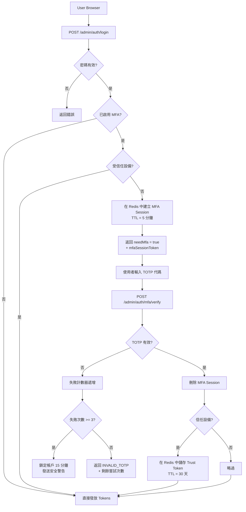
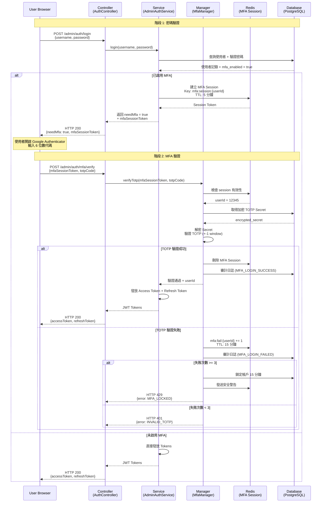
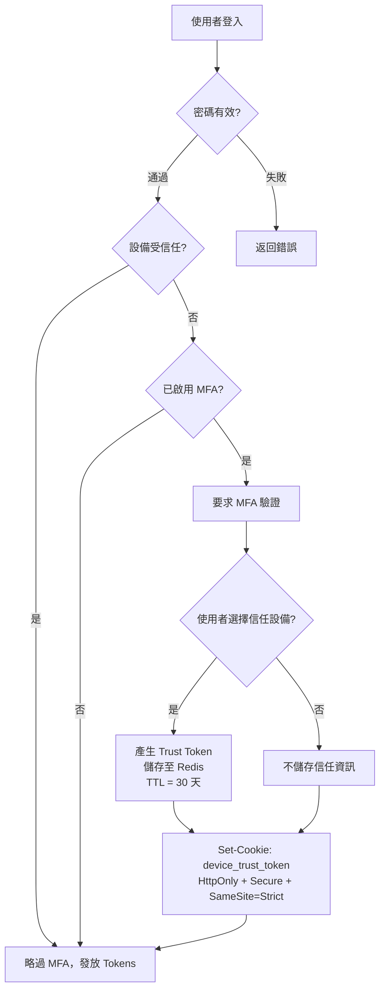
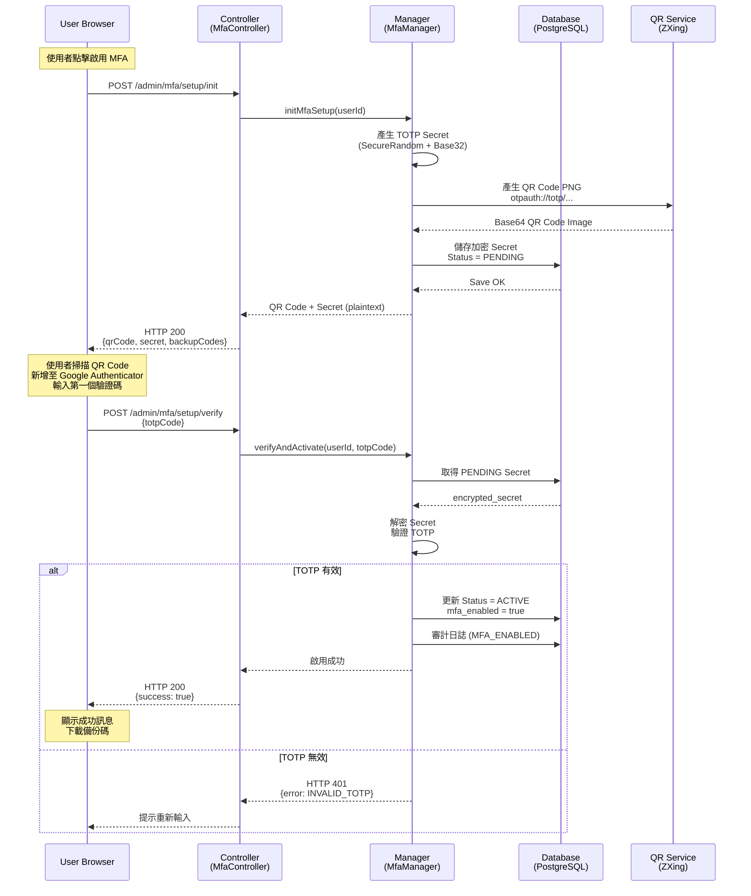

# MFA 登入與恢復技術實現（MFA Login and Recovery Implementation）

> **規範來源**: [06-06-03_Recovery_Flow.md](../../source-archive/06_Platform_Governance/06-06-03_Recovery_Flow.md)
> **目標讀者**: Architects, Backend Developers, DevOps
> **業務需求**: [MFA_Recovery_Requirements.md](../../requirements/06_Governance_Licensing/MFA_Recovery_Requirements.md)
> **最後同步**: 2026-02-08

---

## 1. 架構概覽（Architecture Overview）



---

## 2. 兩階段登入序列（Two-Phase Login Sequence）



---

## 3. API 端點規格（API Endpoint Specifications）

### 3.1 階段 1: 密碼登入（Phase 1: Password Login）

```http
POST /admin/auth/login
Content-Type: application/json

{
  "username": "admin@smartadmin.com",
  "password": "SecurePassword123!",
  "deviceFingerprint": "e3b0c44298fc1c149afbf4c8996fb92427ae41e4649b934ca495991b7852b855"
}
```

**回應（已啟用 MFA）**:

```json
{
  "code": 200,
  "msg": "Password verified. MFA required.",
  "data": {
    "needMfa": true,
    "mfaSessionToken": "mfa_sess_abc123xyz...",
    "expiresAt": "2026-02-05T10:05:00Z",
    "availableMethods": ["totp", "sms", "backup_code"]
  }
}
```

**回應（未啟用 MFA）**:

```json
{
  "code": 200,
  "msg": "Login successful.",
  "data": {
    "needMfa": false,
    "accessToken": "eyJhbGciOiJIUzI1NiIsInR5cCI6IkpXVCJ9...",
    "refreshToken": "rt_abc123xyz...",
    "user": {
      "userId": 12345,
      "username": "admin@smartadmin.com",
      "roles": ["SUPER_ADMIN"]
    }
  }
}
```

### 3.2 階段 2: MFA 驗證（Phase 2: MFA Verification）

```http
POST /admin/auth/mfa/verify
Content-Type: application/json

{
  "mfaSessionToken": "mfa_sess_abc123xyz...",
  "totpCode": "123456",
  "trustDevice": true
}
```

**回應（成功）**:

```json
{
  "code": 200,
  "msg": "MFA verification successful.",
  "data": {
    "accessToken": "eyJhbGciOiJIUzI1NiIsInR5cCI6IkpXVCJ9...",
    "refreshToken": "rt_abc123xyz...",
    "user": {
      "userId": 12345,
      "username": "admin@smartadmin.com",
      "roles": ["SUPER_ADMIN"]
    }
  }
}
```

**回應（失敗）**:

```json
{
  "code": 401,
  "msg": "Invalid TOTP code.",
  "data": {
    "remainingAttempts": 2,
    "lockoutDuration": null
  }
}
```

**回應（已鎖定）**:

```json
{
  "code": 429,
  "msg": "Too many failed MFA attempts. Account locked.",
  "data": {
    "remainingAttempts": 0,
    "lockoutDuration": 900,
    "unlockAt": "2026-02-05T10:15:00Z"
  }
}
```

### 3.3 錯誤代碼參考（Error Code Reference）

| 錯誤代碼 | HTTP 狀態 | 描述 | 客戶端操作 |
|---------|----------|------|----------|
| `INVALID_MFA_SESSION` | 401 | Session token 已過期或遺失 | 從階段 1 重新開始 |
| `INVALID_TOTP` | 401 | TOTP 代碼不正確 | 顯示剩餘嘗試次數；提示重新輸入 |
| `MFA_LOCKED` | 429 | 3 次失敗；帳戶已鎖定 | 顯示 15 分鐘倒數計時 |
| `MFA_NOT_ENABLED` | 400 | 呼叫 MFA 驗證但使用者未啟用 MFA | 引導至 MFA 設定 |
| `TIME_SYNC_ERROR` | 500 | 伺服器 NTP 不同步 | 觸發維運警報；向使用者顯示通用錯誤 |

---

## 4. 受信任設備實現（Trusted Device Implementation）

### 4.1 流程圖（Flow Diagram）



### 4.2 Redis 資料結構（Redis Data Structure）

```
Key:   trusted_device:{userId}:{deviceFingerprint}
Value: {
  "userId": 12345,
  "deviceFingerprint": "e3b0c442...",
  "trustedAt": "2026-02-05T10:00:00Z",
  "expiresAt": "2026-03-07T10:00:00Z",
  "ipAddress": "203.0.113.42",
  "userAgent": "Mozilla/5.0..."
}
TTL:   2592000 seconds (30 天)
```

### 4.3 設備指紋產生（客戶端）（Device Fingerprint Generation - Client-Side）

```javascript
import FingerprintJS from '@fingerprintjs/fingerprintjs';

async function getDeviceFingerprint() {
  const fp = await FingerprintJS.load();
  const result = await fp.get();
  // Returns unique device identifier (99.5% accuracy)
  return result.visitorId;
}

// Attach fingerprint to login request
const deviceFingerprint = await getDeviceFingerprint();
const response = await fetch('/admin/auth/login', {
  method: 'POST',
  headers: { 'Content-Type': 'application/json' },
  body: JSON.stringify({
    username: 'admin@smartadmin.com',
    password: 'SecurePassword123!',
    deviceFingerprint: deviceFingerprint
  })
});
```

---

## 5. MFA 註冊流程（MFA Registration Flow）

### 5.1 序列圖（Sequence Diagram）



### 5.2 QR Code 產生（Java）

```java
import com.google.zxing.BarcodeFormat;
import com.google.zxing.client.j2se.MatrixToImageWriter;
import com.google.zxing.common.BitMatrix;
import com.google.zxing.qrcode.QRCodeWriter;

import javax.imageio.ImageIO;
import java.awt.image.BufferedImage;
import java.io.ByteArrayOutputStream;
import java.util.Base64;

public class QrCodeGenerator {

    /**
     * Generate TOTP QR Code as Base64 PNG.
     *
     * @param username  User email (displayed in authenticator app)
     * @param secret    Base32-encoded TOTP secret
     * @param issuer    Issuer name (displayed in authenticator app)
     * @return Base64-encoded PNG image string
     */
    public static String generateQrCode(String username, String secret, String issuer) throws Exception {
        // Construct otpauth:// URI
        String otpauthUrl = String.format(
            "otpauth://totp/%s:%s?secret=%s&issuer=%s&algorithm=SHA1&digits=6&period=30",
            issuer, username, secret, issuer
        );

        // Generate QR Code via ZXing
        QRCodeWriter qrCodeWriter = new QRCodeWriter();
        BitMatrix bitMatrix = qrCodeWriter.encode(otpauthUrl, BarcodeFormat.QR_CODE, 300, 300);

        // Convert to BufferedImage
        BufferedImage qrImage = MatrixToImageWriter.toBufferedImage(bitMatrix);

        // Encode as Base64 PNG
        ByteArrayOutputStream baos = new ByteArrayOutputStream();
        ImageIO.write(qrImage, "PNG", baos);
        byte[] imageBytes = baos.toByteArray();

        return "data:image/png;base64," + Base64.getEncoder().encodeToString(imageBytes);
    }
}
```

### 5.3 MFA 設定 Service

```java
/**
 * Manager class for MFA setup persistence operations.
 * SmartAdmin Pattern: @Transactional only in Manager layer with @Component.
 */
@Component
@RequiredArgsConstructor
public class MfaSetupManager {

    private final MfaRepository mfaRepository;
    private final AuditLogService auditLogService;

    /**
     * Persist new MFA setup record (transactional).
     */
    @Transactional(rollbackFor = Throwable.class)
    public void savePendingMfaSetup(Long userId, String encryptedSecret, String encryptedBackupCodes) {
        MfaEntity mfa = MfaEntity.builder()
            .userId(userId)
            .totpSecret(encryptedSecret)
            .backupCodes(encryptedBackupCodes)
            .status(MfaStatus.PENDING)
            .build();

        mfaRepository.save(mfa);
        auditLogService.log(userId, "MFA_SETUP_INIT", "User initiated MFA setup");
    }

    /**
     * Activate MFA after TOTP verification (transactional).
     */
    @Transactional(rollbackFor = Throwable.class)
    public void activateMfa(Long userId, MfaEntity mfa) {
        mfa.setStatus(MfaStatus.ACTIVE);
        mfa.setActivatedAt(Instant.now());
        mfaRepository.save(mfa);
        auditLogService.log(userId, "MFA_ENABLED", "MFA successfully activated");
    }
}

/**
 * Service class for MFA setup orchestration.
 * Delegates transactional operations to MfaSetupManager.
 */
@Service
@RequiredArgsConstructor
public class MfaSetupService {

    private final MfaRepository mfaRepository;
    private final MfaSetupManager mfaSetupManager;
    private final TotpValidator totpValidator;
    private final AuditLogService auditLogService;

    /**
     * Initialize MFA setup: generate Secret + QR Code + backup codes.
     * Delegates persistence to MfaSetupManager.
     */
    public MfaSetupVO initMfaSetup(Long userId) {
        // Check if already enabled
        if (mfaRepository.isMfaEnabled(userId)) {
            throw new BusinessException("MFA is already enabled");
        }

        // Generate TOTP Secret (Base32)
        String totpSecret = TotpSecretGenerator.generateSecret();

        // Generate QR Code
        String username = getUserEmail(userId);
        String qrCodeBase64 = QrCodeGenerator.generateQrCode(
            username, totpSecret, "SmartAdmin iGaming"
        );

        // Generate 10 backup codes (8-digit)
        List<String> backupCodes = BackupCodeGenerator.generate(10);

        // Encrypt and persist (Status = PENDING) - delegate to Manager
        String encryptedSecret = encryptSecret(totpSecret);
        String encryptedBackupCodes = encryptBackupCodes(backupCodes);

        mfaSetupManager.savePendingMfaSetup(userId, encryptedSecret, encryptedBackupCodes);

        // Return plaintext secret (shown only once)
        return MfaSetupVO.builder()
            .qrCode(qrCodeBase64)
            .secret(totpSecret)
            .backupCodes(backupCodes)
            .build();
    }

    /**
     * Verify TOTP code and activate MFA.
     * Delegates transactional operation to MfaSetupManager.
     */
    public ResponseDTO<Void> verifyAndActivate(Long userId, String totpCode) {
        MfaEntity mfa = mfaRepository.findByUserIdAndStatus(userId, MfaStatus.PENDING)
            .orElseThrow(() -> new BusinessException("No pending MFA setup found"));

        String decryptedSecret = decryptSecret(mfa.getTotpSecret());

        boolean isValid = totpValidator.validate(totpCode, decryptedSecret);

        if (!isValid) {
            auditLogService.log(userId, "MFA_SETUP_VERIFY_FAILED", "TOTP verification failed");
            return ResponseDTO.error(ErrorCode.INVALID_TOTP);
        }

        // Delegate transactional operation to Manager
        mfaSetupManager.activateMfa(userId, mfa);

        return ResponseDTO.ok();
    }
}
```

---

## 6. 資料庫結構（Database Schema）

```sql
CREATE TABLE t_admin_user_mfa (
    user_id             BIGINT PRIMARY KEY REFERENCES t_admin_user(user_id),
    totp_secret         VARCHAR(255) NOT NULL,          -- AES-256-GCM encrypted
    backup_codes        TEXT,                           -- JSON array (AES encrypted)
    status              VARCHAR(20) NOT NULL,           -- PENDING / ACTIVE / DISABLED
    activated_at        TIMESTAMP,                      -- Activation timestamp
    created_at          TIMESTAMP DEFAULT NOW(),
    updated_at          TIMESTAMP DEFAULT NOW()
);

-- Indexes
CREATE INDEX idx_mfa_status ON t_admin_user_mfa(status);
CREATE INDEX idx_mfa_activated_at ON t_admin_user_mfa(activated_at);
```

---

## 7. 前端元件（Vue 3）

### 7.1 MFA 驗證表單（MFA Verification Form）

```vue
<template>
  <div class="mfa-verify-form">
    <a-input
      v-model:value="totpCode"
      placeholder="Enter 6-digit code"
      maxlength="6"
      :status="errorStatus"
    />

    <a-alert
      v-if="errorMessage"
      :type="alertType"
      :message="errorMessage"
      show-icon
      closable
    />

    <a-button type="primary" @click="verifyMfa" :loading="loading">
      Verify
    </a-button>
  </div>
</template>

<script setup>
import { ref } from 'vue';
import { message } from 'ant-design-vue';

const totpCode = ref('');
const errorMessage = ref('');
const errorStatus = ref('');
const alertType = ref('error');
const loading = ref(false);

async function verifyMfa() {
  loading.value = true;
  errorMessage.value = '';

  try {
    const response = await fetch('/admin/auth/mfa/verify', {
      method: 'POST',
      headers: { 'Content-Type': 'application/json' },
      body: JSON.stringify({
        mfaSessionToken: sessionStorage.getItem('mfaSessionToken'),
        totpCode: totpCode.value
      })
    });

    const result = await response.json();

    if (response.ok) {
      message.success('Login successful!');
      localStorage.setItem('accessToken', result.data.accessToken);
      window.location.href = '/admin/dashboard';
    } else {
      handleMfaError(result);
    }
  } catch (error) {
    message.error('Network error. Please try again.');
  } finally {
    loading.value = false;
  }
}

function handleMfaError(result) {
  errorStatus.value = 'error';

  switch (result.code) {
    case 401:
      if (result.msg.includes('INVALID_TOTP')) {
        errorMessage.value = `Incorrect code. Remaining attempts: ${result.data.remainingAttempts}`;
        alertType.value = 'warning';
      } else if (result.msg.includes('INVALID_MFA_SESSION')) {
        errorMessage.value = 'Session expired. Please log in again.';
        alertType.value = 'error';
        setTimeout(() => window.location.href = '/admin/login', 2000);
      }
      break;

    case 429:
      errorMessage.value = `Account locked. Please try again in ${result.data.lockoutDuration / 60} minutes.`;
      alertType.value = 'error';
      break;

    default:
      errorMessage.value = result.msg || 'Unknown error';
      alertType.value = 'error';
  }
}
</script>
```

### 7.2 MFA 設定精靈（MFA Setup Wizard）

```vue
<template>
  <div class="mfa-setup">
    <a-steps :current="currentStep">
      <a-step title="Generate Secret" />
      <a-step title="Scan QR Code" />
      <a-step title="Verify & Activate" />
    </a-steps>

    <!-- Step 2: Scan QR Code -->
    <div v-if="currentStep === 1" class="qr-code-section">
      <h3>Scan this QR Code with Google Authenticator</h3>
      

      <a-alert type="info" show-icon>
        <template #message>
          Cannot scan? Manually enter this secret key:<br/>
          <code>{{ totpSecret }}</code>
        </template>
      </a-alert>

      <h4>Backup Codes (save securely)</h4>
      <a-textarea :value="backupCodesText" :rows="5" readonly />
      <a-button @click="downloadBackupCodes">Download Backup Codes</a-button>
    </div>

    <!-- Step 3: Verify & Activate -->
    <div v-if="currentStep === 2" class="verify-section">
      <h3>Enter the 6-digit code from Google Authenticator</h3>
      <a-input
        v-model:value="totpCode"
        placeholder="123456"
        maxlength="6"
        size="large"
      />
      <a-button type="primary" @click="verifyAndActivate">
        Activate MFA
      </a-button>
    </div>
  </div>
</template>

<script setup>
import { ref } from 'vue';
import { message } from 'ant-design-vue';

const currentStep = ref(1);
const qrCodeImage = ref('');
const totpSecret = ref('');
const backupCodes = ref([]);
const totpCode = ref('');

async function initMfaSetup() {
  const response = await fetch('/admin/mfa/setup/init', { method: 'POST' });
  const result = await response.json();

  if (response.ok) {
    qrCodeImage.value = result.data.qrCode;
    totpSecret.value = result.data.secret;
    backupCodes.value = result.data.backupCodes;
    currentStep.value = 1;
  }
}

function downloadBackupCodes() {
  const text = backupCodes.value.join('\n');
  const blob = new Blob([text], { type: 'text/plain' });
  const url = URL.createObjectURL(blob);

  const a = document.createElement('a');
  a.href = url;
  a.download = 'smartadmin-mfa-backup-codes.txt';
  a.click();

  message.success('Backup codes downloaded');
}

async function verifyAndActivate() {
  const response = await fetch('/admin/mfa/setup/verify', {
    method: 'POST',
    headers: { 'Content-Type': 'application/json' },
    body: JSON.stringify({ totpCode: totpCode.value })
  });

  const result = await response.json();

  if (response.ok) {
    message.success('MFA has been successfully enabled!');
    currentStep.value = 3;
  } else {
    message.error('Incorrect code. Please try again.');
  }
}

initMfaSetup();
</script>
```

---

## 8. 安全性考量（Security Considerations）

| 關注點 | 實現方式 |
|--------|---------|
| TOTP secret 儲存 | 資料庫中使用 AES-256-GCM 加密 |
| TOTP secret 傳輸 | 僅在設定時顯示一次明文；強制使用 HTTPS |
| 備份碼儲存 | AES-256-GCM 加密；以雜湊方式查找 |
| MFA session 劫持 | 5 分鐘 TTL；單次使用；僅存於伺服器端 |
| TOTP 暴力破解 | 3 次嘗試鎖定，15 分鐘冷卻期 |
| 設備信任 token 竊取 | HttpOnly + Secure + SameSite=Strict cookie |
| 時間基準 TOTP window | +-1 期間容錯（30 秒視窗） |

---

## 9. 相關技術文件（Related Technical Documents）

| 文件 | 關聯性 |
|------|--------|
| MFA Architecture (06-06-01) | 高階設計、方法選擇理由 |
| TOTP and WebAuthn (06-06-02) | TOTP 演算法細節、HMAC-SHA1 實現 |
| Compliance and Audit (06-06-04) | 審計日誌結構、基於角色的 MFA 政策 |
| RBAC Permissions (06-02) | 驅動 MFA 強制執行的角色定義 |

---

**Navigation**: [Platform Core Architecture](../06_Platform_Core/) | [iGaming Home](../../README.md)
