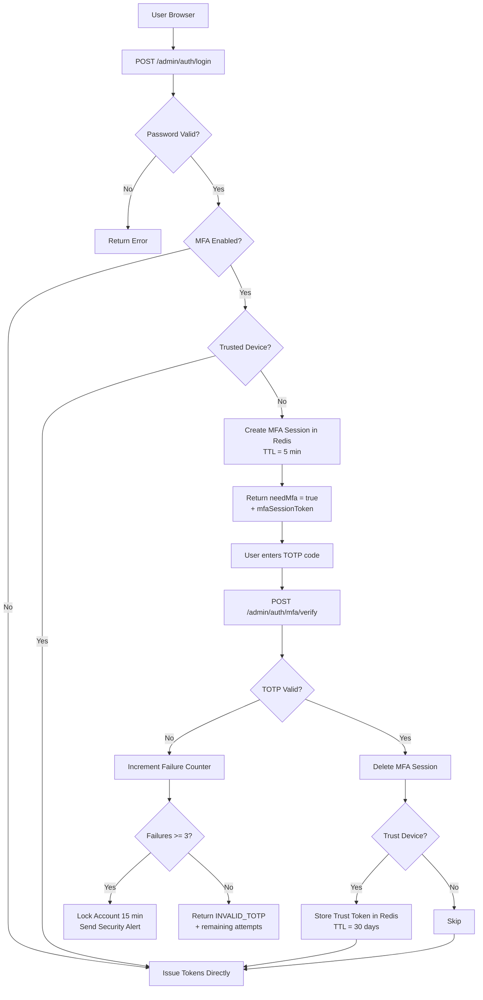
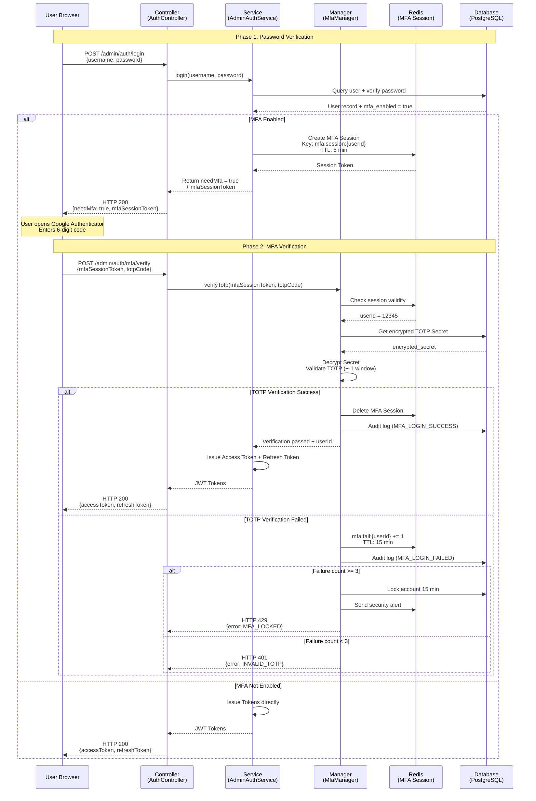
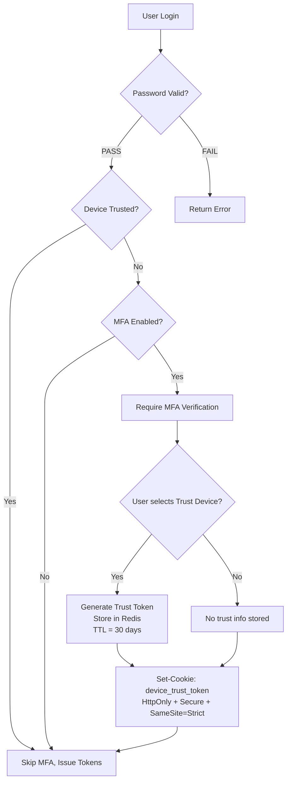
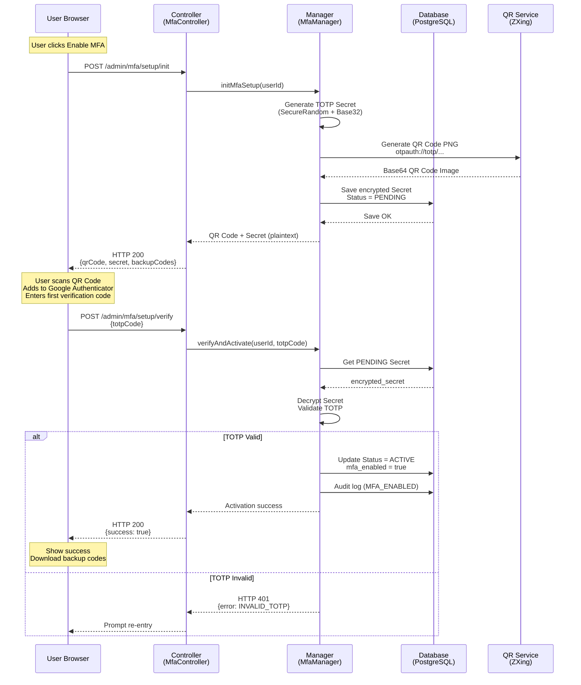

# MFA Login and Recovery Implementation (MFA 登入與恢復技術實現)

> **Canonical Source**: [06-06-03_Recovery_Flow.md](../../source-archive/06_Platform_Governance/06-06-03_Recovery_Flow.md)
> **Audience**: Architects, Backend Developers, DevOps
> **Business Requirements**: [MFA_Recovery_Requirements.md](../../requirements/06_Governance_Licensing/MFA_Recovery_Requirements.md)
> **Last Synced**: 2026-02-08

---

## 1. Architecture Overview



---

## 2. Two-Phase Login Sequence



---

## 3. API Endpoint Specifications

### 3.1 Phase 1: Password Login

```http
POST /admin/auth/login
Content-Type: application/json

{
  "username": "admin@smartadmin.com",
  "password": "SecurePassword123!",
  "deviceFingerprint": "e3b0c44298fc1c149afbf4c8996fb92427ae41e4649b934ca495991b7852b855"
}
```

**Response (MFA Enabled)**:

```json
{
  "code": 200,
  "msg": "Password verified. MFA required.",
  "data": {
    "needMfa": true,
    "mfaSessionToken": "mfa_sess_abc123xyz...",
    "expiresAt": "2026-02-05T10:05:00Z",
    "availableMethods": ["totp", "sms", "backup_code"]
  }
}
```

**Response (MFA Not Enabled)**:

```json
{
  "code": 200,
  "msg": "Login successful.",
  "data": {
    "needMfa": false,
    "accessToken": "eyJhbGciOiJIUzI1NiIsInR5cCI6IkpXVCJ9...",
    "refreshToken": "rt_abc123xyz...",
    "user": {
      "userId": 12345,
      "username": "admin@smartadmin.com",
      "roles": ["SUPER_ADMIN"]
    }
  }
}
```

### 3.2 Phase 2: MFA Verification

```http
POST /admin/auth/mfa/verify
Content-Type: application/json

{
  "mfaSessionToken": "mfa_sess_abc123xyz...",
  "totpCode": "123456",
  "trustDevice": true
}
```

**Response (Success)**:

```json
{
  "code": 200,
  "msg": "MFA verification successful.",
  "data": {
    "accessToken": "eyJhbGciOiJIUzI1NiIsInR5cCI6IkpXVCJ9...",
    "refreshToken": "rt_abc123xyz...",
    "user": {
      "userId": 12345,
      "username": "admin@smartadmin.com",
      "roles": ["SUPER_ADMIN"]
    }
  }
}
```

**Response (Failure)**:

```json
{
  "code": 401,
  "msg": "Invalid TOTP code.",
  "data": {
    "remainingAttempts": 2,
    "lockoutDuration": null
  }
}
```

**Response (Locked)**:

```json
{
  "code": 429,
  "msg": "Too many failed MFA attempts. Account locked.",
  "data": {
    "remainingAttempts": 0,
    "lockoutDuration": 900,
    "unlockAt": "2026-02-05T10:15:00Z"
  }
}
```

### 3.3 Error Code Reference

| Error Code | HTTP Status | Description | Client Action |
|-----------|------------|-------------|---------------|
| `INVALID_MFA_SESSION` | 401 | Session token expired or missing | Restart from Phase 1 |
| `INVALID_TOTP` | 401 | TOTP code incorrect | Show remaining attempts; prompt re-entry |
| `MFA_LOCKED` | 429 | 3 failures; account locked | Display 15-minute countdown |
| `MFA_NOT_ENABLED` | 400 | MFA verify called but user has no MFA | Guide to MFA setup |
| `TIME_SYNC_ERROR` | 500 | Server NTP desynchronisation | Trigger ops alert; generic error to user |

---

## 4. Trusted Device Implementation

### 4.1 Flow Diagram



### 4.2 Redis Data Structure

```
Key:   trusted_device:{userId}:{deviceFingerprint}
Value: {
  "userId": 12345,
  "deviceFingerprint": "e3b0c442...",
  "trustedAt": "2026-02-05T10:00:00Z",
  "expiresAt": "2026-03-07T10:00:00Z",
  "ipAddress": "203.0.113.42",
  "userAgent": "Mozilla/5.0..."
}
TTL:   2592000 seconds (30 days)
```

### 4.3 Device Fingerprint Generation (Client-Side)

```javascript
import FingerprintJS from '@fingerprintjs/fingerprintjs';

async function getDeviceFingerprint() {
  const fp = await FingerprintJS.load();
  const result = await fp.get();
  // Returns unique device identifier (99.5% accuracy)
  return result.visitorId;
}

// Attach fingerprint to login request
const deviceFingerprint = await getDeviceFingerprint();
const response = await fetch('/admin/auth/login', {
  method: 'POST',
  headers: { 'Content-Type': 'application/json' },
  body: JSON.stringify({
    username: 'admin@smartadmin.com',
    password: 'SecurePassword123!',
    deviceFingerprint: deviceFingerprint
  })
});
```

---

## 5. MFA Registration Flow

### 5.1 Sequence Diagram



### 5.2 QR Code Generation (Java)

```java
import com.google.zxing.BarcodeFormat;
import com.google.zxing.client.j2se.MatrixToImageWriter;
import com.google.zxing.common.BitMatrix;
import com.google.zxing.qrcode.QRCodeWriter;

import javax.imageio.ImageIO;
import java.awt.image.BufferedImage;
import java.io.ByteArrayOutputStream;
import java.util.Base64;

public class QrCodeGenerator {

    /**
     * Generate TOTP QR Code as Base64 PNG.
     *
     * @param username  User email (displayed in authenticator app)
     * @param secret    Base32-encoded TOTP secret
     * @param issuer    Issuer name (displayed in authenticator app)
     * @return Base64-encoded PNG image string
     */
    public static String generateQrCode(String username, String secret, String issuer) throws Exception {
        // Construct otpauth:// URI
        String otpauthUrl = String.format(
            "otpauth://totp/%s:%s?secret=%s&issuer=%s&algorithm=SHA1&digits=6&period=30",
            issuer, username, secret, issuer
        );

        // Generate QR Code via ZXing
        QRCodeWriter qrCodeWriter = new QRCodeWriter();
        BitMatrix bitMatrix = qrCodeWriter.encode(otpauthUrl, BarcodeFormat.QR_CODE, 300, 300);

        // Convert to BufferedImage
        BufferedImage qrImage = MatrixToImageWriter.toBufferedImage(bitMatrix);

        // Encode as Base64 PNG
        ByteArrayOutputStream baos = new ByteArrayOutputStream();
        ImageIO.write(qrImage, "PNG", baos);
        byte[] imageBytes = baos.toByteArray();

        return "data:image/png;base64," + Base64.getEncoder().encodeToString(imageBytes);
    }
}
```

### 5.3 MFA Setup Service

```java
@Service
@RequiredArgsConstructor
public class MfaSetupService {

    private final MfaRepository mfaRepository;
    private final TotpValidator totpValidator;
    private final AuditLogService auditLogService;

    /**
     * Initialize MFA setup: generate Secret + QR Code + backup codes.
     */
    @Transactional(rollbackFor = Throwable.class)
    public MfaSetupVO initMfaSetup(Long userId) {
        // Check if already enabled
        if (mfaRepository.isMfaEnabled(userId)) {
            throw new BusinessException("MFA is already enabled");
        }

        // Generate TOTP Secret (Base32)
        String totpSecret = TotpSecretGenerator.generateSecret();

        // Generate QR Code
        String username = getUserEmail(userId);
        String qrCodeBase64 = QrCodeGenerator.generateQrCode(
            username, totpSecret, "SmartAdmin iGaming"
        );

        // Generate 10 backup codes (8-digit)
        List<String> backupCodes = BackupCodeGenerator.generate(10);

        // Encrypt and persist (Status = PENDING)
        String encryptedSecret = encryptSecret(totpSecret);
        String encryptedBackupCodes = encryptBackupCodes(backupCodes);

        MfaEntity mfa = MfaEntity.builder()
            .userId(userId)
            .totpSecret(encryptedSecret)
            .backupCodes(encryptedBackupCodes)
            .status(MfaStatus.PENDING)
            .build();

        mfaRepository.save(mfa);

        auditLogService.log(userId, "MFA_SETUP_INIT", "User initiated MFA setup");

        // Return plaintext secret (shown only once)
        return MfaSetupVO.builder()
            .qrCode(qrCodeBase64)
            .secret(totpSecret)
            .backupCodes(backupCodes)
            .build();
    }

    /**
     * Verify TOTP code and activate MFA.
     */
    @Transactional(rollbackFor = Throwable.class)
    public ResponseDTO<Void> verifyAndActivate(Long userId, String totpCode) {
        MfaEntity mfa = mfaRepository.findByUserIdAndStatus(userId, MfaStatus.PENDING)
            .orElseThrow(() -> new BusinessException("No pending MFA setup found"));

        String decryptedSecret = decryptSecret(mfa.getTotpSecret());

        boolean isValid = totpValidator.validate(totpCode, decryptedSecret);

        if (!isValid) {
            auditLogService.log(userId, "MFA_SETUP_VERIFY_FAILED", "TOTP verification failed");
            return ResponseDTO.error(ErrorCode.INVALID_TOTP);
        }

        mfa.setStatus(MfaStatus.ACTIVE);
        mfa.setActivatedAt(Instant.now());
        mfaRepository.save(mfa);

        auditLogService.log(userId, "MFA_ENABLED", "MFA successfully activated");

        return ResponseDTO.ok();
    }
}
```

---

## 6. Database Schema

```sql
CREATE TABLE t_admin_user_mfa (
    user_id             BIGINT PRIMARY KEY REFERENCES t_admin_user(user_id),
    totp_secret         VARCHAR(255) NOT NULL,          -- AES-256-GCM encrypted
    backup_codes        TEXT,                           -- JSON array (AES encrypted)
    status              VARCHAR(20) NOT NULL,           -- PENDING / ACTIVE / DISABLED
    activated_at        TIMESTAMP,                      -- Activation timestamp
    created_at          TIMESTAMP DEFAULT NOW(),
    updated_at          TIMESTAMP DEFAULT NOW()
);

-- Indexes
CREATE INDEX idx_mfa_status ON t_admin_user_mfa(status);
CREATE INDEX idx_mfa_activated_at ON t_admin_user_mfa(activated_at);
```

---

## 7. Frontend Components (Vue 3)

### 7.1 MFA Verification Form

```vue
<template>
  <div class="mfa-verify-form">
    <a-input
      v-model:value="totpCode"
      placeholder="Enter 6-digit code"
      maxlength="6"
      :status="errorStatus"
    />

    <a-alert
      v-if="errorMessage"
      :type="alertType"
      :message="errorMessage"
      show-icon
      closable
    />

    <a-button type="primary" @click="verifyMfa" :loading="loading">
      Verify
    </a-button>
  </div>
</template>

<script setup>
import { ref } from 'vue';
import { message } from 'ant-design-vue';

const totpCode = ref('');
const errorMessage = ref('');
const errorStatus = ref('');
const alertType = ref('error');
const loading = ref(false);

async function verifyMfa() {
  loading.value = true;
  errorMessage.value = '';

  try {
    const response = await fetch('/admin/auth/mfa/verify', {
      method: 'POST',
      headers: { 'Content-Type': 'application/json' },
      body: JSON.stringify({
        mfaSessionToken: sessionStorage.getItem('mfaSessionToken'),
        totpCode: totpCode.value
      })
    });

    const result = await response.json();

    if (response.ok) {
      message.success('Login successful!');
      localStorage.setItem('accessToken', result.data.accessToken);
      window.location.href = '/admin/dashboard';
    } else {
      handleMfaError(result);
    }
  } catch (error) {
    message.error('Network error. Please try again.');
  } finally {
    loading.value = false;
  }
}

function handleMfaError(result) {
  errorStatus.value = 'error';

  switch (result.code) {
    case 401:
      if (result.msg.includes('INVALID_TOTP')) {
        errorMessage.value = `Incorrect code. Remaining attempts: ${result.data.remainingAttempts}`;
        alertType.value = 'warning';
      } else if (result.msg.includes('INVALID_MFA_SESSION')) {
        errorMessage.value = 'Session expired. Please log in again.';
        alertType.value = 'error';
        setTimeout(() => window.location.href = '/admin/login', 2000);
      }
      break;

    case 429:
      errorMessage.value = `Account locked. Please try again in ${result.data.lockoutDuration / 60} minutes.`;
      alertType.value = 'error';
      break;

    default:
      errorMessage.value = result.msg || 'Unknown error';
      alertType.value = 'error';
  }
}
</script>
```

### 7.2 MFA Setup Wizard

```vue
<template>
  <div class="mfa-setup">
    <a-steps :current="currentStep">
      <a-step title="Generate Secret" />
      <a-step title="Scan QR Code" />
      <a-step title="Verify & Activate" />
    </a-steps>

    <!-- Step 2: Scan QR Code -->
    <div v-if="currentStep === 1" class="qr-code-section">
      <h3>Scan this QR Code with Google Authenticator</h3>
      

      <a-alert type="info" show-icon>
        <template #message>
          Cannot scan? Manually enter this secret key:<br/>
          <code>{{ totpSecret }}</code>
        </template>
      </a-alert>

      <h4>Backup Codes (save securely)</h4>
      <a-textarea :value="backupCodesText" :rows="5" readonly />
      <a-button @click="downloadBackupCodes">Download Backup Codes</a-button>
    </div>

    <!-- Step 3: Verify & Activate -->
    <div v-if="currentStep === 2" class="verify-section">
      <h3>Enter the 6-digit code from Google Authenticator</h3>
      <a-input
        v-model:value="totpCode"
        placeholder="123456"
        maxlength="6"
        size="large"
      />
      <a-button type="primary" @click="verifyAndActivate">
        Activate MFA
      </a-button>
    </div>
  </div>
</template>

<script setup>
import { ref } from 'vue';
import { message } from 'ant-design-vue';

const currentStep = ref(1);
const qrCodeImage = ref('');
const totpSecret = ref('');
const backupCodes = ref([]);
const totpCode = ref('');

async function initMfaSetup() {
  const response = await fetch('/admin/mfa/setup/init', { method: 'POST' });
  const result = await response.json();

  if (response.ok) {
    qrCodeImage.value = result.data.qrCode;
    totpSecret.value = result.data.secret;
    backupCodes.value = result.data.backupCodes;
    currentStep.value = 1;
  }
}

function downloadBackupCodes() {
  const text = backupCodes.value.join('\n');
  const blob = new Blob([text], { type: 'text/plain' });
  const url = URL.createObjectURL(blob);

  const a = document.createElement('a');
  a.href = url;
  a.download = 'smartadmin-mfa-backup-codes.txt';
  a.click();

  message.success('Backup codes downloaded');
}

async function verifyAndActivate() {
  const response = await fetch('/admin/mfa/setup/verify', {
    method: 'POST',
    headers: { 'Content-Type': 'application/json' },
    body: JSON.stringify({ totpCode: totpCode.value })
  });

  const result = await response.json();

  if (response.ok) {
    message.success('MFA has been successfully enabled!');
    currentStep.value = 3;
  } else {
    message.error('Incorrect code. Please try again.');
  }
}

initMfaSetup();
</script>
```

---

## 8. Security Considerations

| Concern | Implementation |
|---------|---------------|
| TOTP secret at rest | AES-256-GCM encryption in database |
| TOTP secret in transit | Plaintext displayed only once during setup; HTTPS enforced |
| Backup codes at rest | AES-256-GCM encrypted; hashed for lookup |
| MFA session hijacking | 5-minute TTL; single-use; server-side only |
| Brute force TOTP | 3-attempt lockout with 15-minute cooldown |
| Device trust token theft | HttpOnly + Secure + SameSite=Strict cookie |
| Time-based TOTP window | +-1 period tolerance (30-second window) |

---

## 9. Related Technical Documents

| Document | Relationship |
|----------|-------------|
| MFA Architecture (06-06-01) | High-level design, method selection rationale |
| TOTP and WebAuthn (06-06-02) | TOTP algorithm details, HMAC-SHA1 implementation |
| Compliance and Audit (06-06-04) | Audit log schema, role-based MFA policies |
| RBAC Permissions (06-02) | Role definitions driving MFA enforcement |

---

**Navigation**: [Platform Core Architecture](../06_Platform_Core/) | [iGaming Home](../../README.md)
