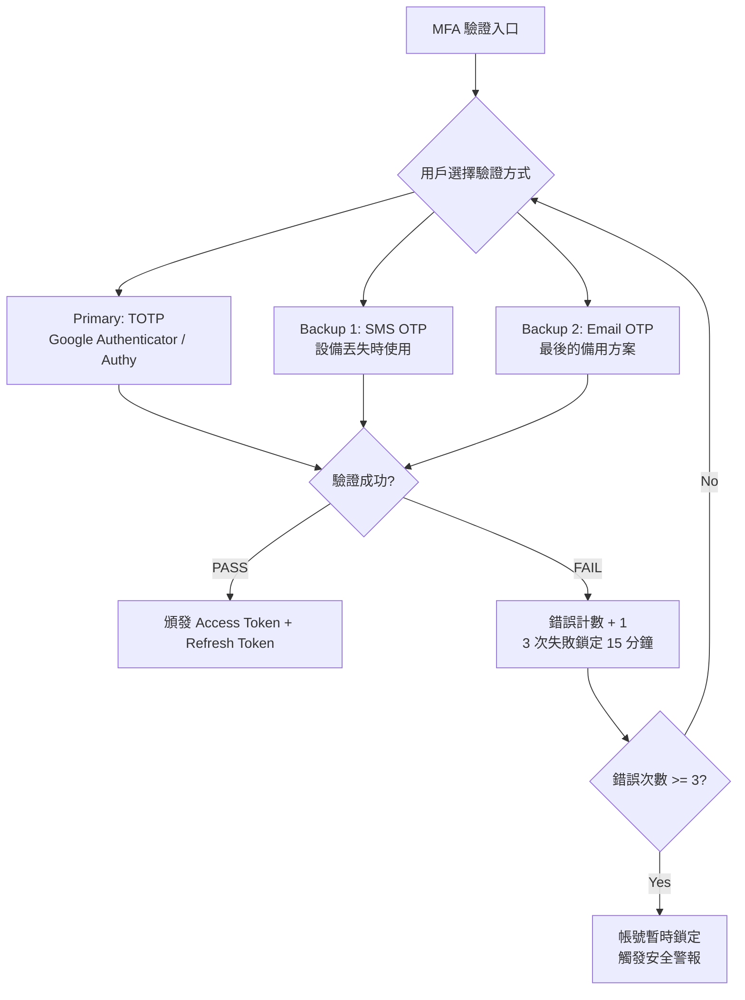
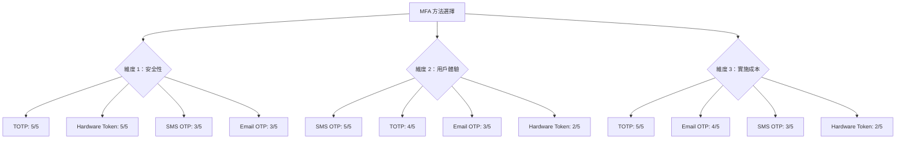
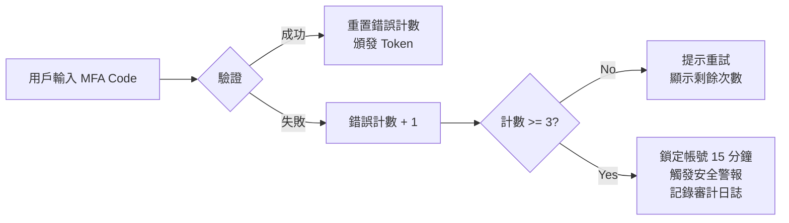

# MFA 技術架構設計（MFA Technical Architecture Design）

> **規範來源**: [06-06-01_MFA_Architecture.md](../../source-archive/06_Platform_Governance/06-06-01_MFA_Architecture.md)
> **目標讀者**: Architects, Backend Developers
> **業務需求**: [MFA_Architecture_Spec.md](../../requirements/06_Governance_Licensing/MFA_Architecture_Spec.md)
> **最後同步**: 2026-02-08

---

## 1. 架構概覽（Architecture Overview）

SmartAdmin iGaming 平台採用 **TOTP（主要）+ SMS OTP（備用）+ Email OTP（最後備用）+ Backup Codes（離線恢復）** 的四層 MFA 架構。

本文件聚焦於 MFA 驗證流程的系統架構設計與安全技術實現。業務需求與方法選擇依據請參閱 [MFA_Architecture_Spec.md](../../requirements/06_Governance_Licensing/MFA_Architecture_Spec.md)。

---

## 2. MFA 驗證流程架構（MFA Verification Flow Architecture）

### 2.1 驗證入口流程（Verification Entry Flow）



### 2.2 方法優先級設計（Method Priority Design）

| 優先級 | 方法 | 觸發條件 | 安全級別 |
|-------|------|---------|---------|
| **P0** | TOTP | 日常登入（預設方式） | 5/5 |
| **P1** | SMS OTP | 設備丟失 / TOTP 不可用 | 3/5 |
| **P2** | Email OTP | SMS 不可用（國際漫遊） | 3/5 |
| **P3** | Backup Codes | 所有方法都不可用（離線恢復） | 4/5 |

---

## 3. MFA 方法選擇決策架構（MFA Method Selection Decision Architecture）



---

## 4. 安全設計（Security Design）

### 4.1 威脅建模與 MFA 防禦對照（Threat Modeling and MFA Defense Mapping）

| 威脅類型（STRIDE） | 攻擊場景 | MFA 技術防禦機制 |
|---------|---------|-----------|
| **Spoofing** | 釣魚網站竊取密碼 | TOTP 為時間敏感碼，攻擊者無法在 30 秒內重放 |
| **Tampering** | Session Hijacking | MFA 綁定設備指紋，Session 與 MFA 驗證結果綁定 |
| **Repudiation** | 內部人員惡意操作否認 | MFA 審計日誌記錄設備、時間、驗證方式 |
| **Information Disclosure** | 密碼洩露 | TOTP Secret 使用 AES-256-GCM 獨立加密存儲 |
| **DoS** | 暴力破解登入 | 3 次失敗鎖定 15 分鐘 + Rate Limiting |
| **Elevation of Privilege** | 橫向移動攻擊 | 高權限角色強制 MFA，權限升級需重新驗證 |

### 4.2 CVSS 3.1 風險評分（CVSS 3.1 Risk Scoring）

```
無 MFA 的後台登入系統：
Base Score = 8.1 (High)
Attack Vector = Network (N)
Attack Complexity = Low (L)
Privileges Required = None (N)
User Interaction = None (N)

有 MFA 的後台登入系統：
Base Score = 4.3 (Medium)
Attack Vector = Network (N)
Attack Complexity = High (H) ← MFA 增加攻擊難度
Privileges Required = None (N)
User Interaction = Required (R) ← 需要受害者掃描 QR Code
```

MFA 可將安全風險從 High（8.1）降低至 Medium（4.3），降低約 47% 風險。

### 4.3 失敗鎖定機制設計（Failure Lockout Mechanism Design）



---

## 5. 合規技術映射（Compliance Technical Mapping）

| 合規標準 | 技術要求 | 架構實現 |
|---------|---------|---------|
| MGA/B2C/183/2010 | 高權限帳號強制 MFA | 角色-MFA 強制綁定策略 |
| PCI DSS 4.0 Req 8.3.1 | 所有管理員使用 MFA | MFA 啟用狀態檢查中間件 |
| GDPR Art. 32 | 適當的技術措施 | AES-256-GCM 加密 + 審計日誌 |
| NIST SP 800-63B | 不推薦 SMS OTP 作為主要方式 | TOTP 為主，SMS 僅作備用 |

**合規技術檢查清單**：

```
1. 所有 Super Admin、Finance Manager、Risk Control 必須啟用 MFA
2. MFA Secret 必須加密存儲（AES-256-GCM）
3. 審計日誌必須記錄所有 MFA 事件（註冊、驗證、失敗）
4. 備份恢復機制必須有二次驗證（不能自助恢復）
5. MFA 實施後需通過滲透測試（Penetration Test）
```

---

## 6. 實施階段（Implementation Phases）

| 階段 | 時間範圍 | 技術內容 | 驗收標準 |
|------|---------|---------|---------|
| Phase 1 | Week 1-2 | TOTP 整合（Google Authenticator） | TOTP 註冊 + 驗證流程 E2E 測試通過 |
| Phase 2 | Week 3 | SMS OTP 備用方案 | SMS 發送 + 驗證 + 頻率限制測試通過 |
| Phase 3 | Week 4 | Backup Codes（10 個一次性恢復碼） | 恢復碼生成 + 使用 + 作廢測試通過 |

---

## 7. SmartAdmin 實作（SmartAdmin Implementation）

### 7.1 Service 層（Service Layer）

```java
@Service
@RequiredArgsConstructor
public class MfaService {

    private final MfaSecretDao mfaSecretDao;
    private final MfaManager mfaManager;
    private final TotpGenerator totpGenerator;

    /**
     * Verify MFA code using TOTP algorithm.
     * Service layer handles orchestration, no @Transactional here.
     */
    public ResponseDTO<MfaVerifyResult> verifyMfaCode(Long userId, String code) {
        Option<MfaSecretEntity> secretOpt = Option.of(mfaSecretDao.selectByUserId(userId));
        if (secretOpt.isEmpty()) {
            return ResponseDTO.error(ErrorCode.MFA_NOT_ENABLED);
        }

        MfaSecretEntity secret = secretOpt.get();
        boolean valid = totpGenerator.verify(secret.getDecryptedSecret(), code);
        if (!valid) {
            return mfaManager.handleVerificationFailure(userId);
        }

        return mfaManager.handleVerificationSuccess(userId);
    }
}
```

### 7.2 Manager 層（Manager Layer）

```java
@Component
@RequiredArgsConstructor
public class MfaManager {

    private final MfaSecretDao mfaSecretDao;
    private final MfaAuditLogDao auditLogDao;
    private final AesEncryptor aesEncryptor;

    /**
     * Handle verification failure with lockout logic.
     * @Transactional only allowed in Manager layer per SmartAdmin architecture.
     */
    @Transactional(rollbackFor = Throwable.class)
    public ResponseDTO<MfaVerifyResult> handleVerificationFailure(Long userId) {
        MfaSecretEntity entity = mfaSecretDao.selectByUserId(userId);
        int newCount = entity.getFailureCount() + 1;

        if (newCount >= 3) {
            entity.setStatus(MfaStatus.LOCKED);
            entity.setLockedUntil(LocalDateTime.now().plusMinutes(15));
            logAuditEvent(userId, MfaEventType.ACCOUNT_LOCKED);
        }

        entity.setFailureCount(newCount);
        mfaSecretDao.updateById(entity);
        logAuditEvent(userId, MfaEventType.VERIFICATION_FAILED);

        return ResponseDTO.error(ErrorCode.MFA_INVALID_CODE);
    }
}
```

### 7.3 資料庫結構（Database Schema）

```sql
-- MFA secret storage with AES-256-GCM encryption
CREATE TABLE t_mfa_secret (
    id                  BIGSERIAL PRIMARY KEY,
    user_id             BIGINT NOT NULL UNIQUE,
    encrypted_secret    VARCHAR(500) NOT NULL,
    status              VARCHAR(20) NOT NULL DEFAULT 'PENDING_VERIFICATION',
    failure_count       INTEGER NOT NULL DEFAULT 0,
    locked_until        TIMESTAMP,
    last_verified_at    TIMESTAMP,
    created_at          TIMESTAMP NOT NULL DEFAULT NOW(),
    updated_at          TIMESTAMP NOT NULL DEFAULT NOW(),
    deleted             BOOLEAN NOT NULL DEFAULT FALSE
);

CREATE INDEX idx_mfa_user ON t_mfa_secret(user_id) WHERE deleted = FALSE;
CREATE INDEX idx_mfa_locked ON t_mfa_secret(status, locked_until)
    WHERE status = 'LOCKED';

-- MFA audit log for compliance
CREATE TABLE t_mfa_audit_log (
    id              BIGSERIAL PRIMARY KEY,
    user_id         BIGINT NOT NULL,
    event_type      VARCHAR(50) NOT NULL,
    ip_address      VARCHAR(45),
    device_info     JSONB,
    created_at      TIMESTAMP NOT NULL DEFAULT NOW()
);

CREATE INDEX idx_mfa_audit_user ON t_mfa_audit_log(user_id, created_at DESC);
```

---

## 相關文檔（Related Documents）

- [MFA_Architecture_Spec.md](../../requirements/06_Governance_Licensing/MFA_Architecture_Spec.md) - MFA 業務需求與方法選擇
- [TOTP_WebAuthn_Implementation.md](./TOTP_WebAuthn_Implementation.md) - TOTP 算法實現與密鑰管理
- [MFA_Compliance_Validation.md](./MFA_Compliance_Validation.md) - 合規驗證技術設計
- [MFA_Recovery_Implementation.md](./MFA_Recovery_Implementation.md) - 恢復流程技術實現

---

**End of Document**
