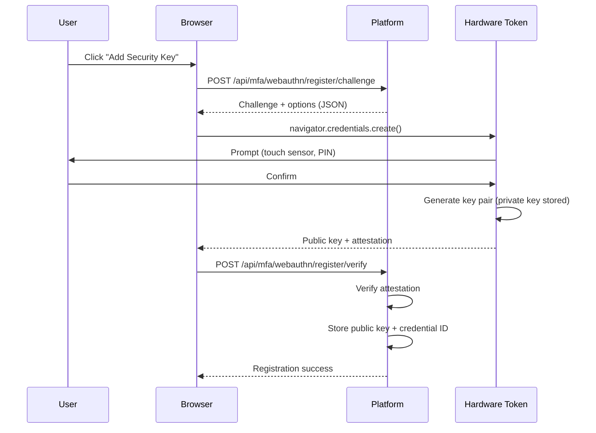
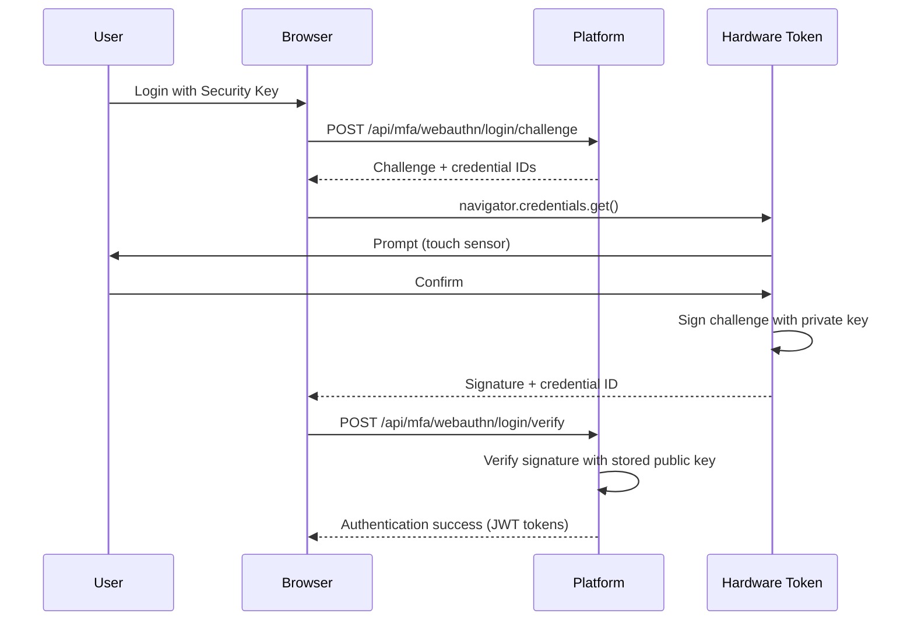

# MFA Technical Evaluation - TOTP, SMS, and WebAuthn

> **Business Requirements**: [MFA_Architecture_Spec.md](../../requirements/06_Governance_Licensing/MFA_Architecture_Spec.md)
> **Audience**: Security Engineers, Backend Developers, Compliance Officers
> **Last Synced**: 2026-02-09

---

## 1. TOTP (Time-Based One-Time Password) RFC 6238

### 1.1 Technical Specification

**Standard**: RFC 6238 (TOTP: Time-Based One-Time Password Algorithm)
**Published**: May 2011
**IETF Status**: Informational

**Algorithm Components**:
1. **Shared Secret**: Base32-encoded secret key (minimum 160 bits)
2. **Time Step**: 30 seconds (X = 30)
3. **Hash Function**: HMAC-SHA1 (default), HMAC-SHA256, or HMAC-SHA512
4. **Code Length**: 6 digits (recommended) or 8 digits
5. **Time Window**: ±1 time step (allowing for clock skew)

### 1.2 TOTP Algorithm Implementation

**Formula**:
```
TOTP(K, T) = HOTP(K, (T - T0) / X)

Where:
- K: Shared secret key
- T: Current Unix timestamp
- T0: Unix epoch (0)
- X: Time step (30 seconds)
- HOTP: HMAC-based One-Time Password Algorithm (RFC 4226)
```

### 1.3 Java Implementation

**TOTPGenerator.java**:

```java
@Component
public class TOTPGenerator {

    private static final int TIME_STEP = 30; // 30 seconds
    private static final int CODE_DIGITS = 6;
    private static final String HMAC_ALGORITHM = "HmacSHA1";

    /**
     * Generate TOTP code for a given secret
     *
     * @param secret Base32-encoded secret key
     * @return 6-digit TOTP code
     */
    public String generateTOTP(String secret) {
        try {
            // Step 1: Decode Base32 secret
            byte[] keyBytes = new Base32().decode(secret);

            // Step 2: Get current time counter
            long currentTime = System.currentTimeMillis() / 1000L;
            long counter = currentTime / TIME_STEP;

            // Step 3: Convert counter to byte array (big-endian)
            byte[] counterBytes = ByteBuffer.allocate(8).putLong(counter).array();

            // Step 4: Compute HMAC-SHA1
            Mac mac = Mac.getInstance(HMAC_ALGORITHM);
            SecretKeySpec secretKey = new SecretKeySpec(keyBytes, HMAC_ALGORITHM);
            mac.init(secretKey);
            byte[] hash = mac.doFinal(counterBytes);

            // Step 5: Dynamic truncation (RFC 4226 Section 5.3)
            int offset = hash[hash.length - 1] & 0x0F;
            int binary = ((hash[offset] & 0x7F) << 24)
                | ((hash[offset + 1] & 0xFF) << 16)
                | ((hash[offset + 2] & 0xFF) << 8)
                | (hash[offset + 3] & 0xFF);

            // Step 6: Generate 6-digit code
            int otp = binary % (int) Math.pow(10, CODE_DIGITS);

            return String.format("%0" + CODE_DIGITS + "d", otp);

        } catch (NoSuchAlgorithmException | InvalidKeyException e) {
            throw new TOTPGenerationException("Failed to generate TOTP", e);
        }
    }

    /**
     * Verify TOTP code with time window tolerance
     *
     * @param secret Base32-encoded secret key
     * @param code 6-digit code from user
     * @param windowSize Number of time steps to check (±windowSize)
     * @return true if code is valid
     */
    public boolean verifyTOTP(String secret, String code, int windowSize) {
        long currentTime = System.currentTimeMillis() / 1000L;
        long currentCounter = currentTime / TIME_STEP;

        // Check current time step and ±windowSize steps (default ±1)
        for (int i = -windowSize; i <= windowSize; i++) {
            long testCounter = currentCounter + i;
            String testCode = generateTOTPForCounter(secret, testCounter);

            if (MessageDigest.isEqual(testCode.getBytes(), code.getBytes())) {
                return true;
            }
        }

        return false;
    }

    private String generateTOTPForCounter(String secret, long counter) {
        try {
            byte[] keyBytes = new Base32().decode(secret);
            byte[] counterBytes = ByteBuffer.allocate(8).putLong(counter).array();

            Mac mac = Mac.getInstance(HMAC_ALGORITHM);
            SecretKeySpec secretKey = new SecretKeySpec(keyBytes, HMAC_ALGORITHM);
            mac.init(secretKey);
            byte[] hash = mac.doFinal(counterBytes);

            int offset = hash[hash.length - 1] & 0x0F;
            int binary = ((hash[offset] & 0x7F) << 24)
                | ((hash[offset + 1] & 0xFF) << 16)
                | ((hash[offset + 2] & 0xFF) << 8)
                | (hash[offset + 3] & 0xFF);

            int otp = binary % (int) Math.pow(10, CODE_DIGITS);

            return String.format("%0" + CODE_DIGITS + "d", otp);

        } catch (NoSuchAlgorithmException | InvalidKeyException e) {
            throw new TOTPGenerationException("Failed to generate TOTP for counter", e);
        }
    }
}
```

### 1.4 Secret Generation

**SecretGenerator.java**:

```java
@Component
public class MFASecretGenerator {

    private static final int SECRET_SIZE = 20; // 160 bits

    /**
     * Generate cryptographically secure random secret
     *
     * @return Base32-encoded secret (e.g., JBSWY3DPEHPK3PXP)
     */
    public String generateSecret() {
        SecureRandom random = new SecureRandom();
        byte[] bytes = new byte[SECRET_SIZE];
        random.nextBytes(bytes);

        // Encode to Base32 for compatibility with Google Authenticator
        Base32 base32 = new Base32();
        return base32.encodeToString(bytes).replaceAll("=", ""); // Remove padding
    }

    /**
     * Generate QR code URI for TOTP setup
     *
     * @param secret Base32-encoded secret
     * @param issuer Platform name (e.g., "SmartAdmin")
     * @param accountName User identifier (e.g., email)
     * @return otpauth URI
     */
    public String generateQRCodeURI(String secret, String issuer, String accountName) {
        try {
            String encodedIssuer = URLEncoder.encode(issuer, StandardCharsets.UTF_8);
            String encodedAccountName = URLEncoder.encode(accountName, StandardCharsets.UTF_8);

            return String.format(
                "otpauth://totp/%s:%s?secret=%s&issuer=%s&algorithm=SHA1&digits=6&period=30",
                encodedIssuer,
                encodedAccountName,
                secret,
                encodedIssuer
            );
        } catch (Exception e) {
            throw new QRCodeGenerationException("Failed to generate QR code URI", e);
        }
    }
}
```

---

## 2. TOTP Secret Encryption

### 2.1 Encryption Standard: AES-256-GCM

**Algorithm**: AES (Advanced Encryption Standard)
**Mode**: GCM (Galois/Counter Mode) - AEAD (Authenticated Encryption with Associated Data)
**Key Size**: 256 bits
**IV Size**: 96 bits (12 bytes) - recommended for GCM
**Tag Size**: 128 bits (16 bytes) - for authentication

**Why GCM Mode**:
- ✅ Provides both confidentiality and authenticity
- ✅ Resistant to bit-flipping attacks
- ✅ High performance (hardware acceleration)
- ✅ NIST recommended (SP 800-38D)

### 2.2 Secret Encryption Implementation

**MFASecretEncryptor.java**:

```java
@Component
@RequiredArgsConstructor
public class MFASecretEncryptor {

    private final VaultKeyManager vaultKeyManager;

    private static final String ALGORITHM = "AES/GCM/NoPadding";
    private static final int IV_SIZE = 12; // 96 bits
    private static final int TAG_SIZE = 128; // 128 bits

    /**
     * Encrypt TOTP secret using AES-256-GCM
     *
     * @param plainSecret Base32-encoded TOTP secret
     * @param userId User identifier (for key derivation)
     * @return Encrypted secret (IV + ciphertext + tag, Base64-encoded)
     */
    public String encryptSecret(String plainSecret, String userId) {
        try {
            // Step 1: Retrieve master encryption key from Vault
            byte[] masterKey = vaultKeyManager.getMasterEncryptionKey();

            // Step 2: Derive user-specific key using HKDF
            byte[] userKey = deriveUserKey(masterKey, userId);

            // Step 3: Generate random IV
            byte[] iv = new byte[IV_SIZE];
            new SecureRandom().nextBytes(iv);

            // Step 4: Initialize cipher
            Cipher cipher = Cipher.getInstance(ALGORITHM);
            GCMParameterSpec gcmSpec = new GCMParameterSpec(TAG_SIZE, iv);
            SecretKeySpec keySpec = new SecretKeySpec(userKey, "AES");
            cipher.init(Cipher.ENCRYPT_MODE, keySpec, gcmSpec);

            // Step 5: Encrypt secret
            byte[] plainBytes = plainSecret.getBytes(StandardCharsets.UTF_8);
            byte[] cipherBytes = cipher.doFinal(plainBytes);

            // Step 6: Combine IV + ciphertext + tag
            byte[] combined = new byte[IV_SIZE + cipherBytes.length];
            System.arraycopy(iv, 0, combined, 0, IV_SIZE);
            System.arraycopy(cipherBytes, 0, combined, IV_SIZE, cipherBytes.length);

            // Step 7: Base64 encode for storage
            return Base64.getEncoder().encodeToString(combined);

        } catch (Exception e) {
            throw new EncryptionException("Failed to encrypt TOTP secret", e);
        }
    }

    /**
     * Decrypt TOTP secret using AES-256-GCM
     *
     * @param encryptedSecret Base64-encoded encrypted secret
     * @param userId User identifier
     * @return Plain TOTP secret
     */
    public String decryptSecret(String encryptedSecret, String userId) {
        try {
            // Step 1: Base64 decode
            byte[] combined = Base64.getDecoder().decode(encryptedSecret);

            // Step 2: Extract IV and ciphertext
            byte[] iv = Arrays.copyOfRange(combined, 0, IV_SIZE);
            byte[] cipherBytes = Arrays.copyOfRange(combined, IV_SIZE, combined.length);

            // Step 3: Retrieve and derive key
            byte[] masterKey = vaultKeyManager.getMasterEncryptionKey();
            byte[] userKey = deriveUserKey(masterKey, userId);

            // Step 4: Initialize cipher
            Cipher cipher = Cipher.getInstance(ALGORITHM);
            GCMParameterSpec gcmSpec = new GCMParameterSpec(TAG_SIZE, iv);
            SecretKeySpec keySpec = new SecretKeySpec(userKey, "AES");
            cipher.init(Cipher.DECRYPT_MODE, keySpec, gcmSpec);

            // Step 5: Decrypt and verify authentication tag
            byte[] plainBytes = cipher.doFinal(cipherBytes);

            return new String(plainBytes, StandardCharsets.UTF_8);

        } catch (AEADBadTagException e) {
            throw new DecryptionException("Secret authentication failed (possible tampering)", e);
        } catch (Exception e) {
            throw new DecryptionException("Failed to decrypt TOTP secret", e);
        }
    }

    /**
     * Derive user-specific encryption key using HKDF (HMAC-based Key Derivation Function)
     *
     * @param masterKey Master encryption key (256 bits)
     * @param userId User identifier
     * @return Derived key (256 bits)
     */
    private byte[] deriveUserKey(byte[] masterKey, String userId) {
        try {
            // HKDF-Expand using HMAC-SHA256
            Mac mac = Mac.getInstance("HmacSHA256");
            SecretKeySpec keySpec = new SecretKeySpec(masterKey, "HmacSHA256");
            mac.init(keySpec);

            byte[] info = ("totp-secret-" + userId).getBytes(StandardCharsets.UTF_8);
            byte[] hash = mac.doFinal(info);

            // Return first 256 bits (32 bytes)
            return Arrays.copyOf(hash, 32);

        } catch (Exception e) {
            throw new KeyDerivationException("Failed to derive user key", e);
        }
    }
}
```

### 2.3 Database Storage

**MFA Secret Storage Schema**:

```sql
CREATE TABLE t_user_mfa (
    id BIGSERIAL PRIMARY KEY,
    user_id BIGINT NOT NULL,
    encrypted_secret VARCHAR(500) NOT NULL,  -- Base64-encoded (IV + ciphertext + tag)
    encryption_algorithm VARCHAR(50) NOT NULL DEFAULT 'AES-256-GCM',
    secret_version INT NOT NULL DEFAULT 1,   -- For key rotation
    backup_codes_encrypted TEXT,             -- JSON array of encrypted backup codes
    enabled BOOLEAN NOT NULL DEFAULT FALSE,
    verified_at TIMESTAMP,
    created_at TIMESTAMP NOT NULL DEFAULT NOW(),
    updated_at TIMESTAMP NOT NULL DEFAULT NOW(),
    CONSTRAINT uk_user_mfa UNIQUE (user_id)
);

-- Index for quick lookup
CREATE INDEX idx_user_mfa_user_id ON t_user_mfa(user_id) WHERE enabled = TRUE;
```

---

## 3. SMS Security Threat Analysis

### 3.1 SIM Swap Attack

**Attack Mechanism**:
1. Attacker obtains victim's personal information (social engineering)
2. Attacker contacts mobile carrier, impersonates victim
3. Carrier transfers victim's phone number to attacker's SIM card
4. Attacker receives all SMS messages, including OTP codes

**Technical Flow**:
```
Attacker → Social Engineering → Mobile Carrier
                                    ↓
                            SIM Swap Authorized
                                    ↓
                    Victim's Number → Attacker's SIM
                                    ↓
                            SMS OTP Delivered to Attacker
```

**Mitigation Strategies**:
- ✅ Require additional verification for SIM swap requests (PIN, security questions)
- ✅ Alert users via email when SIM swap detected
- ✅ Lock MFA settings requiring existing MFA verification to disable
- ⚠️ Deprecate SMS OTP in favor of TOTP

**Real-World Cases**:
- 2019: Twitter CEO Jack Dorsey's account hacked via SIM swap
- 2020: $100M+ stolen from cryptocurrency accounts via SIM swap

### 3.2 SS7 Protocol Vulnerability

**SS7 (Signaling System 7)**: Legacy telecom protocol for routing SMS and calls.

**Vulnerability**:
- SS7 allows trusted network nodes to query subscriber location
- Attackers with access to SS7 network can intercept SMS messages
- No authentication required for some SS7 commands

**Attack Flow**:
```
Attacker → SS7 Network Access (purchased from dark web)
              ↓
        Send Location Update (HLR query)
              ↓
        Intercept SMS OTP (without SIM swap)
```

**Mitigation**:
- Mobile carriers must implement SS7 firewalls
- Platform cannot directly mitigate (carrier-level issue)
- **Solution**: Deprecate SMS OTP entirely for high-security operations

### 3.3 SMS OTP Deprecation Timeline (NIST)

**NIST SP 800-63B (Digital Identity Guidelines)**:

> "Due to the risk that SMS messages may be intercepted or redirected, implementers of new systems SHOULD carefully consider alternative authenticators."
> - **NIST SP 800-63B** (June 2017, Section 5.1.3.2)

**Industry Deprecation Timeline**:
- **2017**: NIST recommends against SMS OTP for new systems
- **2020**: Google deprecates SMS OTP for Workspace admins
- **2021**: Microsoft deprecates SMS OTP for Azure AD (requires TOTP or hardware token)
- **2023**: Apple deprecates SMS for Apple ID (requires TOTP or hardware key)
- **2025**: EU PSD2 SCA regulations phase out SMS OTP

**Recommendation**: Use SMS OTP only as fallback for low-risk operations; mandate TOTP for admins.

---

## 4. FIDO2 / WebAuthn Standards

### 4.1 FIDO2 Overview

**FIDO2 = CTAP + WebAuthn**:
- **CTAP (Client-to-Authenticator Protocol)**: Communication between browser and hardware token (e.g., YubiKey)
- **WebAuthn (Web Authentication API)**: Browser API for passwordless authentication

**Key Benefits**:
- ✅ Phishing-resistant (private key never leaves hardware)
- ✅ No shared secrets (asymmetric cryptography)
- ✅ Hardware-backed security (TPM, Secure Enclave)
- ✅ Industry standard (W3C + FIDO Alliance)

### 4.2 WebAuthn Registration Flow



### 4.3 WebAuthn Authentication Flow



### 4.4 WebAuthn Java Implementation (Spring Boot)

**WebAuthnService.java** (using Yubico java-webauthn-server library):

```java
@Service
@RequiredArgsConstructor
public class WebAuthnService {

    private final RelyingParty relyingParty;
    private final CredentialRepository credentialRepository;

    /**
     * Generate registration challenge
     *
     * @param userId User identifier
     * @param username Display name
     * @return PublicKeyCredentialCreationOptions (JSON)
     */
    public PublicKeyCredentialCreationOptions startRegistration(Long userId, String username) {
        UserIdentity userIdentity = UserIdentity.builder()
            .name(username)
            .displayName(username)
            .id(ByteArray.fromLong(userId))
            .build();

        StartRegistrationOptions options = StartRegistrationOptions.builder()
            .user(userIdentity)
            .authenticatorSelection(AuthenticatorSelectionCriteria.builder()
                .userVerification(UserVerificationRequirement.REQUIRED) // PIN or biometric
                .residentKey(ResidentKeyRequirement.REQUIRED)           // Store credential on device
                .build())
            .build();

        return relyingParty.startRegistration(options);
    }

    /**
     * Verify registration response
     *
     * @param userId User identifier
     * @param response PublicKeyCredential from browser
     * @return RegistrationResult (contains credential ID and public key)
     */
    public RegistrationResult finishRegistration(Long userId, String response) {
        PublicKeyCredential<AuthenticatorAttestationResponse, ClientRegistrationExtensionOutputs> pkc =
            PublicKeyCredential.parseRegistrationResponseJson(response);

        FinishRegistrationOptions options = FinishRegistrationOptions.builder()
            .request(/* cached from startRegistration */)
            .response(pkc)
            .build();

        try {
            RegistrationResult result = relyingParty.finishRegistration(options);

            // Store credential
            credentialRepository.save(WebAuthnCredential.builder()
                .userId(userId)
                .credentialId(result.getKeyId().getId().getBase64())
                .publicKeyCose(result.getPublicKeyCose().getBase64())
                .signatureCount(result.getSignatureCount())
                .createdAt(LocalDateTime.now())
                .build());

            return result;

        } catch (RegistrationFailedException e) {
            throw new WebAuthnException("Registration verification failed", e);
        }
    }
}
```

---

## 5. Security Comparison Matrix

### 5.1 Technical Comparison

| Feature | TOTP | SMS OTP | Email OTP | Hardware Token (FIDO2) |
|---------|------|---------|-----------|------------------------|
| **Algorithm** | HMAC-SHA1 (RFC 6238) | N/A (telecom) | N/A | ECDSA P-256 / RSA 2048 |
| **Offline Capability** | ✅ Yes | ❌ No (requires network) | ❌ No | ✅ Yes |
| **Phishing Resistance** | ⚠️ Partial (code can be phished) | ❌ No | ❌ No | ✅ Yes (domain-bound) |
| **SIM Swap Vulnerable** | ✅ No | ❌ Yes | ✅ No | ✅ No |
| **SS7 Attack Vulnerable** | ✅ No | ❌ Yes | ✅ No | ✅ No |
| **Device Dependency** | ⚠️ Phone/app | ⚠️ Phone | ⚠️ Email access | ⚠️ Hardware token |
| **Cost per User** | $0 | $0.05-$0.10 per SMS | $0 | $50-$70 (one-time) |
| **Setup Complexity** | Medium (QR scan) | Low (automatic) | Low (automatic) | High (USB/NFC pairing) |
| **NIST Recommendation** | ✅ Recommended | ⚠️ Deprecated | ⚠️ Not recommended | ✅ Recommended (AAL3) |

### 5.2 Attack Surface Analysis

**TOTP Attack Vectors**:
- ⚠️ Phishing: User enters code on fake login page
  - Mitigation: Short validity window (30s), user education
- ⚠️ Device theft: Physical access to phone
  - Mitigation: Require device PIN/biometric to access app
- ⚠️ Backup code theft: Stored insecurely
  - Mitigation: Encrypt backup codes, require MFA to view

**SMS OTP Attack Vectors**:
- ❌ **SIM Swap** (High Risk): Attacker obtains phone number
- ❌ **SS7 Hijacking** (Medium Risk): Telecom-level interception
- ❌ **Phishing** (High Risk): Code can be intercepted
- ❌ **Malware** (Medium Risk): SMS-reading malware on phone

**Hardware Token (FIDO2) Attack Vectors**:
- ⚠️ Physical theft: Attacker steals token
  - Mitigation: Require PIN/biometric to use token
- ⚠️ Supply chain: Compromised hardware (rare)
  - Mitigation: Purchase from trusted vendors (Yubico, Google Titan)

### 5.3 Compliance Alignment

| Regulation | TOTP | SMS OTP | Hardware Token (FIDO2) |
|-----------|------|---------|------------------------|
| **NIST AAL2** (Moderate Assurance) | ✅ Approved | ⚠️ Restricted (with conditions) | ✅ Approved |
| **NIST AAL3** (High Assurance) | ❌ Insufficient | ❌ Prohibited | ✅ Required |
| **PSD2 SCA** (EU Payments) | ✅ Compliant | ⚠️ Allowed until 2025 | ✅ Compliant |
| **GDPR Art. 32** (Data Protection) | ✅ Adequate | ⚠️ Questionable (due to SMS risks) | ✅ Strong |
| **UKGC LCCP** (Gaming License) | ✅ Acceptable | ⚠️ Acceptable with warnings | ✅ Preferred |
| **MGA B2C/183/2010** | ✅ Mandatory for admins | ❌ Not sufficient alone | ✅ Recommended |

### 5.4 Cost-Benefit Analysis

**Scenario: 200 Admin Users**

| Method | Setup Cost | Annual Cost | Security Level | Recommendation |
|--------|-----------|-------------|----------------|----------------|
| **TOTP only** | $0 | $0 | High (5/5) | ✅ **Cost-effective baseline** |
| **TOTP + SMS fallback** | $500 (integration) | $3,600 (SMS fees) | High (5/5) | ✅ Good balance |
| **TOTP + Hardware Token** | $10,000 (tokens) | $0 | Very High (5/5) | ⚠️ Only for AAL3 compliance |
| **SMS only** | $500 | $3,600 | Low (2/5) | ❌ **Not recommended** |

**ROI Calculation**:
- **Risk Reduction**: TOTP reduces account compromise risk from 8.1 CVSS (High) to 4.3 (Medium)
- **Cost of Breach**: Average iGaming platform breach costs $500K-$2M
- **Expected Loss Reduction**: TOTP ($0/year) vs. potential breach ($1M) = ∞% ROI

---

## 6. Implementation Recommendations

### 6.1 Mandatory TOTP for High-Risk Roles

```java
@Component
public class MFAEnforcementPolicy {

    /**
     * Determine if MFA is mandatory for user role
     *
     * @param role User role
     * @return true if MFA required
     */
    public boolean isMFAMandatory(Role role) {
        return role == Role.SUPER_ADMIN
            || role == Role.FINANCE_MANAGER
            || role == Role.RISK_CONTROL
            || role == Role.DEVELOPER;
    }

    /**
     * Determine allowed MFA methods for role
     *
     * @param role User role
     * @return List of allowed methods
     */
    public List<MFAMethod> getAllowedMethods(Role role) {
        if (role == Role.SUPER_ADMIN || role == Role.FINANCE_MANAGER) {
            // AAL3: Only hardware token or TOTP
            return Arrays.asList(MFAMethod.TOTP, MFAMethod.HARDWARE_TOKEN);
        }

        // AAL2: TOTP or SMS fallback
        return Arrays.asList(MFAMethod.TOTP, MFAMethod.SMS, MFAMethod.BACKUP_CODES);
    }
}
```

### 6.2 Gradual Migration from SMS to TOTP

**Phase 1** (Month 1-3): Encourage TOTP adoption
- Send emails encouraging users to switch from SMS to TOTP
- Highlight security benefits

**Phase 2** (Month 4-6): Deprecate SMS for new accounts
- New admin accounts must use TOTP
- Existing SMS users can continue (grandfathered)

**Phase 3** (Month 7-12): Mandatory migration
- All users must migrate to TOTP by deadline
- Provide migration guides and support

**Phase 4** (Month 13+): SMS completely removed
- SMS OTP disabled platform-wide

---

## 7. Related Documents

### Business Requirements
- [MFA_Architecture_Spec.md](../../requirements/06_Governance_Licensing/MFA_Architecture_Spec.md) - MFA method selection, risk analysis, decision matrix

### Technical Implementation
- [MFA_Login_Recovery_Technical.md](MFA_Login_Recovery_Technical.md) - Two-phase login, trusted device tokens
- [MFA_Compliance_Technical.md](MFA_Compliance_Technical.md) - Audit logs, backup codes, compliance validation

### Security Standards
- **NIST SP 800-63B**: Digital Identity Guidelines (AAL2/AAL3)
- **RFC 6238**: TOTP Specification
- **RFC 4226**: HOTP Specification
- **W3C WebAuthn Level 2**: Web Authentication API

---

**Document Version**: 1.0.0
**Last Updated**: 2026-02-09
**Maintainer**: Security Team
