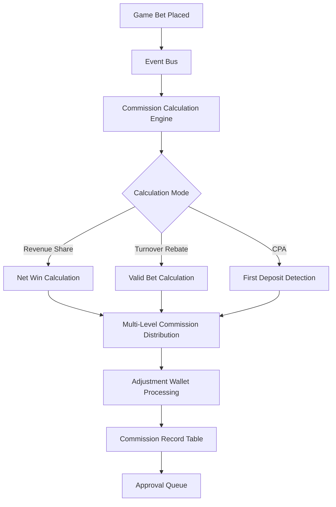

# Agent System Technical Architecture

> **Business Requirements**: [Agent System Requirements](../../requirements/07_Agent_Operations/Agent_System_Requirements.md)
> **Canonical Source**: [source-archive/07_Agent_Center/07-03_Agent_System.md](../../source-archive/07_Agent_Center/07-03_Agent_System.md)
> **View Type**: Technical Architecture
> **Target Audience**: Architects, Backend Developers

---

## 1. Architecture Overview

The Agent (Affiliate) System uses a **Closure Table** pattern for hierarchy storage, an event-driven commission calculation engine, and an immutable adjustment ledger for cross-period corrections.

---

## 2. Hierarchy Storage Design

### 2.1 Storage Strategy Comparison

| Strategy | Pros | Cons | Best For |
|----------|------|------|----------|
| **Nested Set** | Fast subtree queries (single query) | Expensive insert/move | Read-heavy workloads |
| **Closure Table** | Flexible insert/move operations | Higher storage cost | Write-heavy workloads |

**Chosen Strategy**: **Closure Table + Path Redundancy Field**

**Rationale**:
- Agent hierarchy changes frequently (new agents join, transfers between parents)
- Closure Table supports fast insertion and path queries
- Path field (`/1/5/12/`) provides fast hierarchy level determination

---

## 3. Commission Calculation Engine



**Architecture Characteristics**:
- **Event-Driven**: Bet events trigger commission calculation
- **Batch Processing**: Daily settlement at 02:00 via scheduled task
- **Adjustment Ledger**: Adjustment items recorded independently, historical reports immutable

---

## 4. Database Schema

### 4.1 affiliate_agent Table (Agent Master)

```sql
CREATE TABLE affiliate_agent (
    agent_id BIGINT PRIMARY KEY AUTO_INCREMENT,
    tenant_id VARCHAR(32) NOT NULL,
    username VARCHAR(50) NOT NULL,
    parent_agent_id BIGINT,
    hierarchy_path VARCHAR(500),
    agent_level INT NOT NULL DEFAULT 1,
    commission_plan_id BIGINT,
    total_players INT DEFAULT 0,
    active_players INT DEFAULT 0,
    total_commission DECIMAL(15,2) DEFAULT 0.00,
    status VARCHAR(20) DEFAULT 'ACTIVE',
    created_at TIMESTAMP DEFAULT CURRENT_TIMESTAMP,
    updated_at TIMESTAMP DEFAULT CURRENT_TIMESTAMP ON UPDATE CURRENT_TIMESTAMP,

    INDEX idx_tenant_username (tenant_id, username),
    INDEX idx_parent_agent (parent_agent_id),
    INDEX idx_hierarchy_path (hierarchy_path(200)),
    UNIQUE KEY uk_tenant_username (tenant_id, username)
) ENGINE=InnoDB DEFAULT CHARSET=utf8mb4;
```

### 4.2 affiliate_hierarchy Table (Closure Table)

```sql
CREATE TABLE affiliate_hierarchy (
    id BIGINT PRIMARY KEY AUTO_INCREMENT,
    tenant_id VARCHAR(32) NOT NULL,
    ancestor_id BIGINT NOT NULL,
    descendant_id BIGINT NOT NULL,
    depth INT NOT NULL,

    INDEX idx_ancestor (ancestor_id, depth),
    INDEX idx_descendant (descendant_id),
    UNIQUE KEY uk_ancestor_descendant (ancestor_id, descendant_id)
) ENGINE=InnoDB DEFAULT CHARSET=utf8mb4;
```

### 4.3 affiliate_commission_plan Table

```sql
CREATE TABLE affiliate_commission_plan (
    plan_id BIGINT PRIMARY KEY AUTO_INCREMENT,
    tenant_id VARCHAR(32) NOT NULL,
    plan_name VARCHAR(100) NOT NULL,
    plan_type VARCHAR(20) NOT NULL,
    tiers JSON,
    settlement_period VARCHAR(20),
    negative_carryover BOOLEAN DEFAULT TRUE,
    reset_threshold DECIMAL(15,2),
    status VARCHAR(20) DEFAULT 'ACTIVE',
    created_at TIMESTAMP DEFAULT CURRENT_TIMESTAMP,

    INDEX idx_tenant (tenant_id)
) ENGINE=InnoDB DEFAULT CHARSET=utf8mb4;

-- tiers JSON example:
-- [
--   {"min": 0, "max": 100000, "rate": 0.30},
--   {"min": 100000, "max": 500000, "rate": 0.40},
--   {"min": 500000, "max": null, "rate": 0.50}
-- ]
```

### 4.4 affiliate_commission_record Table

```sql
CREATE TABLE affiliate_commission_record (
    record_id BIGINT PRIMARY KEY AUTO_INCREMENT,
    tenant_id VARCHAR(32) NOT NULL,
    agent_id BIGINT NOT NULL,
    settlement_date DATE NOT NULL,
    plan_type VARCHAR(20) NOT NULL,
    gross_amount DECIMAL(15,2) NOT NULL,
    adjustment_amount DECIMAL(15,2) DEFAULT 0.00,
    carryover_amount DECIMAL(15,2) DEFAULT 0.00,
    net_amount DECIMAL(15,2) NOT NULL,
    status VARCHAR(20) DEFAULT 'PENDING',
    approved_by BIGINT,
    approved_at TIMESTAMP,
    created_at TIMESTAMP DEFAULT CURRENT_TIMESTAMP,

    INDEX idx_agent_settlement (agent_id, settlement_date),
    INDEX idx_status (status),
    UNIQUE KEY uk_agent_settlement_type (agent_id, settlement_date, plan_type)
) ENGINE=InnoDB DEFAULT CHARSET=utf8mb4;
```

### 4.5 affiliate_adjustment Table

```sql
CREATE TABLE affiliate_adjustment (
    adjustment_id BIGINT PRIMARY KEY AUTO_INCREMENT,
    tenant_id VARCHAR(32) NOT NULL,
    agent_id BIGINT NOT NULL,
    adjustment_type VARCHAR(20) NOT NULL,
    amount DECIMAL(15,2) NOT NULL,
    original_settlement_date DATE,
    target_settlement_date DATE NOT NULL,
    reason TEXT,
    created_by BIGINT,
    created_at TIMESTAMP DEFAULT CURRENT_TIMESTAMP,

    INDEX idx_agent_target_date (agent_id, target_settlement_date)
) ENGINE=InnoDB DEFAULT CHARSET=utf8mb4;
```

---

## 5. SQL Query Examples

### 5.1 Query Agent Downline Tree (Closure Table)

```sql
-- Query all downline agents for agent_id=10 (including self)
SELECT a.*
FROM affiliate_agent a
INNER JOIN affiliate_hierarchy h
    ON h.descendant_id = a.agent_id
WHERE h.ancestor_id = 10
    AND h.tenant_id = 'tenant_001'
ORDER BY h.depth, a.agent_id;
```

### 5.2 Calculate Monthly Commission (Revenue Share)

```sql
SELECT
    agent_id,
    SUM(CASE
        WHEN net_win BETWEEN 0 AND 100000 THEN net_win * 0.30
        WHEN net_win BETWEEN 100000 AND 500000 THEN 100000 * 0.30 + (net_win - 100000) * 0.40
        WHEN net_win > 500000 THEN 100000 * 0.30 + 400000 * 0.40 + (net_win - 500000) * 0.50
        ELSE 0
    END) AS total_commission
FROM (
    SELECT
        ag.agent_id,
        SUM(b.bet_amount - b.win_amount) AS net_win
    FROM affiliate_agent ag
    INNER JOIN player p ON p.referrer_agent_id = ag.agent_id
    INNER JOIN bet_record b ON b.player_id = p.player_id
    WHERE ag.agent_id = 10
        AND b.settlement_date BETWEEN '2026-02-01' AND '2026-02-28'
        AND b.status = 'SETTLED'
    GROUP BY ag.agent_id
) sub
GROUP BY agent_id;
```

### 5.3 Same IP Detection

```sql
-- Detect agent and downline players sharing same IP
SELECT
    ag.agent_id,
    ag.username AS agent_username,
    p.player_id,
    p.username AS player_username,
    p.last_login_ip
FROM affiliate_agent ag
INNER JOIN player p ON p.referrer_agent_id = ag.agent_id
WHERE p.last_login_ip = (
    SELECT last_login_ip
    FROM admin_user
    WHERE user_id = ag.agent_id
)
  AND ag.status = 'ACTIVE';
```

---

## 6. SmartAdmin Architecture Implementation

### 6.1 AffiliateEntity (Entity Layer)

```java
package net.lab1024.sa.affiliate.domain.entity;

import com.baomidou.mybatisplus.annotation.IdType;
import com.baomidou.mybatisplus.annotation.TableId;
import com.baomidou.mybatisplus.annotation.TableName;
import lombok.Data;
import java.math.BigDecimal;
import java.time.LocalDateTime;

/**
 * Affiliate agent entity
 */
@Data
@TableName("affiliate_agent")
public class AffiliateEntity {

    @TableId(type = IdType.AUTO)
    private Long agentId;

    private String tenantId;
    private String username;
    private Long parentAgentId;
    private String hierarchyPath;
    private Integer agentLevel;
    private Long commissionPlanId;
    private Integer totalPlayers;
    private Integer activePlayers;
    private BigDecimal totalCommission;
    private String status;
    private LocalDateTime createdAt;
    private LocalDateTime updatedAt;
}
```

### 6.2 AffiliateCommissionManager (Manager Layer)

```java
package net.lab1024.sa.affiliate.manager;

import lombok.RequiredArgsConstructor;
import lombok.extern.slf4j.Slf4j;
import net.lab1024.sa.affiliate.domain.entity.AffiliateCommissionRecord;
import net.lab1024.sa.affiliate.dao.AffiliateCommissionRecordDao;
import org.springframework.stereotype.Service;
import org.springframework.transaction.annotation.Transactional;

import java.math.BigDecimal;
import java.time.LocalDate;
import java.time.LocalDateTime;

/**
 * Affiliate commission Manager layer
 *
 * Responsibilities:
 * 1. Commission calculation and issuance (requires transaction)
 * 2. Multi-table operations (commission_record + adjustment)
 * 3. Negative carryover logic
 */
@Slf4j
@Service
@RequiredArgsConstructor
public class AffiliateCommissionManager {

    private final AffiliateCommissionRecordDao commissionRecordDao;

    @Transactional(rollbackFor = Throwable.class)
    public Long calculateAndIssueCommission(Long agentId, LocalDate settlementDate) {
        log.info("Starting commission calculation for agent {} on {}", agentId, settlementDate);

        // 1. Query previous carryover
        BigDecimal carryoverAmount = commissionRecordDao.getCarryoverAmount(
            agentId, settlementDate.minusMonths(1));

        // 2. Calculate gross commission
        BigDecimal grossAmount = commissionRecordDao.calculateGrossCommission(
            agentId, settlementDate);

        // 3. Query adjustments
        BigDecimal adjustmentAmount = commissionRecordDao.getAdjustmentAmount(
            agentId, settlementDate);

        // 4. Calculate net commission
        BigDecimal netAmount = grossAmount.add(carryoverAmount).add(adjustmentAmount);

        // 5. Negative carryover logic
        BigDecimal nextCarryover = BigDecimal.ZERO;
        if (netAmount.compareTo(BigDecimal.ZERO) < 0) {
            nextCarryover = netAmount;
            netAmount = BigDecimal.ZERO;
            log.warn("Agent {} commission is negative {}, carrying over", agentId, nextCarryover);
        }

        // 6. Insert commission record
        AffiliateCommissionRecord record = new AffiliateCommissionRecord();
        record.setAgentId(agentId);
        record.setSettlementDate(settlementDate);
        record.setPlanType("REVENUE_SHARE");
        record.setGrossAmount(grossAmount);
        record.setAdjustmentAmount(adjustmentAmount);
        record.setCarryoverAmount(carryoverAmount);
        record.setNetAmount(netAmount);
        record.setStatus("PENDING");

        commissionRecordDao.insert(record);
        return record.getRecordId();
    }

    @Transactional(rollbackFor = Throwable.class)
    public void approveCommission(Long recordId, Long approvedBy) {
        AffiliateCommissionRecord record = commissionRecordDao.selectById(recordId);

        if (record == null) {
            throw new IllegalArgumentException("Commission record not found: " + recordId);
        }
        if (!"PENDING".equals(record.getStatus())) {
            throw new IllegalStateException("Invalid commission status: " + record.getStatus());
        }

        record.setStatus("APPROVED");
        record.setApprovedBy(approvedBy);
        record.setApprovedAt(LocalDateTime.now());
        commissionRecordDao.updateById(record);

        log.info("Commission record {} approved by {}", recordId, approvedBy);
    }
}
```

### 6.3 AffiliateService (Service Layer)

```java
package net.lab1024.sa.affiliate.service;

import io.vavr.control.Option;
import lombok.RequiredArgsConstructor;
import lombok.extern.slf4j.Slf4j;
import net.lab1024.sa.affiliate.domain.entity.AffiliateEntity;
import net.lab1024.sa.affiliate.dao.AffiliateDao;
import net.lab1024.sa.affiliate.manager.AffiliateCommissionManager;
import org.springframework.stereotype.Service;

import java.time.LocalDate;
import java.util.List;

/**
 * Affiliate Service layer
 *
 * Responsibilities:
 * 1. Single-table queries (direct Dao calls)
 * 2. Business logic without transaction requirements
 * 3. Returns Vavr Option (SmartAdmin convention)
 */
@Slf4j
@Service
@RequiredArgsConstructor
public class AffiliateService {

    private final AffiliateDao affiliateDao;
    private final AffiliateCommissionManager commissionManager;

    public Option<AffiliateEntity> getAgentById(Long agentId) {
        AffiliateEntity agent = affiliateDao.selectById(agentId);
        return Option.of(agent);
    }

    public List<AffiliateEntity> getDownlineTree(Long agentId) {
        return affiliateDao.selectDownlineTree(agentId);
    }

    public Long calculateCommission(Long agentId, LocalDate settlementDate) {
        return commissionManager.calculateAndIssueCommission(agentId, settlementDate);
    }
}
```

### 6.4 AffiliateDao (Dao Layer)

```java
package net.lab1024.sa.affiliate.dao;

import com.baomidou.mybatisplus.core.mapper.BaseMapper;
import net.lab1024.sa.affiliate.domain.entity.AffiliateEntity;
import org.apache.ibatis.annotations.Mapper;
import org.apache.ibatis.annotations.Select;

import java.util.List;

/**
 * Affiliate Dao - Closure Table downline tree query
 */
@Mapper
public interface AffiliateDao extends BaseMapper<AffiliateEntity> {

    @Select("""
        SELECT a.*
        FROM affiliate_agent a
        INNER JOIN affiliate_hierarchy h
            ON h.descendant_id = a.agent_id
        WHERE h.ancestor_id = #{ancestorId}
        ORDER BY h.depth, a.agent_id
        """)
    List<AffiliateEntity> selectDownlineTree(Long ancestorId);
}
```

### 6.5 Negative Carryover Formula Implementation

```java
/**
 * Negative carryover formula implementation
 *
 * Formula: Carryover_Next = Min(0, Current_Commission + Carryover_Prev)
 *
 * Example:
 * - Previous carryover: -$10,000
 * - Current commission: +$8,000
 * - Net amount: -$2,000 -> carried over to next period
 */
public BigDecimal calculateCarryover(BigDecimal currentCommission, BigDecimal previousCarryover) {
    BigDecimal netAmount = currentCommission.add(previousCarryover);
    return netAmount.compareTo(BigDecimal.ZERO) < 0 ? netAmount : BigDecimal.ZERO;
}
```

---

## 7. API Specifications

### 7.1 Referral Link Generation

**Endpoint**: `POST /api/affiliate/referral-link`

```json
// Request
{
  "agentId": 12345,
  "campaign": "spring_promotion",
  "expiresIn": 7776000
}

// Response
{
  "code": "00000",
  "message": "success",
  "data": {
    "referralLink": "https://example.com/register?ref=ABC123XYZ",
    "referralCode": "ABC123XYZ",
    "qrCodeUrl": "https://cdn.example.com/qr/ABC123XYZ.png",
    "expiresAt": "2026-05-05T00:00:00Z"
  }
}
```

### 7.2 Player Binding

**Endpoint**: `POST /api/affiliate/bind-player`

```json
// Request
{ "playerId": 56789, "referralCode": "ABC123XYZ" }

// Response
{
  "code": "00000",
  "data": { "agentId": 12345, "bindingStatus": "SUCCESS", "protectionPeriod": 30 }
}
```

### 7.3 Commission History Query

**Endpoint**: `GET /api/affiliate/commission/history?agentId=12345&startDate=2026-02-01&endDate=2026-02-28`

```json
{
  "code": "00000",
  "data": {
    "list": [
      {
        "recordId": 100001,
        "settlementDate": "2026-02-01",
        "planType": "REVENUE_SHARE",
        "grossAmount": 5000.00,
        "adjustmentAmount": -200.00,
        "carryoverAmount": -500.00,
        "netAmount": 4300.00,
        "status": "APPROVED"
      }
    ],
    "total": 50, "page": 1, "pageSize": 20
  }
}
```

---

## 8. Monitoring & Alerting

### 8.1 Prometheus Alert Rules

```yaml
groups:
  - name: affiliate_commission
    rules:
      - alert: CommissionCalculationSlow
        expr: affiliate_commission_calculation_duration_seconds > 300
        for: 5m
        labels:
          severity: warning
        annotations:
          summary: "Commission calculation timeout"

      - alert: CommissionAmountAnomaly
        expr: affiliate_commission_amount > 100000
        labels:
          severity: critical
        annotations:
          summary: "Commission amount anomaly detected"
```

### 8.2 Grafana Dashboard Panels

| Panel | Type | Query |
|-------|------|-------|
| Today's Commission Total | Line chart | `sum(affiliate_commission_amount{status="APPROVED"}) by (tenant_id)` |
| Pending Approval Count | Number panel | `count(affiliate_commission_record{status="PENDING"})` |
| Calculation Duration | Line chart | `avg(affiliate_commission_calculation_duration_seconds) by (agent_id)` |
| Top 10 Agents by Commission | Table | Sorted by commission amount |
| Same IP Detection Alerts | Table | Flagged agent-player IP matches |

---

**Document Version**: 4.0.0
**Last Updated**: 2026-02-09
**Maintenance Team**: Product Team & Backend Team
