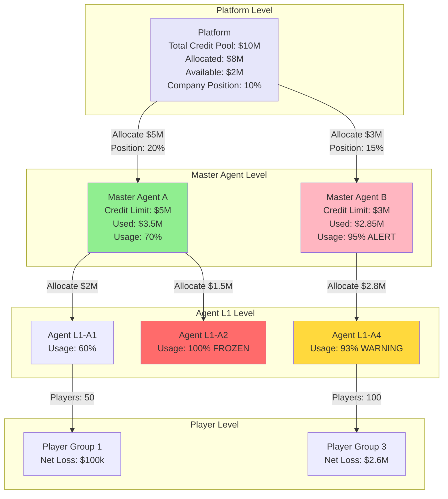
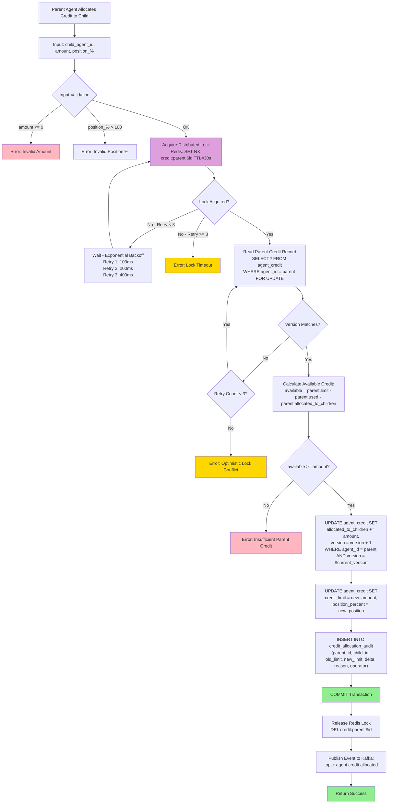
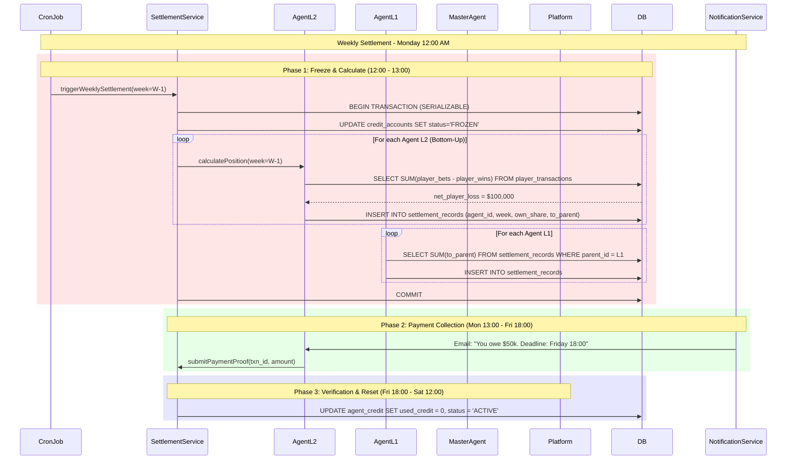

# Credit Network Technical Architecture

> **Business Requirements**: [Credit Network Requirements](../../requirements/07_Agent_Operations/Credit_Network_Requirements.md)
> **Canonical Source**: [source-archive/07_Agent_Center/07-02_Credit_Network_Logic.md](../../source-archive/07_Agent_Center/07-02_Credit_Network_Logic.md)
> **View Type**: Technical Architecture
> **Target Audience**: Architects, Backend Developers

---

## 1. System Architecture Overview

The Credit Network system manages hierarchical credit allocation, position taking calculations, and periodic settlement across the agent tree structure. It uses distributed locking, optimistic concurrency control, and event-driven architecture.

---

## 2. Credit Propagation Tree Architecture



---

## 3. Credit Allocation Flow (Concurrency Control)



---

## 4. Concurrency Control Design

| Concurrency Problem | Scenario | Solution | Implementation |
|---------------------|----------|----------|----------------|
| **Duplicate allocation** | Parent simultaneously allocates to 2 children, total exceeds available | Redis distributed lock | `SET NX credit:parent:${id}` TTL=30s |
| **Version conflict** | 2 operations simultaneously modify parent's `allocated_to_children` | Optimistic locking | `WHERE version = ? AND UPDATE version = version + 1` |
| **Over-allocation** | Child A receives credit, parent's available insufficient for Child B | Pessimistic locking | `SELECT ... FOR UPDATE` |
| **Revocation conflict** | Parent revokes credit while child is using it | Check child used credit | `child.used_credit <= new_limit` |
| **Deadlock** | Parent A locks Child B, Parent B locks Child A | Ordered locking | Always lock `MIN(parent_id, child_id)` first |

---

## 5. Weekly Settlement Sequence



---

## 6. Database Schema

### 6.1 agent_credit Table

```sql
CREATE TABLE agent_credit (
    agent_id BIGINT PRIMARY KEY,
    tenant_id VARCHAR(32) NOT NULL,
    parent_id BIGINT,
    credit_limit DECIMAL(15,2) NOT NULL DEFAULT 0.00,
    used_credit DECIMAL(15,2) NOT NULL DEFAULT 0.00,
    allocated_to_children DECIMAL(15,2) NOT NULL DEFAULT 0.00,
    position_percent DECIMAL(5,2) NOT NULL DEFAULT 0.00,
    max_position DECIMAL(5,2) NOT NULL DEFAULT 100.00,
    status VARCHAR(20) NOT NULL DEFAULT 'ACTIVE',
    version INT NOT NULL DEFAULT 0,
    frozen_at TIMESTAMP,
    last_settlement TIMESTAMP,
    created_at TIMESTAMP DEFAULT CURRENT_TIMESTAMP,
    updated_at TIMESTAMP DEFAULT CURRENT_TIMESTAMP ON UPDATE CURRENT_TIMESTAMP,

    INDEX idx_tenant (tenant_id),
    INDEX idx_parent (parent_id),
    INDEX idx_status (status)
) ENGINE=InnoDB DEFAULT CHARSET=utf8mb4;
```

### 6.2 settlement_records Table

```sql
CREATE TABLE settlement_records (
    record_id BIGINT PRIMARY KEY AUTO_INCREMENT,
    tenant_id VARCHAR(32) NOT NULL,
    agent_id BIGINT NOT NULL,
    parent_id BIGINT,
    settlement_week VARCHAR(10) NOT NULL,
    player_loss DECIMAL(15,2) NOT NULL DEFAULT 0.00,
    own_share DECIMAL(15,2) NOT NULL DEFAULT 0.00,
    to_parent DECIMAL(15,2) NOT NULL DEFAULT 0.00,
    to_platform DECIMAL(15,2) NOT NULL DEFAULT 0.00,
    payment_status VARCHAR(20) DEFAULT 'PENDING',
    payment_txn_id VARCHAR(100),
    verified_at TIMESTAMP,
    created_at TIMESTAMP DEFAULT CURRENT_TIMESTAMP,

    INDEX idx_agent_week (agent_id, settlement_week),
    INDEX idx_parent_week (parent_id, settlement_week),
    INDEX idx_payment_status (payment_status),
    UNIQUE KEY uk_agent_week (agent_id, settlement_week)
) ENGINE=InnoDB DEFAULT CHARSET=utf8mb4;
```

### 6.3 credit_allocation_audit Table

```sql
CREATE TABLE credit_allocation_audit (
    audit_id BIGINT PRIMARY KEY AUTO_INCREMENT,
    tenant_id VARCHAR(32) NOT NULL,
    parent_id BIGINT NOT NULL,
    child_id BIGINT NOT NULL,
    old_limit DECIMAL(15,2),
    new_limit DECIMAL(15,2),
    delta DECIMAL(15,2),
    old_position DECIMAL(5,2),
    new_position DECIMAL(5,2),
    reason VARCHAR(500),
    operator VARCHAR(100),
    created_at TIMESTAMP DEFAULT CURRENT_TIMESTAMP,

    INDEX idx_parent_child (parent_id, child_id),
    INDEX idx_created (created_at)
) ENGINE=InnoDB DEFAULT CHARSET=utf8mb4;
```

---

## 7. Kafka Event Schema

```json
{
  "event_type": "agent.credit.allocated",
  "timestamp": "2026-01-27T15:30:00Z",
  "data": {
    "parent_id": "agent_001",
    "child_id": "agent_002",
    "old_limit": 1000000,
    "new_limit": 1500000,
    "delta": 500000,
    "position_percent": 45.0,
    "parent_available_after": 500000,
    "operator": "admin_123",
    "reason": "Performance upgrade"
  }
}
```

**Downstream Consumers**:
- **Risk Management Service**: Monitor abnormal credit changes (e.g., sudden 100% increase)
- **Notification Service**: Send email/SMS notifications
- **Analytics Service**: Track credit allocation trends, agent activity
- **Audit Service**: Archive audit logs (7-year retention)

---

## 8. Error Code Definitions

```java
public enum CreditErrorCode {
    CREDIT_001("INVALID_AMOUNT", 400, "Allocation amount must be > 0"),
    CREDIT_002("INVALID_POSITION", 400, "Position percentage must be <= 100%"),
    CREDIT_003("EXCEEDS_PARENT_LIMIT", 403, "Exceeds parent max position limit"),
    CREDIT_004("LOCK_TIMEOUT", 409, "Distributed lock acquisition timeout"),
    CREDIT_005("OPTIMISTIC_LOCK_CONFLICT", 409, "Optimistic lock version conflict"),
    CREDIT_006("INSUFFICIENT_PARENT_CREDIT", 403, "Parent available credit insufficient"),
    CREDIT_007("CANNOT_REDUCE_BELOW_USED", 409, "Cannot reduce below child used credit");

    private final String code;
    private final int httpStatus;
    private final String description;

    CreditErrorCode(String code, int httpStatus, String description) {
        this.code = code;
        this.httpStatus = httpStatus;
        this.description = description;
    }
}
```

---

## 9. Risk Control Integration

The credit network risk detection must integrate with the risk framework for real-time monitoring.

```java
/**
 * Credit risk assessment integration
 * Called during credit allocation and settlement
 */
@Slf4j
@Service
@RequiredArgsConstructor
public class CreditRiskAssessmentService {

    private final RiskEngineClient riskEngineClient;
    private final AgentCreditDao agentCreditDao;

    /**
     * Evaluate risk before credit allocation
     */
    public RiskAssessment evaluateAllocation(Long parentId, Long childId, BigDecimal amount) {
        AgentCredit child = agentCreditDao.selectById(childId);

        RiskCheckRequest request = RiskCheckRequest.builder()
            .agentId(childId)
            .parentId(parentId)
            .requestedAmount(amount)
            .registrationAge(child.getRegistrationAgeDays())
            .historicalOverdueCount(child.getOverdueCount())
            .build();

        return riskEngineClient.evaluate(request);
    }
}
```

---

## 10. SmartAdmin Architecture Mapping

| Layer | Class | Responsibility |
|-------|-------|---------------|
| **Controller** | `CreditNetworkController` | REST API endpoints for credit allocation |
| **Service** | `CreditNetworkService` | Business logic, single-table queries via Dao |
| **Manager** | `CreditSettlementManager` | @Transactional settlement operations, multi-table writes |
| **Dao** | `AgentCreditDao` | MyBatis Plus mapper for agent_credit table |
| **Entity** | `AgentCreditEntity` | Database entity mapping |

**Key Architectural Rules**:
- `@Transactional(rollbackFor = Throwable.class)` in Manager only
- Service uses `io.vavr.control.Option` for nullable returns
- Constructor injection via `@RequiredArgsConstructor` + `private final`

---

**Document Version**: 4.0.0
**Last Updated**: 2026-02-09
**Maintenance Team**: Agent Network Team & Backend Team
