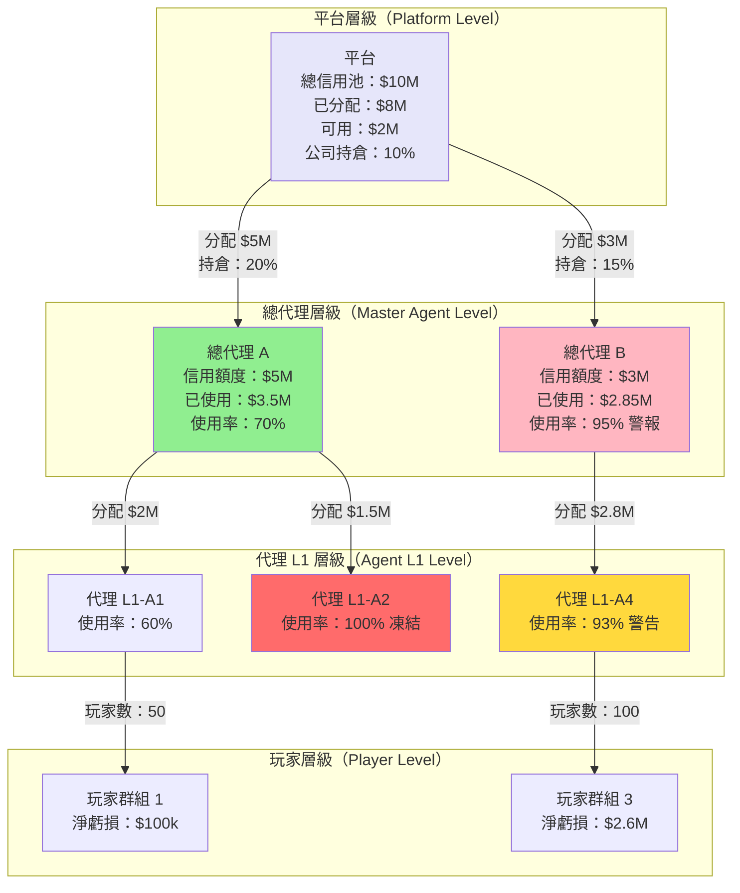
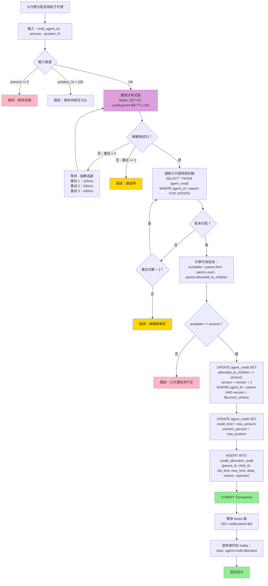
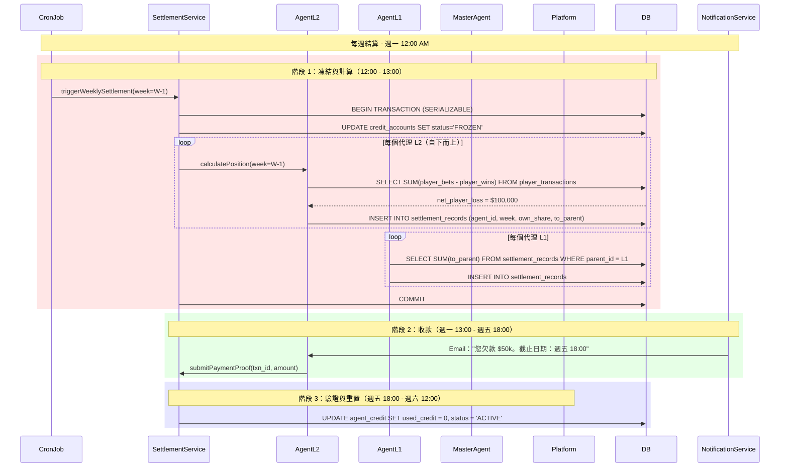

# 信用網絡技術架構（Credit Network Technical Architecture）

> **業務需求**: [信用網絡需求（Credit Network Requirements）](../../requirements/07_Agent_Operations/Credit_Network_Requirements.md)
> **規範來源**: [source-archive/07_Agent_Center/07-02_Credit_Network_Logic.md](../../source-archive/07_Agent_Center/07-02_Credit_Network_Logic.md)
> **視角**: 技術架構（Technical Architecture）
> **目標讀者**: 架構師、後端開發人員（Architects, Backend Developers）

---

## 1. 系統架構概覽（System Architecture Overview）

信用網絡（Credit Network）系統管理分層的信用額度分配、持倉（Position Taking）計算以及跨代理樹結構的定期結算（Settlement）。它使用分佈式鎖、樂觀並發控制和事件驅動架構。

---

## 2. 信用傳播樹架構（Credit Propagation Tree Architecture）



---

## 3. 信用分配流程（Credit Allocation Flow）- 並發控制（Concurrency Control）



---

## 4. 並發控制設計（Concurrency Control Design）

| 並發問題 | 場景 | 解決方案 | 實現方式 |
|---------|------|---------|---------|
| **重複分配** | 父代理同時分配給 2 個子代理，總額超過可用額度 | Redis 分佈式鎖 | `SET NX credit:parent:${id}` TTL=30s |
| **版本衝突** | 2 個操作同時修改父代理的 `allocated_to_children` | 樂觀鎖 | `WHERE version = ? AND UPDATE version = version + 1` |
| **超額分配** | 子代理 A 收到信用，父代理可用額度不足以分配給子代理 B | 悲觀鎖 | `SELECT ... FOR UPDATE` |
| **撤銷衝突** | 父代理撤銷信用時子代理正在使用 | 檢查子代理已使用信用 | `child.used_credit <= new_limit` |
| **死鎖** | 父代理 A 鎖定子代理 B，父代理 B 鎖定子代理 A | 有序加鎖 | 始終先鎖定 `MIN(parent_id, child_id)` |

---

## 5. 每週結算序列（Weekly Settlement Sequence）



---

## 6. 資料庫架構（Database Schema）

### 6.1 agent_credit 表

```sql
CREATE TABLE agent_credit (
    agent_id BIGINT PRIMARY KEY,
    tenant_id VARCHAR(32) NOT NULL,
    parent_id BIGINT,
    credit_limit DECIMAL(15,2) NOT NULL DEFAULT 0.00,
    used_credit DECIMAL(15,2) NOT NULL DEFAULT 0.00,
    allocated_to_children DECIMAL(15,2) NOT NULL DEFAULT 0.00,
    position_percent DECIMAL(5,2) NOT NULL DEFAULT 0.00,
    max_position DECIMAL(5,2) NOT NULL DEFAULT 100.00,
    status VARCHAR(20) NOT NULL DEFAULT 'ACTIVE',
    version INT NOT NULL DEFAULT 0,
    frozen_at TIMESTAMP,
    last_settlement TIMESTAMP,
    created_at TIMESTAMP DEFAULT CURRENT_TIMESTAMP,
    updated_at TIMESTAMP DEFAULT CURRENT_TIMESTAMP ON UPDATE CURRENT_TIMESTAMP,

    INDEX idx_tenant (tenant_id),
    INDEX idx_parent (parent_id),
    INDEX idx_status (status)
) ENGINE=InnoDB DEFAULT CHARSET=utf8mb4;
```

### 6.2 settlement_records 表

```sql
CREATE TABLE settlement_records (
    record_id BIGINT PRIMARY KEY AUTO_INCREMENT,
    tenant_id VARCHAR(32) NOT NULL,
    agent_id BIGINT NOT NULL,
    parent_id BIGINT,
    settlement_week VARCHAR(10) NOT NULL,
    player_loss DECIMAL(15,2) NOT NULL DEFAULT 0.00,
    own_share DECIMAL(15,2) NOT NULL DEFAULT 0.00,
    to_parent DECIMAL(15,2) NOT NULL DEFAULT 0.00,
    to_platform DECIMAL(15,2) NOT NULL DEFAULT 0.00,
    payment_status VARCHAR(20) DEFAULT 'PENDING',
    payment_txn_id VARCHAR(100),
    verified_at TIMESTAMP,
    created_at TIMESTAMP DEFAULT CURRENT_TIMESTAMP,

    INDEX idx_agent_week (agent_id, settlement_week),
    INDEX idx_parent_week (parent_id, settlement_week),
    INDEX idx_payment_status (payment_status),
    UNIQUE KEY uk_agent_week (agent_id, settlement_week)
) ENGINE=InnoDB DEFAULT CHARSET=utf8mb4;
```

### 6.3 credit_allocation_audit 表

```sql
CREATE TABLE credit_allocation_audit (
    audit_id BIGINT PRIMARY KEY AUTO_INCREMENT,
    tenant_id VARCHAR(32) NOT NULL,
    parent_id BIGINT NOT NULL,
    child_id BIGINT NOT NULL,
    old_limit DECIMAL(15,2),
    new_limit DECIMAL(15,2),
    delta DECIMAL(15,2),
    old_position DECIMAL(5,2),
    new_position DECIMAL(5,2),
    reason VARCHAR(500),
    operator VARCHAR(100),
    created_at TIMESTAMP DEFAULT CURRENT_TIMESTAMP,

    INDEX idx_parent_child (parent_id, child_id),
    INDEX idx_created (created_at)
) ENGINE=InnoDB DEFAULT CHARSET=utf8mb4;
```

---

## 7. Kafka 事件架構（Kafka Event Schema）

```json
{
  "event_type": "agent.credit.allocated",
  "timestamp": "2026-01-27T15:30:00Z",
  "data": {
    "parent_id": "agent_001",
    "child_id": "agent_002",
    "old_limit": 1000000,
    "new_limit": 1500000,
    "delta": 500000,
    "position_percent": 45.0,
    "parent_available_after": 500000,
    "operator": "admin_123",
    "reason": "Performance upgrade"
  }
}
```

**下游消費者**：
- **風險管理服務（Risk Management Service）**：監控異常信用變更（例如突然 100% 增加）
- **通知服務（Notification Service）**：發送電子郵件/簡訊通知
- **分析服務（Analytics Service）**：追蹤信用分配趨勢、代理活動
- **審計服務（Audit Service）**：歸檔審計日誌（7 年保留期）

---

## 8. 錯誤碼定義（Error Code Definitions）

```java
public enum CreditErrorCode {
    CREDIT_001("INVALID_AMOUNT", 400, "Allocation amount must be > 0"),
    CREDIT_002("INVALID_POSITION", 400, "Position percentage must be <= 100%"),
    CREDIT_003("EXCEEDS_PARENT_LIMIT", 403, "Exceeds parent max position limit"),
    CREDIT_004("LOCK_TIMEOUT", 409, "Distributed lock acquisition timeout"),
    CREDIT_005("OPTIMISTIC_LOCK_CONFLICT", 409, "Optimistic lock version conflict"),
    CREDIT_006("INSUFFICIENT_PARENT_CREDIT", 403, "Parent available credit insufficient"),
    CREDIT_007("CANNOT_REDUCE_BELOW_USED", 409, "Cannot reduce below child used credit");

    private final String code;
    private final int httpStatus;
    private final String description;

    CreditErrorCode(String code, int httpStatus, String description) {
        this.code = code;
        this.httpStatus = httpStatus;
        this.description = description;
    }
}
```

---

## 9. 風險控制整合（Risk Control Integration）

信用網絡風險檢測必須與風險框架整合以進行實時監控。

```java
/**
 * Credit risk assessment integration
 * Called during credit allocation and settlement
 */
@Slf4j
@Service
@RequiredArgsConstructor
public class CreditRiskAssessmentService {

    private final RiskEngineClient riskEngineClient;
    private final AgentCreditDao agentCreditDao;

    /**
     * Evaluate risk before credit allocation
     */
    public RiskAssessment evaluateAllocation(Long parentId, Long childId, BigDecimal amount) {
        AgentCredit child = agentCreditDao.selectById(childId);

        RiskCheckRequest request = RiskCheckRequest.builder()
            .agentId(childId)
            .parentId(parentId)
            .requestedAmount(amount)
            .registrationAge(child.getRegistrationAgeDays())
            .historicalOverdueCount(child.getOverdueCount())
            .build();

        return riskEngineClient.evaluate(request);
    }
}
```

---

## 10. SmartAdmin 架構映射（SmartAdmin Architecture Mapping）

| 層級 | 類別 | 職責 |
|-----|------|------|
| **Controller** | `CreditNetworkController` | 信用分配的 REST API 端點 |
| **Service** | `CreditNetworkService` | 業務邏輯，通過 Dao 進行單表查詢 |
| **Manager** | `CreditSettlementManager` | @Transactional 結算操作，多表寫入 |
| **Dao** | `AgentCreditDao` | agent_credit 表的 MyBatis Plus mapper |
| **Entity** | `AgentCreditEntity` | 資料庫實體映射 |

**關鍵架構規則**：
- `@Transactional(rollbackFor = Throwable.class)` 僅在 Manager 層
- Service 使用 `io.vavr.control.Option` 處理可空返回值
- 通過 `@RequiredArgsConstructor` + `private final` 進行構造器注入

---

**文檔版本**: 4.0.0
**最後更新**: 2026-02-09
**維護團隊**: 代理網絡團隊與後端團隊（Agent Network Team & Backend Team）
