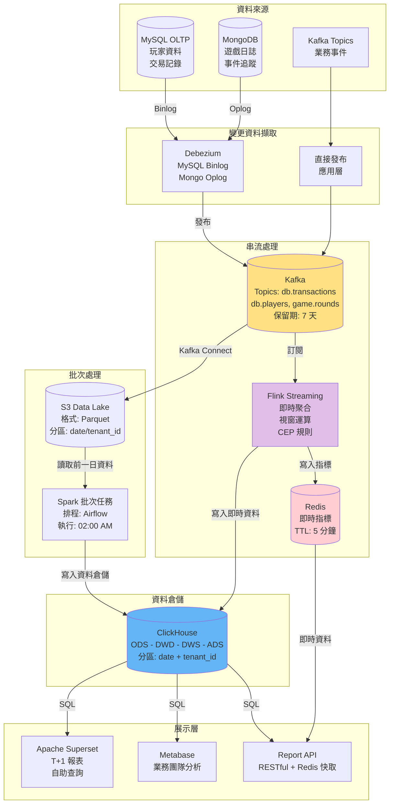
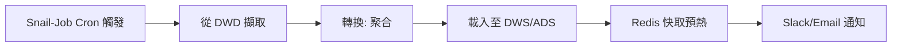

# 報表與商業智能技術架構（Reporting & BI Technical Architecture）

> **業務需求**: [Reporting Requirements](../../requirements/08_Analytics_Operations/01_Reporting_Requirements.md)
> **規範來源**: [source-archive/08_Analytics_BI/08-01_Reporting_BI.md](../../source-archive/08_Analytics_BI/08-01_Reporting_BI.md)
> **視角**: Technical Architecture
> **目標讀者**: Architects, Backend Developers

---

## 1. 架構總覽（Architecture Overview）

報表與商業智能系統採用 **Lambda Architecture 變體**，同時支援批次處理（Spark）和串流處理（Flink），以滿足 T+1 報表和準即時儀表板需求。

---

## 2. 資料管線架構（Data Pipeline Architecture）



---

## 3. 資料分層架構（Data Layering Architecture）（ODS-DWD-DWS-ADS）

### 3.1 四層架構（Four-Layer Architecture）

```text
+-----------------------------------------------------+
|  ADS (Application Data Service)                      |
|  - 預聚合報表                                         |
|  - API 端點資料                                       |
|  - Grafana / Metabase 資料來源                        |
+-----------------------------------------------------+
                 |
+-----------------------------------------------------+
|  DWS (Data Warehouse Summary)                        |
|  - 日/週/月聚合表                                      |
|  - 維度匯總（遊戲、玩家分群、日期）                      |
|  - 預計算指標（GGR, NGR, LTV, ARPU）                   |
+-----------------------------------------------------+
                 |
+-----------------------------------------------------+
|  DWD (Data Warehouse Detail)                         |
|  - 清洗後事實表                                        |
|  - 標準化維度表                                        |
|  - 資料品質驗證                                        |
+-----------------------------------------------------+
                 |
+-----------------------------------------------------+
|  ODS (Operational Data Store)                        |
|  - MySQL 主庫（OLTP）                                 |
|  - Kafka CDC 即時串流                                 |
|  - MongoDB 審計日誌                                   |
+-----------------------------------------------------+
```

### 3.2 分層比較矩陣（Layer Comparison Matrix）

| 屬性 | ODS | DWD | DWS | ADS |
|----------|-----|-----|-----|-----|
| **資料來源** | 業務資料庫（MySQL/Mongo） | ODS 層 | DWD 層 | DWS 層 |
| **顆粒度** | 原始明細 | 清洗後明細 | 聚合匯總 | 應用寬表 |
| **資料量** | 最大（TB） | 大（TB） | 中（GB） | 小（GB） |
| **更新頻率** | 準即時（CDC） | T+1 批次 | T+1 批次 | T+1 或即時 |
| **查詢頻率** | 極低（僅 ETL） | 低（鑽取分析） | 中（分析） | 極高（前端） |
| **保留期限** | 永久 | 2 年 | 3 年 | 6 個月 |
| **PII 遮罩** | 否（原始） | 是（完全遮罩） | 是 | 是 |

### 3.3 ETL 排程（Airflow DAG）

```text
02:00 - 02:15  ODS -> DWD（資料清洗 + PII 遮罩）
02:15 - 02:45  DWD -> DWS（聚合運算）
02:45 - 03:00  DWS -> ADS（寬表建構）
03:00 - 03:05  資料品質檢查
03:05          發送完成通知 + 報表可用
```

---

## 4. 報表排程配置（Report Scheduling Configuration）

### 4.1 Snail-Job 整合（Snail-Job Integration）

```yaml
# GGR/NGR 小時報表
job_name: generate_ggr_ngr_hourly
cron: 0 */1 * * * ?
handler: GgrNgrReportHandler
params:
  source_table: dwd.fact_bets
  target_table: dws.fact_ggr_ngr_hourly
  aggregation_level: hourly
retry: 3
timeout: 600  # 10 分鐘
```

```yaml
# 玩家活動日報表
job_name: generate_player_activity_daily
cron: 0 0 2 * * ?
handler: PlayerActivityReportHandler
params:
  source_table: dwd.fact_player_sessions
  target_table: dws.dim_player_activity_daily
  date: yesterday
retry: 3
timeout: 1800  # 30 分鐘
```

### 4.2 報表生成管線（Report Generation Pipeline）



---

## 5. 商業智能工具架構（BI Tool Architecture）

### 5.1 工具選擇矩陣（Tool Selection Matrix）

| 工具 | 開源 | 易用性 | 效能 | 成本 | 建議用途 |
|------|-----------|-------------|-------------|------|-----------------|
| **Grafana** | 是 | 高 | 優異 | 免費 | 即時監控、時間序列 |
| **Metabase** | 是 | 優異 | 良好 | 免費 | 自助分析、輕量級 BI |
| **Apache Superset** | 是 | 良好 | 非常好 | 免費 | 開發友善、重 SQL 分析 |
| **Tableau** | 否 | 優異 | 優異 | $$$$ | 企業級 BI、深度分析 |

### 5.2 分層工具策略（Layered Tool Strategy）

```text
+-----------------------------------------------------+
|  Grafana（即時監控）                                  |
|  - GGR/NGR 即時儀表板                                 |
|  - 風險事件監控                                       |
|  - 系統效能監控                                       |
+-----------------------------------------------------+
                 |
+-----------------------------------------------------+
|  Metabase（自助分析）                                 |
|  - 業務團隊自助查詢                                    |
|  - 玩家分群分析                                       |
|  - 活動成效分析                                       |
+-----------------------------------------------------+
                 |
+-----------------------------------------------------+
|  Apache Superset（進階分析）                          |
|  - 資料科學家深度分析                                  |
|  - 複雜 SQL 查詢                                      |
|  - 自訂視覺化                                         |
+-----------------------------------------------------+
                 |
+-----------------------------------------------------+
|  ClickHouse / PostgreSQL（資料倉儲）                  |
|  - DWS 層 + ADS 層                                   |
+-----------------------------------------------------+
```

---

## 6. 效能優化（Performance Optimization）

### 6.1 ClickHouse vs MySQL 基準測試（Benchmark）

| 操作 | MySQL（OLTP） | ClickHouse（OLAP） | 提升幅度 |
|-----------|-------------|-------------------|-------------|
| COUNT(*) - 1 億筆 | 30 秒 | 0.5 秒 | 60 倍 |
| SUM(amount) - 1 億筆 | 45 秒 | 0.8 秒 | 56 倍 |
| GROUP BY + AVG - 1 億筆 | 120 秒 | 2 秒 | 60 倍 |
| 複雜 JOIN（3 表）- 1000 萬筆 | 300 秒 | 5 秒 | 60 倍 |
| 寫入 TPS | 10,000 | 100,000+ | 10 倍 |

### 6.2 快取策略（Cache Strategy）

```text
快取鍵設計:
  report:{report_type}:{date}:{filters_hash}
  範例: report:ggr_hourly:2026-01-28:abc123

TTL 策略:
  - 熱門報表: 5 分鐘
  - 歷史報表: 1 小時
  - 自訂查詢: 不快取
```

### 6.3 速率限制（Rate Limiting）

| 限制 | 閾值 |
|-------|-----------|
| 每使用者每分鐘 | 10 次查詢 |
| 每租戶每分鐘 | 100 次查詢 |
| 匯出任務併發數 | 最多 5 個 |

---

## 7. 報表匯出架構（Report Export Architecture）

### 7.1 支援格式（Supported Formats）

| 格式 | 函式庫 | 最大容量 | 使用場景 |
|--------|---------|-------------|----------|
| **Excel (XLSX)** | Apache POI / EasyExcel | 1,048,576 列 | 多工作表維度報表 |
| **PDF** | iText / Flying Saucer | 無限制 | 封存、適合列印 |
| **CSV** | 串流寫入 | 數十億 | ETL 傳輸、大量匯出 |

### 7.2 非同步匯出架構（Async Export Architecture）（大型匯出 > 10 萬列）


---

## 8. 資料治理（Data Governance）

### 8.1 PII 遮罩規則（PII Masking Rules）

```text
姓名  -> R** C**
電話 -> 0912***789
身份證    -> A12****89
Email -> r***@gmail.com
```

### 8.2 資料保留（Data Retention）

| 層級 | 期限 | 儲存 |
|------|----------|---------|
| **熱資料（SSD）** | 最近 3 個月 | 高頻查詢 |
| **溫資料（HDD）** | 3 個月 - 1 年 | 偶爾查詢 |
| **冷資料（S3 Glacier）** | 1 年以上 | 僅供審計封存 |

### 8.3 資料修正（Data Correction）（冪等覆寫）

當上游產生作廢交易時:

```sql
-- 策略: 刪除受影響分區並重跑 ETL
ALTER TABLE dws_revenue DROP PARTITION '2023-10-01';
-- 然後針對該日期從 ODS 重新執行 ETL
```

### 8.4 多租戶隔離（Multi-Tenant Isolation）

- **模式**: 透過 `tenant_id` 分區鍵進行邏輯隔離
- **強制執行**: 所有查詢必須包含 `WHERE tenant_id = ?`（否則拒絕）
- **優勢**: 支援跨租戶平台級報表（例如：全站 GGR 總計）

---

---

## 9. SmartAdmin 實作（SmartAdmin Implementation）

### 9.1 報表服務層（Report Service Layer）

```java
@Service
@RequiredArgsConstructor
public class ReportService {

    private final ReportDao reportDao;
    private final ReportManager reportManager;
    private final RedisTemplate<String, String> redisTemplate;

    private static final String CACHE_KEY_PREFIX = "report:";

    /**
     * Query GGR/NGR report with Redis caching.
     * Uses Vavr Option for null-safety per SmartAdmin patterns.
     */
    public ResponseDTO<GgrNgrReportVO> getGgrNgrReport(ReportQueryForm form) {
        String cacheKey = buildCacheKey("ggr_ngr", form);

        // Check cache first
        String cached = redisTemplate.opsForValue().get(cacheKey);
        if (cached != null) {
            return ResponseDTO.ok(JSON.parseObject(cached, GgrNgrReportVO.class));
        }

        // Query from ClickHouse via Dao
        Option<GgrNgrReportEntity> result = Option.of(
            reportDao.selectGgrNgrReport(form.getTenantId(), form.getStartDate(), form.getEndDate())
        );

        return result
            .map(entity -> {
                GgrNgrReportVO vo = SmartBeanUtil.copy(entity, GgrNgrReportVO.class);
                // Cache for 5 minutes (hot report)
                redisTemplate.opsForValue().set(cacheKey, JSON.toJSONString(vo),
                    Duration.ofMinutes(5));
                return ResponseDTO.ok(vo);
            })
            .getOrElse(() -> ResponseDTO.ok(GgrNgrReportVO.empty()));
    }

    /**
     * Request async export for large datasets.
     */
    public ResponseDTO<ExportTaskVO> requestAsyncExport(ExportRequestForm form) {
        return reportManager.createExportTask(form);
    }
}
```

### 9.2 報表管理層（Report Manager Layer）

```java
@Component
@RequiredArgsConstructor
public class ReportManager {

    private final ExportTaskDao exportTaskDao;
    private final KafkaTemplate<String, String> kafkaTemplate;

    /**
     * Create async export task with Kafka queue.
     * @Transactional only allowed in Manager layer per SmartAdmin architecture.
     */
    @Transactional(rollbackFor = Throwable.class)
    public ResponseDTO<ExportTaskVO> createExportTask(ExportRequestForm form) {
        // Create task record
        ExportTaskEntity task = new ExportTaskEntity();
        task.setTenantId(form.getTenantId());
        task.setUserId(form.getUserId());
        task.setReportType(form.getReportType());
        task.setParameters(JSON.toJSONString(form.getParameters()));
        task.setStatus(ExportStatus.PENDING);
        exportTaskDao.insert(task);

        // Send to Kafka for async processing
        ExportTaskMessage message = SmartBeanUtil.copy(task, ExportTaskMessage.class);
        kafkaTemplate.send("export_task_queue", task.getId().toString(),
            JSON.toJSONString(message));

        return ResponseDTO.ok(SmartBeanUtil.copy(task, ExportTaskVO.class));
    }
}
```

### 9.3 資料庫結構（Database Schema）

```sql
-- DWS layer: Daily GGR/NGR aggregation table
CREATE TABLE dws_ggr_ngr_daily (
    id              BIGSERIAL PRIMARY KEY,
    tenant_id       BIGINT NOT NULL,
    report_date     DATE NOT NULL,
    total_bets      DECIMAL(18, 4) NOT NULL DEFAULT 0,
    total_wins      DECIMAL(18, 4) NOT NULL DEFAULT 0,
    ggr             DECIMAL(18, 4) NOT NULL DEFAULT 0,
    ngr             DECIMAL(18, 4) NOT NULL DEFAULT 0,
    player_count    INTEGER NOT NULL DEFAULT 0,
    bet_count       INTEGER NOT NULL DEFAULT 0,
    currency        VARCHAR(3) NOT NULL DEFAULT 'USD',
    created_at      TIMESTAMP NOT NULL DEFAULT NOW(),
    CONSTRAINT uk_ggr_daily UNIQUE (tenant_id, report_date, currency)
);

CREATE INDEX idx_ggr_daily_tenant ON dws_ggr_ngr_daily(tenant_id, report_date DESC);

-- Export task queue table
CREATE TABLE t_export_task (
    id              BIGSERIAL PRIMARY KEY,
    tenant_id       BIGINT NOT NULL,
    user_id         BIGINT NOT NULL,
    report_type     VARCHAR(50) NOT NULL,
    parameters      JSONB NOT NULL,
    status          VARCHAR(20) NOT NULL DEFAULT 'PENDING',
    file_url        VARCHAR(500),
    file_size       BIGINT,
    row_count       INTEGER,
    error_message   TEXT,
    started_at      TIMESTAMP,
    completed_at    TIMESTAMP,
    expires_at      TIMESTAMP,
    created_at      TIMESTAMP NOT NULL DEFAULT NOW(),
    updated_at      TIMESTAMP NOT NULL DEFAULT NOW()
);

CREATE INDEX idx_export_user ON t_export_task(tenant_id, user_id, created_at DESC);
CREATE INDEX idx_export_status ON t_export_task(status, created_at)
    WHERE status IN ('PENDING', 'PROCESSING');
```

---

**文件版本**: 4.0.0
**最後更新**: 2026-02-09
**維護團隊**: Data Team & BI Team
