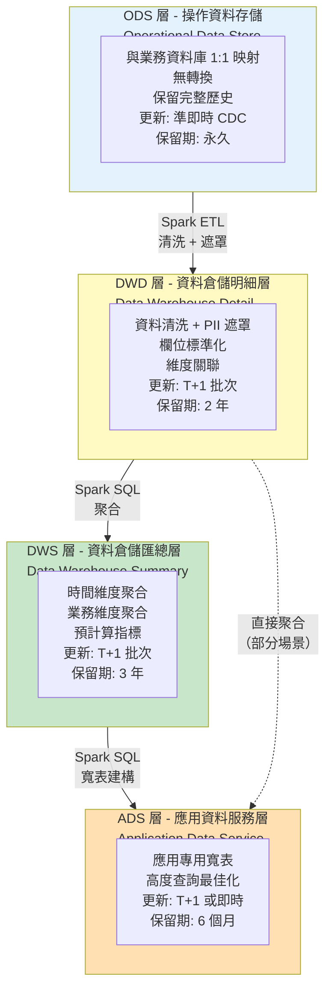
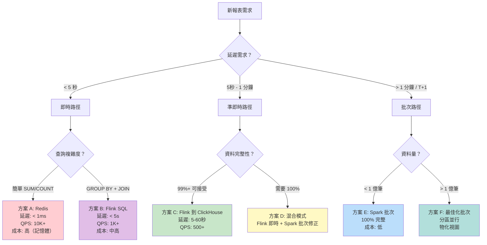

# BI 儀表板與資料管道技術架構（BI Dashboard & Data Pipeline Technical Architecture）

> **業務需求**: [BI Dashboard Requirements](../../requirements/08_Analytics_Operations/BI_Dashboard_Requirements.md)
> **規範來源**: [source-archive/08_Analytics_BI/08-04_Reporting_Architecture.md](../../source-archive/08_Analytics_BI/08-04_Reporting_Architecture.md)
> **視角**: Technical Architecture
> **目標讀者**: Architects, Backend Developers

---

## 1. 架構概覽（Architecture Overview）

BI 儀表板系統採用 Lambda Architecture 變體，具備雙重處理路徑。串流處理（Stream Processing，Flink）處理即時指標，而批次處理（Batch Processing，Spark）確保 T+1 報表的 100% 資料準確性。

---

## 2. 完整資料管道架構（Complete Data Pipeline Architecture）

```mermaid
flowchart TD
    subgraph SOURCES[資料來源<br/>Data Sources]
        DB1[(MySQL OLTP<br/>玩家、交易<br/>遊戲回合、VIP)]
        DB2[(MongoDB<br/>遊戲日誌<br/>事件追蹤)]
        KAFKA_SRC[Kafka Topics<br/>業務事件<br/>即時交易]
    end

    subgraph CDC[變更資料捕獲<br/>Change Data Capture]
        DEBEZIUM[Debezium<br/>MySQL Binlog 監聽器<br/>Mongo Oplog 監聽器]
    end

    DB1 -->|Binlog| DEBEZIUM
    DB2 -->|Oplog| DEBEZIUM

    subgraph STREAMING[串流處理<br/>Stream Processing]
        KAFKA[(Kafka<br/>Topics: db.transactions<br/>db.players, game.rounds<br/>保留期: 7 天)]
        FLINK[Flink Streaming<br/>即時聚合<br/>視窗計算<br/>CEP 規則]
        REDIS[(Redis<br/>即時指標快取<br/>線上人數、存款<br/>TTL: 5 分鐘)]
    end

    DEBEZIUM -->|發布| KAFKA
    KAFKA_SRC --> KAFKA
    KAFKA -->|訂閱| FLINK
    FLINK -->|寫入指標| REDIS

    subgraph BATCH[批次處理<br/>Batch Processing]
        S3[(S3 Data Lake<br/>格式: Parquet<br/>分區: date/tenant_id<br/>保留期: 永久)]
        SPARK[Spark 批次作業<br/>排程: Airflow<br/>執行時間: 02:00 AM<br/>清洗 + 遮罩 + 聚合)]
    end

    KAFKA -->|Kafka Connect 批次| S3
    S3 -->|讀取前一天資料| SPARK

    subgraph DWH[資料倉儲<br/>Data Warehouse]
        CLICKHOUSE[(ClickHouse / Doris<br/>ODS - DWD - DWS - ADS<br/>分區: date + tenant_id)]
    end

    SPARK -->|寫入分層表| CLICKHOUSE
    FLINK -->|寫入即時表| CLICKHOUSE

    subgraph APPS[應用層<br/>Application Layer]
        DASHBOARD[營運儀表板<br/>即時監控<br/>KPI 追蹤]
        REPORT[報表中心<br/>業務報表<br/>代理商結算]
        ALERT[告警系統<br/>風險告警<br/>異常偵測]
    end

    CLICKHOUSE --> DASHBOARD
    CLICKHOUSE --> REPORT
    REDIS --> ALERT

    subgraph GOVERNANCE[資料治理<br/>Data Governance]
        MASKING[資料遮罩<br/>PII 保護<br/>敏感欄位加密]
        QUALITY[資料品質<br/>完整性檢查<br/>一致性驗證]
        LINEAGE[資料血緣<br/>來源追蹤<br/>影響分析]
    end

    SPARK -.-> MASKING
    SPARK -.-> QUALITY
    CLICKHOUSE -.-> LINEAGE

    style KAFKA fill:#FFE082
    style FLINK fill:#E1BEE7
    style REDIS fill:#FFCDD2
    style CLICKHOUSE fill:#64B5F6
    style S3 fill:#C8E6C9
    style SPARK fill:#81C784
```

---

## 3. 資料分層架構詳情（Data Layering Architecture Detail）



---

## 4. 即時 vs 批次處理決策矩陣（Real-time vs Batch Processing Decision Matrix）



### 4.1 方案比較矩陣（Solution Comparison Matrix）

| 方案 | 延遲 | 完整性 | 查詢複雜度 | 月成本 | QPS | 使用場景 |
|----------|---------|-------------|-----------------|-----------|-----|----------|
| **A: Redis** | < 1ms | 可能遺漏 | 簡單（SUM/COUNT） | ~$600 | 10K+ | 線上人數、今日存款 |
| **B: Flink SQL** | < 5s | 99%+ | 中等（GROUP BY） | ~$3,000 | 1K+ | 即時排行榜 |
| **C: Flink->CH** | 5-60s | 99%+ | 高（任意 SQL） | ~$4,500 | 500+ | 營運儀表板 |
| **D: 混合模式** | 即時 + T+1 修正 | 100% | 非常高 | ~$7,000 | 500+ | 財務報表 |
| **E: Spark 批次** | T+1 | 100% | 非常高 | ~$1,500 | N/A | 業務報表 |
| **F: 最佳化批次** | T+1 | 100% | 非常高 | ~$10,000 | N/A | PB 級分析 |

### 4.2 報表與方案對應（Report-to-Solution Mapping）

| 報表 | 延遲需求 | 複雜度 | 完整性 | 方案 |
|--------|-------------|-----------|-------------|----------|
| 線上玩家數 | < 1s | 簡單 COUNT | 近似值可接受 | A: Redis |
| 今日存款總額 | < 5s | 簡單 SUM | 近似值可接受 | A: Redis |
| 即時遊戲排行榜 | < 5s | GROUP BY + ORDER | 99%+ | B: Flink SQL |
| 營運 KPI 儀表板 | < 1 分鐘 | 多維度 | 99%+ | C: Flink->CH |
| 每日財務報表 | T+1 | 多表 JOIN | 100% | E: Spark 批次 |
| 代理商結算 | T+1 | 複雜 | 100% | D: 混合模式 |
| 風險即時告警 | < 5s | CEP 規則 | 99%+ | B: Flink SQL |
| 玩家 LTV 分析 | T+1 | ML 模型 | 100% | F: 最佳化批次 |

---

## 5. 關鍵設計決策（Key Design Decisions）

### 5.1 為何使用 Data Lake（S3）？

```java
/**
 * Data Lake 設計理由：
 * 1. ClickHouse DELETE 成本高；S3 作為不可變資料來源
 * 2. 支援資料回填、重新計算、ML 訓練
 * 3. S3 Glacier 成本：$0.004/GB/月
 */
```

### 5.2 為何同時使用 Flink 和 Spark？

```java
/**
 * 雙處理引擎理由：
 * - Flink：串流處理器，毫秒級延遲，適合即時聚合
 * - Spark：批次處理器，支援複雜 ETL 邏輯，適合 T+1 報表
 * - 互補性：Flink 處理即時，Spark 處理批次
 */
```

### 5.3 為何 Redis TTL 是 5 分鐘？

```java
/**
 * Redis 快取 TTL 設計：
 * - 目的：為高頻率儀表板查詢（每 10 秒刷新）提供快取
 * - 策略：超過 5 分鐘的資料從 ClickHouse 查詢
 * - 成本：Redis 記憶體昂貴（$0.15/GB/小時），不適合長期存儲
 */
```

### 5.4 為何選擇 ClickHouse 而非 MySQL？

```java
/**
 * OLAP 引擎選擇：
 * - 效能：列式存儲，聚合查詢快 100-1000 倍
 * - 範例：對 10 億筆記錄執行 SUM(amount)：MySQL（30秒+），ClickHouse（< 1秒）
 * - 限制：不支援頻繁 UPDATE/DELETE，僅限 OLAP
 */
```

---

## 6. ETL 品質控制（ETL Quality Control）

### 6.1 每層品質檢查（Quality Checks Per Layer）

```sql
-- ODS 到 DWD 檢查：記錄數一致性
SELECT
    'ods_transactions' AS source,
    COUNT(*) AS source_count,
    (SELECT COUNT(*) FROM dwd_transaction_detail
     WHERE date = '2026-02-08') AS target_count,
    CASE WHEN source_count = target_count THEN 'PASS' ELSE 'FAIL' END AS status
FROM ods_transactions
WHERE date = '2026-02-08';

-- DWD 到 DWS 檢查：聚合準確性
SELECT
    date,
    SUM(amount) AS dwd_total,
    (SELECT total_revenue FROM dws_daily_revenue
     WHERE date = '2026-02-08') AS dws_total,
    ABS(dwd_total - dws_total) < 0.01 AS is_accurate
FROM dwd_transaction_detail
WHERE date = '2026-02-08';
```

### 6.2 品質閾值規則（Quality Threshold Rules）

| 檢查項目 | 閾值 | 失敗時動作 |
|-------|-----------|-------------------|
| 記錄數不符 | > 0.1% 差異 | 阻擋下游 ETL + 告警 |
| NULL 值百分比 | > 5% | 告警資料工程團隊 |
| 重複記錄 | > 0 | 阻擋下游 ETL + 告警 |
| 異常率 | > 5% | 暫停管道 + 告警 |

---

## 7. 資料修正實作（Data Correction Implementation）

```sql
-- 冪等覆寫：刪除分區並重新執行 ETL
ALTER TABLE dws_revenue DROP PARTITION '2023-10-01';

-- 為特定日期重新執行 ETL 管道
-- Airflow 命令：airflow trigger_dag etl_dws_revenue --conf '{"date": "2023-10-01"}'
```

---

## 8. 多租戶 OLAP 策略（Multi-Tenant OLAP Strategy）

```sql
-- 所有表按 tenant_id 分區
-- 查詢必須包含 tenant_id 過濾條件

-- 租戶級查詢（必須）
SELECT date, SUM(ggr) AS total_ggr
FROM dws_daily_revenue
WHERE tenant_id = 'tenant_001'
  AND date BETWEEN '2026-01-01' AND '2026-01-31'
GROUP BY date;

-- 平台級查詢（僅管理員）
SELECT tenant_id, SUM(ggr) AS total_ggr
FROM dws_daily_revenue
WHERE date BETWEEN '2026-01-01' AND '2026-01-31'
GROUP BY tenant_id
ORDER BY total_ggr DESC;
```

---

## 9. 營運監控（Operational Monitoring）

### 9.1 ETL 監控目標（ETL Monitoring Targets）

| 指標 | 目標 | 告警閾值 |
|--------|--------|----------------|
| 每層 ETL 執行時間 | < 15 分鐘 | > 20 分鐘 |
| 整體 ETL 管道 | < 1 小時 | > 1.5 小時 |
| ADS 層資料可用時間 | 03:00 AM 前 | 03:30 AM 後（SLA: 99.5%） |
| 資料品質檢查通過率 | 100% | 任何失敗 |
| ADS 查詢延遲 | < 3秒（P95） | > 5秒 |
| 儲存成本（ODS: 70%） | 預算目標 | > 預算 110% |

---

## 10. SmartAdmin 實作（SmartAdmin Implementation）

### 10.1 儀表板查詢 Service

```java
@Service
@RequiredArgsConstructor
public class DashboardQueryService {

    private final DashboardMetricsDao metricsDao;
    private final DashboardCacheManager cacheManager;

    /**
     * Get real-time KPI metrics using Vavr Option.
     */
    public Option<DashboardKpiVO> getRealTimeKpi(Long tenantId) {
        // Try cache first
        Option<DashboardKpiVO> cached = cacheManager.getCachedKpi(tenantId);
        if (cached.isDefined()) {
            return cached;
        }

        return Option.of(metricsDao.selectLatestKpi(tenantId))
            .map(entity -> SmartBeanUtil.copy(entity, DashboardKpiVO.class));
    }

    /**
     * Query historical metrics by date range.
     */
    public ResponseDTO<PageResult<DashboardMetricsVO>> queryHistoricalMetrics(DashboardQueryForm form) {
        Page<DashboardMetricsEntity> page = SmartPageUtil.convert2PageQuery(form);
        return ResponseDTO.ok(metricsDao.selectByDateRange(page, form));
    }
}
```

### 10.2 ETL 品質 Manager

```java
@Component
@RequiredArgsConstructor
public class EtlQualityManager {

    private final EtlJobDao etlJobDao;
    private final EtlQualityCheckDao qualityCheckDao;

    /**
     * Record ETL quality check results.
     * @Transactional only allowed in Manager layer per SmartAdmin architecture.
     */
    @Transactional(rollbackFor = Throwable.class)
    public ResponseDTO<Void> recordQualityCheck(EtlQualityCheckForm form) {
        EtlQualityCheckEntity check = SmartBeanUtil.copy(form, EtlQualityCheckEntity.class);
        check.setCheckedAt(LocalDateTime.now());
        qualityCheckDao.insert(check);

        // Update ETL job status if quality check failed
        if (!form.isPassed()) {
            EtlJobEntity job = etlJobDao.selectById(form.getJobId());
            job.setStatus(EtlStatus.QUALITY_FAILED.getValue());
            etlJobDao.updateById(job);
        }

        return ResponseDTO.ok();
    }
}
```

### 10.3 資料庫架構（Database Schema）

```sql
-- Dashboard KPI metrics table
CREATE TABLE t_dashboard_kpi (
    id              BIGSERIAL PRIMARY KEY,
    tenant_id       BIGINT NOT NULL,
    metric_date     DATE NOT NULL,
    online_players  INTEGER NOT NULL DEFAULT 0,
    total_deposits  DECIMAL(18, 2) NOT NULL DEFAULT 0,
    total_withdrawals DECIMAL(18, 2) NOT NULL DEFAULT 0,
    total_ggr       DECIMAL(18, 2) NOT NULL DEFAULT 0,
    new_registrations INTEGER NOT NULL DEFAULT 0,
    active_players  INTEGER NOT NULL DEFAULT 0,
    created_at      TIMESTAMP NOT NULL DEFAULT NOW(),
    CONSTRAINT uk_dashboard_kpi UNIQUE (tenant_id, metric_date)
);

CREATE INDEX idx_kpi_tenant_date ON t_dashboard_kpi(tenant_id, metric_date DESC);

-- ETL job tracking table
CREATE TABLE t_etl_job (
    id              BIGSERIAL PRIMARY KEY,
    job_name        VARCHAR(100) NOT NULL,
    layer           VARCHAR(20) NOT NULL,
    source_table    VARCHAR(100) NOT NULL,
    target_table    VARCHAR(100) NOT NULL,
    status          SMALLINT NOT NULL DEFAULT 0,
    started_at      TIMESTAMP NOT NULL,
    completed_at    TIMESTAMP,
    records_processed BIGINT,
    error_message   TEXT,
    created_at      TIMESTAMP NOT NULL DEFAULT NOW()
);

CREATE INDEX idx_etl_job_status ON t_etl_job(status, started_at DESC);

-- ETL quality check results
CREATE TABLE t_etl_quality_check (
    id              BIGSERIAL PRIMARY KEY,
    job_id          BIGINT NOT NULL REFERENCES t_etl_job(id),
    check_type      VARCHAR(50) NOT NULL,
    source_count    BIGINT,
    target_count    BIGINT,
    variance_pct    DECIMAL(5, 2),
    passed          BOOLEAN NOT NULL,
    error_details   JSONB,
    checked_at      TIMESTAMP NOT NULL DEFAULT NOW()
);

CREATE INDEX idx_quality_check_job ON t_etl_quality_check(job_id);

-- Data lineage tracking
CREATE TABLE t_data_lineage (
    id              BIGSERIAL PRIMARY KEY,
    source_layer    VARCHAR(20) NOT NULL,
    source_table    VARCHAR(100) NOT NULL,
    target_layer    VARCHAR(20) NOT NULL,
    target_table    VARCHAR(100) NOT NULL,
    transformation  VARCHAR(50) NOT NULL,
    column_mapping  JSONB,
    created_at      TIMESTAMP NOT NULL DEFAULT NOW()
);

CREATE INDEX idx_lineage_source ON t_data_lineage(source_table);
CREATE INDEX idx_lineage_target ON t_data_lineage(target_table);
```

---

**Document Version**: 4.0.0
**Last Updated**: 2026-02-09
**Maintenance Team**: Data Team & Platform Team
