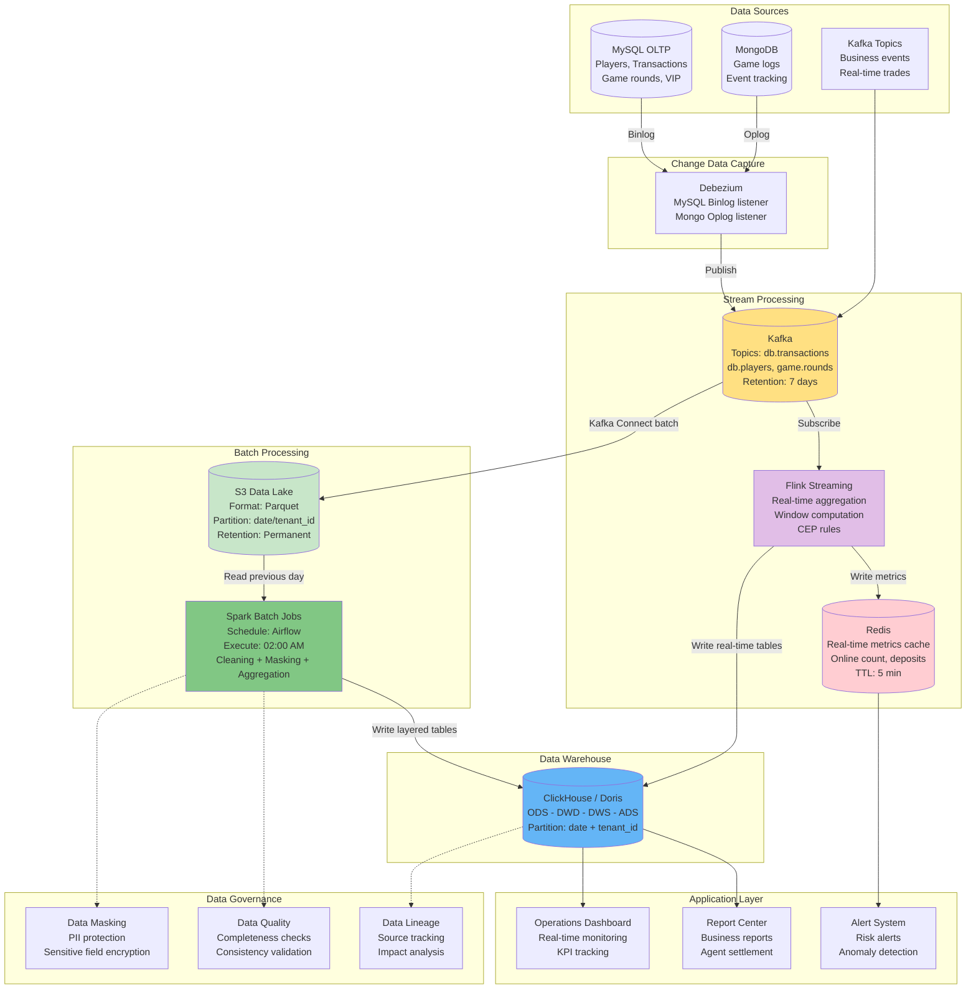
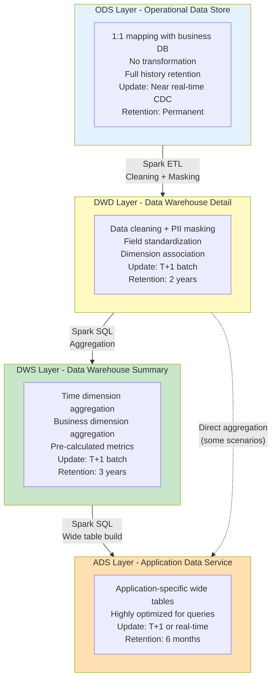
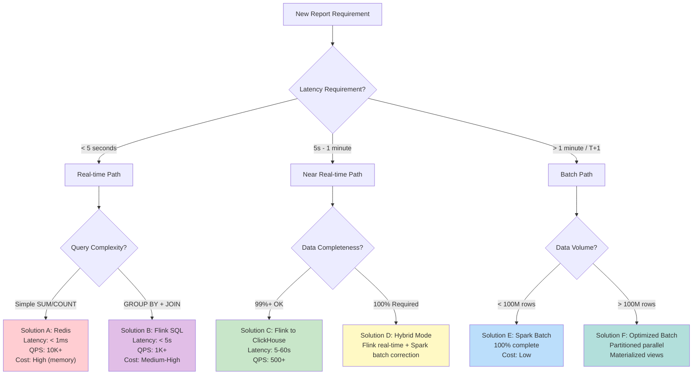

# BI Dashboard & Data Pipeline Technical Architecture

> **Business Requirements**: [BI Dashboard Requirements](../../requirements/08_Analytics_Operations/BI_Dashboard_Requirements.md)
> **Canonical Source**: [source-archive/08_Analytics_BI/08-04_Reporting_Architecture.md](../../source-archive/08_Analytics_BI/08-04_Reporting_Architecture.md)
> **View Type**: Technical Architecture
> **Target Audience**: Architects, Backend Developers

---

## 1. Architecture Overview

The BI Dashboard system uses a Lambda Architecture variant with dual processing paths. Stream processing (Flink) handles real-time metrics, while batch processing (Spark) ensures 100% data accuracy for T+1 reports.

---

## 2. Complete Data Pipeline Architecture



---

## 3. Data Layering Architecture Detail



---

## 4. Real-time vs Batch Processing Decision Matrix



### 4.1 Solution Comparison Matrix

| Solution | Latency | Completeness | Query Complexity | Cost/Month | QPS | Use Case |
|----------|---------|-------------|-----------------|-----------|-----|----------|
| **A: Redis** | < 1ms | May miss | Simple (SUM/COUNT) | ~$600 | 10K+ | Online count, today's deposits |
| **B: Flink SQL** | < 5s | 99%+ | Medium (GROUP BY) | ~$3,000 | 1K+ | Real-time leaderboard |
| **C: Flink->CH** | 5-60s | 99%+ | High (any SQL) | ~$4,500 | 500+ | Operations dashboard |
| **D: Hybrid** | RT + T+1 fix | 100% | Very high | ~$7,000 | 500+ | Financial reports |
| **E: Spark Batch** | T+1 | 100% | Very high | ~$1,500 | N/A | Business reports |
| **F: Optimized** | T+1 | 100% | Very high | ~$10,000 | N/A | PB-scale analytics |

### 4.2 Report-to-Solution Mapping

| Report | Latency Need | Complexity | Completeness | Solution |
|--------|-------------|-----------|-------------|----------|
| Online player count | < 1s | Simple COUNT | Approximate OK | A: Redis |
| Today's deposit total | < 5s | Simple SUM | Approximate OK | A: Redis |
| Real-time game leaderboard | < 5s | GROUP BY + ORDER | 99%+ | B: Flink SQL |
| Operations KPI dashboard | < 1 min | Multi-dimension | 99%+ | C: Flink->CH |
| Daily financial report | T+1 | Multi-table JOIN | 100% | E: Spark Batch |
| Agent settlement | T+1 | Complex | 100% | D: Hybrid |
| Risk real-time alerts | < 5s | CEP rules | 99%+ | B: Flink SQL |
| Player LTV analysis | T+1 | ML model | 100% | F: Optimized |

---

## 5. Key Design Decisions

### 5.1 Why Data Lake (S3)?

```java
/**
 * Data Lake design rationale:
 * 1. ClickHouse DELETE is expensive; S3 serves as immutable data source
 * 2. Supports data backfill, recalculation, ML training
 * 3. S3 Glacier cost: $0.004/GB/month
 */
```

### 5.2 Why Both Flink and Spark?

```java
/**
 * Dual processing engine rationale:
 * - Flink: Stream processor, millisecond latency, ideal for real-time aggregation
 * - Spark: Batch processor, supports complex ETL logic, preferred for T+1 reports
 * - Complementary: Flink handles real-time, Spark handles batch
 */
```

### 5.3 Why Redis TTL is 5 Minutes?

```java
/**
 * Redis cache TTL design:
 * - Purpose: Cache for high-frequency dashboard queries (refreshed every 10s)
 * - Strategy: Data older than 5 min is queried from ClickHouse
 * - Cost: Redis memory is expensive ($0.15/GB/hour), not suitable for long-term storage
 */
```

### 5.4 Why ClickHouse Over MySQL?

```java
/**
 * OLAP engine selection:
 * - Performance: Columnar storage, 100-1000x faster for aggregation queries
 * - Example: SUM(amount) over 1 billion rows: MySQL (30s+), ClickHouse (< 1s)
 * - Limitation: Does not support frequent UPDATE/DELETE, OLAP only
 */
```

---

## 6. ETL Quality Control

### 6.1 Quality Checks Per Layer

```sql
-- ODS to DWD check: Record count consistency
SELECT
    'ods_transactions' AS source,
    COUNT(*) AS source_count,
    (SELECT COUNT(*) FROM dwd_transaction_detail
     WHERE date = '2026-02-08') AS target_count,
    CASE WHEN source_count = target_count THEN 'PASS' ELSE 'FAIL' END AS status
FROM ods_transactions
WHERE date = '2026-02-08';

-- DWD to DWS check: Aggregation accuracy
SELECT
    date,
    SUM(amount) AS dwd_total,
    (SELECT total_revenue FROM dws_daily_revenue
     WHERE date = '2026-02-08') AS dws_total,
    ABS(dwd_total - dws_total) < 0.01 AS is_accurate
FROM dwd_transaction_detail
WHERE date = '2026-02-08';
```

### 6.2 Quality Threshold Rules

| Check | Threshold | Action on Failure |
|-------|-----------|-------------------|
| Record count mismatch | > 0.1% difference | Block downstream ETL + alert |
| NULL value percentage | > 5% | Alert data engineering |
| Duplicate records | > 0 | Block downstream ETL + alert |
| Anomaly rate | > 5% | Halt pipeline + alert |

---

## 7. Data Correction Implementation

```sql
-- Idempotent Overwrite: Drop partition and re-run ETL
ALTER TABLE dws_revenue DROP PARTITION '2023-10-01';

-- Re-execute ETL pipeline for specific date
-- Airflow command: airflow trigger_dag etl_dws_revenue --conf '{"date": "2023-10-01"}'
```

---

## 8. Multi-Tenant OLAP Strategy

```sql
-- All tables partitioned by tenant_id
-- Queries MUST include tenant_id filter

-- Tenant-level query (mandatory)
SELECT date, SUM(ggr) AS total_ggr
FROM dws_daily_revenue
WHERE tenant_id = 'tenant_001'
  AND date BETWEEN '2026-01-01' AND '2026-01-31'
GROUP BY date;

-- Platform-level query (admin only)
SELECT tenant_id, SUM(ggr) AS total_ggr
FROM dws_daily_revenue
WHERE date BETWEEN '2026-01-01' AND '2026-01-31'
GROUP BY tenant_id
ORDER BY total_ggr DESC;
```

---

## 9. Operational Monitoring

### 9.1 ETL Monitoring Targets

| Metric | Target | Alert Threshold |
|--------|--------|----------------|
| ETL execution time per layer | < 15 minutes | > 20 minutes |
| Total ETL pipeline | < 1 hour | > 1.5 hours |
| ADS layer data available | Before 03:00 AM | After 03:30 AM (SLA: 99.5%) |
| Data quality check pass | 100% | Any failure |
| ADS query latency | < 3s (P95) | > 5s |
| Storage cost (ODS: 70%) | Budget target | > 110% of budget |

---

## 10. SmartAdmin Implementation

### 10.1 Dashboard Query Service

```java
@Service
@RequiredArgsConstructor
public class DashboardQueryService {

    private final DashboardMetricsDao metricsDao;
    private final DashboardCacheManager cacheManager;

    /**
     * Get real-time KPI metrics using Vavr Option.
     */
    public Option<DashboardKpiVO> getRealTimeKpi(Long tenantId) {
        // Try cache first
        Option<DashboardKpiVO> cached = cacheManager.getCachedKpi(tenantId);
        if (cached.isDefined()) {
            return cached;
        }

        return Option.of(metricsDao.selectLatestKpi(tenantId))
            .map(entity -> SmartBeanUtil.copy(entity, DashboardKpiVO.class));
    }

    /**
     * Query historical metrics by date range.
     */
    public ResponseDTO<PageResult<DashboardMetricsVO>> queryHistoricalMetrics(DashboardQueryForm form) {
        Page<DashboardMetricsEntity> page = SmartPageUtil.convert2PageQuery(form);
        return ResponseDTO.ok(metricsDao.selectByDateRange(page, form));
    }
}
```

### 10.2 ETL Quality Manager

```java
@Component
@RequiredArgsConstructor
public class EtlQualityManager {

    private final EtlJobDao etlJobDao;
    private final EtlQualityCheckDao qualityCheckDao;

    /**
     * Record ETL quality check results.
     * @Transactional only allowed in Manager layer per SmartAdmin architecture.
     */
    @Transactional(rollbackFor = Throwable.class)
    public ResponseDTO<Void> recordQualityCheck(EtlQualityCheckForm form) {
        EtlQualityCheckEntity check = SmartBeanUtil.copy(form, EtlQualityCheckEntity.class);
        check.setCheckedAt(LocalDateTime.now());
        qualityCheckDao.insert(check);

        // Update ETL job status if quality check failed
        if (!form.isPassed()) {
            EtlJobEntity job = etlJobDao.selectById(form.getJobId());
            job.setStatus(EtlStatus.QUALITY_FAILED.getValue());
            etlJobDao.updateById(job);
        }

        return ResponseDTO.ok();
    }
}
```

### 10.3 Database Schema

```sql
-- Dashboard KPI metrics table
CREATE TABLE t_dashboard_kpi (
    id              BIGSERIAL PRIMARY KEY,
    tenant_id       BIGINT NOT NULL,
    metric_date     DATE NOT NULL,
    online_players  INTEGER NOT NULL DEFAULT 0,
    total_deposits  DECIMAL(18, 2) NOT NULL DEFAULT 0,
    total_withdrawals DECIMAL(18, 2) NOT NULL DEFAULT 0,
    total_ggr       DECIMAL(18, 2) NOT NULL DEFAULT 0,
    new_registrations INTEGER NOT NULL DEFAULT 0,
    active_players  INTEGER NOT NULL DEFAULT 0,
    created_at      TIMESTAMP NOT NULL DEFAULT NOW(),
    CONSTRAINT uk_dashboard_kpi UNIQUE (tenant_id, metric_date)
);

CREATE INDEX idx_kpi_tenant_date ON t_dashboard_kpi(tenant_id, metric_date DESC);

-- ETL job tracking table
CREATE TABLE t_etl_job (
    id              BIGSERIAL PRIMARY KEY,
    job_name        VARCHAR(100) NOT NULL,
    layer           VARCHAR(20) NOT NULL,
    source_table    VARCHAR(100) NOT NULL,
    target_table    VARCHAR(100) NOT NULL,
    status          SMALLINT NOT NULL DEFAULT 0,
    started_at      TIMESTAMP NOT NULL,
    completed_at    TIMESTAMP,
    records_processed BIGINT,
    error_message   TEXT,
    created_at      TIMESTAMP NOT NULL DEFAULT NOW()
);

CREATE INDEX idx_etl_job_status ON t_etl_job(status, started_at DESC);

-- ETL quality check results
CREATE TABLE t_etl_quality_check (
    id              BIGSERIAL PRIMARY KEY,
    job_id          BIGINT NOT NULL REFERENCES t_etl_job(id),
    check_type      VARCHAR(50) NOT NULL,
    source_count    BIGINT,
    target_count    BIGINT,
    variance_pct    DECIMAL(5, 2),
    passed          BOOLEAN NOT NULL,
    error_details   JSONB,
    checked_at      TIMESTAMP NOT NULL DEFAULT NOW()
);

CREATE INDEX idx_quality_check_job ON t_etl_quality_check(job_id);

-- Data lineage tracking
CREATE TABLE t_data_lineage (
    id              BIGSERIAL PRIMARY KEY,
    source_layer    VARCHAR(20) NOT NULL,
    source_table    VARCHAR(100) NOT NULL,
    target_layer    VARCHAR(20) NOT NULL,
    target_table    VARCHAR(100) NOT NULL,
    transformation  VARCHAR(50) NOT NULL,
    column_mapping  JSONB,
    created_at      TIMESTAMP NOT NULL DEFAULT NOW()
);

CREATE INDEX idx_lineage_source ON t_data_lineage(source_table);
CREATE INDEX idx_lineage_target ON t_data_lineage(target_table);
```

---

**Document Version**: 4.0.0
**Last Updated**: 2026-02-09
**Maintenance Team**: Data Team & Platform Team
