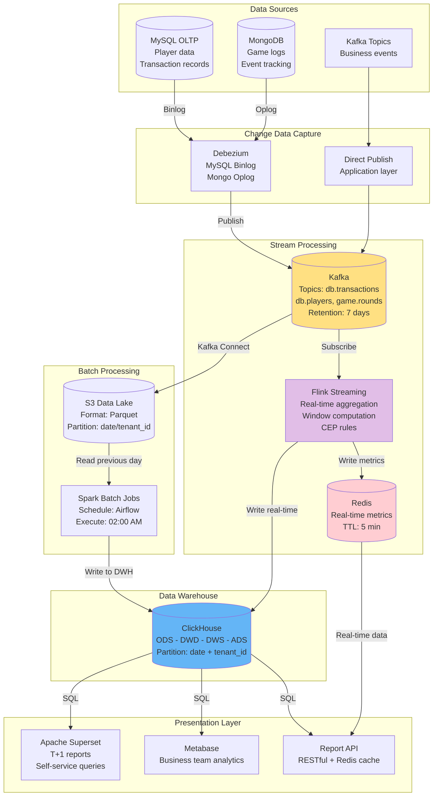
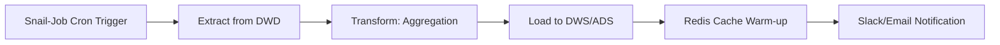
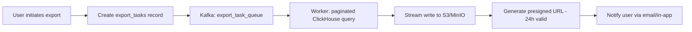

# Reporting & BI Technical Architecture

> **Business Requirements**: [Reporting Requirements](../../requirements/08_Analytics_Operations/Reporting_Requirements.md)
> **Canonical Source**: [source-archive/08_Analytics_BI/08-01_Reporting_BI.md](../../source-archive/08_Analytics_BI/08-01_Reporting_BI.md)
> **View Type**: Technical Architecture
> **Target Audience**: Architects, Backend Developers

---

## 1. Architecture Overview

The Reporting & BI system adopts a **Lambda Architecture variant**, supporting both batch processing (Spark) and stream processing (Flink) to meet T+1 reporting and near real-time dashboard requirements.

---

## 2. Data Pipeline Architecture



---

## 3. Data Layering Architecture (ODS-DWD-DWS-ADS)

### 3.1 Four-Layer Architecture

```text
+-----------------------------------------------------+
|  ADS (Application Data Service)                      |
|  - Pre-aggregated reports                            |
|  - API endpoint data                                 |
|  - Grafana / Metabase data source                    |
+-----------------------------------------------------+
                 |
+-----------------------------------------------------+
|  DWS (Data Warehouse Summary)                        |
|  - Day/Week/Month aggregation tables                 |
|  - Dimension summaries (Game, Player Segment, Date)  |
|  - Pre-calculated metrics (GGR, NGR, LTV, ARPU)     |
+-----------------------------------------------------+
                 |
+-----------------------------------------------------+
|  DWD (Data Warehouse Detail)                         |
|  - Cleaned fact tables                               |
|  - Standardized dimension tables                     |
|  - Data quality validation                           |
+-----------------------------------------------------+
                 |
+-----------------------------------------------------+
|  ODS (Operational Data Store)                        |
|  - MySQL master (OLTP)                               |
|  - Kafka CDC real-time stream                        |
|  - MongoDB audit logs                                |
+-----------------------------------------------------+
```

### 3.2 Layer Comparison Matrix

| Property | ODS | DWD | DWS | ADS |
|----------|-----|-----|-----|-----|
| **Source** | Business DB (MySQL/Mongo) | ODS layer | DWD layer | DWS layer |
| **Granularity** | Raw detail | Cleaned detail | Aggregated summary | Application wide table |
| **Volume** | Largest (TB) | Large (TB) | Medium (GB) | Small (GB) |
| **Update** | Near real-time (CDC) | T+1 batch | T+1 batch | T+1 or real-time |
| **Query Frequency** | Very low (ETL only) | Low (drill-down) | Medium (analysis) | Very high (frontend) |
| **Retention** | Permanent | 2 years | 3 years | 6 months |
| **PII Masking** | No (raw) | Yes (fully masked) | Yes | Yes |

### 3.3 ETL Schedule (Airflow DAG)

```text
02:00 - 02:15  ODS -> DWD (Data cleaning + PII masking)
02:15 - 02:45  DWD -> DWS (Aggregation computation)
02:45 - 03:00  DWS -> ADS (Wide table construction)
03:00 - 03:05  Data quality checks
03:05          Send completion notification + reports available
```

---

## 4. Report Scheduling Configuration

### 4.1 Snail-Job Integration

```yaml
# GGR/NGR hourly report
job_name: generate_ggr_ngr_hourly
cron: 0 */1 * * * ?
handler: GgrNgrReportHandler
params:
  source_table: dwd.fact_bets
  target_table: dws.fact_ggr_ngr_hourly
  aggregation_level: hourly
retry: 3
timeout: 600  # 10 minutes
```

```yaml
# Player activity daily report
job_name: generate_player_activity_daily
cron: 0 0 2 * * ?
handler: PlayerActivityReportHandler
params:
  source_table: dwd.fact_player_sessions
  target_table: dws.dim_player_activity_daily
  date: yesterday
retry: 3
timeout: 1800  # 30 minutes
```

### 4.2 Report Generation Pipeline



---

## 5. BI Tool Architecture

### 5.1 Tool Selection Matrix

| Tool | Open Source | Ease of Use | Performance | Cost | Recommended Use |
|------|-----------|-------------|-------------|------|-----------------|
| **Grafana** | Yes | High | Excellent | Free | Real-time monitoring, time-series |
| **Metabase** | Yes | Excellent | Good | Free | Self-service analytics, lightweight BI |
| **Apache Superset** | Yes | Good | Very Good | Free | Developer-friendly, SQL-heavy analysis |
| **Tableau** | No | Excellent | Excellent | $$$$ | Enterprise BI, deep analysis |

### 5.2 Layered Tool Strategy

```text
+-----------------------------------------------------+
|  Grafana (Real-time Monitoring)                      |
|  - GGR/NGR live dashboard                            |
|  - Risk event monitoring                             |
|  - System performance monitoring                     |
+-----------------------------------------------------+
                 |
+-----------------------------------------------------+
|  Metabase (Self-Service Analytics)                   |
|  - Business team self-service queries                |
|  - Player segmentation analysis                      |
|  - Campaign effectiveness analysis                   |
+-----------------------------------------------------+
                 |
+-----------------------------------------------------+
|  Apache Superset (Advanced Analytics)                |
|  - Data scientist deep analysis                      |
|  - Complex SQL queries                               |
|  - Custom visualizations                             |
+-----------------------------------------------------+
                 |
+-----------------------------------------------------+
|  ClickHouse / PostgreSQL (Data Warehouse)            |
|  - DWS layer + ADS layer                             |
+-----------------------------------------------------+
```

---

## 6. Performance Optimization

### 6.1 ClickHouse vs MySQL Benchmark

| Operation | MySQL (OLTP) | ClickHouse (OLAP) | Improvement |
|-----------|-------------|-------------------|-------------|
| COUNT(*) - 100M rows | 30s | 0.5s | 60x |
| SUM(amount) - 100M rows | 45s | 0.8s | 56x |
| GROUP BY + AVG - 100M rows | 120s | 2s | 60x |
| Complex JOIN (3 tables) - 10M rows | 300s | 5s | 60x |
| Write TPS | 10,000 | 100,000+ | 10x |

### 6.2 Cache Strategy

```text
Cache Key Design:
  report:{report_type}:{date}:{filters_hash}
  Example: report:ggr_hourly:2026-01-28:abc123

TTL Strategy:
  - Hot reports: 5 minutes
  - Historical reports: 1 hour
  - Custom queries: no cache
```

### 6.3 Rate Limiting

| Limit | Threshold |
|-------|-----------|
| Per user per minute | 10 queries |
| Per tenant per minute | 100 queries |
| Export task concurrency | 5 maximum |

---

## 7. Report Export Architecture

### 7.1 Supported Formats

| Format | Library | Max Capacity | Use Case |
|--------|---------|-------------|----------|
| **Excel (XLSX)** | Apache POI / EasyExcel | 1,048,576 rows | Multi-sheet dimensional reports |
| **PDF** | iText / Flying Saucer | Unlimited | Archival, print-friendly |
| **CSV** | Streaming write | Billions | ETL transfer, bulk export |

### 7.2 Async Export Architecture (Large Exports > 100k rows)



---

## 8. Data Governance

### 8.1 PII Masking Rules

```text
Name  -> R** C**
Phone -> 0912***789
ID    -> A12****89
Email -> r***@gmail.com
```

### 8.2 Data Retention

| Tier | Duration | Storage |
|------|----------|---------|
| **Hot Data (SSD)** | Most recent 3 months | High-frequency queries |
| **Warm Data (HDD)** | 3 months - 1 year | Occasional queries |
| **Cold Data (S3 Glacier)** | 1+ years | Audit archival only |

### 8.3 Data Correction (Idempotent Overwrite)

When upstream produces a voided transaction:

```sql
-- Strategy: Drop affected partition and re-run ETL
ALTER TABLE dws_revenue DROP PARTITION '2023-10-01';
-- Then re-execute ETL from ODS for that date
```

### 8.4 Multi-Tenant Isolation

- **Model**: Logical isolation via `tenant_id` partition key
- **Enforcement**: All queries must include `WHERE tenant_id = ?` (rejected otherwise)
- **Benefit**: Supports cross-tenant platform-level reports (e.g., total site GGR)

---

---

## 9. SmartAdmin Implementation

### 9.1 Report Service Layer

```java
@Service
@RequiredArgsConstructor
public class ReportService {

    private final ReportDao reportDao;
    private final ReportManager reportManager;
    private final RedisTemplate<String, String> redisTemplate;

    private static final String CACHE_KEY_PREFIX = "report:";

    /**
     * Query GGR/NGR report with Redis caching.
     * Uses Vavr Option for null-safety per SmartAdmin patterns.
     */
    public ResponseDTO<GgrNgrReportVO> getGgrNgrReport(ReportQueryForm form) {
        String cacheKey = buildCacheKey("ggr_ngr", form);

        // Check cache first
        String cached = redisTemplate.opsForValue().get(cacheKey);
        if (cached != null) {
            return ResponseDTO.ok(JSON.parseObject(cached, GgrNgrReportVO.class));
        }

        // Query from ClickHouse via Dao
        Option<GgrNgrReportEntity> result = Option.of(
            reportDao.selectGgrNgrReport(form.getTenantId(), form.getStartDate(), form.getEndDate())
        );

        return result
            .map(entity -> {
                GgrNgrReportVO vo = SmartBeanUtil.copy(entity, GgrNgrReportVO.class);
                // Cache for 5 minutes (hot report)
                redisTemplate.opsForValue().set(cacheKey, JSON.toJSONString(vo),
                    Duration.ofMinutes(5));
                return ResponseDTO.ok(vo);
            })
            .getOrElse(() -> ResponseDTO.ok(GgrNgrReportVO.empty()));
    }

    /**
     * Request async export for large datasets.
     */
    public ResponseDTO<ExportTaskVO> requestAsyncExport(ExportRequestForm form) {
        return reportManager.createExportTask(form);
    }
}
```

### 9.2 Report Manager Layer

```java
@Component
@RequiredArgsConstructor
public class ReportManager {

    private final ExportTaskDao exportTaskDao;
    private final KafkaTemplate<String, String> kafkaTemplate;

    /**
     * Create async export task with Kafka queue.
     * @Transactional only allowed in Manager layer per SmartAdmin architecture.
     */
    @Transactional(rollbackFor = Throwable.class)
    public ResponseDTO<ExportTaskVO> createExportTask(ExportRequestForm form) {
        // Create task record
        ExportTaskEntity task = new ExportTaskEntity();
        task.setTenantId(form.getTenantId());
        task.setUserId(form.getUserId());
        task.setReportType(form.getReportType());
        task.setParameters(JSON.toJSONString(form.getParameters()));
        task.setStatus(ExportStatus.PENDING);
        exportTaskDao.insert(task);

        // Send to Kafka for async processing
        ExportTaskMessage message = SmartBeanUtil.copy(task, ExportTaskMessage.class);
        kafkaTemplate.send("export_task_queue", task.getId().toString(),
            JSON.toJSONString(message));

        return ResponseDTO.ok(SmartBeanUtil.copy(task, ExportTaskVO.class));
    }
}
```

### 9.3 Database Schema

```sql
-- DWS layer: Daily GGR/NGR aggregation table
CREATE TABLE dws_ggr_ngr_daily (
    id              BIGSERIAL PRIMARY KEY,
    tenant_id       BIGINT NOT NULL,
    report_date     DATE NOT NULL,
    total_bets      DECIMAL(18, 4) NOT NULL DEFAULT 0,
    total_wins      DECIMAL(18, 4) NOT NULL DEFAULT 0,
    ggr             DECIMAL(18, 4) NOT NULL DEFAULT 0,
    ngr             DECIMAL(18, 4) NOT NULL DEFAULT 0,
    player_count    INTEGER NOT NULL DEFAULT 0,
    bet_count       INTEGER NOT NULL DEFAULT 0,
    currency        VARCHAR(3) NOT NULL DEFAULT 'USD',
    created_at      TIMESTAMP NOT NULL DEFAULT NOW(),
    CONSTRAINT uk_ggr_daily UNIQUE (tenant_id, report_date, currency)
);

CREATE INDEX idx_ggr_daily_tenant ON dws_ggr_ngr_daily(tenant_id, report_date DESC);

-- Export task queue table
CREATE TABLE t_export_task (
    id              BIGSERIAL PRIMARY KEY,
    tenant_id       BIGINT NOT NULL,
    user_id         BIGINT NOT NULL,
    report_type     VARCHAR(50) NOT NULL,
    parameters      JSONB NOT NULL,
    status          VARCHAR(20) NOT NULL DEFAULT 'PENDING',
    file_url        VARCHAR(500),
    file_size       BIGINT,
    row_count       INTEGER,
    error_message   TEXT,
    started_at      TIMESTAMP,
    completed_at    TIMESTAMP,
    expires_at      TIMESTAMP,
    created_at      TIMESTAMP NOT NULL DEFAULT NOW(),
    updated_at      TIMESTAMP NOT NULL DEFAULT NOW()
);

CREATE INDEX idx_export_user ON t_export_task(tenant_id, user_id, created_at DESC);
CREATE INDEX idx_export_status ON t_export_task(status, created_at)
    WHERE status IN ('PENDING', 'PROCESSING');
```

---

**Document Version**: 4.0.0
**Last Updated**: 2026-02-09
**Maintenance Team**: Data Team & BI Team
