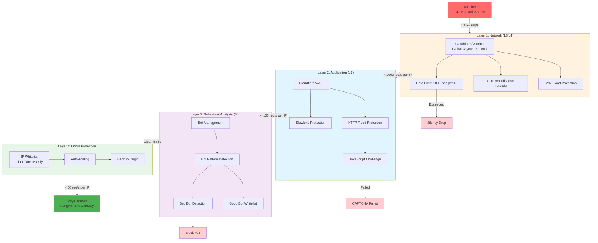

# 網關安全與 DDoS 防禦架構 (Gateway Security & DDoS Mitigation)

> **業務需求**: [合規標準需求](../../requirements/12_Security_Compliance/02_Compliance_Standards_Requirements.md)
> **規範來源**: [09-02-03 Security](../../source-archive/09_Technical_Infrastructure/09-02-03_Security.md)
> **目標讀者**: Technical Architecture (Development & DevOps)

---

## 1. 多層 DDoS 防禦架構



---

## 2. 防禦層詳細說明

| 防禦層 | 攻擊類型 | 處置措施 | 誤殺率 | 月費用 |
|--------|---------|---------|--------|-------|
| **L1: Network (L3/L4)** | SYN Flood, UDP Amplification | SYN Cookie, 流量清洗, 黑洞路由 | < 0.01% | Cloudflare Pro $200 |
| **L2: Application (L7)** | HTTP Flood, Slowloris | JS Challenge, CAPTCHA, Rate Limit | < 1% | WAF included |
| **L3: Behavioral (ML)** | Bot Scraping, Credential Stuffing | Bot 指紋識別, 行為分析 | 1-5% | Bot Mgmt $1,000 |
| **L4: Origin Protection** | 繞過 CDN 的直接攻擊 | IP 白名單, Auto-scaling | < 0.01% | Infrastructure $500 |

---

## 3. 攻擊場景分析

### 3.1 大規模 DDoS 攻擊 (100Gbps)

```
攻擊流量: 100 Gbps
├─ Layer 1 (Cloudflare): 吸收 95 Gbps (Anycast 分散)
│  └─ 剩餘: 5 Gbps
├─ Layer 2 (WAF): 識別 HTTP Flood，攔截 4 Gbps
│  └─ 剩餘: 1 Gbps
├─ Layer 3 (Bot Management): 攔截 0.8 Gbps
│  └─ 剩餘: 0.2 Gbps
└─ Layer 4 (Origin): Auto-scaling 承受 0.2 Gbps

結果: 源站僅承受 0.2% 原始攻擊流量
```

### 3.2 慢速 HTTP DoS (Slowloris)

```
Layer 2 (Slowloris Protection): 偵測到慢速連接
  └─ 強制關閉超過 30 秒未完成的連接
  └─ 攔截率: 99%
```

### 3.3 繞過 CDN 直接攻擊源站

```
Layer 4 (Origin Protection):
  └─ IP Whitelist: 僅允許 Cloudflare IP
  └─ 所有非 Cloudflare IP 直接拒絕連接
```

---

## 4. Cloudflare 配置

### 4.1 Terraform 配置

```terraform
resource "cloudflare_zone_settings_override" "igaming_zone" {
  zone_id = var.cloudflare_zone_id

  settings {
    # DDoS Protection
    security_level = "high"
    challenge_ttl  = 1800

    # Rate Limiting
    rate_limiting {
      enabled = true
    }

    # Bot Management
    bot_management {
      enabled = true
      fight_mode = true
    }

    # WAF
    waf {
      enabled = true
      mode    = "on"
    }

    # Performance
    cache_level = "aggressive"
    http3 = "on"

    # TLS Settings
    min_tls_version       = "1.2"
    automatic_https_rewrites = "on"
  }
}

resource "cloudflare_rate_limit" "api_global" {
  zone_id   = var.cloudflare_zone_id
  threshold = 100
  period    = 1
  match {
    request {
      url_pattern = "api.casino.com/*"
    }
  }
  action {
    mode    = "challenge"
    timeout = 60
  }
}
```

### 4.2 Origin Server 配置 (Nginx)

```nginx
http {
    # Cloudflare IP Whitelist
    geo $cloudflare_ip {
        default          0;
        173.245.48.0/20  1;
        103.21.244.0/22  1;
        # ... (完整 Cloudflare IP 列表)
    }

    server {
        listen 443 ssl;
        server_name api.casino.com;

        # Block non-Cloudflare IPs
        if ($cloudflare_ip = 0) {
            return 403 "Direct access forbidden";
        }

        upstream backend {
            least_conn;
            server backend-1.internal:8080 weight=5;
            server backend-2.internal:8080 weight=5;
            server backend-3.internal:8080 weight=5 backup;
        }

        location / {
            proxy_pass http://backend;
            limit_req zone=api_limit burst=20;
        }
    }
}
```

---

## 5. WAF 規則 (ModSecurity / Coraza)

| 攻擊類型 | 檢測規則 | 處置 |
|---------|---------|------|
| **SQL Injection** | 攔截 `UNION SELECT`, `DROP TABLE` 等 | 403 Forbidden |
| **XSS** | 攔截 `<script>` 等 Payload | 403 Forbidden |
| **Bot Protection** | 攔截非瀏覽器 UA (`curl`, `python-requests`) | 403 Forbidden |

---

## 6. API 版本管理策略

### 6.1 版本策略

| 策略 | 範例 | 推薦 |
|------|------|------|
| **URL Path** | `/v1/players`, `/v2/players` | 推薦 |
| **Header** | `Accept: application/vnd.api+json; version=2` | 不推薦 |
| **Query Param** | `/players?version=2` | 不推薦 |

### 6.2 版本生命週期

```
v1.0 Released: 2025-01-01
v2.0 Released: 2026-01-01
v1.0 Deprecated: 2026-07-01 (6 months notice)
v1.0 Sunset: 2027-01-01 (EOL)
```

### 6.3 版本路由配置

```yaml
services:
  - name: player-service-v1
    url: http://player-service-v1.internal:8080
    routes:
      - name: player-v1-route
        paths:
          - /v1/players
    plugins:
      - name: response-transformer
        config:
          add:
            headers:
              - "X-API-Version: 1.0"
              - "X-API-Deprecated: true"
              - "X-API-EOL: 2027-01-01"

  - name: player-service-v2
    url: http://player-service-v2.internal:8080
    routes:
      - name: player-v2-route
        paths:
          - /v2/players
    plugins:
      - name: response-transformer
        config:
          add:
            headers:
              - "X-API-Version: 2.0"
```

---

## 7. 監控指標

| 指標 | 正常範圍 | Warning | Critical |
|------|---------|---------|----------|
| Gateway Latency P99 | < 50ms | > 100ms | > 200ms |
| Upstream Latency P99 | < 200ms | > 500ms | > 1000ms |
| Error Rate (5xx) | < 0.1% | > 1% | > 5% |
| Rate Limit Hit Rate | < 1% | > 5% | > 10% |
| Circuit Breaker Trips | 0/hour | > 3/hour | > 10/hour |

---

## 8. SmartAdmin 實作（SmartAdmin Implementation）

### 8.1 Security Filter Service

```java
@Service
@RequiredArgsConstructor
public class SecurityFilterService {

    private final IpWhitelistDao ipWhitelistDao;
    private final SecurityEventManager securityEventManager;

    /**
     * Check if IP is in whitelist using Vavr Option.
     */
    public boolean isIpAllowed(String ipAddress, String routeName) {
        Option<IpWhitelistEntity> whitelistOpt = Option.of(
            ipWhitelistDao.selectByRoute(routeName));

        if (whitelistOpt.isEmpty()) {
            return true; // No whitelist configured
        }

        return whitelistOpt.get().getAllowedIps().contains(ipAddress);
    }

    /**
     * Log security event for audit.
     */
    public void logSecurityEvent(SecurityEventForm form) {
        securityEventManager.recordEvent(form);
    }
}
```

### 8.2 安全事件 Manager（Security Event Manager）

```java
@Component
@RequiredArgsConstructor
public class SecurityEventManager {

    private final SecurityEventDao securityEventDao;

    /**
     * Record security event with transaction support.
     * @Transactional only allowed in Manager layer per SmartAdmin architecture.
     */
    @Transactional(rollbackFor = Throwable.class)
    public void recordEvent(SecurityEventForm form) {
        SecurityEventEntity entity = SmartBeanUtil.copy(form, SecurityEventEntity.class);
        entity.setCreatedAt(LocalDateTime.now());
        securityEventDao.insert(entity);
    }
}
```

### 8.3 資料庫 Schema（Database Schema）

```sql
-- IP whitelist configuration
CREATE TABLE t_ip_whitelist (
    id              BIGSERIAL PRIMARY KEY,
    route_name      VARCHAR(100) NOT NULL,
    allowed_ips     JSONB NOT NULL,
    description     VARCHAR(500),
    enabled         BOOLEAN NOT NULL DEFAULT TRUE,
    created_at      TIMESTAMP NOT NULL DEFAULT NOW(),
    updated_at      TIMESTAMP NOT NULL DEFAULT NOW()
);

CREATE INDEX idx_whitelist_route ON t_ip_whitelist(route_name) WHERE enabled = TRUE;

-- Security event log
CREATE TABLE t_security_event (
    id              BIGSERIAL PRIMARY KEY,
    event_type      VARCHAR(50) NOT NULL,
    ip_address      VARCHAR(45) NOT NULL,
    user_agent      VARCHAR(500),
    route_name      VARCHAR(100),
    action_taken    VARCHAR(50) NOT NULL,
    details         JSONB,
    created_at      TIMESTAMP NOT NULL DEFAULT NOW()
);

CREATE INDEX idx_security_event_type ON t_security_event(event_type, created_at DESC);
CREATE INDEX idx_security_event_ip ON t_security_event(ip_address, created_at DESC);
```

---

## 相關文檔

- [網關核心架構](./01_Gateway_Core.md)
- [流量控制與限流](./02_Gateway_Rate_Limiting.md)
- [效能監控與告警](./12_Performance_Monitoring.md)
