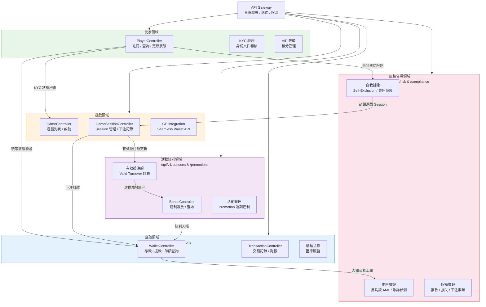

# 領域 API 設計 (Domain API Design)

> **業務需求**: [品質保證與測試驗收標準需求 (QA Standards)](../../requirements/09_Infrastructure_Requirements/01_QA_Standards_Requirements.md)
> **規範來源**: [09-03-04 Domain APIs](../../source-archive/09_Technical_Infrastructure/09-03-04_Domain_APIs.md)
> **目標讀者**: Technical Architecture (Development & DevOps)

---

## 領域 API 邊界與關係圖



---

## 1. OpenAPI 3.0 規範

### 1.1 API 基本資訊

```yaml
openapi: 3.0.3
info:
  title: SmartAdmin iGaming Platform API
  version: 1.0.0
  description: |
    SmartAdmin iGaming Platform 統一 API 文檔
    核心功能: 玩家管理, 錢包與交易, 活動與紅利, 遊戲集成
    認證方式: JWT Bearer Token (Sa-Token)

servers:
  - url: https://api.smartadmin.com/v1
    description: 生產環境
  - url: https://staging-api.smartadmin.com/v1
    description: 測試環境
  - url: http://localhost:1024/api/v1
    description: 本地開發環境

security:
  - bearerAuth: []
```

### 1.2 通用 Schema 定義

```yaml
components:
  schemas:
    ResponseDTO:
      type: object
      required: [code, message, timestamp, trace_id]
      properties:
        code:
          type: integer
          description: 業務錯誤碼 (1000=成功, 4xxx=客戶端, 5xxx=服務端)
        message:
          type: string
        data:
          type: object
          nullable: true
        error_detail:
          type: object
          nullable: true
        timestamp:
          type: string
          format: date-time
        trace_id:
          type: string

    PaginationMeta:
      type: object
      required: [page, page_size, total_count, total_pages, has_next, has_previous]
      properties:
        page:
          type: integer
        page_size:
          type: integer
        total_count:
          type: integer
        total_pages:
          type: integer
        has_next:
          type: boolean
        has_previous:
          type: boolean
```

---

## 2. 玩家管理 API

### 2.1 Player Entity

```yaml
Player:
  type: object
  required: [player_id, tenant_id, username, email, status, kyc_status, created_at]
  properties:
    player_id:
      type: integer
      format: int64
    tenant_id:
      type: integer
      format: int64
    username:
      type: string
      minLength: 4
      maxLength: 20
      pattern: '^[a-zA-Z0-9_-]+$'
    email:
      type: string
      format: email
    status:
      type: string
      enum: [ACTIVE, SUSPENDED, SELF_EXCLUDED, BANNED]
    kyc_status:
      type: string
      enum: [NOT_VERIFIED, PENDING, VERIFIED, REJECTED]
    vip_level:
      type: integer
      minimum: 0
      maximum: 10
```

### 2.2 API 端點

```yaml
paths:
  /players:
    get:
      tags: [Players]
      summary: 獲取玩家列表
      operationId: listPlayers
      parameters:
        - name: page
          in: query
          schema: { type: integer, default: 1 }
        - name: page_size
          in: query
          schema: { type: integer, default: 20, maximum: 100 }
        - name: status
          in: query
          schema: { type: string, enum: [ACTIVE, SUSPENDED, SELF_EXCLUDED, BANNED] }
        - name: sort
          in: query
          schema: { type: string, default: "created_at:desc" }
      responses:
        '200':
          description: 成功
        '401':
          description: 未認證

    post:
      tags: [Players]
      summary: 創建玩家
      operationId: createPlayer
      requestBody:
        required: true
        content:
          application/json:
            schema:
              $ref: '#/components/schemas/CreatePlayerForm'
      responses:
        '201':
          description: 已創建
        '409':
          description: 用戶名/郵箱已存在

  /players/{id}:
    get:
      tags: [Players]
      summary: 獲取單個玩家
      operationId: getPlayer
      parameters:
        - name: id
          in: path
          required: true
          schema: { type: integer, format: int64 }
      responses:
        '200':
          description: 成功
        '404':
          description: 玩家未找到

    patch:
      tags: [Players]
      summary: 更新玩家
      operationId: updatePlayer
      requestBody:
        content:
          application/json:
            schema:
              $ref: '#/components/schemas/UpdatePlayerForm'
      responses:
        '200':
          description: 成功
```

### 2.3 CreatePlayerForm

```yaml
CreatePlayerForm:
  type: object
  required: [username, password, email, currency]
  properties:
    username:
      type: string
      minLength: 4
      maxLength: 20
      pattern: '^[a-zA-Z0-9_-]+$'
    password:
      type: string
      format: password
      minLength: 8
      maxLength: 32
    email:
      type: string
      format: email
    currency:
      type: string
      enum: [USD, EUR, CNY, TWD, THB, VND]
    referral_code:
      type: string
      nullable: true
```

---

## 3. 標準錯誤響應

```yaml
components:
  responses:
    BadRequest:
      description: 參數驗證失敗
      content:
        application/json:
          example:
            code: 4009
            message: "參數驗證失敗"
            error_detail:
              field: "username"
              message: "用戶名必須為 4-20 個字符"

    Unauthorized:
      description: 未認證
      content:
        application/json:
          example:
            code: 4001
            message: "未認證"
            error_detail:
              reason: "Token 已過期"

    NotFound:
      description: 資源未找到
      content:
        application/json:
          example:
            code: 4004
            message: "玩家未找到"

    InternalServerError:
      description: 服務器內部錯誤
      content:
        application/json:
          example:
            code: 5000
            message: "服務器內部錯誤"
```

---

## 4. 標準請求參數

```yaml
components:
  parameters:
    TenantIdHeader:
      name: X-Tenant-ID
      in: header
      required: true
      description: 租戶 ID (多租戶隔離)
      schema:
        type: integer
        format: int64

    RequestIdHeader:
      name: X-Request-ID
      in: header
      required: true
      description: 請求唯一標識 (UUID v4)
      schema:
        type: string
        format: uuid

    IdempotencyKeyHeader:
      name: X-Idempotency-Key
      in: header
      required: false
      description: 冪等性鍵 (用於 POST/PATCH)
      schema:
        type: string
        format: uuid
```

---

## 5. SmartAdmin 實作（SmartAdmin Implementation）

### 5.1 Player Controller

```java
@RestController
@RequiredArgsConstructor
@RequestMapping("/api/v1/players")
public class PlayerController {

    private final PlayerService playerService;

    @GetMapping
    public ResponseDTO<PageResult<PlayerVO>> listPlayers(@Valid PlayerQueryForm form) {
        Page<PlayerEntity> page = SmartPageUtil.convert2PageQuery(form);
        return playerService.listPlayers(page, form);
    }

    @PostMapping
    public ResponseDTO<Long> createPlayer(@Valid @RequestBody CreatePlayerForm form) {
        return playerService.createPlayer(form);
    }
}
```

### 5.2 資料庫 Schema（Database Schema）

```sql
-- Player management table
CREATE TABLE t_player (
    id              BIGSERIAL PRIMARY KEY,
    tenant_id       BIGINT NOT NULL,
    username        VARCHAR(50) NOT NULL,
    email           VARCHAR(200),
    status          SMALLINT NOT NULL DEFAULT 1,
    kyc_status      SMALLINT NOT NULL DEFAULT 0,
    vip_level       SMALLINT NOT NULL DEFAULT 0,
    created_at      TIMESTAMP NOT NULL DEFAULT NOW(),
    deleted         BOOLEAN NOT NULL DEFAULT FALSE,
    CONSTRAINT uk_player_username UNIQUE (tenant_id, username)
);

CREATE INDEX idx_player_tenant ON t_player(tenant_id, status);
```

---

## 相關文檔

- [API 設計原則](./04_API_Design_Principles.md)
- [API 通用模式](./06_Common_Patterns.md)
- [身份驗證與授權架構](./05_Authentication_Architecture.md)
