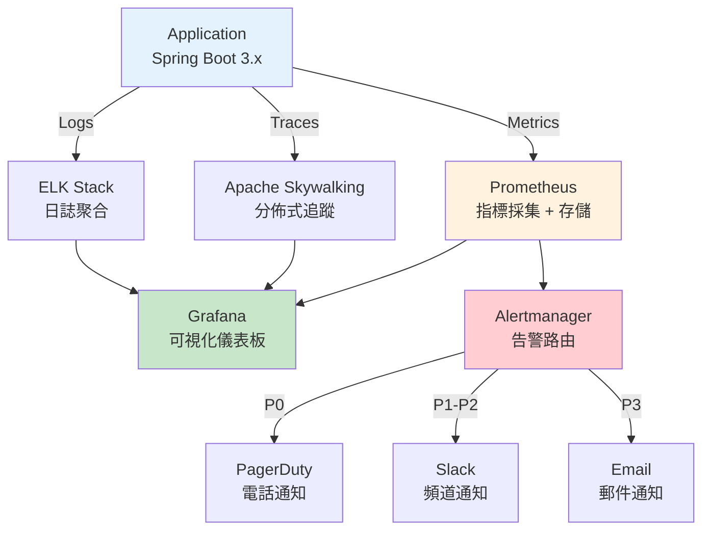
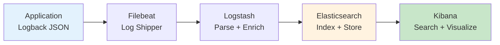

# 性能監控與告警架構（Performance Monitoring & Alerting）

> **業務需求**: 不適用 — 純技術基礎設施文件
> **規範來源**: [09-06 Performance Monitoring](../../source-archive/09_Technical_Infrastructure/09-06_Performance_Monitoring.md)
> **目標讀者**: DevOps Engineers, SRE, Backend Engineers

---

## 1. 架構概覽



---

## 2. APM 工具選型

| APM 工具 | 類型 | 成本 | 推薦場景 |
|---------|------|------|---------|
| **Apache Skywalking** | 開源 | 免費 | Java 生態，推薦 |
| **New Relic** | 商業 | $$$$ | 企業級全功能 |
| **Datadog** | 商業 | $$$$ | 多雲 DevOps 整合 |
| **Elastic APM** | 開源/商業 | $$ | ELK Stack 整合 |

**推薦**: Apache Skywalking（開源、社區活躍、Spring Boot 原生支持）

### 2.1 Skywalking 集成

```xml
<dependency>
    <groupId>org.apache.skywalking</groupId>
    <artifactId>apm-toolkit-trace</artifactId>
    <version>9.3.0</version>
</dependency>
```

```
JAVA_OPTS: >
  -javaagent:/opt/skywalking-agent/skywalking-agent.jar
  -Dskywalking.agent.service_name=smart-admin-api
  -Dskywalking.collector.backend_service=skywalking-oap:11800
```

---

## 3. Golden Signals 指標體系

### 3.1 延遲 (Latency)

| 分位數 | 目標 | 告警閾值 |
|--------|------|---------|
| P50 | < 200ms | > 500ms |
| P95 | < 500ms | > 1000ms |
| P99 | < 1000ms | > 3000ms |

### 3.2 流量 (Traffic)

- QPS (Queries Per Second)
- Active Users (在線用戶數)
- Bet Transactions/sec (投注 TPS)

### 3.3 錯誤 (Errors)

| 指標 | 目標 | 告警閾值 |
|------|------|---------|
| Error Rate | < 0.1% | > 1% |
| 5xx Rate | < 0.01% | > 0.5% |
| Timeout Rate | < 0.05% | > 0.5% |

### 3.4 飽和度 (Saturation)

| 資源 | 告警閾值 |
|------|---------|
| CPU Usage | > 80% |
| Memory Usage | > 85% |
| DB Connection Pool | > 90% |
| Redis Connection Pool | > 90% |

---

## 4. 告警規則設計

### 4.1 告警分級

| 級別 | 定義 | SLA 響應時間 | 通知渠道 | 範例 |
|------|------|------------|---------|------|
| **P0** | 核心業務中斷 | 5 分鐘 | PagerDuty (電話) | 存款 API 不可用 |
| **P1** | 嚴重性能下降 | 15 分鐘 | Slack (緊急頻道) | API P99 > 3s |
| **P2** | 部分功能異常 | 30 分鐘 | Slack (告警頻道) | 錯誤率 > 1% |
| **P3** | 性能告警 | 1 小時 | Email | CPU > 80% |

### 4.2 Prometheus AlertManager 規則

```yaml
groups:
  - name: api_alerts
    interval: 30s
    rules:
      # P0: API 完全不可用
      - alert: APIDownCritical
        expr: up{job="smart-admin-api"} == 0
        for: 1m
        labels:
          severity: critical
          priority: P0
        annotations:
          summary: "API 服務完全不可用"
          runbook_url: "https://wiki.internal/runbooks/api-down"

      # P1: P99 延遲過高
      - alert: HighLatencyP99
        expr: histogram_quantile(0.99, rate(http_request_duration_seconds_bucket[5m])) > 3
        for: 5m
        labels:
          severity: high
          priority: P1
        annotations:
          summary: "API P99 延遲超過 3 秒"

      # P2: 錯誤率超過 1%
      - alert: HighErrorRate
        expr: rate(http_requests_total{status=~"5.."}[5m]) / rate(http_requests_total[5m]) > 0.01
        for: 5m
        labels:
          severity: medium
          priority: P2

      # P3: CPU 使用率過高
      - alert: HighCPUUsage
        expr: process_cpu_usage > 0.8
        for: 10m
        labels:
          severity: low
          priority: P3
```

### 4.3 Prometheus Metrics 導出

```yaml
management:
  endpoints:
    web:
      exposure:
        include: health,info,metrics,prometheus
  metrics:
    export:
      prometheus:
        enabled: true
    tags:
      application: ${spring.application.name}
      environment: ${spring.profiles.active}
```

---

## 5. 日誌聚合系統 (ELK Stack)

### 5.1 架構



### 5.2 日誌格式 (JSON)

```json
{
  "timestamp": "2026-01-27T10:00:00.123Z",
  "level": "INFO",
  "logger": "net.lab1024.sa.business.wallet.WalletService",
  "message": "Wallet debit successful",
  "trace_id": "abc-123-def-456",
  "span_id": "span-789",
  "tenant_id": "1",
  "player_id": "123456",
  "amount": 100.00,
  "currency": "USD"
}
```

---

## 6. Java 實作

### 6.1 PerformanceMetricsService (Service Layer)

```java
package net.lab1024.sa.infrastructure.monitoring;

import io.micrometer.core.instrument.Counter;
import io.micrometer.core.instrument.MeterRegistry;
import io.micrometer.core.instrument.Timer;
import io.vavr.control.Option;
import lombok.RequiredArgsConstructor;
import lombok.extern.slf4j.Slf4j;
import org.springframework.stereotype.Service;

import java.time.LocalDateTime;
import java.util.List;

/**
 * 性能指標服務
 *
 * @author SmartAdmin Team
 */
@Slf4j
@Service
@RequiredArgsConstructor
public class PerformanceMetricsService {

    private final PerformanceMetricsDao metricsDao;
    private final PerformanceAlertManager alertManager;
    private final MeterRegistry meterRegistry;

    /**
     * 查詢最近 N 分鐘的 P99 延遲
     */
    public Option<Double> getP99Latency(String endpoint, int minutes) {
        return Option.ofOptional(
            metricsDao.queryLatencyPercentile(endpoint, 0.99, minutes)
        );
    }

    /**
     * 記錄 API 請求指標（委託 Micrometer）
     */
    public void recordApiRequest(String endpoint, long durationMs, int statusCode) {
        // 使用 Micrometer 記錄指標
        Timer.builder("http.server.requests")
            .tag("uri", endpoint)
            .tag("status", String.valueOf(statusCode))
            .register(meterRegistry)
            .record(java.time.Duration.ofMillis(durationMs));

        // 錯誤率計數器
        if (statusCode >= 500) {
            Counter.builder("http.server.errors")
                .tag("uri", endpoint)
                .tag("status", String.valueOf(statusCode))
                .register(meterRegistry)
                .increment();
        }
    }

    /**
     * 檢查是否觸發告警閾值
     */
    public void checkAlertThresholds(String metricName, double value) {
        metricsDao.findAlertRuleByMetric(metricName)
            .ifPresent(rule -> {
                if (value > rule.getThreshold()) {
                    alertManager.triggerAlert(rule, value);
                }
            });
    }
}
```

### 6.2 PerformanceAlertManager (Manager Layer)

```java
package net.lab1024.sa.infrastructure.monitoring;

import lombok.RequiredArgsConstructor;
import lombok.extern.slf4j.Slf4j;
import org.springframework.stereotype.Component;
import org.springframework.transaction.annotation.Transactional;

import java.time.LocalDateTime;

/**
 * 性能告警管理器（處理告警事務）
 *
 * @author SmartAdmin Team
 */
@Slf4j
@Component
@RequiredArgsConstructor
public class PerformanceAlertManager {

    private final AlertHistoryDao alertHistoryDao;
    private final SlackNotifier slackNotifier;
    private final PagerDutyClient pagerDutyClient;

    /**
     * 觸發告警（需事務保證通知記錄一致性）
     */
    @Transactional(rollbackFor = Throwable.class)
    public void triggerAlert(AlertRuleEntity rule, double currentValue) {
        // 1. 記錄告警歷史
        AlertHistoryEntity history = AlertHistoryEntity.builder()
            .ruleId(rule.getId())
            .metricName(rule.getMetricName())
            .threshold(rule.getThreshold())
            .currentValue(currentValue)
            .priority(rule.getPriority())
            .status("TRIGGERED")
            .triggeredAt(LocalDateTime.now())
            .build();
        alertHistoryDao.insert(history);

        // 2. 路由通知
        switch (rule.getPriority()) {
            case "P0":
                pagerDutyClient.sendAlert(rule, currentValue);
                break;
            case "P1":
            case "P2":
                slackNotifier.sendToChannel(rule, currentValue);
                break;
            case "P3":
                // Email 通知（異步）
                break;
        }

        log.warn("告警觸發: {} = {} (閾值: {}), 優先級: {}",
            rule.getMetricName(), currentValue, rule.getThreshold(), rule.getPriority());
    }

    /**
     * 批量解除告警（系統恢復時調用）
     */
    @Transactional(rollbackFor = Throwable.class)
    public void resolveAlerts(String metricName) {
        List<AlertHistoryEntity> activeAlerts =
            alertHistoryDao.findActiveAlerts(metricName);

        activeAlerts.forEach(alert -> {
            alert.setStatus("RESOLVED");
            alert.setResolvedAt(LocalDateTime.now());
            alertHistoryDao.updateById(alert);
        });

        log.info("告警已解除: {}, 數量: {}", metricName, activeAlerts.size());
    }
}
```

---

## 7. SQL Schema

### 7.1 告警規則表

```sql
-- 告警規則配置表
CREATE TABLE t_alert_rule (
    id BIGSERIAL PRIMARY KEY,
    metric_name VARCHAR(100) NOT NULL,
    description VARCHAR(500),
    threshold DECIMAL(18, 4) NOT NULL,
    comparison_operator VARCHAR(10) NOT NULL DEFAULT '>',
    priority VARCHAR(10) NOT NULL,
    duration_seconds INT NOT NULL DEFAULT 300,
    notification_channels TEXT[],
    runbook_url VARCHAR(500),
    enabled BOOLEAN NOT NULL DEFAULT TRUE,
    created_at TIMESTAMP NOT NULL DEFAULT CURRENT_TIMESTAMP,
    updated_at TIMESTAMP NOT NULL DEFAULT CURRENT_TIMESTAMP
);

CREATE INDEX idx_alert_metric ON t_alert_rule(metric_name);
CREATE INDEX idx_alert_enabled ON t_alert_rule(enabled);

COMMENT ON TABLE t_alert_rule IS '告警規則配置表';
COMMENT ON COLUMN t_alert_rule.metric_name IS '指標名稱 (api_p99_latency, error_rate, cpu_usage)';
COMMENT ON COLUMN t_alert_rule.threshold IS '告警閾值';
COMMENT ON COLUMN t_alert_rule.comparison_operator IS '比較運算符 (>, <, >=, <=, ==)';
COMMENT ON COLUMN t_alert_rule.priority IS '優先級 (P0, P1, P2, P3)';
COMMENT ON COLUMN t_alert_rule.duration_seconds IS '持續時間（秒）：指標超過閾值持續多久才觸發';
COMMENT ON COLUMN t_alert_rule.notification_channels IS '通知渠道陣列 (pagerduty, slack, email)';
```

### 7.2 告警歷史表

```sql
-- 告警歷史記錄表
CREATE TABLE t_alert_history (
    id BIGSERIAL PRIMARY KEY,
    rule_id BIGINT NOT NULL REFERENCES t_alert_rule(id),
    metric_name VARCHAR(100) NOT NULL,
    threshold DECIMAL(18, 4) NOT NULL,
    current_value DECIMAL(18, 4) NOT NULL,
    priority VARCHAR(10) NOT NULL,
    status VARCHAR(20) NOT NULL DEFAULT 'TRIGGERED',
    triggered_at TIMESTAMP NOT NULL DEFAULT CURRENT_TIMESTAMP,
    resolved_at TIMESTAMP,
    resolution_note TEXT,
    created_at TIMESTAMP NOT NULL DEFAULT CURRENT_TIMESTAMP
);

CREATE INDEX idx_alert_hist_rule ON t_alert_history(rule_id);
CREATE INDEX idx_alert_hist_status ON t_alert_history(status);
CREATE INDEX idx_alert_hist_triggered ON t_alert_history(triggered_at);
CREATE INDEX idx_alert_hist_metric ON t_alert_history(metric_name);

COMMENT ON TABLE t_alert_history IS '告警歷史記錄表';
COMMENT ON COLUMN t_alert_history.status IS '狀態 (TRIGGERED, RESOLVED, ACKNOWLEDGED, MUTED)';
COMMENT ON COLUMN t_alert_history.resolution_note IS '解除原因說明';
```

### 7.3 性能指標時序表

```sql
-- 性能指標時序數據表（建議使用 TimescaleDB 或 InfluxDB）
CREATE TABLE t_performance_metric (
    id BIGSERIAL PRIMARY KEY,
    metric_name VARCHAR(100) NOT NULL,
    metric_value DECIMAL(18, 4) NOT NULL,
    tags JSONB,
    recorded_at TIMESTAMP NOT NULL DEFAULT CURRENT_TIMESTAMP
);

CREATE INDEX idx_perf_metric_name ON t_performance_metric(metric_name);
CREATE INDEX idx_perf_recorded ON t_performance_metric(recorded_at);
CREATE INDEX idx_perf_tags ON t_performance_metric USING GIN (tags);

COMMENT ON TABLE t_performance_metric IS '性能指標時序數據表';
COMMENT ON COLUMN t_performance_metric.tags IS '標籤 JSON (endpoint, tenant_id, status_code)';
COMMENT ON COLUMN t_performance_metric.recorded_at IS '記錄時間';

-- 分區策略（時序數據建議按月分區）
-- CREATE TABLE t_performance_metric_2026_01 PARTITION OF t_performance_metric
-- FOR VALUES FROM ('2026-01-01') TO ('2026-02-01');
```

---

## 相關文件

- [性能優化](./13_Performance_Optimization.md) — 性能優化規範
- [部署架構](./08_Deployment_Architecture.md) — 部署架構與 DevOps 規範
- [成本優化](./16_Cost_Optimization_Architecture.md) — 成本優化架構
