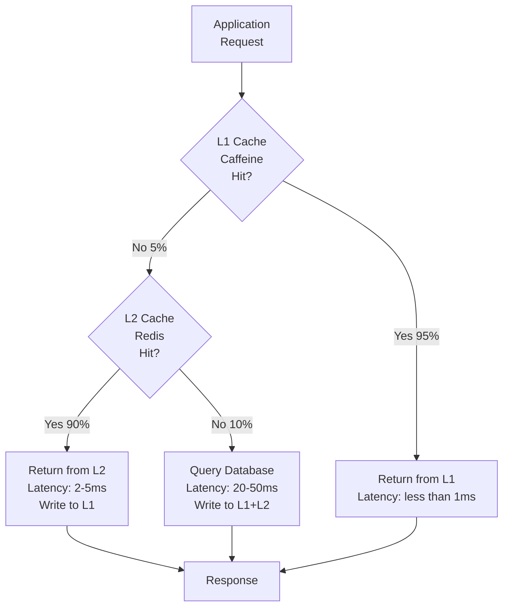
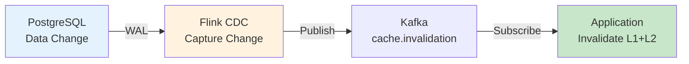

# 緩存策略架構（Caching Strategy）

> **業務需求**: 不適用 — 純技術基礎設施文件
> **規範來源**: [09-09 Caching Strategy](../../source-archive/09_Technical_Infrastructure/09-09_Caching_Strategy.md)
> **視角**: Technical Architecture (Development & DevOps)

---

## 1. 架構概覽（Architecture Overview）

採用 **JetCache 2.7.5 + Redisson 3.26.0** 構建多級緩存：

| 指標 | 優化前 | 優化後 | 提升 |
|------|--------|--------|------|
| 餘額查詢 P99 | 1,240ms | <= 200ms | -84% |
| Cache Hit Rate | 65% | 95% | +30pp |
| Redis QPS | 10,000 | 1,000 | -90% |
| Redis 成本 | $580.8/月 | $290.4/月 | -50% |

---

## 2. 多級緩存架構（Multi-Level Cache Architecture）



### 2.1 緩存層級（Cache Levels）

| 層級 | 存儲 | TTL | 命中率 | 延遲 | 容量 |
|------|------|-----|--------|------|------|
| **L1** | Caffeine (JVM Heap) | 100s | 95% | < 1ms | 10,000 entries |
| **L2** | Redis (Network) | 1h | 4.5% | 2-5ms | Unlimited |
| **DB** | PostgreSQL (Disk) | - | 0.5% | 20-50ms | - |

---

## 3. JetCache 配置（JetCache Configuration）

### 3.1 Spring Boot 配置

```yaml
jetcache:
  statIntervalMinutes: 15
  areaInCacheName: false
  local:
    default:
      type: caffeine
      limit: 10000
      expireAfterWriteInMillis: 100000   # 100s
      expireAfterAccessInMillis: 60000   # 60s
  remote:
    default:
      type: redis.lettuce
      keyPrefix: igaming:
      valueEncoder: kryo
      valueDecoder: kryo
      expireAfterWriteInMillis: 3600000  # 1h
      uri: redis://redis-master:6379
```

### 3.2 Java 配置

```java
@Configuration
@EnableMethodCache(basePackages = "net.lab1024.sa.igaming")
@EnableCreateCacheAnnotation
public class JetCacheConfig {
    // Auto-Configuration reads application.yml
}
```

### 3.3 @Cached 使用範例

```java
@Service
@RequiredArgsConstructor
public class WalletService {

    private final WalletDao walletDao;

    @Cached(name = "wallet:balance:",
            key = "#tenantId + ':' + #playerId",
            cacheType = CacheType.BOTH,
            localExpire = 100,
            expire = 3600)
    public Option<WalletBalanceVO> getBalance(Long tenantId, Long playerId) {
        return Option.ofOptional(walletDao.findByTenantAndPlayer(tenantId, playerId))
                .map(WalletBalanceVO::fromEntity);
    }

    @CacheInvalidate(name = "wallet:balance:",
                      key = "#tenantId + ':' + #playerId")
    public void updateBalance(Long tenantId, Long playerId, BigDecimal amount) {
        walletDao.updateBalance(tenantId, playerId, amount);
    }
}
```

---

## 4. Redisson 分佈式鎖（Redisson Distributed Lock）

### 4.1 RLock 使用範例

```java
@Service
@RequiredArgsConstructor
public class WalletManager {

    private final RedissonClient redissonClient;

    @Transactional(rollbackFor = Throwable.class)
    public void debit(Long tenantId, Long playerId, BigDecimal amount) {
        String lockKey = "wallet:lock:" + tenantId + ":" + playerId;
        RLock lock = redissonClient.getLock(lockKey);

        try {
            if (lock.tryLock(3, 5, TimeUnit.SECONDS)) {
                // Optimistic lock: SELECT balance, version
                // UPDATE SET version = version + 1 WHERE version = ?
            }
        } finally {
            if (lock.isHeldByCurrentThread()) {
                lock.unlock();
            }
        }
    }
}
```

### 4.2 Rate Limiter

```java
RRateLimiter rateLimiter = redissonClient.getRateLimiter("api:withdraw:" + playerId);
rateLimiter.trySetRate(RateType.PER_CLIENT, 3, 1, RateIntervalUnit.HOURS);

if (rateLimiter.tryAcquire()) {
    processWithdraw();
} else {
    throw new BusinessException(4029, "提款次數超過限制");
}
```

### 4.3 Bloom Filter（防緩存穿透）

```java
RBloomFilter<String> bloomFilter = redissonClient.getBloomFilter("player:exists");
bloomFilter.tryInit(1_000_000L, 0.01);  // 100 萬容量, 1% 誤報率

// Check before DB query
if (!bloomFilter.contains("player:" + playerId)) {
    return Option.none();  // Definitely not in DB
}
```

---

## 5. 緩存一致性（Cache Consistency）

### 5.1 Cache-Aside Pattern

```
Read:
  1. Check L1 (Caffeine)
  2. Check L2 (Redis)
  3. Query DB -> Write to L1 + L2

Write:
  1. Update DB
  2. Invalidate L2 (Redis)
  3. L1 auto-expire (100s TTL)
```

### 5.2 Binlog-Based Invalidation (Flink CDC)



---

## 6. 緩存預熱（Cache Warming）

```java
@Scheduled(cron = "0 0 * * * ?")  // Every hour
public void warmUpActivePlayerCache() {
    List<Long> activePlayerIds = playerDao.findActivePlayerIds(Duration.ofHours(1));
    activePlayerIds.forEach(playerId -> {
        walletService.getBalance(tenantId, playerId);  // Triggers @Cached
    });
    log.info("Cache warmed up for {} active players", activePlayerIds.size());
}
```

---

## 7. SmartAdmin 實作範例（SmartAdmin Implementation）

### 7.1 Cache Configuration Service

```java
@Service
@RequiredArgsConstructor
public class CacheConfigService {

    private final CacheConfigDao cacheConfigDao;
    private final CacheInvalidationManager cacheManager;

    /**
     * Query cache configuration using Vavr Option.
     */
    public Option<CacheConfigVO> getCacheConfig(String cacheName) {
        return Option.of(cacheConfigDao.selectByName(cacheName))
            .map(entity -> SmartBeanUtil.copy(entity, CacheConfigVO.class));
    }

    /**
     * Invalidate cache entry.
     */
    public ResponseDTO<Void> invalidateCache(CacheInvalidationForm form) {
        return cacheManager.invalidate(form);
    }
}
```

### 7.2 Cache Invalidation Manager

```java
@Component
@RequiredArgsConstructor
public class CacheInvalidationManager {

    private final Cache<String, Object> caffeineCache;
    private final RedissonClient redissonClient;
    private final CacheInvalidationLogDao logDao;

    /**
     * Invalidate cache across all layers.
     * @Transactional only allowed in Manager layer per SmartAdmin architecture.
     */
    @Transactional(rollbackFor = Throwable.class)
    public ResponseDTO<Void> invalidate(CacheInvalidationForm form) {
        // L1: Clear Caffeine
        caffeineCache.invalidate(form.getCacheKey());

        // L2: Clear Redis
        redissonClient.getBucket(form.getCacheKey()).delete();

        // Log invalidation
        CacheInvalidationLogEntity log = new CacheInvalidationLogEntity();
        log.setCacheName(form.getCacheName());
        log.setCacheKey(form.getCacheKey());
        log.setReason(form.getReason());
        log.setInvalidatedAt(LocalDateTime.now());
        logDao.insert(log);

        return ResponseDTO.ok();
    }
}
```

### 7.3 資料庫結構（Database Schema）

```sql
-- Cache configuration
CREATE TABLE t_cache_config (
    id              BIGSERIAL PRIMARY KEY,
    cache_name      VARCHAR(100) NOT NULL UNIQUE,
    cache_type      VARCHAR(20) NOT NULL DEFAULT 'BOTH',
    l1_ttl_seconds  INTEGER NOT NULL DEFAULT 100,
    l2_ttl_seconds  INTEGER NOT NULL DEFAULT 3600,
    max_entries     INTEGER NOT NULL DEFAULT 10000,
    enabled         BOOLEAN NOT NULL DEFAULT TRUE,
    created_at      TIMESTAMP NOT NULL DEFAULT NOW(),
    updated_at      TIMESTAMP NOT NULL DEFAULT NOW()
);

-- Cache invalidation log
CREATE TABLE t_cache_invalidation_log (
    id              BIGSERIAL PRIMARY KEY,
    cache_name      VARCHAR(100) NOT NULL,
    cache_key       VARCHAR(500) NOT NULL,
    reason          VARCHAR(200),
    invalidated_by  BIGINT,
    invalidated_at  TIMESTAMP NOT NULL DEFAULT NOW()
);

CREATE INDEX idx_cache_inv_time ON t_cache_invalidation_log(invalidated_at DESC);

-- Cache hit statistics
CREATE TABLE t_cache_hit_stats (
    id              BIGSERIAL PRIMARY KEY,
    cache_name      VARCHAR(100) NOT NULL,
    stat_date       DATE NOT NULL,
    l1_hits         BIGINT NOT NULL DEFAULT 0,
    l2_hits         BIGINT NOT NULL DEFAULT 0,
    misses          BIGINT NOT NULL DEFAULT 0,
    hit_rate        DECIMAL(5, 4) NOT NULL DEFAULT 0,
    created_at      TIMESTAMP NOT NULL DEFAULT NOW(),
    CONSTRAINT uk_cache_stats UNIQUE (cache_name, stat_date)
);

CREATE INDEX idx_cache_stats_date ON t_cache_hit_stats(stat_date DESC);

-- Bloom filter configuration
CREATE TABLE t_bloom_filter_config (
    id              BIGSERIAL PRIMARY KEY,
    filter_name     VARCHAR(100) NOT NULL UNIQUE,
    expected_insertions BIGINT NOT NULL DEFAULT 1000000,
    false_positive_rate DECIMAL(5, 4) NOT NULL DEFAULT 0.01,
    enabled         BOOLEAN NOT NULL DEFAULT TRUE,
    created_at      TIMESTAMP NOT NULL DEFAULT NOW()
);
```

---

## 相關文檔（Related Documents）

- [Performance Optimization](./13_Performance_Optimization.md) - 性能優化規範
- [Stream Processing Architecture](./15_Stream_Processing_Architecture.md) - Flink 流處理
- [Cost Optimization Architecture](./16_Cost_Optimization_Architecture.md) - 成本優化
