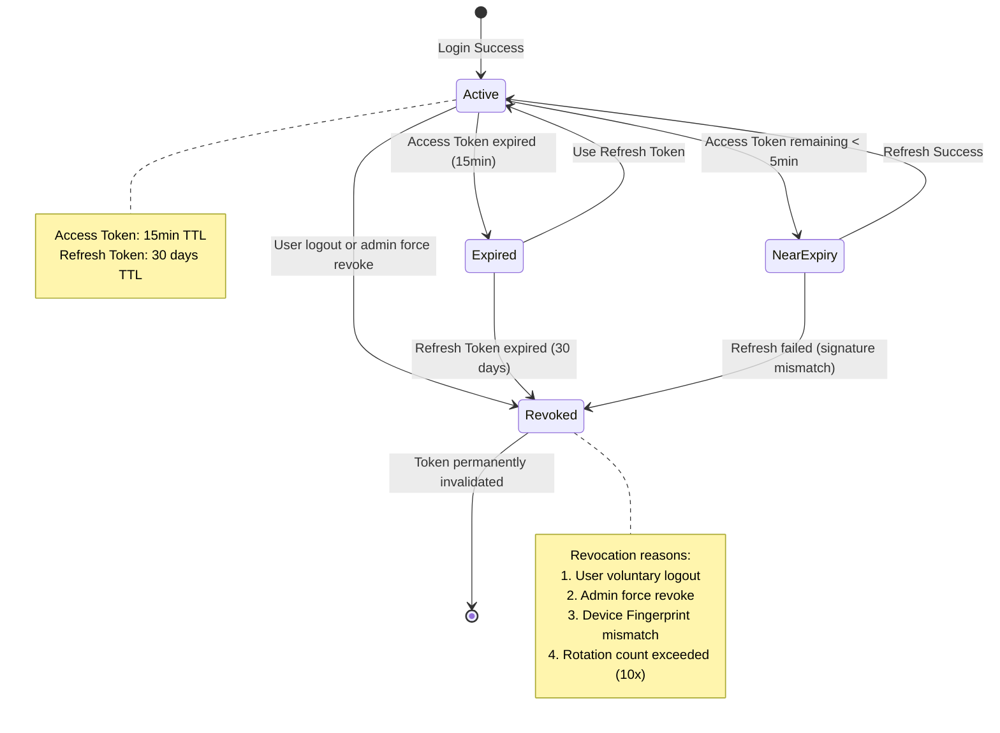
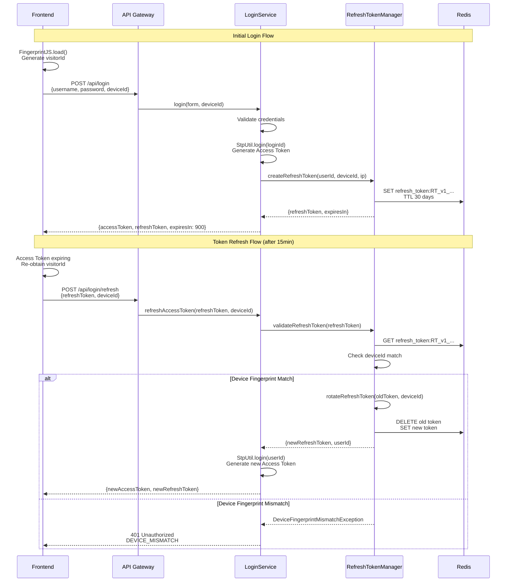
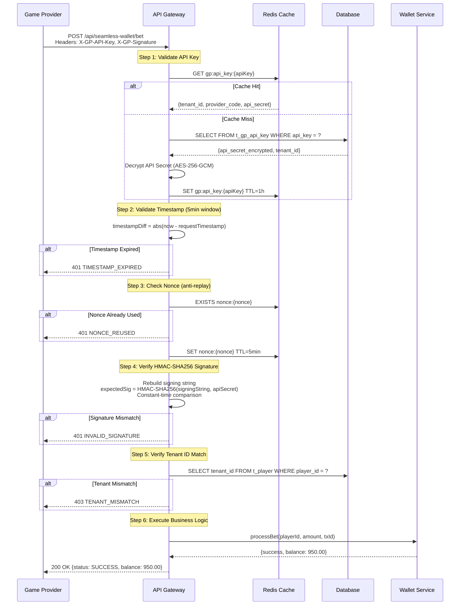
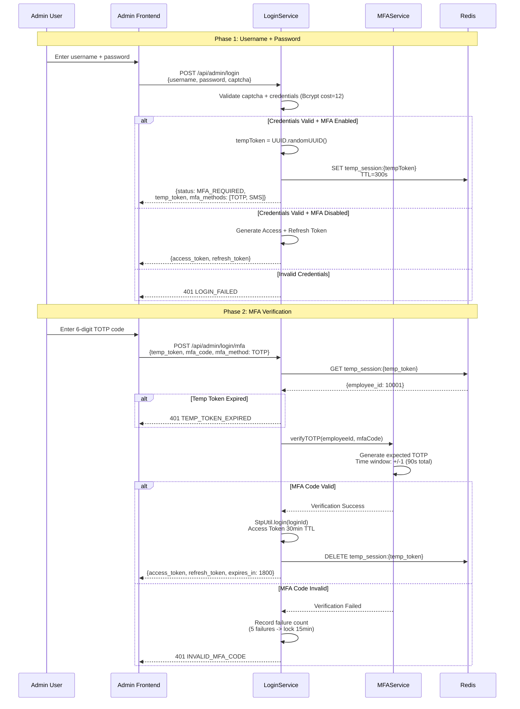
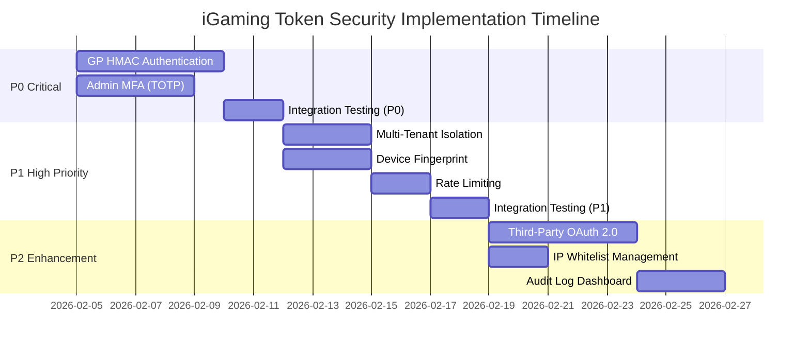

# 多主體 Token 安全方案（Multi-Actor Token Security）

> **業務需求**: [合規標準需求](../../requirements/12_Security_Compliance/02_Compliance_Standards_Requirements.md)
> **規範來源**: [09-12 Multi Actor Token Security](../../source-archive/09_Technical_Infrastructure/09-12_Multi_Actor_Token_Security.md)
> **目標讀者**: Security Architects, Backend Engineers, DevOps

---

## 1. 架構總覽

```mermaid
graph TD
    subgraph "Player Authentication"
        A1[Player Login<br/>Web/iOS/Android] --> A2[LoginService<br/>Password + Captcha]
        A2 --> A3[Access Token<br/>Sa-Token: 15min]
        A2 --> A4[Refresh Token<br/>30 days]
        A3 --> A5[Device Fingerprint<br/>FingerprintJS]
    end

    subgraph "Game Provider Authentication"
        B1[GP API Request] --> B2[API Gateway<br/>Validate API Key]
        B2 --> B3[HMAC-SHA256<br/>Signature Verification]
        B3 --> B4{Valid?}
        B4 -->|Yes| B5[Process Request]
        B4 -->|No| B6[Reject 401]
    end

    subgraph "Third Party Authentication"
        C1[OAuth Request] --> C2[OAuth 2.0 Server<br/>Client Credentials]
        C2 --> C3[Generate JWT 1h]
        C3 --> C4[IP Whitelist + Rate Limit]
    end

    subgraph "Admin Authentication"
        D1[Admin Login] --> D2[MFA TOTP/SMS]
        D2 --> D3[Token 30min]
        D3 --> D4[IP Restriction + RBAC]
    end
```



---

## 2. 四種主體認證策略對比

| 主體 | Token 類型 | Access Token 有效期 | Refresh Token | 驗證方式 | 安全措施 |
|------|-----------|-------------------|--------------|---------|---------|
| **玩家** | JWT (Redis Opaque) | 15 min | 30 天 | Sa-Token + Device FP | Token Rotation + MFA (可選) |
| **遊戲商** | Opaque (API Key) | 永久 | N/A | HMAC-SHA256 | IP 白名單 + Rate Limit |
| **第三方** | JWT (OAuth 2.0) | 1 小時 | 7 天 | OAuth 2.0 Client Credentials | Webhook 簽名 + IP 白名單 |
| **後台用戶** | JWT (Redis Opaque) | 30 min | 7 天 | Sa-Token + MFA | TOTP/SMS + IP 限制 + 審計 |

---

## 3. 設計原則

### 3.1 差異化策略

| 主體 | Token 選擇 | 理由 |
|------|-----------|------|
| **玩家** | JWT | 需攜帶 user context (user_id, tenant_id, roles) 給前端 |
| **遊戲商** | Opaque Token | S2S 通信，防止 token 檢查攻擊 |
| **第三方** | OAuth 2.0 JWT | 業界標準，降低集成成本 |
| **後台用戶** | JWT + MFA | 高安全需求，防止特權操作被未授權訪問 |

### 3.2 最小特權原則

- **玩家**: 僅訪問自己的錢包、投注、個人資料
- **遊戲商**: 僅訪問指定租戶的錢包 API (Balance/Bet/Result/Rollback)
- **第三方**: 僅訪問授權的 API 端點
- **後台用戶**: 基於 RBAC 的細粒度權限

### 3.3 深度防禦

```
Layer 1: Token 驗證（JWT 簽名、HMAC、Refresh Token）
    |
Layer 2: 身份驗證（Device Fingerprint、MFA、IP 白名單）
    |
Layer 3: 授權驗證（RBAC、租戶隔離、資源所有權）
    |
Layer 4: Rate Limiting（防暴力破解、API 濫用）
    |
Layer 5: 審計日誌（所有敏感操作記錄）
```

---

## 4. 設計決策分析

### 4.1 為何玩家用 JWT，遊戲商用 Opaque Token？

| 選項 | 方案 | 優點 | 缺點 | 結論 |
|------|------|------|------|------|
| **A** | 全部 JWT | 統一實現 | 向 GP 暴露結構、無法針對性 TTL | 不推薦 |
| **B** | 差異化策略 | 針對性安全、最佳性能、靈活 TTL | 實現複雜度高 | 推薦 |
| **C** | 全部 OAuth 2.0 | 業界標準 | GP S2S 過度設計、握手開銷高 | 不推薦 |

**Trade-off**: 安全性 > 實現成本 -> 選擇 B

### 4.2 為何後台強制 MFA，玩家可選？

| 主體 | 權限範圍 | 風險等級 | MFA |
|------|---------|---------|-----|
| **後台** | 提款批准、餘額調整、封禁 | 極高 | 強制 |
| **玩家** | 自己的錢包和資料 | 中等 | 可選 |

---

## 5. 玩家 Token 方案

### 5.1 Token Claim 結構

```json
{
  "sub": "2:1001:50001",
  "user_id": 50001,
  "tenant_id": 1001,
  "user_type": "PLAYER",
  "device_id": "fp_abc123xyz",
  "roles": ["PLAYER", "VIP_GOLD"],
  "iat": 1675267200,
  "exp": 1675268100
}
```

### 5.2 Refresh Token 格式 (Opaque)

```
Format: RT_v1_{tenant_id}_{user_id}_{uuid}_{checksum}

Example:
RT_v1_1001_50001_a3b2c1d4e5f6_ab12cd34

Components:
- RT_v1: prefix + version (supports future format upgrades)
- tenant_id: tenant ID (1001) - multi-tenant isolation
- user_id: player ID (50001)
- uuid: random UUID (high entropy, prevents guessing)
- checksum: HMAC-SHA256 checksum first 8 chars (prevents forgery)
```

### 5.3 Token 生命週期狀態機



### 5.4 Device Fingerprint 驗證流程



### 5.5 Device Fingerprint 不匹配處理策略

| 風險級別 | 指紋變更原因 | 處理策略 | 用戶體驗影響 |
|---------|------------|---------|------------|
| **低** | 瀏覽器更新、清除 Cookie | 允許刷新 + 記錄警告日誌 | 無影響 |
| **中** | VPN 變更、代理服務器 | 要求郵箱/SMS 驗證碼 | ~30秒 |
| **高** | 完全不同設備 (iOS -> Android) | 強制重新登入 + 安全告警 | ~1分鐘 |

### 5.6 Token Rotation 機制

```
T0: User logs in, receives Refresh Token (RT_v1_abc123)
T1: Attacker intercepts RT_v1_abc123 via MITM
T2: Legitimate user refreshes Access Token
    -> Server generates new Refresh Token (RT_v1_def456)
    -> Server revokes old Refresh Token (RT_v1_abc123)
T3: Attacker attempts to use stolen RT_v1_abc123
    -> Server queries Redis: Token not found
    -> Server rejects: 401 Unauthorized (REFRESH_TOKEN_REVOKED)
    -> Triggers security alert: suspected stolen Refresh Token
Result: Attack blocked, user protected
```

---

## 6. 遊戲商 Token 方案

### 6.1 API Key 格式

```
Format: GP_{tenant_id}_{provider_code}_{uuid}_{checksum}

Example:
GP_1001_PRAGMATIC_PLAY_a1b2c3d4e5f6_ab12cd34

Components:
- GP: prefix (identifies game provider type)
- tenant_id: tenant ID (1001) - multi-tenant isolation
- provider_code: provider identifier (PRAGMATIC_PLAY)
- uuid: random UUID - high entropy
- checksum: HMAC-SHA256 checksum first 8 chars
```

### 6.2 HMAC-SHA256 簽名驗證流程

**Signing String Construction:**

```
HTTP_METHOD + "\n" +
REQUEST_PATH + "\n" +
TIMESTAMP + "\n" +
NONCE + "\n" +
REQUEST_BODY

Example:
POST
/api/seamless-wallet/bet
1675267200000
a1b2c3d4-e5f6-7890-1234-567890abcdef
{"player_id":"50001","amount":100.00,"currency":"USD","transaction_id":"TX123456"}
```

**HTTP Headers:**

```
POST /api/seamless-wallet/bet HTTP/1.1
Host: igaming-api.example.com
X-GP-API-Key: GP_1001_PRAGMATIC_PLAY_a1b2c3d4e5f6_ab12cd34
X-GP-Timestamp: 1675267200000
X-GP-Nonce: a1b2c3d4-e5f6-7890-1234-567890abcdef
X-GP-Signature: a1b2c3d4e5f6789012345678901234567890abcdef...
Content-Type: application/json
```

### 6.3 簽名驗證序列圖



### 6.4 四種 API 的差異化驗證

| API 類型 | Token 驗證 | HMAC 簽名 | 冪等性 Key | 重試窗口 |
|---------|-----------|-----------|-----------|---------|
| **Balance** | Strict | Required | N/A (read-only) | N/A |
| **Bet** | Strict | Required | `transaction_id` | 1h (Redis) + Permanent (DB) |
| **Result** | Conditional | Required | `transaction_id` | 24h (Redis) + Permanent (DB) |
| **Rollback** | Conditional | Required | `transaction_id` | 7d (Redis) + Permanent (DB) |

---

## 7. 第三方平台 Token 方案

### 7.1 OAuth 2.0 Client Credentials Flow

```java
/**
 * Third-party OAuth 2.0 token issuance
 */
@PostMapping("/oauth/token")
public ResponseDTO<OAuthTokenVO> issueToken(@RequestBody OAuthTokenForm form) {
    // 1. Validate client_id and client_secret
    Option<ThirdPartyEntity> client = thirdPartyService
        .validateClientCredentials(form.getClientId(), form.getClientSecret());

    return client.map(entity -> {
        // 2. Generate JWT with scopes
        String accessToken = JwtUtil.createToken(Map.of(
            "client_id", entity.getClientId(),
            "tenant_id", entity.getTenantId(),
            "scope", entity.getScopes(),
            "exp", Instant.now().plusSeconds(3600).getEpochSecond()
        ));

        // 3. Generate Refresh Token (7 days)
        String refreshToken = refreshTokenManager.createRefreshToken(
            entity.getId(), "oauth_client", form.getClientId()
        ).getToken();

        return ResponseDTO.ok(OAuthTokenVO.builder()
            .accessToken(accessToken)
            .tokenType("Bearer")
            .expiresIn(3600)
            .refreshToken(refreshToken)
            .scope(entity.getScopes())
            .build());
    }).getOrElse(() -> ResponseDTO.error(
        SystemErrorCode.UNAUTHORIZED, "Invalid client credentials"));
}
```

### 7.2 Webhook 簽名驗證

```java
/**
 * Webhook signature validation for third-party callbacks
 */
@RequiredArgsConstructor
public class WebhookSignatureValidator {

    private final StringRedisTemplate redisTemplate;

    public boolean validateWebhookSignature(
        String webhookSecret, String signature,
        String timestamp, String body
    ) {
        // 1. Validate timestamp (5-minute window)
        long timestampDiff = Math.abs(
            System.currentTimeMillis() - Long.parseLong(timestamp)
        );
        if (timestampDiff > 5 * 60 * 1000) {
            return false;
        }

        // 2. Rebuild signing string
        String signingString = timestamp + "." + body;

        // 3. Calculate expected signature
        String expectedSig = HmacUtils.hmacSha256Hex(
            webhookSecret, signingString
        );

        // 4. Constant-time comparison (prevent timing attacks)
        return MessageDigest.isEqual(
            expectedSig.getBytes(),
            signature.replace("sha256=", "").getBytes()
        );
    }
}
```

### 7.3 IP 白名單與 Rate Limit

```json
{
  "partner_id": "partner_1001",
  "allowed_ips": [
    "203.0.113.0/24",
    "198.51.100.50",
    "2001:db8::/32"
  ],
  "rate_limits": {
    "/api/payment/*": { "limit": 1000, "window": "1m", "algorithm": "fixed_window" },
    "/api/kyc/*": { "limit": 100, "window": "1m", "algorithm": "sliding_window" },
    "/webhook/*": { "limit": 500, "window": "1m", "algorithm": "token_bucket" }
  }
}
```

---

## 8. 後台用戶 Token 方案

### 8.1 MFA 強制綁定範圍

| 用戶角色 | MFA 要求 | 理由 |
|---------|---------|------|
| **Super Admin** | Mandatory | 擁有所有權限，風險最高 |
| **Tenant Admin** | Mandatory | 可管理租戶配置和財務操作 |
| **財務專員** | Mandatory | 可批准提款和調整餘額 |
| **風控專員** | Mandatory | 可封禁帳戶和凍結資金 |
| **客服** | Optional | 僅查看權限，風險較低 |
| **運營專員** | Optional | 配置活動和獎金，風險中等 |

### 8.2 MFA 登入流程



### 8.3 TOTP 實現原理 (RFC 6238)

```
TOTP = HOTP(K, T)

Where:
K = Shared secret (Base32 encoded, 160-bit)
T = floor((Current Unix Time - T0) / X)
    T0 = 0 (Unix epoch)
    X = 30 seconds (time step)

HOTP(K, C) = Truncate(HMAC-SHA1(K, C))
Output: 6-digit number (000000 - 999999)

Time window tolerance (+/-1 step, 90 seconds total):
- T-1 = past 30 seconds
- T   = current 30 seconds (priority match)
- T+1 = future 30 seconds
```

### 8.4 Session 管理策略

| 策略 | 配置 | 理由 |
|-----|------|------|
| **Idle Timeout** | 15 min inactive -> auto-logout | Prevent unauthorized access when user leaves |
| **Absolute Timeout** | 8 hours -> force re-login | Limit maximum token lifetime |
| **Concurrent Sessions** | Single session only | Prevent account sharing (Sa-Token: is-concurrent=false) |

---

## 9. 多租戶 Token 隔離

### 9.1 LoginId 格式擴展

```
Current format (SmartAdmin v4.1.0):
  userType:employeeId
  Example: 1:10001

Multi-tenant format (proposed):
  userType:tenantId:userId
  Examples:
  1:1001:10001  (Tenant 1001 admin employee 10001)
  2:1001:50001  (Tenant 1001 player 50001)
  2:1002:50002  (Tenant 1002 player 50002)
```

### 9.2 TenantInterceptor 驗證邏輯

```java
/**
 * Multi-tenant token isolation interceptor
 */
@RequiredArgsConstructor
public class TenantInterceptor implements HandlerInterceptor {

    @Override
    public boolean preHandle(HttpServletRequest request,
                             HttpServletResponse response,
                             Object handler) {
        // Step 1: Extract tenant_id from Token
        String loginId = StpUtil.getLoginIdAsString();  // "1:1001:10001"
        Long tenantIdFromToken = extractTenantId(loginId);

        // Step 2: Extract tenant_id from request
        Long tenantIdFromRequest = getTenantIdFromRequest(request);

        // Step 3: Compare tenant_id
        if (!tenantIdFromToken.equals(tenantIdFromRequest)) {
            log.warn("Tenant mismatch: token={}, request={}",
                tenantIdFromToken, tenantIdFromRequest);
            throw new ForbiddenException("Cross-tenant access denied");
        }

        // Step 4: Set TenantContext (ThreadLocal)
        TenantContext.setTenantId(tenantIdFromToken);

        return true;
    }

    private Long extractTenantId(String loginId) {
        String[] parts = loginId.split(":");
        return Long.parseLong(parts[1]);
    }
}
```

### 9.3 MyBatis 租戶攔截器

```sql
-- Original SQL (developer writes):
SELECT * FROM t_player WHERE player_id = 50001;

-- Transformed SQL (interceptor adds automatically):
SELECT * FROM t_player WHERE player_id = 50001 AND tenant_id = 1001;
```

### 9.4 PostgreSQL Row-Level Security

```sql
-- Enable RLS on player table
ALTER TABLE t_player ENABLE ROW LEVEL SECURITY;

-- Create RLS policy: users can only access their own tenant data
CREATE POLICY tenant_isolation_policy ON t_player
    USING (tenant_id = current_setting('app.current_tenant_id')::bigint);

-- Application layer sets current tenant ID per request
SET LOCAL app.current_tenant_id = 1001;

-- PostgreSQL automatically applies RLS filter
SELECT * FROM t_player WHERE player_id = 50001;
-- Internally: SELECT * FROM t_player WHERE player_id = 50001 AND tenant_id = 1001;
```

---

## 10. 安全事件審計日誌

### 10.1 審計級別

| 級別 | 觸發條件 | 保留期限 | 告警 |
|-----|---------|---------|------|
| **CRITICAL** | 提款批准、玩家封禁、餘額調整 | 7 年 | 立即 (Slack + Email) |
| **HIGH** | KYC 批准、角色變更、配置更新 | 3 年 | 每日摘要 |
| **MEDIUM** | 報表導出、玩家搜索 | 1 年 | 每週摘要 |
| **LOW** | 儀表板查看、登入/登出 | 90 天 | 無告警 |

### 10.2 審計日誌結構

```json
{
  "log_id": "audit_123456789",
  "timestamp": "2026-02-10T10:30:00Z",
  "level": "CRITICAL",
  "event_type": "WITHDRAWAL_APPROVED",
  "employee_id": 10001,
  "employee_name": "John Doe",
  "role": "Financial Officer",
  "ip_address": "203.0.113.50",
  "user_agent": "Mozilla/5.0 ...",
  "action_details": {
    "player_id": 50001,
    "amount": 10000.00,
    "currency": "USD",
    "withdrawal_id": "WD123456"
  },
  "result": "SUCCESS",
  "tenant_id": 1001,
  "actor_type": "ADMIN"
}
```

### 10.3 RBAC 權限驗證流程

```
HTTP Request -> AdminInterceptor.preHandle()
    |
Step 1: Extract employee_id from Token
    |
Step 2: Check @NoNeedLogin annotation (public endpoints)
    | not present |
Step 3: Validate login status (Token validity)
    |
Step 4: Check @SaCheckPermission annotation
    |
Step 5: Load user permissions from Redis
    Key: user_permission:{employee_id}
    Value: ["system:user:add", "finance:withdrawal:approve", ...]
    |
Step 6: Verify user has required permission
    |
Step 7: Allow request -> Controller handles business logic
```

---

## 11. 威脅模型

### 11.1 OWASP Top 10 對照

| OWASP 風險 | iGaming 情境 | Token 層級緩解措施 | 有效性 |
|-----------|-------------|-------------------|--------|
| **A01: Broken Access Control** | 玩家訪問其他玩家錢包 | tenant_id 驗證 + RBAC | 極高 |
| **A02: Cryptographic Failures** | Token 簽名偽造 | HMAC-SHA256 / JWT RSA-256 / TLS 1.3 | 極高 |
| **A04: Insecure Design** | Token 永不過期、無 MFA | 短 TTL + Token Rotation + MFA | 極高 |
| **A07: Auth Failures** | 弱密碼 + 無 MFA + 暴力破解 | MFA + Device FP + Bcrypt cost=12 | 高 |

### 11.2 按主體的威脅分析

| 威脅 | 攻擊方式 | 防禦措施 | 防禦層 |
|------|---------|---------|--------|
| Token 竊取 | XSS, MITM | HttpOnly Cookie + HTTPS + CSP | L1 |
| Token 重放 | 截取重用 | Token Rotation + Nonce | L1 |
| 暴力破解 | 枚舉 | Rate Limiting + Account Lockout | L4 |
| 內部威脅 | 員工濫用 | Audit Log + Separation of Duties | L5 |
| 設備劫持 | 惡意設備 | Device Fingerprint + MFA | L2 |

---

## 12. Rate Limiting 設計

| 主體類型 | 端點 | 限制 | 時間窗口 | 算法 |
|---------|------|------|---------|------|
| **玩家** | `/api/login` | 10 次 | 15 min | Sliding Window |
| **玩家** | `/api/wallet/*` | 100 次 | 1 min | Token Bucket |
| **遊戲商** | `/api/seamless-wallet/bet` | 500 次 | 1 min | Leaky Bucket |
| **第三方** | `/api/payment/*` | 1000 次 | 1 min | Fixed Window |
| **管理員** | `/api/admin/withdrawal/approve` | 20 次 | 1 min | Sliding Window |

### Rate Limit 算法對比

| 算法 | 特點 | 適用場景 |
|-----|------|---------|
| **Fixed Window** | 固定時間窗口計數，實現簡單 | 第三方 API（流量穩定） |
| **Sliding Window** | 平滑處理突發流量 | 登入端點（防暴力破解） |
| **Token Bucket** | 允許短時突發 | 玩家錢包 API |
| **Leaky Bucket** | 嚴格限制請求速率 | 遊戲商 Bet API |

---

## 13. 實施建議

### P0 (Critical - Week 1-2)

| 任務 | 組件 | 工作量 |
|-----|------|-------|
| 玩家 Token - OAuth 2.0 Refresh Token | RefreshTokenManager, RefreshTokenService | Done |
| 遊戲商 Token - HMAC 簽名驗證 | GpApiKeyService, GpSignatureValidator | 5 days |
| 管理員 Token - MFA (TOTP) | TOTPService, MFAController | 4 days |

### P1 (High - Week 3-4)

| 任務 | 組件 | 工作量 |
|-----|------|-------|
| 多租戶 Token 隔離 | TenantInterceptor, TenantSqlInterceptor | 3 days |
| Device Fingerprint 整合 | DeviceFingerprintService, frontend/fingerprint.ts | 3 days |
| Rate Limiting | RateLimitService, RateLimitInterceptor | 2 days |

### P2 (Enhancement - Week 5-6)

| 任務 | 組件 | 工作量 |
|-----|------|-------|
| 第三方 OAuth 2.0 Server | OAuth2AuthorizationServer | 5 days |
| IP 白名單管理 | IpWhitelistService | 2 days |
| 審計日誌儀表板 | AuditLogDashboard.vue | 3 days |

### 實施時間線



---

## 相關文件

- [OAuth Refresh Token](./18_OAuth_Refresh_Token.md) — OAuth Refresh Token 實施方案
- [Token 驗證服務](./20_Token_Validation_Service.md) — Token 驗證服務架構
- [Token 驗證架構](./19_Token_Validation_Architecture.md) — 驗證架構設計
- [身份驗證架構](./05_Authentication_Architecture.md) — 認證與授權架構
