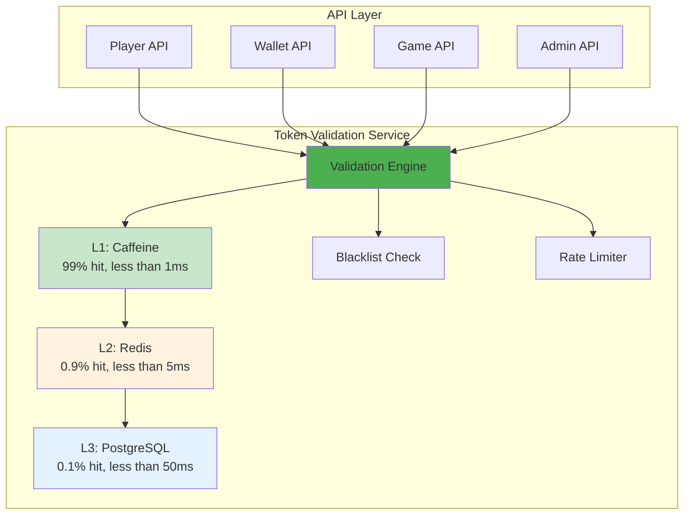
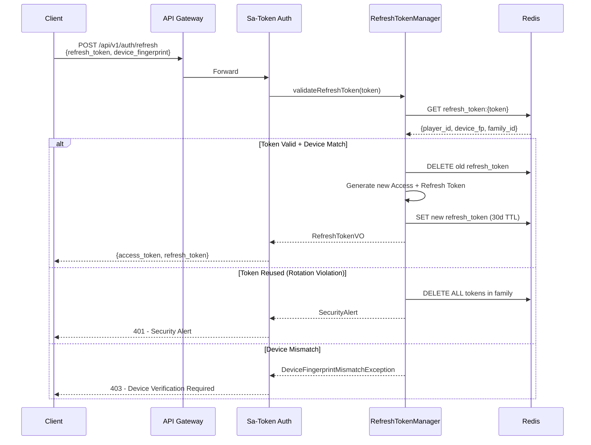
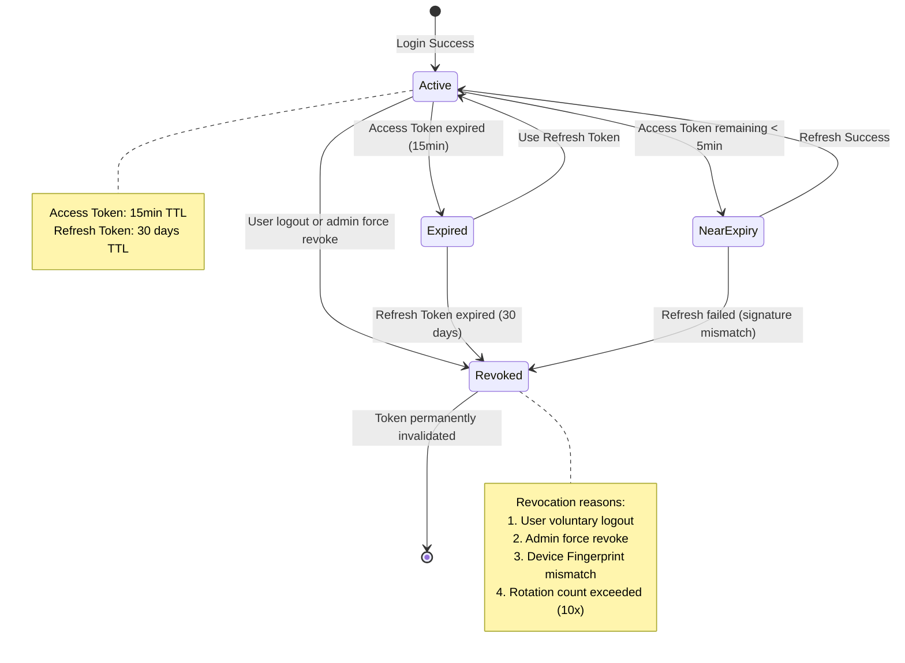
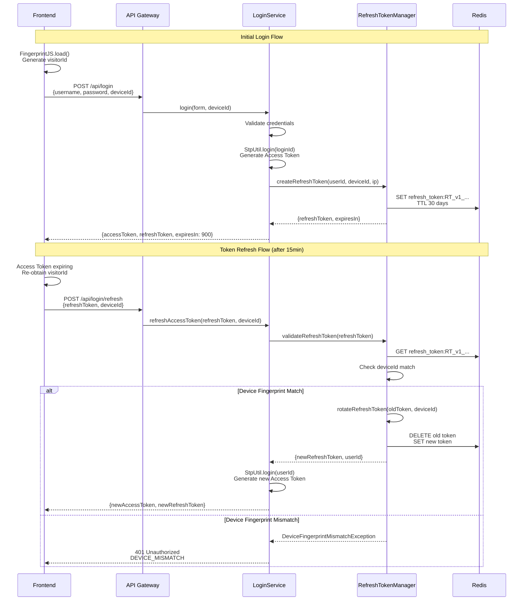
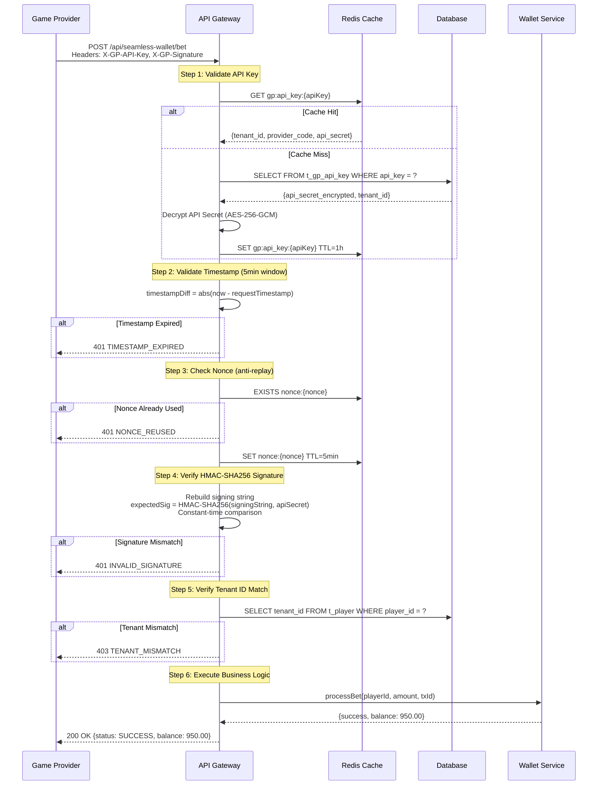
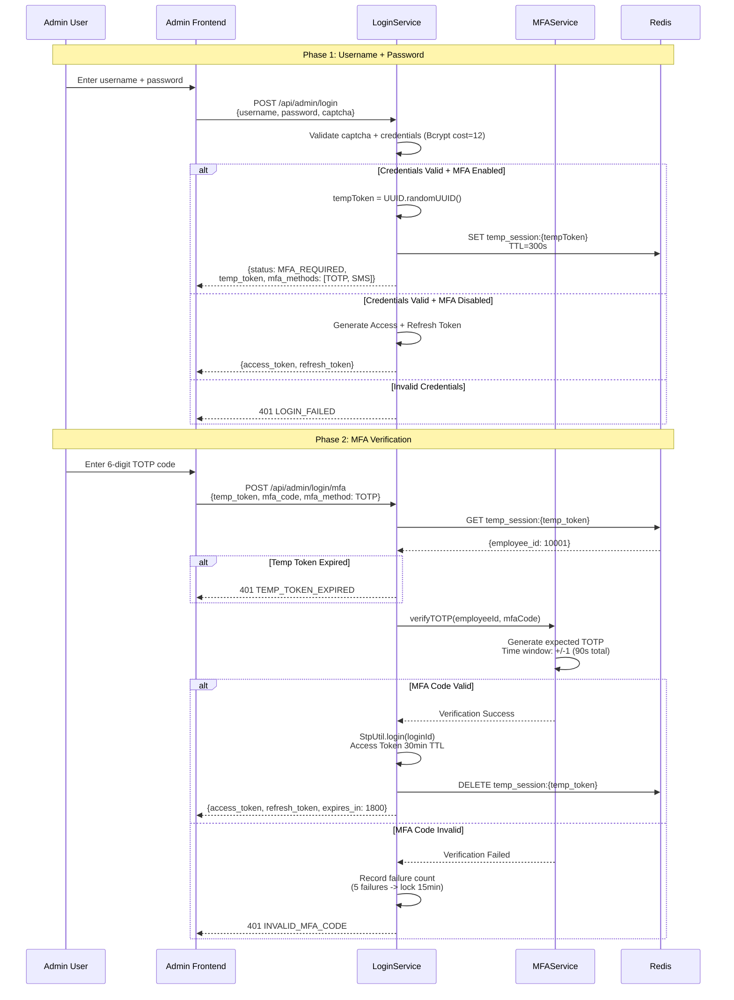

# Token 安全架構（Token Security Architecture）

<!-- SSOT: 本文件為 Token 安全架構唯一真實來源（Single Source of Truth）。
     原始文件 17_Multi_Actor_Token_Security.md、18_OAuth_Refresh_Token.md、
     19_Token_Validation_Architecture.md 已於 Task [12] 合併至本文件。 -->

> **業務需求**: [合規標準需求](../../requirements/12_Security_Compliance/02_Compliance_Standards_Requirements.md)
> **規範來源**: [09-11 OAuth Refresh Token](../../source-archive/09_Technical_Infrastructure/09-11_OAuth_Refresh_Token_Implementation.md) | [09-12 Multi Actor Token Security](../../source-archive/09_Technical_Infrastructure/09-12_Multi_Actor_Token_Security.md) | [09-13-01 Validation Architecture](../../source-archive/09_Technical_Infrastructure/09-13-01_Validation_Architecture.md)
> **目標讀者**: Security Architects, Backend Engineers, DevOps

---

## 1. 架構概覽

### 1.1 Multi-Actor Token 設計總覽

```mermaid
graph TD
    subgraph "Player Authentication"
        A1[Player Login<br/>Web/iOS/Android] --> A2[LoginService<br/>Password + Captcha]
        A2 --> A3[Access Token<br/>Sa-Token: 15min]
        A2 --> A4[Refresh Token<br/>30 days]
        A3 --> A5[Device Fingerprint<br/>FingerprintJS]
    end

    subgraph "Game Provider Authentication"
        B1[GP API Request] --> B2[API Gateway<br/>Validate API Key]
        B2 --> B3[HMAC-SHA256<br/>Signature Verification]
        B3 --> B4{Valid?}
        B4 -->|Yes| B5[Process Request]
        B4 -->|No| B6[Reject 401]
    end

    subgraph "Third Party Authentication"
        C1[OAuth Request] --> C2[OAuth 2.0 Server<br/>Client Credentials]
        C2 --> C3[Generate JWT 1h]
        C3 --> C4[IP Whitelist + Rate Limit]
    end

    subgraph "Admin Authentication"
        D1[Admin Login] --> D2[MFA TOTP/SMS]
        D2 --> D3[Token 30min]
        D3 --> D4[IP Restriction + RBAC]
    end
```



### 1.2 四種主體認證策略對比

| 主體 | Token 類型 | Access Token 有效期 | Refresh Token | 驗證方式 | 安全措施 |
|------|-----------|-------------------|--------------|---------|---------|
| **玩家** | JWT (Redis Opaque) | 15 min | 30 天 | Sa-Token + Device FP | Token Rotation + MFA (可選) |
| **遊戲商** | Opaque (API Key) | 永久 | N/A | HMAC-SHA256 | IP 白名單 + Rate Limit |
| **第三方** | JWT (OAuth 2.0) | 1 小時 | 7 天 | OAuth 2.0 Client Credentials | Webhook 簽名 + IP 白名單 |
| **後台用戶** | JWT (Redis Opaque) | 30 min | 7 天 | Sa-Token + MFA | TOTP/SMS + IP 限制 + 審計 |

### 1.3 OAuth 2.0 Refresh Token 架構

```mermaid
flowchart TD
    FE[iGaming Frontend<br/>Vue 3 + Ant Design Vue] -->|Access Token 15min| GW[API Gateway]
    GW -->|Token Verify| SA[SmartAdmin Backend<br/>Spring Boot 3 + Sa-Token]
    SA -->|Process| BET[Betting Service]

    FE -->|Token Expired| REFRESH[Refresh Token Flow]
    REFRESH -->|Refresh Token 30d| SA
    SA -->|Validate Device| FP[FingerprintJS<br/>Device Fingerprint]
    SA -->|New Tokens| FE

    SA --> RTM[RefreshTokenManager<br/>@Transactional]
    RTM --> REDIS[(Redis<br/>Refresh Token Store<br/>Sentinel HA)]

    style FE fill:#E3F2FD
    style SA fill:#C8E6C9
    style RTM fill:#E8F5E9
    style REDIS fill:#FFF3E0
```

### 1.4 Token Validation Service 系統定位



---

## 2. 設計原則

### 2.1 差異化策略

| 主體 | Token 選擇 | 理由 |
|------|-----------|------|
| **玩家** | JWT | 需攜帶 user context (user_id, tenant_id, roles) 給前端 |
| **遊戲商** | Opaque Token | S2S 通信，防止 token 檢查攻擊 |
| **第三方** | OAuth 2.0 JWT | 業界標準，降低集成成本 |
| **後台用戶** | JWT + MFA | 高安全需求，防止特權操作被未授權訪問 |

### 2.2 最小特權原則

- **玩家**: 僅訪問自己的錢包、投注、個人資料
- **遊戲商**: 僅訪問指定租戶的錢包 API (Balance/Bet/Result/Rollback)
- **第三方**: 僅訪問授權的 API 端點
- **後台用戶**: 基於 RBAC 的細粒度權限

### 2.3 深度防禦

```
Layer 1: Token 驗證（JWT 簽名、HMAC、Refresh Token）
    |
Layer 2: 身份驗證（Device Fingerprint、MFA、IP 白名單）
    |
Layer 3: 授權驗證（RBAC、租戶隔離、資源所有權）
    |
Layer 4: Rate Limiting（防暴力破解、API 濫用）
    |
Layer 5: 審計日誌（所有敏感操作記錄）
```

---

## 3. OAuth 2.0 Refresh Token 實施方案

### 3.1 原始風險與 ROI 分析

**原始流程風險（根據交易 ID 找到用戶並重新生成 token）**：

| 風險 | 說明 |
|------|------|
| **身份驗證缺失** | 任何人知道交易 ID 即可冒充用戶 |
| **水平越權攻擊** | 攻擊者可枚舉交易 ID 批量盜取憑證 |
| **違反 OAuth 2.0** | Token 刷新必須驗證 Refresh Token |
| **合規風險** | 違反 GDPR、等保三級、MGA/UKGC |

| 項目 | 金額 |
|------|------|
| **實施成本** | $24,000 - $42,000 |
| **年度收益** | $650,000 - $2,300,000 |
| **ROI** | 1448% (保守估計) |

### 3.2 Token 生命週期

| Token 類型 | 有效期 | 存儲位置 | 刷新機制 |
|-----------|--------|---------|---------|
| **Access Token** | 15 分鐘 | LocalStorage | 通過 Refresh Token 刷新 |
| **Refresh Token** | 30 天 | Redis (HttpOnly) | Token Rotation |

**核心安全特性**:
- **Token Rotation**: 刷新後舊 Refresh Token 立即失效
- **Device Fingerprint**: FingerprintJS 設備識別（99.5% 準確率）
- **Redis 高可用**: 主從 + Sentinel 架構
- **Family Detection**: 偵測舊 Token 重用，自動撤銷整個 Token 家族

### 3.3 刷新流程



### 3.4 核心類設計

**模組結構**:

```
smartadmin-support/smartadmin-support-refresh-token/
└── src/
    ├── main/java/net/lab1024/sa/support/refreshtoken/
    │   ├── constant/
    │   │   └── RefreshTokenConstant.java
    │   ├── domain/
    │   │   ├── RefreshTokenEntity.java
    │   │   ├── RefreshTokenVO.java
    │   │   └── RefreshTokenForm.java
    │   ├── exception/
    │   │   ├── TokenExpiredException.java
    │   │   ├── TokenRotationLimitException.java
    │   │   └── DeviceFingerprintMismatchException.java
    │   ├── manager/
    │   │   └── RefreshTokenManager.java
    │   └── service/
    │       └── RefreshTokenService.java
    └── test/java/net/lab1024/sa/support/refreshtoken/
        ├── manager/
        │   └── RefreshTokenManagerTest.java
        └── service/
            └── RefreshTokenServiceTest.java
```

**RefreshTokenConstant**:

```java
package net.lab1024.sa.support.refreshtoken.constant;

/**
 * Refresh Token constants
 */
public interface RefreshTokenConstant {

    /** Redis Key prefix */
    String REDIS_KEY_PREFIX = "refresh_token:";

    /** Token version */
    String TOKEN_VERSION = "v1";

    /** Token expiry in days */
    int TOKEN_EXPIRY_DAYS = 30;

    /** Maximum rotation count (prevent infinite refresh) */
    int MAX_ROTATION_COUNT = 10;

    /** Token format: RT_v1_{userId}_{uuid}_{checksum} */
    String TOKEN_FORMAT = "RT_%s_%d_%s_%s";
}
```

**RefreshTokenManager（Transaction Layer）**:

```java
package net.lab1024.sa.support.refreshtoken.manager;

import io.vavr.control.Option;
import io.vavr.control.Try;
import lombok.RequiredArgsConstructor;
import lombok.extern.slf4j.Slf4j;
import net.lab1024.sa.common.json.util.JsonUtil;
import net.lab1024.sa.support.refreshtoken.constant.RefreshTokenConstant;
import net.lab1024.sa.support.refreshtoken.domain.RefreshTokenEntity;
import net.lab1024.sa.support.refreshtoken.domain.RefreshTokenVO;
import net.lab1024.sa.support.refreshtoken.exception.TokenExpiredException;
import net.lab1024.sa.support.refreshtoken.exception.TokenRotationLimitException;
import org.springframework.data.redis.core.StringRedisTemplate;
import org.springframework.stereotype.Service;
import org.springframework.transaction.annotation.Transactional;
import org.springframework.util.DigestUtils;

import java.time.LocalDateTime;
import java.util.UUID;
import java.util.concurrent.TimeUnit;

/**
 * Refresh Token Manager (transaction layer)
 */
@Slf4j
@Service
@RequiredArgsConstructor
public class RefreshTokenManager {

    private final StringRedisTemplate redisTemplate;

    @Transactional(rollbackFor = Throwable.class)
    public RefreshTokenVO createRefreshToken(Long userId, String deviceId, String ipAddress) {
        String tokenId = UUID.randomUUID().toString().replace("-", "");
        String checksum = generateChecksum(userId, tokenId);
        String refreshToken = String.format(
            RefreshTokenConstant.TOKEN_FORMAT,
            RefreshTokenConstant.TOKEN_VERSION,
            userId, tokenId, checksum
        );

        LocalDateTime now = LocalDateTime.now();
        RefreshTokenEntity entity = RefreshTokenEntity.builder()
            .token(refreshToken)
            .userId(userId)
            .deviceId(deviceId)
            .ipAddress(ipAddress)
            .createdAt(now)
            .expiresAt(now.plusDays(RefreshTokenConstant.TOKEN_EXPIRY_DAYS))
            .rotationCount(0)
            .lastRotatedAt(null)
            .build();

        String redisKey = RefreshTokenConstant.REDIS_KEY_PREFIX + refreshToken;
        redisTemplate.opsForValue().set(
            redisKey, JsonUtil.toJson(entity),
            RefreshTokenConstant.TOKEN_EXPIRY_DAYS, TimeUnit.DAYS
        );

        return RefreshTokenVO.builder()
            .token(refreshToken)
            .expiresIn(RefreshTokenConstant.TOKEN_EXPIRY_DAYS * 24 * 60 * 60)
            .build();
    }

    public Option<RefreshTokenEntity> validateRefreshToken(String refreshToken) {
        return Try.of(() -> {
            if (!refreshToken.startsWith("RT_" + RefreshTokenConstant.TOKEN_VERSION + "_")) {
                throw new IllegalArgumentException("Invalid token format");
            }

            String redisKey = RefreshTokenConstant.REDIS_KEY_PREFIX + refreshToken;
            String jsonValue = redisTemplate.opsForValue().get(redisKey);

            if (jsonValue == null) {
                throw new TokenExpiredException("Refresh token expired or revoked");
            }

            RefreshTokenEntity entity = JsonUtil.fromJson(jsonValue, RefreshTokenEntity.class);

            if (entity.getExpiresAt().isBefore(LocalDateTime.now())) {
                redisTemplate.delete(redisKey);
                throw new TokenExpiredException("Refresh token expired");
            }

            if (entity.getRotationCount() >= RefreshTokenConstant.MAX_ROTATION_COUNT) {
                throw new TokenRotationLimitException("Token rotation limit exceeded");
            }

            return entity;
        })
        .onFailure(e -> log.error("Refresh token validation failed: {}", refreshToken, e))
        .toOption();
    }

    @Transactional(rollbackFor = Throwable.class)
    public RefreshTokenVO rotateRefreshToken(RefreshTokenEntity oldToken, String deviceId) {
        String oldRedisKey = RefreshTokenConstant.REDIS_KEY_PREFIX + oldToken.getToken();
        redisTemplate.delete(oldRedisKey);

        RefreshTokenVO newToken = createRefreshToken(
            oldToken.getUserId(), deviceId, oldToken.getIpAddress()
        );

        String newRedisKey = RefreshTokenConstant.REDIS_KEY_PREFIX + newToken.getToken();
        String jsonValue = redisTemplate.opsForValue().get(newRedisKey);
        RefreshTokenEntity newEntity = JsonUtil.fromJson(jsonValue, RefreshTokenEntity.class);
        newEntity.setRotationCount(oldToken.getRotationCount() + 1);
        newEntity.setLastRotatedAt(LocalDateTime.now());

        redisTemplate.opsForValue().set(
            newRedisKey, JsonUtil.toJson(newEntity),
            RefreshTokenConstant.TOKEN_EXPIRY_DAYS, TimeUnit.DAYS
        );

        return newToken;
    }

    @Transactional(rollbackFor = Throwable.class)
    public void revokeRefreshToken(String refreshToken) {
        String redisKey = RefreshTokenConstant.REDIS_KEY_PREFIX + refreshToken;
        Boolean deleted = redisTemplate.delete(redisKey);
        if (Boolean.TRUE.equals(deleted)) {
            log.info("Revoked refresh token: {}", refreshToken);
        }
    }

    private String generateChecksum(Long userId, String tokenId) {
        String data = userId + ":" + tokenId + ":" + "secret";
        return DigestUtils.md5DigestAsHex(data.getBytes()).substring(0, 8);
    }
}
```

---

## 4. 玩家 Token 方案

### 4.1 Token Claim 結構

```json
{
  "sub": "2:1001:50001",
  "user_id": 50001,
  "tenant_id": 1001,
  "user_type": "PLAYER",
  "device_id": "fp_abc123xyz",
  "roles": ["PLAYER", "VIP_GOLD"],
  "iat": 1675267200,
  "exp": 1675268100
}
```

### 4.2 Refresh Token 格式 (Opaque)

```
Format: RT_v1_{tenant_id}_{user_id}_{uuid}_{checksum}

Example:
RT_v1_1001_50001_a3b2c1d4e5f6_ab12cd34

Components:
- RT_v1: prefix + version (supports future format upgrades)
- tenant_id: tenant ID (1001) - multi-tenant isolation
- user_id: player ID (50001)
- uuid: random UUID (high entropy, prevents guessing)
- checksum: HMAC-SHA256 checksum first 8 chars (prevents forgery)
```

### 4.3 Token 生命週期狀態機



### 4.4 Device Fingerprint 驗證流程



### 4.5 Device Fingerprint 不匹配處理策略

| 風險級別 | 指紋變更原因 | 處理策略 | 用戶體驗影響 |
|---------|------------|---------|------------|
| **低** | 瀏覽器更新、清除 Cookie | 允許刷新 + 記錄警告日誌 | 無影響 |
| **中** | VPN 變更、代理服務器 | 要求郵箱/SMS 驗證碼 | ~30秒 |
| **高** | 完全不同設備 (iOS -> Android) | 強制重新登入 + 安全告警 | ~1分鐘 |

### 4.6 Token Rotation 機制

```
T0: User logs in, receives Refresh Token (RT_v1_abc123)
T1: Attacker intercepts RT_v1_abc123 via MITM
T2: Legitimate user refreshes Access Token
    -> Server generates new Refresh Token (RT_v1_def456)
    -> Server revokes old Refresh Token (RT_v1_abc123)
T3: Attacker attempts to use stolen RT_v1_abc123
    -> Server queries Redis: Token not found
    -> Server rejects: 401 Unauthorized (REFRESH_TOKEN_REVOKED)
    -> Triggers security alert: suspected stolen Refresh Token
Result: Attack blocked, user protected
```

### 4.7 LoginService 整合

```java
// New dependency injection
private final RefreshTokenManager refreshTokenManager;

/**
 * Refresh Access Token (new endpoint)
 */
@NoNeedLogin
public ResponseDTO<LoginResultVO> refreshAccessToken(
    String refreshTokenStr, String deviceFingerprint
) {
    return refreshTokenManager.validateRefreshToken(refreshTokenStr)
        .flatMap(refreshToken -> {
            if (!refreshToken.getDeviceId().equals(deviceFingerprint)) {
                log.warn("Device fingerprint mismatch for userId: {}", refreshToken.getUserId());
                return Option.none();
            }
            return Option.of(refreshToken);
        })
        .map(refreshToken -> {
            String loginId = UserTypeEnum.ADMIN_EMPLOYEE.getValue() + ":" + refreshToken.getUserId();
            StpUtil.login(loginId, new SaLoginModel()
                .setTimeout(15 * 60)
                .setDevice(deviceFingerprint)
            );
            String newAccessToken = StpUtil.getTokenValue();

            RefreshTokenVO newRefreshToken = refreshTokenManager.rotateRefreshToken(
                refreshToken, deviceFingerprint
            );

            LoginResultVO result = new LoginResultVO();
            result.setAccessToken(newAccessToken);
            result.setRefreshToken(newRefreshToken.getToken());
            result.setAccessTokenExpiresIn(15 * 60);
            result.setRefreshTokenExpiresIn(30 * 24 * 60 * 60);

            return ResponseDTO.ok(result);
        })
        .getOrElse(() -> ResponseDTO.error(UserErrorCode.REFRESH_TOKEN_INVALID,
            "Refresh token invalid or expired, please re-login"));
}
```

---

## 5. 遊戲商 Token 方案

### 5.1 API Key 格式

```
Format: GP_{tenant_id}_{provider_code}_{uuid}_{checksum}

Example:
GP_1001_PRAGMATIC_PLAY_a1b2c3d4e5f6_ab12cd34

Components:
- GP: prefix (identifies game provider type)
- tenant_id: tenant ID (1001) - multi-tenant isolation
- provider_code: provider identifier (PRAGMATIC_PLAY)
- uuid: random UUID - high entropy
- checksum: HMAC-SHA256 checksum first 8 chars
```

### 5.2 HMAC-SHA256 簽名驗證流程

**Signing String Construction:**

```
HTTP_METHOD + "\n" +
REQUEST_PATH + "\n" +
TIMESTAMP + "\n" +
NONCE + "\n" +
REQUEST_BODY
```

**HTTP Headers:**

```
POST /api/seamless-wallet/bet HTTP/1.1
Host: igaming-api.example.com
X-GP-API-Key: GP_1001_PRAGMATIC_PLAY_a1b2c3d4e5f6_ab12cd34
X-GP-Timestamp: 1675267200000
X-GP-Nonce: a1b2c3d4-e5f6-7890-1234-567890abcdef
X-GP-Signature: a1b2c3d4e5f6789012345678901234567890abcdef...
Content-Type: application/json
```

### 5.3 簽名驗證序列圖



### 5.4 四種 API 的差異化驗證

| API 類型 | Token 驗證 | HMAC 簽名 | 冪等性 Key | 重試窗口 |
|---------|-----------|-----------|-----------|---------|
| **Balance** | Strict | Required | N/A (read-only) | N/A |
| **Bet** | Strict | Required | `transaction_id` | 1h (Redis) + Permanent (DB) |
| **Result** | Conditional | Required | `transaction_id` | 24h (Redis) + Permanent (DB) |
| **Rollback** | Conditional | Required | `transaction_id` | 7d (Redis) + Permanent (DB) |

---

## 6. 第三方平台 Token 方案

### 6.1 OAuth 2.0 Client Credentials Flow

```java
/**
 * Third-party OAuth 2.0 token issuance
 */
@PostMapping("/oauth/token")
public ResponseDTO<OAuthTokenVO> issueToken(@RequestBody OAuthTokenForm form) {
    Option<ThirdPartyEntity> client = thirdPartyService
        .validateClientCredentials(form.getClientId(), form.getClientSecret());

    return client.map(entity -> {
        String accessToken = JwtUtil.createToken(Map.of(
            "client_id", entity.getClientId(),
            "tenant_id", entity.getTenantId(),
            "scope", entity.getScopes(),
            "exp", Instant.now().plusSeconds(3600).getEpochSecond()
        ));

        String refreshToken = refreshTokenManager.createRefreshToken(
            entity.getId(), "oauth_client", form.getClientId()
        ).getToken();

        return ResponseDTO.ok(OAuthTokenVO.builder()
            .accessToken(accessToken)
            .tokenType("Bearer")
            .expiresIn(3600)
            .refreshToken(refreshToken)
            .scope(entity.getScopes())
            .build());
    }).getOrElse(() -> ResponseDTO.error(
        SystemErrorCode.UNAUTHORIZED, "Invalid client credentials"));
}
```

### 6.2 Webhook 簽名驗證

```java
/**
 * Webhook signature validation for third-party callbacks
 */
@RequiredArgsConstructor
public class WebhookSignatureValidator {

    private final StringRedisTemplate redisTemplate;

    public boolean validateWebhookSignature(
        String webhookSecret, String signature,
        String timestamp, String body
    ) {
        long timestampDiff = Math.abs(
            System.currentTimeMillis() - Long.parseLong(timestamp)
        );
        if (timestampDiff > 5 * 60 * 1000) {
            return false;
        }

        String signingString = timestamp + "." + body;
        String expectedSig = HmacUtils.hmacSha256Hex(webhookSecret, signingString);

        return MessageDigest.isEqual(
            expectedSig.getBytes(),
            signature.replace("sha256=", "").getBytes()
        );
    }
}
```

### 6.3 IP 白名單與 Rate Limit

```json
{
  "partner_id": "partner_1001",
  "allowed_ips": [
    "203.0.113.0/24",
    "198.51.100.50",
    "2001:db8::/32"
  ],
  "rate_limits": {
    "/api/payment/*": { "limit": 1000, "window": "1m", "algorithm": "fixed_window" },
    "/api/kyc/*": { "limit": 100, "window": "1m", "algorithm": "sliding_window" },
    "/webhook/*": { "limit": 500, "window": "1m", "algorithm": "token_bucket" }
  }
}
```

---

## 7. 後台用戶 Token 方案

### 7.1 MFA 強制綁定範圍

| 用戶角色 | MFA 要求 | 理由 |
|---------|---------|------|
| **Super Admin** | Mandatory | 擁有所有權限，風險最高 |
| **Tenant Admin** | Mandatory | 可管理租戶配置和財務操作 |
| **財務專員** | Mandatory | 可批准提款和調整餘額 |
| **風控專員** | Mandatory | 可封禁帳戶和凍結資金 |
| **客服** | Optional | 僅查看權限，風險較低 |
| **運營專員** | Optional | 配置活動和獎金，風險中等 |

### 7.2 MFA 登入流程



### 7.3 Session 管理策略

| 策略 | 配置 | 理由 |
|-----|------|------|
| **Idle Timeout** | 15 min inactive -> auto-logout | Prevent unauthorized access when user leaves |
| **Absolute Timeout** | 8 hours -> force re-login | Limit maximum token lifetime |
| **Concurrent Sessions** | Single session only | Prevent account sharing (Sa-Token: is-concurrent=false) |

---

## 8. Token 驗證架構

### 8.1 為何需要集中式 Token 驗證服務

| 問題 | 說明 |
|------|------|
| **代碼重複** | 每個服務各自實現 Token 驗證邏輯 |
| **不一致** | 不同服務的驗證規則可能不同步 |
| **性能浪費** | 每個服務各自訪問 Redis |
| **運維困難** | 安全策略變更需修改多個服務 |

**解決方案**: 集中式 Token Validation Service — 統一驗證邏輯（支持 4 種 Token 類型）、三層緩存（Caffeine + Redis + PostgreSQL）、集中式黑名單管理、統一限流與熔斷。

### 8.2 服務職責

| 功能 | 說明 |
|------|------|
| **Token 解析** | JWT 解碼、HMAC 驗證、Opaque Token 查找 |
| **黑名單檢查** | 已撤銷的 Token 拒絕通過 |
| **重放攻擊防護** | Nonce + 時間戳驗證 |
| **限流** | Per-IP, Per-User, Per-Endpoint |

**非功能性需求**:

| 需求 | 目標 |
|------|------|
| P99 延遲 | < 10ms (L1 命中) |
| 可用性 | 99.95% SLA |
| 吞吐量 | 10,000 QPS (單實例) |
| 緩存命中率 | > 99% |

### 8.3 API 設計

**單一驗證接口**:

```
POST /api/token/validate
Content-Type: application/json

{
  "token": "eyJhbGciOiJ...",
  "token_type": "JWT_PLAYER",
  "required_permissions": ["wallet:read"]
}
```

**Response (Success)**:
```json
{
  "valid": true,
  "actor_type": "PLAYER",
  "actor_id": "player:123456",
  "tenant_id": "1",
  "permissions": ["wallet:read", "wallet:write"],
  "expires_at": "2026-02-09T10:30:00Z"
}
```

**批量驗證接口**:

```
POST /api/token/validate/batch

{
  "tokens": [
    {"token": "token1", "token_type": "JWT_PLAYER"},
    {"token": "token2", "token_type": "OPAQUE_GP"}
  ]
}
```

**撤銷接口**:

```
POST /api/token/revoke

{
  "token": "eyJhbGciOiJ...",
  "reason": "USER_LOGOUT"
}
```

**內省接口**:

```
POST /api/token/introspect

{
  "token": "eyJhbGciOiJ..."
}
```

Response:
```json
{
  "active": true,
  "token_type": "JWT_PLAYER",
  "actor_id": "player:123456",
  "issued_at": "2026-02-09T10:00:00Z",
  "expires_at": "2026-02-09T10:15:00Z",
  "client_ip": "203.0.113.42"
}
```

### 8.4 Token 類型處理

| Token 類型 | 解析方式 | 驗證步驟 |
|-----------|---------|---------|
| **JWT_PLAYER** | JWT 解碼 (RS256/HS512) | 簽名 -> 過期 -> 黑名單 -> 權限 |
| **OPAQUE_GP** | Redis 查找 | API Key -> HMAC 簽名 -> IP 白名單 |
| **JWT_OAUTH** | JWT 解碼 (RS256) | 簽名 -> 過期 -> Scope -> IP |
| **JWT_ADMIN** | JWT 解碼 + MFA | 簽名 -> 過期 -> MFA 狀態 -> RBAC |

### 8.5 Java 實現（Service 層）

```java
package net.lab1024.sa.system.token;

import io.vavr.control.Option;
import lombok.RequiredArgsConstructor;
import lombok.extern.slf4j.Slf4j;
import org.springframework.stereotype.Service;

/**
 * Token 驗證服務
 * 負責統一的 Token 解析與驗證邏輯
 */
@Slf4j
@Service
@RequiredArgsConstructor
public class TokenValidationService {

    private final TokenValidationDao tokenValidationDao;
    private final TokenCacheManager tokenCacheManager;
    private final TokenBlacklistManager tokenBlacklistManager;

    public Option<TokenValidationVO> validate(String token, String tokenType, List<String> requiredPermissions) {
        return tokenCacheManager.getFromL1Cache(token)
            .orElse(() -> tokenCacheManager.getFromL2Cache(token))
            .orElse(() -> tokenValidationDao.findByToken(token)
                .map(entity -> {
                    TokenValidationVO vo = SmartBeanUtil.copy(entity, TokenValidationVO.class);
                    tokenCacheManager.putToL1AndL2(token, vo);
                    return vo;
                }))
            .filter(vo -> !tokenBlacklistManager.isBlacklisted(token))
            .filter(vo -> hasRequiredPermissions(vo, requiredPermissions));
    }

    public Option<TokenIntrospectionVO> introspect(String token) {
        return tokenValidationDao.findByToken(token)
            .map(entity -> TokenIntrospectionVO.builder()
                .active(!tokenBlacklistManager.isBlacklisted(token))
                .tokenType(entity.getTokenType())
                .actorId(entity.getActorId())
                .issuedAt(entity.getIssuedAt())
                .expiresAt(entity.getExpiresAt())
                .clientIp(entity.getClientIp())
                .build());
    }

    private boolean hasRequiredPermissions(TokenValidationVO vo, List<String> requiredPermissions) {
        if (requiredPermissions == null || requiredPermissions.isEmpty()) {
            return true;
        }
        Set<String> grantedPermissions = new HashSet<>(vo.getPermissions());
        return grantedPermissions.containsAll(requiredPermissions);
    }
}
```

### 8.6 SQL Schema

```sql
-- Token 驗證緩存表（L3 層，用於持久化 Token 驗證結果）
CREATE TABLE t_token_validation (
    id BIGSERIAL PRIMARY KEY,
    token VARCHAR(512) NOT NULL,
    token_type VARCHAR(50) NOT NULL,  -- JWT_PLAYER, OPAQUE_GP, JWT_OAUTH, JWT_ADMIN
    actor_type VARCHAR(50) NOT NULL,
    actor_id VARCHAR(100) NOT NULL,
    tenant_id BIGINT NOT NULL,
    permissions JSONB,
    issued_at TIMESTAMP NOT NULL,
    expires_at TIMESTAMP NOT NULL,
    client_ip VARCHAR(45),
    created_at TIMESTAMP NOT NULL DEFAULT CURRENT_TIMESTAMP,
    updated_at TIMESTAMP NOT NULL DEFAULT CURRENT_TIMESTAMP,
    deleted BOOLEAN NOT NULL DEFAULT FALSE
);

CREATE UNIQUE INDEX idx_token_validation_token ON t_token_validation(token) WHERE deleted = false;
CREATE INDEX idx_token_validation_actor ON t_token_validation(actor_id, tenant_id) WHERE deleted = false;
CREATE INDEX idx_token_validation_expires ON t_token_validation(expires_at) WHERE deleted = false;

-- Token 黑名單表（已撤銷的 Token）
CREATE TABLE t_token_blacklist (
    id BIGSERIAL PRIMARY KEY,
    token VARCHAR(512) NOT NULL,
    reason VARCHAR(200) NOT NULL,      -- USER_LOGOUT, ADMIN_REVOKE, SECURITY_BREACH
    revoked_at TIMESTAMP NOT NULL,
    expires_at TIMESTAMP NOT NULL,
    revoked_by VARCHAR(100),
    created_at TIMESTAMP NOT NULL DEFAULT CURRENT_TIMESTAMP,
    deleted BOOLEAN NOT NULL DEFAULT FALSE
);

CREATE UNIQUE INDEX idx_token_blacklist_token ON t_token_blacklist(token) WHERE deleted = false;
CREATE INDEX idx_token_blacklist_expires ON t_token_blacklist(expires_at) WHERE deleted = false;

COMMENT ON TABLE t_token_validation IS 'Token 驗證緩存表（L3 層持久化）';
COMMENT ON TABLE t_token_blacklist IS 'Token 黑名單表（已撤銷的 Token）';
```

---

## 9. 多租戶 Token 隔離

### 9.1 LoginId 格式擴展

```
Current format (SmartAdmin v4.1.0):
  userType:employeeId
  Example: 1:10001

Multi-tenant format (proposed):
  userType:tenantId:userId
  Examples:
  1:1001:10001  (Tenant 1001 admin employee 10001)
  2:1001:50001  (Tenant 1001 player 50001)
  2:1002:50002  (Tenant 1002 player 50002)
```

### 9.2 TenantInterceptor 驗證邏輯

```java
/**
 * Multi-tenant token isolation interceptor
 */
@RequiredArgsConstructor
public class TenantInterceptor implements HandlerInterceptor {

    @Override
    public boolean preHandle(HttpServletRequest request,
                             HttpServletResponse response,
                             Object handler) {
        String loginId = StpUtil.getLoginIdAsString();
        Long tenantIdFromToken = extractTenantId(loginId);
        Long tenantIdFromRequest = getTenantIdFromRequest(request);

        if (!tenantIdFromToken.equals(tenantIdFromRequest)) {
            log.warn("Tenant mismatch: token={}, request={}", tenantIdFromToken, tenantIdFromRequest);
            throw new ForbiddenException("Cross-tenant access denied");
        }

        TenantContext.setTenantId(tenantIdFromToken);
        return true;
    }

    private Long extractTenantId(String loginId) {
        String[] parts = loginId.split(":");
        return Long.parseLong(parts[1]);
    }
}
```

### 9.3 PostgreSQL Row-Level Security

```sql
ALTER TABLE t_player ENABLE ROW LEVEL SECURITY;

CREATE POLICY tenant_isolation_policy ON t_player
    USING (tenant_id = current_setting('app.current_tenant_id')::bigint);

SET LOCAL app.current_tenant_id = 1001;
```

---

## 10. 威脅模型

### 10.1 OWASP Top 10 對照

| OWASP 風險 | iGaming 情境 | Token 層級緩解措施 | 有效性 |
|-----------|-------------|-------------------|--------|
| **A01: Broken Access Control** | 玩家訪問其他玩家錢包 | tenant_id 驗證 + RBAC | 極高 |
| **A02: Cryptographic Failures** | Token 簽名偽造 | HMAC-SHA256 / JWT RSA-256 / TLS 1.3 | 極高 |
| **A04: Insecure Design** | Token 永不過期、無 MFA | 短 TTL + Token Rotation + MFA | 極高 |
| **A07: Auth Failures** | 弱密碼 + 無 MFA + 暴力破解 | MFA + Device FP + Bcrypt cost=12 | 高 |

### 10.2 按主體的威脅分析

| 威脅 | 攻擊方式 | 防禦措施 | 防禦層 |
|------|---------|---------|--------|
| Token 竊取 | XSS, MITM | HttpOnly Cookie + HTTPS + CSP | L1 |
| Token 重放 | 截取重用 | Token Rotation + Nonce | L1 |
| 暴力破解 | 枚舉 | Rate Limiting + Account Lockout | L4 |
| 內部威脅 | 員工濫用 | Audit Log + Separation of Duties | L5 |
| 設備劫持 | 惡意設備 | Device Fingerprint + MFA | L2 |

---

## 11. Rate Limiting 設計

| 主體類型 | 端點 | 限制 | 時間窗口 | 算法 |
|---------|------|------|---------|------|
| **玩家** | `/api/login` | 10 次 | 15 min | Sliding Window |
| **玩家** | `/api/wallet/*` | 100 次 | 1 min | Token Bucket |
| **遊戲商** | `/api/seamless-wallet/bet` | 500 次 | 1 min | Leaky Bucket |
| **第三方** | `/api/payment/*` | 1000 次 | 1 min | Fixed Window |
| **管理員** | `/api/admin/withdrawal/approve` | 20 次 | 1 min | Sliding Window |

---

## 12. 安全事件審計日誌

### 12.1 審計級別

| 級別 | 觸發條件 | 保留期限 | 告警 |
|-----|---------|---------|------|
| **CRITICAL** | 提款批准、玩家封禁、餘額調整 | 7 年 | 立即 (Slack + Email) |
| **HIGH** | KYC 批准、角色變更、配置更新 | 3 年 | 每日摘要 |
| **MEDIUM** | 報表導出、玩家搜索 | 1 年 | 每週摘要 |
| **LOW** | 儀表板查看、登入/登出 | 90 天 | 無告警 |

---

## 13. 合規性

| 標準 | 狀態 | 說明 |
|------|------|------|
| GDPR Article 32 | Compliant | 多重身份驗證 + Token Rotation + 審計日誌 |
| 等保三級 8.1.4.1 | Compliant | Refresh Token 作為合法身份鑑別信息，符合複雜度要求 |
| 等保三級 8.1.4.5 | Compliant | 審計日誌保留 >= 6 個月 |
| MGA Player Funds Directive | Compliant | 多重身份驗證防止未經授權訪問玩家帳戶 |
| UKGC LCCP 2.1.1 | Compliant | 符合 OAuth 2.0 國際標準 |

---

## 14. 業務場景對照

| 業務場景 | 錯誤方案 | 正確方案 |
|---------|---------|---------|
| 前端 token 過期自動刷新 | 根據交易 ID 生成 token | OAuth 2.0 Refresh Token |
| GP 回調 | 根據交易 ID 生成 token | Webhook HMAC-SHA256 簽名 |
| 管理員處理異常訂單 | 冒充用戶操作 | 管理員權限 + 審計日誌 |

---

## 相關文件

- [Token 效能與運維](./18_Token_Operations.md) — Token 驗證服務、快取效能、Edge 部署
- [身份驗證架構](./05_Authentication_Architecture.md) — 認證與授權架構
- [緩存策略](./14_Caching_Strategy.md) — JetCache 多級緩存策略
