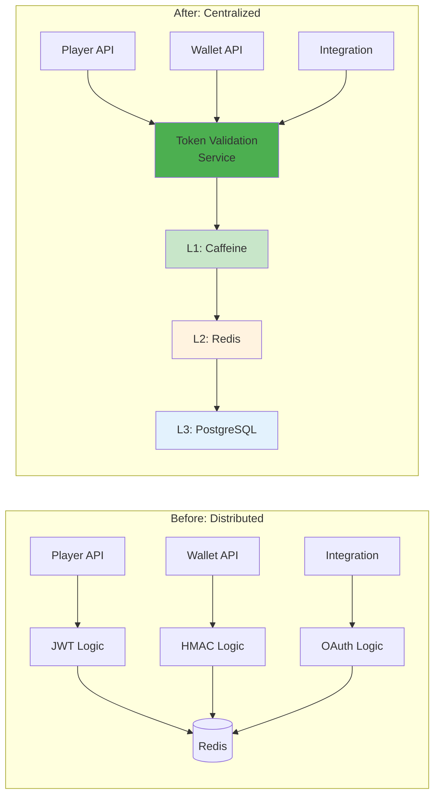
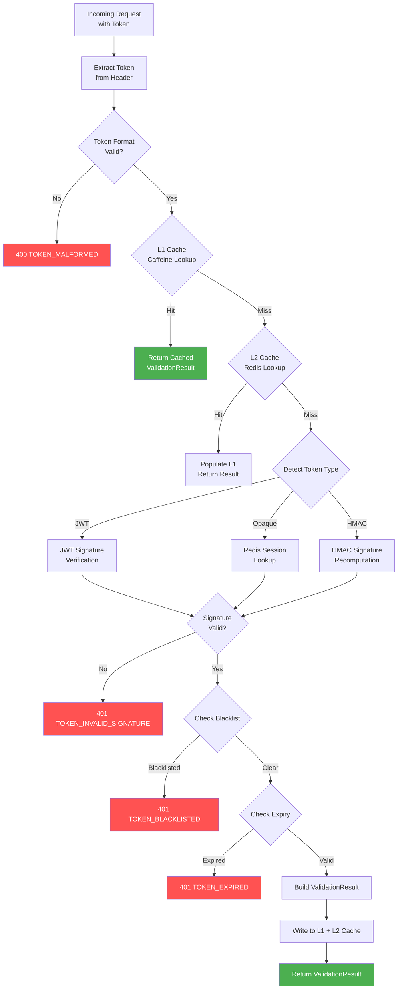
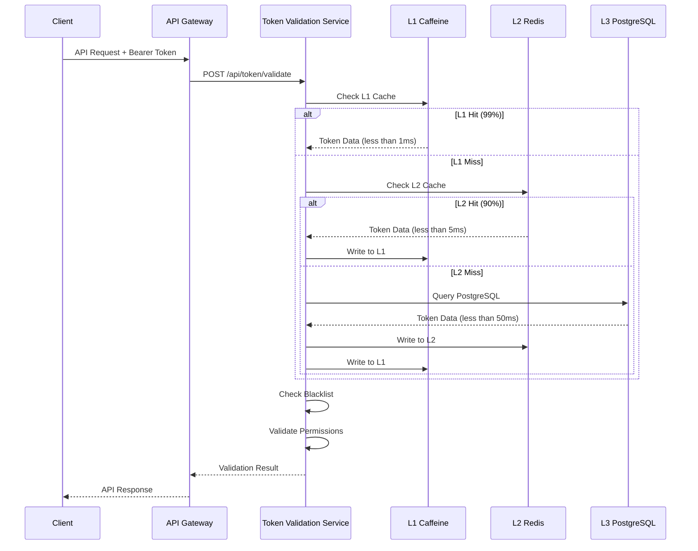
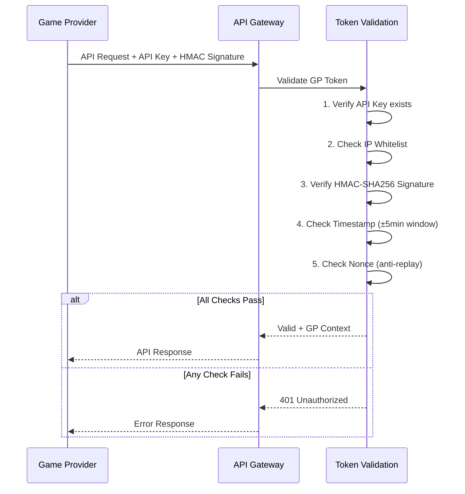
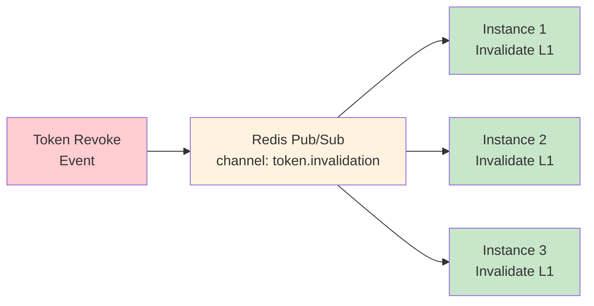
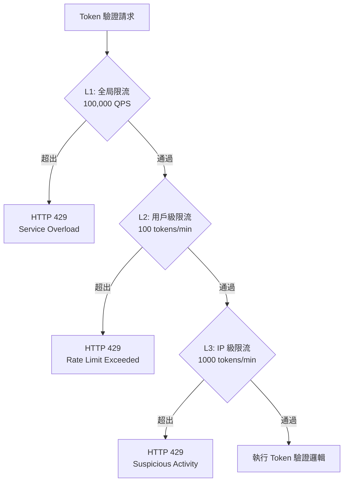
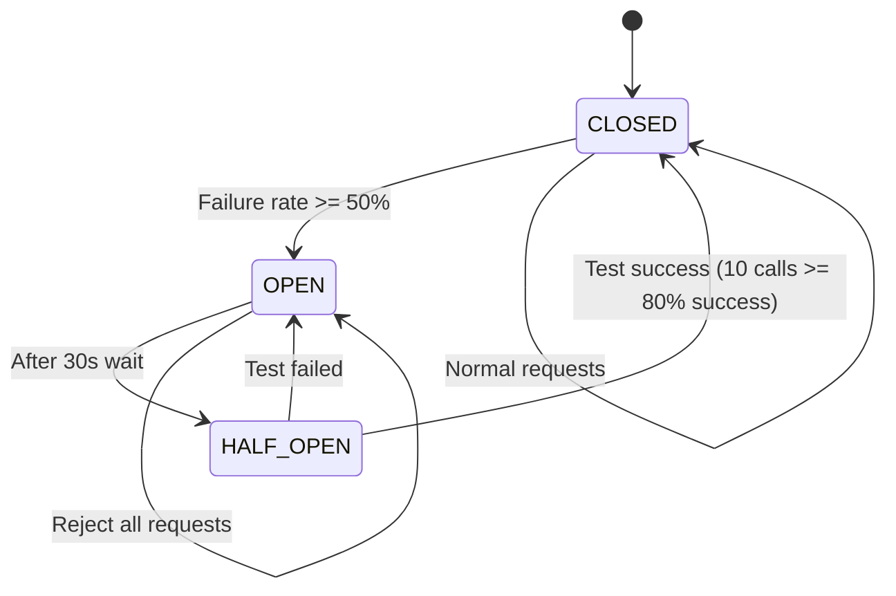
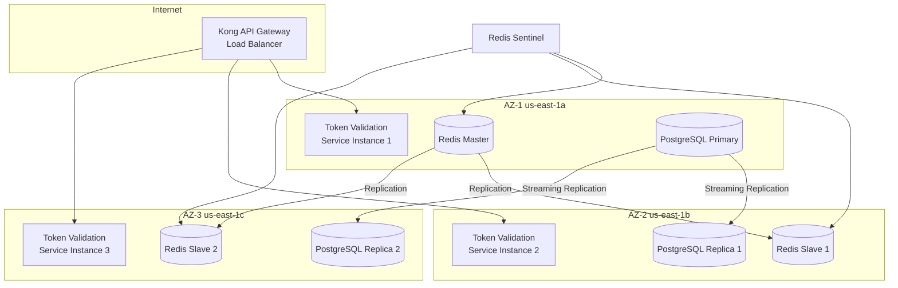

# Token 效能與運維（Token Operations）

<!-- SSOT: 本文件為 Token 驗證服務、快取效能、Edge 部署的唯一真實來源（Single Source of Truth）。
     原始文件 20_Token_Validation_Service.md、21_Token_Cache_Performance.md、
     22_Token_Edge_Deployment.md 已於 Task [13] 合併至本文件。 -->

> **業務需求**: 不適用 — 純技術基礎設施文件
> **規範來源**: [09-13 Token Validation Service](../../source-archive/09_Technical_Infrastructure/09-13_Token_Validation_Service.md) | [09-13-02 Cache Performance](../../source-archive/09_Technical_Infrastructure/09-13-02_Cache_Performance.md) | [09-13-03 Edge Deployment](../../source-archive/09_Technical_Infrastructure/09-13-03_Edge_Deployment.md)
> **目標讀者**: Security Architects, Backend Engineers, DevOps Engineers, Performance Engineers

---

## 1. Token 驗證服務概述

Token Validation Service 是統一的 Token 驗證服務，支持 4 種角色的 Token 驗證：

| 角色 | Token 類型 | 驗證需求 |
|------|----------|---------|
| **玩家 (Player)** | JWT (Redis Opaque) | 高頻（每次 API 調用） |
| **遊戲商 (GP)** | Opaque Token + HMAC | 中頻（遊戲回調） |
| **第三方** | JWT (OAuth 2.0) | 低頻（數據同步） |
| **後台用戶** | JWT + MFA | 中頻（後台操作） |

### 1.1 設計目標

| 目標 | 指標 | 優先級 |
|------|------|--------|
| **高性能** | P99 < 10ms (L1 命中) | P0 |
| **高可用** | SLA 99.95% | P0 |
| **高吞吐** | 10,000 QPS (單實例) | P0 |
| **緩存命中率** | > 99% (L1 + L2) | P0 |

### 1.2 架構對比（分散 vs 集中）



### 1.3 API 端點

| 端點 | 用途 |
|------|------|
| `POST /api/token/validate` | 單一 Token 驗證 |
| `POST /api/token/validate/batch` | 批量 Token 驗證 |
| `POST /api/token/revoke` | 撤銷 Token |
| `POST /api/token/introspect` | Token 內省查詢 |

### 1.4 錯誤碼

| 錯誤碼 | HTTP Status | 說明 |
|--------|-----------|------|
| `TOKEN_EXPIRED` | 401 | Token 已過期 |
| `TOKEN_INVALID_SIGNATURE` | 401 | 簽名驗證失敗 |
| `TOKEN_BLACKLISTED` | 401 | Token 在黑名單中 |
| `TOKEN_MALFORMED` | 400 | Token 格式錯誤 |
| `RATE_LIMIT_EXCEEDED` | 429 | 超出限流 |
| `NONCE_REUSED` | 403 | Nonce 重複使用 |

---

## 2. 三層緩存架構

| 層級 | 技術 | 命中率 | 延遲 | 容量 |
|------|------|--------|------|------|
| **L1** | Caffeine | 99% | < 1ms | 10,000 條 |
| **L2** | Redis | 0.9% | < 5ms | 100 萬條 |
| **L3** | PostgreSQL | 0.1% | < 50ms | 1000 萬條+ |

### 2.1 L1 緩存: Caffeine (進程內)

| 配置 | 值 | 說明 |
|------|-----|------|
| **容量** | 10,000 entries | 最大緩存條目數 |
| **TTL** | 100s (寫入後) | 寫入後 100 秒過期 |
| **Access TTL** | 60s (訪問後) | 最後訪問後 60 秒過期 |
| **命中率** | 99% | L1 直接命中 |
| **延遲** | < 1ms | JVM Heap 訪問 |

### 2.2 L2 緩存: Redis (分佈式)

| 配置 | 值 | 說明 |
|------|-----|------|
| **容量** | 100 萬條 | Redis Cluster |
| **TTL** | 1h | 與 Token 有效期對齊 |
| **命中率** | 90% (of L1 miss) | L1 未命中時的備選 |
| **延遲** | < 5ms | 網絡訪問 |
| **序列化** | Kryo 5.5.0 | 高性能序列化 |

### 2.3 L3 存儲: PostgreSQL (持久化)

| 配置 | 值 | 說明 |
|------|-----|------|
| **容量** | 1000 萬條+ | 所有歷史 Token |
| **命中率** | 100% (of L2 miss) | 最終數據源 |
| **延遲** | < 50ms | 磁盤 I/O |
| **用途** | Blacklist、Token Family、審計 | 持久化存儲 |

### 2.4 Redis Cache Key 設計

| Key Pattern | TTL | Purpose |
|-------------|-----|---------|
| `token:validated:{hash}` | min(remaining_ttl, 300s) | L2 validation result cache |
| `session:{opaque_token}` | 24h (player), 8h (admin) | Opaque token session data |
| `token:blacklist:{hash}` | Original token TTL | Revoked token tracking |
| `token:nonce:{nonce}` | 60s | Replay attack prevention |
| `token:rate:{actor_id}` | 60s (sliding window) | Per-actor rate limiting |

---

## 3. 驗證流程設計

### 3.1 Validation Pipeline 架構



### 3.2 Access Token 驗證流程



### 3.3 Game Provider HMAC 驗證流程



---

## 4. Java 實現

### 4.1 TokenValidationService (Service 層)

```java
@Service
@RequiredArgsConstructor
public class TokenValidationService {

    private final Cache<String, ValidationResult> l1Cache;  // Caffeine
    private final RedissonClient redissonClient;
    private final JwtTokenValidator jwtValidator;
    private final HmacTokenValidator hmacValidator;
    private final TokenBlacklistDao tokenBlacklistDao;

    /**
     * Validate token with 3-tier cache strategy.
     * L1 (Caffeine): ~1ms, L2 (Redis): ~5ms, L3 (DB): ~50ms
     */
    public ValidationResult validate(TokenValidationRequest request) {
        String token = request.getToken();

        // L1: Caffeine local cache
        ValidationResult cached = l1Cache.getIfPresent(token);
        if (cached != null) {
            return cached;
        }

        // L2: Redis distributed cache
        RBucket<ValidationResult> bucket = redissonClient.getBucket(
            "token:validated:" + hashToken(token)
        );
        cached = bucket.get();
        if (cached != null) {
            l1Cache.put(token, cached);
            return cached;
        }

        // L3: Full validation pipeline
        ValidationResult result = performFullValidation(token);

        if (result.isValid()) {
            long ttlSeconds = result.getRemainingTtlSeconds();
            l1Cache.put(token, result);
            bucket.set(result, Duration.ofSeconds(Math.min(ttlSeconds, 300)));
        }

        return result;
    }

    private ValidationResult performFullValidation(String token) {
        TokenType type = TokenTypeDetector.detect(token);

        return switch (type) {
            case JWT -> jwtValidator.validate(token);
            case OPAQUE -> validateOpaqueToken(token);
            case HMAC -> hmacValidator.validate(token);
        };
    }

    private ValidationResult validateOpaqueToken(String token) {
        RBucket<TokenSession> session = redissonClient.getBucket("session:" + token);
        TokenSession data = session.get();
        if (data == null) {
            return ValidationResult.invalid("TOKEN_EXPIRED");
        }
        if (tokenBlacklistDao.existsByToken(token)) {
            return ValidationResult.invalid("TOKEN_BLACKLISTED");
        }
        return ValidationResult.valid(data.getActorId(), data.getActorType(), data.getPermissions());
    }

    private String hashToken(String token) {
        return Hashing.sha256().hashString(token, StandardCharsets.UTF_8).toString();
    }
}
```

### 4.2 TokenCacheService (Service 層)

```java
package net.lab1024.sa.infrastructure.token;

import com.github.benmanes.caffeine.cache.Cache;
import com.github.benmanes.caffeine.cache.Caffeine;
import io.vavr.control.Option;
import lombok.RequiredArgsConstructor;
import lombok.extern.slf4j.Slf4j;
import org.springframework.data.redis.core.RedisTemplate;
import org.springframework.stereotype.Service;

import javax.annotation.PostConstruct;
import java.time.Duration;

/**
 * Token 三層緩存服務
 */
@Slf4j
@Service
@RequiredArgsConstructor
public class TokenCacheService {

    private final TokenDao tokenDao;
    private final TokenInvalidationManager invalidationManager;
    private final RedisTemplate<String, TokenCacheData> redisTemplate;

    private Cache<String, TokenCacheData> caffeineCache;

    private static final String L2_KEY_PREFIX = "token:cache:";
    private static final Duration L1_TTL = Duration.ofSeconds(100);
    private static final Duration L2_TTL = Duration.ofHours(1);

    @PostConstruct
    public void init() {
        caffeineCache = Caffeine.newBuilder()
            .maximumSize(10_000)
            .expireAfterWrite(L1_TTL)
            .expireAfterAccess(Duration.ofSeconds(60))
            .recordStats()
            .build();
    }

    public Option<TokenCacheData> getToken(String tokenHash) {
        // L1: Caffeine
        TokenCacheData l1Data = caffeineCache.getIfPresent(tokenHash);
        if (l1Data != null) {
            return Option.of(l1Data);
        }

        // L2: Redis
        String l2Key = L2_KEY_PREFIX + tokenHash;
        TokenCacheData l2Data = redisTemplate.opsForValue().get(l2Key);
        if (l2Data != null) {
            caffeineCache.put(tokenHash, l2Data);
            return Option.of(l2Data);
        }

        // L3: PostgreSQL
        return Option.ofOptional(tokenDao.findByTokenHash(tokenHash))
            .peek(entity -> {
                TokenCacheData data = convertToCache(entity);
                redisTemplate.opsForValue().set(l2Key, data, L2_TTL);
                caffeineCache.put(tokenHash, data);
            })
            .map(this::convertToCache);
    }

    public void invalidateToken(String tokenHash) {
        invalidationManager.invalidateAcrossCluster(tokenHash);
    }

    public String getCacheStats() {
        var stats = caffeineCache.stats();
        return String.format("L1 Stats - Hit Rate: %.2f%%, Evictions: %d",
            stats.hitRate() * 100, stats.evictionCount());
    }
}
```

### 4.3 TokenRevocationManager (Manager 層)

```java
@Manager
@RequiredArgsConstructor
public class TokenRevocationManager {

    private final Cache<String, ValidationResult> l1Cache;
    private final RedissonClient redissonClient;
    private final TokenBlacklistDao tokenBlacklistDao;

    /**
     * Revoke token across all cache layers.
     * Uses Redis Pub/Sub to invalidate L1 caches on all instances.
     */
    @Transactional(rollbackFor = Throwable.class)
    public void revokeToken(String token, String reason) {
        String hash = hashToken(token);

        // L3: Persist to blacklist table
        tokenBlacklistDao.insert(TokenBlacklist.builder()
            .tokenHash(hash)
            .reason(reason)
            .revokedAt(LocalDateTime.now())
            .build());

        // L2: Remove from Redis cache
        redissonClient.getBucket("token:validated:" + hash).delete();
        redissonClient.getBucket("session:" + token).delete();

        // L1: Publish invalidation event for all instances
        redissonClient.getTopic("token:invalidation")
            .publish(new TokenInvalidationEvent(hash));
    }
}
```

### 4.4 TokenInvalidationManager (Manager 層)

```java
@Slf4j
@Component
@RequiredArgsConstructor
public class TokenInvalidationManager {

    private final TokenBlacklistDao blacklistDao;
    private final RedisTemplate<String, String> redisTemplate;

    private static final String INVALIDATION_CHANNEL = "token.invalidation";

    /**
     * 跨集群失效 Token（需事務保證黑名單一致性）
     */
    @Transactional(rollbackFor = Throwable.class)
    public void invalidateAcrossCluster(String tokenHash) {
        // 1. 寫入黑名單（L3）
        TokenBlacklistEntity blacklist = TokenBlacklistEntity.builder()
            .tokenHash(tokenHash)
            .reason("REVOKED")
            .revokedAt(LocalDateTime.now())
            .build();
        blacklistDao.insert(blacklist);

        // 2. Redis 黑名單（L2）
        redisTemplate.opsForSet().add("token:blacklist", tokenHash);

        // 3. 發布失效事件（L1 跨實例失效）
        redisTemplate.convertAndSend(INVALIDATION_CHANNEL, tokenHash);

        log.warn("Token 已失效並廣播: {}", tokenHash);
    }

    /**
     * 批量失效 Token Family（Refresh Token 重用檢測）
     */
    @Transactional(rollbackFor = Throwable.class)
    public void invalidateTokenFamily(String familyId) {
        List<String> tokens = blacklistDao.findTokensByFamily(familyId);

        tokens.forEach(token -> blacklistDao.insert(TokenBlacklistEntity.builder()
            .tokenHash(token)
            .reason("FAMILY_REVOKED")
            .revokedAt(LocalDateTime.now())
            .build()));

        redisTemplate.opsForSet().add("token:blacklist", tokens.toArray(new String[0]));
        tokens.forEach(token -> redisTemplate.convertAndSend(INVALIDATION_CHANNEL, token));

        log.error("Token Family 已全部失效: {}, 數量: {}", familyId, tokens.size());
    }
}
```

### 4.5 gRPC Validation Endpoint（內部服務通信）

```protobuf
syntax = "proto3";

package net.lab1024.sa.token;

service TokenValidationGrpc {
    rpc Validate (ValidateRequest) returns (ValidateResponse);
    rpc ValidateBatch (ValidateBatchRequest) returns (ValidateBatchResponse);
    rpc Revoke (RevokeRequest) returns (RevokeResponse);
}

message ValidateRequest {
    string token = 1;
    string expected_actor_type = 2;
    repeated string required_permissions = 3;
}

message ValidateResponse {
    bool valid = 1;
    string actor_id = 2;
    string actor_type = 3;
    repeated string permissions = 4;
    string error_code = 5;
    int64 remaining_ttl_seconds = 6;
}
```

---

## 5. 緩存一致性保證

### 5.1 Redis Pub/Sub 失效通知



**流程**:
1. Token 撤銷時，寫入 Redis 黑名單
2. 發布失效事件至 Redis Pub/Sub
3. 所有實例的 L1 緩存清除對應 Token
4. 下次驗證時從 L2/L3 重新載入

### 5.2 緩存命中率分佈

```
Total Requests: 10,000 QPS
L1 Hit (Caffeine):  9,900 (99.0%) -> <1ms
L2 Hit (Redis):        90 (0.9%)  -> <5ms
L3 Hit (PostgreSQL):   10 (0.1%)  -> <50ms
──────────────────────────────────────────
Weighted Avg Latency: ~1.1ms
```

---

## 6. 重放攻擊防護

### 6.1 Nonce 驗證機制

```java
@Service
@RequiredArgsConstructor
public class NonceValidator {

    private final RedisTemplate<String, String> redisTemplate;
    private static final Duration NONCE_WINDOW = Duration.ofMinutes(5);

    public boolean validateAndStore(String nonce) {
        String key = "nonce:" + nonce;

        Boolean success = redisTemplate.opsForValue().setIfAbsent(
            key,
            String.valueOf(Instant.now().getEpochSecond()),
            NONCE_WINDOW
        );

        if (Boolean.FALSE.equals(success)) {
            auditLogService.log(null, "NONCE_REUSED", "Nonce: " + nonce);
            return false;
        }

        return true;
    }
}
```

**Redis Lua 腳本優化**（避免 Race Condition）:

```lua
-- nonce_check.lua
local key = KEYS[1]
local value = ARGV[1]
local ttl = tonumber(ARGV[2])

if redis.call('EXISTS', key) == 1 then
    return 0  -- Nonce exists (replay attack)
else
    redis.call('SET', key, value, 'EX', ttl)
    return 1  -- First use
end
```

### 6.2 時間戳驗證

```java
public boolean validateTimestamp(long timestamp) {
    long now = Instant.now().getEpochSecond();
    long diff = Math.abs(now - timestamp);

    if (diff > 300) {
        auditLogService.log(null, "TIMESTAMP_EXPIRED", String.format(
            "Timestamp: %d, Now: %d, Diff: %d seconds", timestamp, now, diff
        ));
        return false;
    }

    return true;
}
```

---

## 7. 限流與熔斷

### 7.1 限流策略

| 角色 | 桶容量 | 補充速率 | 時間窗口 | 超出後處理 |
|------|-------|---------|---------|-----------|
| **玩家** | 100 tokens | 100 tokens/min | 1 分鐘 | HTTP 429 + Retry-After: 60 |
| **遊戲商** | 1000 tokens | 1000 tokens/min | 1 分鐘 | HTTP 429 |
| **第三方平台** | 200 tokens | 200 tokens/min | 1 分鐘 | HTTP 429 |
| **後台用戶** | 50 tokens | 50 tokens/min | 1 分鐘 | HTTP 429 |

**分層限流架構**:



### 7.2 熔斷器設計

**Resilience4j 熔斷器配置**:

```java
@Configuration
public class CircuitBreakerConfiguration {

    @Bean
    public CircuitBreaker postgresCircuitBreaker() {
        CircuitBreakerConfig config = CircuitBreakerConfig.custom()
            .failureRateThreshold(50)
            .waitDurationInOpenState(Duration.ofSeconds(30))
            .slidingWindowSize(100)
            .minimumNumberOfCalls(10)
            .build();

        return CircuitBreakerRegistry.of(config)
            .circuitBreaker("postgres");
    }
}
```

**熔斷器狀態機**:



### 7.3 降級方案

**當 PostgreSQL 不可用時（JWT 本地驗證）**:

```java
public TokenValidationResult validate(String token, ActorType actorType) {
    TokenValidationResult result = queryFromCache(token);
    if (result != null) {
        return result;
    }

    try {
        result = CircuitBreaker.decorateSupplier(
            postgresCircuitBreaker,
            () -> queryFromDatabase(token)
        ).get();

        if (result != null) {
            return result;
        }
    } catch (Exception e) {
        log.warn("PostgreSQL circuit breaker open, entering degraded mode");
    }

    // Degraded mode: JWT local validation (signature + expiry only)
    if (token.startsWith("eyJ")) {
        try {
            result = validateJwtLocally(token);
            log.info("Degraded mode: JWT validated locally without database");
            return result;
        } catch (Exception e) {
            log.error("JWT local validation failed", e);
        }
    }

    throw new TokenValidationException("Unable to validate token: database unavailable");
}
```

**降級模式限制**:
- 無法檢查黑名單（已封禁的玩家可能仍能訪問）
- 無法檢查 Device Fingerprint（跨設備訪問無法檢測）
- 仍可驗證簽名和過期時間（基本安全保證）

---

## 8. 高可用設計

### 8.1 Multi-AZ 部署架構



**高可用配置**:

| 組件 | 配置 | 說明 |
|------|------|------|
| **Token Validation Service** | 3 實例（每個 AZ 1 個） | Kubernetes Deployment（3 Replicas） |
| **Redis** | 1 Master + 2 Slaves + 3 Sentinels | 自動故障轉移 |
| **PostgreSQL** | 1 Primary + 2 Replicas | Streaming Replication（同步模式） |
| **Kong API Gateway** | 2 實例（跨 AZ） | Active-Active 負載均衡 |

### 8.2 Redis Sentinel 故障轉移

```bash
# Sentinel configuration
sentinel monitor mymaster 10.0.1.100 6379 2
sentinel down-after-milliseconds mymaster 5000
sentinel failover-timeout mymaster 60000
sentinel parallel-syncs mymaster 1
```

**應用程序自動重連配置**:

```java
@Configuration
public class RedisConfig {

    @Bean
    public RedisConnectionFactory redisConnectionFactory() {
        RedisSentinelConfiguration sentinelConfig = new RedisSentinelConfiguration()
            .master("mymaster")
            .sentinel("10.0.1.200", 26379)
            .sentinel("10.0.2.200", 26379)
            .sentinel("10.0.3.200", 26379);

        LettuceClientConfiguration clientConfig = LettuceClientConfiguration.builder()
            .clientOptions(ClientOptions.builder()
                .autoReconnect(true)
                .build())
            .build();

        return new LettuceConnectionFactory(sentinelConfig, clientConfig);
    }
}
```

### 8.3 備份策略

| 組件 | 備份方式 | 頻率 | 保留期限 |
|------|---------|------|---------|
| **Redis** | AOF（Append-Only File） | 實時 | 7 天 |
| **PostgreSQL** | WAL 歸檔 + 基礎備份 | 每天 | 30 天 |
| **配置文件** | Git 版本控制 | 每次變更 | 永久 |

---

## 9. 性能優化

### 9.1 性能指標（SLI 目標）

| 指標 | P50 | P90 | P99 | P99.9 |
|------|-----|-----|-----|-------|
| **延遲（L1 命中）** | < 1ms | < 2ms | < 5ms | < 10ms |
| **延遲（L2 命中）** | < 5ms | < 8ms | < 15ms | < 30ms |
| **延遲（L3 命中）** | < 50ms | < 80ms | < 150ms | < 300ms |
| **吞吐量（單實例）** | 10,000 QPS | 12,000 QPS | 15,000 QPS | 20,000 QPS |

### 9.2 優化策略

**連接池優化（HikariCP）**:

```yaml
spring:
  datasource:
    hikari:
      maximum-pool-size: 50
      minimum-idle: 10
      connection-timeout: 5000
      idle-timeout: 600000
      max-lifetime: 1800000
```

**批量處理優化（Redis Pipeline）**:

```java
public List<TokenValidationResult> validateBatch(List<String> tokens) {
    return redisTemplate.executePipelined(new RedisCallback<Object>() {
        @Override
        public Object doInRedis(RedisConnection connection) {
            for (String token : tokens) {
                connection.get(("token:access:" + extractTokenId(token)).getBytes());
            }
            return null;
        }
    }).stream()
        .map(result -> result != null ? deserialize((byte[]) result) : null)
        .collect(Collectors.toList());
}
```

### 9.3 壓力測試結果

**環境**: AWS EC2 c5.2xlarge（8 vCPU, 16 GB RAM），JMeter 5.5（1000 並發用戶）

| 場景 | 吞吐量 | 平均延遲 | P99 延遲 | 錯誤率 | 緩存命中率 |
|------|-------|---------|---------|-------|-----------|
| **正常負載（1,000 QPS）** | 1,200 QPS | 5ms | 15ms | 0% | 99.5% |
| **高負載（10,000 QPS）** | 11,500 QPS | 12ms | 45ms | 0.1% | 98.2% |
| **峰值負載（20,000 QPS）** | 18,000 QPS | 35ms | 120ms | 1.2% | 95.0% |
| **極限負載（50,000 QPS）** | 32,000 QPS | 180ms | 800ms | 15% | 80.0% |

**結論**: 單實例可支持 10,000 QPS（滿足目標），超過 20,000 QPS 需水平擴展。

---

## 10. 監控與告警

### 10.1 Prometheus 指標定義

```java
@Component
public class TokenValidationMetrics {

    private final Counter validationTotal;
    private final Counter validationFailure;
    private final Histogram validationLatency;
    private final Gauge cacheHitRate;

    public TokenValidationMetrics(MeterRegistry meterRegistry) {
        validationTotal = Counter.builder("token_validation_total")
            .description("Total number of token validation requests")
            .register(meterRegistry);

        validationFailure = Counter.builder("token_validation_failure")
            .description("Number of failed validations")
            .tag("error_code", "unknown")
            .register(meterRegistry);

        validationLatency = Histogram.builder("token_validation_latency")
            .description("Token validation latency in milliseconds")
            .buckets(1, 5, 10, 50, 100, 500, 1000)
            .register(meterRegistry);

        cacheHitRate = Gauge.builder("token_cache_hit_rate", this, m -> calculateHitRate())
            .description("Cache hit rate (L1 + L2)")
            .register(meterRegistry);
    }
}
```

### 10.2 告警規則

```yaml
groups:
  - name: token_validation
    interval: 30s
    rules:
      - alert: TokenValidationHighFailureRate
        expr: |
          (rate(token_validation_failure[5m]) / rate(token_validation_total[5m])) > 0.05
        for: 5m
        labels:
          severity: warning
        annotations:
          summary: "Token validation failure rate > 5%"

      - alert: TokenValidationHighLatency
        expr: |
          histogram_quantile(0.99, rate(token_validation_latency_bucket[5m])) > 100
        for: 5m
        labels:
          severity: warning
        annotations:
          summary: "P99 latency > 100ms"

      - alert: TokenCacheLowHitRate
        expr: |
          token_cache_hit_rate < 0.90
        for: 10m
        labels:
          severity: warning
        annotations:
          summary: "Cache hit rate < 90%"

      - alert: RedisDown
        expr: |
          up{job="redis"} == 0
        for: 1m
        labels:
          severity: critical
        annotations:
          summary: "Redis instance is down"

      - alert: PostgresDown
        expr: |
          up{job="postgres"} == 0
        for: 1m
        labels:
          severity: critical
        annotations:
          summary: "PostgreSQL instance is down"
```

**告警通知渠道**:

| 嚴重級別 | 通知渠道 | 響應時間 |
|---------|---------|---------|
| **Critical** | PagerDuty + Slack + SMS | < 5 分鐘 |
| **Warning** | Slack | < 30 分鐘 |
| **Info** | Slack（靜默通知） | - |

---

## 11. SQL Schema

```sql
-- Token 黑名單表（整合版）
CREATE TABLE t_token_blacklist (
    id              BIGSERIAL PRIMARY KEY,
    token_hash      VARCHAR(64) NOT NULL UNIQUE,
    actor_id        BIGINT,
    actor_type      VARCHAR(20),
    reason          VARCHAR(200) NOT NULL,      -- USER_LOGOUT, ADMIN_REVOKE, SECURITY_BREACH, FAMILY_REVOKED
    revoked_at      TIMESTAMP NOT NULL DEFAULT NOW(),
    expires_at      TIMESTAMP NOT NULL,
    revoked_by      VARCHAR(100),
    created_at      TIMESTAMP NOT NULL DEFAULT NOW()
);

CREATE INDEX idx_blacklist_hash ON t_token_blacklist(token_hash);
CREATE INDEX idx_blacklist_expires ON t_token_blacklist(expires_at);

-- Token 緩存數據表（L3 持久化層）
CREATE TABLE t_token_cache (
    id BIGSERIAL PRIMARY KEY,
    token_hash VARCHAR(64) NOT NULL UNIQUE,
    player_id BIGINT NOT NULL,
    tenant_id BIGINT NOT NULL,
    token_type VARCHAR(20) NOT NULL,            -- ACCESS, REFRESH, API_KEY
    expires_at TIMESTAMP NOT NULL,
    permissions TEXT[],
    device_fingerprint VARCHAR(64),
    family_id VARCHAR(64),
    created_at TIMESTAMP NOT NULL DEFAULT CURRENT_TIMESTAMP,
    updated_at TIMESTAMP NOT NULL DEFAULT CURRENT_TIMESTAMP
);

CREATE INDEX idx_token_hash ON t_token_cache(token_hash);
CREATE INDEX idx_token_player ON t_token_cache(player_id);
CREATE INDEX idx_token_expires ON t_token_cache(expires_at);
CREATE INDEX idx_token_family ON t_token_cache(family_id);

-- Nonce 追蹤表（防重放攻擊）
CREATE TABLE t_nonce_log (
    id              BIGSERIAL PRIMARY KEY,
    nonce           VARCHAR(64) NOT NULL UNIQUE,
    actor_id        BIGINT,
    actor_type      VARCHAR(20),
    ip_address      VARCHAR(45),
    used_at         TIMESTAMP NOT NULL DEFAULT NOW(),
    expires_at      TIMESTAMP NOT NULL
);

CREATE INDEX idx_nonce_expires ON t_nonce_log(expires_at);

-- 緩存性能統計表
CREATE TABLE t_cache_performance_stats (
    id BIGSERIAL PRIMARY KEY,
    cache_layer VARCHAR(10) NOT NULL,           -- L1, L2, L3
    hit_count BIGINT NOT NULL DEFAULT 0,
    miss_count BIGINT NOT NULL DEFAULT 0,
    avg_latency_ms DECIMAL(10, 2),
    p99_latency_ms DECIMAL(10, 2),
    recorded_at TIMESTAMP NOT NULL DEFAULT CURRENT_TIMESTAMP
);

COMMENT ON TABLE t_token_blacklist IS 'Token 黑名單表（已撤銷的 Token）';
COMMENT ON TABLE t_token_cache IS 'Token 緩存數據表（L3 持久化層）';
COMMENT ON TABLE t_nonce_log IS 'Nonce 追蹤表（防重放攻擊）';
COMMENT ON TABLE t_cache_performance_stats IS '緩存性能統計表';
```

---

## 12. 實施路線圖

| Phase | 內容 | 時間 | 狀態 |
|-------|------|------|------|
| **Phase 1** | 核心驗證（單一驗證、三層緩存、限流） | Week 1-2 | Planned |
| **Phase 2** | 高級特性（批量驗證、撤銷、Nonce、HMAC） | Week 3 | Planned |
| **Phase 3** | 性能優化（熔斷、降級、Multi-AZ） | Week 4 | Planned |

---

## 13. 測試用例

| 測試 ID | 測試場景 | 預期結果 |
|---------|---------|---------|
| TC-TV-001 | 驗證有效的 JWT Access Token | HTTP 200，返回用戶信息 |
| TC-TV-002 | 驗證已過期的 JWT Token | HTTP 401，TOKEN_EXPIRED |
| TC-TV-003 | 驗證簽名錯誤的 JWT Token | HTTP 401，TOKEN_INVALID_SIGNATURE |
| TC-TV-004 | 驗證在黑名單中的 Token | HTTP 401，TOKEN_BLACKLISTED |
| TC-TV-005 | 驗證格式錯誤的 Token | HTTP 400，TOKEN_MALFORMED |
| TC-TV-006 | 批量驗證 100 個 Token | HTTP 200，返回 100 個驗證結果 |
| TC-TV-009 | Nonce 首次使用 | 驗證成功 |
| TC-TV-010 | Nonce 重複使用（重放攻擊） | HTTP 403，NONCE_REUSED |
| TC-TV-011 | 時間戳過期（> 5 分鐘） | HTTP 403，TIMESTAMP_EXPIRED |
| TC-TV-012 | 超出限流（101 次/分鐘） | HTTP 429，RATE_LIMIT_EXCEEDED |
| TC-TV-013 | L1 緩存命中 | 延遲 < 5ms |
| TC-TV-014 | L2 緩存命中 | 延遲 < 15ms |
| TC-TV-015 | L3 數據庫查詢 | 延遲 < 50ms |

---

## 相關文件

- [Token 安全架構](./17_Token_Security_Architecture.md) — Multi-Actor Token 安全模型、OAuth Refresh Token、驗證架構設計
- [身份驗證架構](./05_Authentication_Architecture.md) — 認證架構總覽
- [緩存策略](./14_Caching_Strategy.md) — JetCache 多級緩存策略
- [性能監控](./12_Performance_Monitoring.md) — 性能監控與告警架構
