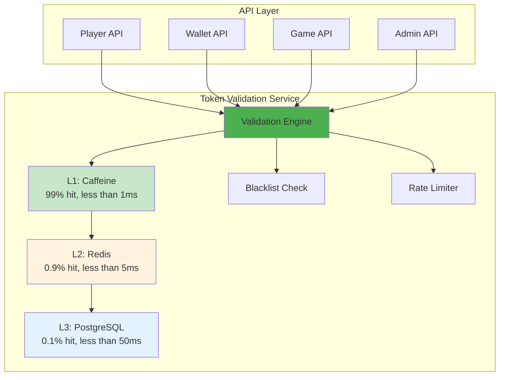

# Token 驗證架構（Token Validation Architecture）

> **業務需求**: 不適用 — 純技術基礎設施文件
> **規範來源**: [09-13-01 Validation Architecture](../../source-archive/09_Technical_Infrastructure/09-13-01_Validation_Architecture.md)
> **目標讀者**: Security Architects, Backend Engineers

---

## 1. 為什麼需要獨立的 Token 驗證服務

### 1.1 現狀問題

| 問題 | 說明 |
|------|------|
| **代碼重複** | 每個服務各自實現 Token 驗證邏輯 |
| **不一致** | 不同服務的驗證規則可能不同步 |
| **性能浪費** | 每個服務各自訪問 Redis |
| **運維困難** | 安全策略變更需修改多個服務 |

### 1.2 解決方案

集中式 Token Validation Service：
- 統一驗證邏輯（支持 4 種 Token 類型）
- 三層緩存（Caffeine + Redis + PostgreSQL）
- 集中式黑名單管理
- 統一限流與熔斷

---

## 2. 系統定位



---

## 3. 服務職責

### 3.1 核心功能

| 功能 | 說明 |
|------|------|
| **Token 解析** | JWT 解碼、HMAC 驗證、Opaque Token 查找 |
| **黑名單檢查** | 已撤銷的 Token 拒絕通過 |
| **重放攻擊防護** | Nonce + 時間戳驗證 |
| **限流** | Per-IP, Per-User, Per-Endpoint |

### 3.2 非功能性需求

| 需求 | 目標 |
|------|------|
| P99 延遲 | < 10ms (L1 命中) |
| 可用性 | 99.95% SLA |
| 吞吐量 | 10,000 QPS (單實例) |
| 緩存命中率 | > 99% |

---

## 4. API 設計

### 4.1 單一驗證接口

```
POST /api/token/validate
Content-Type: application/json

{
  "token": "eyJhbGciOiJ...",
  "token_type": "JWT_PLAYER",
  "required_permissions": ["wallet:read"]
}
```

**Response (Success)**:
```json
{
  "valid": true,
  "actor_type": "PLAYER",
  "actor_id": "player:123456",
  "tenant_id": "1",
  "permissions": ["wallet:read", "wallet:write"],
  "expires_at": "2026-02-09T10:30:00Z"
}
```

### 4.2 批量驗證接口

```
POST /api/token/validate/batch

{
  "tokens": [
    {"token": "token1", "token_type": "JWT_PLAYER"},
    {"token": "token2", "token_type": "OPAQUE_GP"}
  ]
}
```

### 4.3 撤銷接口

```
POST /api/token/revoke

{
  "token": "eyJhbGciOiJ...",
  "reason": "USER_LOGOUT"
}
```

### 4.4 內省接口

```
POST /api/token/introspect

{
  "token": "eyJhbGciOiJ..."
}
```

**Response**:
```json
{
  "active": true,
  "token_type": "JWT_PLAYER",
  "actor_id": "player:123456",
  "issued_at": "2026-02-09T10:00:00Z",
  "expires_at": "2026-02-09T10:15:00Z",
  "client_ip": "203.0.113.42"
}
```

---

## 5. Token 類型處理

| Token 類型 | 解析方式 | 驗證步驟 |
|-----------|---------|---------|
| **JWT_PLAYER** | JWT 解碼 (RS256/HS512) | 簽名 -> 過期 -> 黑名單 -> 權限 |
| **OPAQUE_GP** | Redis 查找 | API Key -> HMAC 簽名 -> IP 白名單 |
| **JWT_OAUTH** | JWT 解碼 (RS256) | 簽名 -> 過期 -> Scope -> IP |
| **JWT_ADMIN** | JWT 解碼 + MFA | 簽名 -> 過期 -> MFA 狀態 -> RBAC |

---

## 6. Java 實現

### 6.1 Service 層 — Token 驗證邏輯

```java
package net.lab1024.sa.system.token;

import io.vavr.control.Option;
import io.vavr.control.Try;
import lombok.RequiredArgsConstructor;
import lombok.extern.slf4j.Slf4j;
import org.springframework.stereotype.Service;

/**
 * Token 驗證服務
 * 負責統一的 Token 解析與驗證邏輯
 */
@Slf4j
@Service
@RequiredArgsConstructor
public class TokenValidationService {

    private final TokenValidationDao tokenValidationDao;
    private final TokenCacheManager tokenCacheManager;
    private final TokenBlacklistManager tokenBlacklistManager;

    /**
     * 驗證單一 Token
     *
     * @param token Token 字串
     * @param tokenType Token 類型（JWT_PLAYER, OPAQUE_GP, JWT_OAUTH, JWT_ADMIN）
     * @param requiredPermissions 所需權限清單
     * @return 驗證結果（包含 actor_id, tenant_id, permissions）
     */
    public Option<TokenValidationVO> validate(String token, String tokenType, List<String> requiredPermissions) {
        // L1: Caffeine 緩存檢查（99% 命中率，< 1ms）
        return tokenCacheManager.getFromL1Cache(token)
            .orElse(() -> {
                // L2: Redis 緩存檢查（0.9% 命中率，< 5ms）
                return tokenCacheManager.getFromL2Cache(token);
            })
            .orElse(() -> {
                // L3: PostgreSQL 查詢（0.1% 命中率，< 50ms）
                return tokenValidationDao.findByToken(token)
                    .map(entity -> {
                        TokenValidationVO vo = SmartBeanUtil.copy(entity, TokenValidationVO.class);
                        // 回填緩存
                        tokenCacheManager.putToL1AndL2(token, vo);
                        return vo;
                    });
            })
            .filter(vo -> !tokenBlacklistManager.isBlacklisted(token))
            .filter(vo -> hasRequiredPermissions(vo, requiredPermissions));
    }

    /**
     * 批量驗證 Token
     */
    public List<TokenValidationResultVO> validateBatch(List<TokenValidationForm> forms) {
        return forms.stream()
            .map(form -> {
                Option<TokenValidationVO> result = validate(form.getToken(), form.getTokenType(), form.getRequiredPermissions());
                return TokenValidationResultVO.builder()
                    .token(form.getToken())
                    .valid(result.isDefined())
                    .validationResult(result.getOrNull())
                    .build();
            })
            .collect(Collectors.toList());
    }

    /**
     * Token 內省（Introspection）
     */
    public Option<TokenIntrospectionVO> introspect(String token) {
        return tokenValidationDao.findByToken(token)
            .map(entity -> TokenIntrospectionVO.builder()
                .active(!tokenBlacklistManager.isBlacklisted(token))
                .tokenType(entity.getTokenType())
                .actorId(entity.getActorId())
                .issuedAt(entity.getIssuedAt())
                .expiresAt(entity.getExpiresAt())
                .clientIp(entity.getClientIp())
                .build());
    }

    private boolean hasRequiredPermissions(TokenValidationVO vo, List<String> requiredPermissions) {
        if (requiredPermissions == null || requiredPermissions.isEmpty()) {
            return true;
        }
        Set<String> grantedPermissions = new HashSet<>(vo.getPermissions());
        return grantedPermissions.containsAll(requiredPermissions);
    }
}
```

### 6.2 Manager 層 — 緩存管理與黑名單

```java
package net.lab1024.sa.system.token;

import com.github.benmanes.caffeine.cache.Cache;
import lombok.RequiredArgsConstructor;
import lombok.extern.slf4j.Slf4j;
import org.springframework.cache.annotation.CacheEvict;
import org.springframework.cache.annotation.Cacheable;
import org.springframework.data.redis.core.RedisTemplate;
import org.springframework.stereotype.Component;
import org.springframework.transaction.annotation.Transactional;

import java.time.Duration;
import java.util.concurrent.TimeUnit;

/**
 * Token 緩存管理器
 * 三層緩存策略：Caffeine (L1) -> Redis (L2) -> PostgreSQL (L3)
 */
@Slf4j
@Component
@RequiredArgsConstructor
public class TokenCacheManager {

    private final Cache<String, TokenValidationVO> caffeineCache;
    private final RedisTemplate<String, TokenValidationVO> redisTemplate;
    private static final String REDIS_KEY_PREFIX = "token:validation:";
    private static final Duration L1_TTL = Duration.ofMinutes(5);
    private static final Duration L2_TTL = Duration.ofMinutes(15);

    /**
     * L1 緩存查找（Caffeine）
     */
    public Option<TokenValidationVO> getFromL1Cache(String token) {
        return Option.of(caffeineCache.getIfPresent(token));
    }

    /**
     * L2 緩存查找（Redis）
     */
    @Cacheable(value = "tokenValidation", key = "#token", unless = "#result == null")
    public Option<TokenValidationVO> getFromL2Cache(String token) {
        String redisKey = REDIS_KEY_PREFIX + token;
        return Option.of(redisTemplate.opsForValue().get(redisKey));
    }

    /**
     * 寫入 L1 + L2 緩存
     */
    public void putToL1AndL2(String token, TokenValidationVO vo) {
        // L1: Caffeine
        caffeineCache.put(token, vo);

        // L2: Redis
        String redisKey = REDIS_KEY_PREFIX + token;
        redisTemplate.opsForValue().set(redisKey, vo, L2_TTL.toMinutes(), TimeUnit.MINUTES);
    }

    /**
     * 清除所有層級緩存
     */
    @CacheEvict(value = "tokenValidation", key = "#token")
    public void evictAll(String token) {
        caffeineCache.invalidate(token);
        String redisKey = REDIS_KEY_PREFIX + token;
        redisTemplate.delete(redisKey);
        log.info("Evicted token from all cache levels: {}", token);
    }
}

/**
 * Token 黑名單管理器
 */
@Slf4j
@Component
@RequiredArgsConstructor
public class TokenBlacklistManager {

    private final TokenBlacklistDao tokenBlacklistDao;
    private final RedisTemplate<String, Boolean> redisTemplate;
    private static final String BLACKLIST_KEY_PREFIX = "token:blacklist:";

    /**
     * 檢查 Token 是否在黑名單
     */
    public boolean isBlacklisted(String token) {
        // 先檢查 Redis
        String redisKey = BLACKLIST_KEY_PREFIX + token;
        Boolean cached = redisTemplate.opsForValue().get(redisKey);
        if (cached != null && cached) {
            return true;
        }

        // Redis miss，查詢資料庫
        return tokenBlacklistDao.existsByToken(token)
            .peek(exists -> {
                if (exists) {
                    // 回寫 Redis
                    redisTemplate.opsForValue().set(redisKey, true, 24, TimeUnit.HOURS);
                }
            })
            .getOrElse(false);
    }

    /**
     * 撤銷 Token（加入黑名單）
     */
    @Transactional(rollbackFor = Throwable.class)
    public void revoke(String token, String reason) {
        TokenBlacklistEntity entity = TokenBlacklistEntity.builder()
            .token(token)
            .reason(reason)
            .revokedAt(LocalDateTime.now())
            .expiresAt(LocalDateTime.now().plusDays(1))
            .build();

        tokenBlacklistDao.insert(entity);

        // 寫入 Redis
        String redisKey = BLACKLIST_KEY_PREFIX + token;
        redisTemplate.opsForValue().set(redisKey, true, 24, TimeUnit.HOURS);

        log.info("Token revoked and blacklisted: token={}, reason={}", token, reason);
    }
}
```

---

## 7. SQL Schema

### 7.1 Token 驗證記錄表

```sql
-- Token 驗證緩存表（L3 層，用於持久化 Token 驗證結果）
CREATE TABLE t_token_validation (
    id BIGSERIAL PRIMARY KEY,
    token VARCHAR(512) NOT NULL,
    token_type VARCHAR(50) NOT NULL,  -- JWT_PLAYER, OPAQUE_GP, JWT_OAUTH, JWT_ADMIN
    actor_type VARCHAR(50) NOT NULL,  -- PLAYER, GAME_PROVIDER, ADMIN
    actor_id VARCHAR(100) NOT NULL,
    tenant_id BIGINT NOT NULL,
    permissions JSONB,                 -- 權限清單 ["wallet:read", "wallet:write"]
    issued_at TIMESTAMP NOT NULL,
    expires_at TIMESTAMP NOT NULL,
    client_ip VARCHAR(45),             -- IPv4/IPv6
    created_at TIMESTAMP NOT NULL DEFAULT CURRENT_TIMESTAMP,
    updated_at TIMESTAMP NOT NULL DEFAULT CURRENT_TIMESTAMP,
    deleted BOOLEAN NOT NULL DEFAULT FALSE
);

-- 唯一索引：避免重複 Token 記錄
CREATE UNIQUE INDEX idx_token_validation_token ON t_token_validation(token) WHERE deleted = false;

-- 複合索引：按 actor_id 查詢 Token
CREATE INDEX idx_token_validation_actor ON t_token_validation(actor_id, tenant_id) WHERE deleted = false;

-- 過期索引：用於定期清理過期 Token
CREATE INDEX idx_token_validation_expires ON t_token_validation(expires_at) WHERE deleted = false;

COMMENT ON TABLE t_token_validation IS 'Token 驗證緩存表（L3 層持久化）';
COMMENT ON COLUMN t_token_validation.token IS 'Token 字串（JWT 或 Opaque Token）';
COMMENT ON COLUMN t_token_validation.token_type IS 'Token 類型：JWT_PLAYER, OPAQUE_GP, JWT_OAUTH, JWT_ADMIN';
COMMENT ON COLUMN t_token_validation.actor_type IS '主體類型：PLAYER, GAME_PROVIDER, ADMIN';
COMMENT ON COLUMN t_token_validation.actor_id IS '主體唯一標識（例如 player:123456）';
COMMENT ON COLUMN t_token_validation.permissions IS 'JSON 格式的權限清單';
COMMENT ON COLUMN t_token_validation.expires_at IS 'Token 過期時間';
```

### 7.2 Token 黑名單表

```sql
-- Token 黑名單表（已撤銷的 Token）
CREATE TABLE t_token_blacklist (
    id BIGSERIAL PRIMARY KEY,
    token VARCHAR(512) NOT NULL,
    reason VARCHAR(200) NOT NULL,      -- USER_LOGOUT, ADMIN_REVOKE, SECURITY_BREACH
    revoked_at TIMESTAMP NOT NULL,
    expires_at TIMESTAMP NOT NULL,     -- 黑名單條目過期時間（與 Token 過期時間一致）
    revoked_by VARCHAR(100),           -- 撤銷操作人員（actor_id）
    created_at TIMESTAMP NOT NULL DEFAULT CURRENT_TIMESTAMP,
    deleted BOOLEAN NOT NULL DEFAULT FALSE
);

-- 唯一索引：快速查找黑名單 Token
CREATE UNIQUE INDEX idx_token_blacklist_token ON t_token_blacklist(token) WHERE deleted = false;

-- 過期索引：用於定期清理過期黑名單條目
CREATE INDEX idx_token_blacklist_expires ON t_token_blacklist(expires_at) WHERE deleted = false;

COMMENT ON TABLE t_token_blacklist IS 'Token 黑名單表（已撤銷的 Token）';
COMMENT ON COLUMN t_token_blacklist.token IS '被撤銷的 Token 字串';
COMMENT ON COLUMN t_token_blacklist.reason IS '撤銷原因：USER_LOGOUT（用戶登出）, ADMIN_REVOKE（管理員撤銷）, SECURITY_BREACH（安全事件）';
COMMENT ON COLUMN t_token_blacklist.revoked_at IS 'Token 撤銷時間';
COMMENT ON COLUMN t_token_blacklist.expires_at IS '黑名單條目過期時間（與原 Token 過期時間一致）';
COMMENT ON COLUMN t_token_blacklist.revoked_by IS '執行撤銷操作的人員標識';
```

### 7.3 Token 驗證統計表

```sql
-- Token 驗證統計表（用於性能監控與審計）
CREATE TABLE t_token_validation_stats (
    id BIGSERIAL PRIMARY KEY,
    stat_date DATE NOT NULL,
    token_type VARCHAR(50) NOT NULL,
    total_validations BIGINT NOT NULL DEFAULT 0,
    l1_cache_hits BIGINT NOT NULL DEFAULT 0,   -- Caffeine 命中次數
    l2_cache_hits BIGINT NOT NULL DEFAULT 0,   -- Redis 命中次數
    l3_cache_hits BIGINT NOT NULL DEFAULT 0,   -- PostgreSQL 查詢次數
    blacklist_rejections BIGINT NOT NULL DEFAULT 0,
    expired_rejections BIGINT NOT NULL DEFAULT 0,
    permission_rejections BIGINT NOT NULL DEFAULT 0,
    avg_response_time_ms DECIMAL(10, 2),
    p99_response_time_ms DECIMAL(10, 2),
    created_at TIMESTAMP NOT NULL DEFAULT CURRENT_TIMESTAMP,
    updated_at TIMESTAMP NOT NULL DEFAULT CURRENT_TIMESTAMP
);

-- 唯一索引：每日每類型一條記錄
CREATE UNIQUE INDEX idx_token_stats_date_type ON t_token_validation_stats(stat_date, token_type);

COMMENT ON TABLE t_token_validation_stats IS 'Token 驗證統計表（按日聚合）';
COMMENT ON COLUMN t_token_validation_stats.l1_cache_hits IS 'L1 緩存（Caffeine）命中次數';
COMMENT ON COLUMN t_token_validation_stats.l2_cache_hits IS 'L2 緩存（Redis）命中次數';
COMMENT ON COLUMN t_token_validation_stats.l3_cache_hits IS 'L3 層（PostgreSQL）查詢次數';
COMMENT ON COLUMN t_token_validation_stats.avg_response_time_ms IS '平均響應時間（毫秒）';
COMMENT ON COLUMN t_token_validation_stats.p99_response_time_ms IS 'P99 響應時間（毫秒）';
```

---

## 相關文件

- [Token 驗證服務](./20_Token_Validation_Service.md) — 服務總覽
- [Token 緩存性能](./21_Token_Cache_Performance.md) — 緩存性能設計
- [Token 邊緣部署](./22_Token_Edge_Deployment.md) — 邊緣部署架構
