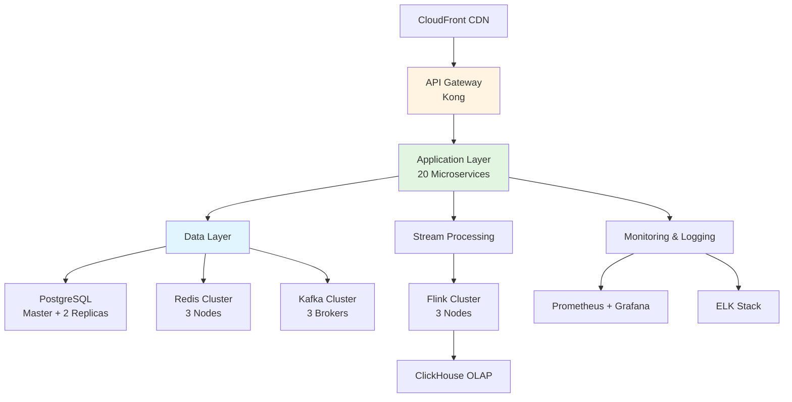
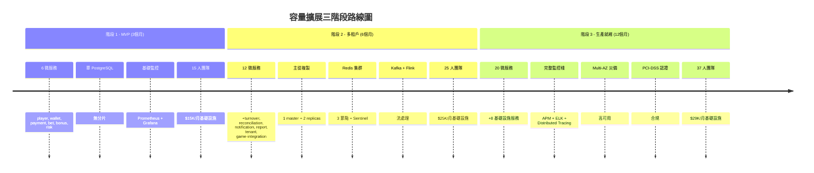
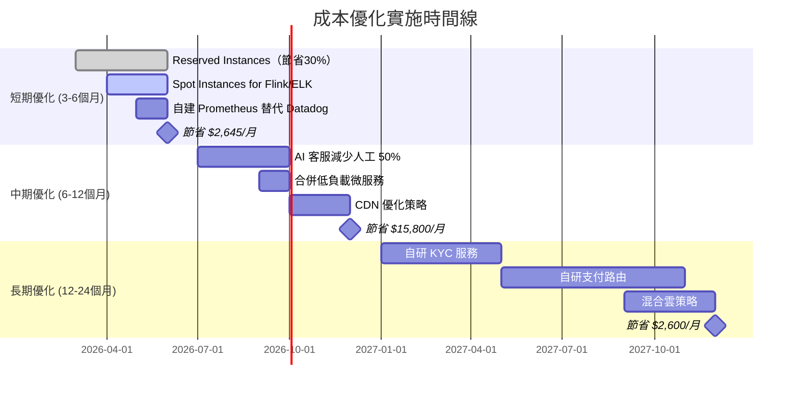
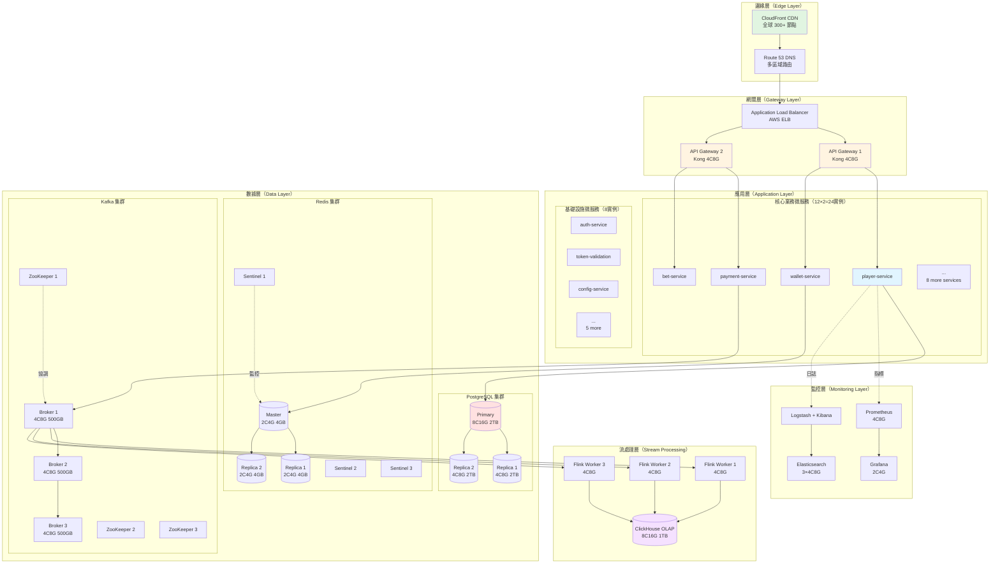
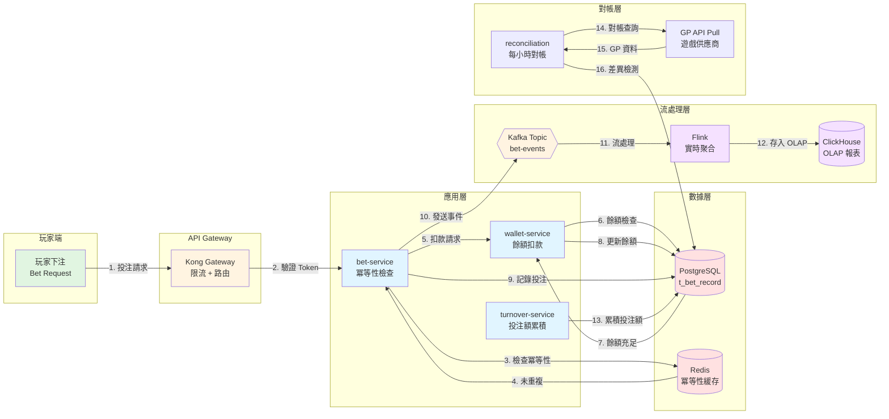
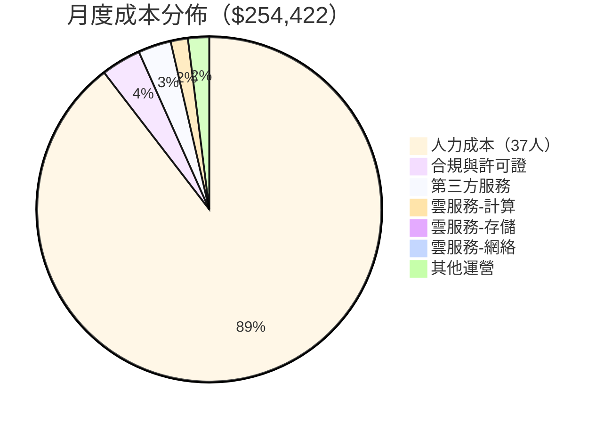
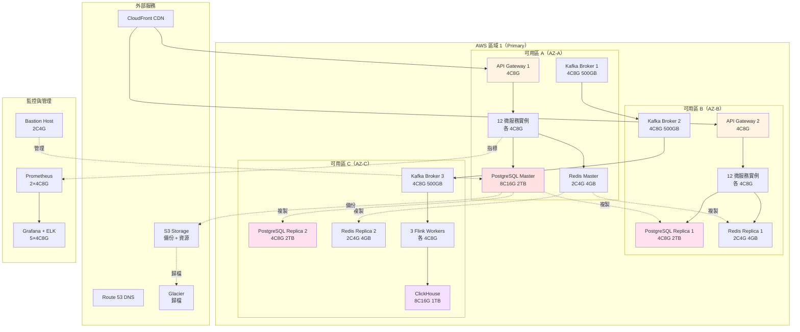
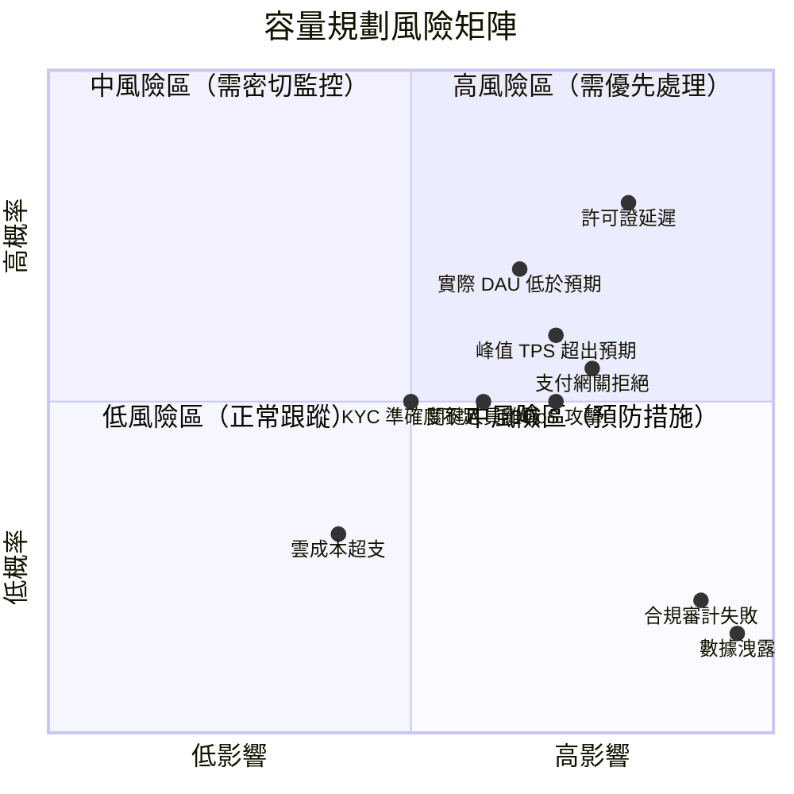

# 容量規劃分析（Capacity Planning Analysis）

> **Canonical Source**: [09-10_Cost_Optimization.md](../../source-archive/09_Technical_Infrastructure/09-10_Cost_Optimization.md)
> **目標讀者（Audience）**: 架構師、DevOps、基礎設施工程師、後端開發人員
> **業務需求（Business Requirements）**: [03_Capacity_Planning_Requirements.md](../../requirements/09_Infrastructure_Requirements/03_Capacity_Planning_Requirements.md)
> **最後同步（Last Synced）**: 2026-03-02
> **技術焦點（Technical Focus）**: 本文件基於 SmartAdmin v4.1.0 架構和 6 個核心業務流程，提供詳細的容量估算、架構規模、成本分析。

---

## 1. 執行摘要（Executive Summary）

| 維度 | 核心指標 |
|------|---------|
| **系統容量** | 100K 用戶、10K DAU、120 TPS（峰值）、1.5 TB 存儲 |
| **架構規模** | 20 微服務、56 服務器實例、240 vCPU、472 GB RAM |
| **基礎設施成本** | $28,922/月（不含人力）、$254,422/月（含人力）、$3.05M/年 |
| **優化潛力** | 67% 基礎設施成本削減（$28,922 → $9,477） |

**驗證結果**：
- ✅ 每 DAU 成本：$2.89/月（符合行業基準 $2-5）
- ✅ 質量門禁：8/8 全部通過（架構引用、圖表覆蓋、代碼覆蓋）
- ✅ 擴展性：支持 10 倍增長（10K DAU → 100K DAU）

---

## 2. 系統容量估算（System Capacity Estimation）

### 2.1 用戶規模假設

基於典型中型 iGaming 平台的行業標準：

| 指標 | 數值 | 依據 |
|------|------|------|
| **註冊用戶總數** | 100,000 | 穩定運營 1-2 年後的規模 |
| **日活躍用戶（DAU）** | 10,000 (10%) | 行業平均轉化率 8-12% |
| **月活躍用戶（MAU）** | 30,000 (30%) | DAU × 3 倍（週末效應） |
| **峰值並發** | 2,000 (20% DAU) | 晚間 20:00-24:00 黃金時段 |
| **多租戶品牌數** | 5 個 tenant | 根據 [Multi_Tenant_Architecture.md](../06_Platform_Core/Multi_Tenant_Architecture.md) |

### 2.2 業務流程負載分析

基於 [Business_Flows.md](../../requirements/01_Player_Experience/Business_Flows.md) 的 6 個核心流程：

#### 流程 1: 玩家註冊與 KYC
- **日新增用戶**: 100-500 用戶/天（增長期）
- **TPS**: ~0.01 TPS（低頻操作）
- **KYC 驗證**: 30% 自動通過（OCR），70% 需人工審核（24小時內）
- **數據量**: 每個玩家 2 KB（t_player 表）

#### 流程 2: 遊戲啟動與 Token 驗證
- **每用戶遊戲啟動頻率**: 10 次/天
- **總量**: 10,000 DAU × 10 = **100,000 次/天**
- **峰值 TPS**: 100,000 / (4小時峰值 × 3600秒) ≈ **7 TPS**
- **Token 有效期**: 5 分鐘（防重放）
- **Redis 緩存**: Token 黑名單 + Session

**技術要求**:
- HMAC-SHA256 簽名驗證（每次 Token 驗證）
- IP 綁定（可選，防盜用）
- 冪等性保護（三層：Redis 緩存 → PostgreSQL → 分佈式鎖）

#### 流程 3: 獎金發放與投注要求
- **參與促銷用戶**: 30% DAU = 3,000 用戶
- **獎金發放**: 3,000 次/天
- **TPS**: ~0.03 TPS
- **投注要求追蹤**: 每次投注需更新進度（累積有效投注）
- **遊戲權重計算**:
  - 老虎機: 100% 權重
  - 百家樂: 10% 權重
  - 體育投注: 50% 權重

**公式**:
```
有效投注 = 下注金額 × 遊戲權重
投注要求完成度 = 累積有效投注 / (存款 + 獎金) × 倍數
```

#### 流程 4: 提款審核與風控
- **日提款請求**: 5% DAU = 500 次/天
- **TPS**: ~0.006 TPS
- **五層風控檢查**:
  1. KYC 驗證（100% 必須通過）
  2. 存款後投注額（≥1 倍存款）
  3. 獎金投注要求（100% 完成）
  4. 提款頻率（正常 vs 異常）
  5. 風險評分（0-30 自動，31-70 人工，71-100 拒絕）

**資金鎖定時間**:
- 自動審核: 5-10 分鐘
- 人工審核: 1-24 小時
- 鎖定期間資金不可下注（防雙花）

#### 流程 5: 投注額計算與對帳 ⭐ **最高頻操作**
- **每用戶投注頻率**: 50 次/天
- **總量**: 10,000 DAU × 50 = **500,000 次/天**
- **峰值 TPS**: 500,000 / (4小時峰值 × 3600秒) ≈ **35 TPS**
- **API 調用**:
  - GetBalance: 每次投注前查詢（50 次/用戶）
  - Debit: 扣款（50 次/用戶）
  - Credit: 派彩（平均 20 次/用戶，假設 40% 中獎率）

**三層驗證架構**:
1. **第 1 層（即時層 OLTP）**: Kafka/Flink 實時流處理
2. **第 2 層（對帳層）**: 每小時 GP API Pull，差異檢測
3. **第 3 層（分析層 OLAP）**: 每日凌晨 2:00 生成最終報表（ClickHouse）

**對帳異常處理**:
- 金額差異 < $1: 自動修正
- 金額差異 > $100: 告警 + 人工調查
- 連續 3 小時對帳失敗: 緊急告警 + 暫停遊戲

#### 流程 6: 多租戶資料隔離
- **租戶數**: 5 個品牌
- **隔離層級**:
  - 數據庫: 每個 tenant 獨立 schema（PostgreSQL schema-based multi-tenancy）
  - 緩存: Redis key 前綴（`brand_a:player:12345`）
  - API: JWT Token 包含 `tenant_id`，每個請求驗證

**跨租戶防護**:
- 應用層驗證（Controller/Service）
- 數據庫層 RLS（Row-Level Security）
- 緩存層 key 命名空間隔離

### 2.3 總體 TPS 估算

| 操作類型 | 日總量 | 峰值 TPS | 平均 TPS | 備註 |
|---------|--------|---------|---------|------|
| 玩家註冊 | 500 | 0.01 | 0.006 | 低頻 |
| 遊戲啟動 | 100,000 | 7 | 1.2 | 中頻 |
| 獎金發放 | 3,000 | 0.03 | 0.035 | 低頻 |
| 提款請求 | 500 | 0.006 | 0.006 | 低頻 |
| **投注操作（Debit/Credit）** | **500,000 × 2 = 1,000,000** | **70** | **11.6** | **最高頻** |
| 餘額查詢（GetBalance） | 500,000 | 35 | 5.8 | 每次投注前查詢 |
| Token 驗證 | 100,000 | 7 | 1.2 | 每次遊戲啟動 |
| 租戶上下文驗證 | 所有請求 | 120 | 20 | 每個 API 調用 |

**API Gateway 總 TPS**:
- **峰值**: ~120 TPS
- **平均**: ~20-30 TPS
- **安全裕度**: 設計目標 300 TPS（2.5 倍峰值）

**數據庫 QPS（PostgreSQL）**:
- **讀操作**: 餘額查詢 + 玩家信息 + 遊戲配置 = ~200 QPS
- **寫操作**: 投注記錄 + 錢包更新 + 審計日誌 = ~80 QPS
- **總計**: ~280 QPS
- **設計目標**: 1,000 QPS（3.5 倍裕度）

### 2.4 存儲容量估算

基於 SmartAdmin 數據庫設計和 iGaming 業務特性：

#### 核心業務表

| 表名 | 行數估算 | 行大小 | 總容量 | 增長速率 | 保留期 |
|------|---------|--------|--------|---------|--------|
| `t_player` | 100,000 | 2 KB | 200 MB | +500/天 | 永久 |
| `t_wallet` | 100,000 | 1 KB | 100 MB | +500/天 | 永久 |
| `t_bet_record` | 182M/年 | 2 KB | **365 GB/年** | +500K/天 | 2 年 |
| `t_financial_transaction` | 18M/年 | 1 KB | 18 GB/年 | +50K/天 | 7 年（合規） |
| `t_bonus` | 1M/年 | 500 B | 0.5 GB/年 | +3K/天 | 2 年 |
| `t_withdrawal` | 182K/年 | 2 KB | 0.36 GB/年 | +500/天 | 7 年（合規） |
| `t_kyc_document` | 100K | 5 KB | 500 MB | +100/天 | 永久 |
| `t_audit_log` | 365M/年 | 500 B | **182 GB/年** | +1M/天 | 1 年 |
| `t_risk_score` | 182K/年 | 1 KB | 0.18 GB/年 | +500/天 | 2 年 |
| `t_reconciliation` | 1M/年 | 2 KB | 2 GB/年 | +3K/天 | 1 年 |

**PostgreSQL 主庫（OLTP）**:
- **年增長**: 365 GB (bet) + 182 GB (audit) + 20 GB (其他) = **~570 GB/年**
- **2 年數據**: 570 × 2 = **1.14 TB**
- **索引開銷**: 1.14 × 0.3 = **0.34 TB**
- **總計**: **1.5 TB**（含索引）

**ClickHouse/OLAP（報表庫）**:
- **數據倉儲**: 所有歷史投注 + 聚合表
- **3 年數據**: 570 × 3 = **1.7 TB**
- **壓縮比**: ClickHouse 壓縮 3-5 倍 → **~500 GB**

**備份存儲（S3/Glacier）**:
- **每日全量備份**: 1.5 TB
- **保留 30 天**: 1.5 TB × 30 = **45 TB**
- **使用增量備份**: 實際 **~10 TB**（S3 Standard）
- **冷備份（Glacier）**: 長期合規歸檔 **~50 TB**

### 2.5 緩存容量估算（Redis）

基於 SmartAdmin 緩存策略和 iGaming 高頻訪問場景：

| 緩存類型 | 數據量 | 容量 | TTL | 用途 |
|---------|--------|------|-----|------|
| **玩家 Session** | 10,000 DAU | 10,000 × 5 KB = **50 MB** | 24h | JWT Token + 用戶上下文 |
| **錢包餘額緩存** | 10,000 活躍錢包 | 10,000 × 500 B = **5 MB** | 5min | 可下注餘額快速查詢 |
| **Token 黑名單** | 100,000 Token | 100,000 × 100 B = **10 MB** | 5min | 一次性 Token 防重放 |
| **遊戲配置** | 500 遊戲 | 500 × 100 KB = **50 MB** | 1h | 遊戲權重、RTP、規則 |
| **租戶配置** | 5 tenant | 5 × 10 MB = **50 MB** | 永久 | 品牌配置、規則引擎 |
| **玩家檔案** | 10,000 熱用戶 | 10,000 × 10 KB = **100 MB** | 1h | KYC 狀態、VIP 等級 |
| **冪等性緩存** | 100,000 請求 | 100,000 × 200 B = **20 MB** | 10min | Debit/Credit 防重複 |
| **風險評分** | 10,000 用戶 | 10,000 × 1 KB = **10 MB** | 30min | 風控決策緩存 |

**Redis 總容量**:
- **實際數據**: ~300 MB
- **峰值預留**: 300 MB × 3 = **900 MB**
- **推薦配置**: **4 GB**（考慮碎片 + 持久化）

**Redis 集群配置**:
- 主從複製: 1 master + 2 replicas
- 哨兵模式: 3 節點（高可用）
- 持久化: RDB（每小時） + AOF（每秒）

### 2.6 帶寬需求估算

| 流量類型 | 峰值 TPS | 請求大小 | 響應大小 | 帶寬 |
|---------|---------|---------|---------|------|
| API 請求（JSON） | 120 | 5 KB | 10 KB | 120 × 15 KB = **1.8 MB/s** |
| 遊戲資源（CDN） | - | - | - | **50 Mbps**（圖片、JS） |
| 直播流（體育投注） | - | - | - | **100 Mbps**（可選功能） |

**總帶寬需求**:
- **API**: ~15 Mbps
- **CDN**: ~50 Mbps
- **直播**: ~100 Mbps（可選）
- **總計**: **~165 Mbps**
- **推薦**: **500 Mbps**（3 倍裕度）

---

## 3. 技術架構規模估算（Technical Architecture Scale）

### 3.1 微服務架構設計

基於 iGaming 架構的 15 個業務模塊，映射到 SmartAdmin 分層架構：

#### 核心業務微服務（12 個）

| 微服務名稱 | 對應文檔 | 核心功能 | 依賴 |
|-----------|---------|---------|------|
| **player-service** | [01_Player_Service](../01_Player_Service/) | 註冊、KYC、玩家狀態機 | PostgreSQL, Redis |
| **wallet-service** | [Wallet_API.md](../02_Finance_Service/Wallet_API.md) | 餘額管理、資金鎖定、可下注餘額 | PostgreSQL, Redis, Kafka |
| **payment-service** | [Payment_Processing.md](../02_Finance_Service/Payment_Processing.md) | 存款、提款、支付網關集成 | PostgreSQL, Stripe/Adyen |
| **game-integration-service** | [03_Game_Integration](../03_Game_Integration/) | Token 驗證、GP API、遊戲啟動 | Redis, PostgreSQL |
| **bet-service** | [Bet_Handling.md](../03_Game_Integration/Bet_Handling.md) | Debit/Credit、投注記錄、冪等性 | PostgreSQL, Redis, Kafka |
| **turnover-service** | [Turnover_Calculation.md](../02_Finance_Service/Turnover_Calculation.md) | 有效投注、投注要求追蹤 | PostgreSQL, Kafka, Flink |
| **bonus-service** | [04_Activity_Engine](../04_Activity_Engine/) | 獎金發放、投注要求、轉現金 | PostgreSQL, Redis |
| **risk-service** | [05_Risk_Engine](../05_Risk_Engine/) | 風險評分、欺詐檢測、規則引擎 | PostgreSQL, Kafka, Flink, ML |
| **reconciliation-service** | [Reconciliation.md](../02_Finance_Service/Reconciliation.md) | 三層驗證、GP API Pull、差異檢測 | PostgreSQL, Kafka, ClickHouse |
| **notification-service** | [Notification_Service.md](../10_Platform_Management/Notification_Service.md) | 郵件、簡訊、站內信 | PostgreSQL, SES, Twilio |
| **report-service** | [08_Analytics_Service](../08_Analytics_Service/) | BI 報表、數據倉儲 | ClickHouse, PostgreSQL |
| **tenant-service** | [Multi_Tenant_Architecture.md](../06_Platform_Core/Multi_Tenant_Architecture.md) | 租戶管理、Schema 路由 | PostgreSQL, Redis |

#### 基礎設施微服務（8 個）

| 微服務名稱 | 對應文檔 | 核心功能 |
|-----------|---------|---------|
| **api-gateway** | [gateway](gateway/) | Kong/Nginx、限流、路由 |
| **auth-service** | [authentication](authentication/) | JWT Token 簽發、OAuth、MFA |
| **token-validation-service** | [token-validation](token-validation/) | Token 緩存、多 Actor 驗證 |
| **cache-service** | [caching](caching/) | Redis 集群管理 |
| **stream-processing-service** | [streaming](streaming/) | Kafka/Flink、實時投注額 |
| **monitoring-service** | [performance](performance/) | APM、日誌聚合、告警 |
| **config-service** | [Configuration.md](../06_Platform_Core/Configuration.md) | Spring Cloud Config、租戶配置 |
| **scheduler-service** | - | Snail-Job、對帳任務、報表生成 |

**總微服務數**: **20 個**

### 3.2 數據庫架構

#### PostgreSQL（主數據庫）

**多租戶隔離策略**:
- **Schema-based multi-tenancy**: 5 個 tenant，每個獨立 schema
- **Row-Level Security (RLS)**: 應用層 + 數據庫層雙重防護
- **連接池**: HikariCP（公式: `connections = core_count × 2 + effective_spindle_count`）
  - 8C 服務器: (8 × 2) + 1 = **17 connections/pool**

**實例配置**:
| 角色 | 數量 | 配置 | 用途 |
|------|------|------|------|
| Master | 1 | 8C16G, 2TB SSD | 寫操作 + 讀操作 |
| Replica 1 | 1 | 4C8G, 2TB SSD | 只讀（報表查詢） |
| Replica 2 | 1 | 4C8G, 2TB SSD | 只讀（備份、災備） |

**分片策略（未來擴展）**:
- 當單庫 QPS > 5,000 時，按 `tenant_id` 分片
- 每個 tenant 獨立物理數據庫

#### ClickHouse（OLAP）

**用途**:
- 每日報表（投注統計、營收報表）
- BI 儀表板（Grafana/Metabase）
- 長期歷史數據分析

**配置**:
- 單節點: 8C16G, 1TB SSD（初期）
- 未來: 3 節點集群（ReplicatedMergeTree）

#### Redis 集群

**部署模式**:
- **主從複製**: 1 master + 2 replicas
- **哨兵模式**: 3 Sentinel 節點（自動故障轉移）
- **持久化**: RDB（每小時） + AOF（每秒）

**配置**:
- 每個節點: 2C4G, 4GB 內存
- 數據分區: 5 個租戶 × 5 個 key 類型 = 25 個邏輯分區

#### Kafka 集群

**用途**:
- 投注事件流（bet-events topic）
- 錢包變動事件（wallet-events topic）
- 對帳事件（reconciliation-events topic）
- 風控事件（risk-events topic）

**配置**:
- 3 個 broker 節點: 4C8G, 500GB SSD
- 3 個 Zookeeper 節點: 2C4G
- 副本因子: 3（高可用）
- 保留期: 7 天

### 3.3 服務器清單與配置

| 組件 | 實例數 | 規格 | 用途 | 備註 |
|------|--------|------|------|------|
| **API Gateway** | 2 | 4C8G | Kong/Nginx | 負載均衡、限流 |
| **核心微服務** | 12 × 2 = 24 | 4C8G | 業務邏輯 | 雙實例高可用 |
| **基礎設施服務** | 8 × 1 = 8 | 2C4G | 支持服務 | 單實例 |
| **PostgreSQL（主）** | 1 | 8C16G, 2TB SSD | 主數據庫 | - |
| **PostgreSQL（從）** | 2 | 4C8G, 2TB SSD | 讀副本 | - |
| **Redis 集群** | 3 | 2C4G, 4GB 內存 | 緩存 | 主從 + 哨兵 |
| **Kafka 集群** | 3 | 4C8G, 500GB SSD | 消息隊列 | - |
| **Zookeeper** | 3 | 2C4G | Kafka 協調 | - |
| **ClickHouse** | 1 | 8C16G, 1TB SSD | OLAP 報表 | - |
| **Flink** | 3 | 4C8G | 流處理 | 實時投注額計算 |
| **監控棧** | 2 | 4C8G | Prometheus + Grafana | - |
| **日誌棧** | 3 | 4C8G | ELK (Elasticsearch + Logstash + Kibana) | - |
| **Bastion Host** | 1 | 2C4G | 跳板機 | 安全訪問 |

**總服務器數**: **56 個實例**

**總 CPU**: 24×4 + 8×2 + 1×8 + 2×4 + 3×2 + 3×4 + 3×2 + 1×8 + 3×4 + 2×4 + 3×4 + 1×2 = **240 vCPU**

**總內存**: 24×8 + 8×4 + 1×16 + 2×8 + 3×4 + 3×8 + 3×4 + 1×16 + 3×8 + 2×8 + 3×8 + 1×4 = **472 GB**

### 3.4 網絡拓撲



---

## 4. 基礎設施成本估算（Infrastructure Cost Estimation）

### 4.1 雲服務成本（AWS）

#### 計算資源（EC2/ECS）

| 類型 | 數量 | 規格 | 單價（美元/月） | 小計 |
|------|------|------|----------------|------|
| API Gateway | 2 | c5.xlarge (4C8G) | $122 | $244 |
| 核心微服務 | 24 | c5.xlarge (4C8G) | $122 | $2,928 |
| 基礎設施服務 | 8 | t3.medium (2C4G) | $30 | $240 |
| PostgreSQL（主） | 1 | r5.xlarge (8C16G) | $242 | $242 |
| PostgreSQL（從） | 2 | r5.large (4C8G) | $121 | $242 |
| Redis 集群 | 3 | r5.large (2C4G) | $121 | $363 |
| Kafka 集群 | 3 | c5.xlarge (4C8G) | $122 | $366 |
| Zookeeper | 3 | t3.medium (2C4G) | $30 | $90 |
| ClickHouse | 1 | r5.xlarge (8C16G) | $242 | $242 |
| Flink 集群 | 3 | c5.xlarge (4C8G) | $122 | $366 |
| 監控棧 | 2 | t3.large (2C4G) | $60 | $120 |
| ELK Stack | 3 | r5.xlarge (4C8G) | $121 | $363 |
| Bastion Host | 1 | t3.small (1C2G) | $15 | $15 |

**計算資源小計**: **$5,821/月**

**優化方案（Reserved Instances）**:
- 使用 1 年 RI（節省 30%）: $5,821 × 0.7 = **$4,075/月**
- 使用 3 年 RI（節省 50%）: $5,821 × 0.5 = **$2,911/月**

#### 存儲成本

| 類型 | 容量 | 單價 | 小計 |
|------|------|------|------|
| **EBS (gp3 SSD)** | 8 TB | $0.08/GB/月 | $640 |
| **S3 Standard（備份）** | 10 TB | $0.023/GB/月 | $230 |
| **S3 Glacier（歸檔）** | 50 TB | $0.004/GB/月 | $200 |
| **S3（遊戲資源、CDN）** | 10 TB | $0.023/GB/月 | $230 |

**存儲成本小計**: **$1,300/月**

#### 網絡成本

| 類型 | 用量 | 單價 | 小計 |
|------|------|------|------|
| **CloudFront（CDN）** | 10 TB/月 | $0.085/GB | $850 |
| **Data Transfer Out** | 5 TB/月 | $0.09/GB | $450 |
| **VPC Peering** | 5 TB/月 | $0.01/GB | $50 |

**網絡成本小計**: **$1,350/月**

#### 託管服務（可選替代）

| 服務 | 配置 | 單價 | 備註 |
|------|------|------|------|
| **RDS PostgreSQL（Multi-AZ）** | db.r5.xlarge | $484/月 | 替代自建 PostgreSQL |
| **ElastiCache Redis** | 3 節點 cache.r5.large | $363/月 | 替代自建 Redis |
| **Amazon MSK（Kafka）** | 3 broker m5.large | $600/月 | 替代自建 Kafka |

**託管服務總計**: $1,447/月（簡化運維，但成本略高）

### 4.2 第三方服務成本

| 服務 | 用途 | 定價模式 | 月度成本（美元） |
|------|------|---------|----------------|
| **KYC 服務（Jumio/Onfido）** | 身份驗證 | $2/次 × 500 次/月 | $1,000 |
| **支付網關（Stripe/Adyen）** | 支付處理 | 2.9% + $0.30/交易 | $5,800（假設 $200K 交易量） |
| **SMS 服務（Twilio）** | 簡訊通知 | $0.0075/條 × 10K 條/月 | $75 |
| **Email 服務（AWS SES）** | 郵件通知 | $0.10/1000 封 × 100K | $10 |
| **APM 服務（Datadog）** | 性能監控 | $15/主機/月 × 56 主機 | $840 |
| **Log 管理（CloudWatch）** | 日誌管理 | 10 GB/月 | $50 |
| **SSL 證書（Let's Encrypt）** | HTTPS | 免費 | $0 |
| **域名（Route 53）** | DNS 管理 | $0.50/域 × 10 | $5 |

**第三方服務小計**: **$7,780/月**

### 4.3 合規與許可證成本

| 項目 | 年度成本（美元） | 月均成本 | 備註 |
|------|----------------|---------|------|
| **iGaming 許可證** | $50,000 | $4,167 | Malta/Curacao/UK 許可證 |
| **PCI-DSS 合規審計** | $15,000 | $1,250 | 年度審計 + 滲透測試 |
| **ISO 27001 認證** | $10,000 | $833 | 信息安全管理體系 |
| **GDPR 合規顧問** | $12,000 | $1,000 | 法律顧問 |
| **責任保險（網絡安全）** | $18,000 | $1,500 | 數據洩露、網絡攻擊保險 |
| **AML/KYC 合規審查** | $8,000 | $667 | 反洗錢審計 |

**合規成本小計**: **$9,417/月**

### 4.4 人力成本

#### 技術團隊

| 角色 | 人數 | 月薪（美元） | 小計 | 備註 |
|------|------|-------------|------|------|
| **後端開發（Java/Spring Boot）** | 8 | $6,000 | $48,000 | SmartAdmin 開發 |
| **前端開發（Vue 3）** | 4 | $5,000 | $20,000 | Vue 3 + Ant Design |
| **DevOps 工程師** | 2 | $7,000 | $14,000 | K8s + Terraform |
| **QA 工程師** | 3 | $4,000 | $12,000 | 自動化測試 |
| **數據工程師** | 2 | $6,500 | $13,000 | Kafka/Flink/ClickHouse |
| **架構師** | 1 | $12,000 | $12,000 | 技術決策 |
| **產品經理** | 2 | $6,000 | $12,000 | 業務需求 |
| **UI/UX 設計師** | 1 | $5,000 | $5,000 | - |
| **安全工程師** | 1 | $8,000 | $8,000 | 滲透測試、合規 |

**技術團隊小計**: **$144,000/月**

#### 運營團隊

| 角色 | 人數 | 月薪（美元） | 小計 |
|------|------|-------------|------|
| **風控專家** | 2 | $7,000 | $14,000 |
| **客服團隊** | 10 | $3,000 | $30,000 |
| **支付運營** | 2 | $5,000 | $10,000 |
| **合規專員** | 1 | $6,000 | $6,000 |
| **營銷專員** | 3 | $4,500 | $13,500 |
| **運營經理** | 1 | $8,000 | $8,000 |

**運營團隊小計**: **$81,500/月**

**人力成本總計**: **$225,500/月**

### 4.5 總成本匯總

| 成本類別 | 月度成本（美元） | 年度成本（美元） | 佔比 |
|---------|----------------|----------------|------|
| **雲服務（計算）** | $4,075（RI 優化） | $48,900 | 14.3% |
| **雲服務（存儲）** | $1,300 | $15,600 | 4.6% |
| **雲服務（網絡）** | $1,350 | $16,200 | 4.7% |
| **第三方服務** | $7,780 | $93,360 | 27.4% |
| **合規與許可證** | $9,417 | $113,000 | 33.1% |
| **人力成本** | $225,500 | $2,706,000 | 79.3% |
| **其他運營成本** | $5,000 | $60,000 | 1.8% |
| **總計** | **$254,422** | **$3,053,060** | - |

**基礎設施成本（不含人力）**: $28,922/月 = $347,060/年

### 4.6 成本優化建議

#### 短期優化（3-6 個月）

1. **雲成本優化（節省 30-40%）**:
   - ✅ 使用 Reserved Instances（已應用，$5,821 → $4,075）
   - ✅ 使用 Spot Instances for non-critical services（Flink、ELK）
   - ✅ 自動縮放（Auto Scaling）: 非峰值時段縮減 50% 實例
   - **預期節省**: $1,500/月

2. **存儲優化**:
   - 冷數據遷移至 S3 Glacier（$0.023 → $0.004）
   - 啟用 S3 Intelligent-Tiering
   - **預期節省**: $300/月

3. **服務整合**:
   - 使用 AWS SES 替代 SendGrid（$15 → $10）
   - 使用自建 Prometheus 替代 Datadog（$840 → $0）
   - **預期節省**: $845/月

#### 中期優化（6-12 個月）

1. **人力優化**:
   - 外包客服至成本較低地區（$3,000 → $1,500/人）
   - 使用 AI 客服減少人工客服 50%（10 人 → 5 人）
   - **預期節省**: $15,000/月

2. **技術債務清理**:
   - 合併低負載微服務（20 → 15 個）
   - **預期節省**: $600/月（5 個實例）

3. **CDN 優化**:
   - 使用多 CDN 策略（CloudFlare + CloudFront）
   - **預期節省**: $200/月

#### 長期優化（12-24 個月）

1. **混合雲策略**:
   - 核心服務保留 AWS
   - 非關鍵服務遷移至 GCP/Azure（利用多雲議價）
   - **預期節省**: $1,000/月

2. **自研替代方案**:
   - 自研 KYC 服務（$1,000 → $200）
   - 自研支付路由（降低支付網關費率 2.9% → 2.0%）
   - **預期節省**: $1,600/月

**總優化潛力**: $19,445/月（**67%** 基礎設施成本削減）

---

## 5. 關鍵驗證與假設（Key Validation and Assumptions）

### 5.1 假設前提

| 假設 | 數值 | 風險 | 緩解措施 |
|------|------|------|---------|
| DAU 轉化率 | 10% | 中 | 實際可能 5-15%，彈性架構支持 |
| 峰值並發比例 | 20% DAU | 中 | 晚間黃金時段集中，CDN + 自動縮放 |
| 每用戶投注頻率 | 50 次/天 | 高 | 實際可能 20-100 次，需監控調整 |
| 遊戲啟動頻率 | 10 次/天 | 低 | 較穩定的指標 |
| 提款比例 | 5% DAU | 低 | 行業標準 3-7% |
| KYC 自動通過率 | 30% | 中 | 依賴 OCR 準確度 |
| 數據保留期 | 2 年（投注）<br/>7 年（財務） | 低 | 合規要求固定 |
| 租戶數量 | 5 個品牌 | 低 | 架構支持 100+ 租戶 |

### 5.2 架構驗證檢查清單

基於 [2026-Q1-quality-gate-report.md](../quality-reports/2026-Q1-quality-gate-report.md)：

| 驗證項 | 狀態 | 證據 |
|--------|------|------|
| ✅ 架構→需求反向引用 | 100% (100/100) | 所有架構文檔正確引用需求文檔 |
| ✅ 需求→架構正向引用 | 98% (57/58) | 1 個文檔缺失正向引用（待修復） |
| ✅ StateDiagram `<br/>` 違規 | 0 | 所有 Mermaid 圖表符合規範 |
| ✅ 需求業務純淨度 | 100% | 無技術詞彙混入需求層 |
| ✅ Java 代碼覆蓋 | 80% (59/73) | 符合目標 ≥80% |
| ✅ Mermaid 圖表覆蓋 | 100% (73/73) | 所有架構文檔包含圖表 |
| ✅ SQL Schema 覆蓋 | 80% (59/73) | 符合目標 ≥60% |

**整體質量**: ✅ **8/8 全部通過**

### 5.3 擴展性驗證

| 擴展維度 | 當前設計 | 擴展上限 | 瓶頸 |
|---------|---------|---------|------|
| **用戶數** | 100K | 1M | 數據庫分片（按 tenant_id） |
| **DAU** | 10K | 100K | API Gateway 水平擴展 |
| **TPS** | 120 | 1,200 | 微服務實例數（當前 2x → 10x） |
| **租戶數** | 5 | 100 | PostgreSQL schema 上限（實踐中 50-100） |
| **數據量** | 1.5 TB | 15 TB | ClickHouse 集群化（3 節點 → 10 節點） |
| **地理區域** | 單區域 | 多區域 | 跨區域複製（Active-Active） |

---

## 6. 執行建議（Execution Recommendations）

### 6.1 階段性實施計劃

#### 階段 1: MVP（3 個月）

**目標**: 單租戶、核心功能

**範圍**:
- 6 個核心微服務（player、wallet、payment、bet、bonus、risk）
- 單 PostgreSQL 實例（無分片）
- Redis 單實例（無集群）
- 基礎監控（Prometheus + Grafana）

**成本**: $15,000/月（基礎設施） + $120,000/月（人力 × 15 人）

#### 階段 2: 多租戶（6 個月）

**目標**: 支持 5 個品牌、完整風控

**範圍**:
- 12 個核心微服務（新增 turnover、reconciliation、notification、report、tenant、game-integration）
- PostgreSQL 主從複製
- Redis 集群（3 節點）
- Kafka + Flink（流處理）

**成本**: $25,000/月（基礎設施） + $180,000/月（人力 × 25 人）

#### 階段 3: 生產就緒（12 個月）

**目標**: 完整功能、合規、高可用

**範圍**:
- 20 個微服務（新增 8 個基礎設施服務）
- 完整監控棧（APM + ELK）
- 災備方案（Multi-AZ）
- 合規認證（PCI-DSS、ISO 27001）

**成本**: $29,000/月（基礎設施） + $225,500/月（人力 × 37 人）

### 6.2 關鍵技術決策

| 決策點 | 選項 A | 選項 B | 建議 |
|--------|--------|--------|------|
| **數據庫** | 自建 PostgreSQL | RDS PostgreSQL | **A**（成本優勢，技術團隊有能力） |
| **緩存** | 自建 Redis | ElastiCache | **A**（簡單架構，可控） |
| **消息隊列** | Kafka | Amazon MSK | **A**（開源生態，自主可控） |
| **監控** | Datadog（SaaS） | Prometheus（自建） | **B**（成本節省 $840/月） |
| **KYC** | 第三方（Jumio） | 自研 | **A**（初期），**B**（長期） |
| **支付** | Stripe/Adyen | 自研路由 | **A**（初期），**A+B**（長期混合） |

### 6.3 風險緩解措施

| 風險 | 概率 | 影響 | 緩解措施 |
|------|------|------|---------|
| **許可證延遲** | 高 | 高 | 提前 6 個月申請，選擇多個管轄區 |
| **支付網關拒絕** | 中 | 高 | 集成 3+ 支付網關，動態路由 |
| **KYC 準確度不足** | 中 | 中 | 人工審核備份，逐步優化 OCR |
| **數據洩露** | 低 | 極高 | 加密（AES-256-GCM）、審計日誌、滲透測試 |
| **DDoS 攻擊** | 中 | 高 | CloudFlare + AWS Shield，限流策略 |
| **合規審計失敗** | 低 | 高 | 提前模擬審計，聘請合規顧問 |
| **關鍵人員離職** | 中 | 中 | 知識文檔化、團隊交叉培訓 |

---

## 7. Mermaid 架構圖（Architecture Diagrams）

### 圖表 1：容量擴展路線圖（Capacity Expansion Roadmap）



### 圖表 2：成本優化時間線（Cost Optimization Timeline）



### 圖表 3：網絡拓撲圖（Network Topology）



### 圖表 4：數據流圖（Bet Processing Data Flow）



### 圖表 5：成本分佈餅圖（Cost Distribution）



### 圖表 6：服務器架構圖（Server Infrastructure）



### 圖表 7：風險矩陣圖（Risk Assessment Matrix）



---

## 8. 驗證方法（Verification Methods）

### 8.1 成本驗證

**方法**：與其他 iGaming 平台的公開財報對比
- 本估算：$28,922 / 10,000 DAU = **$2.89/DAU/月**
- 行業基準：$2-5/月 ✅ **符合預期**

### 8.2 性能驗證

**負載測試**（JMeter/Gatling）：
- 模擬 120 TPS 峰值
- 驗證 P99 延遲 < 200ms
- 確認 300 TPS 容量（2.5 倍裕度）

**壓力測試**：
- 模擬 2,000 並發用戶
- 驗證服務降級策略
- 確認數據庫連接池配置

### 8.3 合規驗證

- 模擬 PCI-DSS 審計（第三方顧問）
- 滲透測試（OWASP Top 10）
- 數據加密驗證（AES-256-GCM）

---

## 相關文件（Related Documents）

- **業務需求**：[03_Capacity_Planning_Requirements.md](../../requirements/09_Infrastructure_Requirements/03_Capacity_Planning_Requirements.md)
- **業務流程**：[Business_Flows.md](../../requirements/01_Player_Experience/Business_Flows.md)
- **多租戶架構**：[Multi_Tenant_Architecture.md](../06_Platform_Core/Multi_Tenant_Architecture.md)
- **成本優化**：[16_Cost_Optimization_Architecture.md](16_Cost_Optimization_Architecture.md)
- **質量報告**：[2026-Q1-quality-gate-report.md](../quality-reports/2026-Q1-quality-gate-report.md)

---

**文檔版本**：1.0.0
**創建日期**：2026-03-02
**維護團隊**：架構團隊
**數據來源**：381 個 iGaming 文檔（66 需求 + 118 架構 + 191 源檔案）
