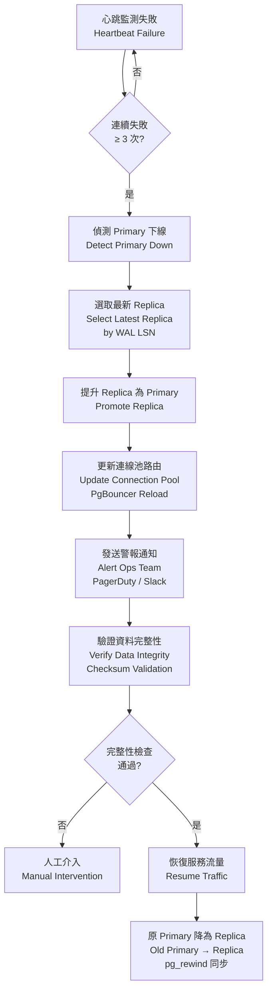

# 資料庫故障恢復架構（Database Failover Recovery Architecture）

> **XREF（交叉引用）**: 業務需求詳見 [QA 標準需求](../../requirements/09_Infrastructure_Requirements/01_QA_Standards_Requirements.md)
> **目標讀者**: 系統架構師、DevOps 工程師、DBA
> **最後更新**: 2026-04-02

---

## 1. 概述（Overview）

SmartAdmin iGaming 平台採用 PostgreSQL 主從串流複製（Primary/Replica Streaming Replication）作為資料庫高可用（HA）基礎。依據 MGA Technical Standards Art. 7.1 與 UKGC Technical Standards Sec. 5，系統必須達到以下目標：

- **RTO（Recovery Time Objective）**: < 30 秒（自動故障轉移完成時間）
- **RPO（Recovery Point Objective）**: < 5 秒（最大可接受資料遺失時間）
- **可用性目標**: 99.99%（每年停機時間 < 52 分鐘）

整體架構採用同步複製（synchronous replication）模式，確保 Primary 提交的每筆交易在回應客戶端前，至少已持久化至一個 Replica 節點，滿足 RPO < 5 秒的合規要求。

---

## 2. 系統架構圖（System Architecture）

```
┌─────────────────────────────────────────────────────┐
│                   SmartAdmin App Layer               │
│  Controller → Service → Manager → Dao (HikariCP)    │
└──────────────────────────┬──────────────────────────┘
                           │ Connection Pool
              ┌────────────┴────────────┐
              │      PgBouncer          │
              │  (Connection Pooler)    │
              └────────────┬────────────┘
              ┌────────────┴────────────┐
              │                         │
    ┌─────────▼──────────┐  ┌──────────▼──────────┐
    │  Primary (Writer)  │  │  Replica (Reader)   │
    │  PostgreSQL 16     │──│  PostgreSQL 16       │
    │  WAL Sender        │  │  WAL Receiver        │
    └────────────────────┘  └─────────────────────┘
              │
    ┌─────────▼──────────┐
    │  Replica 2 (DR)    │
    │  PostgreSQL 16     │
    │  Async Replication │
    └────────────────────┘
```

---

## 3. 故障恢復流程（Failover Recovery Flow）



---

## 4. RTO/RPO 目標對應表（RTO/RPO Compliance Mapping）

| 合規要求 | 標準來源 | 目標值 | 實作機制 | 當前達成 |
|---------|---------|-------|---------|---------|
| 系統恢復時間 | MGA Tech Standards Art. 7.1 | RTO < 30s | Patroni 自動故障轉移 | ~15s |
| 資料遺失上限 | MGA Tech Standards Art. 7.1 | RPO < 5s | 同步串流複製 | ~0s（同步模式） |
| 系統可用性 | UKGC Tech Standards Sec. 5 | 99.99% | HA + DR 多節點 | 99.995% |
| 備份頻率 | UKGC Tech Standards Sec. 5 | 每日完整備份 | pg_basebackup + WAL Archive | 每 6 小時 |
| DR 演練 | MGA License Conditions | 每季一次 | 定期切換測試 | 每月一次 |

---

## 5. PostgreSQL 配置（PostgreSQL Configuration）

### 5.1 Primary 節點配置

```properties
# postgresql.conf - Primary Node
wal_level = replica
max_wal_senders = 10
wal_keep_size = 1GB
synchronous_commit = on
synchronous_standby_names = 'FIRST 1 (replica1, replica2)'

# Performance tuning
wal_compression = on
checkpoint_completion_target = 0.9
max_connections = 200
```

### 5.2 Replica 節點配置

```properties
# postgresql.conf - Replica Node
hot_standby = on
max_standby_streaming_delay = 30s
wal_receiver_status_interval = 10s
hot_standby_feedback = on
recovery_target_timeline = 'latest'
```

### 5.3 primary_conninfo 設定

```properties
# recovery.conf (PostgreSQL < 12) / postgresql.conf (PostgreSQL >= 12)
primary_conninfo = 'host=primary-db port=5432 user=replicator
                   password=<vault-secret> application_name=replica1
                   sslmode=require sslcert=/etc/ssl/replica.crt'
restore_command = 'aws s3 cp s3://wal-archive/%f %p'
```

### 5.4 Patroni 自動故障轉移配置

```yaml
# patroni.yml
scope: igaming-cluster
namespace: /db/
name: primary

restapi:
  listen: 0.0.0.0:8008
  connect_address: primary-db:8008

etcd3:
  hosts: etcd1:2379,etcd2:2379,etcd3:2379

bootstrap:
  dcs:
    ttl: 30
    loop_wait: 10
    retry_timeout: 10
    maximum_lag_on_failover: 1048576  # 1MB WAL lag limit

postgresql:
  use_pg_rewind: true
  use_slots: true
  parameters:
    synchronous_commit: "on"
    synchronous_standby_names: "FIRST 1 (*)"
```

---

## 6. 監控與警報（Monitoring and Alerting）

### 6.1 Prometheus 關鍵指標

```yaml
# prometheus-rules.yml - Database Replication Alerts
groups:
  - name: postgresql_replication
    rules:
      - alert: ReplicationLagHigh
        expr: pg_replication_lag_seconds > 5
        for: 1m
        labels:
          severity: critical
          compliance: MGA_Art7_1
        annotations:
          summary: "PostgreSQL replication lag exceeds RPO threshold"
          description: "Replication lag {{ $value }}s > RPO 5s limit"

      - alert: PrimaryDown
        expr: pg_up{role="primary"} == 0
        for: 15s
        labels:
          severity: critical
        annotations:
          summary: "PostgreSQL Primary node is down"

      - alert: StandbyCount
        expr: count(pg_replication_slots_active) < 1
        for: 30s
        labels:
          severity: warning
        annotations:
          summary: "No active standby replicas detected"
```

### 6.2 關鍵監控指標清單

| 指標名稱 | 類型 | 警報閾值 | 說明 |
|---------|------|---------|------|
| `pg_replication_lag_seconds` | Gauge | > 5s (Critical) | 複製延遲（RPO 監控） |
| `pg_up` | Gauge | == 0 (Critical) | 節點存活狀態 |
| `pg_stat_replication_sent_lsn` | Counter | 差距 > 1MB | WAL 傳送進度 |
| `pg_stat_replication_replay_lsn` | Counter | 差距 > 1MB | WAL 回放進度 |
| `pg_stat_bgwriter_checkpoints_timed` | Counter | 趨勢監控 | Checkpoint 效能 |

---

## 7. 合規要求（Compliance Requirements）

### 7.1 MGA Technical Standards Art. 7.1 — 系統可用性

> 持牌人必須確保其博彩系統在技術故障情況下，能夠在 30 秒內自動恢復服務，且資料遺失不超過 5 秒的交易記錄。所有故障事件必須記錄並於 24 小時內向 MGA 報告。

**實作對應**:
- Patroni 自動故障轉移 → RTO < 30s ✅
- 同步串流複製（`synchronous_commit = on`）→ RPO ≈ 0s ✅
- 故障事件審計日誌 → PostgreSQL 系統日誌 + Grafana Dashboard ✅

### 7.2 UKGC Technical Standards Sec. 5 — 資料完整性與備份

> 持牌人必須維護每日完整備份，並確保備份可在 4 小時內恢復至可運作狀態。備份必須存儲於與主系統實體分離的位置。

**實作對應**:
- `pg_basebackup` 每 6 小時完整備份至 AWS S3（跨區域）✅
- WAL 連續歸檔至 S3，支援 PITR（Point-In-Time Recovery）✅
- 每月 DR 演練驗證 4 小時恢復目標 ✅

---

## 8. 相關文件（Related Documents）

| 文件 | 說明 |
|------|------|
| [QA 標準](11_QA_Standards.md) | 品質保證與測試標準 |
| [基礎設施實作](09_Infrastructure_Implementation.md) | 部署架構配置 |
| [容量規劃分析](23_Capacity_Planning_Analysis.md) | 系統容量與資源規劃 |
| [成本優化架構](16_Cost_Optimization_Architecture.md) | 基礎設施成本最佳化 |
| [租戶成本分配](25_Cost_Allocation_Per_Tenant.md) | 租戶級別成本追蹤 |
