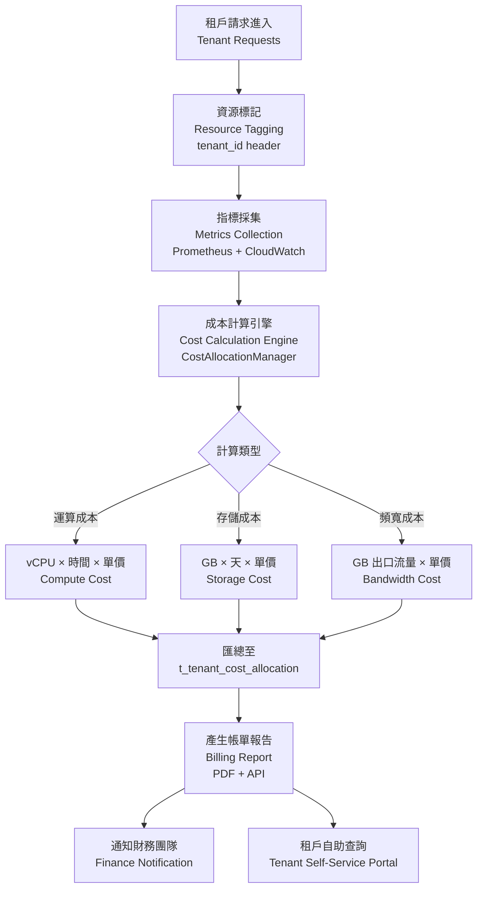

# 租戶成本分配架構（Cost Allocation Per Tenant Architecture）

> **XREF（交叉引用）**: 業務需求詳見 [成本最佳化需求](../../requirements/09_Infrastructure_Requirements/02_Cost_Optimization_Requirements.md)
> **目標讀者**: 系統架構師、DevOps 工程師、財務團隊
> **最後更新**: 2026-04-02

---

## 1. 概述（Overview）

多租戶（Multi-Tenant）iGaming 平台需要對每個租戶的基礎設施資源消耗進行精確追蹤與財務歸因（Financial Attribution）。本架構實現：

- **成本透明度（Cost Transparency）**: 每個租戶可查詢自身的運算、存儲、頻寬成本明細
- **自動成本分配（Automated Cost Allocation）**: 基於實際資源使用量的月度帳單計算
- **合規報告（Compliance Reporting）**: 滿足 MGA Financial Transparency Art. 3 對營運商財務問責的要求
- **優化決策支援**: 成本異常偵測與多租戶資源使用趨勢分析

SmartAdmin 架構層 Manager 負責帶有 `@Transactional` 的成本計算持久化，Service 層負責業務邏輯協調，Controller 層對外暴露 REST API。

---

## 2. 成本分配管線（Cost Allocation Pipeline）



---

## 3. 資料庫 Schema

### 3.1 主成本分配表

```sql
-- V2026.04.02__tenant_cost_allocation.sql
CREATE TABLE t_tenant_cost_allocation (
    id               BIGSERIAL PRIMARY KEY,
    tenant_id        BIGINT        NOT NULL,
    period_start     DATE          NOT NULL,
    period_end       DATE          NOT NULL,
    compute_cost_usd NUMERIC(12,4) NOT NULL DEFAULT 0,
    storage_cost_usd NUMERIC(12,4) NOT NULL DEFAULT 0,
    bandwidth_cost_usd NUMERIC(12,4) NOT NULL DEFAULT 0,
    total_cost_usd   NUMERIC(12,4) NOT NULL DEFAULT 0,
    deleted          SMALLINT      NOT NULL DEFAULT 0,
    create_time      TIMESTAMP     NOT NULL DEFAULT NOW(),
    update_time      TIMESTAMP     NOT NULL DEFAULT NOW()
);

COMMENT ON TABLE t_tenant_cost_allocation IS '租戶月度成本分配記錄';
COMMENT ON COLUMN t_tenant_cost_allocation.tenant_id IS '租戶唯一標識';
COMMENT ON COLUMN t_tenant_cost_allocation.period_start IS '計費週期開始日期';
COMMENT ON COLUMN t_tenant_cost_allocation.period_end IS '計費週期結束日期';
COMMENT ON COLUMN t_tenant_cost_allocation.compute_cost_usd IS '運算資源成本（USD）';
COMMENT ON COLUMN t_tenant_cost_allocation.storage_cost_usd IS '存儲資源成本（USD）';
COMMENT ON COLUMN t_tenant_cost_allocation.bandwidth_cost_usd IS '頻寬出口成本（USD）';
COMMENT ON COLUMN t_tenant_cost_allocation.total_cost_usd IS '合計成本（USD）';
COMMENT ON COLUMN t_tenant_cost_allocation.deleted IS '邏輯刪除（0=正常，1=已刪除）';

CREATE UNIQUE INDEX idx_tenant_cost_period
    ON t_tenant_cost_allocation (tenant_id, period_start, period_end)
    WHERE deleted = 0;

CREATE INDEX idx_tenant_cost_tenant_id
    ON t_tenant_cost_allocation (tenant_id, period_start DESC);
```

---

## 4. SmartAdmin 實作（Implementation）

### 4.1 Entity 層

```java
@Data
@TableName("t_tenant_cost_allocation")
public class TenantCostAllocationEntity {
    @TableId(type = IdType.AUTO)
    private Long id;
    private Long tenantId;
    private LocalDate periodStart;
    private LocalDate periodEnd;
    private BigDecimal computeCostUsd;
    private BigDecimal storageCostUsd;
    private BigDecimal bandwidthCostUsd;
    private BigDecimal totalCostUsd;
    private Integer deleted;
    private LocalDateTime createTime;
    private LocalDateTime updateTime;
}
```

### 4.2 Manager 層（含 @Transactional 與 @Cacheable）

```java
@Component
@RequiredArgsConstructor
public class TenantCostAllocationManager {

    private final TenantCostAllocationDao tenantCostAllocationDao;
    private final TenantResourceUsageDailyDao resourceUsageDailyDao;

    /**
     * 計算並持久化月度成本分配。
     * 使用 @Transactional 確保計算與寫入的原子性。
     */
    @Transactional(rollbackFor = Throwable.class)
    public Option<CostAllocationVO> allocateMonthlyCosts(Long tenantId, YearMonth period) {
        LocalDate periodStart = period.atDay(1);
        LocalDate periodEnd = period.atEndOfMonth();

        // 匯總每日資源使用量
        ResourceUsageSummary summary =
            resourceUsageDailyDao.sumByTenantAndPeriod(tenantId, periodStart, periodEnd);

        // 依單價計算成本
        BigDecimal computeCost = summary.getVcpuHours()
            .multiply(CostConstants.VCPU_HOUR_PRICE_USD);
        BigDecimal storageCost = summary.getStorageGb()
            .multiply(CostConstants.STORAGE_GB_MONTH_PRICE_USD);
        BigDecimal bandwidthCost = summary.getBandwidthGb()
            .multiply(CostConstants.BANDWIDTH_GB_PRICE_USD);
        BigDecimal totalCost = computeCost.add(storageCost).add(bandwidthCost);

        TenantCostAllocationEntity entity = new TenantCostAllocationEntity();
        entity.setTenantId(tenantId);
        entity.setPeriodStart(periodStart);
        entity.setPeriodEnd(periodEnd);
        entity.setComputeCostUsd(computeCost);
        entity.setStorageCostUsd(storageCost);
        entity.setBandwidthCostUsd(bandwidthCost);
        entity.setTotalCostUsd(totalCost);

        tenantCostAllocationDao.insert(entity);

        return Option.of(SmartBeanUtil.copy(entity, CostAllocationVO.class));
    }

    /**
     * 查詢租戶成本摘要（帶快取）。
     * @Cacheable 僅允許在 Manager 層使用。
     */
    @Cacheable(cacheNames = "tenant-cost", key = "#tenantId + '_' + #period")
    public Option<CostSummaryVO> getCostSummary(Long tenantId, YearMonth period) {
        return Option.of(
            tenantCostAllocationDao.findByTenantAndPeriod(
                tenantId,
                period.atDay(1),
                period.atEndOfMonth()
            )
        ).map(entity -> SmartBeanUtil.copy(entity, CostSummaryVO.class));
    }
}
```

### 4.3 Service 層（業務邏輯協調，使用 io.vavr.control.Option）

```java
@Service
@RequiredArgsConstructor
public class TenantCostAllocationService {

    private final TenantCostAllocationManager tenantCostAllocationManager;
    private final TenantCostAllocationDao tenantCostAllocationDao;

    /**
     * 觸發月度成本計算（委派給 Manager 執行 @Transactional 操作）。
     */
    public Option<CostAllocationVO> triggerMonthlyAllocation(Long tenantId, YearMonth period) {
        return tenantCostAllocationManager.allocateMonthlyCosts(tenantId, period);
    }

    /**
     * 查詢成本摘要（透過 Manager 層取得快取結果）。
     * Service 使用 io.vavr.control.Option，NOT java.util.Optional。
     */
    public Option<CostSummaryVO> getCostSummary(Long tenantId, YearMonth period) {
        return tenantCostAllocationManager.getCostSummary(tenantId, period);
    }

    /**
     * 查詢租戶成本歷史（單表查詢，Service 可直接呼叫 Dao）。
     */
    public List<CostAllocationVO> getCostHistory(Long tenantId, int months) {
        return tenantCostAllocationDao.findRecentByTenant(tenantId, months)
            .stream()
            .map(e -> SmartBeanUtil.copy(e, CostAllocationVO.class))
            .collect(Collectors.toList());
    }
}
```

---

## 5. 監控指標（Monitoring Metrics）

| 指標 | 監控目的 | 警報閾值 |
|------|---------|---------|
| 月度成本環比增幅 | 異常資源消耗偵測 | > 30% MoM |
| 每日頻寬使用量 | DDoS / 異常流量 | > 租戶配額 120% |
| 成本計算作業執行時間 | 效能監控 | > 5 分鐘 |
| 快取命中率 | `tenant-cost` 快取效能 | < 80% |

---

## 6. 合規要求（Compliance Requirements）

### 6.1 MGA Financial Transparency Art. 3 — 營運商財務問責

> 持牌人必須能夠提供清晰、可稽核的財務記錄，證明其向次級代理或白標夥伴收取的費用與實際成本相符，並保留至少 5 年的財務記錄。

**實作對應**:
- `t_tenant_cost_allocation` 記錄每月完整成本明細，支援 5 年歷史查詢 ✅
- 每月成本報告 PDF 自動生成並歸檔至 AWS S3 ✅
- 成本計算邏輯版本化，確保歷史計算方式可重現 ✅

---

## 7. 相關文件（Related Documents）

| 文件 | 說明 |
|------|------|
| [成本優化架構](16_Cost_Optimization_Architecture.md) | 基礎設施整體成本最佳化策略 |
| [容量規劃分析](23_Capacity_Planning_Analysis.md) | $3.05M/年成本分析 |
| [資料庫故障恢復](24_Database_Failover_Recovery.md) | PostgreSQL HA 與故障轉移 |
| [租戶遷移程序](26_Tenant_Migration_Procedures.md) | GDPR 資料可攜性與租戶下線 |
