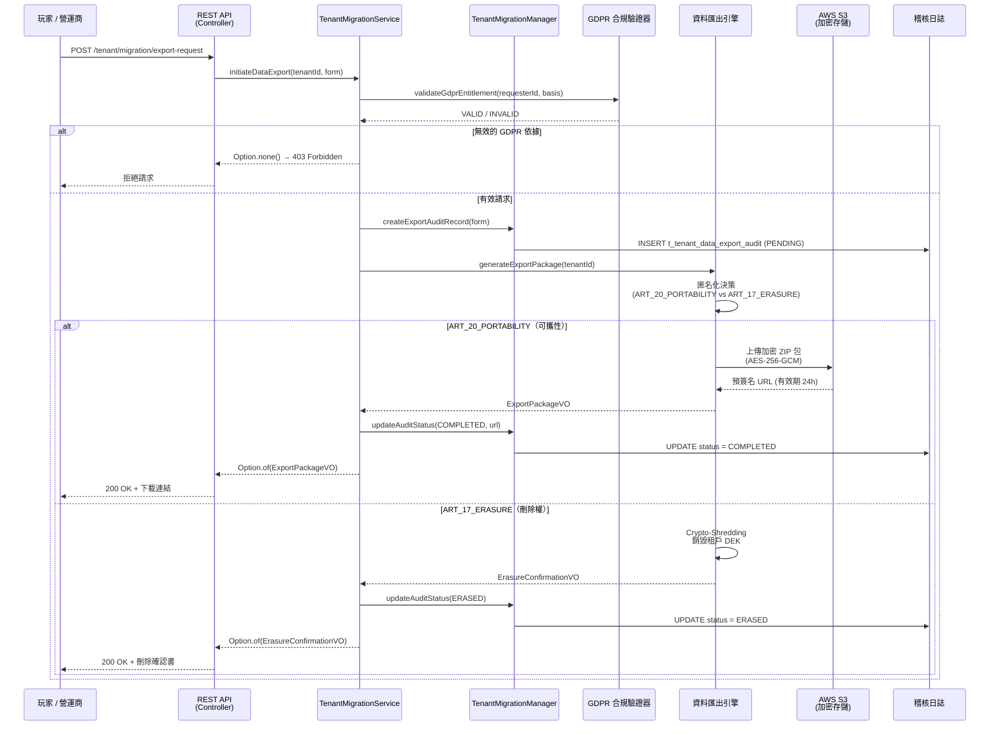
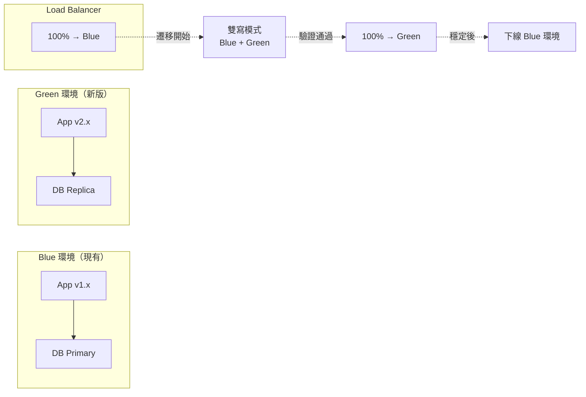

# 租戶遷移程序架構（Tenant Migration Procedures Architecture）

> **XREF（交叉引用）**: 業務需求詳見 [多租戶需求](../../requirements/06_Governance_Licensing/01_Multi_Tenant_Requirements.md)
> **目標讀者**: 系統架構師、DevOps 工程師、DPO（資料保護長）
> **最後更新**: 2026-04-02

---

## 1. 概述（Overview）

租戶遷移（Tenant Migration）涵蓋兩個核心場景：

1. **資料可攜性（Data Portability）**: 依據 GDPR Art. 20，玩家或營運商有權要求以結構化、可讀格式匯出其個人資料。
2. **租戶下線（Tenant Offboarding）**: 白標夥伴或次級代理終止合約時，需完成資料遷移、資料刪除（Crypto-Shredding）及稽核記錄。

本架構採用 Blue/Green 部署策略實現零停機時間（Zero-Downtime）遷移，並透過 Flyway 多租戶遷移模式管理資料庫 schema 版本，確保：

- **零資料遺失**: 遷移期間啟用雙寫（Dual-Write）模式
- **GDPR 合規**: 滿足 Art. 17（刪除權）與 Art. 20（可攜權）
- **MGA 合規**: 持牌人下線程序符合 MGA License Conditions
- **完整稽核軌跡**: 所有遷移操作記錄於不可篡改的稽核日誌

---

## 2. 資料可攜性流程（Data Portability Flow）



---

## 3. 資料庫 Schema（Flyway 多租戶遷移）

### 3.1 Flyway 多租戶遷移腳本

```sql
-- V2026.04.02__tenant_data_export_audit.sql
-- 用途：租戶資料匯出稽核記錄（GDPR Art. 20 / Art. 17 合規）

CREATE TABLE t_tenant_data_export_audit (
    id             BIGSERIAL     PRIMARY KEY,
    tenant_id      BIGINT        NOT NULL,
    request_type   VARCHAR(20)   NOT NULL,    -- PORTABILITY, ERASURE
    requested_by   BIGINT        NOT NULL,    -- 請求者 ID（玩家或管理員）
    gdpr_basis     VARCHAR(50)   NOT NULL,    -- ART_20_PORTABILITY, ART_17_ERASURE
    status         VARCHAR(20)   NOT NULL DEFAULT 'PENDING',
                                              -- PENDING, PROCESSING, COMPLETED, ERASED, FAILED
    export_s3_key  VARCHAR(500),              -- S3 物件鍵（僅 PORTABILITY 有值）
    completed_at   TIMESTAMP,
    failure_reason TEXT,
    deleted        SMALLINT      NOT NULL DEFAULT 0,
    create_time    TIMESTAMP     NOT NULL DEFAULT NOW(),
    update_time    TIMESTAMP     NOT NULL DEFAULT NOW()
);

COMMENT ON TABLE t_tenant_data_export_audit IS 'GDPR 資料匯出稽核記錄（Art.17/Art.20）';
COMMENT ON COLUMN t_tenant_data_export_audit.request_type IS '請求類型：PORTABILITY=可攜性, ERASURE=刪除';
COMMENT ON COLUMN t_tenant_data_export_audit.gdpr_basis IS 'GDPR 法律依據條文';
COMMENT ON COLUMN t_tenant_data_export_audit.status IS '處理狀態：PENDING/PROCESSING/COMPLETED/ERASED/FAILED';

CREATE INDEX idx_export_audit_tenant_id
    ON t_tenant_data_export_audit (tenant_id, create_time DESC);

CREATE INDEX idx_export_audit_status
    ON t_tenant_data_export_audit (status)
    WHERE deleted = 0 AND status IN ('PENDING', 'PROCESSING');
```

---

## 4. SmartAdmin 實作（Implementation）

### 4.1 Manager 層（含 @Transactional）

```java
@Component
@RequiredArgsConstructor
public class TenantMigrationManager {

    private final TenantDao tenantDao;
    private final TenantDataExportAuditDao auditDao;
    private final TenantOffboardingDao offboardingDao;

    /**
     * 初始化租戶下線流程。
     * GDPR Art. 20 資料可攜性 + Art. 17 刪除權。
     * @Transactional 確保下線記錄與稽核日誌的原子性寫入。
     */
    @Transactional(rollbackFor = Throwable.class)
    public Option<MigrationResultVO> initiateTenantOffboarding(
            Long tenantId, OffboardingForm form) {

        // 1. 建立下線追蹤記錄
        TenantOffboardingEntity offboarding = new TenantOffboardingEntity();
        offboarding.setTenantId(tenantId);
        offboarding.setOffboardingStatus("INITIATED");
        offboarding.setInitiatedBy(form.getInitiatedBy());
        offboardingDao.insert(offboarding);

        // 2. 建立 GDPR 稽核記錄
        TenantDataExportAuditEntity audit = new TenantDataExportAuditEntity();
        audit.setTenantId(tenantId);
        audit.setRequestType(form.getRequestType());
        audit.setRequestedBy(form.getInitiatedBy());
        audit.setGdprBasis(form.getGdprBasis());
        audit.setStatus("PENDING");
        auditDao.insert(audit);

        MigrationResultVO result = new MigrationResultVO();
        result.setOffboardingId(offboarding.getId());
        result.setAuditId(audit.getId());
        result.setStatus("INITIATED");

        return Option.of(result);
    }

}
```

### 4.2 Service 層（使用 io.vavr.control.Option）

```java
@Service
@RequiredArgsConstructor
public class TenantMigrationService {

    private final TenantMigrationManager tenantMigrationManager;
    private final TenantDataExportAuditDao auditDao;
    private final GdprComplianceValidator gdprValidator;

    /**
     * 發起資料匯出請求（委派 Manager 執行 @Transactional 操作）。
     * Service 使用 io.vavr.control.Option，NOT java.util.Optional。
     */
    public Option<MigrationResultVO> initiateDataExport(
            Long tenantId, DataExportForm form) {

        // GDPR 法律依據驗證
        if (!gdprValidator.isValidBasis(form.getGdprBasis())) {
            return Option.none();
        }

        return tenantMigrationManager.initiateTenantOffboarding(tenantId,
            OffboardingForm.fromExportForm(form));
    }

    /**
     * 查詢稽核記錄（單表查詢，Service 可直接呼叫 Dao）。
     */
    public Option<TenantDataExportAuditVO> getAuditRecord(Long auditId) {
        return Option.of(auditDao.selectById(auditId))
            .map(entity -> SmartBeanUtil.copy(entity, TenantDataExportAuditVO.class));
    }
}
```

---

## 5. 零停機時間遷移策略（Zero-Downtime Migration）

### 5.1 Blue/Green 部署步驟



### 5.2 遷移執行步驟清單

| 步驟 | 執行者 | 操作 | 驗收標準 |
|------|--------|------|---------|
| 1. 前置準備 | DevOps | 建立 Green 環境，執行 Flyway 遷移腳本 | 所有 migration 通過 |
| 2. 資料同步 | DBA | 啟動 pg_logical 邏輯複製 | 複製延遲 < 1s |
| 3. 流量切分 | DevOps | 負載均衡器：10% → Green | 錯誤率 < 0.1% |
| 4. 逐步切換 | DevOps | 10% → 50% → 100% → Green | 每階段觀察 15 分鐘 |
| 5. 資料驗證 | QA | 執行資料完整性校驗腳本 | Checksum 一致 |
| 6. 下線 Blue | DevOps | 停止 Blue 環境，終止複製 | Green 服務正常 |
| 7. 稽核記錄 | DPO | 記錄遷移完成，通知 MGA | 文件存檔 |

---

## 6. Crypto-Shredding（加密銷毀）

當租戶請求資料刪除（GDPR Art. 17）時，系統刪除 AWS KMS 中的租戶 DEK（Data Encryption Key），使所有 AES-256-GCM 加密資料即時不可讀（< 1 分鐘），並標記 `dek_destroyed = TRUE`。加密後的不可讀資料保留以滿足 MGA 5 年記錄要求，90 天後排程物理刪除。

> Crypto-Shredding 在技術上符合 GDPR Art. 17 刪除義務，因加密金鑰銷毀後資料實際不可恢復。

---

## 7. 合規要求（Compliance Requirements）

| 法規條文 | 核心要求 | 實作對應 |
|---------|---------|---------|
| GDPR Art. 20（可攜權） | 結構化格式匯出個人資料 | JSON + CSV 壓縮包；預簽名 URL 24h 有效；`t_tenant_data_export_audit` 完整記錄 |
| GDPR Art. 17（被遺忘權） | 合理期限內刪除個人資料 | Crypto-Shredding < 1 分鐘生效；30 天完成備份清除；自動生成刪除確認書 |
| MGA License Conditions（下線程序） | 玩家資金安全退還；保留 5 年交易記錄 | 下線前凍結帳戶確認退款；S3 加密歸檔 5 年保留；自動生成 MGA 通知文件 |

---

## 8. 相關文件（Related Documents）

| 文件 | 說明 |
|------|------|
| [資料庫故障恢復](24_Database_Failover_Recovery.md) | PostgreSQL HA 與故障轉移架構 |
| [租戶成本分配](25_Cost_Allocation_Per_Tenant.md) | 租戶級別成本追蹤 |
| [基礎設施實作](09_Infrastructure_Implementation.md) | Blue/Green K8s/Istio 部署配置 |
| [Token 安全架構](17_Token_Security_Architecture.md) | Multi-Actor Token 安全模型 |
