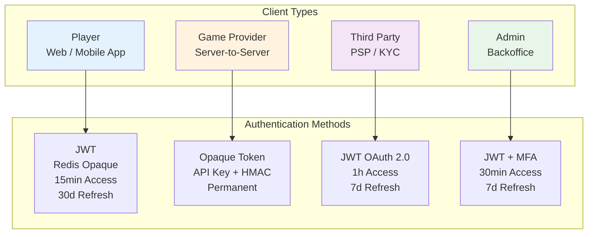

# 身份驗證與授權架構 (Authentication & Authorization Architecture)

**Document Metadata**:
- Version: 1.0.0
- Created: 2026-02-09
- Status: Active
- Priority: P0 (Critical)
- Owner: Security Team + Backend Team
- Source: [09-03-02 Authentication](../../source-archive/09_Technical_Infrastructure/09-03-02_Authentication.md)

---

## 1. JWT 認證架構

### 1.1 JWT 結構

```json
{
  "header": {
    "alg": "RS256",
    "typ": "JWT"
  },
  "payload": {
    "sub": "player:123456",
    "tenant_id": "tenant_1",
    "roles": ["player"],
    "iat": 1706342400,
    "exp": 1706346000
  }
}
```

### 1.2 Token 類型

| Token 類型 | 有效期 | 存儲位置 | 用途 | 刷新機制 |
|-----------|--------|---------|------|---------|
| **Access Token** | 15 分鐘 | LocalStorage | API 訪問 | 通過 Refresh Token |
| **Refresh Token** | 30 天 | Redis (HttpOnly) | 刷新 Access Token | Token Rotation |

### 1.3 核心安全特性

- **Token Rotation**: 刷新後舊 Refresh Token 立即失效
- **Device Fingerprint**: FingerprintJS 設備識別（99.5% 準確率）
- **Redis 高可用**: 主從 + Sentinel 架構

---

## 2. 多主體認證策略

### 2.1 策略總覽



| 主體類型 | Token 類型 | Access Token 有效期 | Refresh Token 有效期 | 主要安全措施 |
|---------|-----------|-------------------|---------------------|------------|
| **玩家** | JWT (Redis Opaque) | 15 分鐘 | 30 天 | Device Fingerprint + Token Rotation |
| **遊戲商** | Opaque Token (API Key) | 永久有效 | N/A | HMAC-SHA256 + IP 白名單 |
| **第三方** | JWT (OAuth 2.0) | 1 小時 | 7 天 | OAuth 2.0 + Webhook 簽名 |
| **後台用戶** | JWT (Redis Opaque) | 30 分鐘 | 7 天 | MFA (TOTP/SMS) + IP 限制 |

### 2.2 設計決策分析

**為何採用差異化策略（選項 B）而非統一 JWT（選項 A）**:

| 選項 | 優點 | 缺點 | 結論 |
|------|------|------|------|
| **A: 全部 JWT** | 統一實現，易維護 | 向 GP 暴露 Token 結構（安全風險） | 不推薦 |
| **B: 差異化策略** | 針對性安全設計，最佳性能 | 實現複雜度高 | 推薦 |
| **C: 全部 OAuth 2.0** | 業界標準 | GP server-to-server 過度設計 | 不推薦 |

**決策理由**:
- **玩家**: 前端需攜帶 user context -> JWT（自包含）
- **遊戲商**: S2S 通信，防 token 檢查攻擊 -> API Key + HMAC
- **第三方**: 外部集成標準 -> OAuth 2.0
- **後台用戶**: 高安全需求 -> JWT + MFA

---

## 3. RBAC 授權

### 3.1 權限檢查流程

```
1. 驗證 Token 有效性
2. 檢查租戶隔離 (tenant_id)
3. 檢查角色權限 (roles)
4. 檢查資源所有權 (player_id)
```

### 3.2 權限頭

```http
X-Permission-Required: player:update
X-Resource-Owner: player:123456
```

---

## 4. 限流策略

```
# 全局限流
100 req/min per IP

# 用戶限流
1000 req/min per Player

# 端點限流
POST /api/v1/withdrawals: 10 req/hour per Player
```

**限流響應頭**:

```http
X-RateLimit-Limit: 1000
X-RateLimit-Remaining: 999
X-RateLimit-Reset: 1706346000
Retry-After: 60
```

---

## 5. 冪等性設計

```http
POST /api/v1/transactions
X-Idempotency-Key: 550e8400-e29b-41d4-a716-446655440000
```

**實現流程**:

```
1. 檢查 Redis: GET idempotency:{key}
2. 如存在: 返回緩存響應
3. 如不存在: 執行請求 -> 緩存響應 (24 小時 TTL)
```

---

## 6. MFA 決策

### 6.1 為何後台用戶強制 MFA 而玩家可選

| 主體 | 權限範圍 | 風險等級 | MFA 要求 | 理由 |
|------|---------|---------|---------|------|
| **後台用戶** | 特權操作（提款批准、餘額調整） | 極高 | 強制 | 合規要求 + 高風險操作 |
| **玩家** | 自己的錢包和個人資料 | 中等 | 可選 | Device Fingerprint 已提供基礎防護 |

---

## 相關文檔

- [Multi Actor Token Security](./Multi_Actor_Token_Security.md) - 多主體 Token 安全方案
- [OAuth Refresh Token](./OAuth_Refresh_Token.md) - OAuth Refresh Token 實施
- [Token Validation Service](./Token_Validation_Service.md) - Token 驗證服務
- [API Design Principles](./API_Design_Principles.md) - API 設計原則
