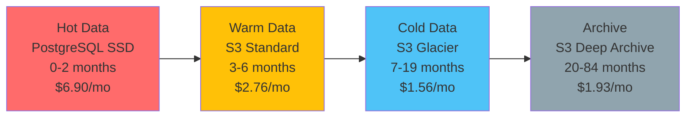
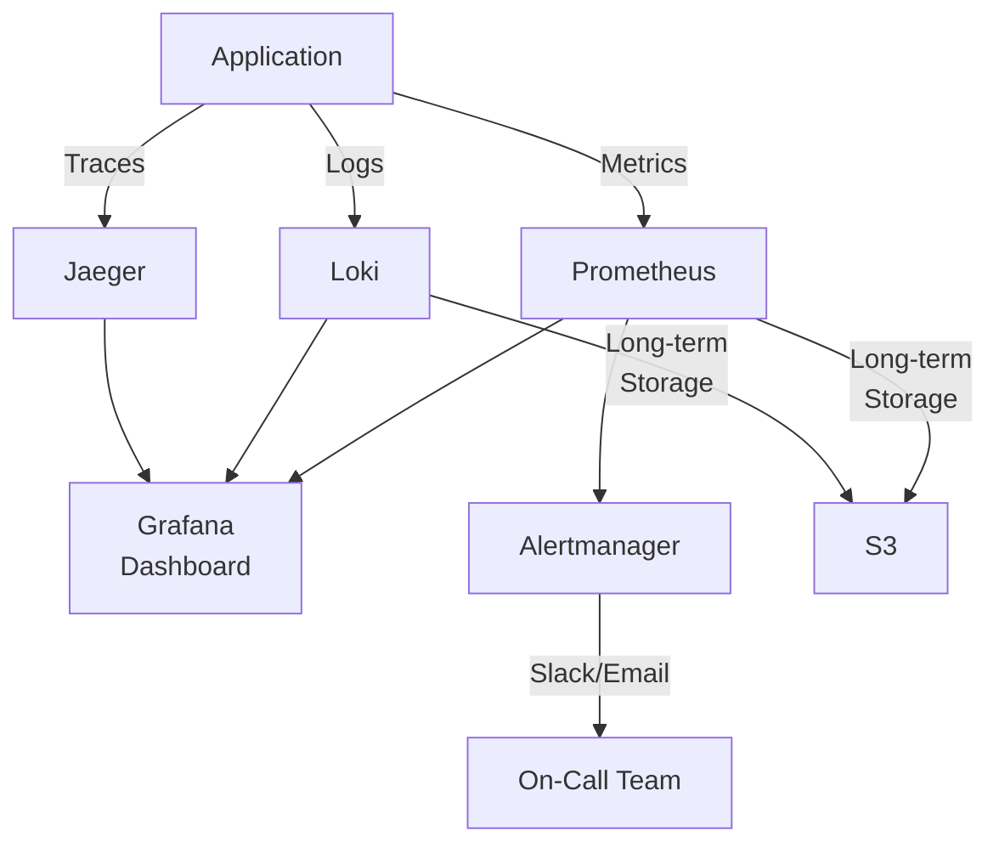

# 成本優化架構 (Cost Optimization Architecture)

> **Business Requirements**: [Cost Optimization Requirements](../../requirements/09_Infrastructure_Requirements/Cost_Optimization_Requirements.md)
> **Canonical Source**: [09-10 Cost Optimization](../../source-archive/09_Technical_Infrastructure/09-10_Cost_Optimization.md)
> **View**: Technical Architecture (Development & DevOps)

---

## 1. 成本優化總覽

| 項目 | 優化前 | 優化後 | 節省 | 節省率 |
|------|--------|--------|------|--------|
| 存儲成本 | $793.85 | $45.36 | $748.49 | -94% |
| 計算成本 | $0 | $552 | -$552 | N/A (新增) |
| 基礎設施 | $1,780.8 | $1,190.4 | $590.4 | -33% |
| 監控成本 | $245 | $0 | $245 | -100% |
| **月度總計** | **$2,819.65** | **$1,787.76** | **$1,031.89** | **-37%** |

**年度淨節省**: $12,383 | **ROI**: 87% (第一年) | **回收期**: 6.2 個月

---

## 2. 存儲成本優化 (-94%)

### 2.1 日誌分層存儲



| 數據層 | 查詢延遲 | 查詢成本 | 適用場景 |
|--------|---------|---------|---------|
| Hot (PostgreSQL) | < 50ms | 無額外成本 | 實時業務查詢 |
| Warm (S3 Standard) | 2-5s | $0.002/GB | 客服查詢 |
| Cold (S3 Glacier) | 1-5min | $0.03/GB | 運營分析 |
| Archive (Deep Archive) | 12h | $0.02/GB | 審計法務 |

### 2.2 Kafka 日誌保留優化

```properties
# server.properties
log.retention.hours=168  # 7 days (was 30 days)
log.segment.bytes=1073741824  # 1GB
log.retention.check.interval.ms=300000
log.cleanup.policy=delete
```

| 項目 | 優化前 | 優化後 | 節省 |
|------|--------|--------|------|
| 保留期 | 30 天 | 7 天 | - |
| 磁盤 | 500 GB | 120 GB | - |
| 成本 | $57.50/月 | $13.80/月 | -76% |

---

## 3. 計算成本 (Flink Cluster)

```yaml
# Resource Configuration
JobManager (2 replicas):
  Memory: 4GB x 2 = 8GB
  CPU: 2 cores x 2 = 4 cores
  Cost: c5.xlarge x 2 = $80/mo

TaskManager (4 replicas):
  Memory: 8GB x 4 = 32GB
  CPU: 4 cores x 4 = 16 cores
  Cost: c5.2xlarge x 4 = $472/mo

Total: $552/mo ($6,624/yr)
```

### 3.1 HPA 自動擴縮

```yaml
apiVersion: autoscaling/v2
kind: HorizontalPodAutoscaler
metadata:
  name: flink-taskmanager-hpa
spec:
  minReplicas: 4
  maxReplicas: 12
  metrics:
  - type: Resource
    resource:
      name: cpu
      target:
        type: Utilization
        averageUtilization: 70
  behavior:
    scaleUp:
      stabilizationWindowSeconds: 300
    scaleDown:
      stabilizationWindowSeconds: 600
```

---

## 4. 基礎設施優化 (-33%)

### 4.1 RDS 實例降級

| 項目 | 優化前 | 優化後 | 節省 |
|------|--------|--------|------|
| 規格 | db.r5.4xlarge | db.r5.2xlarge | -50% |
| CPU | 16 vCPU | 8 vCPU | - |
| RAM | 128 GB | 64 GB | - |
| 成本 | $1,200/月 | $600/月 | $600/月 |

**優化原理**: Flink SQL 分流 OLAP 查詢，PostgreSQL 僅處理 OLTP

### 4.2 Redis 實例降級

| 項目 | 優化前 | 優化後 | 節省 |
|------|--------|--------|------|
| 規格 | r5.2xlarge x 6 | r5.xlarge x 6 | -50% |
| 成本 | $580.8/月 | $290.4/月 | $290.4/月 |

**優化原理**: Caffeine L1 緩存命中率 95%，Redis QPS 降低 90%

---

## 5. 監控成本優化 (-100%)

### 5.1 遷移至開源方案



**技術棧**:

| 組件 | 版本 | 用途 |
|------|------|------|
| Prometheus | 2.48 | 指標監控 |
| Grafana | 10.2 | 可視化 |
| Loki | 2.9 | 日誌管理 |
| Jaeger | 1.52 | 鏈路追蹤 |
| Alertmanager | 0.26 | 告警管理 |

### 5.2 Prometheus 配置

```yaml
global:
  scrape_interval: 15s
  evaluation_interval: 15s

scrape_configs:
  - job_name: 'flink'
    static_configs:
      - targets: ['flink-jobmanager:9250', 'flink-taskmanager:9250']
  - job_name: 'redis'
    static_configs:
      - targets: ['redis-exporter:9121']
  - job_name: 'postgres'
    static_configs:
      - targets: ['postgres-exporter:9187']

remote_write:
  - url: https://s3.amazonaws.com/prometheus-storage
```

---

## 6. 成本監控與告警

### 6.1 AWS Budgets

```yaml
Budget:
  Name: igaming-monthly-budget
  BudgetType: COST
  TimeUnit: MONTHLY
  BudgetLimit:
    Amount: 2000
    Unit: USD
  NotificationsWithSubscribers:
    - Notification:
        NotificationType: ACTUAL
        ComparisonOperator: GREATER_THAN
        Threshold: 90
      Subscribers:
        - SubscriptionType: EMAIL
          Address: devops@company.com
```

### 6.2 Kubecost

```yaml
kubecostToken: "your-token"
prometheus:
  enabled: true
grafana:
  enabled: true
  ingress:
    hosts:
      - kubecost.company.com
```

---

## 7. 實施路線圖

| Phase | 時程 | 內容 | 預期節省 |
|-------|------|------|---------|
| **Phase 1** | Week 1-2 | Kafka 保留策略 + S3 Lifecycle + Redis 降級 | $1,126/月 |
| **Phase 2** | Week 3-6 | Flink Cluster + JetCache + RDS 降級 | -$48/月 |
| **Phase 3** | Week 7-8 | Prometheus + Grafana + Datadog 下線 | $245/月 |

---

## 相關文檔

- [Performance Optimization](./Performance_Optimization.md) - 性能優化
- [Stream Processing Architecture](./Stream_Processing_Architecture.md) - Flink 流處理
- [Caching Strategy](./Caching_Strategy.md) - 緩存策略
- [Performance Monitoring](./Performance_Monitoring.md) - 監控告警
