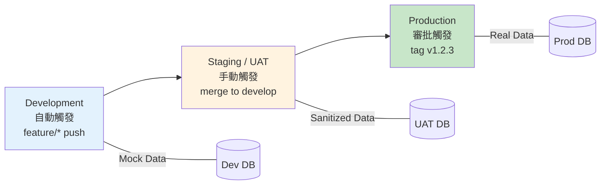
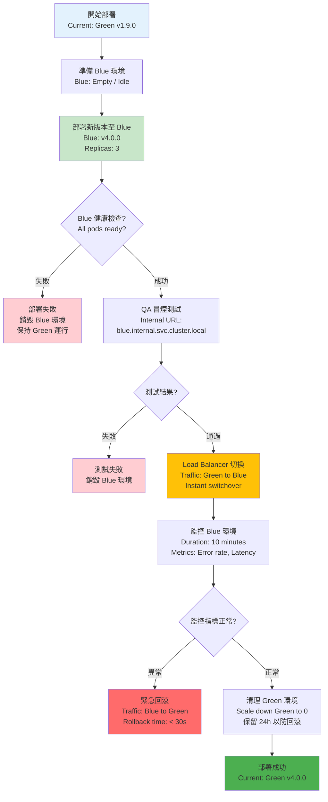
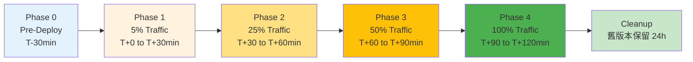
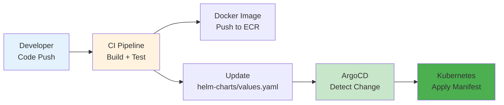

# 部署架構與 DevOps 規範

**Document Metadata**:
- Version: 1.0.0
- Created: 2026-02-09
- Status: Active
- Priority: P0 (Critical)
- Owner: DevOps Team + SRE Team
- Source: [09-01 Deployment](../../source-archive/09_Technical_Infrastructure/09-01_Deployment.md)

---

## 1. 架構概覽

### 1.1 設計目標

| 目標 | 指標 |
|------|------|
| **高可用** | 99.99% SLA |
| **零停機部署** | 藍綠/金絲雀部署 |
| **快速回滾** | < 30 秒 |
| **基礎設施即代碼** | Immutable Infrastructure |

### 1.2 環境策略



| 環境 | 用途 | 部署觸發 | 資料來源 |
|------|------|---------|---------|
| **DEV** | 開發自測、聯調 | Commit push to `feature/*` | Mock Data |
| **UAT** | QA 驗收、營運預覽 | Merge to `develop` | 脫敏生產資料 |
| **PROD** | 真實玩家流量 | Tag `v1.2.3` + 審批 | 真實資料 |

---

## 2. 藍綠部署 (Blue-Green Deployment)

**適用場景**: 所有無狀態服務（API Gateway, Game Service 等）

### 2.1 部署流程



### 2.2 優勢與限制

| 面向 | 說明 |
|------|------|
| 零停機 | 流量瞬間切換，無服務中斷 |
| 快速回滾 | < 30 秒回滾至舊版本 |
| 完整測試 | Blue 環境可充分驗證 |
| 資源成本 | 需要 2 倍資源（Green + Blue 同時運行） |

---

## 3. 金絲雀發布 (Canary Release)

**適用場景**: 核心高風險服務（Wallet Service, Payment Gateway, Risk Engine）

### 3.1 漸進式流量切換



### 3.2 Kubernetes Canary Deployment

```yaml
# Kubernetes Deployment (Canary)
apiVersion: apps/v1
kind: Deployment
metadata:
  name: wallet-service-canary
  namespace: igaming-prod
  labels:
    app: wallet-service
    version: v1.10.0
    track: canary
spec:
  replicas: 1
  selector:
    matchLabels:
      app: wallet-service
      version: v1.10.0
  template:
    metadata:
      labels:
        app: wallet-service
        version: v1.10.0
        track: canary
    spec:
      containers:
      - name: wallet-service
        image: ecr.example.com/wallet-service:v1.10.0
        resources:
          requests:
            cpu: 2
            memory: 4Gi
          limits:
            cpu: 4
            memory: 8Gi
        livenessProbe:
          httpGet:
            path: /health/live
            port: 8080
          initialDelaySeconds: 30
          periodSeconds: 10
          failureThreshold: 3
        readinessProbe:
          httpGet:
            path: /health/ready
            port: 8080
          initialDelaySeconds: 15
          periodSeconds: 5
          successThreshold: 2
```

### 3.3 Istio 流量切分

```yaml
# Istio VirtualService (Traffic Split)
apiVersion: networking.istio.io/v1beta1
kind: VirtualService
metadata:
  name: wallet-service
spec:
  hosts:
  - wallet-service
  http:
  - match:
    - headers:
        canary:
          exact: "true"
    route:
    - destination:
        host: wallet-service
        subset: canary
      weight: 100
  - route:
    - destination:
        host: wallet-service
        subset: stable
      weight: 95
    - destination:
        host: wallet-service
        subset: canary
      weight: 5
```

### 3.4 監控指標與回滾閾值

| 指標 | Baseline (Stable) | Canary Target | Alert Threshold (回滾) |
|------|-------------------|---------------|----------------------|
| Error Rate | 0.1% | < 0.2% | > 0.5% |
| Latency P99 | 200ms | < 400ms | > 600ms |
| HTTP 5xx/min | 10 | < 20 | > 50 |
| Memory Usage | 60% | < 75% | > 90% |
| Pod Restart Count | 0 | 0 | > 3 |

### 3.5 自動回滾觸發條件

| 觸發器 | 條件 | 回滾動作 |
|--------|------|---------|
| Error Rate Spike | error_rate > baseline * 5 | 立即回滾至 stable |
| Latency Degradation | latency_p99 > baseline * 2 | 立即回滾至 stable |
| HTTP 5xx Surge | 5xx_count > 50/min | 立即回滾至 stable |
| Memory Leak | memory_usage > 90% for 5 min | 回滾 + 重啟 pods |
| Pod Crash Loop | restart_count > 3 in 10 min | 回滾 + 調查 |

---

## 4. Kubernetes 標準

### 4.1 Namespace 隔離

| Namespace | 環境 | 用途 |
|-----------|------|------|
| `igaming-dev` | Development | 開發測試 |
| `igaming-uat` | Staging | QA 驗收 |
| `igaming-prod` | Production | 生產服務 |

### 4.2 資源限制

每個 Pod 必須設定 `requests` 與 `limits`：

```yaml
resources:
  requests:
    cpu: 2
    memory: 4Gi
  limits:
    cpu: 4
    memory: 8Gi
```

### 4.3 健康檢查

| 探針 | 路徑 | 用途 |
|------|------|------|
| **Liveness Probe** | `/health/live` | 偵測死鎖或崩潰，K8s 自動重啟 |
| **Readiness Probe** | `/health/ready` | 確認應用已準備好接收流量 |
| **Startup Probe** | `/health/startup` | 給予慢啟動應用更長的啟動時間 |

---

## 5. GitOps 流程 (ArgoCD)



### 5.1 流程步驟

1. CI Build Docker Image -> Push to ECR
2. CI Update `helm-charts/values.yaml`（image tag change）
3. ArgoCD 偵測變更 -> 自動同步至 Kubernetes

---

## 6. Feature Flag 整合

除了流量切換，還可搭配 Feature Flag 進行更細粒度控制：

```javascript
// Using LaunchDarkly
const featureFlag = ldClient.variation('new-wallet-algorithm', user, false);

if (featureFlag) {
  processWithNewAlgorithm();  // canary feature
} else {
  processWithOldAlgorithm();  // stable
}
```

**好處**:
- 即使 100% 流量在新版本，仍可透過 Feature Flag 瞬間切回舊邏輯
- 可針對特定用戶群組（如 VIP）先啟用新功能
- 不需重新部署即可開關功能

---

## 7. 系統引導與種子資料

### 7.1 初始管理員 (Seed Admin)

系統首次部署後需透過 K8s Job 注入初始資料：
- 檢查 `admin_users` 表是否為空
- 若為空，創建 Super Admin 帳號（冪等操作）
- 環境變數由 K8s Secrets 管理

### 7.2 基礎配置載入

- 字典表：ISO 貨幣代碼、國家代碼、語言列表
- 預設商戶：`default_tenant`（ID: 1001）
- 遊戲配置：`GameDiscoveryJob` 首次全量同步

---

## 相關文檔

- [Gateway Core Architecture](./Gateway_Core.md) - API Gateway 架構
- [Performance Monitoring](./Performance_Monitoring.md) - APM 監控
- [Maintenance Architecture](./Maintenance_Architecture.md) - 維護程序
