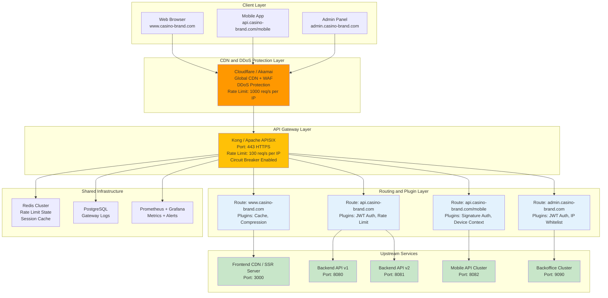

# 網關核心架構 (Gateway Core Architecture)

> **Canonical Source**: [09-02-01 Gateway Core](../../source-archive/09_Technical_Infrastructure/09-02-01_Gateway_Core.md)
> **View**: Technical Architecture (Development & DevOps)

---

## 1. 架構概覽

API Gateway 是所有外部流量進入平台的唯一入口，基於 **Apache APISIX** 或 **Kong** 構建。

### 1.1 統一接入架構



### 1.2 架構層級說明

| 層級 | 組件 | 職責 | 技術棧 | 性能指標 |
|------|------|------|--------|----------|
| **CDN & DDoS** | Cloudflare / Akamai | 全球加速、DDoS 防護、WAF | Cloudflare Pro | P99 < 50ms |
| **API Gateway** | Kong / APISIX | 路由分發、認證授權、限流熔斷 | Kong 3.x / APISIX 3.x | P99 < 100ms |
| **Routing** | Route + Plugins | 根據 Host/Path 路由 + 插件鏈 | Lua plugins | < 5ms |
| **Upstream** | Backend API Clusters | 業務邏輯處理 | Spring Boot 3.x | P99 < 500ms |
| **Shared Infra** | Redis, PostgreSQL | 共享基礎設施 | Redis 7.x, PG 16.x | Redis P99 < 10ms |

---

## 2. 路由配置

### 2.1 Web Frontend Route

```yaml
routes:
  - name: frontend-route
    hosts:
      - www.casino-brand.com
    paths:
      - /
    strip_path: false
    plugins:
      - name: proxy-cache
        config:
          cache_ttl: 300  # 5 minutes
      - name: response-transformer
        config:
          add:
            headers:
              - "X-Cache-Status: HIT"
      - name: gzip
        config:
          min_length: 1000
```

### 2.2 Public API Route

```yaml
routes:
  - name: api-route
    hosts:
      - api.casino-brand.com
    paths:
      - /v1/*
      - /v2/*
    strip_path: false
    plugins:
      - name: jwt
        config:
          secret_is_base64: false
      - name: rate-limiting
        config:
          minute: 100
          policy: redis
      - name: request-id
        config:
          header_name: X-Request-ID
```

### 2.3 Mobile API Route

```yaml
routes:
  - name: mobile-route
    hosts:
      - api.casino-brand.com
    paths:
      - /mobile/v1/*
    strip_path: true
    plugins:
      - name: signature-auth  # Custom plugin
        config:
          app_secret: ${APP_SECRET}
          timestamp_tolerance: 300  # 5 minutes
          nonce_ttl: 300
      - name: device-context  # Custom plugin
        config:
          extract_headers:
            - X-Device-ID
            - X-Model
            - X-OS
      - name: rate-limiting
        config:
          minute: 50  # Stricter for mobile
```

### 2.4 Admin Backoffice Route

```yaml
routes:
  - name: admin-route
    hosts:
      - admin.casino-brand.com
    paths:
      - /api/*
    strip_path: false
    plugins:
      - name: ip-restriction
        config:
          allow:
            - 192.168.1.0/24  # Office IP
            - 10.0.0.0/16     # VPN IP
      - name: jwt
        config:
          claims_to_verify:
            - role: admin
      - name: request-termination
        config:
          status_code: 403
          message: "Access Denied - Admin only"
```

---

## 3. 行動端專屬路由

### 3.1 App 簽名規範

所有來自 App 的請求必須包含以下 Header：

| Header | 說明 | 範例 |
|--------|------|------|
| `X-App-Version` | App 版本 | `1.0.0` |
| `X-Timestamp` | 請求時間戳 | `1716382910` |
| `X-Nonce` | UUID 防重放 | `550e8400-...` |
| `X-Signature` | HMAC-SHA256 簽名 | `base64(...)` |

### 3.2 Gateway 驗證邏輯

```
1. 檢查 Timestamp 是否在有效期內 (+/- 5 分鐘)
2. 檢查 Nonce 是否已在 Redis 中出現過 (TTL 5min)
3. 使用 AppSecret 重新計算 HMAC-SHA256(Path + Body + Timestamp + Nonce)
4. 比對簽名 → 失敗返回 401 Unauthorized
```

**簽名計算**: `HMAC-SHA256(Path + Body + Timestamp + Nonce, AppSecret)`

---

## 4. 流量分發流程

```
Request arrives at Cloudflare
  |
1. DDoS Protection + WAF Check
  |
2. DNS Resolution -> Kong Gateway (origin)
  |
3. Kong matches Host + Path:
   - www.casino-brand.com       -> R1 -> CDN/SSR
   - api.casino-brand.com/v1/*  -> R2 -> API v1 Cluster
   - api.casino-brand.com/mobile/* -> R3 -> Mobile API Cluster
   - admin.casino-brand.com     -> R4 -> Backoffice (IP check)
  |
4. Apply Plugin Chain:
   - Authentication (JWT / Signature)
   - Rate Limiting (Redis)
   - Circuit Breaker (if upstream unhealthy)
  |
5. Forward to Upstream Service
  |
6. Response Transformation + Cache
  |
7. Return to Client
```

---

## 相關文檔

- [Gateway Rate Limiting](./Gateway_Rate_Limiting.md) - 流量控制與限流
- [Gateway Security](./Gateway_Security.md) - DDoS 防禦與安全
- [Authentication Architecture](./Authentication_Architecture.md) - 認證授權
