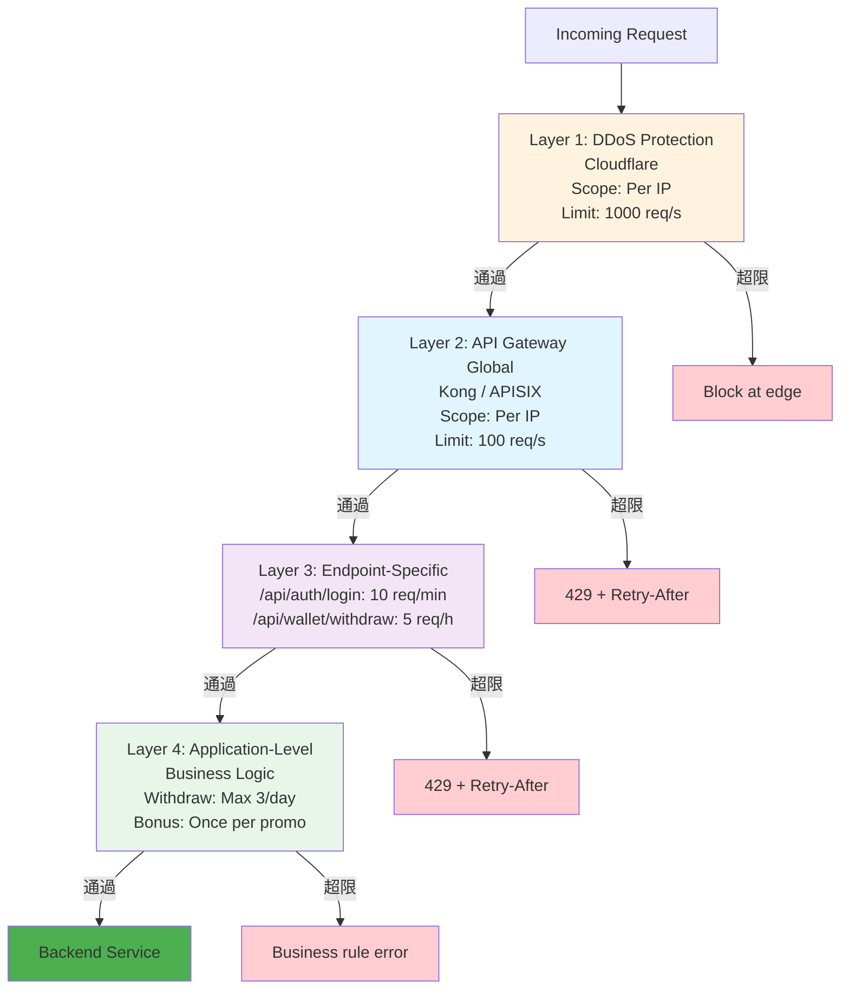
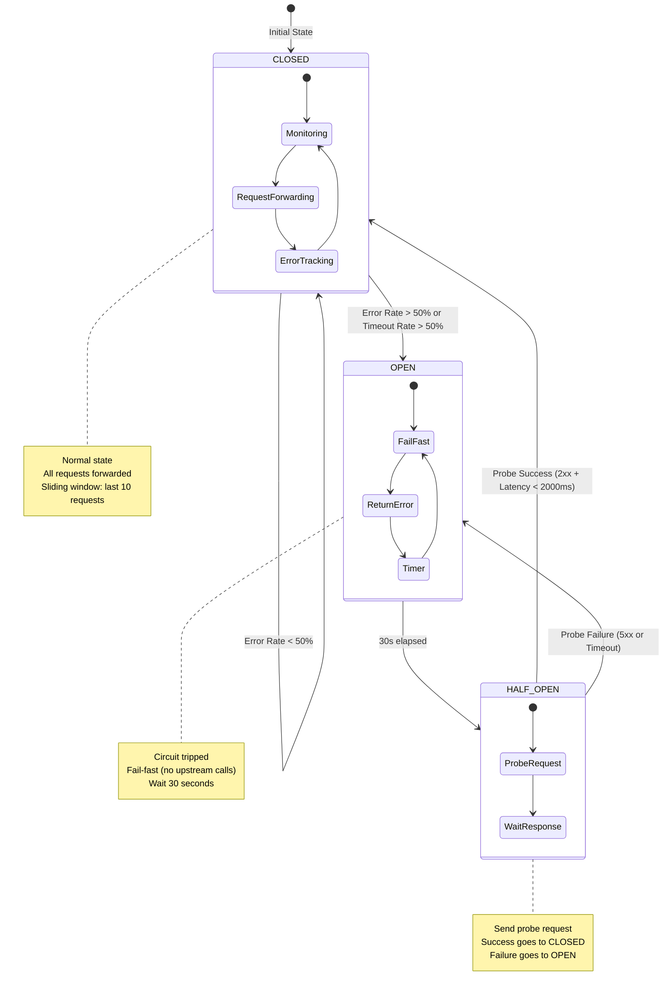

# 流量控制與限流架構 (Rate Limiting & Traffic Control)

> **Canonical Source**: [09-02-02 Rate Limiting](../../source-archive/09_Technical_Infrastructure/09-02-02_Rate_Limiting.md)
> **View**: Technical Architecture (Development & DevOps)

---

## 1. 限流概覽

### 1.1 基礎限流策略

| 規則 | 限制 | 處置 |
|------|------|------|
| **全域頻控** | 單 IP 每秒最多 50 次請求 | HTTP 429 |
| `/api/auth/login` | 單 IP 每分鐘 5 次 | HTTP 429 |
| `/api/wallet/withdraw` | 單 User 每小時 3 次 | HTTP 429 |

### 1.2 熔斷策略

當上游服務（如 Game Provider A）響應時間 > 2 秒或錯誤率 > 10%：
- Gateway 自動「跳閘」（Open Circuit）
- 30 秒內的請求直接返回「維護中」，防止雪崩效應

---

## 2. 限流演算法

### 2.1 演算法選擇矩陣

| 演算法 | 適用場景 | 優點 | 缺點 | 推薦用途 |
|--------|---------|------|------|---------|
| **Token Bucket** | API Gateway 全域限流 | 允許突發流量 (burst) | 實作複雜 | `/api/*` 所有公開 API |
| **Leaky Bucket** | 穩定速率限制 | 絕對恆定速率 | 無法應對合法突發 | `/api/auth/login` 防暴力破解 |
| **Fixed Window** | 簡單統計 | 實作簡單 | 邊界問題 | 非關鍵 API |
| **Sliding Window Log** | 精確限流 | 完全精確 | 記憶體開銷大 | 高價值 API（如支付） |
| **Sliding Window Counter** | 效能平衡 | 精確且高效 | 中等複雜度 | 預設策略 |

### 2.2 Token Bucket 實作 (Redis Lua Script)

```lua
-- KEYS[1]: Rate limit key (e.g., "rate_limit:user:12345")
-- ARGV[1]: Max tokens (capacity)
-- ARGV[2]: Refill rate (tokens per second)
-- ARGV[3]: Current timestamp

local key = KEYS[1]
local capacity = tonumber(ARGV[1])
local refill_rate = tonumber(ARGV[2])
local now = tonumber(ARGV[3])

-- Get current state
local state = redis.call('HMGET', key, 'tokens', 'last_refill')
local tokens = tonumber(state[1]) or capacity
local last_refill = tonumber(state[2]) or now

-- Calculate tokens to add since last refill
local time_passed = math.max(0, now - last_refill)
local tokens_to_add = time_passed * refill_rate
tokens = math.min(capacity, tokens + tokens_to_add)

-- Try to consume 1 token
if tokens >= 1 then
  tokens = tokens - 1
  redis.call('HMSET', key, 'tokens', tokens, 'last_refill', now)
  redis.call('EXPIRE', key, 3600)  -- TTL 1 hour
  return {1, tokens}  -- Allow, remaining tokens
else
  return {0, 0}  -- Deny
end
```

### 2.3 Kong 限流插件配置

```yaml
plugins:
  - name: rate-limiting
    config:
      minute: 100  # Max 100 requests per minute
      policy: redis
      redis_host: redis-cluster.internal
      redis_port: 6379
      redis_database: 2
      fault_tolerant: true  # If Redis down, allow traffic (fail-open)
      hide_client_headers: false  # Expose X-RateLimit-* headers
```

---

## 3. 分層限流策略 (Tiered Rate Limiting)



| Layer | Scope | Limit | Action |
|-------|-------|-------|--------|
| **L1: DDoS Protection** | Per IP | 1000 req/s | Block at edge |
| **L2: Gateway Global** | Per IP | 100 req/s | 429 + Retry-After |
| **L3: Endpoint-Specific** | Per IP/User | Varies | 429 + Retry-After |
| **L4: Application** | Per User | Business rules | Business error |

---

## 4. 熔斷器架構 (Circuit Breaker)

### 4.1 狀態機



### 4.2 狀態轉換說明

| 狀態 | 請求處理 | 轉換條件 |
|------|---------|---------|
| **CLOSED** | 所有請求轉發至上游 | Error Rate > 50% (last 10 requests) |
| **OPEN** | 立即返回 503，不調用上游 | 30 秒後進入 HALF_OPEN |
| **HALF_OPEN** | 允許 1 個探測請求通過 | 成功 -> CLOSED, 失敗 -> OPEN |

### 4.3 Kong Circuit Breaker 配置

```yaml
plugins:
  - name: circuit-breaker
    config:
      threshold: 10                # Min requests before evaluation
      window_size: 10              # Rolling window (last 10 requests)
      failure_threshold_percentage: 50  # Open if >50% fail
      timeout: 5000                # Timeout threshold (5 seconds)
      half_open_timeout: 30000     # Wait 30s before half-open
      break_on:
        - 500
        - 502
        - 503
        - 504
        - timeout
      fallback:
        status_code: 503
        content_type: application/json
        body: '{"error": "Service temporarily unavailable", "retry_after": 30}'
```

### 4.4 監控指標

```
# Prometheus Metrics
circuit_breaker_state{service="payment-gateway"} = 1  # 0=CLOSED, 1=OPEN, 2=HALF_OPEN
circuit_breaker_requests_total{service="payment-gateway", result="success"} = 1234
circuit_breaker_requests_total{service="payment-gateway", result="failure"} = 567
circuit_breaker_trips_total{service="payment-gateway"} = 3

# Alert Rules
- alert: CircuitBreakerOpen
  expr: circuit_breaker_state == 1
  for: 5m
  labels:
    severity: critical
  annotations:
    summary: "Circuit breaker open for {{ $labels.service }}"
```

---

## 相關文檔

- [Gateway Core](./Gateway_Core.md) - 網關核心架構
- [Gateway Security](./Gateway_Security.md) - DDoS 防禦與安全
- [Performance Monitoring](./Performance_Monitoring.md) - 監控告警
