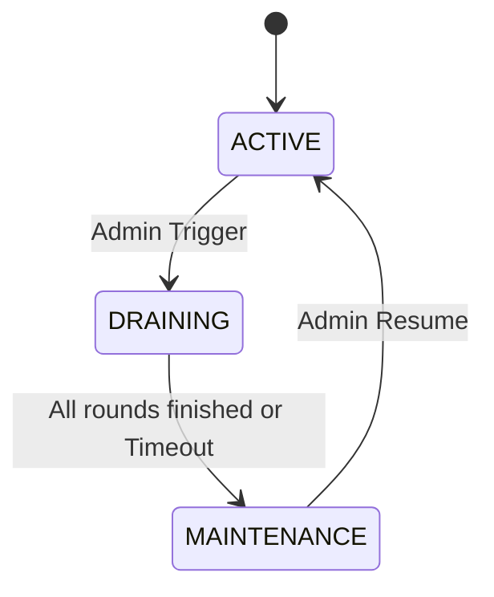
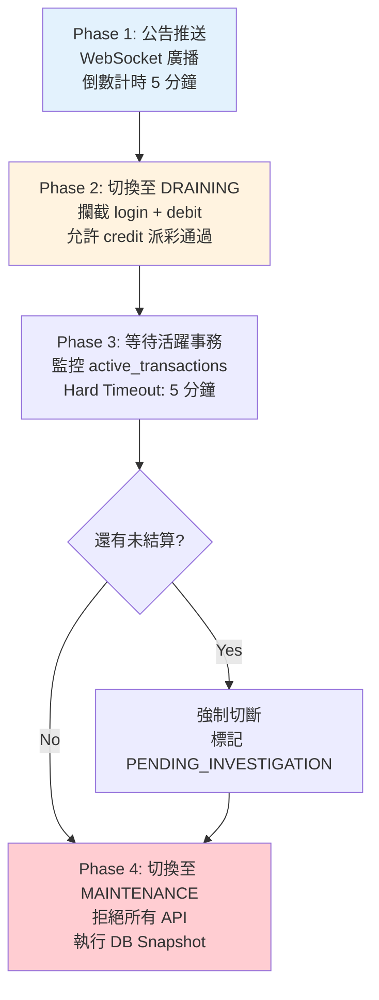

# 系統維護與優雅停機架構（Maintenance & Graceful Shutdown）

> **業務需求**: 不適用 — 純技術基礎設施文件
> **規範來源**: [09-05 Maintenance](../../source-archive/09_Technical_Infrastructure/09-05_Maintenance.md)
> **目標讀者**: Technical Architects, DevOps Engineers, SRE

---

## 1. 維護模式狀態機

平台全域狀態存儲於 Redis (`platform:status`)：



| 狀態 | 描述 | 允許的操作 | 拒絕的操作 |
|------|------|----------|----------|
| **ACTIVE** | 正常運作 | 所有操作 | 無 |
| **DRAINING** | 排水階段 | 登出、結算 (Credit) | 新登入、新下注、存款 |
| **MAINTENANCE** | 完全停機 | Admin 白名單 | 所有外部 API (503) |

---

## 2. 優雅停機流程 (Draining Process)

### 2.1 步驟詳解



1. **公告推送**: WebSocket 廣播 `MAINTENANCE_WARN`，前端顯示倒數
2. **切換 DRAINING**: Gateway 攔截 `/api/auth/login` 和 `/api/wallet/debit`，允許 `/api/wallet/credit`
3. **等待活躍事務**: 監控 `active_transactions`，設 5 分鐘硬性超時
4. **切換 MAINTENANCE**: 拒絕所有外部 API，執行 DB Snapshot

### 2.2 遊戲商協調

- **Kickout**: 調用 GP `KickoutPlayer` API 強制玩家下線
- **Webhook**: 通知 GP 平台進入維護，暫停新注單

---

## 3. 完整維護時間軸

### Phase 1: 公告階段 (T-24h)

| 通知渠道 | 對象 |
|---------|------|
| 站內公告 Banner | 所有用戶 |
| Email | 最近 7 天活躍玩家 |
| Push Notification | App 用戶 |
| SMS | VIP 玩家 |

### Phase 2: 排水階段 (T-30min -> T-5min)

```
[Monitoring Dashboard]
Active Players: 12,345 -> 8,432 -> 3,211 -> 856
Active Game Rounds: 2,134 -> 1,023 -> 421 -> 89
Pending Withdrawals: 45 -> 23 -> 12 -> 3
API Request Rate: 5000 QPS -> 3000 -> 1000
```

### Phase 3: 強制結算 (T-5min -> T+0)

| 遊戲類型 | 處理方式 |
|---------|---------|
| **老虎機** | 強制結算: 已 Spin 的回合立即派彩 |
| **真人荷官** | 延遲維護: 等當前局結束 (最多 +10 min) |
| **體育博彩** | 保留未結算注單: 等賽事結果 |
| **撲克** | 自動 Fold 退還籌碼 |

### Phase 4: 維護作業 (T+0 -> T+120min)

```bash
# 1. Database Migration (dry-run first)
./migrate.sh --dry-run --env=production
./migrate.sh --execute --env=production --backup-before

# 2. Code Deployment
kubectl set image deployment/api-server api=api:v2.5.0
kubectl rollout status deployment/api-server --timeout=15m

# 3. If rollout fails, auto-rollback
kubectl rollout undo deployment/api-server
```

### Phase 5: 驗證與恢復 (T+120min -> T+135min)

**Post-Maintenance Checklist**:
- Database Integrity Check
- Service Health Check (`GET /health`)
- Core Function Smoke Test (Login, Deposit, Bet, Withdraw)
- Game Provider Integration Check
- Payment Gateway Check
- Monitoring & Alerting Check

---

## 4. 緊急維護 (Emergency Stop)

**觸發場景**: 資金漏洞或駭客攻擊

```bash
#!/bin/bash
# emergency_stop.sh
iptables -A INPUT -p tcp --dport 443 -j DROP  # 封鎖外部流量
# 暫停所有 Cron Jobs
# 通知值班人員 (PagerDuty)
```

**後果**: 部分注單狀態可能不一致，需事後對帳補償

---

## 5. 跨模組協調

| 服務 | DRAINING 行為 | MAINTENANCE 行為 |
|------|-------------|-----------------|
| **Player** | 禁止新註冊, 允許登出 | 所有 API 返回 503 |
| **Finance** | 禁止新存款, 允許提款完成 | 凍結所有錢包操作 |
| **Wallet** | 禁止 Debit, 允許 Credit | 鎖定所有餘額變更 |
| **Game** | 呼叫 GP kickoutPlayer | 顯示維護頁面 |
| **Activity** | 禁止領取新紅利 | 暫停所有活動 |
| **Risk** | 繼續風控檢查 | 保持監控運行 |

### 5.1 Event Bus 通知

```json
{
  "topic": "system.maintenance",
  "events": [
    {"event_type": "MAINTENANCE_SCHEDULED", "scheduled_time": "2026-01-28T02:00:00Z"},
    {"event_type": "MAINTENANCE_DRAINING_START"},
    {"event_type": "MAINTENANCE_ACTIVE"},
    {"event_type": "MAINTENANCE_COMPLETED"}
  ]
}
```

---

## 6. 維護窗口排程

| 市場 | 最佳維護時段 (Local) | UTC 時間 |
|------|-------------------|---------|
| 台灣/香港 | 03:00 - 05:00 | 19:00 - 21:00 |
| 東南亞 | 02:00 - 04:00 | 19:00 - 21:00 |
| 巴西 | 04:00 - 06:00 | 07:00 - 09:00 |
| 歐洲 | 03:00 - 05:00 | 02:00 - 04:00 |

**跨區域平台建議**: UTC 02:00 - 04:00

---

## 7. 回滾程序

### 7.1 觸發條件

| 場景 | 嚴重程度 | 動作 |
|------|---------|------|
| 驗證測試失敗 > 3 項 | Critical | 立即回滾 |
| Error rate > 10% (恢復後 5 min) | Critical | 立即回滾 |
| DB migration 失敗 | Critical | 恢復備份 |
| 核心功能失敗 | Critical | 立即回滾 |

### 7.2 回滾腳本

```bash
#!/bin/bash
# rollback_maintenance.sh

# 1. Restore database snapshot
pg_restore --clean --dbname=production pre_maintenance.dump

# 2. Rollback K8s deployment
kubectl rollout undo deployment/api-server

# 3. Restore Redis state
redis-cli SET platform:status "ACTIVE"

# 4. Verify
curl -f https://api.casino.com/health || exit 1
```

---

## 8. 監控告警

```yaml
groups:
  - name: maintenance_alerts
    rules:
      - alert: MaintenanceOvertime
        expr: (time() - platform_maintenance_start_time) > 9000  # 150 min
        labels:
          severity: critical
        annotations:
          summary: "Maintenance exceeding planned duration"

      - alert: HighErrorRatePostMaintenance
        expr: rate(http_requests_total{status=~"5.."}[5m]) > 0.05
        for: 5m
        labels:
          severity: warning
```

---

## 9. Java 實作

### 9.1 MaintenanceService (Service Layer)

```java
package net.lab1024.sa.infrastructure.maintenance;

import io.vavr.control.Option;
import io.vavr.control.Try;
import lombok.RequiredArgsConstructor;
import lombok.extern.slf4j.Slf4j;
import net.lab1024.sa.common.core.domain.response.ResponseDTO;
import org.springframework.stereotype.Service;

import java.time.LocalDateTime;

/**
 * 系統維護服務
 *
 * @author SmartAdmin Team
 */
@Slf4j
@Service
@RequiredArgsConstructor
public class MaintenanceService {

    private final MaintenanceDao maintenanceDao;
    private final MaintenanceManager maintenanceManager;
    private final RedisTemplate<String, String> redisTemplate;

    private static final String PLATFORM_STATUS_KEY = "platform:status";

    /**
     * 查詢當前維護狀態
     */
    public Option<MaintenanceVO> getCurrentStatus() {
        return Option.of(redisTemplate.opsForValue().get(PLATFORM_STATUS_KEY))
            .map(status -> {
                MaintenanceVO vo = new MaintenanceVO();
                vo.setStatus(status);
                vo.setCheckTime(LocalDateTime.now());
                return vo;
            });
    }

    /**
     * 觸發優雅停機（ACTIVE → DRAINING）
     */
    public ResponseDTO<String> triggerDraining(MaintenanceForm form) {
        return Try.of(() -> {
            // 驗證當前狀態
            String currentStatus = redisTemplate.opsForValue().get(PLATFORM_STATUS_KEY);
            if (!"ACTIVE".equals(currentStatus)) {
                return ResponseDTO.error("系統不在 ACTIVE 狀態，無法觸發排水");
            }

            // 委託 Manager 執行事務
            maintenanceManager.startDraining(form);

            return ResponseDTO.ok("排水模式已啟動");
        }).getOrElseGet(ex -> {
            log.error("觸發排水失敗", ex);
            return ResponseDTO.error("觸發排水失敗: " + ex.getMessage());
        });
    }
}
```

### 9.2 MaintenanceManager (Manager Layer)

```java
package net.lab1024.sa.infrastructure.maintenance;

import lombok.RequiredArgsConstructor;
import lombok.extern.slf4j.Slf4j;
import org.springframework.stereotype.Component;
import org.springframework.transaction.annotation.Transactional;

import java.time.LocalDateTime;
import java.util.List;

/**
 * 維護管理器（處理事務性操作）
 *
 * @author SmartAdmin Team
 */
@Slf4j
@Component
@RequiredArgsConstructor
public class MaintenanceManager {

    private final MaintenanceDao maintenanceDao;
    private final RedisTemplate<String, String> redisTemplate;
    private final WebSocketMessageSender messageSender;

    /**
     * 開始排水模式（需事務保證一致性）
     */
    @Transactional(rollbackFor = Throwable.class)
    public void startDraining(MaintenanceForm form) {
        // 1. 記錄維護事件
        MaintenanceEventEntity event = MaintenanceEventEntity.builder()
            .eventType("DRAINING_START")
            .scheduledTime(form.getScheduledTime())
            .triggerBy(form.getTriggerBy())
            .reason(form.getReason())
            .createdAt(LocalDateTime.now())
            .build();
        maintenanceDao.insert(event);

        // 2. 切換 Redis 狀態
        redisTemplate.opsForValue().set("platform:status", "DRAINING");
        redisTemplate.opsForValue().set("platform:draining_start",
            String.valueOf(System.currentTimeMillis()));

        // 3. 推送 WebSocket 公告
        messageSender.broadcast("MAINTENANCE_WARN",
            "系統將於 " + form.getScheduledTime() + " 進入維護");

        log.info("排水模式已啟動，排程時間: {}, 觸發者: {}",
            form.getScheduledTime(), form.getTriggerBy());
    }

    /**
     * 強制切換至維護模式
     */
    @Transactional(rollbackFor = Throwable.class)
    public void forceMaintenance(Long eventId) {
        // 1. 標記未完成事務
        List<Long> activeTransactions = maintenanceDao.findActiveTransactions();
        activeTransactions.forEach(txId -> {
            maintenanceDao.updateTransactionStatus(txId, "PENDING_INVESTIGATION");
        });

        // 2. 切換至 MAINTENANCE
        redisTemplate.opsForValue().set("platform:status", "MAINTENANCE");

        // 3. 記錄維護開始
        maintenanceDao.updateEventStatus(eventId, "MAINTENANCE_ACTIVE", LocalDateTime.now());

        log.warn("強制切換至維護模式，未完成事務數: {}", activeTransactions.size());
    }
}
```

---

## 10. SQL Schema

### 10.1 維護事件表

```sql
-- 維護事件記錄表
CREATE TABLE t_maintenance_event (
    id BIGSERIAL PRIMARY KEY,
    event_type VARCHAR(50) NOT NULL,
    scheduled_time TIMESTAMP NOT NULL,
    actual_time TIMESTAMP,
    trigger_by VARCHAR(100) NOT NULL,
    reason TEXT,
    status VARCHAR(20) NOT NULL DEFAULT 'SCHEDULED',
    created_at TIMESTAMP NOT NULL DEFAULT CURRENT_TIMESTAMP,
    updated_at TIMESTAMP NOT NULL DEFAULT CURRENT_TIMESTAMP
);

CREATE INDEX idx_maintenance_scheduled ON t_maintenance_event(scheduled_time);
CREATE INDEX idx_maintenance_status ON t_maintenance_event(status);

COMMENT ON TABLE t_maintenance_event IS '維護事件記錄表';
COMMENT ON COLUMN t_maintenance_event.event_type IS '事件類型 (DRAINING_START, MAINTENANCE_ACTIVE, MAINTENANCE_COMPLETED)';
COMMENT ON COLUMN t_maintenance_event.scheduled_time IS '排程時間';
COMMENT ON COLUMN t_maintenance_event.actual_time IS '實際發生時間';
COMMENT ON COLUMN t_maintenance_event.trigger_by IS '觸發者 (Admin User ID)';
COMMENT ON COLUMN t_maintenance_event.reason IS '維護原因';
COMMENT ON COLUMN t_maintenance_event.status IS '狀態 (SCHEDULED, IN_PROGRESS, COMPLETED, FAILED)';
```

### 10.2 維護期間未完成事務表

```sql
-- 維護期間待調查事務表
CREATE TABLE t_maintenance_pending_transaction (
    id BIGSERIAL PRIMARY KEY,
    maintenance_event_id BIGINT NOT NULL REFERENCES t_maintenance_event(id),
    transaction_id BIGINT NOT NULL,
    transaction_type VARCHAR(50) NOT NULL,
    player_id BIGINT NOT NULL,
    amount DECIMAL(18, 4),
    status VARCHAR(20) NOT NULL DEFAULT 'PENDING_INVESTIGATION',
    resolution VARCHAR(500),
    resolved_at TIMESTAMP,
    created_at TIMESTAMP NOT NULL DEFAULT CURRENT_TIMESTAMP,
    updated_at TIMESTAMP NOT NULL DEFAULT CURRENT_TIMESTAMP
);

CREATE INDEX idx_pending_tx_event ON t_maintenance_pending_transaction(maintenance_event_id);
CREATE INDEX idx_pending_tx_player ON t_maintenance_pending_transaction(player_id);
CREATE INDEX idx_pending_tx_status ON t_maintenance_pending_transaction(status);

COMMENT ON TABLE t_maintenance_pending_transaction IS '維護期間待調查事務表';
COMMENT ON COLUMN t_maintenance_pending_transaction.transaction_type IS '事務類型 (WITHDRAWAL, GAME_ROUND, DEPOSIT)';
COMMENT ON COLUMN t_maintenance_pending_transaction.resolution IS '處理結果說明';
```

---

## 相關文件

- [部署架構](./Deployment_Architecture.md) — 部署架構與 DevOps 規範
- [性能監控](./Performance_Monitoring.md) — 性能監控與告警架構
- [QA 標準](./QA_Standards.md) — 測試標準與品質保證
