# 多主體 Token 安全方案 (Multi-Actor Token Security)

**Document Metadata**:
- Version: 1.0.0
- Created: 2026-02-09
- Status: Active
- Priority: P0 (Critical)
- Owner: Security Team + Backend Team
- Source: [09-12 Multi Actor Token Security](../../source-archive/09_Technical_Infrastructure/09-12_Multi_Actor_Token_Security.md)

---

## 1. 架構總覽

```mermaid
graph TD
    subgraph "Player Authentication"
        A1[Player Login<br/>Web/iOS/Android] --> A2[LoginService<br/>Password + Captcha]
        A2 --> A3[Access Token<br/>Sa-Token: 15min]
        A2 --> A4[Refresh Token<br/>30 days]
        A3 --> A5[Device Fingerprint<br/>FingerprintJS]
    end

    subgraph "Game Provider Authentication"
        B1[GP API Request] --> B2[API Gateway<br/>Validate API Key]
        B2 --> B3[HMAC-SHA256<br/>Signature Verification]
        B3 --> B4{Valid?}
        B4 -->|Yes| B5[Process Request]
        B4 -->|No| B6[Reject 401]
    end

    subgraph "Third Party Authentication"
        C1[OAuth Request] --> C2[OAuth 2.0 Server<br/>Client Credentials]
        C2 --> C3[Generate JWT 1h]
        C3 --> C4[IP Whitelist + Rate Limit]
    end

    subgraph "Admin Authentication"
        D1[Admin Login] --> D2[MFA TOTP/SMS]
        D2 --> D3[Token 30min]
        D3 --> D4[IP Restriction + RBAC]
    end
```



---

## 2. 四種主體認證策略對比

| 主體 | Token 類型 | Access Token 有效期 | Refresh Token | 驗證方式 | 安全措施 |
|------|-----------|-------------------|--------------|---------|---------|
| **玩家** | JWT (Redis Opaque) | 15 min | 30 天 | Sa-Token + Device FP | Token Rotation + MFA (可選) |
| **遊戲商** | Opaque (API Key) | 永久 | N/A | HMAC-SHA256 | IP 白名單 + Rate Limit |
| **第三方** | JWT (OAuth 2.0) | 1 小時 | 7 天 | OAuth 2.0 Client Credentials | Webhook 簽名 + IP 白名單 |
| **後台用戶** | JWT (Redis Opaque) | 30 min | 7 天 | Sa-Token + MFA | TOTP/SMS + IP 限制 + 審計 |

---

## 3. 設計原則

### 3.1 差異化策略

| 主體 | Token 選擇 | 理由 |
|------|-----------|------|
| **玩家** | JWT | 需攜帶 user context (user_id, tenant_id, roles) 給前端 |
| **遊戲商** | Opaque Token | S2S 通信，防止 token 檢查攻擊 |
| **第三方** | OAuth 2.0 JWT | 業界標準，降低集成成本 |
| **後台用戶** | JWT + MFA | 高安全需求，防止特權操作被未授權訪問 |

### 3.2 最小特權原則

- **玩家**: 僅訪問自己的錢包、投注、個人資料
- **遊戲商**: 僅訪問指定租戶的錢包 API (Balance/Bet/Result/Rollback)
- **第三方**: 僅訪問授權的 API 端點
- **後台用戶**: 基於 RBAC 的細粒度權限

### 3.3 深度防禦

```
Layer 1: Token 驗證（JWT 簽名、HMAC、Refresh Token）
    |
Layer 2: 身份驗證（Device Fingerprint、MFA、IP 白名單）
    |
Layer 3: 授權驗證（RBAC、租戶隔離、資源所有權）
    |
Layer 4: Rate Limiting（防暴力破解、API 濫用）
    |
Layer 5: 審計日誌（所有敏感操作記錄）
```

---

## 4. 設計決策分析

### 4.1 為何玩家用 JWT，遊戲商用 Opaque Token？

| 選項 | 方案 | 優點 | 缺點 | 結論 |
|------|------|------|------|------|
| **A** | 全部 JWT | 統一實現 | 向 GP 暴露結構、無法針對性 TTL | 不推薦 |
| **B** | 差異化策略 | 針對性安全、最佳性能、靈活 TTL | 實現複雜度高 | 推薦 |
| **C** | 全部 OAuth 2.0 | 業界標準 | GP S2S 過度設計、握手開銷高 | 不推薦 |

**Trade-off**: 安全性 > 實現成本 -> 選擇 B

### 4.2 為何後台強制 MFA，玩家可選？

| 主體 | 權限範圍 | 風險等級 | MFA |
|------|---------|---------|-----|
| **後台** | 提款批准、餘額調整、封禁 | 極高 | 強制 |
| **玩家** | 自己的錢包和資料 | 中等 | 可選 |

---

## 5. 多租戶 Token 隔離

```
Token Claims 必須包含:
- tenant_id: 租戶 ID
- actor_type: PLAYER | GAME_PROVIDER | THIRD_PARTY | ADMIN
- permissions: [string]

所有 API 請求必須驗證:
1. Token 中的 tenant_id 與請求的 tenant_id 一致
2. actor_type 具有目標 API 的訪問權限
3. 資源所有權驗證（玩家只能訪問自己的資料）
```

---

## 6. 威脅模型

| 威脅 | 攻擊方式 | 防禦措施 | 防禦層 |
|------|---------|---------|--------|
| Token 竊取 | XSS, MITM | HttpOnly Cookie + HTTPS + CSP | L1 |
| Token 重放 | 截取重用 | Token Rotation + Nonce | L1 |
| 暴力破解 | 枚舉 | Rate Limiting + Account Lockout | L4 |
| 內部威脅 | 員工濫用 | Audit Log + Separation of Duties | L5 |
| 設備劫持 | 惡意設備 | Device Fingerprint + MFA | L2 |

---

## 相關文檔

- [OAuth Refresh Token](./OAuth_Refresh_Token.md) - OAuth Refresh Token 實施
- [Token Validation Service](./Token_Validation_Service.md) - Token 驗證服務
- [Token Validation Architecture](./Token_Validation_Architecture.md) - 驗證架構
- [Authentication Architecture](./Authentication_Architecture.md) - 認證架構
