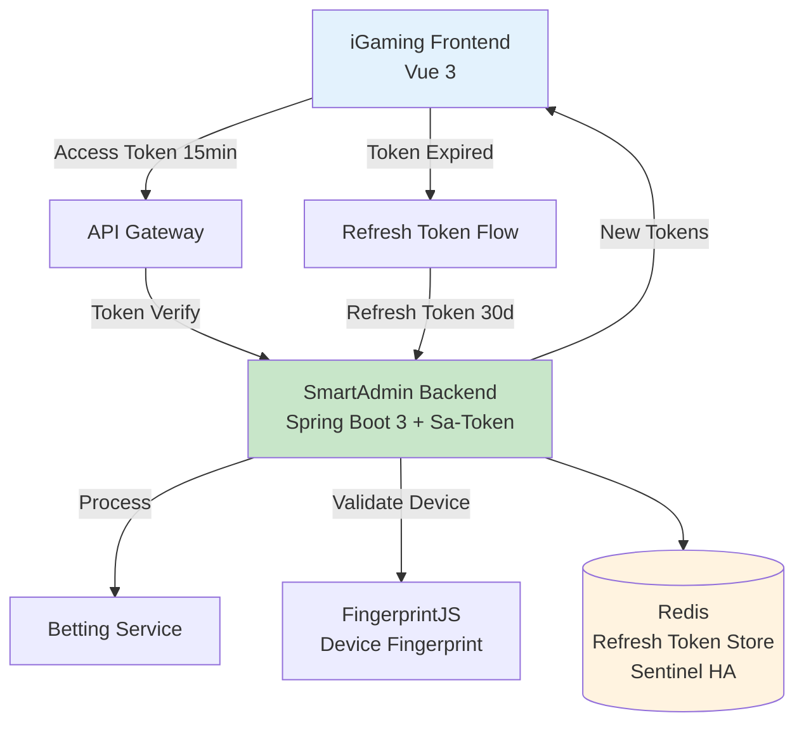
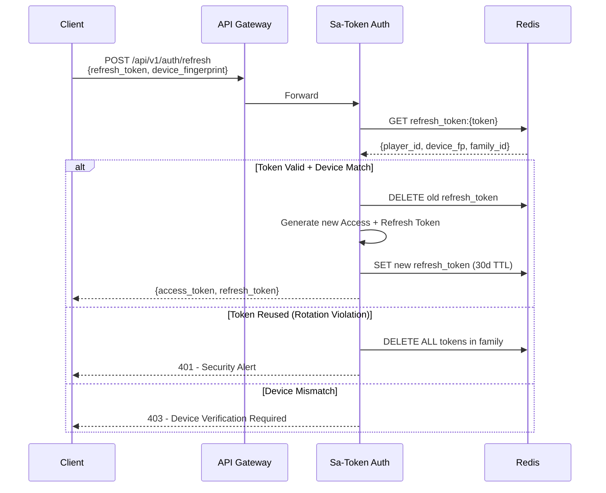

# OAuth 2.0 Refresh Token 實施方案

**Document Metadata**:
- Version: 1.0.0
- Created: 2026-02-09
- Status: Active (Production Ready)
- Priority: P0 (Critical)
- Owner: Security Team + Backend Team
- Source: [09-11 OAuth Refresh Token](../../source-archive/09_Technical_Infrastructure/09-11_OAuth_Refresh_Token_Implementation.md)

---

## 1. 問題背景

### 1.1 原始風險

**原始流程**: 根據交易 ID 找到用戶並重新生成 token

**風險等級**: CRITICAL

| 風險 | 說明 |
|------|------|
| **身份驗證缺失** | 任何人知道交易 ID 即可冒充用戶 |
| **水平越權攻擊** | 攻擊者可枚舉交易 ID 批量盜取憑證 |
| **違反 OAuth 2.0** | Token 刷新必須驗證 Refresh Token |
| **合規風險** | 違反 GDPR、等保三級、MGA/UKGC |

### 1.2 ROI 分析

| 項目 | 金額 |
|------|------|
| **實施成本** | $24,000 - $42,000 |
| **年度收益** | $650,000 - $2,300,000 |
| **ROI** | 1448% (保守估計) |

---

## 2. OAuth 2.0 Refresh Token 架構

### 2.1 Token 生命週期

| Token 類型 | 有效期 | 存儲位置 | 刷新機制 |
|-----------|--------|---------|---------|
| **Access Token** | 15 分鐘 | LocalStorage | 通過 Refresh Token 刷新 |
| **Refresh Token** | 30 天 | Redis (HttpOnly) | Token Rotation |

### 2.2 核心安全特性

- **Token Rotation**: 刷新後舊 Refresh Token 立即失效
- **Device Fingerprint**: FingerprintJS 設備識別（99.5% 準確率）
- **Redis 高可用**: 主從 + Sentinel 架構
- **Family Detection**: 偵測舊 Token 重用，自動撤銷整個 Token 家族

---

## 3. 刷新流程

---

## 4. 業務場景替代方案

| 業務場景 | 錯誤方案 | 正確方案 |
|---------|---------|---------|
| 前端 token 過期自動刷新 | 根據交易 ID 生成 token | OAuth 2.0 Refresh Token |
| GP 回調 | 根據交易 ID 生成 token | Webhook HMAC-SHA256 簽名 |
| 管理員處理異常訂單 | 冒充用戶操作 | 管理員權限 + 審計日誌 |

---

## 5. 合規性

| 標準 | 狀態 | 說明 |
|------|------|------|
| GDPR | Compliant | Token Rotation 確保憑證定期更新 |
| 等保三級 | Compliant | 多因素驗證 + 設備指紋 |
| MGA/UKGC | Compliant | 滿足博彩監管的身份驗證要求 |

---

## 相關文檔

- [Multi Actor Token Security](./Multi_Actor_Token_Security.md) - 多主體 Token 安全
- [Token Validation Service](./Token_Validation_Service.md) - Token 驗證服務
- [Authentication Architecture](./Authentication_Architecture.md) - 認證架構
