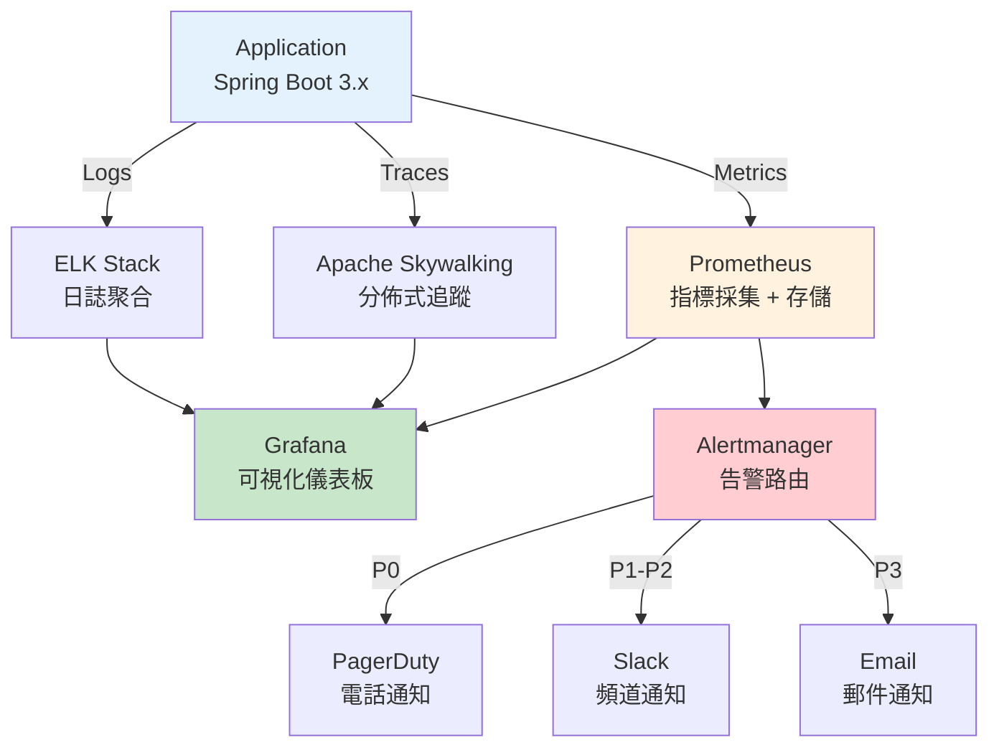
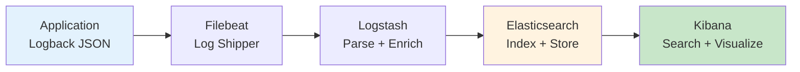

# 性能監控與告警架構 (Performance Monitoring & Alerting)

> **Business Requirements**: N/A — Pure technical infrastructure document
> **Canonical Source**: [09-06 Performance Monitoring](../../source-archive/09_Technical_Infrastructure/09-06_Performance_Monitoring.md)
> **View**: Technical Architecture (Development & DevOps)

---

## 1. 架構概覽



---

## 2. APM 工具選型

| APM 工具 | 類型 | 成本 | 推薦場景 |
|---------|------|------|---------|
| **Apache Skywalking** | 開源 | 免費 | Java 生態，推薦 |
| **New Relic** | 商業 | $$$$ | 企業級全功能 |
| **Datadog** | 商業 | $$$$ | 多雲 DevOps 整合 |
| **Elastic APM** | 開源/商業 | $$ | ELK Stack 整合 |

**推薦**: Apache Skywalking（開源、社區活躍、Spring Boot 原生支持）

### 2.1 Skywalking 集成

```xml
<dependency>
    <groupId>org.apache.skywalking</groupId>
    <artifactId>apm-toolkit-trace</artifactId>
    <version>9.3.0</version>
</dependency>
```

```
JAVA_OPTS: >
  -javaagent:/opt/skywalking-agent/skywalking-agent.jar
  -Dskywalking.agent.service_name=smart-admin-api
  -Dskywalking.collector.backend_service=skywalking-oap:11800
```

---

## 3. Golden Signals 指標體系

### 3.1 延遲 (Latency)

| 分位數 | 目標 | 告警閾值 |
|--------|------|---------|
| P50 | < 200ms | > 500ms |
| P95 | < 500ms | > 1000ms |
| P99 | < 1000ms | > 3000ms |

### 3.2 流量 (Traffic)

- QPS (Queries Per Second)
- Active Users (在線用戶數)
- Bet Transactions/sec (投注 TPS)

### 3.3 錯誤 (Errors)

| 指標 | 目標 | 告警閾值 |
|------|------|---------|
| Error Rate | < 0.1% | > 1% |
| 5xx Rate | < 0.01% | > 0.5% |
| Timeout Rate | < 0.05% | > 0.5% |

### 3.4 飽和度 (Saturation)

| 資源 | 告警閾值 |
|------|---------|
| CPU Usage | > 80% |
| Memory Usage | > 85% |
| DB Connection Pool | > 90% |
| Redis Connection Pool | > 90% |

---

## 4. 告警規則設計

### 4.1 告警分級

| 級別 | 定義 | SLA 響應時間 | 通知渠道 | 範例 |
|------|------|------------|---------|------|
| **P0** | 核心業務中斷 | 5 分鐘 | PagerDuty (電話) | 存款 API 不可用 |
| **P1** | 嚴重性能下降 | 15 分鐘 | Slack (緊急頻道) | API P99 > 3s |
| **P2** | 部分功能異常 | 30 分鐘 | Slack (告警頻道) | 錯誤率 > 1% |
| **P3** | 性能告警 | 1 小時 | Email | CPU > 80% |

### 4.2 Prometheus AlertManager 規則

```yaml
groups:
  - name: api_alerts
    interval: 30s
    rules:
      # P0: API 完全不可用
      - alert: APIDownCritical
        expr: up{job="smart-admin-api"} == 0
        for: 1m
        labels:
          severity: critical
          priority: P0
        annotations:
          summary: "API 服務完全不可用"
          runbook_url: "https://wiki.internal/runbooks/api-down"

      # P1: P99 延遲過高
      - alert: HighLatencyP99
        expr: histogram_quantile(0.99, rate(http_request_duration_seconds_bucket[5m])) > 3
        for: 5m
        labels:
          severity: high
          priority: P1
        annotations:
          summary: "API P99 延遲超過 3 秒"

      # P2: 錯誤率超過 1%
      - alert: HighErrorRate
        expr: rate(http_requests_total{status=~"5.."}[5m]) / rate(http_requests_total[5m]) > 0.01
        for: 5m
        labels:
          severity: medium
          priority: P2

      # P3: CPU 使用率過高
      - alert: HighCPUUsage
        expr: process_cpu_usage > 0.8
        for: 10m
        labels:
          severity: low
          priority: P3
```

### 4.3 Prometheus Metrics 導出

```yaml
management:
  endpoints:
    web:
      exposure:
        include: health,info,metrics,prometheus
  metrics:
    export:
      prometheus:
        enabled: true
    tags:
      application: ${spring.application.name}
      environment: ${spring.profiles.active}
```

---

## 5. 日誌聚合系統 (ELK Stack)

### 5.1 架構



### 5.2 日誌格式 (JSON)

```json
{
  "timestamp": "2026-01-27T10:00:00.123Z",
  "level": "INFO",
  "logger": "net.lab1024.sa.business.wallet.WalletService",
  "message": "Wallet debit successful",
  "trace_id": "abc-123-def-456",
  "span_id": "span-789",
  "tenant_id": "1",
  "player_id": "123456",
  "amount": 100.00,
  "currency": "USD"
}
```

---

## 相關文檔

- [Performance Optimization](./Performance_Optimization.md) - 性能優化
- [Deployment Architecture](./Deployment_Architecture.md) - 部署架構
- [Cost Optimization Architecture](./Cost_Optimization_Architecture.md) - 成本優化
