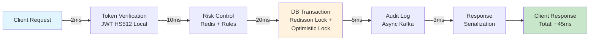
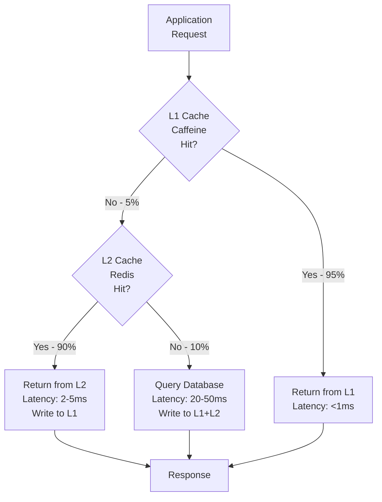

# 性能優化規範 (Performance Optimization)

> **Business Requirements**: N/A — Pure technical infrastructure document
> **Canonical Source**: [09-07 Performance Optimization](../../source-archive/09_Technical_Infrastructure/09-07_Performance_Optimization.md)
> **View**: Technical Architecture (Development & DevOps)

---

## 1. 核心瓶頸分析

iGaming 平台採用零信任統一錢包模型與實時風控，引入三大瓶頸：

| 瓶頸 | 根因 | 影響 |
|------|------|------|
| **「熱點行」並發鎖** | `FOR UPDATE` DB 鎖 | 限制單一玩家 TPS |
| **Redis Lua 腳本阻塞** | 複雜流水/風控邏輯 | 卡死 Redis |
| **鑑識級日誌膨脹** | 1 個動作 = 5-10 次 DB 寫入 | I/O 瓶頸 |

### 延遲預算

| 步驟 | 優化後 | 風險場景 |
|------|--------|---------|
| Token 驗證 | 2ms | 10ms |
| 風控檢查 | 10ms | 100ms |
| DB 事務 | 20ms | 200ms |
| **總計** | **~45ms** | **~340ms** |

> GP 超時閾值: 200-500ms

### 延遲預算流程圖



---

## 2. 下注請求優化

### 2.1 分布式鎖 + 樂觀鎖（取代 FOR UPDATE）

```
1. Redisson 分布式鎖 (wallet:lock:{tenant}:{player})
2. SELECT balance, version FROM player_wallet (無 FOR UPDATE)
3. UPDATE ... SET version = version + 1 WHERE version = ?
4. affected_rows == 0 -> 重試 (最多 3 次)
```

**鎖參數**:

| 參數 | 值 | 說明 |
|------|-----|------|
| Wait Time | 3 秒 | 獲取鎖最大等待時間 |
| Lease Time | 5 秒 | 鎖自動釋放時間 |
| Watchdog | 啟用 (30s) | 鎖自動續期機制 |

**Java 實現 (Redisson 分佈式鎖)**:

```java
// Redisson 分佈式鎖 (取代 FOR UPDATE)
public Result<Void> updateBalanceWithLock(
    String tenantId,
    String playerId,
    BigDecimal amount
) {
    String lockKey = "wallet:lock:" + tenantId + ":" + playerId;
    RLock lock = redissonClient.getLock(lockKey);

    try {
        // 等待 3 秒, 持鎖 5 秒, Watchdog 自動續期
        boolean acquired = lock.tryLock(3, 5, TimeUnit.SECONDS);

        if (!acquired) {
            return Result.error("LOCK_TIMEOUT", "獲取鎖超時");
        }

        // 樂觀鎖更新 (version 欄位, 最多重試 3 次)
        int retryCount = 0;
        while (retryCount < 3) {
            Wallet wallet = walletDao.selectById(tenantId, playerId);
            int affected = walletDao.updateBalanceWithVersion(
                tenantId, playerId, amount, wallet.getVersion()
            );

            if (affected > 0) {
                return Result.ok();
            }

            retryCount++;
            Thread.sleep(20 * retryCount); // 線性退避: 20ms, 40ms, 60ms
        }

        return Result.error("VERSION_CONFLICT", "版本衝突");

    } catch (InterruptedException e) {
        Thread.currentThread().interrupt();
        return Result.error("INTERRUPTED", "操作中斷");
    } finally {
        if (lock.isHeldByCurrentThread()) {
            lock.unlock();
        }
    }
}
```

**全局規範**: `FOR UPDATE` 禁止使用

### 2.2 player_wallet 分片

**分片鍵**: `hash(tenant_id, player_id) % N`

| 租戶規模 | 日活玩家 | 分片數 |
|---------|---------|-------|
| 小型 | < 10,000 | 8 |
| 中型 | 10,000 - 100,000 | 32 |
| 大型 | > 100,000 | 128 |

**路由**: MyBatis-Plus `DynamicTableNameInterceptor`

**MyBatis-Plus 分片攔截器配置**:

```java
@Configuration
public class WalletShardingConfig {

    @Bean
    public MybatisPlusInterceptor mybatisPlusInterceptor() {
        MybatisPlusInterceptor interceptor = new MybatisPlusInterceptor();

        // DynamicTableNameInterceptor for wallet sharding
        DynamicTableNameInnerInterceptor tableNameInterceptor =
            new DynamicTableNameInnerInterceptor();
        tableNameInterceptor.setTableNameHandler((sql, tableName) -> {
            if ("player_wallet".equals(tableName)) {
                ShardingContext ctx = ShardingContextHolder.get();
                int shardIndex = Math.abs(
                    Objects.hash(ctx.getTenantId(), ctx.getPlayerId())
                ) % ctx.getShardCount();
                return tableName + "_" + shardIndex;
            }
            return tableName;
        });

        interceptor.addInnerInterceptor(tableNameInterceptor);
        return interceptor;
    }
}
```

---

## 3. Token 安全方案

| 場景 | 驗證方式 | 有效期 | 特殊機制 |
|------|---------|--------|---------|
| **遊戲商 (GP)** | RSA-SHA256 | 單次 | IP 白名單 + 時間窗口 |
| **平台互調** | mTLS + SA Token | 1h | K8s Network Policy |
| **前台玩家** | HS512 JWT | 5min | Refresh Token 7d |
| **後台用戶** | RS256 + Session | 30min | MFA + 二次驗證 |

---

## 4. 實時風控優化

### 4.1 同步 vs 異步邊界

| 類型 | 檢查內容 | 延遲要求 |
|------|---------|---------|
| **同步** (下注路徑) | 玩家狀態、信用額度、全局限額 | < 15ms |
| **異步** (Kafka 事件) | 行為模式分析、鑑識日誌、閾值計算 | 非即時 |

### 4.2 Lua 腳本治理

| 規範 | 要求 |
|------|------|
| 執行時間 | < 1ms |
| Key 數量 | < 5 |
| 禁止操作 | KEYS *, SMEMBERS, HGETALL, 循環 > 100 |

**Redis 數據結構 (代理報表)**:

```
Key: agent_balance:{tenant}:{agent}
Member: {player_id}
Score: {balance}
```

**Lua 腳本示例 (代理餘額彙總, < 1ms)**:

```lua
local members = redis.call('ZRANGE', KEYS[1], 0, -1, 'WITHSCORES')
local sum = 0
for i = 2, #members, 2 do sum = sum + tonumber(members[i]) end
return tostring(sum)
```

**一致性保證 (三層架構)**:

| 層級 | 數據源 | 延遲 |
|------|--------|------|
| L0: Truth Source | PostgreSQL | 0 |
| L1: Near Real-Time | Redis | < 1s |
| L2: Aggregated | ClickHouse | 5 min |

**對帳**: 每日 02:00 全量校準

---

## 5. 數據分層存儲

| 層級 | 時間範圍 | 存儲介質 | SLA | 成本/GB/月 |
|------|---------|---------|-----|-----------|
| **熱** | 0-2 個月 | PostgreSQL SSD | < 50ms | $0.115 |
| **溫** | 3-6 個月 | S3 Standard | < 2s | $0.023 |
| **冷** | 7-19 個月 | S3 Glacier | < 30s | $0.004 |
| **歸檔** | 20-84 個月 | S3 Deep Archive | < 12h | $0.00099 |

```
Day 0 -> Day 60 -> Day 180 -> Day 570 -> Day 2520
  |         |          |          |           |
PostgreSQL  S3 Std    S3 Glacier  S3 Deep    Delete
  (Hot)     (Warm)    (Cold)     Archive    /Permanent
```

**合規保留**: 7 年（總計 84 個月）

---

## 6. 性能指標

| 指標 | 優化前 | 優化後 | 提升 |
|------|--------|--------|------|
| TPS | 87 | >= 450 | +418% |
| P99 延遲 | 1,240ms | <= 200ms | -84% |
| 審計日誌延遲 | 350ms | <= 50ms | -87% |
| Cache Hit Rate | 65% | 95% | +30pp |
| Redis QPS | 10,000 | 1,000 | -90% |

---

---

## 7. 性能測試規範

### 7.1 壓測工具：k6

| 特性 | k6 | JMeter | 決策 |
|------|-----|--------|------|
| **資源占用** | 極低（Go 原生） | 高（Java GUI） | k6 |
| **腳本語言** | JavaScript | Java/Groovy | k6 |
| **CI/CD 整合** | 原生支持 | 需額外配置 | k6 |

### 7.2 k6 測試場景示例

```javascript
import http from 'k6/http';
import { check, sleep } from 'k6';

export const options = {
  stages: [
    { duration: '2m', target: 100 },  // 爬升至 100 VU
    { duration: '5m', target: 100 },  // 維持 5 分鐘
    { duration: '2m', target: 200 },  // 爬升至 200 VU
    { duration: '5m', target: 200 },  // 維持 5 分鐘
    { duration: '2m', target: 0 },    // 降至 0
  ],
  thresholds: {
    http_req_duration: ['p(95)<200', 'p(99)<500'],
    http_req_failed: ['rate<0.01'],
  },
};

export default function () {
  const payload = JSON.stringify({
    fromPlayerId: Math.floor(Math.random() * 10000) + 1,
    toPlayerId: Math.floor(Math.random() * 10000) + 1,
    amount: Math.floor(Math.random() * 1000) + 10,
    currency: 'CNY',
  });

  const params = {
    headers: {
      'Content-Type': 'application/json',
      'Authorization': 'Bearer ${__ENV.TOKEN}',
    },
  };

  const res = http.post('http://localhost:1024/api/wallet/transfer', payload, params);

  check(res, {
    'status is 200': (r) => r.status === 200,
    'response time < 200ms': (r) => r.timings.duration < 200,
    'success flag is true': (r) => JSON.parse(r.body).success === true,
  });

  sleep(1);
}
```

**執行壓測**:

```bash
# 本地執行
k6 run --vus 100 --duration 5m wallet-transfer-test.js

# 輸出結果至 InfluxDB + Grafana
k6 run --out influxdb=http://localhost:8086/k6 wallet-transfer-test.js
```

### 7.3 壓測基線目標

| 場景 | 目標 RPS | P95 延遲 | P99 延遲 | 錯誤率 |
|------|---------|---------|---------|--------|
| 玩家轉賬 | 500 | < 150ms | < 200ms | < 0.5% |
| 下注扣款 | 1,000 | < 80ms | < 100ms | < 0.1% |
| 風控檢查 | 800 | < 40ms | < 50ms | < 0.05% |
| 餘額查詢 | 2,000 | < 30ms | < 50ms | < 0.01% |

### 7.4 監控儀表盤整合

```yaml
# docker-compose.yml
version: '3.8'
services:
  influxdb:
    image: influxdb:2.7
    ports:
      - "8086:8086"
    environment:
      - DOCKER_INFLUXDB_INIT_MODE=setup
      - DOCKER_INFLUXDB_INIT_USERNAME=admin
      - DOCKER_INFLUXDB_INIT_PASSWORD=adminpass
      - DOCKER_INFLUXDB_INIT_ORG=smartadmin
      - DOCKER_INFLUXDB_INIT_BUCKET=k6

  grafana:
    image: grafana/grafana:10.0.0
    ports:
      - "3000:3000"
    environment:
      - GF_AUTH_ANONYMOUS_ENABLED=true
      - GF_AUTH_ANONYMOUS_ORG_ROLE=Admin
```

---

## 8. JetCache 多級緩存架構



**JetCache 配置範例**:

```java
@Cached(
    name = "wallet:balance:",
    key = "#tenantId + ':' + #playerId",
    expire = 3600,      // L2 TTL: 1h
    localExpire = 100,  // L1 TTL: 100s
    cacheType = CacheType.BOTH  // L1 + L2
)
public Option<WalletBalanceVO> getBalance(
    String tenantId,
    String playerId
) {
    return walletDao.selectById(tenantId, playerId)
        .map(WalletBalanceVO::from);
}
```

**緩存命中率分佈**:

```
L1 (Caffeine): 95% 命中 -> <1ms
L2 (Redis):    4.5% 命中 -> 2-5ms
Database:      0.5% 未命中 -> 20-50ms
────────────────────────────────────
Overall P99 Latency: <=200ms (vs 1,240ms 優化前)
```

---

## 9. SmartAdmin Implementation

### 9.1 Performance Metrics Service

```java
@Service
@RequiredArgsConstructor
public class PerformanceMetricsService {

    private final PerformanceMetricsDao metricsDao;
    private final PerformanceAlertManager alertManager;

    /**
     * Query performance metrics by time range using Vavr Option.
     */
    public Option<PerformanceMetricsVO> getMetrics(LocalDate date, String serviceName) {
        return Option.of(metricsDao.selectByDateAndService(date, serviceName))
            .map(entity -> SmartBeanUtil.copy(entity, PerformanceMetricsVO.class));
    }

    /**
     * Record performance snapshot.
     */
    public void recordMetrics(PerformanceMetricsForm form) {
        alertManager.checkAndRecord(form);
    }
}
```

### 9.2 Performance Alert Manager

```java
@Component
@RequiredArgsConstructor
public class PerformanceAlertManager {

    private final PerformanceMetricsDao metricsDao;
    private final AlertNotificationDao alertDao;

    /**
     * Check thresholds and record metrics.
     * @Transactional only allowed in Manager layer per SmartAdmin architecture.
     */
    @Transactional(rollbackFor = Throwable.class)
    public void checkAndRecord(PerformanceMetricsForm form) {
        PerformanceMetricsEntity entity = SmartBeanUtil.copy(form, PerformanceMetricsEntity.class);
        entity.setRecordedAt(LocalDateTime.now());
        metricsDao.insert(entity);

        // Check for alert conditions
        if (form.getP99LatencyMs() > 200 || form.getErrorRate().compareTo(new BigDecimal("0.01")) > 0) {
            AlertNotificationEntity alert = new AlertNotificationEntity();
            alert.setServiceName(form.getServiceName());
            alert.setSeverity("WARNING");
            alert.setMessage("Performance degradation detected");
            alertDao.insert(alert);
        }
    }
}
```

### 9.3 Database Schema

```sql
-- Performance metrics tracking
CREATE TABLE t_performance_metrics (
    id              BIGSERIAL PRIMARY KEY,
    service_name    VARCHAR(100) NOT NULL,
    metric_date     DATE NOT NULL,
    tps             INTEGER NOT NULL DEFAULT 0,
    p50_latency_ms  INTEGER NOT NULL DEFAULT 0,
    p95_latency_ms  INTEGER NOT NULL DEFAULT 0,
    p99_latency_ms  INTEGER NOT NULL DEFAULT 0,
    error_rate      DECIMAL(5, 4) NOT NULL DEFAULT 0,
    cache_hit_rate  DECIMAL(5, 4) NOT NULL DEFAULT 0,
    recorded_at     TIMESTAMP NOT NULL DEFAULT NOW(),
    CONSTRAINT uk_perf_metrics UNIQUE (service_name, metric_date)
);

CREATE INDEX idx_perf_service ON t_performance_metrics(service_name, metric_date DESC);

-- Wallet sharding configuration
CREATE TABLE t_wallet_shard_config (
    id              BIGSERIAL PRIMARY KEY,
    tenant_id       BIGINT NOT NULL UNIQUE,
    shard_count     INTEGER NOT NULL DEFAULT 8,
    shard_strategy  VARCHAR(50) NOT NULL DEFAULT 'HASH',
    enabled         BOOLEAN NOT NULL DEFAULT TRUE,
    created_at      TIMESTAMP NOT NULL DEFAULT NOW(),
    updated_at      TIMESTAMP NOT NULL DEFAULT NOW()
);

-- Performance baseline tracking
CREATE TABLE t_performance_baseline (
    id              BIGSERIAL PRIMARY KEY,
    service_name    VARCHAR(100) NOT NULL UNIQUE,
    baseline_tps    INTEGER NOT NULL,
    baseline_p99_ms INTEGER NOT NULL,
    baseline_error_rate DECIMAL(5, 4) NOT NULL,
    established_at  TIMESTAMP NOT NULL DEFAULT NOW(),
    updated_at      TIMESTAMP NOT NULL DEFAULT NOW()
);
```

---

## 相關文檔

- [Caching Strategy](./Caching_Strategy.md) - JetCache 多級緩存
- [Stream Processing Architecture](./Stream_Processing_Architecture.md) - Flink 流處理
- [Cost Optimization Architecture](./Cost_Optimization_Architecture.md) - 成本優化
