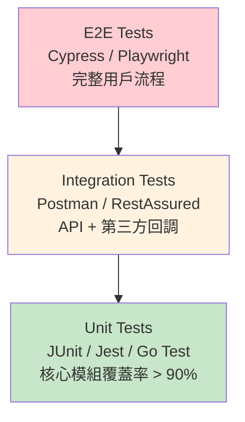

# 測試驗收標準架構 (QA Testing Standards Architecture)

**Document Metadata**:
- Version: 1.0.0
- Created: 2026-02-09
- Status: Active
- Priority: P0 (Critical)
- Owner: QA Team + DevOps Team
- Source: [09-04 QA Standards](../../source-archive/09_Technical_Infrastructure/09-04_QA_Standards.md)

---

## 1. 測試金字塔 (Testing Pyramid)



### 1.1 單元測試 (Unit Test)

| 項目 | 規範 |
|------|------|
| **範圍** | 佣金計算、錢包扣款、流水檢查 |
| **工具** | JUnit (Java), Jest (Node.js), Go Test |
| **覆蓋率** | 核心模組 (Finance/Risk) > 90% |
| **邊界值** | 必須包含（餘額為 0, 流水差 $0.01 等） |

### 1.2 整合測試 (Integration Test)

| 項目 | 規範 |
|------|------|
| **範圍** | Controller -> Service -> DB, 第三方回調 |
| **工具** | Postman / Newman, RestAssured |
| **標準** | 所有 API 有自動化腳本, 並發場景通過 |

### 1.3 端對端測試 (E2E Test)

| 項目 | 規範 |
|------|------|
| **範圍** | 註冊 -> 存款 -> 遊戲 -> 提款 完整流程 |
| **工具** | Cypress / Playwright |
| **標準** | 每日自動 Regression Test |

---

## 2. 性能測試矩陣

| Scenario | Concurrent Users | Duration | Target P99 | Error Rate |
|----------|-----------------|----------|-----------|------------|
| **Login Storm** | 50K users/min | 5 min | < 500ms | 0% |
| **Bet Spike** | 100K bets/min | 10 min | < 200ms | 0% |
| **Withdrawal Burst** | 10K/min | 5 min | Queue < 30s | 0% |
| **Game Launch** | 200K/min | 10 min | < 1000ms | < 0.1% |
| **24h Soak Test** | 200K concurrent | 24 hours | No degradation | 0% |
| **Spike Test** | 0 -> 100K in 10s | 2 min | < 800ms | < 1% |
| **Stress Test** | Ramp until failure | Until crash | Find breaking point | - |

---

## 3. K6 測試腳本

### 3.1 Login Storm 測試

```javascript
import http from 'k6/http';
import { check, sleep } from 'k6';
import { Rate } from 'k6/metrics';

const errorRate = new Rate('errors');

export const options = {
  stages: [
    { duration: '1m', target: 10000 },
    { duration: '5m', target: 50000 },
    { duration: '5m', target: 50000 },
    { duration: '2m', target: 0 },
  ],
  thresholds: {
    'http_req_duration': ['p(99)<500'],
    'http_req_failed': ['rate<0.01'],
    'errors': ['rate<0.01'],
  },
};

const BASE_URL = 'https://api.casino.com';

export default function () {
  const username = `testuser_${__VU}_${__ITER}`;

  const loginRes = http.post(`${BASE_URL}/api/v1/auth/login`, JSON.stringify({
    username: username,
    password: 'TestPassword123!',
    device_id: `device_${__VU}`,
  }), {
    headers: { 'Content-Type': 'application/json' },
  });

  const loginSuccess = check(loginRes, {
    'login status is 200': (r) => r.status === 200,
    'has access token': (r) => r.json('access_token') !== undefined,
    'response time < 500ms': (r) => r.timings.duration < 500,
  });

  errorRate.add(!loginSuccess);
  sleep(1);
}
```

### 3.2 24h Soak Test

```javascript
export const options = {
  scenarios: {
    soak_test: {
      executor: 'constant-vus',
      vus: 20000,
      duration: '24h',
    },
  },
  thresholds: {
    'http_req_duration': ['p(99)<500'],
    'http_req_failed': ['rate<0.01'],
    'iteration_duration': ['p(99)<2000'],
  },
};
```

**Soak Test 監控指標**:

| Metric | Hour 1 | Hour 24 | Delta | Status |
|--------|--------|---------|-------|--------|
| P99 Latency | 210ms | 215ms | +5ms | Acceptable |
| Memory (RSS) | 4.2 GB | 4.3 GB | +100 MB | No leak |
| DB Connections | 180/200 | 185/200 | +5 | Stable |
| Error Rate | 0.02% | 0.03% | +0.01% | Acceptable |

### 3.3 JMeter Bet Spike Test

```xml
<jmeterTestPlan version="1.2">
  <TestPlan>
    <ThreadGroup name="Bet Spike Test" enabled="true">
      <stringProp name="ThreadGroup.num_threads">10000</stringProp>
      <stringProp name="ThreadGroup.ramp_time">60</stringProp>
      <stringProp name="ThreadGroup.duration">600</stringProp>
    </ThreadGroup>
    <HTTPSamplerProxy name="Place Bet">
      <stringProp name="HTTPSampler.domain">api.casino.com</stringProp>
      <stringProp name="HTTPSampler.path">/api/v1/bets</stringProp>
      <stringProp name="HTTPSampler.method">POST</stringProp>
    </HTTPSamplerProxy>
  </TestPlan>
</jmeterTestPlan>
```

---

## 4. 測試腳本架構

```
tests/
├── performance/
│   ├── scenarios/
│   │   ├── login_storm.js
│   │   ├── bet_spike.js
│   │   ├── withdrawal_burst.js
│   │   └── soak_test.js
│   ├── lib/
│   │   ├── auth.js
│   │   ├── wallet.js
│   │   └── metrics.js
│   ├── data/
│   │   ├── test_users.csv
│   │   └── test_games.json
│   └── config/
│       ├── dev.json
│       ├── staging.json
│       └── prod-like.json
├── security/
│   ├── owasp_zap_scan.yaml
│   └── snyk_scan.yaml
└── regression/
    ├── api_regression.postman_collection.json
    └── e2e_regression.cy.js
```

---

## 5. 效能門檻自動化 (CI/CD Performance Gates)

```yaml
# .github/workflows/performance-gate.yml
name: Performance Gate

on:
  pull_request:
    branches: [main, develop]

jobs:
  performance_test:
    runs-on: ubuntu-latest
    steps:
      - uses: actions/checkout@v3

      - name: Run K6 Test
        uses: grafana/k6-action@v0.3.0
        with:
          filename: tests/performance/scenarios/api_smoke_test.js

      - name: Compare Against Baseline
        run: |
          python scripts/compare_performance.py \
            --baseline performance_baseline.json \
            --current test_results.json \
            --threshold 10  # Allow 10% degradation
```

---

## 6. 上線檢查清單 (Go-Live Checklist)

- [ ] 所有 P1/P2 Bug 已修復
- [ ] 壓力測試報告已簽核
- [ ] 資料庫變更腳本已驗證可回滾
- [ ] 監控儀表板已配置完畢

---

## 相關文檔

- [Performance Monitoring](./Performance_Monitoring.md) - APM 監控
- [Deployment Architecture](./Deployment_Architecture.md) - 部署架構
- [Maintenance Architecture](./Maintenance_Architecture.md) - 維護程序
