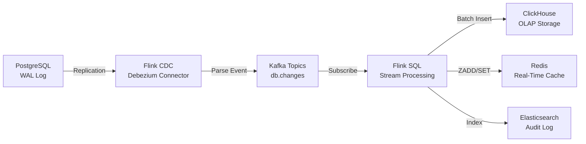
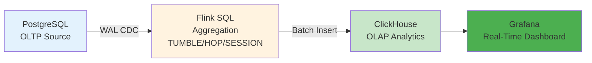

# 串流處理架構（Stream Processing Architecture）

> **業務需求**: 不適用 — 純技術基礎設施文件
> **規範來源**: [09-08 Stream Processing](../../source-archive/09_Technical_Infrastructure/09-08_Stream_Processing_Architecture.md)
> **目標讀者**: Data Engineers, Backend Engineers, DevOps

---

## 1. 架構概覽

採用 **Apache Flink 1.18** 作為實時流處理引擎：

| 挑戰 | 優化前 | 優化後 | 提升 |
|------|--------|--------|------|
| OLAP 報表延遲 | 5-10s | < 1s | -90% |
| 風控檢測延遲 | 批次 (分鐘級) | < 100ms | -99% |
| 數據同步延遲 | T+1 | < 5s | -99% |
| TPS | 87 | >= 450 | +418% |

### 1.1 核心組件

| 組件 | 版本 | 用途 |
|------|------|------|
| **Flink CDC** | 3.0.1 | Change Data Capture (基於 Debezium 2.5.0) |
| **Flink SQL** | 1.18 | 實時 OLAP 查詢（視窗函數） |
| **Flink CEP** | 1.18 | 複雜事件處理（風控偵測） |
| **RocksDB** | - | State Backend + S3 Checkpoint |

---

## 2. Flink CDC 架構



### 2.1 PostgreSQL WAL 配置

```sql
-- postgresql.conf
wal_level = logical
max_wal_senders = 10
max_replication_slots = 10

-- Create replication slot
SELECT * FROM pg_create_logical_replication_slot('flink_slot', 'pgoutput');
```

### 2.2 Flink CDC Table 定義

```sql
CREATE TABLE player_wallet_cdc (
    tenant_id STRING,
    player_id STRING,
    agent_id STRING,
    balance DECIMAL(20, 2),
    lock_amount DECIMAL(20, 2),
    version BIGINT,
    create_time TIMESTAMP(3),
    update_time TIMESTAMP(3) METADATA FROM 'source.timestamp' VIRTUAL,
    op_type STRING METADATA FROM 'op' VIRTUAL
) WITH (
    'connector' = 'postgres-cdc',
    'hostname' = 'postgres-master',
    'port' = '5432',
    'username' = 'cdc_user',
    'password' = '${CDC_PASSWORD}',
    'database-name' = 'igaming',
    'table-name' = 'player_wallet',
    'slot.name' = 'flink_slot',
    'decoding.plugin.name' = 'pgoutput',
    'debezium.snapshot.mode' = 'initial'
);
```

### 2.3 CDC 監控

| 指標 | 閾值 | 告警級別 |
|------|------|---------|
| CDC Lag | > 10s | P1 |
| WAL Slot Size | > 10GB | P2 |
| Failed Snapshot | > 1/hour | P0 |
| Connection Error | > 3/hour | P1 |

---

## 3. Flink SQL 實時 OLAP

### 3.1 視窗函數

```sql
-- TUMBLE Window: 5 分鐘固定視窗
SELECT
    tenant_id,
    agent_id,
    TUMBLE_START(update_time, INTERVAL '5' MINUTE) AS window_start,
    SUM(balance) AS total_balance,
    COUNT(DISTINCT player_id) AS player_count
FROM player_wallet_cdc
GROUP BY
    tenant_id, agent_id,
    TUMBLE(update_time, INTERVAL '5' MINUTE);
```

### 3.2 Pipeline: PostgreSQL -> Flink -> ClickHouse



---

## 4. Flink CEP 風控偵測

### 4.1 套利偵測範例

```java
Pattern<BetEvent, ?> arbitragePattern = Pattern
    .<BetEvent>begin("first_bet")
    .where(new SimpleCondition<BetEvent>() {
        @Override
        public boolean filter(BetEvent event) {
            return event.getBetType().equals("SPORTS");
        }
    })
    .followedBy("opposite_bet")
    .where(new IterativeCondition<BetEvent>() {
        @Override
        public boolean filter(BetEvent event, Context<BetEvent> ctx) {
            BetEvent first = ctx.getEventsForPattern("first_bet").iterator().next();
            return event.getPlayerId().equals(first.getPlayerId())
                && event.getGameId().equals(first.getGameId())
                && !event.getSelection().equals(first.getSelection());
        }
    })
    .within(Time.minutes(5));
```

---

## 5. 部署架構

### 5.1 Kubernetes 部署

```yaml
apiVersion: apps/v1
kind: Deployment
metadata:
  name: flink-jobmanager
spec:
  replicas: 2
  template:
    spec:
      containers:
      - name: flink
        image: flink:1.18.0-scala_2.12-java11
        resources:
          requests: { cpu: "2", memory: "4Gi" }
          limits: { cpu: "4", memory: "8Gi" }
```

### 5.2 資源配置

| 組件 | Replicas | Memory | CPU | 月成本 |
|------|----------|--------|-----|--------|
| JobManager | 2 | 4GB x2 | 2 cores x2 | $80 |
| TaskManager | 4 | 8GB x4 | 4 cores x4 | $472 |
| **Total** | 6 | 40GB | 20 cores | **$552** |

### 5.3 HPA 自動擴展

```yaml
apiVersion: autoscaling/v2
kind: HorizontalPodAutoscaler
metadata:
  name: flink-taskmanager-hpa
spec:
  scaleTargetRef:
    apiVersion: apps/v1
    kind: Deployment
    name: flink-taskmanager
  minReplicas: 4
  maxReplicas: 12
  metrics:
  - type: Resource
    resource:
      name: cpu
      target:
        type: Utilization
        averageUtilization: 70
```

---

## 6. Exactly-Once 語義

| 組件 | 保證級別 | 機制 |
|------|---------|------|
| Flink CDC -> Kafka | Exactly-Once | Flink Checkpoint + Kafka Transaction |
| Kafka -> Flink SQL | Exactly-Once | Flink Consumer Offset Management |
| Flink SQL -> ClickHouse | At-Least-Once | ClickHouse ReplacingMergeTree 去重 |

---

## 相關文件

- [緩存策略](./Caching_Strategy.md) — JetCache 多級緩存架構
- [性能優化](./Performance_Optimization.md) — 性能優化規範
- [成本優化](./Cost_Optimization_Architecture.md) — 成本優化架構
