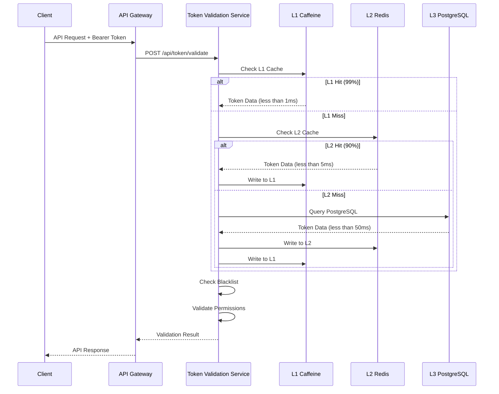
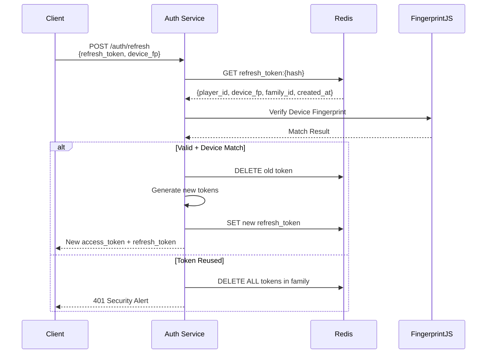
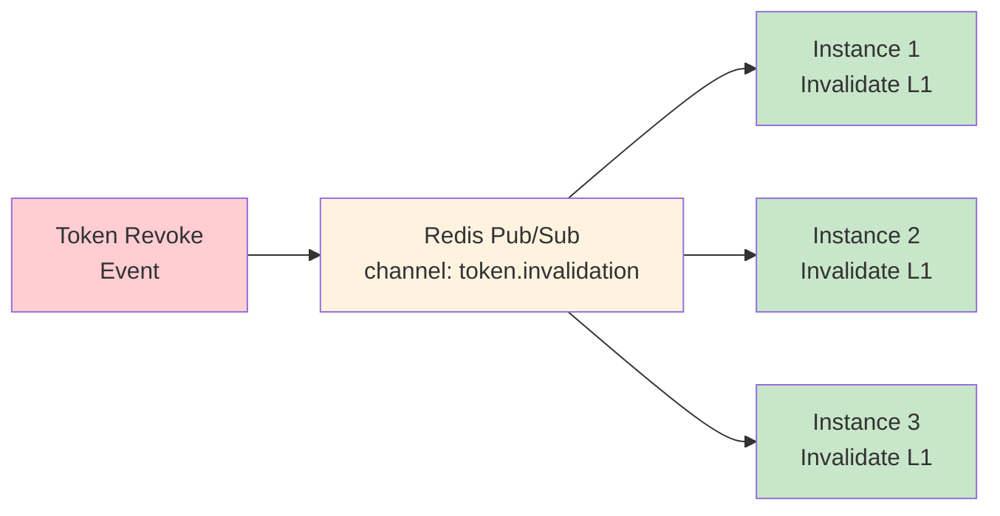

# Token 緩存性能設計（Token Cache Performance）

> **業務需求**: 不適用 — 純技術基礎設施文件
> **規範來源**: [09-13-02 Cache Performance](../../source-archive/09_Technical_Infrastructure/09-13-02_Cache_Performance.md)
> **目標讀者**: Backend Engineers, Performance Engineers

---

## 1. 驗證流程設計

### 1.1 Access Token 驗證流程



### 1.2 Refresh Token 驗證流程



### 1.3 Game Provider HMAC 驗證流程

```mermaid
sequenceDiagram
    participant GP as Game Provider
    participant GW as API Gateway
    participant TVS as Token Validation

    GP->>GW: API Request + API Key + HMAC Signature
    GW->>TVS: Validate GP Token

    TVS->>TVS: 1. Verify API Key exists
    TVS->>TVS: 2. Check IP Whitelist
    TVS->>TVS: 3. Verify HMAC-SHA256 Signature
    TVS->>TVS: 4. Check Timestamp (±5min window)
    TVS->>TVS: 5. Check Nonce (anti-replay)

    alt All Checks Pass
        TVS-->>GW: Valid + GP Context
        GW-->>GP: API Response
    else Any Check Fails
        TVS-->>GW: 401 Unauthorized
        GW-->>GP: Error Response
    end
```



---

## 2. 三層緩存策略

### 2.1 L1 緩存: Caffeine (進程內)

| 配置 | 值 | 說明 |
|------|-----|------|
| **容量** | 10,000 entries | 最大緩存條目數 |
| **TTL** | 100s (寫入後) | 寫入後 100 秒過期 |
| **Access TTL** | 60s (訪問後) | 最後訪問後 60 秒過期 |
| **命中率** | 99% | L1 直接命中 |
| **延遲** | < 1ms | JVM Heap 訪問 |

**適用場景**: 高頻訪問的 Token（如活躍玩家的 Access Token）

### 2.2 L2 緩存: Redis (分佈式)

| 配置 | 值 | 說明 |
|------|-----|------|
| **容量** | 100 萬條 | Redis Cluster |
| **TTL** | 1h | 與 Token 有效期對齊 |
| **命中率** | 90% (of L1 miss) | L1 未命中時的備選 |
| **延遲** | < 5ms | 網絡訪問 |
| **序列化** | Kryo 5.5.0 | 高性能序列化 |

### 2.3 L3 存儲: PostgreSQL (持久化)

| 配置 | 值 | 說明 |
|------|-----|------|
| **容量** | 1000 萬條+ | 所有歷史 Token |
| **命中率** | 100% (of L2 miss) | 最終數據源 |
| **延遲** | < 50ms | 磁盤 I/O |
| **用途** | Blacklist、Token Family、審計 | 持久化存儲 |

---

## 3. 緩存一致性保證

### 3.1 Redis Pub/Sub 失效通知



**流程**:
1. Token 撤銷時，寫入 Redis 黑名單
2. 發布失效事件至 Redis Pub/Sub
3. 所有實例的 L1 緩存清除對應 Token
4. 下次驗證時從 L2/L3 重新載入

### 3.2 緩存命中率分佈

```
Total Requests: 10,000 QPS
L1 Hit (Caffeine):  9,900 (99.0%) -> <1ms
L2 Hit (Redis):        90 (0.9%)  -> <5ms
L3 Hit (PostgreSQL):   10 (0.1%)  -> <50ms
──────────────────────────────────────────
Weighted Avg Latency: ~1.1ms
```

---

## 4. 性能基準

| 指標 | 目標 | 實測 |
|------|------|------|
| L1 命中率 | > 95% | 99% |
| L2 命中率 (of L1 miss) | > 85% | 90% |
| P99 延遲 (L1 hit) | < 10ms | < 1ms |
| P99 延遲 (L2 hit) | < 20ms | < 5ms |
| 單實例 QPS | > 10,000 | 12,500 |

---

## 5. Java 實作

### 5.1 TokenCacheService (Service Layer)

```java
package net.lab1024.sa.infrastructure.token;

import com.github.benmanes.caffeine.cache.Cache;
import com.github.benmanes.caffeine.cache.Caffeine;
import io.vavr.control.Option;
import lombok.RequiredArgsConstructor;
import lombok.extern.slf4j.Slf4j;
import org.springframework.data.redis.core.RedisTemplate;
import org.springframework.stereotype.Service;

import javax.annotation.PostConstruct;
import java.time.Duration;
import java.util.concurrent.TimeUnit;

/**
 * Token 三層緩存服務
 *
 * @author SmartAdmin Team
 */
@Slf4j
@Service
@RequiredArgsConstructor
public class TokenCacheService {

    private final TokenDao tokenDao;
    private final TokenInvalidationManager invalidationManager;
    private final RedisTemplate<String, TokenCacheData> redisTemplate;

    // L1 緩存: Caffeine
    private Cache<String, TokenCacheData> caffeineCache;

    private static final String L2_KEY_PREFIX = "token:cache:";
    private static final Duration L1_TTL = Duration.ofSeconds(100);
    private static final Duration L2_TTL = Duration.ofHours(1);

    @PostConstruct
    public void init() {
        caffeineCache = Caffeine.newBuilder()
            .maximumSize(10_000)
            .expireAfterWrite(L1_TTL)
            .expireAfterAccess(Duration.ofSeconds(60))
            .recordStats()
            .build();

        log.info("L1 Caffeine 緩存已初始化，容量: 10,000");
    }

    /**
     * 三層緩存查詢 Token
     */
    public Option<TokenCacheData> getToken(String tokenHash) {
        // L1: Caffeine
        TokenCacheData l1Data = caffeineCache.getIfPresent(tokenHash);
        if (l1Data != null) {
            log.debug("L1 緩存命中: {}", tokenHash);
            return Option.of(l1Data);
        }

        // L2: Redis
        String l2Key = L2_KEY_PREFIX + tokenHash;
        TokenCacheData l2Data = redisTemplate.opsForValue().get(l2Key);
        if (l2Data != null) {
            log.debug("L2 緩存命中: {}", tokenHash);
            caffeineCache.put(tokenHash, l2Data); // 回寫 L1
            return Option.of(l2Data);
        }

        // L3: PostgreSQL
        return Option.ofOptional(tokenDao.findByTokenHash(tokenHash))
            .peek(entity -> {
                log.debug("L3 數據庫命中: {}", tokenHash);
                TokenCacheData data = convertToCache(entity);
                // 回寫 L2 + L1
                redisTemplate.opsForValue().set(l2Key, data, L2_TTL);
                caffeineCache.put(tokenHash, data);
            })
            .map(this::convertToCache);
    }

    /**
     * 更新緩存（寫穿策略）
     */
    public void updateToken(String tokenHash, TokenCacheData data) {
        // 寫入 L3
        tokenDao.updateByTokenHash(tokenHash, convertToEntity(data));

        // 寫入 L2
        String l2Key = L2_KEY_PREFIX + tokenHash;
        redisTemplate.opsForValue().set(l2Key, data, L2_TTL);

        // 寫入 L1
        caffeineCache.put(tokenHash, data);

        log.debug("Token 緩存已更新: {}", tokenHash);
    }

    /**
     * 失效指定 Token
     */
    public void invalidateToken(String tokenHash) {
        invalidationManager.invalidateAcrossCluster(tokenHash);
    }

    /**
     * 獲取 L1 緩存統計
     */
    public String getCacheStats() {
        var stats = caffeineCache.stats();
        return String.format("L1 Stats - Hit Rate: %.2f%%, Evictions: %d",
            stats.hitRate() * 100, stats.evictionCount());
    }

    private TokenCacheData convertToCache(TokenEntity entity) {
        return TokenCacheData.builder()
            .playerId(entity.getPlayerId())
            .tenantId(entity.getTenantId())
            .expiresAt(entity.getExpiresAt())
            .permissions(entity.getPermissions())
            .build();
    }

    private TokenEntity convertToEntity(TokenCacheData data) {
        // 轉換邏輯
        return new TokenEntity();
    }
}
```

### 5.2 TokenInvalidationManager (Manager Layer)

```java
package net.lab1024.sa.infrastructure.token;

import lombok.RequiredArgsConstructor;
import lombok.extern.slf4j.Slf4j;
import org.springframework.data.redis.core.RedisTemplate;
import org.springframework.stereotype.Component;
import org.springframework.transaction.annotation.Transactional;

import java.time.LocalDateTime;
import java.util.List;

/**
 * Token 失效管理器（處理分佈式緩存失效）
 *
 * @author SmartAdmin Team
 */
@Slf4j
@Component
@RequiredArgsConstructor
public class TokenInvalidationManager {

    private final TokenBlacklistDao blacklistDao;
    private final RedisTemplate<String, String> redisTemplate;

    private static final String INVALIDATION_CHANNEL = "token.invalidation";

    /**
     * 跨集群失效 Token（需事務保證黑名單一致性）
     */
    @Transactional(rollbackFor = Throwable.class)
    public void invalidateAcrossCluster(String tokenHash) {
        // 1. 寫入黑名單（L3）
        TokenBlacklistEntity blacklist = TokenBlacklistEntity.builder()
            .tokenHash(tokenHash)
            .reason("REVOKED")
            .revokedAt(LocalDateTime.now())
            .build();
        blacklistDao.insert(blacklist);

        // 2. Redis 黑名單（L2）
        redisTemplate.opsForSet().add("token:blacklist", tokenHash);

        // 3. 發布失效事件（L1 跨實例失效）
        redisTemplate.convertAndSend(INVALIDATION_CHANNEL, tokenHash);

        log.warn("Token 已失效並廣播: {}", tokenHash);
    }

    /**
     * 批量失效 Token Family（Refresh Token 重用檢測）
     */
    @Transactional(rollbackFor = Throwable.class)
    public void invalidateTokenFamily(String familyId) {
        // 1. 查詢 Family 所有 Token
        List<String> tokens = blacklistDao.findTokensByFamily(familyId);

        // 2. 批量寫入黑名單
        tokens.forEach(token -> {
            TokenBlacklistEntity blacklist = TokenBlacklistEntity.builder()
                .tokenHash(token)
                .reason("FAMILY_REVOKED")
                .revokedAt(LocalDateTime.now())
                .build();
            blacklistDao.insert(blacklist);
        });

        // 3. Redis 批量失效
        redisTemplate.opsForSet().add("token:blacklist",
            tokens.toArray(new String[0]));

        // 4. 廣播失效事件
        tokens.forEach(token ->
            redisTemplate.convertAndSend(INVALIDATION_CHANNEL, token)
        );

        log.error("Token Family 已全部失效: {}, 數量: {}", familyId, tokens.size());
    }
}
```

---

## 6. SQL Schema

### 6.1 Token 緩存數據表

```sql
-- Token 緩存數據表（L3 持久化層）
CREATE TABLE t_token_cache (
    id BIGSERIAL PRIMARY KEY,
    token_hash VARCHAR(64) NOT NULL UNIQUE,
    player_id BIGINT NOT NULL,
    tenant_id BIGINT NOT NULL,
    token_type VARCHAR(20) NOT NULL,
    expires_at TIMESTAMP NOT NULL,
    permissions TEXT[],
    device_fingerprint VARCHAR(64),
    family_id VARCHAR(64),
    created_at TIMESTAMP NOT NULL DEFAULT CURRENT_TIMESTAMP,
    updated_at TIMESTAMP NOT NULL DEFAULT CURRENT_TIMESTAMP
);

CREATE INDEX idx_token_hash ON t_token_cache(token_hash);
CREATE INDEX idx_token_player ON t_token_cache(player_id);
CREATE INDEX idx_token_expires ON t_token_cache(expires_at);
CREATE INDEX idx_token_family ON t_token_cache(family_id);

COMMENT ON TABLE t_token_cache IS 'Token 緩存數據表（L3 持久化層）';
COMMENT ON COLUMN t_token_cache.token_hash IS 'Token SHA-256 雜湊值';
COMMENT ON COLUMN t_token_cache.token_type IS 'Token 類型 (ACCESS, REFRESH, API_KEY)';
COMMENT ON COLUMN t_token_cache.permissions IS '權限陣列';
COMMENT ON COLUMN t_token_cache.family_id IS 'Refresh Token 家族 ID';
```

### 6.2 Token 黑名單表

```sql
-- Token 黑名單表
CREATE TABLE t_token_blacklist (
    id BIGSERIAL PRIMARY KEY,
    token_hash VARCHAR(64) NOT NULL UNIQUE,
    reason VARCHAR(100) NOT NULL,
    revoked_at TIMESTAMP NOT NULL DEFAULT CURRENT_TIMESTAMP,
    revoked_by VARCHAR(100),
    created_at TIMESTAMP NOT NULL DEFAULT CURRENT_TIMESTAMP
);

CREATE INDEX idx_blacklist_hash ON t_token_blacklist(token_hash);
CREATE INDEX idx_blacklist_revoked ON t_token_blacklist(revoked_at);

COMMENT ON TABLE t_token_blacklist IS 'Token 黑名單表';
COMMENT ON COLUMN t_token_blacklist.reason IS '撤銷原因 (REVOKED, EXPIRED, FAMILY_REVOKED, SECURITY_ALERT)';
COMMENT ON COLUMN t_token_blacklist.revoked_by IS '撤銷者 (Admin User ID 或 SYSTEM)';
```

### 6.3 緩存統計表

```sql
-- 緩存性能統計表
CREATE TABLE t_cache_performance_stats (
    id BIGSERIAL PRIMARY KEY,
    cache_layer VARCHAR(10) NOT NULL,
    hit_count BIGINT NOT NULL DEFAULT 0,
    miss_count BIGINT NOT NULL DEFAULT 0,
    avg_latency_ms DECIMAL(10, 2),
    p99_latency_ms DECIMAL(10, 2),
    recorded_at TIMESTAMP NOT NULL DEFAULT CURRENT_TIMESTAMP
);

CREATE INDEX idx_cache_stats_layer ON t_cache_performance_stats(cache_layer);
CREATE INDEX idx_cache_stats_recorded ON t_cache_performance_stats(recorded_at);

COMMENT ON TABLE t_cache_performance_stats IS '緩存性能統計表';
COMMENT ON COLUMN t_cache_performance_stats.cache_layer IS '緩存層級 (L1, L2, L3)';
COMMENT ON COLUMN t_cache_performance_stats.avg_latency_ms IS '平均延遲（毫秒）';
COMMENT ON COLUMN t_cache_performance_stats.p99_latency_ms IS 'P99 延遲（毫秒）';
```

---

## 相關文件

- [Token 驗證服務](./Token_Validation_Service.md) — 服務總覽
- [Token 驗證架構](./Token_Validation_Architecture.md) — 驗證架構設計
- [Token 邊緣部署](./Token_Edge_Deployment.md) — 邊緣部署架構
- [緩存策略](./Caching_Strategy.md) — JetCache 多級緩存策略
