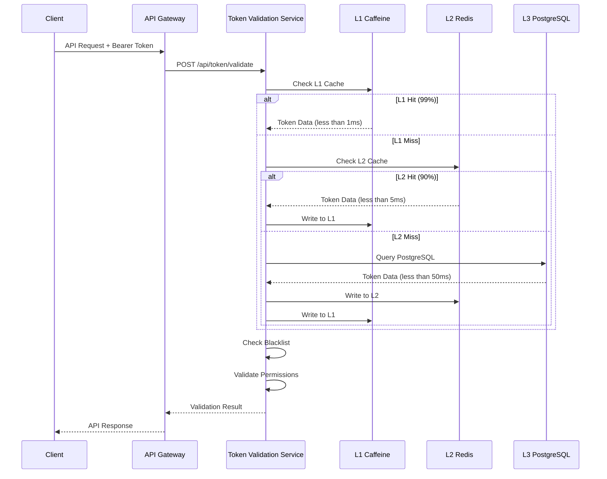
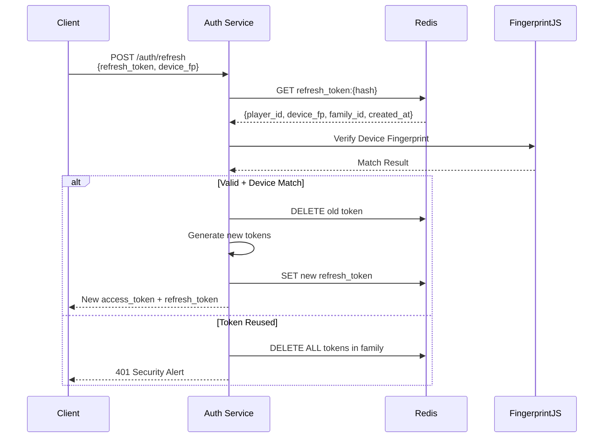
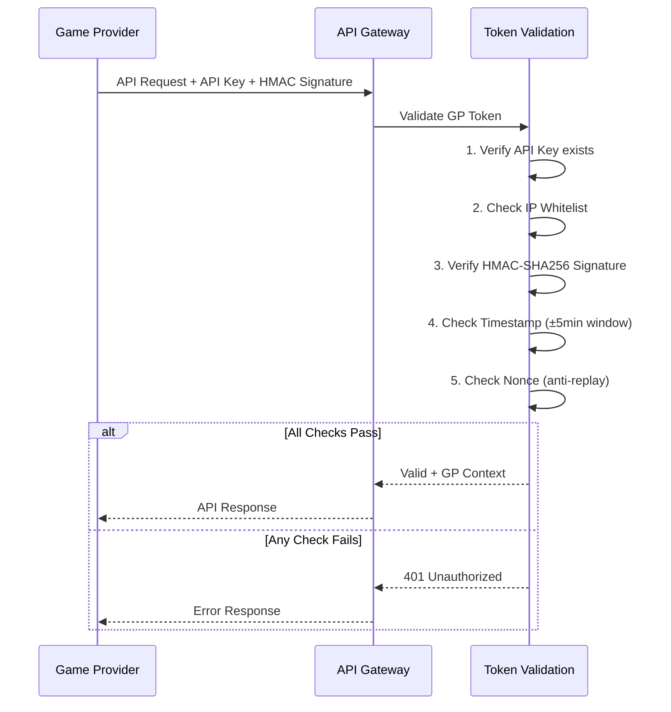
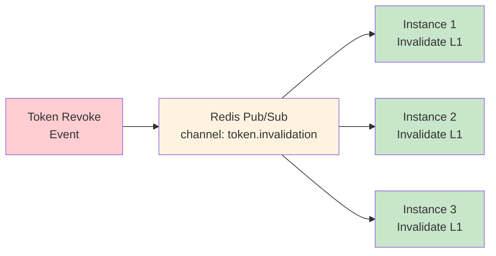

# Token 緩存性能設計 (Token Cache Performance)

> **Canonical Source**: [09-13-02 Cache Performance](../../source-archive/09_Technical_Infrastructure/09-13-02_Cache_Performance.md)
> **View**: Technical Architecture (Development & DevOps)

---

## 1. 驗證流程設計

### 1.1 Access Token 驗證流程



### 1.2 Refresh Token 驗證流程



### 1.3 Game Provider HMAC 驗證流程



---

## 2. 三層緩存策略

### 2.1 L1 緩存: Caffeine (進程內)

| 配置 | 值 | 說明 |
|------|-----|------|
| **容量** | 10,000 entries | 最大緩存條目數 |
| **TTL** | 100s (寫入後) | 寫入後 100 秒過期 |
| **Access TTL** | 60s (訪問後) | 最後訪問後 60 秒過期 |
| **命中率** | 99% | L1 直接命中 |
| **延遲** | < 1ms | JVM Heap 訪問 |

**適用場景**: 高頻訪問的 Token（如活躍玩家的 Access Token）

### 2.2 L2 緩存: Redis (分佈式)

| 配置 | 值 | 說明 |
|------|-----|------|
| **容量** | 100 萬條 | Redis Cluster |
| **TTL** | 1h | 與 Token 有效期對齊 |
| **命中率** | 90% (of L1 miss) | L1 未命中時的備選 |
| **延遲** | < 5ms | 網絡訪問 |
| **序列化** | Kryo 5.5.0 | 高性能序列化 |

### 2.3 L3 存儲: PostgreSQL (持久化)

| 配置 | 值 | 說明 |
|------|-----|------|
| **容量** | 1000 萬條+ | 所有歷史 Token |
| **命中率** | 100% (of L2 miss) | 最終數據源 |
| **延遲** | < 50ms | 磁盤 I/O |
| **用途** | Blacklist、Token Family、審計 | 持久化存儲 |

---

## 3. 緩存一致性保證

### 3.1 Redis Pub/Sub 失效通知



**流程**:
1. Token 撤銷時，寫入 Redis 黑名單
2. 發布失效事件至 Redis Pub/Sub
3. 所有實例的 L1 緩存清除對應 Token
4. 下次驗證時從 L2/L3 重新載入

### 3.2 緩存命中率分佈

```
Total Requests: 10,000 QPS
L1 Hit (Caffeine):  9,900 (99.0%) -> <1ms
L2 Hit (Redis):        90 (0.9%)  -> <5ms
L3 Hit (PostgreSQL):   10 (0.1%)  -> <50ms
──────────────────────────────────────────
Weighted Avg Latency: ~1.1ms
```

---

## 4. 性能基準

| 指標 | 目標 | 實測 |
|------|------|------|
| L1 命中率 | > 95% | 99% |
| L2 命中率 (of L1 miss) | > 85% | 90% |
| P99 延遲 (L1 hit) | < 10ms | < 1ms |
| P99 延遲 (L2 hit) | < 20ms | < 5ms |
| 單實例 QPS | > 10,000 | 12,500 |

---

## 相關文檔

- [Token Validation Service](./Token_Validation_Service.md) - 服務總覽
- [Token Validation Architecture](./Token_Validation_Architecture.md) - 驗證架構
- [Token Edge Deployment](./Token_Edge_Deployment.md) - 邊緣部署
- [Caching Strategy](./Caching_Strategy.md) - JetCache 緩存策略
