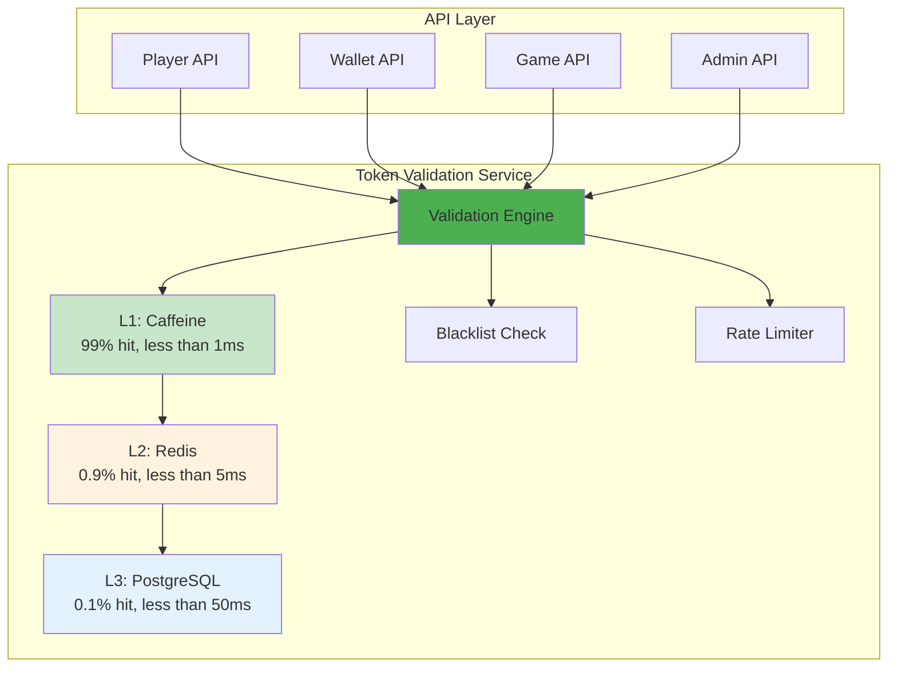

# Token 驗證架構 (Token Validation Architecture)

> **Canonical Source**: [09-13-01 Validation Architecture](../../source-archive/09_Technical_Infrastructure/09-13-01_Validation_Architecture.md)
> **View**: Technical Architecture (Development & DevOps)

---

## 1. 為什麼需要獨立的 Token 驗證服務

### 1.1 現狀問題

| 問題 | 說明 |
|------|------|
| **代碼重複** | 每個服務各自實現 Token 驗證邏輯 |
| **不一致** | 不同服務的驗證規則可能不同步 |
| **性能浪費** | 每個服務各自訪問 Redis |
| **運維困難** | 安全策略變更需修改多個服務 |

### 1.2 解決方案

集中式 Token Validation Service：
- 統一驗證邏輯（支持 4 種 Token 類型）
- 三層緩存（Caffeine + Redis + PostgreSQL）
- 集中式黑名單管理
- 統一限流與熔斷

---

## 2. 系統定位



---

## 3. 服務職責

### 3.1 核心功能

| 功能 | 說明 |
|------|------|
| **Token 解析** | JWT 解碼、HMAC 驗證、Opaque Token 查找 |
| **黑名單檢查** | 已撤銷的 Token 拒絕通過 |
| **重放攻擊防護** | Nonce + 時間戳驗證 |
| **限流** | Per-IP, Per-User, Per-Endpoint |

### 3.2 非功能性需求

| 需求 | 目標 |
|------|------|
| P99 延遲 | < 10ms (L1 命中) |
| 可用性 | 99.95% SLA |
| 吞吐量 | 10,000 QPS (單實例) |
| 緩存命中率 | > 99% |

---

## 4. API 設計

### 4.1 單一驗證接口

```
POST /api/token/validate
Content-Type: application/json

{
  "token": "eyJhbGciOiJ...",
  "token_type": "JWT_PLAYER",
  "required_permissions": ["wallet:read"]
}
```

**Response (Success)**:
```json
{
  "valid": true,
  "actor_type": "PLAYER",
  "actor_id": "player:123456",
  "tenant_id": "1",
  "permissions": ["wallet:read", "wallet:write"],
  "expires_at": "2026-02-09T10:30:00Z"
}
```

### 4.2 批量驗證接口

```
POST /api/token/validate/batch

{
  "tokens": [
    {"token": "token1", "token_type": "JWT_PLAYER"},
    {"token": "token2", "token_type": "OPAQUE_GP"}
  ]
}
```

### 4.3 撤銷接口

```
POST /api/token/revoke

{
  "token": "eyJhbGciOiJ...",
  "reason": "USER_LOGOUT"
}
```

### 4.4 內省接口

```
POST /api/token/introspect

{
  "token": "eyJhbGciOiJ..."
}
```

**Response**:
```json
{
  "active": true,
  "token_type": "JWT_PLAYER",
  "actor_id": "player:123456",
  "issued_at": "2026-02-09T10:00:00Z",
  "expires_at": "2026-02-09T10:15:00Z",
  "client_ip": "203.0.113.42"
}
```

---

## 5. Token 類型處理

| Token 類型 | 解析方式 | 驗證步驟 |
|-----------|---------|---------|
| **JWT_PLAYER** | JWT 解碼 (RS256/HS512) | 簽名 -> 過期 -> 黑名單 -> 權限 |
| **OPAQUE_GP** | Redis 查找 | API Key -> HMAC 簽名 -> IP 白名單 |
| **JWT_OAUTH** | JWT 解碼 (RS256) | 簽名 -> 過期 -> Scope -> IP |
| **JWT_ADMIN** | JWT 解碼 + MFA | 簽名 -> 過期 -> MFA 狀態 -> RBAC |

---

## 相關文檔

- [Token Validation Service](./Token_Validation_Service.md) - 服務總覽
- [Token Cache Performance](./Token_Cache_Performance.md) - 緩存策略
- [Token Edge Deployment](./Token_Edge_Deployment.md) - 邊緣部署
