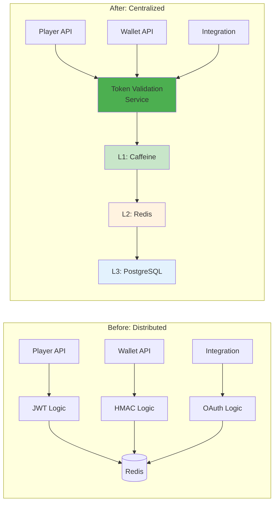

# Token 驗證服務設計 (Token Validation Service)

**Document Metadata**:
- Version: 1.0.0
- Created: 2026-02-09
- Status: Active
- Priority: P1 (High)
- Owner: Backend Team + Infrastructure Team
- Source: [09-13 Token Validation Service](../../source-archive/09_Technical_Infrastructure/09-13_Token_Validation_Service.md)

---

## 1. 概述

Token Validation Service 是統一的 Token 驗證服務，支持 4 種角色的 Token 驗證：

| 角色 | Token 類型 | 驗證需求 |
|------|----------|---------|
| **玩家 (Player)** | JWT (Redis Opaque) | 高頻（每次 API 調用） |
| **遊戲商 (GP)** | Opaque Token + HMAC | 中頻（遊戲回調） |
| **第三方** | JWT (OAuth 2.0) | 低頻（數據同步） |
| **後台用戶** | JWT + MFA | 中頻（後台操作） |

### 1.1 設計目標

| 目標 | 指標 | 優先級 |
|------|------|--------|
| **高性能** | P99 < 10ms (L1 命中) | P0 |
| **高可用** | SLA 99.95% | P0 |
| **高吞吐** | 10,000 QPS (單實例) | P0 |
| **緩存命中率** | > 99% (L1 + L2) | P0 |

### 1.2 架構對比

---

## 2. API 端點

| 端點 | 用途 |
|------|------|
| `POST /api/token/validate` | 單一 Token 驗證 |
| `POST /api/token/validate/batch` | 批量 Token 驗證 |
| `POST /api/token/revoke` | 撤銷 Token |
| `POST /api/token/introspect` | Token 內省查詢 |

---

## 3. 三層緩存架構

| 層級 | 技術 | 命中率 | 延遲 | 容量 |
|------|------|--------|------|------|
| **L1** | Caffeine | 99% | < 1ms | 10,000 條 |
| **L2** | Redis | 0.9% | < 5ms | 100 萬條 |
| **L3** | PostgreSQL | 0.1% | < 50ms | 1000 萬條+ |

---

## 4. 錯誤碼

| 錯誤碼 | HTTP Status | 說明 |
|--------|-----------|------|
| `TOKEN_EXPIRED` | 401 | Token 已過期 |
| `TOKEN_INVALID_SIGNATURE` | 401 | 簽名驗證失敗 |
| `TOKEN_BLACKLISTED` | 401 | Token 在黑名單中 |
| `TOKEN_MALFORMED` | 400 | Token 格式錯誤 |
| `RATE_LIMIT_EXCEEDED` | 429 | 超出限流 |
| `NONCE_REUSED` | 403 | Nonce 重複使用 |

---

## 5. 子文檔導航

| 文檔 | 內容 |
|------|------|
| [Token Validation Architecture](./Token_Validation_Architecture.md) | 架構概覽、服務職責、API 設計 |
| [Token Cache Performance](./Token_Cache_Performance.md) | 驗證流程、三層緩存策略 |
| [Token Edge Deployment](./Token_Edge_Deployment.md) | 重放防護、限流熔斷、高可用、監控 |

---

## 6. 實施進度

| Phase | 內容 | 時間 | 狀態 |
|-------|------|------|------|
| **Phase 1** | 核心驗證（單一驗證、三層緩存、限流） | Week 1-2 | Planned |
| **Phase 2** | 高級特性（批量驗證、撤銷、Nonce、HMAC） | Week 3 | Planned |
| **Phase 3** | 性能優化（熔斷、降級、Multi-AZ） | Week 4 | Planned |

---

## 相關文檔

- [Multi Actor Token Security](./Multi_Actor_Token_Security.md) - 多主體 Token 安全
- [OAuth Refresh Token](./OAuth_Refresh_Token.md) - OAuth Refresh Token
- [Authentication Architecture](./Authentication_Architecture.md) - 認證架構
