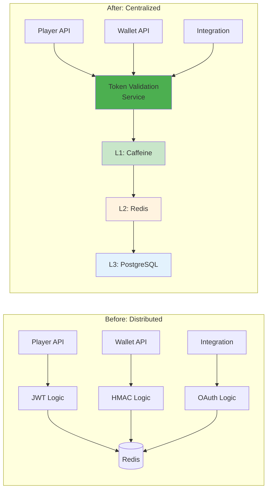
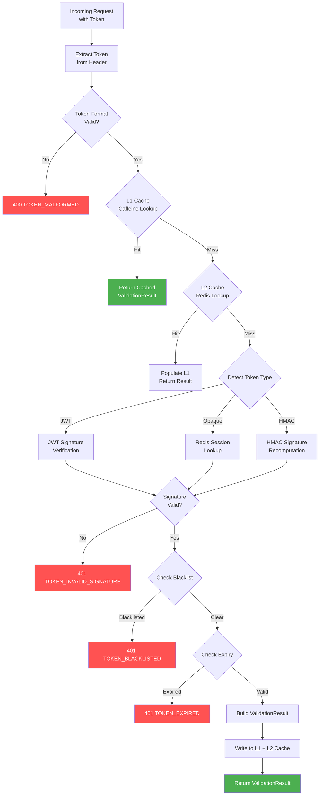

# Token 驗證服務設計 (Token Validation Service)

> **Business Requirements**: N/A — Pure technical infrastructure document
> **Canonical Source**: [09-13 Token Validation Service](../../source-archive/09_Technical_Infrastructure/09-13_Token_Validation_Service.md)
> **View**: Technical Architecture (Development & DevOps)

---

## 1. 概述

Token Validation Service 是統一的 Token 驗證服務，支持 4 種角色的 Token 驗證：

| 角色 | Token 類型 | 驗證需求 |
|------|----------|---------|
| **玩家 (Player)** | JWT (Redis Opaque) | 高頻（每次 API 調用） |
| **遊戲商 (GP)** | Opaque Token + HMAC | 中頻（遊戲回調） |
| **第三方** | JWT (OAuth 2.0) | 低頻（數據同步） |
| **後台用戶** | JWT + MFA | 中頻（後台操作） |

### 1.1 設計目標

| 目標 | 指標 | 優先級 |
|------|------|--------|
| **高性能** | P99 < 10ms (L1 命中) | P0 |
| **高可用** | SLA 99.95% | P0 |
| **高吞吐** | 10,000 QPS (單實例) | P0 |
| **緩存命中率** | > 99% (L1 + L2) | P0 |

### 1.2 架構對比



---

## 2. API 端點

| 端點 | 用途 |
|------|------|
| `POST /api/token/validate` | 單一 Token 驗證 |
| `POST /api/token/validate/batch` | 批量 Token 驗證 |
| `POST /api/token/revoke` | 撤銷 Token |
| `POST /api/token/introspect` | Token 內省查詢 |

---

## 3. 三層緩存架構

| 層級 | 技術 | 命中率 | 延遲 | 容量 |
|------|------|--------|------|------|
| **L1** | Caffeine | 99% | < 1ms | 10,000 條 |
| **L2** | Redis | 0.9% | < 5ms | 100 萬條 |
| **L3** | PostgreSQL | 0.1% | < 50ms | 1000 萬條+ |

---

## 4. 錯誤碼

| 錯誤碼 | HTTP Status | 說明 |
|--------|-----------|------|
| `TOKEN_EXPIRED` | 401 | Token 已過期 |
| `TOKEN_INVALID_SIGNATURE` | 401 | 簽名驗證失敗 |
| `TOKEN_BLACKLISTED` | 401 | Token 在黑名單中 |
| `TOKEN_MALFORMED` | 400 | Token 格式錯誤 |
| `RATE_LIMIT_EXCEEDED` | 429 | 超出限流 |
| `NONCE_REUSED` | 403 | Nonce 重複使用 |

---

## 5. 子文檔導航

| 文檔 | 內容 |
|------|------|
| [Token Validation Architecture](./Token_Validation_Architecture.md) | 架構概覽、服務職責、API 設計 |
| [Token Cache Performance](./Token_Cache_Performance.md) | 驗證流程、三層緩存策略 |
| [Token Edge Deployment](./Token_Edge_Deployment.md) | 重放防護、限流熔斷、高可用、監控 |

---

## 6. 實施進度

| Phase | 內容 | 時間 | 狀態 |
|-------|------|------|------|
| **Phase 1** | 核心驗證（單一驗證、三層緩存、限流） | Week 1-2 | Planned |
| **Phase 2** | 高級特性（批量驗證、撤銷、Nonce、HMAC） | Week 3 | Planned |
| **Phase 3** | 性能優化（熔斷、降級、Multi-AZ） | Week 4 | Planned |

---

## 7. Validation Pipeline Architecture



## 8. Token Validation Service Implementation

```java
@Service
@RequiredArgsConstructor
public class TokenValidationService {

    private final Cache<String, ValidationResult> l1Cache;  // Caffeine
    private final RedissonClient redissonClient;
    private final JwtTokenValidator jwtValidator;
    private final HmacTokenValidator hmacValidator;
    private final TokenBlacklistDao tokenBlacklistDao;

    /**
     * Validate token with 3-tier cache strategy.
     * L1 (Caffeine): ~1ms, L2 (Redis): ~5ms, L3 (DB): ~50ms
     */
    public ValidationResult validate(TokenValidationRequest request) {
        String token = request.getToken();

        // L1: Caffeine local cache
        ValidationResult cached = l1Cache.getIfPresent(token);
        if (cached != null) {
            return cached;
        }

        // L2: Redis distributed cache
        RBucket<ValidationResult> bucket = redissonClient.getBucket(
            "token:validated:" + hashToken(token)
        );
        cached = bucket.get();
        if (cached != null) {
            l1Cache.put(token, cached);
            return cached;
        }

        // L3: Full validation pipeline
        ValidationResult result = performFullValidation(token);

        // Populate caches on success
        if (result.isValid()) {
            long ttlSeconds = result.getRemainingTtlSeconds();
            l1Cache.put(token, result);
            bucket.set(result, Duration.ofSeconds(Math.min(ttlSeconds, 300)));
        }

        return result;
    }

    private ValidationResult performFullValidation(String token) {
        TokenType type = TokenTypeDetector.detect(token);

        return switch (type) {
            case JWT -> jwtValidator.validate(token);
            case OPAQUE -> validateOpaqueToken(token);
            case HMAC -> hmacValidator.validate(token);
        };
    }

    private ValidationResult validateOpaqueToken(String token) {
        RBucket<TokenSession> session = redissonClient.getBucket("session:" + token);
        TokenSession data = session.get();
        if (data == null) {
            return ValidationResult.invalid("TOKEN_EXPIRED");
        }
        if (tokenBlacklistDao.existsByToken(token)) {
            return ValidationResult.invalid("TOKEN_BLACKLISTED");
        }
        return ValidationResult.valid(data.getActorId(), data.getActorType(), data.getPermissions());
    }

    private String hashToken(String token) {
        return Hashing.sha256().hashString(token, StandardCharsets.UTF_8).toString();
    }
}
```

## 9. Redis Token Cache Strategy

### Cache Key Design

| Key Pattern | TTL | Purpose |
|-------------|-----|---------|
| `token:validated:{hash}` | min(remaining_ttl, 300s) | L2 validation result cache |
| `session:{opaque_token}` | 24h (player), 8h (admin) | Opaque token session data |
| `token:blacklist:{hash}` | Original token TTL | Revoked token tracking |
| `token:nonce:{nonce}` | 60s | Replay attack prevention |
| `token:rate:{actor_id}` | 60s (sliding window) | Per-actor rate limiting |

### Cache Eviction on Token Revocation

```java
@Manager
@RequiredArgsConstructor
public class TokenRevocationManager {

    private final Cache<String, ValidationResult> l1Cache;
    private final RedissonClient redissonClient;
    private final TokenBlacklistDao tokenBlacklistDao;

    /**
     * Revoke token across all cache layers.
     * Uses Redis Pub/Sub to invalidate L1 caches on all instances.
     */
    @Transactional(rollbackFor = Throwable.class)
    public void revokeToken(String token, String reason) {
        String hash = hashToken(token);

        // L3: Persist to blacklist table
        tokenBlacklistDao.insert(TokenBlacklist.builder()
            .tokenHash(hash)
            .reason(reason)
            .revokedAt(LocalDateTime.now())
            .build());

        // L2: Remove from Redis cache
        redissonClient.getBucket("token:validated:" + hash).delete();
        redissonClient.getBucket("session:" + token).delete();

        // L1: Publish invalidation event for all instances
        redissonClient.getTopic("token:invalidation")
            .publish(new TokenInvalidationEvent(hash));
    }
}
```

## 10. gRPC Validation Endpoint

For internal service-to-service token validation, a gRPC endpoint provides lower latency than REST.

```protobuf
syntax = "proto3";

package net.lab1024.sa.token;

service TokenValidationGrpc {
    // Validate a single token (P99 < 5ms with L1 hit)
    rpc Validate (ValidateRequest) returns (ValidateResponse);

    // Batch validate tokens (for bulk operations)
    rpc ValidateBatch (ValidateBatchRequest) returns (ValidateBatchResponse);

    // Revoke a token across all cache layers
    rpc Revoke (RevokeRequest) returns (RevokeResponse);
}

message ValidateRequest {
    string token = 1;
    string expected_actor_type = 2;  // PLAYER, GP, THIRD_PARTY, ADMIN
    repeated string required_permissions = 3;
}

message ValidateResponse {
    bool valid = 1;
    string actor_id = 2;
    string actor_type = 3;
    repeated string permissions = 4;
    string error_code = 5;
    int64 remaining_ttl_seconds = 6;
}

message ValidateBatchRequest {
    repeated ValidateRequest requests = 1;
}

message ValidateBatchResponse {
    repeated ValidateResponse responses = 1;
}

message RevokeRequest {
    string token = 1;
    string reason = 2;
}

message RevokeResponse {
    bool success = 1;
}
```

---

## 11. Database Schema

```sql
-- Token blacklist for revoked tokens
CREATE TABLE t_token_blacklist (
    id              BIGSERIAL PRIMARY KEY,
    token_hash      VARCHAR(64) NOT NULL UNIQUE,
    actor_id        BIGINT,
    actor_type      VARCHAR(20),
    reason          VARCHAR(200) NOT NULL,
    revoked_at      TIMESTAMP NOT NULL DEFAULT NOW(),
    expires_at      TIMESTAMP NOT NULL,
    created_at      TIMESTAMP NOT NULL DEFAULT NOW()
);

CREATE INDEX idx_blacklist_hash ON t_token_blacklist(token_hash);
CREATE INDEX idx_blacklist_expires ON t_token_blacklist(expires_at);

-- Token session storage (for opaque tokens)
CREATE TABLE t_token_session (
    id              BIGSERIAL PRIMARY KEY,
    token_id        VARCHAR(64) NOT NULL UNIQUE,
    actor_id        BIGINT NOT NULL,
    actor_type      VARCHAR(20) NOT NULL,
    permissions     JSONB,
    device_info     JSONB,
    ip_address      VARCHAR(45),
    created_at      TIMESTAMP NOT NULL DEFAULT NOW(),
    expires_at      TIMESTAMP NOT NULL,
    last_accessed   TIMESTAMP NOT NULL DEFAULT NOW()
);

CREATE INDEX idx_session_actor ON t_token_session(actor_id, actor_type);
CREATE INDEX idx_session_expires ON t_token_session(expires_at);

-- Token validation metrics (for monitoring)
CREATE TABLE t_token_validation_metrics (
    id              BIGSERIAL PRIMARY KEY,
    metric_date     DATE NOT NULL,
    actor_type      VARCHAR(20) NOT NULL,
    total_requests  BIGINT NOT NULL DEFAULT 0,
    l1_hits         BIGINT NOT NULL DEFAULT 0,
    l2_hits         BIGINT NOT NULL DEFAULT 0,
    l3_hits         BIGINT NOT NULL DEFAULT 0,
    failures        BIGINT NOT NULL DEFAULT 0,
    avg_latency_ms  INTEGER NOT NULL DEFAULT 0,
    created_at      TIMESTAMP NOT NULL DEFAULT NOW(),
    CONSTRAINT uk_token_metrics UNIQUE (metric_date, actor_type)
);

CREATE INDEX idx_metrics_date ON t_token_validation_metrics(metric_date DESC);
```

---

## Related Documentation

- [Multi Actor Token Security](./Multi_Actor_Token_Security.md) - Multi-actor token security model
- [OAuth Refresh Token](./OAuth_Refresh_Token.md) - OAuth refresh token implementation
- [Authentication Architecture](./Authentication_Architecture.md) - Authentication architecture overview
