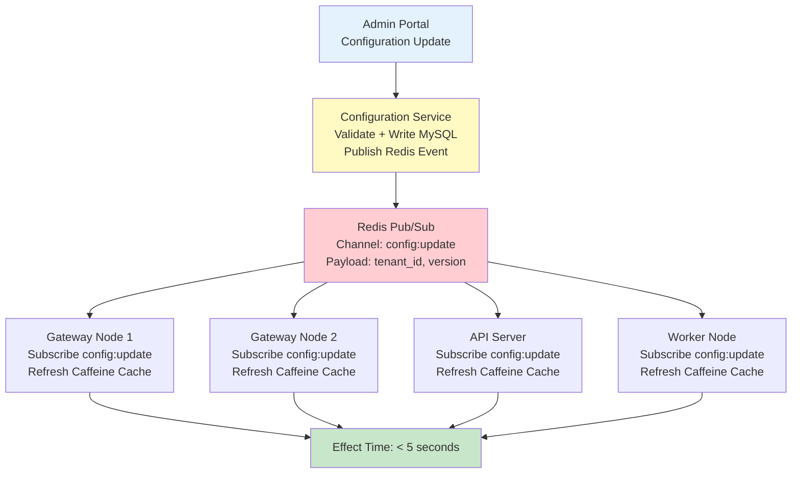
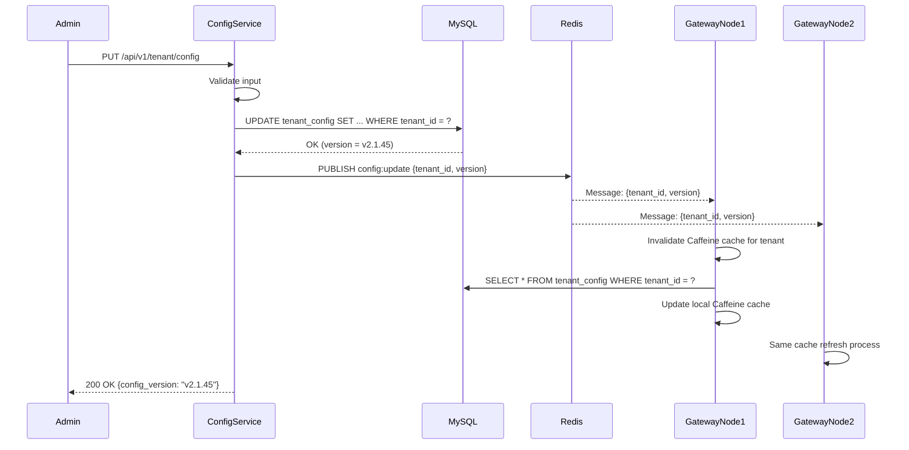

# 租戶配置技術架構（Tenant Configuration Technical Architecture）

> **業務需求**: [租戶配置需求](../../requirements/10_Platform_Operations/01_Tenant_Configuration_Requirements.md)
> **規範來源**: [source-archive/10_Platform_Management/10-02_Tenant_Configuration.md](../../source-archive/10_Platform_Management/10-02_Tenant_Configuration.md)
> **目標讀者**: Architects, Backend Developers

---

## 1. Architecture Overview

The Tenant Configuration system provides dynamic, zero-downtime configuration management with hot-reload capabilities across distributed gateway nodes. It uses Redis Pub/Sub for real-time synchronization and Caffeine local cache for performance.

---

## 2. Configuration Sync Architecture



### 2.1 Sync Flow Detail



---

## 3. Configuration Priority Implementation

```java
/**
 * Configuration resolution with priority chain
 *
 * Priority (highest to lowest):
 * 1. Runtime Override (operations real-time adjustment)
 * 2. Tenant Config (tenant custom settings)
 * 3. Template Config (market template defaults)
 * 4. System Default (platform global defaults)
 */
@Slf4j
@Service
@RequiredArgsConstructor
public class TenantConfigResolver {

    private final TenantConfigDao tenantConfigDao;
    private final ConfigTemplateDao configTemplateDao;
    private final SystemDefaultConfigDao systemDefaultConfigDao;
    private final RuntimeOverrideDao runtimeOverrideDao;

    /**
     * Resolve effective configuration value with priority chain
     */
    public Object resolveConfigValue(String tenantId, String configKey) {
        // Priority 1: Runtime Override
        Object runtimeValue = runtimeOverrideDao.getValue(tenantId, configKey);
        if (runtimeValue != null) {
            log.debug("Config {} resolved from runtime override", configKey);
            return runtimeValue;
        }

        // Priority 2: Tenant Config
        Object tenantValue = tenantConfigDao.getValue(tenantId, configKey);
        if (tenantValue != null) {
            log.debug("Config {} resolved from tenant config", configKey);
            return tenantValue;
        }

        // Priority 3: Template Config
        String templateId = tenantConfigDao.getTemplateId(tenantId);
        if (templateId != null) {
            Object templateValue = configTemplateDao.getValue(templateId, configKey);
            if (templateValue != null) {
                log.debug("Config {} resolved from template {}", configKey, templateId);
                return templateValue;
            }
        }

        // Priority 4: System Default
        log.debug("Config {} resolved from system default", configKey);
        return systemDefaultConfigDao.getValue(configKey);
    }
}
```

---

## 4. API Specifications

### 4.1 Get Tenant Configuration

```http
GET /api/v1/tenant/config

Headers:
  Authorization: Bearer {token}
  X-Tenant-ID: {tenantId}

Response (200 OK):
{
  "code": 0,
  "data": {
    "site_name": "Casino VN",
    "primary_domain": "casino-vn.com",
    "base_currency": "VND",
    "timezone": "Asia/Ho_Chi_Minh",
    "maintenance_mode": false,
    "registration_enabled": true,
    "allowed_countries": ["VN", "TH", "ID"],
    "payment_methods": ["VietQR", "MoMo", "Bank Transfer"],
    "kyc_level": "BASIC",
    "limits": {
      "min_deposit": 100000,
      "max_withdrawal_daily": 50000000
    }
  }
}
```

### 4.2 Update Tenant Configuration

```http
PUT /api/v1/tenant/config

Request Body:
{
  "maintenance_mode": true,
  "maintenance_message": "System upgrading, estimated 2 hours",
  "allowed_countries": ["VN", "TH"]
}

Response (200 OK):
{
  "code": 0,
  "msg": "Configuration updated, syncing to all nodes within 5 seconds",
  "data": {
    "config_version": "v2.1.45",
    "updated_at": "2026-01-27T10:30:00Z"
  }
}
```

---

## 5. Configuration Template System

### 5.1 Template Schema (JSON)

```json
{
  "template_name": "Asia-VN",
  "currency": "VND",
  "timezone": "Asia/Ho_Chi_Minh",
  "payment_methods": ["VietQR", "MoMo", "ZaloPay"],
  "languages": ["vi", "en"],
  "game_providers": ["PG Soft", "Pragmatic Play", "Evolution"],
  "kyc_level": "BASIC",
  "withdrawal_limit_daily": 50000000,
  "auto_features": {
    "auto_approve_withdrawal_under": 1000000,
    "auto_enable_bonus_on_deposit": true
  }
}
```

---

## 6. Configuration Validation

```java
/**
 * Backend configuration validation service
 */
@Slf4j
@Service
@RequiredArgsConstructor
public class TenantConfigValidator {

    /**
     * Validate configuration changes before applying
     *
     * @param tenantId tenant identifier
     * @param changes configuration changes to validate
     * @return validation result
     */
    public ValidationResult validate(String tenantId, Map<String, Object> changes) {
        List<String> errors = new ArrayList<>();

        // Domain format validation
        if (changes.containsKey("primary_domain")) {
            String domain = (String) changes.get("primary_domain");
            if (!DOMAIN_PATTERN.matcher(domain).matches()) {
                errors.add("Invalid domain format: " + domain);
            }
        }

        // IP address format validation (IPv4/IPv6)
        if (changes.containsKey("office_ip_whitelist")) {
            List<String> ips = (List<String>) changes.get("office_ip_whitelist");
            for (String ip : ips) {
                if (!InetAddressValidator.getInstance().isValid(ip)) {
                    errors.add("Invalid IP address: " + ip);
                }
            }
        }

        // Blacklist/whitelist conflict check
        if (changes.containsKey("allowed_countries") && changes.containsKey("blocked_countries")) {
            Set<String> allowed = new HashSet<>((List<String>) changes.get("allowed_countries"));
            Set<String> blocked = new HashSet<>((List<String>) changes.get("blocked_countries"));
            allowed.retainAll(blocked);
            if (!allowed.isEmpty()) {
                errors.add("Countries in both allow and block list: " + allowed);
            }
        }

        return errors.isEmpty()
            ? ValidationResult.success()
            : ValidationResult.failure(errors);
    }

    private static final Pattern DOMAIN_PATTERN = Pattern.compile(
        "^[a-zA-Z0-9]([a-zA-Z0-9-]*[a-zA-Z0-9])?(\\.[a-zA-Z0-9]([a-zA-Z0-9-]*[a-zA-Z0-9])?)*\\.[a-zA-Z]{2,}$"
    );
}
```

---

## 7. Audit Log Implementation

### 7.1 Audit Log Schema

```json
{
  "audit_id": "audit_20260127_001",
  "tenant_id": 123,
  "user_id": "admin_001",
  "action": "UPDATE_CONFIG",
  "target": "allowed_countries",
  "old_value": ["VN", "TH", "ID"],
  "new_value": ["VN", "TH"],
  "reason": "Indonesia market regulation change",
  "approval_status": "APPROVED",
  "approved_by": "platform_admin_005",
  "timestamp": "2026-01-27T10:30:00Z",
  "ip_address": "192.168.1.100"
}
```

### 7.2 Audit Log Database

```sql
CREATE TABLE tenant_config_audit (
    audit_id BIGINT PRIMARY KEY AUTO_INCREMENT,
    tenant_id BIGINT NOT NULL,
    user_id VARCHAR(100) NOT NULL,
    action VARCHAR(50) NOT NULL,
    target_field VARCHAR(200) NOT NULL,
    old_value JSON,
    new_value JSON,
    reason VARCHAR(500),
    approval_status VARCHAR(20),
    approved_by VARCHAR(100),
    ip_address VARCHAR(45),
    created_at TIMESTAMP DEFAULT CURRENT_TIMESTAMP,

    INDEX idx_tenant_created (tenant_id, created_at),
    INDEX idx_action (action),
    INDEX idx_user (user_id)
) ENGINE=InnoDB DEFAULT CHARSET=utf8mb4;
```

---

## 8. Health Check Implementation

```java
/**
 * Configuration health checker
 * Validates all gateway nodes have consistent config versions
 */
@Slf4j
@Service
@RequiredArgsConstructor
public class ConfigHealthChecker {

    private final RedisTemplate<String, String> redisTemplate;
    private final TenantConfigDao tenantConfigDao;

    /**
     * Check all nodes have consistent config version
     * Runs every 30 seconds via Snail-Job
     */
    public HealthCheckResult checkConfigConsistency(String tenantId) {
        String expectedVersion = tenantConfigDao.getCurrentVersion(tenantId);

        // Query all node versions from Redis
        Set<String> nodeVersions = redisTemplate.opsForHash()
            .entries("config:versions:" + tenantId)
            .values().stream()
            .map(Object::toString)
            .collect(Collectors.toSet());

        boolean consistent = nodeVersions.size() == 1
            && nodeVersions.contains(expectedVersion);

        if (!consistent) {
            log.warn("Config version inconsistency detected for tenant {}. "
                + "Expected: {}, Found: {}", tenantId, expectedVersion, nodeVersions);
        }

        return new HealthCheckResult(consistent, expectedVersion, nodeVersions);
    }
}
```

---

## 9. SmartAdmin Architecture Mapping

| Layer | Class | Responsibility |
|-------|-------|---------------|
| **Controller** | `TenantConfigController` | REST API for config CRUD |
| **Service** | `TenantConfigService` | Config resolution, validation (Vavr Option) |
| **Manager** | `TenantConfigManager` | @Transactional config updates with audit logging |
| **Dao** | `TenantConfigDao` | MyBatis Plus mapper |
| **Entity** | `TenantConfigEntity` | Database entity |

---

**文件版本**: 4.0.0
**最後更新**: 2026-02-12
**維護團隊**: Platform Team & DevOps Team
