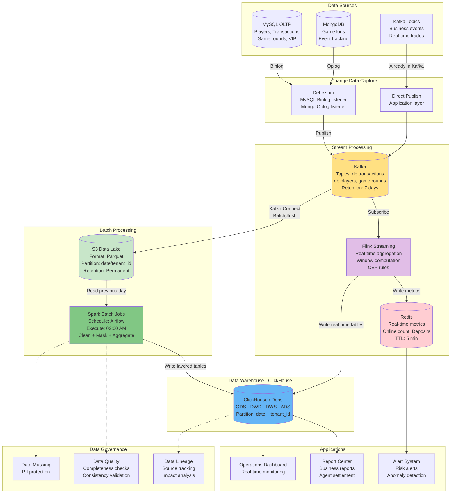
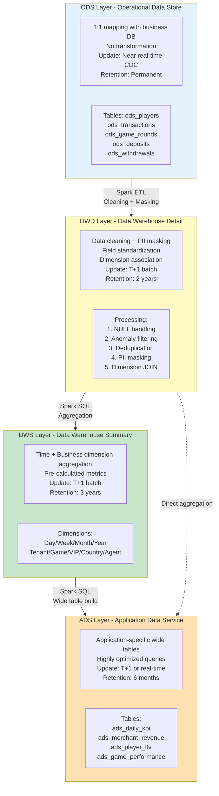
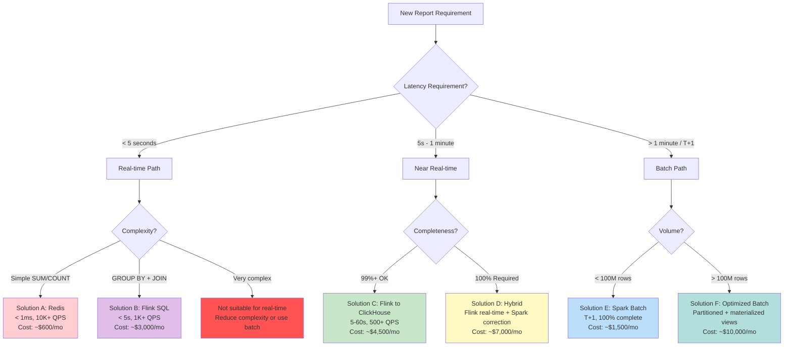

# 資料管道技術架構（Data Pipeline Technical Architecture）

> **業務需求**: [資料管道需求](../../requirements/10_Platform_Operations/03_Data_Pipeline_Requirements.md)
> **規範來源**: [source-archive/10_Platform_Management/10-04_Data_Pipeline_Architecture.md](../../source-archive/10_Platform_Management/10-04_Data_Pipeline_Architecture.md)
> **目標讀者**: Architects, Backend Developers, Data Engineers

---

## 1. Architecture Overview

The Data Pipeline uses a **Lambda Architecture variant** with dual processing paths: Flink for stream processing (real-time metrics) and Spark for batch processing (T+1 reports). Data flows through a four-layer warehouse (ODS-DWD-DWS-ADS) with ClickHouse as the OLAP engine.

---

## 2. Complete Data Pipeline Architecture



---

## 3. Data Layering Architecture (Four-Layer Detail)



### 3.1 Four-Layer Comparison Matrix

| Property | ODS | DWD | DWS | ADS |
|----------|-----|-----|-----|-----|
| **Source** | Business DB (MySQL/Mongo) | ODS layer | DWD layer | DWS (or DWD) |
| **Granularity** | Raw detail | Cleaned detail | Aggregated summary | Application wide table |
| **Volume** | Largest (TB) | Large (TB) | Medium (GB) | Small (GB) |
| **Update** | Near real-time (CDC) | T+1 batch | T+1 batch | T+1 or real-time |
| **Query Frequency** | Very low (ETL only) | Low (drill-down) | Medium (analysis) | Very high (frontend) |
| **Index Strategy** | Partition index | Partition + secondary | Partition + aggregation | Full index optimization |
| **Retention** | Permanent | 2 years | 3 years | 6 months |
| **PII Masking** | No (raw) | Yes (fully masked) | Yes | Yes |
| **Access** | DBA only | Data engineers | BI analysts + data scientists | All applications |

---

## 4. Real-time vs Batch Decision Matrix



### 4.1 Solution Comparison

| Solution | Latency | Completeness | Complexity | Cost/Month | Use Case |
|----------|---------|-------------|-----------|-----------|----------|
| **A: Redis** | < 1ms | May miss | Simple | $600 | Online count, today's deposits |
| **B: Flink SQL** | < 5s | 99%+ | Medium | $3,000 | Real-time leaderboard, anomaly detection |
| **C: Flink->CH** | 5-60s | 99%+ | High | $4,500 | Operations dashboard |
| **D: Hybrid** | RT + T+1 | 100% | Very high | $7,000 | Financial reports, settlement |
| **E: Spark** | T+1 | 100% | Very high | $1,500 | Business reports |
| **F: Optimized** | T+1 | 100% | Very high | $10,000 | PB-scale analytics, ML |

---

## 5. Performance Benchmarks

### 5.1 ClickHouse vs MySQL

| Operation | MySQL (OLTP) | ClickHouse (OLAP) | Improvement |
|-----------|-------------|-------------------|-------------|
| COUNT(*) - 100M rows | 30s | 0.5s | 60x |
| SUM(amount) - 100M rows | 45s | 0.8s | 56x |
| GROUP BY + AVG - 100M rows | 120s | 2s | 60x |
| Complex JOIN (3 tables) - 10M rows | 300s | 5s | 60x |
| Write TPS | 10,000 | 100,000+ | 10x |

---

## 6. ETL Implementation

### 6.1 Airflow DAG Schedule

```text
02:00 - 02:15  ODS -> DWD (Data cleaning + PII masking)
02:15 - 02:45  DWD -> DWS (Aggregation computation)
02:45 - 03:00  DWS -> ADS (Wide table construction)
03:00 - 03:05  Data quality checks
03:05          Completion notification sent
```

### 6.2 Quality Check SQL

```sql
-- ODS to DWD: Record count consistency check
SELECT
    'ods_transactions' AS source_table,
    COUNT(*) AS source_count,
    (SELECT COUNT(*) FROM dwd_transaction_detail
     WHERE date = '2026-02-08') AS target_count
FROM ods_transactions
WHERE date = '2026-02-08';

-- DWD to DWS: Aggregation accuracy check
SELECT
    date,
    SUM(amount) AS dwd_total,
    (SELECT total_revenue FROM dws_daily_revenue
     WHERE date = '2026-02-08') AS dws_total,
    ABS(SUM(amount) - (SELECT total_revenue FROM dws_daily_revenue
     WHERE date = '2026-02-08')) < 0.01 AS is_accurate
FROM dwd_transaction_detail
WHERE date = '2026-02-08';
```

### 6.3 Data Correction (Idempotent Overwrite)

```sql
-- When upstream produces a voided transaction:
-- Strategy: Drop affected partition and re-run ETL from ODS

ALTER TABLE dws_revenue DROP PARTITION '2023-10-01';

-- Then re-execute the full ETL pipeline for that date:
-- Airflow: airflow trigger_dag etl_pipeline --conf '{"date": "2023-10-01"}'
```

---

## 7. Multi-Tenant OLAP Implementation

```sql
-- All ClickHouse tables are partitioned by tenant_id
-- Queries WITHOUT tenant_id filter are REJECTED

-- Tenant-level query (mandatory for all non-admin users)
SELECT date, SUM(ggr) AS total_ggr
FROM dws_daily_revenue
WHERE tenant_id = 'tenant_001'
  AND date BETWEEN '2026-01-01' AND '2026-01-31'
GROUP BY date;

-- Platform-level query (admin only - cross-tenant)
SELECT tenant_id, SUM(ggr) AS total_ggr
FROM dws_daily_revenue
WHERE date BETWEEN '2026-01-01' AND '2026-01-31'
GROUP BY tenant_id
ORDER BY total_ggr DESC;
```

---

## 8. Data Governance Implementation

### 8.1 PII Masking Rules

```java
/**
 * PII masking implementation for DWD layer
 * Applied during ODS -> DWD ETL
 */
public class PiiMaskingService {

    public String maskName(String name) {
        if (name == null || name.length() < 2) return "***";
        return name.charAt(0) + "** " + name.charAt(name.length() - 1) + "**";
    }

    public String maskPhone(String phone) {
        if (phone == null || phone.length() < 7) return "***";
        return phone.substring(0, 4) + "***" + phone.substring(phone.length() - 3);
    }

    public String maskEmail(String email) {
        if (email == null || !email.contains("@")) return "***";
        int atIndex = email.indexOf('@');
        return email.charAt(0) + "***" + email.substring(atIndex);
    }

    public String maskIdNumber(String id) {
        if (id == null || id.length() < 6) return "***";
        return id.substring(0, 3) + "****" + id.substring(id.length() - 2);
    }
}
```

### 8.2 Data Retention Implementation

```sql
-- Hot to Warm migration (after 3 months)
ALTER TABLE dws_daily_revenue
    MOVE PARTITION '2025-11'
    TO VOLUME 'warm_storage';

-- Warm to Cold archival (after 1 year)
-- Export to S3 Glacier via Spark job
-- Then drop from ClickHouse
ALTER TABLE dws_daily_revenue
    DROP PARTITION '2024-12';
```

---

## 9. Technology Stack Selection

| Component | Technology | Rationale |
|-----------|-----------|-----------|
| **CDC** | Debezium | Stable, supports MySQL Binlog |
| **Message Queue** | Kafka | High throughput |
| **Stream Processing** | Apache Flink | Millisecond latency, CEP support |
| **Batch Processing** | Apache Spark | Complex ETL, SQL support |
| **OLAP Engine** | ClickHouse | Columnar storage, 60x faster aggregation |
| **Data Lake** | S3 (Parquet) | Immutable source, cost-effective |
| **Scheduler** | Apache Airflow | DAG management |
| **Cache** | Redis Cluster | Real-time metrics, TTL support |
| **Monitoring** | Prometheus + Grafana | Real-time pipeline monitoring |

---

## 10. Design Principles

```java
/**
 * Five core design principles for the data pipeline:
 *
 * 1. Progressive Processing: Each layer only does its own work, no cross-layer processing
 *    - Benefit: Clear responsibilities, fault isolation, easy troubleshooting
 *
 * 2. Idempotency Guarantee: All ETL tasks support repeated execution with consistent results
 *    - Implementation: INSERT OVERWRITE or DROP PARTITION + INSERT
 *
 * 3. Partitioning Strategy: All tables partitioned by date, multi-tenant tables add tenant_id
 *    - Benefit: Supports incremental updates, avoids full table scans
 *
 * 4. Data Lineage: Every layer traceable to its source
 *    - Implementation: ETL logs record source_table -> target_table mapping
 *    - Tooling: Apache Atlas / DataHub
 *
 * 5. Quality First: Better to delay reports than serve incorrect data
 *    - Implementation: Quality checks after each ETL layer
 *    - Threshold: If anomaly rate > 5%, block downstream ETL and trigger alert
 */
```

---

## 11. Operational Monitoring Targets

| Metric | Target | Alert Threshold |
|--------|--------|----------------|
| ETL per-layer execution | < 15 minutes | > 20 minutes |
| Total ETL pipeline | < 1 hour | > 1.5 hours |
| ADS data availability | Before 03:00 AM | After 03:30 AM (SLA: 99.5%) |
| Data quality pass rate | 100% | Any failure |
| ADS query latency | < 3s (P95) | > 5s |
| ODS storage proportion | 70% of total | > 80% (archive to S3 Glacier) |

---

## 12. SmartAdmin Implementation

### 12.1 Data Pipeline Service

```java
@Service
@RequiredArgsConstructor
public class DataPipelineService {

    private final PipelineJobDao pipelineJobDao;
    private final PipelineExecutionManager executionManager;

    /**
     * Get pipeline job status using Vavr Option.
     */
    public Option<PipelineJobVO> getJobStatus(Long jobId) {
        return Option.of(pipelineJobDao.selectById(jobId))
            .map(entity -> SmartBeanUtil.copy(entity, PipelineJobVO.class));
    }

    /**
     * Trigger pipeline re-run for data correction.
     */
    public ResponseDTO<Long> triggerRerun(PipelineRerunForm form) {
        return executionManager.executeRerun(form);
    }
}
```

### 12.2 Pipeline Execution Manager

```java
@Component
@RequiredArgsConstructor
public class PipelineExecutionManager {

    private final PipelineJobDao pipelineJobDao;
    private final PipelineExecutionDao executionDao;

    /**
     * Execute pipeline re-run with idempotency.
     * @Transactional only allowed in Manager layer per SmartAdmin architecture.
     */
    @Transactional(rollbackFor = Throwable.class)
    public ResponseDTO<Long> executeRerun(PipelineRerunForm form) {
        // Create execution record
        PipelineExecutionEntity execution = new PipelineExecutionEntity();
        execution.setJobId(form.getJobId());
        execution.setTargetDate(form.getTargetDate());
        execution.setRerunReason(form.getReason());
        execution.setStatus(ExecutionStatus.PENDING.getValue());
        execution.setCreatedAt(LocalDateTime.now());
        executionDao.insert(execution);

        // Update job status
        PipelineJobEntity job = pipelineJobDao.selectById(form.getJobId());
        job.setLastExecutionId(execution.getId());
        job.setStatus(JobStatus.RERUNNING.getValue());
        pipelineJobDao.updateById(job);

        return ResponseDTO.ok(execution.getId());
    }
}
```

### 12.3 Database Schema

```sql
-- Pipeline job configuration
CREATE TABLE t_pipeline_job (
    id              BIGSERIAL PRIMARY KEY,
    job_name        VARCHAR(100) NOT NULL,
    layer           VARCHAR(20) NOT NULL,
    source_table    VARCHAR(100) NOT NULL,
    target_table    VARCHAR(100) NOT NULL,
    schedule_cron   VARCHAR(50),
    status          SMALLINT NOT NULL DEFAULT 0,
    last_execution_id BIGINT,
    enabled         BOOLEAN NOT NULL DEFAULT TRUE,
    created_at      TIMESTAMP NOT NULL DEFAULT NOW(),
    updated_at      TIMESTAMP NOT NULL DEFAULT NOW()
);

CREATE INDEX idx_pipeline_job_layer ON t_pipeline_job(layer, status);

-- Pipeline execution history
CREATE TABLE t_pipeline_execution (
    id              BIGSERIAL PRIMARY KEY,
    job_id          BIGINT NOT NULL REFERENCES t_pipeline_job(id),
    target_date     DATE NOT NULL,
    status          SMALLINT NOT NULL DEFAULT 0,
    rerun_reason    VARCHAR(200),
    started_at      TIMESTAMP,
    completed_at    TIMESTAMP,
    records_in      BIGINT,
    records_out     BIGINT,
    error_message   TEXT,
    created_at      TIMESTAMP NOT NULL DEFAULT NOW()
);

CREATE INDEX idx_execution_job ON t_pipeline_execution(job_id, target_date DESC);

-- Data quality rules
CREATE TABLE t_data_quality_rule (
    id              BIGSERIAL PRIMARY KEY,
    rule_name       VARCHAR(100) NOT NULL,
    target_table    VARCHAR(100) NOT NULL,
    check_type      VARCHAR(50) NOT NULL,
    check_sql       TEXT NOT NULL,
    threshold       DECIMAL(5, 2) NOT NULL,
    severity        SMALLINT NOT NULL DEFAULT 1,
    enabled         BOOLEAN NOT NULL DEFAULT TRUE,
    created_at      TIMESTAMP NOT NULL DEFAULT NOW()
);

CREATE INDEX idx_quality_rule_table ON t_data_quality_rule(target_table) WHERE enabled = TRUE;

-- PII masking configuration
CREATE TABLE t_pii_masking_config (
    id              BIGSERIAL PRIMARY KEY,
    table_name      VARCHAR(100) NOT NULL,
    column_name     VARCHAR(100) NOT NULL,
    masking_type    VARCHAR(50) NOT NULL,
    masking_pattern VARCHAR(100),
    enabled         BOOLEAN NOT NULL DEFAULT TRUE,
    created_at      TIMESTAMP NOT NULL DEFAULT NOW(),
    CONSTRAINT uk_pii_config UNIQUE (table_name, column_name)
);

CREATE INDEX idx_pii_masking_table ON t_pii_masking_config(table_name) WHERE enabled = TRUE;

-- Data retention policy
CREATE TABLE t_data_retention_policy (
    id              BIGSERIAL PRIMARY KEY,
    layer           VARCHAR(20) NOT NULL,
    table_name      VARCHAR(100) NOT NULL,
    hot_days        INTEGER NOT NULL DEFAULT 90,
    warm_days       INTEGER NOT NULL DEFAULT 365,
    archive_days    INTEGER NOT NULL DEFAULT 2555,
    enabled         BOOLEAN NOT NULL DEFAULT TRUE,
    created_at      TIMESTAMP NOT NULL DEFAULT NOW()
);

CREATE INDEX idx_retention_layer ON t_data_retention_policy(layer) WHERE enabled = TRUE;
```

---

**文件版本**: 4.0.0
**最後更新**: 2026-02-12
**維護團隊**: Data Team & Platform Team
